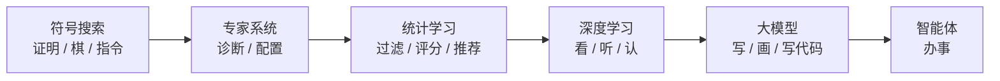

# 人工智能发展编年史：六种技术、各自场景与五次换代

> 七十余年不是直线起飞，而是锯齿线。寒冬多半是**承诺跑得比当时能力快**；爆发多半是表示、数据与算力重新对齐，再加一层普通人用得上的产品。
>
> 大模型不是无源突变。它是深度学习在规模、架构与产品形态上的延续。产业如何穿透企业，见 [50](../50-strategy/50-ai-industry-disruption-strategy.md)。

## 摘要

「人工智能」（artificial intelligence）一词系统见于 1955 年达特茅斯夏季研究提案，因 1956 年会议成为学科之名。思想前史可溯至 1943 年 McCulloch–Pitts 神经元模型；研究起点常记 1950 年图灵测试。[1][2][3]

读这篇，不必先背术语。先记住一件事：**每一代所谓「智能」，其实是在替人做一类具体的事**——证明定理、按手册诊断、过滤垃圾邮件、认出照片里的物体、按提示写文写代码、再进一步调用工具把事情做完。技术换代，换的是「这件事怎么做」：人手写规则、从例子里统计、把特征也交给数据学、再做成大规模生成，最后接上工具循环。

技术上宜分清六种办法：符号搜索、专家系统、统计机器学习、深度学习、大模型、智能体。史上可按五阶段把握：符号主义 → 专家系统（两次寒冬穿插其间）→ 机器学习 → 深度学习 → 大模型（智能体是其延伸，不是另起的史段）。产业叙事另可粗分为计算智能、感知智能、生成智能。[4]

贯穿始终的主线有三条：**世界被写成什么**（棋盘、规则、表格特征、像素、文本片段）、**运行时在算什么**（搜索、拟合、生成、调用工具）、**谁付钱、什么产品走进生活**。阶段跃迁，几乎都是三条同时改写。

**三个直接答案**

1. **词从哪来？** 1955 年提案写出 *artificial intelligence*；1956 年达特茅斯会议立科。  
2. **经历哪些阶段、各用在哪？** 上列五阶段。符号时代演示证明与对话；专家系统做诊断与配置；统计学习做过滤、评分与推荐；深度学习做看、听、认；大模型做写、画、写代码；智能体尝试办事。对照 §1 场景表与 §10 对齐表。  
3. **大模型属哪一段？** 第五阶段。本质是大规模按提示生成；对话框使之破圈，工具循环使之能办事。

**关键词：** 符号主义；专家系统；机器学习；深度学习；Transformer；大模型；智能体；使用场景；AI 寒冬

---

## 目录

- [摘要](#摘要)
1. [如何阅读：场景先于术语](#1-如何阅读场景先于术语)
2. [六种技术：白话、场景与失效方式](#2-六种技术白话场景与失效方式)
3. [起源：神经元模型、图灵测试与命名](#3-起源神经元模型图灵测试与命名)
4. [符号主义与第一次寒冬](#4-符号主义与第一次寒冬)
5. [专家系统与第二次寒冬](#5-专家系统与第二次寒冬)
6. [统计学习转向、深蓝与深层网络火种](#6-统计学习转向深蓝与深层网络火种)
7. [深度学习上台：从 AlexNet 到 AlphaGo](#7-深度学习上台从-alexnet-到-alphago)
8. [大模型：Transformer、预训练到破圈](#8-大模型transformer预训练到破圈)
9. [智能体：从会聊到办事](#9-智能体从会聊到办事)
10. [回收：阶段、场景与可带走的判断](#10-回收阶段场景与可带走的判断)
11. [节点年表](#11-节点年表)
12. [参考文献](#12-参考文献)

---

## 1. 如何阅读：场景先于术语

这篇是技术史，不是名词手册。遇到陌生词，先问两句就够：

| 尺 | 所问 | 落点 |
|----|------|------|
| **场景尺** | 这一代替人做什么？谁真的用过？今天还剩什么？ | 下表；§4–§9 各段「当时用在哪」 |
| **办法尺** | 知识从哪来？运行时在算什么？错了怎么暴露？ | §2 词典；经费与产品则见 ALPAC、莱特希尔报告、DARPA、ChatGPT [5][6][12] |

结构性张力始终在：**对外许诺的是通用智能，对内能支付的只有当时那套表示、搜索、算力与数据。** 寒冬一再发生，原因长得很像：承诺付不起。爆发一再发生，条件也长得很像：算法、数据、算力对齐，再加一层好用的界面。

### 1.1 一张表：每一代替人做什么

先建立日常坐标。后文的人名、论文与寒冬，都是在给这张表补证据。

| 大约年代 | 这一代的办法 | 它擅长的事（场景） | 你今天还能看见的形态 | 它不擅长的事 |
|----------|--------------|--------------------|----------------------|--------------|
| 1950s–1970s | **符号搜索** | 证明定理、下棋、在积木世界里执行指令、按模板对话 | 编译器、形式化验证、部分规划与规则引擎的思想祖先 | 模糊、开放的真实世界 |
| 1970s–1980s | **专家系统** | 按手册诊断、配置复杂订单、在窄域给出可复核建议 | 核保规则、税务逻辑、临床路径、运维手册自动化 | 规则一多就维护不动；域外即无能 |
| 1990s–2000s | **统计机器学习** | 拦垃圾邮件、信用评分、推荐、搜索排序、语音识别 | 广告点击预测、反欺诈、推荐流、风控模型 | 特征靠人设计；数据分布一变就掉点 |
| 2010s | **深度学习** | 认出图像与语音、医学影像辅助、安防与质检、围棋 | 手机解锁、相机识景、语音转写、工业视觉 | 默认是「认出来」，不是「按指令做出来」 |
| 2017– | **大模型** | 写作、翻译、摘要、写代码、文生图、客服草稿 | 对话助手、编程补全、办公套件里的生成功能 | 会编造；事实与责任难溯源 |
| 2022– | **智能体**（大模型之延伸） | 多步调用检索、代码、浏览器、业务接口，把任务做完 | 带工具的助手、工单与运维编排；多数仍需人审核 | 目标含糊、权限与评测不足时会乱调用 |

§2 的六种办法与 §4–§9 一一对应。五阶段用来排叙事顺序，六种办法用来解释每一代到底在算什么。智能体记为第五阶段之延伸，不是第六史段。

---

## 2. 六种技术：白话、场景与失效方式

给任何系统定性，先问四句（不必一次记住术语）：

1. **知识从哪来？** 人手写规则，还是从数据里估出来？  
2. **运行时在算什么？** 在规则里搜索匹配，还是把数字往前推一遍（有时再采样）？  
3. **交到用户手里的是什么？** 证明步骤、标签或分数，还是一段新文本、一张图、一串操作？  
4. **错了怎么被看见？** 规则打架、分布外掉点、一本正经地编造，还是把工具调错？

| 办法 | 一句话 | 典型场景 | 运行时看得见什么 | 典型失效 |
|------|--------|----------|------------------|----------|
| **符号主义** | 把世界写成符号，按逻辑与搜索找答案 | 定理证明、棋类、积木世界指令 | 规则、搜索树、可复核的证明或走法 | 可能性数目爆炸，搜不完；世界一模糊，规则不够 [6] |
| **专家系统** | 把某领域专家的判断写成大量「如果—那么」 | 质谱推断分子结构、感染用药建议、小型机订单配置 | `if–then`、咨询式建议 | 获取贵、难维护、域外即死 |
| **统计机器学习** | 从许多例子里估一个「输入 → 输出」的对照 | 垃圾邮件、信用分、推荐、搜索排序 | 特征 → 分数或标签 | 特征靠人；分布一移就掉点 |
| **深度学习** | 连「该看哪些特征」也从数据里学，网络可以很深 | 图像识别、语音转写、医学影像、围棋 | 对用户是标签、检测框、转写文字 | 需大数据与算力；默认偏识别 [38] |
| **大模型** | 在海量序列上训练，按提示生成下一段内容 | 对话、写作、编程、翻译、文生图 | 提示 → 文字、代码或图像 | 一本正经地编造（幻觉）；事实与责任难溯源 [11] |
| **智能体** | 模型 + 工具 + 多步循环，不只回答而是办事 | 检索后作答、改代码并跑测试、处理工单 | 计划、调用、观察、再计划 | 目标含糊、权限与评测不足 [4] |

史实锚点在对应编年节展开。深蓝是封闭规则下的搜索旁支，不要与统计学习或深度学习混为一谈：它算赢了国际象棋，并没有从棋谱里「学会看棋」。

---

## 3. 起源：神经元模型、图灵测试与命名

### 3.1 形式先声（1943）：先把「神经计算」写成公式

1943 年，Warren S. McCulloch 与 Walter Pitts 用逻辑演算描述神经元网络，把「神经计算」写成可分析的形式系统。[3] 这是连接主义的早期锚点：单元与联结可以计算。它还不是后来靠梯度与大规模数据训练出来的深层感知系统——更接近「神经也可以用逻辑来想」，而不是「用数据训出一个能认猫的网络」。

**后来变成了什么：** 这条线在制度上长期让位于符号派，却在 1980 年代以反向传播、2010 年代以深度学习的形式重新成为主流。今天手机解锁、语音转写，谱系上连到这里，中间隔了几十年的冷遇。

### 3.2 可操作的判据（1950）：把「机器能思考吗」改成一场模仿游戏

1950 年，Alan Turing 在 *Mind* 发表 *Computing Machinery and Intelligence*，把「机器能思考吗」改写成模仿游戏：若裁判无法通过对话稳定区分人与机器，则可认为机器表现出相应水平的智能。[2] 测试在哲学上争议不断——它测的是「像人」，还是「真理解」——但作为研究起点的公共坐标已经稳固。空泛的本体论问题，部分被改写成可观察的行为判据。

**后来变成了什么：** 公众至今仍用「聊得像不像人」来判断 AI。1966 年的 ELIZA、2022 年的 ChatGPT，成功方式截然不同，但都撞上了同一块试金石：对话是最容易被大众看见的智能。

### 3.3 命名与立科（1955–1956）

1955 年 8 月 31 日，John McCarthy、Marvin Minsky、Nathaniel Rochester、Claude Shannon 提交《达特茅斯人工智能夏季研究项目提案》，拟于 1956 年夏在达特茅斯学院进行约两个月、约十人的研究，并陈述核心猜想：

> learning or any other feature of intelligence can in principle be so precisely described that a machine can be made to simulate it.[1]

**artificial intelligence** 由此成为领域自称。提案列出的议程——使用语言、形成抽象与概念、解决当时仅人类能解决的问题、自我改进——七十年后仍像一份未完成的产品路线图。[1]

1956 年夏会议召开，日程松散，人员进进出出。Allen Newell、Herbert Simon 与 Cliff Shaw 的 **Logic Theorist**（逻辑理论家）被带到会上：该程序证明了 Whitehead 与 Russell《数学原理》第二章前 52 条定理中的 38 条，并为定理 2.85 找到比原书更短的证明。[7] 符号主义的「黄金十年」由此有了可演示的开场——**第一批「应用」就是数学证明**，观众是逻辑学家，不是医院或工厂。

命名划出独立于控制论圈子的领地，也埋下定义困难：智能缺少单一可证伪的操作定义，「已经实现」与「已经失败」的口号会周期性回潮。可观察遗产是：学科有了名字、议程与第一批程序；同时留下「一个夏天推进重大问题」的系统性低估。

---

## 4. 符号主义与第一次寒冬

↔ **办法：符号搜索**　**场景：证明、下棋、微观世界里的指令与对话**

### 4.1 这一代在做什么：像在棋盘上按规则找下一步

1950 年代末至 1960 年代，主流路径是符号主义：把问题写成符号状态，用逻辑规则与搜索（穷尽或启发式）求解。「智能」看起来像可读的推理轨迹——证明步骤、博弈走法、积木世界指令——而不是从数据里拟合一条曲线。Newell、Shaw 与 Simon 随后的 **General Problem Solver**（通用问题求解器）把「手段—目的分析」做成可运行的启发式搜索：先看目标与现状差在哪，再选能缩小差距的动作。[8]

可以把它想成：人先把世界翻译成棋盘和棋规，机器再在棋盘上找路。翻译这一步必须由人做完；机器不会自己发明棋规。

### 4.2 当时用在哪

同期高光不必都算符号主义，但同属乐观年代。对今天的读者，重要的是**它们各自演示了哪类产品**：

| 系统 | 时间 | 当时的使用场景 | 用户实际看到什么 | 限度 |
|------|------|----------------|------------------|------|
| **Logic Theorist / GPS** | 1956 起 | 数学证明、一般问题求解的演示 | 一条可逐步复核的证明或求解路径 | 只在形式化好的玩具问题上好看 |
| **LISP** | 约 1958–1960 | 符号 AI 的工作语言，不是面向公众的应用 | 研究人员用来写规则与表处理程序 | 语言本身不解决知识从哪来 [9] |
| **感知机** | 1958 | 从例子调权重的分类器，并推动 Mark I 硬件 | 把图案分成两类；媒体一度极度乐观 | 单层能力有天花板；当时还不是今天的深度网络 [16] |
| **Samuel 跳棋** | 1959 | 自我对弈改进棋力；「机器学习」一词早期有实物 | 能下棋，且越下越好 | 封闭棋规，推不到开放世界 [17] |
| **ELIZA** | 1966 | 按模板模仿罗杰斯式心理治疗对话 | 用户打字，程序用模式匹配把话抛回来 | 作者本意是研究误解；公众容易当成「懂了」[18] |
| **SHRDLU** | 1968–1970 | 积木世界里理解并执行自然语言指令 | 「把红色积木放到蓝色积木上」，还能回答「刚才为什么这么做」 | 桌子一旦换成真实房间，手写程序不再够用 [19] |

在受限微观世界里，这些演示看起来离「通用」只有一步之遥。ELIZA 尤其像今天聊天产品的远祖：**场景已经是对话，办法却只是关键词替换**。SHRDLU 则像极简版「语音控家居」——前提是家里只有几块积木，且每块都有精确的符号名字。

### 4.3 乐观为何不可扩展

局限是结构的，不是某次实现没写好：

- **知识与规则需人手穷尽。** 真实世界模糊，例外无穷。医院、街道、合同里的「差不多」，写不成完备规则。  
- **搜索空间组合爆炸。** 玩具问题可解，规模一大，启发式也救不过来——这是莱特希尔报告的核心批评。[6]  
- **单层感知机的数学天花板。** 1969 年 Minsky 与 Papert 的 *Perceptrons* 指出单层感知机无法表达异或等结构，沉重打击当时神经网络的经费与士气；多层网络如何训练，当时看不到现实解法，符号路线在制度上更占上风。[20]

ELIZA 与 SHRDLU 的高光也有同一盲点：微观世界一旦打开，模式匹配与手写程序不再够用。实验室里能「理解」积木，并不等于能理解一份保险条款。

### 4.4 第一次寒冬：从机译收缩到经费总闸

宜把两刀分开，不要写成同一天发生的一件事。

**1966，ALPAC 报告**针对的是一个非常具体的应用：**机器翻译**。冷战背景下，美国希望计算机把俄语科技文献译成英语。十年投入未达「更快、更便宜、更好」，委员会建议收缩对全自动高质量翻译的资助。这是机译线的重创，还不是整个学科的寒冬。[5]

**1973，莱特希尔报告**受英国科学研究委员会委托，对 AI 作外部评估：诸多子领域未能兑现承诺，玩具方法难以扩展到真实世界规模。[6] **约 1974 年起**，美国 DARPA 等对开放式、缺少明确任务指标的 AI 资助明显收紧。第一次寒冬通常记为 1970 年代中后期。

可观察信号：论文与演示还在，**经费曲线与岗位曲线**先折下去。第一次寒冬不是「AI 永远不行」，而是通用承诺在当时的表示与算力下不可支付。机译这一场景后来并没有消失——它在统计方法和神经网络里被重做了一遍，直到 Transformer 才真正走进日常产品。

---

## 5. 专家系统与第二次寒冬

↔ **办法：知识库 + 推理机**　**场景：窄域诊断、配置、按手册给建议**

### 5.1 这一代在做什么：把专家判断写成一本可执行的手册

解冻靠收缩目标：既然造不出通用智能，就先做只懂一件事的专家。Edward Feigenbaum 一派强调「知识就是力量」——架构是 **知识库（大量 `if–then`）+ 推理引擎**。人把「如果血培养是革兰氏阴性杆菌、且病人对青霉素过敏，则……」写成规则，机器按规则链式推出建议。

它与上一阶段的差别不在「会不会搜索」，而在**知识从哪来**：符号派曾幻想少量通用原理就够；专家系统承认，真正值钱的是领域里那几千条经验。

### 5.2 当时用在哪：三个真正进过业务的例子

| 系统 | 时间与域 | 谁在用、用来干什么 | 交到手里的产出 | 限度 |
|------|----------|--------------------|----------------|------|
| **DENDRAL** | 1960 年代中期起；有机质谱 | 化学家：由质谱数据推断可能的分子结构 | 可复核的结构假设，辅助实验室，而不是取代实验 | 域极窄 |
| **MYCIN** | 1970 年代；血液感染与抗生素 | 医生（研究与评估场景）：按症状与化验给用药建议 | 域内评估接近专家；带可信度因子的建议清单 | 未成为医院常规工具——责任、集成与知识维护都过不去 [21] |
| **XCON / R1** | 约 1980；CMU 为 DEC 配置 VAX 订单 | 销售与制造：客户选了一堆部件，机器检查能否配在一起并出配置单 | 进入企业采购，减少配错、缩短配置时间 | 规则维护随产品目录膨胀而恶化 |

这是符号主义第一次摸到**可开票的应用**：规则条数、知识工程师人时、域内准确率成为可管理指标。XCON 尤其重要——它不是论文演示，而是 DEC 卖小型机时的生产环节。1980 年代，Symbolics 等 LISP 专用硬件一度繁荣。日本通产省 **第五代计算机**项目（1982–1992）押注逻辑编程与大规模并行的智能机器，是同期最大的国家级注码。[22]

### 5.3 今天还能看见什么

专家系统作为品牌几乎消失，作为办法没有消失。你今天碰到的常常不再叫「人工智能」：

- **保险核保、信贷政策引擎：** 「收入低于某线且负债比高于某线 → 拒绝或加审」——仍是规则。  
- **税务与合规：** 申报软件把税法写成决策树。  
- **临床路径与处方警示：** 医院信息系统里的过敏、相互作用检查。  
- **IT 运维手册：** 「告警 A 且服务 B 超时 → 先重启再升级」——自动化 runbook。

差别在于：当年把这些说成「智能」；今天把这些说成「业务规则」。当规则稳定、例外可枚举、还需要可解释的责任链时，专家系统的办法仍然正确。当例外无穷、知识更新快过工程师书写速度时，它会再次失败——这正是第二次寒冬的机制。

### 5.4 第二次寒冬：维护成本与硬件泡沫

失效同样可观察：

- **知识获取瓶颈。** 专家口述慢、贵；规则一多就冲突，变更成本超线性。VAX 每出一款新配件，XCON 就要加人维护。  
- **不会自学。** 域外无规则即无能，与「通用智能」叙事再次脱节。MYCIN 不会因为看过一万份病历就自动长出新规则。  
- **约 1987。** 通用工作站性能追上昂贵的专用 LISP 机，硬件生态失势；第五代计划 1992 年结束，未达预定目标。[22]

「人工智能」在部分采购与投资语境中成了忌讳词。研究者改挂「机器学习」「模式识别」「数据挖掘」等名——后来所谓寒冬里的伪装。那些名字对应的，正是下一节：不要专家口述规则，改从历史数据里估规则。

| | 第一次寒冬 | 第二次寒冬 |
|---|------------|------------|
| 失效机制 | 符号搜索不可扩展 | 知识库不可维护、不学习 |
| 砸在哪个场景上 | 机译未达「又快又便宜又好」；玩具问题扩不到真实世界 | 诊断与配置能做，但规则维护与专用硬件先垮 |
| 制度信号 | ALPAC（机译）；莱特希尔；DARPA | LISP 机泡沫；第五代落空 |
| 余波 | 实验室收缩 | 改名；统计方法暗中积累 |

两次寒冬的共同点，仍是承诺与能力之间的鸿沟。不同点是：一次砸在「搜索扩不出去」和外部评估报告上，一次砸在「知识写不完、专用硬件卖不动」上。

---

## 6. 统计学习转向、深蓝与深层网络火种

↔ **办法：从样本估计映射**（深蓝为搜索旁支）　**场景：过滤、评分、推荐、排序；旁支是封闭规则下棋**

### 6.1 这一代在做什么：不要专家口述，改看历史里「以前怎么办的」

1990–2000 年代，领域少谈「造出通用智能」，多用可测指标做窄任务。做法是：收集许多带标签的例子（这封邮件是不是垃圾、这笔贷款后来有没有违约），让算法估一个从输入到输出的对照关系 \(f:x\mapsto y\)。优化的是**没见过的新样本上错多少**（留出测试集上的误差，或 AUC 这类排序指标），不是「是否像人」。

特征仍常靠人手设计——工程师要先决定「用词频、发件人域名、历史点击」哪些算数。这是与深度学习的分界：统计学习把**决策**交给数据，把**该看什么**留给人。

### 6.2 当时用在哪：这一代真正走进了日常生活

| 场景 | 机器在干什么 | 用户或业务看到什么 | 为何统计方法合适 |
|------|--------------|--------------------|------------------|
| **垃圾邮件过滤** | 根据词、链接、发件模式给「是垃圾」的分数 | 收件箱少了很多推销信；偶有误伤 | 例子极多，错了可改，容错成本低 |
| **信用评分 / 反欺诈** | 由历史还款与交易行为估计风险 | 批贷更快；异常刷卡被拦 | 要的是分数与排序，不必「理解」人生 |
| **推荐系统** | 由「谁看过什么」估计你下一步可能点什么 | 电商、视频、资讯的「猜你喜欢」 | 目标清晰（点击、完播），可在线试错 |
| **搜索排序** | 由点击与网页特征估计相关性 | 关键词对上更有用的十条结果 | 每天有海量反馈，适合持续拟合 |
| **语音识别（隐马尔可夫模型等）** | 把声波切成可能的音素与词序列 | 早期语音拨号、听写；错误率仍高 | 序列有统计结构，但特征仍很手工 |
| **视觉中的传统特征** | SIFT、HOG 等手工描述子 + 分类器 | 人脸检测、简单物体识别 | 能用，但一换光照、角度就脆弱 |

这一代的产业含义是：AI 第一次成为**互联网公司的默认引擎**，只是产品经理很少把它叫作人工智能。你每天刷到的推荐、拦下的垃圾邮件、搜出来的十条链接，多数是统计学习的后裔。

### 6.3 深蓝：计算智能标本，不是「从棋谱里学会看棋」

1996 年，IBM 深蓝在费城六局中以 2–4 负于卡斯帕罗夫。1997 年 5 月 3–11 日纽约复赛，深蓝以 **3.5–2.5** 取胜，成为在标准赛制下击败在位世界冠军的第一台计算机。IBM 公布的搜索速度约为每秒 **2 亿**个局面；系统靠专用棋类芯片与大规模并行，而不是从棋谱学到深层「棋感」。[23][24]

**场景很清楚：标准赛制的国际象棋。** 产业三分法里，这是**计算智能**的高峰：封闭规则、完美信息、强搜索执行器。它不能自动推广到开放世界的感知与生成——会下国际象棋，并不会因此会认路、会看病、会写邮件。勿与统计学习混为一谈，更勿与深度学习混为一谈。

深蓝的公共价值主要是示范：在规则封闭的竞技场，算力加搜索可以超过人类顶尖选手。它没有打开「从数据里学世界」这条产业通道。打开通道的，是下面这些当时还不显赫的火种。

### 6.4 火种：反向传播、LSTM、深信网、ImageNet

连接主义并未死绝，只是长期失宠。对场景而言，它们各自垫了后来哪一块：

- **1986** Rumelhart、Hinton、Williams 在 *Nature* 阐明用反向传播学习内部表征（网络中间层自己形成的有用特征），使多层网络的梯度训练进入主流视野。数学源头可上溯多次独立发现；这篇使「真能学到有用中间特征」被广泛看见。[25] **后来用在：** 几乎所有现代深度网络的训练。  
- **1989–1998** Yann LeCun 等将卷积网络用于**手写数字**（支票、邮政编码一类任务），证明局部连接与权值共享在视觉上可行。[26] **后来用在：** 银行支票识别是早期工业场景；再往后是 ImageNet 级物体识别。  
- **1997** Hochreiter 与 Schmidhuber 提出 **LSTM**，缓解长序列上的梯度问题。[27] **后来用在：** 2010 年代一批语音识别与机器翻译线上系统。  
- **2006** Hinton、Osindero、Teh 关于深度置信网的工作，重开「深层可预训练」叙事，并为「深度学习」正名。[28]  
- **2009** Deng 等发布 **ImageNet**：约 **1400 万**张标注图像、两万余类；2010 年起举办 ILSVRC（竞赛子集约为 120 万张、1000 类）。赌注是：算法不行，也许首先是数据不够。[29] **场景就是：** 给照片打上「这是哪种物体」的标签——识别，不是生成。

算法传统（反传、卷积、LSTM）、GPU 并行、大数据集——三要素在 2012 年前分别就位，尚未在同一公开榜单上同时炸开。

---

## 7. 深度学习上台：从 AlexNet 到 AlphaGo

↔ **办法：可学习的深层特征**　**场景：看、听、认；旁支是围棋**

### 7.1 这一代在做什么：连「该看哪些特征」也不用人手画了

上一阶段要工程师先发明「边缘、纹理、词袋」；深度学习把这一步也交给数据。网络很深，每一层把原始输入（像素、声波）改写成更有用的内部表示。对用户来说，交出来的多半仍是**标签、检测框、转写文字**——能认出「这是猫」，默认还不会按指令「画一只猫」。[4]

### 7.2 2012：AlexNet 把三要素写成榜单事实

Krizhevsky、Sutskever、Hinton 的 **AlexNet** 在 ILSVRC 2012 取得 **15.3%** 的 top-5 测试错误率（七网络集成；单网络为 18.2%）；第二名（手工视觉特征 + Fisher Vector 等）为 **26.2%**。成熟视觉竞赛里，年度通常只挪一两个百分点；十个百分点是台阶，不是噪声。[38]

网络约 6000 万参数，用两块 NVIDIA GTX 580 训练。卷积与反向传播并不全新——Ciresan 等已在较小竞赛中用 GPU 卷积网络取胜——新的是可观察组合：ImageNet 级数据 + 可训练深度卷积 + 跑通的训练配方（ReLU、Dropout、数据增强）。[38][39]

### 7.3 当时用在哪，后来进了哪些产品

产业进入**感知智能**：语音、视觉、若干自然语言任务从不好用到可以用。下面这些场景，才是 2010 年代普通人真正碰到「AI」的地方。

| 场景 | 机器在干什么 | 产品形态 | 仍做不到的 |
|------|--------------|----------|------------|
| **图像识别与检索** | 给照片打标签、找相似图 | 相册自动分类、以图搜图 | 不理解照片背后的故事 |
| **人脸与解锁** | 把脸映射成可比对的向量 | 手机解锁、安检与门禁 | 偏见、对抗样本、隐私争议 |
| **物体检测** | 在画面里框出人、车、缺陷 | 安防、自动驾驶感知、工业质检 | 封闭场地好用，开放道路仍要冗余系统 |
| **医学影像辅助** | 在 CT / 眼底 / 病理切片上标可疑区域 | 辅助筛查，通常需医生复核 | 不能单独承担诊断责任 |
| **语音识别** | 声波 → 文字 | 语音助手、会议转写、字幕 | 口音、噪声、专业术语仍会错 |
| **机器翻译（神经时期）** | 一句对一句生成译文 | 在线翻译开始「能用」 | 术语、文学与高风险文本仍需人 |

对架构师与产品经理，这一代的教训很具体：**哪里有大量带标签的感知数据、容错成本可接受、输出又是标签或短序列，深度学习就先落地。** 拍照识物、语音转写、产线质检符合；开放域的医疗决策、法律判决不符合——不是模型「不够智能」这一句话能概括的，而是错误代价与责任链不同。

### 7.4 2016–2017：AlphaGo——深度学习加搜索的博弈高峰

围棋分支因子远高于国际象棋，穷尽硬算不可行。2016 年 3 月，DeepMind 的 **AlphaGo** 以 **4:1** 战胜李世石：策略网络与价值网络提供走法与局势估计，蒙特卡洛树搜索负责规划，自我对弈数据用于改进。[30] 第二局第 37 手被职业棋手起初视为失误，随后公认为好棋——可观察印象是：策略可以来自人类棋谱分布之外。

2017 年 10 月，**AlphaGo Zero** 在 *Nature* 发表：不使用人类棋谱，从零自我对弈，并迅速超过战胜李世石的版本。[31]

**场景仍是围棋。** 逻辑归属仍是深度学习高峰（从棋谱与自我对弈中学习走法与局势估计，再用搜索做规划），尚未进入大规模预训练语言模型范式。与深蓝的差异可以看出来：深蓝几乎不学「棋感」，主要靠算；AlphaGo 显式学习策略网络与价值网络，再搜索。它证明「感知 + 搜索」能在极难的封闭游戏里超过人类，但不会自动变成客服或编程助手——那些要等到生成式大模型。

---

## 8. 大模型：Transformer、预训练到破圈

↔ **办法：大规模条件生成**　**场景：翻译、搜索理解、写作、编程、对话、文生图**

### 8.1 这一代在做什么：按你的提示，续写最可能的下一段

大模型的核心不是「有了一个灵魂」，而是：在海量文本（后来还有图像、代码、语音）上训练，学会在给定前文时生成后文。你写一个提示（prompt），它采样出一段看起来合理的续写。这是训练分布上的统计生成，不等于人类意图、理解或问责；但文本与代码的边际生产成本被显著压低。[4]

与深度学习主流十年的差别是输出形态：以前多是「这是猫 / 不是猫」；现在是「按你的说明写一段、画一张、补几行代码」。

### 8.2 架构：注意力就是一切（2017）——先用在翻译

Vaswani 等 *Attention Is All You Need* 提出 **Transformer**：去掉循环与卷积，仅靠注意力机制把一句（或一段）转换成另一句。所谓注意力，直观上是：生成每一个词时，动态决定要「看」输入里的哪些位置。在 WMT 2014 英德翻译上，大号模型达到 28.4 BLEU（机器翻译常用分数），并可在八块 GPU 上数日内完成训练。[10]

**当时的使用场景就是机器翻译：** 一句源语言进，一句目标语言出。这篇论文的工程含义比分数更长远：训练可以横向堆加速器，规模化从工程上变得可行。此后仅解码器（decoder-only）的 Transformer 成为主流大语言模型底座——同一块积木，从「翻译」搬到了「通用续写」。

### 8.3 预训练范式：BERT、GPT 到 GPT-3（2018–2020）

- **GPT-1**（Radford 等，2018）：先做从左到右的续写训练，再在具体任务上微调。[32] **场景：** 先在大量无标注文本上学会续写，再对分类、问答等任务微调。  
- **BERT**（Devlin 等，2018）：双向读上下文，训练时遮住部分词再猜回来；强调先通用预训练、再下游微调。[33] **场景：** 搜索与理解类任务——判断两句是否同义、从段落里抽答案、给查询更好的文档匹配。Google 后来将 BERT 类模型用于搜索，是这一路线走进亿级用户产品的标志之一。  
- **GPT-3**（Brown 等，2020）：约 **1750 亿**参数，系统展示少样本与零样本——许多任务不必再训练，只需在提示里给几个例子（或只给指令）即可完成。[11] **场景：** 写作、问答、初步编程；开发者开始用 API 而不是为每个任务训一个小模型。

能力形态跨入**生成智能**：按条件产出新的文本候选；扩散等路线随后把同一逻辑扩到图像（文生图、图生图）。办公、设计、营销里「先出一版草稿」成为默认用法。

**缩放律**把「做大」部分地从手艺变成可讨论的工程问题。Kaplan 等（2020）报告：模型越大、数据越多、算力越足，预测误差大致按幂律下降。[34] Hoffmann 等（2022，Chinchilla）修正了算力最优配比：在给定算力下，许多大模型训练数据不足，参数量与训练文本量（以 token，即切分后的文本片段计）宜近似同比例放大。[35] 资本因而更容易为规模下注，但最优配方并非一次写死。

### 8.4 产品破圈：ChatGPT 与对齐（2022）——场景从实验室搬进对话框

2022 年 11 月 30 日，OpenAI 发布 **ChatGPT** 研究预览：基于 GPT-3.5 系列，以对话界面提供能力，并强调来自人类反馈的强化学习（RLHF）。InstructGPT 一脉已表明：用人类偏好微调，可使模型更跟随指令、少编造、少有害输出。[12][36]

宜分开两件事：

- **模型能力**——GPT-3 已展示少样本；  
- **产品形态**——对话框 + 对齐后的可用行为。

技术增量未必等于产品革命。把已有能力交给无技术背景的大众，才造成破圈。2023 年 GPT-4 等多模态能力进入公众演示；各地出现密集的大模型发布。竞争从论文榜单扩展到 API、开放权重、推理成本与应用生态。

**这一代走进生活的具体用法：**

| 场景 | 典型用法 | 已经比较稳的部分 | 仍然危险的部分 |
|------|----------|------------------|----------------|
| **写作与办公** | 邮件、纪要、方案初稿、翻译、摘要 | 有原文可对照时的改写与压缩 | 无出处的「事实」、数字与引用 |
| **编程** | 补全、解释报错、写测试、小范围重构 | 样板代码、熟悉框架里的重复劳动 | 安全漏洞、过时 API、看起来能跑其实错了 |
| **客服与内部问答** | 用文档回答员工或客户的常见问题 | 高频、政策清晰、可检索的条目 | 政策例外、承诺赔偿、法律效力 |
| **学习与检索** | 解释概念、出练习、对照笔记提问 | 入门讲解、结构化复习 | 把流畅当成正确；考试与专业资格场景 |
| **图像与设计** | 文生图、海报草稿、产品概念图 | 情绪板、探索性创意 | 版权、品牌一致性、精细排版 |
| **数据分析草稿** | 把表格说成人话、生成查询语句 | 有人复核 SQL 与口径时 | 静默用错列、编造趋势 |

对决策者，有用的分界是：**输出会被人核对、错误可逆的任务，先上；输出直接产生法律、医疗或资金后果的任务，不能只靠一次生成。** 「幻觉」不是边角料，而是这种办法的默认失效模式：模型被训练成「把句子写完」，没有被训练成「我不知道就说不知道」——除非产品层用检索、引用与拒答把它按住。

### 8.5 科学承认（2024）

2024 年诺贝尔**物理学奖**授予 John Hopfield 与 Geoffrey Hinton，「for foundational discoveries and inventions that enable machine learning with artificial neural networks」。[13]

同年**化学奖**：一半授予 David Baker，「for computational protein design」；另一半授予 Demis Hassabis 与 John Jumper，「for protein structure prediction」（AlphaFold）。[14]

这不是口号「AI 拿了诺奖」，而是两条可核对的授奖理由：物理启发的学习方法，与 AI 驱动的科学工具，同时进入最高科学表彰体系。**AlphaFold 的使用场景是结构生物学：** 给氨基酸序列，预测蛋白质三维结构，大幅缩短「先猜结构再做实验」的循环。结构预测仍然要实验验证——工具扩展了科学家能尝试的范围，并不自动替换判断。

---

## 9. 智能体：从会聊到办事

↔ **办法：模型 + 工具 + 多步循环**　**场景：检索后作答、改代码并验证、工单、浏览器操作**

### 9.1 这一代在做什么：不只把话说完，还按步骤调用工具

无工具时是聊天或生成；有工具与外部状态时才是办事。差别像「告诉你怎么订票」和「真的打开系统把票订上」。Yao 等（2022）的 **ReAct** 把推理轨迹与行动交错：模型先想、再调用、再观察、再想。[37] 产业实践中，智能体外挂检索、代码执行、浏览器、业务 API，循环执行：

**计划 → 行动（调用）→ 观察 → 再计划。**

可观察焦点从「单次回答好不好」转为：整条轨迹是否达成目标、调用是否合规、人工介入几次。评测必须含轨迹与副作用，不能只用静态题库。[4]

### 9.2 当时和现在用在哪

| 场景 | 智能体具体在做的事 | 需要接上的工具 | 失败时会怎样 |
|------|--------------------|----------------|--------------|
| **检索增强问答** | 先搜内部文档再组织答案 | 搜索引擎、知识库 | 检索错文档，就会一本正经答错 |
| **编程助手进阶** | 改代码、跑测试、根据失败再改 | 编辑器、终端、测试框架 | 乱改无关文件；测试绿了逻辑仍错 |
| **客服与工单** | 查订单、按政策退换、升级人工 | CRM、订单与支付接口 | 误退款、越权查询、对用户乱承诺 |
| **运维与 SRE** | 查指标、翻日志、提出或执行变更 | 监控、日志、工单、发布系统 | 在错误假设下重启或扩容 |
| **浏览器与办公操作** | 填表、抓取、跨多个网页完成流程 | 浏览器、邮箱、表格 | 点错按钮；对验证码与反爬脆弱 |
| **数据分析** | 写查询、出图、解释口径 | 数仓、BI、笔记本环境 | 用错表或过滤条件，报告看起来仍完整 |

与大模型聊天功能相比，智能体把风险从「说错话」扩大到「做错事」。所以企业里能规模化的，几乎都带着权限、审计日志和人在环上（HITL）：模型可以起草，签字与资金操作仍归人。更完整的组织与战略含义，见 [50](../50-strategy/50-ai-industry-disruption-strategy.md) 与本库 [41](../40-paradigm/41-ai-engineering-paradigm.md)、[42](../40-paradigm/42-agentic-sre-operations-playbook.md)。

### 9.3 2025：推理模型与开放权重

2025 年 1 月 20 日，DeepSeek 发布 **DeepSeek-R1** 等推理向模型，强调开放权重、推理基准与相对成本，迅速成为全球讨论焦点。相对闭源旗舰的优劣随版本与基准变化，应以官方技术报告与独立评测为准。[15]

竞争焦点转向推理时算力、开源生态、工具协议，以及企业侧的权限、评测与编排——即本库 [50](../50-strategy/50-ai-industry-disruption-strategy.md) 所说的智能体与企业操作系统。具身智能与人形机器人把同一逻辑伸向物理世界：计划与调用仍在，工具变成手臂、轮子与传感器。对「元年」「调用量反超」「全球最大」等通稿，本文不升格为已审计事实。

---

## 10. 回收：阶段、场景与可带走的判断

### 10.1 五阶段 × 六种办法 × 用在哪

| 史段 | 主导办法 | 编年 | 当时的主场景 | 标志性可核对事实 |
|------|----------|------|--------------|------------------|
| 符号主义 | 符号搜索 | §4 | 证明、下棋、积木世界指令、模板对话 | Logic Theorist（38/52）；ALPAC（机译）；莱特希尔 |
| 专家系统 | 知识库规则 | §5 | 质谱结构、感染用药、小型机配置 | MYCIN / XCON；LISP 机与第五代退潮 |
| 机器学习 | 统计拟合（深蓝为搜索旁支） | §6 | 垃圾邮件、信用、推荐、搜索；旁支是国际象棋 | 窄任务指标；深蓝 3.5–2.5 |
| 深度学习 | 深层表征 | §7 | 图像、语音、质检、医学影像辅助；旁支是围棋 | AlexNet 15.3% 对 26.2%；AlphaGo 4:1 |
| 大模型 | 预训练生成 → 延伸为智能体 | §8–§9 | 翻译、搜索理解、写作、编程、对话；再延伸为办事 | Transformer；GPT-3；ChatGPT；Agent |

### 10.2 产业三分（能力形态，不是另两段史）

| 形态 | 机器在做什么 | 对应你能看见的事 | 大致对齐 |
|------|--------------|------------------|----------|
| 计算 | 封闭规则下算赢 | 棋类冠军、定理证明演示 | 深蓝；早期搜索 |
| 感知 | 认出已有结构 | 相册分类、语音转写、人脸解锁 | AlexNet 起 |
| 生成 | 产出新候选 | 按提示写文、画图、写代码 | GPT 系、扩散等 |

生成之后若再接工具，就从「出草稿」变成「改世界」——智能体。能力形态变了，责任问题也变了。

### 10.3 今日产品对照（把史读回你的工具栏）

| 你正在用的东西 | 主要继承哪一代 | 不要误判成 |
|----------------|----------------|------------|
| 编译器、形式化验证、业务规则引擎 | 符号 / 专家系统 | 「已经过时所以无用」——稳定规则域里它仍是正解 |
| 垃圾邮件、推荐、风控分数 | 统计机器学习 | 「这就是大模型」——多数仍是表格特征 + 拟合 |
| 人脸解锁、语音输入、产线视觉 | 深度学习 | 「它理解了世界」——它在认，不在负责 |
| ChatGPT、Copilot、文生图 | 大模型 | 「它知道真伪」——它会把句子写圆 |
| 带检索、能点按钮、能跑命令的助手 | 智能体 | 「已经能无人值守」——缺权限与评测时，做错事比说错话更贵 |

### 10.4 可带走的判断

1. **先认办法和场景，再谈智能。** 规则、拟合、深层表征、序列生成、工具循环，不是同一个东西；证明定理、拦垃圾邮件、认猫、写代码、自动退款，也不是同一个产品。  
2. **场景比口号硬。** 问「用在哪、错了谁买单」，比问「算不算真正智能」更容易做决策。  
3. **寒冬的原因反复出现。** 承诺不可支付，经费与声誉先走。机译与专家系统都不是「想法错了」，而是当时付不起扩展与维护。  
4. **爆发的条件也反复出现。** 表示或算法、数据、算力对齐，再加一层产品界面。ChatGPT 的界面革命不小于模型革命。  
5. **大模型不是突变。** 规模化条件生成 + 对话产品；智能体是工具循环延伸。  
6. **下一问。** 生成变便宜之后，判断与问责归谁？护城河在专有数据与嵌入工作流的智能，而不是又一个通用对话框。[4]

---

## 11. 节点年表

| 时间 | 事件 | 主要场景 | 节 | 出处 |
|------|------|----------|----|------|
| 1943 | McCulloch–Pitts 神经元逻辑模型 | 形式理论，尚无产品 | §3 | [3] |
| 1950 | 图灵《计算机器与智能》 | 用对话当判据 | §3 | [2] |
| 1955-08-31 | 达特茅斯 AI 夏季研究提案 | 立科与议程 | §3 | [1] |
| 1956 | 达特茅斯会议；Logic Theorist（38/52） | 数学证明 | §3 | [1][7] |
| 1958–1960 | 感知机；LISP | 分类演示；研究语言 | §4 | [16][9] |
| 1959 | Samuel 跳棋与「机器学习」 | 跳棋 | §4 | [17] |
| 1966 | ALPAC 报告；ELIZA | 机译收缩；模板对话 | §4 | [5][18] |
| 1968–1970 | SHRDLU | 积木世界指令 | §4 | [19] |
| 1969 | *Perceptrons* | 理论打击当时神经网络 | §4 | [20] |
| 1973–约 1974 | 莱特希尔报告；DARPA 收缩 | 经费总闸 | §4 | [6] |
| 1970s–1980 | MYCIN、XCON | 感染用药建议；VAX 配置 | §5 | [21] |
| 1982–1992 | 日本第五代计算机 | 国家级逻辑机注码 | §5 | [22] |
| 约 1987 | LISP 机失势；第二次寒冬加深 | 硬件生态 | §5 | [22] |
| 1986 | 反向传播 *Nature* 文 | 多层网络可训练 | §6 | [25] |
| 1997-05 | 深蓝胜卡斯帕罗夫 3.5–2.5；LSTM | 国际象棋；序列模型火种 | §6 | [23][27] |
| 2006 / 2009 | 深信网；ImageNet | 深层可训；大规模识图数据 | §6 | [28][29] |
| 2012 | AlexNet：15.3%（集成）对 26.2% | 图像识别竞赛 | §7 | [38] |
| 2016–2017 | AlphaGo 4:1；AlphaGo Zero | 围棋 | §7 | [30][31] |
| 2017 | Transformer | 机器翻译 | §8 | [10] |
| 2018–2020 | GPT-1、BERT、GPT-3；Kaplan 缩放律 | 理解、生成、少样本 | §8 | [32][33][11][34] |
| 2022 | Chinchilla；InstructGPT / RLHF；ChatGPT（11-30）；ReAct | 对话产品；工具循环论文 | §8–§9 | [35][36][12][37] |
| 2024 | 诺贝尔物理（Hopfield / Hinton）；化学（Baker；Hassabis / Jumper） | 学习方法；蛋白质结构预测 | §8 | [13][14] |
| 2025-01-20 | DeepSeek-R1；智能体叙事升温 | 推理模型与开放权重 | §9 | [15] |

---

## 12. 参考文献

1. McCarthy, J., Minsky, M., Rochester, N., Shannon, C. E. *A Proposal for the Dartmouth Summer Research Project on Artificial Intelligence* (1955-08-31). <https://www-formal.stanford.edu/jmc/history/dartmouth/dartmouth.html>
2. Turing, A. M. *Computing Machinery and Intelligence*. *Mind* 59(236): 433–460 (1950).
3. McCulloch, W. S., Pitts, W. *A Logical Calculus of the Ideas Immanent in Nervous Activity*. *Bulletin of Mathematical Biophysics* 5: 115–133 (1943).
4. 本库：[`50-ai-industry-disruption-strategy.md`](../50-strategy/50-ai-industry-disruption-strategy.md)。
5. Automatic Language Processing Advisory Committee. *Language and Machines: Computers in Translation and Linguistics* (ALPAC Report). National Academy of Sciences, 1966.
6. Lighthill, J. *Artificial Intelligence: A General Survey* (1973). UK Science Research Council. <https://www.aiai.ed.ac.uk/events/lighthill1973/lighthill.pdf>
7. Newell, A., Shaw, J. C., Simon, H. A. Empirical explorations of the Logic Theory Machine. *Proceedings of the Western Joint Computer Conference*, 1957. 通行叙述：证明《数学原理》第二章前 52 条中的 38 条。
8. Newell, A., Shaw, J. C., Simon, H. A. Report on a general problem-solving program. *Proceedings of the International Conference on Information Processing*, 1959.
9. McCarthy, J. Recursive functions of symbolic expressions and their computation by machine, Part I. *Communications of the ACM* 3(4): 184–195 (1960).
10. Vaswani, A. et al. *Attention Is All You Need*. arXiv:1706.03762 (2017).
11. Brown, T. B. et al. *Language Models are Few-Shot Learners*. arXiv:2005.14165 (2020).
12. OpenAI. *Introducing ChatGPT* (2022-11-30). <https://openai.com/index/chatgpt/>
13. The Nobel Prize in Physics 2024 (Hopfield & Hinton). <https://www.nobelprize.org/prizes/physics/2024/press-release/>
14. The Nobel Prize in Chemistry 2024 (Baker; Hassabis & Jumper). <https://www.nobelprize.org/prizes/chemistry/2024/press-release/>
15. DeepSeek-R1 发布（2025-01-20）；独立评述见 Epoch AI. <https://epoch.ai/gradient-updates/what-went-into-training-deepseek-r1>
16. Rosenblatt, F. The perceptron: A probabilistic model for information storage and organization in the brain. *Psychological Review* 65(6): 386–408 (1958).
17. Samuel, A. L. Some studies in machine learning using the game of checkers. *IBM Journal of Research and Development* 3(3): 210–229 (1959).
18. Weizenbaum, J. ELIZA—a computer program for the study of natural language communication between man and machine. *Communications of the ACM* 9(1): 36–45 (1966).
19. Winograd, T. *Understanding Natural Language*. Academic Press, 1972. 程序完成于 MIT，约 1968–1970。
20. Minsky, M., Papert, S. *Perceptrons*. MIT Press, 1969.
21. Shortliffe, E. H. *Computer-Based Medical Consultations: MYCIN*. Elsevier, 1976. 后续综述见 Buchanan, B. G., Shortliffe, E. H. 编 *Rule-Based Expert Systems* (Addison-Wesley, 1984)。域内评估接近专家，未成为医院常规工具。
22. 日本第五代计算机项目（ICOT / MITI），1982–1992。同期通俗叙述见 Feigenbaum, E. A., McCorduck, P. *The Fifth Generation* (Addison-Wesley, 1983)。LISP 专用工作站在通用 UNIX 工作站冲击下于 1980 年代末失势。
23. Campbell, M., Hoane, A. J., Hsu, F.-h. Deep Blue. *Artificial Intelligence* 134(1–2): 57–83 (2002). 1997 年复赛 3.5–2.5；搜索速度量级见 IBM 公开叙述约 2 亿局面/秒。
24. IBM. Deep Blue. <https://www.ibm.com/history/deep-blue>
25. Rumelhart, D. E., Hinton, G. E., Williams, R. J. Learning representations by back-propagating errors. *Nature* 323: 533–536 (1986).
26. LeCun, Y. et al. Gradient-based learning applied to document recognition. *Proceedings of the IEEE* 86(11): 2278–2324 (1998).
27. Hochreiter, S., Schmidhuber, J. Long short-term memory. *Neural Computation* 9(8): 1735–1780 (1997).
28. Hinton, G. E., Osindero, S., Teh, Y.-W. A fast learning algorithm for deep belief nets. *Neural Computation* 18(7): 1527–1554 (2006).
29. Deng, J. et al. ImageNet: A large-scale hierarchical image database. *CVPR* (2009). 约 1400 万张标注图像。
30. Silver, D. et al. Mastering the game of Go with deep neural networks and tree search. *Nature* 529: 484–489 (2016).
31. Silver, D. et al. Mastering the game of Go without human knowledge. *Nature* 550: 354–359 (2017).
32. Radford, A. et al. *Improving Language Understanding by Generative Pre-Training* (GPT-1). OpenAI, 2018.
33. Devlin, J. et al. *BERT: Pre-training of Deep Bidirectional Transformers for Language Understanding*. arXiv:1810.04805 (2018).
34. Kaplan, J. et al. *Scaling Laws for Neural Language Models*. arXiv:2001.08361 (2020).
35. Hoffmann, J. et al. Training compute-optimal large language models (Chinchilla). *NeurIPS* (2022).
36. Ouyang, L. et al. Training language models to follow instructions with human feedback (InstructGPT). arXiv:2203.02155 (2022).
37. Yao, S. et al. *ReAct: Synergizing Reasoning and Acting in Language Models*. arXiv:2210.03629 (2022).
38. Krizhevsky, A., Sutskever, I., Hinton, G. E. ImageNet Classification with Deep Convolutional Neural Networks. *Advances in Neural Information Processing Systems* 25 (2012). 七网络集成 top-5 测试错误率 15.3%；单网络 18.2%；第二名 26.2%。
39. Ciresan, D. C., Meier, U., Masci, J., Gambardella, L. M., Schmidhuber, J. Flexible, High Performance Convolutional Neural Networks for Image Classification. *IJCNN* (2011).

---

> **可核对的是节点与文献。可对照的是每一代替人做了什么、在什么场景里失效。可带走的是办法编号，以及生成变便宜之后判断仍归谁。**
