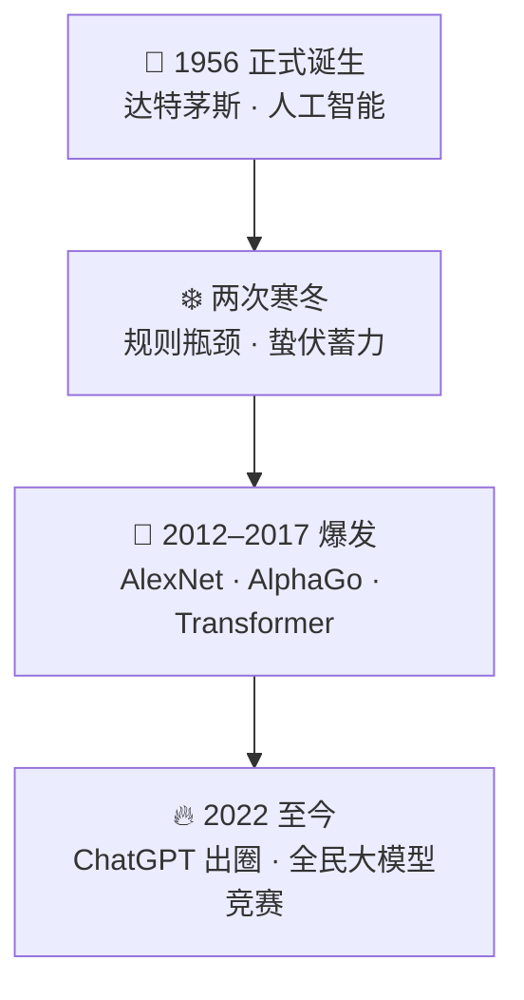
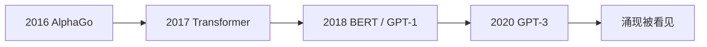
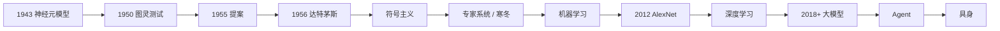

# 人工智能发展简史：从图灵测试到大模型

> 火一次，凉一次，再火一次，再凉一次，然后彻底爆发。七十余年不是直线起飞，而是寒冬与回潮交替后的阶段跃迁。
>
> 开篇用**一张图速览**立骨架；再以**产业前言**对接本库 [50](../50-strategy/50-ai-industry-disruption-strategy.md)（计算 → 感知 → 生成，及产业穿透）；**叙事编年**补可核对节点；**五阶段考点**收成考试框架。大模型不是无源突变，而是算力、数据与算法长期积累后的跃迁。

## 摘要

「人工智能」一词见于 1955 年 8 月 31 日达特茅斯夏季研究提案，1956 年会议确立学科名；思想前史可溯 1943 年 McCulloch–Pitts 神经元模型，研究起点常记 1950 年图灵测试。[1][2] 发展可按五阶段把握：符号主义、专家系统（含两次寒冬）、机器学习、深度学习（2012 AlexNet）、大模型（2018 年起）。产业视角另可粗分为计算智能 → 感知智能 → 生成智能。[3] 2017 Transformer、2020 GPT-3、2022 ChatGPT 破圈之后进入通用智能探索与应用扩散；其后延伸至智能体与具身。大模型属于第五阶段：统一模型承接多任务、多模态与生成式能力。

**学习目标**

1. 「人工智能」这个词最早是怎么来的？  
2. 人工智能的发展，经历了哪几个关键阶段？  
3. 大模型的出现，属于哪一个阶段？它的意义是什么？

**关键词：** 人工智能；达特茅斯提案；图灵测试；AI 寒冬；莱特希尔报告；专家系统；深度学习；AlexNet；Transformer；大模型；ChatGPT；智能体；产业穿透

---

## 目录

- [摘要](#摘要)
0. [一张图看懂：从 1956 到今天](#0-一张图看懂从-1956-到今天)
0b. [产业前言：这一轮突破了什么](#0b-产业前言这一轮突破了什么)

**上篇 · 叙事编年**

1. [起源：一个夏天的狂想](#1-起源一个夏天的狂想)
2. [第一次死掉](#2-第一次死掉)
3. [第二次死掉](#3-第二次死掉)
4. [缓过气来](#4-缓过气来)
5. [一路狂奔](#5-一路狂奔)
6. [破圈](#6-破圈)
7. [2025：智能体](#7-2025智能体)
8. [2026：开始干活了](#8-2026开始干活了)
9. [写在叙事之后](#9-写在叙事之后)

**下篇 · 五阶段考点**

10. [研究起点：图灵测试（1950）](#10-研究起点图灵测试1950)
11. [概念诞生：达特茅斯会议（1956）](#11-概念诞生达特茅斯会议1956)
12. [第一阶段：符号主义 AI（1950s–1960s）](#12-第一阶段符号主义-ai1950s1960s)
13. [专家系统与两次 AI 寒冬（1970s–1980s）](#13-专家系统与两次-ai-寒冬1970s1980s)
14. [第二阶段：机器学习兴起（1990s–2000s）](#14-第二阶段机器学习兴起1990s2000s)
15. [关键转折：AlexNet 夺冠（2012）](#15-关键转折alexnet-夺冠2012)
16. [第三阶段：深度学习主流（2012 年起）](#16-第三阶段深度学习主流2012-年起)
17. [第四阶段：大模型时代（2018 年起）](#17-第四阶段大模型时代2018-年起)
18. [五阶段总表与考点对照](#18-五阶段总表与考点对照)
19. [重大节点年表（可核对）](#19-重大节点年表可核对)
20. [结语：大模型不是突变](#20-结语大模型不是突变)
21. [参考文献](#21-参考文献)

---

# 速览 · 一张图看懂

## 0. 一张图看懂：从 1956 到今天

每天聊天、写稿、作图都在用 AI，你有没有想过，人工智能是如何一步步走到今天？没有难懂公式，用故事看懂 AI 进化之路。

**一张图看懂 AI 发展史：从 1956 到今天，70 年兴衰与巨头格局。**

### 🌱 1956：AI 正式诞生

达特茅斯会议上，科学家提出「人工智能」概念。彼时大家信心满满，扬言机器很快拥有人类思维。奈何算力有限，早期 AI 漏洞百出，理想很丰满，现实却是「人工智障」。

### ❄️ 两次 AI 寒冬，蛰伏蓄力

依靠手工编写规则的模式遇到瓶颈，资金撤退、项目停滞。行业迎来漫长寒冬。不过依旧有研究者坚守，神经网络、机器学习理论悄悄扎根。

### 🚀 2012–2017：深度学习迎来爆发

- ✅ **2012** AlexNet 突破图像识别  
- ✅ **2016** AlphaGo（Google DeepMind）战胜李世石，震惊全球  
- ✅ **2017** Transformer 问世，成为现代所有大模型底层核心  

### 🔥 2022 至今：全民大模型时代到来

ChatGPT 出圈，AI 彻底走进大众视野，全球开启大模型竞赛。

| 时段 | 关键词 | 一句话 |
|------|--------|--------|
| 1956 | 诞生 | 起名「人工智能」；信心满满，算力却跟不上 |
| 寒冬期 | 蛰伏 | 手工规则碰壁；资金撤、项目停；理论仍在扎根 |
| 2012–2017 | 爆发 | AlexNet → AlphaGo → Transformer |
| 2022 至今 | 破圈 | ChatGPT 出圈；全球大模型竞赛；巨头格局拉开 |

> 速览只立骨架。产业含义见下节；细节见上篇叙事与下篇考点。

---

## 0b. 产业前言：这一轮突破了什么

（据本库 [50 · AI 产业穿透与竞争战略](../50-strategy/50-ai-industry-disruption-strategy.md) 开篇命题压缩，史实细节以上篇与年表为准。）

**能力跃迁。** 这一轮显著变化是从「识别已有之物」走向「生成新的候选内容」：预测成本与内容生产边际成本下降，但预测变便宜 ≠ 好决策——判断、目标与问责仍主要由人承担。[3]

**三阶段粗分（产业叙事，与下篇五阶段互补）：**[3]

| 阶段 | 大致时段 | 标志 | 机器在做什么 |
|------|----------|------|--------------|
| 计算智能 | 1950s–2010s | 1997 深蓝胜卡斯帕罗夫 | 规则与搜索执行器 |
| 感知智能 | 2010s | 2012 AlexNet | 能「看 / 听」，输出多为标签或分数 |
| 生成智能 | 2020s | GPT 系、扩散模型等 | 写、画、编代码——统计生成，非人类意图 |

**战略一句。** 通用模型能力快速商品化；难复制的是专有数据、嵌入核心流程的智能，以及穿越「死亡之谷」（试点好看 ≠ 企业级财务收益）的工作流重构。[3]

---

# 上篇 · 叙事编年

## 1. 起源：一个夏天的狂想

1943 年，Warren McCulloch 与 Walter Pitts 用数学公式描述神经网络单元，第一次把「思考」写成可计算的逻辑网络问题。[4]

1950 年，图灵问了个问题：机器能思考吗？他说，如果你跟机器聊天分不清它是人是机，那它就算会思考。[2]

**词从提案来。** 1955 年 8 月 31 日，John McCarthy、Marvin Minsky、Nathaniel Rochester、Claude Shannon 向洛克菲勒基金会提交《达特茅斯人工智能夏季研究项目提案》，首次系统使用 *artificial intelligence*；核心猜想是：学习或智能的任一特征原则上都可被精确描述，从而由机器模拟。1956 年夏在达特茅斯学院开会，学科由此得名。[1]

他们当时放话，一个夏天就能推进机器智能。结果用了七十年，还没到终点。会上最耀眼的成果之一来自 Allen Newell 与 Herbert Simon 的 **Logic Theorist**（逻辑理论家），能证明《数学原理》中一批定理——符号主义黄金十年由此开场。[4]

| 年份 | 事件 | 一句话 |
|------|------|--------|
| 1943 | McCulloch–Pitts | 「思考」第一次变成数学题 |
| 1950 | 图灵测试 | 聊天分不清人机，就算会思考 |
| 1955-08-31 | 达特茅斯提案 | 正式写出 *artificial intelligence* |
| 1956 | 达特茅斯会议 | 学科命名；Logic Theorist 等早期成果 |

---

## 2. 第一次死掉

说出去的大话很快被打脸。机器翻译一塌糊涂，语音识别根本没法用，「十年实现智能」成了学术圈的笑话。

**可核对的两刀：** 1966 年美国 ALPAC 报告认为机器翻译投入未达预期，建议收缩全自动翻译资助；1973 年英国《莱特希尔报告》（Lighthill Report）批评 AI 在玩具问题上的方法难以扩展到真实世界（组合爆炸），英国经费大幅收缩；约 1974 年起美国 DARPA 等对开放式 AI 资助也明显收紧。[4][5] 实验室关门，研究者转行。这是**第一次寒冬**。

---

## 3. 第二次死掉

八十年代，AI 换了个马甲回来，叫**专家系统**：把专家的知识一条条写成规则教给电脑。Edward Feigenbaum 一派强调「知识就是力量」——DENDRAL（化学结构推断）、**MYCIN**（血液感染诊断与用药建议）是早期代表；卡内基梅隆为 DEC 做的 **XCON** 用于 VAX 配置，把专家系统推进到企业采购清单。[4]

但毛病很快露出来：规则全靠人写，又贵又脆弱，而且它永远不会自己学习。1987 年前后，通用工作站性能追上昂贵的专用 LISP 机，硬件泡沫破裂；日本「第五代计算机」计划亦未达预定目标。**第二次寒冬**。这回更惨，连「人工智能」这个词都有人不敢提，做研究的人改口叫它「机器学习」。[4]

| | 第一次寒冬 | 第二次寒冬 |
|---|---|---|
| 时间锚点 | ALPAC（1966）→ 莱特希尔（1973）→ DARPA 收缩（约 1974） | 约 1987 年起；专家系统与 LISP 机泡沫 |
| 表象 | 翻译、语音等预期落空；组合爆炸 | 规则贵、脆、不会自学；专用硬件失势 |
| 社会反应 | 实验室关门、研究者转行 | 连「人工智能」都不敢提，改口「机器学习」 |

---

## 4. 缓过气来

1997 年 5 月 11 日，IBM **深蓝**以 3.5–2.5 击败国际象棋世界冠军卡斯帕罗夫。它赢在专用硬件搜索（量级约每秒两亿步），谈不上今日意义上的「学会」。[3][4]

真正的转折在 **2006 年**前后：Geoffrey Hinton 等人关于深度置信网络等工作，证明多层网络可有效预训练 / 训练，为「深度学习」正名。在神经网络长期失宠的年代，Hinton、Yann LeCun、Yoshua Bengio 等人持续推进；2009 年起 **ImageNet**（李飞飞等）提供大规模标注图像，2010 年起办竞赛。[4][6]

2012 年，Alex Krizhevsky、Ilya Sutskever、Hinton 的 **AlexNet** 在 ImageNet 上 top-5 错误率约 **15.3%**，远低于次名约 26% 量级，全场震动。**深度学习**从这一年起家——旧算法 + GPU 算力 + 大数据。[6]

---

## 5. 一路狂奔

2016 年 3 月，DeepMind 的 **AlphaGo** 四比一赢了李世石。围棋变化太多，硬算行不通，它靠深度网络与自我对弈学会；2017 年 **AlphaGo Zero** 进一步摆脱人类棋谱、从零自我对弈超赶前代。[4]

同年，Google 团队发表 *Attention Is All You Need*，提出 **Transformer**：去掉循环、靠注意力机制，便于大规模并行训练。今天 GPT、文心一言、DeepSeek 等大模型底层都沿这条架构。[7]

2018 年，BERT（Google）与 GPT-1（OpenAI）分别验证「大规模预训练 + 下游适配」；2020 年 **GPT-3**（约 1750 亿参数）让「上下文学习 / 涌现」进入大众视野——模型够大之后，会冒出一些设计者未显式训练的本事。[4]

---

## 6. 破圈

2022 年 11 月 30 日，**ChatGPT** 悄悄上线。没开发布会、没打广告；公开叙述称五天用户破百万、两月月活破亿，对比 Instagram 做到一亿用户约两年半——一夜之间，全世界都在跟 AI 聊天。[4]

2023 年 GPT-4 发布（多模态等能力公开演示）；同年国内「百模大战」，多家大模型扎堆上线。

2024 年：**诺贝尔物理学奖**授予 John Hopfield 与 Geoffrey Hinton，表彰人工神经网络机器学习的奠基性发现；**化学奖**授予 David Baker 以及 Demis Hassabis、John Jumper（AlphaFold 等蛋白质结构预测相关工作）。AI 方法第一次以这种方式站上科学最高奖台。[8][9]

| 节点 | 内容 |
|------|------|
| 2022-11-30 | ChatGPT 上线；消费级破圈 |
| 2023 | GPT-4；国内百模大战 |
| 2024 | 物理奖：Hopfield / Hinton；化学奖：Baker / Hassabis / Jumper（AlphaFold） |

---

## 7. 2025：智能体

2025 年，DeepSeek 发布 **R1** 等推理向模型，公开叙事强调性能进入第一梯队、成本更低、开源——具体排名与用户数以当事方公告与可复核统计为准。

同年，产业焦点从「会聊」转向「会干活」：给目标，自行拆任务、调工具、多步完成。这种系统称**智能体（Agent）**。与本库 [50](../50-strategy/50-ai-industry-disruption-strategy.md) 一致：下一阶段关键载体是能调用工具、编排多步任务的智能体，及支撑其运行的企业侧「操作系统」。[3]

---

## 8. 2026：开始干活了

2026 年，行业管它叫「**AI Agent 应用元年**」。大模型不再只是陪聊，开始真正干活：你给它一个活儿，它自己规划、调工具、一步步交付。

产业通稿中常见表述包括：中国大模型调用量叙事上的拐点、上海世界人工智能大会上的国产开源与算力亮相、人形机器人 / **具身智能**落地案例等。精确参数、「全球最大」、调用量排名等，**宜对照当事方公告与可复核统计再核**；此处按公开叙事保留方向，不写成已审计事实。

| 线索 | 方向 |
|------|------|
| Agent | 从陪聊到规划、调工具、交付 |
| 格局 | 开源与算力、区域竞争叙事升温 |
| 具身 | AI 装进身体，走进物理世界 |

---

## 9. 写在叙事之后

回头看这七十年：火一次，凉一次，再火一次，再凉一次，然后彻底爆发。每一次摔落，多半是**承诺跑得比能力快**；2020 年后规模律让能力增长变得可外推，资本与产品才跟着算得过来。[4]

上篇回答「故事怎么走」；下篇把同一条河床收成可考的阶段框架。

---

# 下篇 · 五阶段考点

## 10. 研究起点：图灵测试（1950）

1950 年，数学家阿兰·图灵（Alan Turing）发表《计算机器与智能》（*Computing Machinery and Intelligence*），首次提出「机器能思考吗」这一哲学性追问。[2]

**图灵测试的核心规则：** 若人类无法通过对话判断交流对象是人还是机器，即可判定机器具备人类水平智能。

该测试虽存在争议，但被公认为人工智能研究的起点。

| 要点 | 内容 |
|------|------|
| 判定标准 | 对话中无法区分人与机器 → 视为具备人类水平智能 |
| 历史地位 | 公认为 AI 研究起点；争议不改其思想史坐标 |

---

## 11. 概念诞生：达特茅斯会议（1956）

1955 年提案、1956 年会议首次确立 **artificial intelligence** 术语，被称为人工智能诞生地。[1]

会议核心设想为：人类智能行为可被精确描述并通过机器模拟。早期目标是实现机器与人类一致的推理决策能力。

> **学习目标 1 的直接答案：** 词最早系统出现于 **1955 年达特茅斯提案**（McCarthy 等），因 **1956 年会议**而成为学科之名；研究起点更常追溯到 **1950 年图灵测试**（叙事上可前溯 **1943 年 McCulloch–Pitts**）。

---

## 12. 第一阶段：符号主义 AI（1950s–1960s）

符号主义核心逻辑为：通过预设规则和逻辑模拟人类推理（Logic Theorist、早期搜索与定理证明等）。

| 维度 | 内容 |
|------|------|
| 技术核心 | 预设规则 + 逻辑推理 |
| 应用局限 | 需人工穷尽规则；难适配模糊现实；易遇组合爆炸 |

这一局限性直接通向第一次寒冬。

---

## 13. 专家系统与两次 AI 寒冬（1970s–1980s）

本段对应五阶段中的**专家系统阶段**：知识库 + 规则，解决特定领域问题；两次寒冬穿插于此。

### 13.1 第一次 AI 寒冬

符号主义瓶颈 + ALPAC / 莱特希尔 / DARPA 收缩：知识表示与规则复杂度远超预期，研究停滞、投资缩减。[4][5]

### 13.2 第二次 AI 寒冬

专家系统（MYCIN、XCON 等）维护贵、难扩展、不会自学；专用硬件失势。仅靠规则驱动难以通用。[4]

> 仅靠规则驱动的人工智能，在面对复杂的现实问题时，很难实现通用性。

### 13.3 考点：两次寒冬的共性与差异

| | 第一次寒冬（1970s） | 第二次寒冬（1980s） |
|---|---|---|
| 直接诱因 | 符号瓶颈 + 评估报告与经费收缩 | 专家系统贵脆 + 硬件泡沫 |
| 更深一层 | 人工规则无法覆盖复杂现实 | 规则驱动难达通用智能 |
| **共性** | **承诺与交付之间出现鸿沟；投资与信心收缩** | |

---

## 14. 第二阶段：机器学习兴起（1990s–2000s）

统计学与数据驱动兴起：不再主要靠人手写规则，而用数据训练模型挖规律。场景包括垃圾邮件识别、推荐、风控等。

| 维度 | 内容 |
|------|------|
| 核心特征 | 数据训练；弱化手工规则 |
| 典型应用 | 垃圾邮件、推荐、风险评分等 |

深蓝（1997）仍是搜索算力；2006 前后深度学习正名 + ImageNet，为 2012 爆发铺路。

---

## 15. 关键转折：AlexNet 夺冠（2012）

ImageNet 竞赛中 AlexNet top-5 错误率约 15.3%，大幅领先传统方法。[6]

| 序号 | 要素 | 含义 |
|------|------|------|
| 01 | **算力** | GPU 并行成熟 |
| 02 | **数据** | ImageNet 级大规模标注 |
| 03 | **算法** | 深度卷积网络真正跑通 |

> **AI 突破三要素协同：算力、数据、算法。**

---

## 16. 第三阶段：深度学习主流（2012 年起）

语音、NLP、图像生成等能力边界打开；AlphaGo（2016）把突破从感知推到复杂博弈。

---

## 17. 第四阶段：大模型时代（2018 年起）

（五阶段总表中为**第五阶段：大模型**。）

Transformer 迭代 + 大规模预训练：多任务、多领域；统一模型多种能力；按语境生成文本 / 图像 / 代码。代表：ChatGPT、Claude、DeepSeek、豆包、文心一言等。

> **学习目标 3 的直接答案：** 大模型属**大模型阶段（2018 年起）**。意义：大规模预训练支撑跨任务、多模态、生成式能力，把 AI 推进到通用智能探索——是深度学习路线的延续与放大，不是凭空突变。产业上对应 [50](../50-strategy/50-ai-industry-disruption-strategy.md) 所说的「生成智能」与随后的 Agent / 工作流重构。

---

## 18. 五阶段总表与考点对照

| 阶段 | 时间 | 技术特征 |
|------|------|----------|
| **符号主义** | 1950s–1960s | 规则与逻辑推理 |
| **专家系统** | 1970s–1980s | 知识库 + 规则；两次寒冬 |
| **机器学习** | 1990s–2000s | 数据训练替代手工规则 |
| **深度学习** | 2012 年起 | 多层网络；AlexNet 为标志 |
| **大模型** | 2018 年起 | 跨任务、多模态、生成式；延伸至 Agent / 具身 |

> **学习目标 2：** 即上表五段。前有 1943 / 1950 / 1955–56；中有两次寒冬；2012、2017、2022 为跃迁节点。

---

## 19. 重大节点年表（可核对）

| 时间 | 事件 / 决策 | 性质 | 出处 |
|------|-------------|------|------|
| 1943 | McCulloch–Pitts 神经元模型 | 理论 | [4] |
| 1950 | 图灵《计算机器与智能》 | 理论 | [2] |
| 1955-08-31 | 达特茅斯 AI 夏季研究提案 | 命名 / 立项 | [1] |
| 1956 | 达特茅斯会议；Logic Theorist | 学科诞生 | [1][4] |
| 1966 | ALPAC 报告 | 政策收缩 | [4] |
| 1973 | 莱特希尔报告 | 政策收缩 | [5] |
| 约 1974 | DARPA 等资助收紧 | 第一次寒冬 | [4] |
| 1970s–80s | MYCIN、XCON 等专家系统 | 应用高潮 | [4] |
| 约 1987 | LISP 机失势；专家系统退潮 | 第二次寒冬 | [4] |
| 1997-05-11 | 深蓝胜卡斯帕罗夫 | 计算智能标志 | [3][4] |
| 2006 | 深度网络可训练性工作；「深度学习」兴起 | 转向 | [4] |
| 2009–2012 | ImageNet → AlexNet | 感知突破 | [6] |
| 2016–2017 | AlphaGo / AlphaGo Zero；Transformer 论文 | 博弈 + 架构 | [4][7] |
| 2018–2020 | BERT / GPT-1 → GPT-3 | 预训练范式 | [4] |
| 2022-11-30 | ChatGPT 上线 | 消费破圈 | [4] |
| 2024 | 诺贝尔物理（Hopfield / Hinton）；化学（Baker / Hassabis / Jumper） | 科学承认 | [8][9] |
| 2025– | Agent 工业化叙事 | 应用延伸 | [3]；通稿待核 |

---

## 20. 结语：大模型不是突变

AI 从「人写规则」走到「数据学规律」，再走到「深层网络」与「统一大模型」，再走到「会干活的智能体」。

大模型不是无源突变，而是符号失败后的数据转向、ImageNet 证明深度学习可行、Transformer 与大规模预训练把「一个模型多任务」做成主流——算力、数据、算法再次协同。ChatGPT 之后的百模、Agent、具身，是同一阶段的扩散。

记考点：**词（1955/56）、起点（图灵）、五阶段、寒冬成因、AlexNet 三要素、大模型阶段及其意义。** 记产业：**计算 → 感知 → 生成；预测变便宜 ≠ 好决策；难复制的是数据与工作流。** 详见 [50](../50-strategy/50-ai-industry-disruption-strategy.md)。

---

## 21. 参考文献

1. McCarthy, J., Minsky, M., Rochester, N., Shannon, C. *A Proposal for the Dartmouth Summer Research Project on Artificial Intelligence*（1955-08-31）. 文本见 Stanford / Dartmouth 存档. <https://www-formal.stanford.edu/jmc/history/dartmouth/dartmouth.html>
2. Turing, A. *Computing Machinery and Intelligence*. *Mind* 59 (1950).
3. 本库：[`50-ai-industry-disruption-strategy.md`](../50-strategy/50-ai-industry-disruption-strategy.md). 计算 / 感知 / 生成三分；死亡之谷；Agent 与竞争战略.
4. 中文维基「人工智能史」及互证通史叙述（Logic Theorist、ALPAC、专家系统、深蓝、ImageNet、AlphaGo、ChatGPT 等时间线）. <https://zh.wikipedia.org/wiki/%E4%BA%BA%E5%B7%A5%E6%99%BA%E8%83%BD%E5%8F%B2>
5. Lighthill, J. *Artificial Intelligence: A General Survey*（莱特希尔报告，1973）. SRC. <https://www.aiai.ed.ac.uk/events/lighthill1973/lighthill.pdf>
6. Krizhevsky, A., Sutskever, I., Hinton, G. ImageNet Classification with Deep Convolutional Neural Networks（AlexNet；ILSVRC 2012 top-5 ≈ 15.3%）.
7. Vaswani, A. et al. *Attention Is All You Need*（2017）. Transformer.
8. The Nobel Prize in Physics 2024（Hopfield & Hinton）. <https://www.nobelprize.org/prizes/physics/2024/press-release/>
9. The Nobel Prize in Chemistry 2024（Baker；Hassabis & Jumper / AlphaFold）. 诺贝尔奖官网化学奖 2024 公报.
