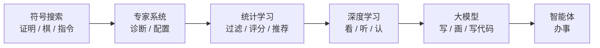

# 人工智能编年：六种机制、三大思潮与五次换代

> 七十余年不是直线起飞，而是锯齿线。寒冬多半是**承诺跑得比当时能力快**；爆发多半是表示、数据与算力重新对齐，再加一层普通人用得上的产品。技术形态变了许多次，底层争论却相当稳定：智能应当被写成规则，还是从数据里学出来，或是在与环境的交互中长出来。
>
> 大模型不是无源突变。它是深度学习在规模、架构与产品形态上的延续，并借工具与检索部分回收符号操作。语言侧从循环网络到 Transformer 的细编年见 [17](./17-large-language-model-chronicle.md)；表示 / 计算 / 度量的数学骨架见 [48](../40-paradigm/48-ai-mathematical-foundations-treatise.md)；产业如何穿透企业，见 [50](../50-strategy/50-ai-industry-disruption-strategy.md)。

先给一个直接答案：

> **每一代所谓「智能」，实质是在替人做一类具体的事**——证明定理、按手册诊断、过滤垃圾邮件、认出照片里的物体、按提示写文写代码、再进一步调用工具把事情做完。换代换的是「这件事怎么做」：人手写规则 → 从例子里统计 → 把特征也交给数据学 → 大规模生成 → 接上工具循环。思想史上，**符号主义（知识与推理）、连接主义（学习与表征）、行为主义（感知—行动闭环）**长期并存、此消彼长、局部融合，很少真正彼此替代。读懂史，不是背名词，而是看清**能做什么、不能做什么、错了谁买单**——以及语言与硬件两条介质如何约束思潮能走多远。

## 摘要

「人工智能」（artificial intelligence）一词系统见于 1955 年达特茅斯夏季研究提案，因 1956 年会议成为学科之名。思想前史可溯至 1943 年 McCulloch–Pitts 神经元模型与 1940 年代控制论；研究起点常记 1950 年图灵测试；计算奠基则可对照 1946 年 ENIAC——「能算」先于「能想」。[1][2][3][40] 若以 1956 年立科计，至今约七十年；若把 1943–1950 年前史算入，「约八十年」是常见概括。大模型普及标志着新的工程阶段，**不等于**通用人工智能（AGI）已获公认实现。

技术上宜分清六种办法：符号搜索、专家系统、统计机器学习、深度学习、大模型、智能体。史上可按五阶段把握：符号主义 → 专家系统（两次寒冬穿插其间；行为基机器人同期另立门户）→ 机器学习 → 深度学习 → 大模型（智能体是其延伸，不是另起的史段）。产业叙事另可粗分为计算智能、感知智能、生成智能。[4]

贯穿始终的主线有三条：**世界被写成什么**、**运行时在算什么**、**谁付钱、什么产品走进生活**。另有两条介质线索：**语言**（通用语言 → LISP / Prolog 高峰 → 再回 Python + 数值内核）与**硬件**（通用机 → 专用 Lisp / 推理机 → GPU / 张量加速器）。阶段跃迁，几乎都是主线与介质同时改写。

**三个坐标**

1. **词从哪来？** 1955 年提案写出 *artificial intelligence*；1956 年达特茅斯会议立科。  
2. **经历哪些阶段、各用在哪？** 上列五阶段。对照 §1 场景表与 §10。  
3. **大模型属哪一段？** 第五阶段。本质是大规模按提示生成；对话框使之破圈，工具循环使之能办事。细谱见 [17](./17-large-language-model-chronicle.md)（亦作文献 [42]）。

**关键词：** 符号主义；连接主义；行为主义；专家系统；机器学习；深度学习；Transformer；大模型；智能体；AI 寒冬；物理符号系统；包涵架构

---

## 目录

- [摘要](#摘要)
1. [如何阅读：场景先于术语](#1-如何阅读场景先于术语)
    - [1.1 一张表：每一代替人做什么](#11-一张表每一代替人做什么)
    - [1.2 三大思潮：符号、连接与行为](#12-三大思潮符号连接与行为)
2. [六种技术：场景、机制与失效方式](#2-六种技术场景机制与失效方式)
3. [起源：计算奠基、神经元模型与命名](#3-起源计算奠基神经元模型与命名)
    - [3.1 人脑数量级与 ENIAC](#31-人脑数量级与-eniac)
    - [3.2 形式先声与图灵测试](#32-形式先声与图灵测试)
    - [3.3 命名与立科（1955–1956）](#33-命名与立科19551956)
4. [符号主义与第一次寒冬](#4-符号主义与第一次寒冬)
5. [专家系统、行为基与第二次寒冬](#5-专家系统行为基与第二次寒冬)
6. [统计学习转向、深蓝与深层网络火种](#6-统计学习转向深蓝与深层网络火种)
7. [深度学习上台：从 AlexNet 到 AlphaGo](#7-深度学习上台从-alexnet-到-alphago)
8. [大模型：Transformer、预训练到破圈](#8-大模型transformer预训练到破圈)
9. [智能体：从会聊到办事](#9-智能体从会聊到办事)
10. [回收：阶段、场景与可带走的判断](#10-回收阶段场景与可带走的判断)
    - [10.1 五阶段 × 六种办法 × 用在哪](#101-五阶段--六种办法--用在哪)
    - [10.2 产业三分（能力形态，不是另两段史）](#102-产业三分能力形态不是另两段史)
    - [10.3 今日产品对照（把史读回你的工具栏）](#103-今日产品对照把史读回你的工具栏)
    - [10.4 可带走的判断](#104-可带走的判断)
    - [10.5 中国脉络（简表）](#105-中国脉络简表)
    - [10.6 范式跃迁全景与普通人建议](#106-范式跃迁全景与普通人建议)
    - [10.7 思潮分工、语言与硬件](#107-思潮分工语言与硬件)
    - [10.8 十条思想命题（压缩）](#108-十条思想命题压缩)
11. [节点年表](#11-节点年表)
12. [参考文献](#12-参考文献)

---

## 1. 如何阅读：场景先于术语

这篇是技术史，不是名词手册。遇到陌生词，先问两句就够：

| 尺 | 所问 | 落点 |
|----|------|------|
| **场景尺** | 这一代替人做什么？谁真的用过？今天还剩什么？ | 下表；§4–§9 各段「当时用在哪」 |
| **办法尺** | 知识从哪来？运行时在算什么？错了怎么暴露？ | §2 词典；经费与产品则见 ALPAC、莱特希尔报告、DARPA、ChatGPT [5][6][12] |

结构性张力始终在：**对外许诺的是通用智能，对内能支付的只有当时那套表示、搜索、算力与数据。** 寒冬一再发生，原因长得很像：承诺付不起。爆发一再发生，条件也长得很像：算法、数据、算力对齐，再加一层好用的界面。

### 1.1 一张表：每一代替人做什么

先建立日常坐标。后文的人名、论文与寒冬，都是在给这张表补证据。

| 大约年代 | 这一代的办法 | 它擅长的事（场景） | 你今天还能看见的形态 | 它不擅长的事 |
|----------|--------------|--------------------|----------------------|--------------|
| 1950s–1970s | **符号搜索** | 证明定理、下棋、在积木世界里执行指令、按模板对话 | 编译器、形式化验证、部分规划与规则引擎的思想祖先 | 模糊、开放的真实世界 |
| 1970s–1980s | **专家系统** | 按手册诊断、配置复杂订单、在窄域给出可复核建议 | 核保规则、税务逻辑、临床路径、运维手册自动化 | 规则一多就维护不动；域外即无能 |
| 1990s–2000s | **统计机器学习** | 拦垃圾邮件、信用评分、推荐、搜索排序、语音识别 | 广告点击预测、反欺诈、推荐流、风控模型 | 特征靠人设计；数据分布一变就掉点 |
| 2010s | **深度学习** | 认出图像与语音、医学影像辅助、安防与质检、围棋 | 手机解锁、相机识景、语音转写、工业视觉 | 默认是「认出来」，不是「按指令做出来」 |
| 2017– | **大模型** | 写作、翻译、摘要、写代码、文生图、客服草稿 | 对话助手、编程补全、办公套件里的生成功能 | 会编造；事实与责任难溯源 |
| 2022– | **智能体**（大模型之延伸） | 多步调用检索、代码、浏览器、业务接口，把任务做完 | 带工具的助手、工单与运维编排；多数仍需人审核 | 目标含糊、权限与评测不足时会乱调用 |

```mermaid
flowchart LR
  A["符号搜索<br/>证明 / 棋 / 指令"] --> B["专家系统<br/>诊断 / 配置"]
  B --> C["统计学习<br/>过滤 / 评分 / 推荐"]
  C --> D["深度学习<br/>看 / 听 / 认"]
  D --> E["大模型<br/>写 / 画 / 写代码"]
  E --> F["智能体<br/>办事"]
```

§2 的六种办法与 §4–§9 一一对应。五阶段用来排叙事顺序，六种办法用来解释每一代到底在算什么。智能体记为第五阶段之延伸，不是第六史段。

### 1.2 三大思潮：符号、连接与行为

§1.1 的「六种办法」回答工程上**怎么做**；其下还有三条更长的研究传统，回答**智能首先被看成什么**。后文编年（§4–§9）按阶段推进；思潮标签用来标记每一阶段谁居中心、谁作支流、谁回流。

| 思潮 | 核心主张（一句话） | 侧重 | 经典形态 |
|------|--------------------|------|----------|
| **符号主义** | 智能 ≈ 符号表征 + 逻辑或启发式推理 | 认知、规划、可解释决策 | 定理证明、逻辑编程、专家系统、知识图谱与规则引擎 |
| **连接主义** | 智能 ≈ 分布式单元的加权连接 + 数据驱动的参数学习 | 感知、学习、泛化、生成 | 感知机、多层网络、深度网络与大模型 |
| **行为主义** | 智能首先表现为感知—行动的自适应闭环，而非完备内部世界模型 | 交互、控制、在线适应 | 控制论传统；包涵架构；强化学习与机器人控制 |

三条路线分别强调理性推理、感知学习与环境行动。历史上有竞争与互相批评，但很少真正彼此替代——八十年更接近**反复重组**，而非一次次彻底换朝。行为主义比「人工智能」学科名称更早：控制论在 1940 年代已成型；进入 AI 内部后，Rodney Brooks 的包涵架构与「无表征智能」是其鲜明表述。[43][44] 数学侧如何支撑这些思潮落地，见 [48](../40-paradigm/48-ai-mathematical-foundations-treatise.md)。

---

## 2. 六种技术：场景、机制与失效方式

给任何系统定性，先问四句（不必一次背术语）：

1. **知识从哪来？** 人手写规则，还是从数据里估出来？  
2. **运行时在算什么？** 在规则里搜索匹配，还是把数字往前推一遍（有时再采样）？  
3. **交到用户手里的是什么？** 证明步骤、标签或分数，还是一段新文本、一张图、一串操作？  
4. **错了怎么被看见？** 规则打架、分布外掉点、一本正经地编造，还是把工具调错？

| 办法 | 一句话 | 典型场景 | 运行时看得见什么 | 典型失效 |
|------|--------|----------|------------------|----------|
| **符号主义** | 把世界写成符号，按逻辑与搜索找答案 | 定理证明、棋类、积木世界指令 | 规则、搜索树、可复核的证明或走法 | 可能性数目爆炸，搜不完；世界一模糊，规则不够 [6] |
| **专家系统** | 把某领域专家的判断写成大量「如果—那么」 | 质谱推断分子结构、感染用药建议、小型机订单配置 | `if–then`、咨询式建议 | 获取贵、难维护、域外即死 |
| **统计机器学习** | 从许多例子里估一个「输入 → 输出」的对照 | 垃圾邮件、信用分、推荐、搜索排序 | 特征 → 分数或标签 | 特征靠人；分布一移就掉点 |
| **深度学习** | 连「该看哪些特征」也从数据里学，网络可以很深 | 图像识别、语音转写、医学影像、围棋 | 对用户是标签、检测框、转写文字 | 需大数据与算力；默认偏识别 [38] |
| **大模型** | 在海量序列上训练，按提示生成下一段内容 | 对话、写作、编程、翻译、文生图 | 提示 → 文字、代码或图像 | 一本正经地编造（幻觉）；事实与责任难溯源 [11] |
| **智能体** | 模型 + 工具 + 多步循环，不只回答而是办事 | 检索后作答、改代码并跑测试、处理工单 | 计划、调用、观察、再计划 | 目标含糊、权限与评测不足 [4] |

史实锚点在对应编年节展开。深蓝是封闭规则下的搜索旁支，不要与统计学习或深度学习混为一谈：它算赢了国际象棋，并没有从棋谱里「学会看棋」。

---

## 3. 起源：计算奠基、神经元模型与命名

### 3.1 人脑数量级与 ENIAC

人类智能的物质基础常被写成约 **860 亿**神经元、突触约 **100 万亿**量级——只作数量级印象，不是精确审计，更不是「参数对齐神经元」的借口。1946 年，宾夕法尼亚大学的 **ENIAC** 成为早期通用电子数字计算机的标志：约 1.8 万电子管、数十吨量级，每秒约数千次加法——解决的是「快速算、能存」，不是「自己总结规律」。[40] 「能算」先于「能想」：后来的 AI，是在已会算的机器上，再问能不能学、能不能用语言表现智能。

### 3.2 形式先声与图灵测试

1943 年，Warren S. McCulloch 与 Walter Pitts 用逻辑演算描述神经元网络，把「神经计算」写成可分析的形式系统。[3] 这是连接主义的早期锚点：单元与联结可以计算。它还不是后来靠梯度与大规模数据训练出来的深层感知系统——更接近「神经也可以用逻辑来想」，而不是「用数据训出一个能认猫的网络」。

**后来变成了什么：** 这条线在制度上长期让位于符号派，却在 1980 年代以反向传播、2010 年代以深度学习的形式重新成为主流。今天手机解锁、语音转写，谱系上连到这里，中间隔了几十年的冷遇。

1950 年，Alan Turing 在 *Mind* 发表 *Computing Machinery and Intelligence*，把「机器能思考吗」改写成模仿游戏：若裁判无法通过对话稳定区分人与机器，则可认为机器表现出相应水平的智能。[2] 测试在哲学上争议不断——它测的是「像人」，还是「真理解」——但作为研究起点的公共坐标已经稳固。空泛的本体论问题，部分被改写成可观察的行为判据。

**后来变成了什么：** 公众至今仍用「聊得像不像人」来判断 AI。1966 年的 ELIZA、2022 年的 ChatGPT，成功方式截然不同，但都撞上了同一块试金石：对话是最容易被大众看见的智能。

### 3.3 命名与立科（1955–1956）

1955 年 8 月 31 日，John McCarthy、Marvin Minsky、Nathaniel Rochester、Claude Shannon 提交《达特茅斯人工智能夏季研究项目提案》，拟于 1956 年夏在达特茅斯学院进行约两个月、约十人的研究，并陈述核心猜想：

> learning or any other feature of intelligence can in principle be so precisely described that a machine can be made to simulate it.[1]

**artificial intelligence** 由此成为领域自称。提案列出的议程——使用语言、形成抽象与概念、解决当时仅人类能解决的问题、自我改进——七十年后仍像一份未完成的产品路线图。[1]

1956 年夏会议召开，日程松散，人员进进出出。Allen Newell、Herbert Simon 与 Cliff Shaw 的 **Logic Theorist**（逻辑理论家）被带到会上：该程序证明了 Whitehead 与 Russell《数学原理》第二章前 52 条定理中的 38 条，并为定理 2.85 找到比原书更短的证明。[7] 符号主义的「黄金十年」由此有了可演示的开场——**第一批「应用」就是数学证明**，观众是逻辑学家，不是医院或工厂。

命名划出独立于控制论圈子的领地，也埋下定义困难：智能缺少单一可证伪的操作定义，「已经实现」与「已经失败」的口号会周期性回潮。可观察遗产是：学科有了名字、议程与第一批程序；同时留下「一个夏天推进重大问题」的系统性低估。

---

## 4. 符号主义与第一次寒冬

↔ **办法：符号搜索**　**场景：证明、下棋、微观世界里的指令与对话**

### 4.1 这一代在做什么：像在棋盘上按规则找下一步

1950 年代末至 1960 年代，主流路径是符号主义：把问题写成符号状态，用逻辑规则与搜索（穷尽或启发式）求解。「智能」看起来像可读的推理轨迹——证明步骤、博弈走法、积木世界指令——而不是从数据里拟合一条曲线。Newell、Shaw 与 Simon 随后的 **General Problem Solver**（通用问题求解器）把「手段—目的分析」做成可运行的启发式搜索：先看目标与现状差在哪，再选能缩小差距的动作。[8] 同一实践后来被概括为**物理符号系统假设**（Physical Symbol System Hypothesis）：任何表现出一般智能的系统，都是对符号结构进行读、写、变换的物理系统；反之，足够的物理符号系统能够表现出一般智能——完整表述见于 1976 年 Newell 与 Simon 的图灵奖演讲文。[45]

可以把它想成：人先把世界翻译成棋盘和棋规，机器再在棋盘上找路。翻译这一步必须由人做完；机器不会自己发明棋规。硬件上，程序跑在 IBM 704、JOHNNIAC、PDP 一类通用机上：内存以千字计，交互多为批处理或电传——智能必须挤进现成机器，而不是机器为智能而造。

### 4.2 当时用在哪

同期高光不必都算符号主义，但同属乐观年代。对今天的读者，重要的是**它们各自演示了哪类产品**：

| 系统 | 时间 | 当时的使用场景 | 用户实际看到什么 | 限度 |
|------|------|----------------|------------------|------|
| **Logic Theorist / GPS** | 1956 起 | 数学证明、一般问题求解的演示 | 一条可逐步复核的证明或求解路径 | 只在形式化好的玩具问题上好看 |
| **LISP** | 约 1958–1960 | 第一次「人工智能语言」高峰：符号、表、递归与「程序即数据」 | 北美 AI 实验室的日常工作语言 | 语言本身不解决知识从哪来；大规模数值拟合不是其舒适区 [9] |
| **感知机** | 1958 | 从例子调权重的分类器，并推动 Mark I 硬件 | 把图案分成两类；媒体一度极度乐观 | 单层能力有天花板；当时还不是今天的深度网络 [16] |
| **Samuel 跳棋** | 1959 | 启发式搜索与参数学习结合；「机器学习」一词早期有实物 | 1962 年击败强手 Robert Nealey——证明高棋力，不是「全面超越人类」 | 封闭棋规，推不到开放世界 [17] |
| **ELIZA** | 1966 | 按模板模仿罗杰斯式心理治疗对话 | 用户打字，程序用模式匹配把话抛回来 | 作者本意是研究误解；公众容易当成「懂了」[18] |
| **Shakey** | 约 1966–1972 | 真实房间里的感知—规划—行动闭环（STRIPS 等） | 会看、会规划、会慢慢动 | 感知慢、规划脆；开放世界难穷尽建模 [46] |
| **SHRDLU** | 1968–1970 | 积木世界里理解并执行自然语言指令（符号语义，非行为基） | 「把红色积木放到蓝色积木上」，还能回答「刚才为什么这么做」 | 桌子一旦换成真实房间，手写程序不再够用 [19] |

在受限微观世界里，这些演示看起来离「通用」只有一步之遥。ELIZA 尤其像今天聊天产品的远祖：**场景已经是对话，办法却只是关键词替换**。SHRDLU 则像极简版「语音控家居」——前提是家里只有几块积木，且每块都有精确的符号名字。

### 4.3 乐观为何不可扩展

局限是结构的，不是某次实现没写好：

- **知识与规则需人手穷尽。** 真实世界模糊，例外无穷。医院、街道、合同里的「差不多」，写不成完备规则。  
- **搜索空间组合爆炸。** 玩具问题可解，规模一大，启发式也救不过来——这是莱特希尔报告的核心批评。[6]  
- **单层感知机的数学天花板。** 1969 年 Minsky 与 Papert 的 *Perceptrons* 严格分析了当时感知机的能力边界，沉重打击感知机路线的资助与信心；该书**并未**从数学上否定一切多层网络——关键困难在于当时缺少稳定、可规模化的多层训练方法，算力与数据也不足。[20] 反向传播的算法思想早于其 1986 年成名——Werbos 1974 年博士论文已给出用于有序非线性系统的反向求导（「动态反馈」），Linnainmaa 等对反向自动微分亦有贡献——但当时尚未成为主流训练范式；普及转折仍以 1986 年 *Nature* 文为准。[25]此后十几年神经网络研究边缘化，但仍有延续（如福岛邦彦新认知机、Hopfield 网络）。

ELIZA 与 SHRDLU 的高光也有同一盲点：微观世界一旦打开，模式匹配与手写程序不再够用。Shakey 则提前暴露了另一条线：即使把感知、规划、行动串成闭环，当时处理器与传感器也配不上开放世界——走一步、想很久，不全是算法幼稚。实验室里能「理解」积木，并不等于能理解一份保险条款。

### 4.4 第一次寒冬：从机译收缩到经费总闸

宜把两刀分开，不要写成同一天发生的一件事。

规则式机译的早期演示可溯至 **1954 年 Georgetown–IBM**：查词典、调语序，能译短句，却不懂语境与例外。**1966，ALPAC 报告**针对的正是这一应用线的经费预期：冷战背景下，美国希望计算机把俄语科技文献译成英语；十年投入未达「更快、更便宜、更好」，委员会建议收缩对全自动高质量翻译的资助。这是机译线的重创，还不是整个学科的寒冬。[5][41]

**1973，莱特希尔报告**受英国科学研究委员会委托，对 AI 作外部评估：诸多子领域未能兑现承诺，玩具方法难以扩展到真实世界规模。[6] **约 1974 年起**，美国 DARPA 等对开放式、缺少明确任务指标的 AI 资助明显收紧。第一次寒冬通常记为 1970 年代中后期。

可观察信号：论文与演示还在，**经费曲线与岗位曲线**先折下去。第一次寒冬不是「AI 永远不行」，而是通用承诺在当时的表示与算力下不可支付。机译这一场景后来并没有消失——它在统计方法和神经网络里被重做了一遍，直到 Transformer 才真正走进日常产品。

---

## 5. 专家系统、行为基与第二次寒冬

↔ **办法：知识库 + 推理机；并行支流是感知—行动闭环**　**场景：窄域诊断、配置；真实环境里的反应式机器人**

### 5.1 这一代在做什么：把专家判断写成一本可执行的手册

解冻靠收缩目标：既然造不出通用智能，就先做只懂一件事的专家。Edward Feigenbaum 一派强调「知识就是力量」——架构是 **知识库（大量 `if–then`）+ 推理引擎**。人把「如果血培养是革兰氏阴性杆菌、且病人对青霉素过敏，则……」写成规则，机器按规则链式推出建议。这是符号主义的工程化，不是对符号主义的放弃。

它与上一阶段的差别不在「会不会搜索」，而在**知识从哪来**：符号派曾幻想少量通用原理就够；专家系统承认，真正值钱的是领域里那几千条经验。

语言上出现第二次「人工智能语言」高峰：**Prolog**（约 1972 年起，Alain Colmerauer 团队与 Robert Kowalski 等）。与 LISP「过程性地操作符号」不同，Prolog 让程序员陈述逻辑事实与规则，由合一与回溯搜索答案——「声明即推理」。日本第五代计算机计划后来高度依赖逻辑编程，正是要把这种理想做成新一代机器的软件灵魂。[47]

### 5.2 当时用在哪：三个真正进过业务的例子

| 系统 | 时间与域 | 谁在用、用来干什么 | 交到手里的产出 | 限度 |
|------|----------|--------------------|----------------|------|
| **DENDRAL** | 1960 年代中期起；有机质谱 | 化学家：由质谱数据推断可能的分子结构 | 可复核的结构假设，辅助实验室，而不是取代实验 | 域极窄 |
| **MYCIN** | 1970 年代；血液感染与抗生素 | 医生（研究与评估场景）：按症状与化验给用药建议 | 域内评估接近专家；带可信度因子的建议清单 | 未成为医院常规工具——责任、集成与知识维护都过不去 [21] |
| **XCON / R1** | 约 1980；CMU 为 DEC 配置 VAX 订单 | 销售与制造：客户选了一堆部件，机器检查能否配在一起并出配置单 | 进入企业采购，减少配错、缩短配置时间 | 规则维护随产品目录膨胀而恶化 |

这是符号主义第一次摸到**可开票的应用**：规则条数、知识工程师人时、域内准确率成为可管理指标。XCON 尤其重要——它不是论文演示，而是 DEC 卖小型机时的生产环节。1980 年代，Symbolics、LMI、Xerox 等 **Lisp 机器**一度繁荣——把表处理、垃圾回收与交互开发做进软硬件，是符号 AI 与专用硬件绑定最紧的一次。日本通产省 **第五代计算机**项目（FGCS，1982–1992）押注并行推理与逻辑编程，政府投入约 **541.5 亿日元**（当时约合 4 亿多美元），产出 PSI / Multi-PSI 等原型，但未形成预期中的新计算机产业，也未兑现「会推理的通用智能机器」。[22][48] 同期美国 Thinking Machines 的 Connection Machine 把成千上万简单处理器连成阵列，更靠近连接主义对并行的想象——失败的是产品与市场目标，不是符号方法或并行计算本身。

### 5.3 今天还能看见什么

专家系统作为品牌几乎消失，作为办法没有消失。你今天碰到的常常不再叫「人工智能」：

- **保险核保、信贷政策引擎：** 「收入低于某线且负债比高于某线 → 拒绝或加审」——仍是规则。  
- **税务与合规：** 申报软件把税法写成决策树。  
- **临床路径与处方警示：** 医院信息系统里的过敏、相互作用检查。  
- **IT 运维手册：** 「告警 A 且服务 B 超时 → 先重启再升级」——自动化 runbook。

差别在于：当年把这些说成「智能」；今天把这些说成「业务规则」。当规则稳定、例外可枚举、还需要可解释的责任链时，专家系统的办法仍然正确。当例外无穷、知识更新快过工程师书写速度时，它会再次失败——这正是第二次寒冬的机制。

### 5.4 行为基：感知—行动闭环另立门户

当符号派深耕静态知识库时，另一批研究者强调：真实机器人必须在噪声、延迟与不完全信息中实时行动。Rodney Brooks 提出**包涵架构**（subsumption architecture，1986）与稍后的「无表征智能」纲领：复杂外表可以由多层简单刺激—反应行为叠加而成，不必先建完整符号世界模型；高层可抑制低层输出，但低层继续运行。[43][44]

需要放回原位的几点：消费级扫地机器人并非 1980 年代量产成果——Brooks 参与创办的 iRobot 到 **2002** 年才推出 Roomba；更早的行走与避障属于实验室研究。SHRDLU 的积木世界是符号语义经典，不是行为主义。遗传算法属演化计算，可与适应性行为对话，但不等于 Brooks 意义上的行为基。工业机械臂的自适应控制更多来自控制工程，只有一部分与 AI 学派论争重合。

行为基路线的贡献是：证明了没有重型符号规划，机器也能在真实环境中做有用的事。它没有、也从未声称能够单独提供人类水平的语言与抽象推理。后来的深度强化学习，把「试错与反馈」做成可优化框架，是这条线索与连接主义的汇合。本质与偶性层面的方法论引申，见本库 [`47`](../40-paradigm/47-no-silver-bullet-ai-essential-difficulty-philosophy.md)。

### 5.5 第二次寒冬：维护成本与硬件泡沫

失效同样可观察：

- **知识获取瓶颈。** 专家口述慢、贵；规则一多就冲突，变更成本超线性。VAX 每出一款新配件，XCON 就要加人维护。  
- **脆弱性与不会自学。** 超出知识库边界即失效；域外无规则即无能。MYCIN 不会因为看过一万份病历就自动长出新规则。  
- **约 1987。** 通用工作站性能追上昂贵的专用 Lisp 机，硬件生态失势——热潮消退早于五代机收官；第五代计划 1992 年结束，未达预定目标。常用时间框约 **1987–1993**。[22][48]

「人工智能」在部分采购与投资语境中成了忌讳词。研究者改挂「机器学习」「模式识别」「数据挖掘」等名——后来所谓寒冬里的伪装。那些名字对应的，正是下一节：不要专家口述规则，改从历史数据里估规则。符号方法此后不再占舞台中心，但仍活在编译器、验证、规则引擎，以及后来的语义网与知识图谱中。

| | 第一次寒冬 | 第二次寒冬 |
|---|------------|------------|
| 失效机制 | 符号搜索不可扩展 | 知识库不可维护、不学习 |
| 砸在哪个场景上 | 机译未达「又快又便宜又好」；玩具问题扩不到真实世界 | 诊断与配置能做，但规则维护与专用硬件先垮 |
| 制度信号 | ALPAC（机译）；莱特希尔；DARPA | Lisp 机泡沫；第五代落空 |
| 余波 | 实验室收缩 | 改名；统计方法暗中积累；行为基另立门户 |

两次寒冬的共同点，仍是承诺与能力之间的鸿沟。不同点是：一次砸在「搜索扩不出去」和外部评估报告上，一次砸在「知识写不完、专用硬件卖不动」上。第一次寒冬的直接原因，是承诺、能力与经费三者错位，而不是某一条路线在理论上被一次性证伪。

---

## 6. 统计学习转向、深蓝与深层网络火种

↔ **办法：从样本估计映射**（深蓝为搜索旁支）　**场景：过滤、评分、推荐、排序；旁支是封闭规则下棋**

### 6.1 这一代在做什么：不要专家口述，改看历史里「以前怎么办的」

1990–2000 年代，领域少谈「造出通用智能」，多用可测指标做窄任务。做法是：收集许多带标签的例子（这封邮件是不是垃圾、这笔贷款后来有没有违约），让算法估一个从输入到输出的对照关系 \(f:x\mapsto y\)。优化的是**没见过的新样本上错多少**（留出测试集上的误差，或 AUC 这类排序指标），不是「是否像人」。

特征仍常靠人手设计——工程师要先决定「用词频、发件人域名、历史点击」哪些算数。这是与深度学习的分界：统计学习把**决策**交给数据，把**该看什么**留给人。

### 6.2 当时用在哪：这一代真正走进了日常生活

| 场景 | 机器在干什么 | 用户或业务看到什么 | 为何统计方法合适 |
|------|--------------|--------------------|------------------|
| **垃圾邮件过滤** | 根据词、链接、发件模式给「是垃圾」的分数（相对「标题含免费就拦截」一类手写规则） | 收件箱少了很多推销信；偶有误伤 | 例子极多，错了可改，容错成本低 |
| **信用评分 / 反欺诈** | 由历史还款与交易行为估计风险 | 批贷更快；异常刷卡被拦 | 要的是分数与排序，不必「理解」人生 |
| **推荐系统** | 由「谁看过什么」估计你下一步可能点什么 | 电商、视频、资讯的「猜你喜欢」 | 目标清晰（点击、完播），可在线试错 |
| **搜索排序** | 由点击与网页特征估计相关性 | 关键词对上更有用的十条结果 | 每天有海量反馈，适合持续拟合 |
| **语音识别（隐马尔可夫模型等）** | 把声波切成可能的音素与词序列 | 早期语音拨号、听写；错误率仍高 | 序列有统计结构，但特征仍很手工 |
| **视觉中的传统特征** | SIFT、HOG 等手工描述子 + 分类器 | 人脸检测、简单物体识别 | 能用，但一换光照、角度就脆弱 |

这一代的产业含义是：AI 第一次成为**互联网公司的默认引擎**，只是产品经理很少把它叫作人工智能。你每天刷到的推荐、拦下的垃圾邮件、搜出来的十条链接，多数是统计学习的后裔。

语言与硬件也从「AI 专用」回到通用：语音、视觉与互联网业务需要矩阵运算与系统对接，C / C++、MATLAB、Java 成为主力；LISP 与 Prolog 并未消失，但不再定义领域的工作方式。硬件上，x86 服务器取代 Lisp 机器；NVIDIA 于 **2006** 年推出 CUDA，使 GPU 可编程于通用数值计算——这块「不为 AI 而生、却恰好适合稠密线性代数」的硬件，成为下一阶段转折的物理前提。

### 6.3 深蓝：计算智能标本，不是「从棋谱里学会看棋」

1996 年，IBM 深蓝在费城六局中以 2–4 负于卡斯帕罗夫。1997 年 5 月 3–11 日纽约复赛，深蓝以 **3.5–2.5** 取胜，成为在标准赛制下击败在位世界冠军的第一台计算机。IBM 公布的搜索速度约为每秒 **2 亿**个局面；系统靠专用棋类芯片与大规模并行，而不是从棋谱学到深层「棋感」。[23][24]

**场景很清楚：标准赛制的国际象棋。** 产业三分法里，这是**计算智能**的高峰：封闭规则、完美信息、强搜索执行器。它不能自动推广到开放世界的感知与生成——会下国际象棋，并不会因此会认路、会看病、会写邮件。勿与统计学习混为一谈，更勿与深度学习混为一谈。

深蓝的公共价值主要是示范：在规则封闭的竞技场，算力加搜索可以超过人类顶尖选手。它没有打开「从数据里学世界」这条产业通道。打开通道的，是下面这些当时还不显赫的火种。

### 6.4 火种：反向传播、LSTM、深信网、ImageNet

连接主义并未死绝，只是长期失宠。对场景而言，它们各自垫了后来哪一块：

- **1986** Rumelhart、Hinton、Williams 在 *Nature* 阐明用反向传播学习内部表征（网络中间层自己形成的有用特征），使多层网络的梯度训练进入主流视野。数学源头可上溯多次独立发现；这篇使「真能学到有用中间特征」被广泛看见。[25] **后来用在：** 几乎所有现代深度网络的训练。  
- **1989–1998** Yann LeCun 等将卷积网络用于**手写数字**（支票、邮政编码一类任务），证明局部连接与权值共享在视觉上可行。[26] **后来用在：** 银行支票识别是早期工业场景；再往后是 ImageNet 级物体识别。  
- **1997** Hochreiter 与 Schmidhuber 提出 **LSTM**，缓解长序列上的梯度问题。[27] **后来用在：** 2010 年代一批语音识别与机器翻译线上系统。  
- **2006** Hinton、Osindero、Teh 关于深度置信网的工作，重开「深层可预训练」叙事，并为「深度学习」正名。[28]  
- **2009** Deng 等发布 **ImageNet**：约 **1400 万**张标注图像、两万余类；2010 年起举办 ILSVRC（竞赛子集约为 120 万张、1000 类）。赌注是：算法不行，也许首先是数据不够。[29] **场景就是：** 给照片打上「这是哪种物体」的标签——识别，不是生成。

算法传统（反传、卷积、LSTM）、GPU 并行、大数据集——三要素在 2012 年前分别就位，尚未在同一公开榜单上同时炸开。

---

## 7. 深度学习上台：从 AlexNet 到 AlphaGo

↔ **办法：可学习的深层特征**　**场景：看、听、认；旁支是围棋**

### 7.1 这一代在做什么：连「该看哪些特征」也不用人手画了

上一阶段要工程师先发明「边缘、纹理、词袋」；深度学习把这一步也交给数据。网络很深，每一层把原始输入（像素、声波）改写成更有用的内部表示。对用户来说，交出来的多半仍是**标签、检测框、转写文字**——能认出「这是猫」，默认还不会按指令「画一只猫」。[4]

### 7.2 2012：AlexNet 把三要素写成榜单事实

Krizhevsky、Sutskever、Hinton 的 **AlexNet** 在 ILSVRC 2012 取得 **15.3%** 的 top-5 测试错误率（七网络集成；单网络为 18.2%）；第二名（手工视觉特征 + Fisher Vector 等）为 **26.2%**。成熟视觉竞赛里，年度通常只挪一两个百分点；十个百分点是台阶，不是噪声。[38]

网络约 6000 万参数，用两块 NVIDIA GTX 580 训练。卷积与反向传播并不全新——Ciresan 等已在较小竞赛中用 GPU 卷积网络取胜——新的是可观察组合：ImageNet 级数据 + 可训练深度卷积 + 跑通的训练配方（ReLU、Dropout、数据增强）。[38][39]

### 7.3 当时用在哪，后来进了哪些产品

产业进入**感知智能**：语音、视觉、若干自然语言任务从不好用到可以用。下面这些场景，才是 2010 年代普通人真正碰到「AI」的地方。

| 场景 | 机器在干什么 | 产品形态 | 仍做不到的 |
|------|--------------|----------|------------|
| **图像识别与检索** | 给照片打标签、找相似图 | 相册自动分类、以图搜图 | 不理解照片背后的故事 |
| **人脸与解锁** | 把脸映射成可比对的向量 | 手机解锁、安检与门禁 | 偏见、对抗样本、隐私争议 |
| **物体检测** | 在画面里框出人、车、缺陷 | 安防、自动驾驶感知、工业质检 | 封闭场地好用，开放道路仍要冗余系统 |
| **医学影像辅助** | 在 CT / 眼底 / 病理切片上标可疑区域 | 辅助筛查，通常需医生复核 | 不能单独承担诊断责任 |
| **语音识别** | 声波 → 文字 | 语音助手、会议转写、字幕 | 口音、噪声、专业术语仍会错 |
| **机器翻译（神经时期）** | 一句对一句生成译文 | 在线翻译开始「能用」 | 术语、文学与高风险文本仍需人 |

对架构师与产品经理，这一代的教训很具体：**哪里有大量带标签的感知数据、容错成本可接受、输出又是标签或短序列，深度学习就先落地。** 拍照识物、语音转写、产线质检符合；开放域的医疗决策、法律判决不符合——不是模型「不够智能」这一句话能概括的，而是错误代价与责任链不同。

思潮上，连接主义成为感知侧性能主力；行为与控制传统与深度学习结合形成深度强化学习；符号主义继续活在知识图谱、形式验证与商务规则中——**融合而不是替代**。语言上，**Python** 成为研究与产品的默认顶层界面（NumPy / SciPy 之后接上 Theano、Caffe、TensorFlow、PyTorch），吃掉 GPU 小时的内核仍多由 C++ / CUDA 写成。硬件上，数据中心 GPU 成为默认算力；Google 约 2016 年前后公开 **TPU**；端侧开始出现 NPU——连接主义第一次拥有与自己同构的物理底座：大量简单运算并行，而不是少量复杂符号操作串行。

### 7.4 2016–2017：AlphaGo——深度学习加搜索的博弈高峰

围棋分支因子远高于国际象棋，穷尽硬算不可行。2016 年 3 月，DeepMind 的 **AlphaGo** 以 **4:1** 战胜李世石：策略网络与价值网络提供走法与局势估计，蒙特卡洛树搜索负责规划，自我对弈数据用于改进。[30] 第二局第 37 手被职业棋手起初视为失误，随后公认为好棋——可观察印象是：策略可以来自人类棋谱分布之外。

2017 年 10 月，**AlphaGo Zero** 在 *Nature* 发表：不使用人类棋谱，从零自我对弈，并迅速超过战胜李世石的版本。[31]

**场景仍是围棋。** 逻辑归属仍是深度学习高峰（从棋谱与自我对弈中学习走法与局势估计，再用搜索做规划），尚未进入大规模预训练语言模型范式。与深蓝的差异可以看出来：深蓝几乎不学「棋感」，主要靠算；AlphaGo 显式学习策略网络与价值网络，再搜索。它证明「感知 + 搜索」能在极难的封闭游戏里超过人类，但不会自动变成客服或编程助手——那些要等到生成式大模型。

---

## 8. 大模型：Transformer、预训练到破圈

↔ **办法：大规模条件生成**　**场景：翻译、搜索理解、写作、编程、对话、文生图**

### 8.1 这一代在做什么：按你的提示，续写最可能的下一段

大模型的核心不是「有了一个灵魂」，而是：在海量文本（后来还有图像、代码、语音）上训练，学会在给定前文时生成后文。你写一个提示（prompt），它采样出一段看起来合理的续写。这是训练分布上的统计生成，不等于人类意图、理解或问责；但文本与代码的边际生产成本被显著压低。[4]

与深度学习主流十年的差别是输出形态：以前多是「这是猫 / 不是猫」；现在是「按你的说明写一段、画一张、补几行代码」。

### 8.2 架构：注意力就是一切（2017）——先用在翻译

Vaswani 等 *Attention Is All You Need* 提出 **Transformer**：去掉循环与卷积，仅靠注意力机制把一句（或一段）转换成另一句。所谓注意力，直观上是：生成每一个词时，动态决定要「看」输入里的哪些位置。相对 RNN「一字一字读、长文易忘」与早期 CNN「偏局部窗口」，自注意力让模型在序列内同时建立位置间联系——教学上常比作「一眼看完全句再抓重点」。在 WMT 2014 英德翻译上，大号模型达到 28.4 BLEU，并可在八块 GPU 上数日内完成训练。[10]

**当时的使用场景就是机器翻译：** 一句源语言进，一句目标语言出。工程含义比分数更长远：训练可以横向堆加速器，规模化从工程上变得可行。此后仅解码器（decoder-only）的 Transformer 成为主流大语言模型底座——同一块积木，从「翻译」搬到了「通用续写」。

### 8.3 预训练范式：BERT、GPT 到 GPT-3（2018–2020）

- **GPT-1**（Radford 等，2018）：先做从左到右的续写训练，再在具体任务上微调。[32] **场景：** 先在大量文本上学会续写，再对分类、问答等任务微调。  
- **BERT**（Devlin 等，2018）：双向读上下文，训练时遮住部分词再猜回来；强调先通用预训练、再下游微调。[33] **场景：** 搜索与理解类任务——判断两句是否同义、从段落里抽答案、给查询更好的文档匹配。Google 后来将 BERT 类模型用于搜索，是这一路线走进亿级用户产品的标志之一。  
- **GPT-3**（Brown 等，2020）：约 **1750 亿**参数，系统展示少样本与零样本——许多任务不必再训练，只需在提示里给几个例子（或只给指令）即可完成。[11] **场景：** 写作、问答、初步编程；开发者开始用 API 而不是为每个任务训一个小模型。

更准确的说法是**自监督**：从海量文本里自己构造「题目」（如预测下一词、填回被遮住的词），不必人工逐条标注。规模上来后，还会出现小模型上少见的复杂行为，行业常称**涌现**——宜当作观察描述，不是已证的物理定律。能力形态跨入**生成智能**：按条件产出新的文本候选；扩散等路线随后把同一逻辑扩到图像。细谱见 [17](./17-large-language-model-chronicle.md)。

**缩放律**把「做大」部分地从手艺变成可讨论的工程问题。Kaplan 等（2020）报告：模型越大、数据越多、算力越足，预测误差大致按幂律下降。[34] Hoffmann 等（2022，Chinchilla）修正了算力最优配比：在给定算力下，许多大模型训练数据不足，参数量与训练文本量（以 token，即切分后的文本片段计）宜近似同比例放大。[35] 资本因而更容易为规模下注，但最优配方并非一次写死。

### 8.4 产品破圈：ChatGPT 与对齐（2022）——场景从实验室搬进对话框

2022 年 11 月 30 日，OpenAI 发布 **ChatGPT** 研究预览：基于 GPT-3.5 系列，以对话界面提供能力，并强调来自人类反馈的强化学习（RLHF）。InstructGPT 一脉已表明：用人类偏好微调，可使模型更跟随指令、少编造、少有害输出。[12][36]

宜分开两件事：

- **模型能力**——GPT-3 已展示少样本；  
- **产品形态**——对话框 + 对齐后的可用行为。

技术增量未必等于产品革命。把已有能力交给无技术背景的大众，才造成破圈。2022 年文生图（Stable Diffusion 等）与 2023 年 GPT-4 等多模态演示，把「写」扩到「看 / 画」；各地密集发布。竞争从论文榜单扩到 API、**开放权重**与闭源旗舰并行、推理成本与应用生态——开源便于分叉与私有化部署，闭源常以体验与安全边界做标杆，二者同河不同岸。

**这一代走进生活的具体用法：**

| 场景 | 典型用法 | 已经比较稳的部分 | 仍然危险的部分 |
|------|----------|------------------|----------------|
| **写作与办公** | 邮件、纪要、方案初稿、翻译、摘要 | 有原文可对照时的改写与压缩 | 无出处的「事实」、数字与引用 |
| **编程** | 补全、解释报错、写测试、小范围重构 | 样板代码、熟悉框架里的重复劳动 | 安全漏洞、过时 API、表面可运行而实质错误 |
| **客服与内部问答** | 用文档回答员工或客户的常见问题 | 高频、政策清晰、可检索的条目 | 政策例外、承诺赔偿、法律效力 |
| **学习与检索** | 解释概念、出练习、对照笔记提问 | 入门讲解、结构化复习 | 把流畅当成正确；考试与专业资格场景 |
| **图像与设计** | 文生图、海报草稿、产品概念图 | 情绪板、探索性创意 | 版权、品牌一致性、精细排版 |
| **数据分析草稿** | 把表格说成人话、生成查询语句 | 有人复核 SQL 与口径时 | 静默用错列、编造趋势 |

对决策者，有用的分界是：**输出会被人核对、错误可逆的任务，先上；输出直接产生法律、医疗或资金后果的任务，不能只靠一次生成。** 「幻觉」不是边角料，而是这种办法的默认失效模式：模型被训练成「把句子写完」，没有被训练成「我不知道就说不知道」——除非产品层用检索、引用与拒答把它按住。

能力拼装上，当前系统几乎都已是混合体：深度网络作函数逼近；程序、计算器、知识库与检索补符号与工具；机器人与电脑智能体接行动接口；指令微调、RLHF 与采样校验做对齐。这是能力组合方式的变化，**不是**三大思潮已熔成完备的通用智能闭环。算力则从单卡变成机柜与园区级系统：训练侧在意互连带宽与高带宽内存，推理侧更在意时延、成本与能效；端侧 NPU 把小模型留在本地。真正的硬约束，越来越不是单芯片峰值浮点，而是电、冷却、网络与内存墙。

### 8.5 科学承认（2024）

2024 年诺贝尔**物理学奖**授予 John Hopfield 与 Geoffrey Hinton，「for foundational discoveries and inventions that enable machine learning with artificial neural networks」。[13]

同年**化学奖**：一半授予 David Baker，「for computational protein design」；另一半授予 Demis Hassabis 与 John Jumper，「for protein structure prediction」（AlphaFold）。[14]

这不是口号「AI 拿了诺奖」，而是两条可核对的授奖理由：物理启发的学习方法，与 AI 驱动的科学工具，同时进入最高科学表彰体系。**AlphaFold 的使用场景是结构生物学：** 给氨基酸序列，预测蛋白质三维结构，大幅缩短「先猜结构再做实验」的循环。结构预测仍然要实验验证——工具扩展了科学家能尝试的范围，并不自动替换判断。

```mermaid
flowchart LR
  A["感知 / 博弈"] --> B["Transformer<br/>先用于翻译"]
  B --> C["预训练<br/>BERT 理解 / GPT 生成"]
  C --> D["对话 + RLHF<br/>ChatGPT"]
  D --> E["工具循环<br/>智能体"]
```

---

## 9. 智能体：从会聊到办事

↔ **办法：模型 + 工具 + 多步循环**　**场景：检索后作答、改代码并验证、工单、浏览器操作**

### 9.1 这一代在做什么：不只把话说完，还按步骤调用工具

无工具时是聊天或生成；有工具与外部状态时才是办事。差别像「告诉你怎么订票」和「真的打开系统把票订上」——大模型像听话的实习生（你说一步做一步），智能体更像被交代目标的助理（自己查日程、约人、发邮件）。Yao 等（2022）的 **ReAct** 把推理轨迹与行动交错：模型先想、再调用、再观察、再想。[37] 完整智能体通常叠四层能力：**感知**（读环境与需求）、**规划**（拆步骤）、**决策**（遇阻时改道）、**行动**（调工具、改状态）；循环上常写成：

**计划 → 行动（调用）→ 观察 → 再计划。**

大模型是「大脑」侧的推理与生成；智能体是接上手脚之后的办事形态——没有模型则只会死脚本，没有工具则只会纸上谈兵。可观察焦点从「单次回答好不好」转为：整条轨迹是否达成目标、调用是否合规、人工介入几次。评测必须含轨迹与副作用，不能只用静态题库。[4]

### 9.2 当时和现在用在哪

| 场景 | 智能体具体在做的事 | 需要接上的工具 | 失败时会怎样 |
|------|--------------------|----------------|--------------|
| **检索增强问答** | 先搜内部文档再组织答案 | 搜索引擎、知识库 | 检索错文档，就会一本正经答错 |
| **编程助手进阶** | 改代码、跑测试、根据失败再改 | 编辑器、终端、测试框架 | 乱改无关文件；测试绿了逻辑仍错 |
| **客服与工单** | 查订单、按政策退换、升级人工 | CRM、订单与支付接口 | 误退款、越权查询、对用户乱承诺 |
| **运维与 SRE** | 查指标、翻日志、提出或执行变更 | 监控、日志、工单、发布系统 | 在错误假设下重启或扩容 |
| **浏览器与办公操作** | 填表、抓取、跨多个网页完成流程 | 浏览器、邮箱、表格 | 点错按钮；对验证码与反爬脆弱 |
| **数据分析** | 写查询、出图、解释口径 | 数仓、BI、笔记本环境 | 用错表或过滤条件，报告看起来仍完整 |

与大模型聊天功能相比，智能体把风险从「说错话」扩大到「做错事」。所以企业里能规模化的，几乎都带着权限、审计日志和人在环上（HITL）：模型可以起草，签字与资金操作仍归人。更完整的组织与战略含义，见 [50](../50-strategy/50-ai-industry-disruption-strategy.md) 与本库 [41](../40-paradigm/41-ai-engineering-paradigm.md)、[42](../40-paradigm/42-agentic-sre-operations-playbook.md)。

### 9.3 2025：推理模型与开放权重

2025 年 1 月 20 日，DeepSeek 发布 **DeepSeek-R1** 等推理向模型，强调开放权重、推理基准与相对成本，迅速成为全球讨论焦点。相对闭源旗舰的优劣随版本与基准变化，应以官方技术报告与独立评测为准。[15]

竞争焦点转向推理时算力、开源生态、工具协议，以及企业侧的权限、评测与编排——即本库 [50](../50-strategy/50-ai-industry-disruption-strategy.md) 所说的智能体与企业操作系统。具身智能与人形机器人把同一逻辑伸向物理世界：计划与调用仍在，工具变成手臂、轮子与传感器。对「元年」「调用量反超」「全球最大」等通稿，本文不升格为已审计事实。

---

## 10. 回收：阶段、场景与可带走的判断

### 10.1 五阶段 × 六种办法 × 用在哪

| 史段 | 主导办法 | 编年 | 当时的主场景 | 标志性可核对事实 |
|------|----------|------|--------------|------------------|
| 符号主义 | 符号搜索 | §4 | 证明、下棋、积木世界指令、模板对话；Shakey 闭环 | Logic Theorist（38/52）；ALPAC；莱特希尔；物理符号系统假设 |
| 专家系统（并行：行为基） | 知识库规则；包涵架构 | §5 | 质谱结构、感染用药、小型机配置；反应式机器人 | MYCIN / XCON；Prolog / Lisp 机 / 五代机；Brooks |
| 机器学习 | 统计拟合（深蓝为搜索旁支） | §6 | 垃圾邮件、信用、推荐、搜索；旁支是国际象棋 | 窄任务指标；深蓝 3.5–2.5 |
| 深度学习 | 深层表征 | §7 | 图像、语音、质检、医学影像辅助；旁支是围棋 | AlexNet 15.3% 对 26.2%；AlphaGo 4:1 |
| 大模型 | 预训练生成 → 延伸为智能体 | §8–§9 | 翻译、搜索理解、写作、编程、对话；再延伸为办事 | Transformer；GPT-3；ChatGPT；Agent |

### 10.2 产业三分（能力形态，不是另两段史）

| 形态 | 机器在做什么 | 对应你能看见的事 | 大致对齐 |
|------|--------------|------------------|----------|
| 计算 | 封闭规则下算赢 | 棋类冠军、定理证明演示 | 深蓝；早期搜索 |
| 感知 | 认出已有结构 | 相册分类、语音转写、人脸解锁 | AlexNet 起 |
| 生成 | 产出新候选 | 按提示写文、画图、写代码 | GPT 系、扩散等 |

生成之后若再接工具，就从「出草稿」变成「改世界」——智能体。能力形态变了，责任问题也变了。

### 10.3 今日产品对照（把史读回你的工具栏）

| 你正在用的东西 | 主要继承哪一代 | 不要误判成 |
|----------------|----------------|------------|
| 编译器、形式化验证、业务规则引擎 | 符号 / 专家系统 | 「已经过时所以无用」——稳定规则域里它仍是正解 |
| 垃圾邮件、推荐、风控分数 | 统计机器学习 | 「这就是大模型」——多数仍是表格特征 + 拟合 |
| 人脸解锁、语音输入、产线视觉 | 深度学习 | 「它理解了世界」——它在认，不在负责 |
| ChatGPT、Copilot、文生图 | 大模型 | 「它知道真伪」——它会把句子写圆 |
| 带检索、能点按钮、能跑命令的助手 | 智能体 | 「已经能无人值守」——缺权限与评测时，做错事比说错话更贵 |

### 10.4 可带走的判断

1. **先认办法和场景，再谈智能。** 规则、拟合、深层表征、序列生成、工具循环，不是同一个东西；证明定理、拦垃圾邮件、认猫、写代码、自动退款，也不是同一个产品。  
2. **场景比口号硬。** 问「用在哪、错了谁买单」，比问「算不算真正智能」更容易做决策。  
3. **寒冬的原因反复出现。** 承诺不可支付，经费与声誉先走。机译与专家系统都不是「想法错了」，而是当时付不起扩展与维护。  
4. **爆发的条件也反复出现。** 表示或算法、数据、算力对齐，再加一层产品界面。ChatGPT 的界面革命不小于模型革命。  
5. **大模型不是突变。** 规模化条件生成 + 对话产品；智能体是工具循环延伸。  
6. **下一问。** 生成变便宜之后，判断与问责归谁？护城河在专有数据与嵌入工作流的智能，而不是又一个通用对话框。[4]

### 10.5 中国脉络（简表）

下列只取结构，不写成份额法庭：

| 大约阶段 | 主调 | 可观察形态 |
|----------|------|------------|
| **约 2010 年前** | 跟踪与学术积累 | NLP、视觉等方向跟进国际前沿 |
| **约 2010–2020** | 数据与场景驱动产业化 | 互联网带来标注与反馈；视觉、语音率先进产品；BAT 与一批视觉公司布局 |
| **约 2020 至今** | 大模型密集发布与应用落地 | 文心、通义、混元、豆包、星火等品牌并行；电商、社交、出行、制造等场景试点快——「接近国际」随基准与任务而变，正文不冻结名次 |

与全球主线的关系：办法仍是同一套五阶段；差别更多在**数据、产品入口与监管语境**，不是另发明一套物理学。

### 10.6 范式跃迁全景与普通人建议

科普叙事常把七十年收成「四次跃迁」——与本文五阶段对照如下（智能体仍记为第五阶段之延伸）：

| 科普说法 | 对应本文 | 一句话 |
|----------|----------|--------|
| 计算奠基（ENIAC 等） | §3.1 | 先有能算的机器 |
| 规则式 AI | §4–§5 | 人写规则，机器执行 |
| 统计式 AI | §6–§7 | 人给数据（与特征或深层特征），机器学映射 |
| 生成式 AI | §8 | 人给提示，机器续写 / 生成 |
| 智能体 AI | §9 | 人给目标，机器规划并调用工具 |

写给普通人的四句，与 §10.4 同向：不要神话（能力来自数据与统计）；不要恐惧（技术革命最终多创造新分工）；学会当工具用；**判断仍归你**——AI 能生成答案，不能代替问责。

### 10.7 思潮分工、语言与硬件

编年读完后，宜收回三条横切轴：**思潮分工**（谁负责哪类能力）、**语言介质**（什么写起来自然）、**硬件预算**（什么跑得完）。三者解释「为何某一阶段上台」比单独背发明年表更稳。

**功能位置（分工，不是道德排序）**

| 传统 | 通常负责什么 | 长处 | 短处 |
|------|--------------|------|------|
| 符号方法 | 约束、规划、计算、规则与可检查的中间结构 | 清晰约束、可检验步骤 | 知识获取成本、脆弱性、开放世界 |
| 连接主义 | 从感知信号与大规模语料中学习表征与生成 | 感知与生成的规模化 | 数据依赖、分布外失效、幻觉、问责困难 |
| 行为 / 控制 / 强化学习 | 闭环、稳定与在线适应 | 真实环境中的实时有用行为 | 单独难以提供人类水平语言与抽象推理 |
| 更广的统计学习 | 估计、校准与不确定性（含树模型、图模型等） | 适配中等数据与可部署性 | 特征工程负担；表达力有天花板 |

经验规则：缺数据时倾向规则与结构；有数据时倾向学习。需要保证时用符号、控制与验证；需要覆盖开放感知时用统计拟合；必须在环境里试错时用行为与强化学习。

**语言变迁 ≈ 思潮投影**

| 时期 | 主流语言 | 思想含义 | 工程角色 |
|------|----------|----------|----------|
| 1950 年代前中期 | 机器码、汇编、Fortran 等 | 智能尚未获得专属介质 | 最早的博弈与数值实验 |
| 约 1958 起数十年 | LISP（北美为主） | 智能 = 符号结构及其变换；代码可当数据 | 符号 AI 实验室语言；专家系统与 Lisp 机器 |
| 约 1972 起，1980 年代高峰 | Prolog | 智能 = 逻辑事实 + 自动搜索证明 | 知识库、逻辑编程、第五代软件理想 |
| 1990–2010 年前后 | C / C++、MATLAB、Java 等 | 智能 = 可优化的数值与统计程序 | 语音、视觉、互联网业务的性能与集成 |
| 约 2012 年至今 | Python（顶层）+ C++ / CUDA（底层） | 智能 = 可学习的函数；语言负责编排 | 深度学习与大模型的默认工作台 |

未来不太像再封一种「第三代人工智能语言」取代 Python，更像三层并存：顶层通用胶水语言；中层自动微分与 GPU 内核 DSL；底层与侧翼则以求解器、Datalog、形式验证与代码生成回收 LISP / Prolog 所代表的能力。自然语言提示与工具调用，则成了更软的第四种介质。

**硬件变迁 ≈ 物理预算**

| 时期 | 主流硬件 | 匹配的思想 | 工程后果 |
|------|----------|------------|----------|
| 1950–1970 年代 | 通用主机与小型机 | 符号搜索、小规模学习 | 能做证明与博弈，难做实时感知 |
| 1980 年代 | Lisp 机器、并行推理机、连接机 | 符号交互；细粒度并行的想象 | 专用生态短暂繁荣，随性价比崩溃 |
| 1990–2010 年前后 | x86 服务器；GPU 萌芽 | 统计学习、浅层模型 | 工业 AI 可部署，深度网络仍偏慢 |
| 2012–2019 年 | 数据中心 GPU、早期 TPU、端侧 NPU 萌芽 | 深度网络 = 可并行的张量程序 | 感知 AI 工业化 |
| 2020 年至今 | GPU / TPU 集群、自研加速器、端侧 NPU | 大模型训练与推理分离；能效成约束 | 算力、电力与互连决定谁能做前沿系统 |

专用硬件必须跟着足够大的软件生态走——这是 Lisp 机器曾经输掉的一课。光电互连、近存计算与神经形态若要进入主流，同样须先接入现有软件栈。

### 10.8 十条思想命题（压缩）

技术兴衰背后是一组反复出现的哲学—工程问题。下表式列举区分**学派主张**与 **2020 年代中期务实判断**——后者是主流研究实践中的工作假设，不是已封闭定理。完整展开见各命题文献；此处只保留决策可用的压缩版。

1. **智能的本质。** 符号、连接与行为各强调一端。当前：感知与运动控制不必采用人工设计的符号表；抽象推理、数学与长期规划则常需类似符号的离散结构——可由网络逼近、外部工具执行或混合系统提供。符号是强有力的工具，不是对全部智能的定义。  
2. **物理符号系统假设。** 作为「充分必要公理」，今天很少再被原样接受；不等于符号无用——现代系统里符号常作约束、工具与记忆格式回流。[45]  
3. **纯数据拟合能否通向 AGI。** 纯缩放是目前最有效的能力来源之一，但无公认证明其充分。混合工具、记忆、检索、环境与学习信号，是工程上的务实路径。  
4. **中文屋（Searle，1980）。** 工程上应分开讨论任务能力与意识、感受性。能答题不等于已有人类式理解；没有意识也不等于没有任何智能。[49]  
5. **符号接地（Harnad，1990）。** 纯词典式系统很脆；多模态对齐与行动反馈各补一截，单一方案都不完备。[50]  
6. **框架问题。** 纯符号条件下未被彻底消解。实践中：局部感知负责实时，学习模型提供默认预期，关键安全状态仍用显式校验。  
7. **因果还是相关（Pearl）。** 高风险决策需要因果结构，不只是相关；把因果模块接入大模型是活跃研究，尚非业界标准能力。[51]  
8. **可解释性。** 首先是安全与治理要求，不是智能的唯一定义条款。医疗、信贷、自动驾驶等需要可审计机制——可以是更透明的模型，也可以是在黑箱外包裹规则与测试。  
9. **具身是否必要。** 专项智能可以不具身。若 AGI 被定义为包含在物理世界中稳健行动，则具身或高保真模拟交互很难缺席——既是定义问题，也是研究纲领问题。  
10. **莫拉维克悖论。** 对人类很难的推理，机器相对容易；对人类毫不费力的感知运动，机器反而很难。仍是理解 AI 史的有效启发式：不要把实验室里先突破的任务，误认成智能的全部核心。[52]

当前最强系统几乎都是混合体：大模型、数据、工具、检索、人类反馈，再加上偶尔的规则与验证。两次寒冬都与过度承诺有关；2010 年代以后的风险则是把基准提升等同于理解、把产品热度等同于科学完成。学派标签有助于阅读历史，却越来越不适合当作产品说明书——真正需要坚持的，是把可核验的能力、清楚的限度与匹配的安全机制写进系统。

---

## 11. 节点年表

| 时间 | 事件 | 主要场景 | 节 | 出处 |
|------|------|----------|----|------|
| 1943 | McCulloch–Pitts 神经元逻辑模型 | 形式理论，尚无产品 | §3 | [3] |
| 1946 | ENIAC 公开演示（标志性电子计算机节点） | 能算，尚非学习 | §3 | [40] |
| 1950 | 图灵《计算机器与智能》 | 用对话当判据 | §3 | [2] |
| 1954 | Georgetown–IBM 机译演示 | 查词典、调语序 | §4 | [41] |
| 1955-08-31 | 达特茅斯 AI 夏季研究提案 | 立科与议程 | §3 | [1] |
| 1956 | 达特茅斯会议；Logic Theorist（38/52） | 数学证明 | §3 | [1][7] |
| 1958–1960 | 感知机；LISP | 分类演示；第一次 AI 语言高峰 | §4 | [16][9] |
| 1959 | Samuel 跳棋与「机器学习」 | 跳棋 | §4 | [17] |
| 1966–1972 | Shakey（STRIPS 等） | 真实房间感知—规划—行动 | §4 | [46] |
| 1966 | ALPAC 报告；ELIZA | 机译收缩；模板对话 | §4 | [5][18] |
| 1968–1970 | SHRDLU | 积木世界指令 | §4 | [19] |
| 1969 | *Perceptrons* | 打击当时感知机路线 | §4 | [20] |
| 约 1972 | Prolog | 第二次 AI 语言高峰 | §5 | [47] |
| 1973–约 1974 | 莱特希尔报告；DARPA 收缩 | 经费总闸 | §4 | [6] |
| 1976 | 物理符号系统假设（图灵奖演讲文） | 符号主义理论总结 | §4 | [45] |
| 1970s–1980 | MYCIN、XCON | 感染用药建议；VAX 配置 | §5 | [21] |
| 1982–1992 | 日本第五代计算机（约 541.5 亿日元） | 国家级逻辑机注码 | §5 | [22][48] |
| 1986 | 包涵架构；反向传播 *Nature* 文 | 行为基；多层网络可训练 | §5–§6 | [43][25] |
| 约 1987 | Lisp 机失势；第二次寒冬加深 | 硬件生态 | §5 | [22] |
| 1991 | Brooks「无表征智能」 | 行为基纲领表述 | §5 | [44] |
| 1997-05 | 深蓝胜卡斯帕罗夫 3.5–2.5；LSTM | 国际象棋；序列模型火种 | §6 | [23][27] |
| 2006 / 2009 | 深信网；ImageNet | 深层可训；大规模识图数据 | §6 | [28][29] |
| 2012 | AlexNet：15.3%（集成）对 26.2% | 图像识别竞赛 | §7 | [38] |
| 2016–2017 | AlphaGo 4:1；AlphaGo Zero | 围棋 | §7 | [30][31] |
| 2017 | Transformer | 机器翻译 | §8 | [10] |
| 2018–2020 | GPT-1、BERT、GPT-3；Kaplan 缩放律 | 理解、生成、少样本 | §8 | [32][33][11][34] |
| 2022 | Chinchilla；InstructGPT / RLHF；ChatGPT（11-30）；ReAct | 对话产品；工具循环论文 | §8–§9 | [35][36][12][37] |
| 2024 | 诺贝尔物理（Hopfield / Hinton）；化学（Baker；Hassabis / Jumper） | 学习方法；蛋白质结构预测 | §8 | [13][14] |
| 2025-01-20 | DeepSeek-R1；智能体叙事升温 | 推理模型与开放权重 | §9 | [15] |

---

## 12. 参考文献

1. McCarthy, J., Minsky, M., Rochester, N., Shannon, C. E. *A Proposal for the Dartmouth Summer Research Project on Artificial Intelligence* (1955-08-31). <https://www-formal.stanford.edu/jmc/history/dartmouth/dartmouth.html>
2. Turing, A. M. *Computing Machinery and Intelligence*. *Mind* 59(236): 433–460 (1950).
3. McCulloch, W. S., Pitts, W. *A Logical Calculus of the Ideas Immanent in Nervous Activity*. *Bulletin of Mathematical Biophysics* 5: 115–133 (1943).
4. 本库：[`50-ai-industry-disruption-strategy.md`](../50-strategy/50-ai-industry-disruption-strategy.md)。
5. Automatic Language Processing Advisory Committee. *Language and Machines: Computers in Translation and Linguistics* (ALPAC Report). National Academy of Sciences, 1966.
6. Lighthill, J. *Artificial Intelligence: A General Survey* (1973). UK Science Research Council. <https://www.aiai.ed.ac.uk/events/lighthill1973/lighthill.pdf>
7. Newell, A., Shaw, J. C., Simon, H. A. Empirical explorations of the Logic Theory Machine. *Proceedings of the Western Joint Computer Conference*, 1957. 通行叙述：证明《数学原理》第二章前 52 条中的 38 条。
8. Newell, A., Shaw, J. C., Simon, H. A. Report on a general problem-solving program. *Proceedings of the International Conference on Information Processing*, 1959.
9. McCarthy, J. Recursive functions of symbolic expressions and their computation by machine, Part I. *Communications of the ACM* 3(4): 184–195 (1960).
10. Vaswani, A. et al. *Attention Is All You Need*. arXiv:1706.03762 (2017).
11. Brown, T. B. et al. *Language Models are Few-Shot Learners*. arXiv:2005.14165 (2020).
12. OpenAI. *Introducing ChatGPT* (2022-11-30). <https://openai.com/index/chatgpt/>
13. The Nobel Prize in Physics 2024 (Hopfield & Hinton). <https://www.nobelprize.org/prizes/physics/2024/press-release/>
14. The Nobel Prize in Chemistry 2024 (Baker; Hassabis & Jumper). <https://www.nobelprize.org/prizes/chemistry/2024/press-release/>
15. DeepSeek-R1 发布（2025-01-20）；独立评述见 Epoch AI. <https://epoch.ai/gradient-updates/what-went-into-training-deepseek-r1>
16. Rosenblatt, F. The perceptron: A probabilistic model for information storage and organization in the brain. *Psychological Review* 65(6): 386–408 (1958).
17. Samuel, A. L. Some studies in machine learning using the game of checkers. *IBM Journal of Research and Development* 3(3): 210–229 (1959).
18. Weizenbaum, J. ELIZA—a computer program for the study of natural language communication between man and machine. *Communications of the ACM* 9(1): 36–45 (1966).
19. Winograd, T. *Understanding Natural Language*. Academic Press, 1972. 程序完成于 MIT，约 1968–1970。
20. Minsky, M., Papert, S. *Perceptrons*. MIT Press, 1969.
21. Shortliffe, E. H. *Computer-Based Medical Consultations: MYCIN*. Elsevier, 1976. 后续综述见 Buchanan, B. G., Shortliffe, E. H. 编 *Rule-Based Expert Systems* (Addison-Wesley, 1984)。域内评估接近专家，未成为医院常规工具。
22. 日本第五代计算机项目（ICOT / MITI），1982–1992。同期通俗叙述见 Feigenbaum, E. A., McCorduck, P. *The Fifth Generation* (Addison-Wesley, 1983)。Lisp 专用工作站在通用 UNIX 工作站冲击下于 1980 年代末失势。投入规模见 [48]。
23. Campbell, M., Hoane, A. J., Hsu, F.-h. Deep Blue. *Artificial Intelligence* 134(1–2): 57–83 (2002). 1997 年复赛 3.5–2.5；搜索速度量级见 IBM 公开叙述约 2 亿局面/秒。
24. IBM. Deep Blue. <https://www.ibm.com/history/deep-blue>
25. Rumelhart, D. E., Hinton, G. E., Williams, R. J. Learning representations by back-propagating errors. *Nature* 323: 533–536 (1986).
26. LeCun, Y. et al. Gradient-based learning applied to document recognition. *Proceedings of the IEEE* 86(11): 2278–2324 (1998).
27. Hochreiter, S., Schmidhuber, J. Long short-term memory. *Neural Computation* 9(8): 1735–1780 (1997).
28. Hinton, G. E., Osindero, S., Teh, Y.-W. A fast learning algorithm for deep belief nets. *Neural Computation* 18(7): 1527–1554 (2006).
29. Deng, J. et al. ImageNet: A large-scale hierarchical image database. *CVPR* (2009). 约 1400 万张标注图像。
30. Silver, D. et al. Mastering the game of Go with deep neural networks and tree search. *Nature* 529: 484–489 (2016).
31. Silver, D. et al. Mastering the game of Go without human knowledge. *Nature* 550: 354–359 (2017).
32. Radford, A. et al. *Improving Language Understanding by Generative Pre-Training* (GPT-1). OpenAI, 2018.
33. Devlin, J. et al. *BERT: Pre-training of Deep Bidirectional Transformers for Language Understanding*. arXiv:1810.04805 (2018).
34. Kaplan, J. et al. *Scaling Laws for Neural Language Models*. arXiv:2001.08361 (2020).
35. Hoffmann, J. et al. Training compute-optimal large language models (Chinchilla). *NeurIPS* (2022).
36. Ouyang, L. et al. Training language models to follow instructions with human feedback (InstructGPT). arXiv:2203.02155 (2022).
37. Yao, S. et al. *ReAct: Synergizing Reasoning and Acting in Language Models*. arXiv:2210.03629 (2022).
38. Krizhevsky, A., Sutskever, I., Hinton, G. E. ImageNet Classification with Deep Convolutional Neural Networks. *Advances in Neural Information Processing Systems* 25 (2012). 七网络集成 top-5 测试错误率 15.3%；单网络 18.2%；第二名 26.2%。
39. Ciresan, D. C., Meier, U., Masci, J., Gambardella, L. M., Schmidhuber, J. Flexible, High Performance Convolutional Neural Networks for Image Classification. *IJCNN* (2011).
40. ENIAC（Electronic Numerical Integrator and Computer），1945 年底完成、1946 年公开演示；通行叙述见计算机史与宾夕法尼亚大学档案。正文取「能算先于能想」结构节点，不介入「第一台」定义之争。
41. Georgetown–IBM 机器翻译实验演示（1954-01）。规则式查词典与调语序的早期公开节点；后续困境见 ALPAC（[5]）。
42. 本库：[`17-large-language-model-chronicle.md`](./17-large-language-model-chronicle.md)（语言侧从循环网络到 Transformer / ChatGPT 的细编年）。
43. Brooks, R. A. A robust layered control system for a mobile robot. *IEEE Journal of Robotics and Automation* 2(1): 14–23 (1986).（包涵架构）
44. Brooks, R. A. Intelligence without representation. *Artificial Intelligence* 47(1–3): 139–159 (1991).
45. Newell, A., Simon, H. A. Computer science as empirical inquiry: symbols and search. *Communications of the ACM* 19(3): 113–126 (1976).（物理符号系统假设）
46. Nilsson, N. J. *Shakey the Robot*. SRI AI Center Technical Note 323 (1984). 项目约 1966–1972；规划侧见 Fikes, R. E., Nilsson, N. J. STRIPS. *Artificial Intelligence* 2(3–4): 189–208 (1971)。
47. Colmerauer, A., Roussel, P. The birth of Prolog. *ACM SIGPLAN Notices* 28(3): 37–52 (1993). 另见 Kowalski, R. Predicate logic as a programming language. *IFIP* (1974)。
48. Ishikawa, A. *A Retrospective and Prospects of the Fifth Generation Computer Project*. IC² Institute, University of Texas at Austin (1993)。记 FGCS 投入约 ¥54.15 billion（约合当时 $416.54 million）。日文最终评价材料亦记约 540 亿日元量级。
49. Searle, J. R. Minds, brains, and programs. *Behavioral and Brain Sciences* 3(3): 417–424 (1980).
50. Harnad, S. The symbol grounding problem. *Physica D* 42: 335–346 (1990).
51. Pearl, J. *Causality: Models, Reasoning, and Inference*. Cambridge University Press, 2000（第 2 版 2009）。
52. Moravec, H. *Mind Children: The Future of Robot and Human Intelligence*. Harvard University Press, 1988.（莫拉维克悖论的通行表述）

---

> **可核对的是节点与文献。可对照的是每一代替人做了什么、在什么场景里失效。可带走的是办法编号、思潮分工，以及生成变便宜之后判断仍归谁。**
