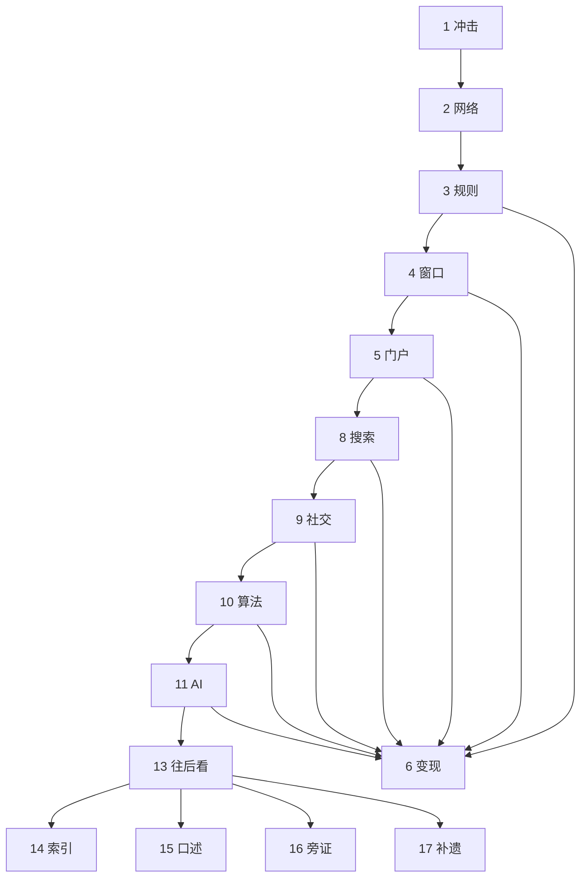

# 互联网编年：协议、入口与收束

> 尔曹身与名俱灭，不废江河万古流。  
> ——杜甫《戏为六绝句》其二

> 1957 年的一声短波脉冲，把航天竞赛写成了军备与通信的同一件事。互联网不是从浏览器开始的，而是从「核打击下通信如何幸存」与「网络之网络」开始的。全文一条链：每一次外溢，都对着上一阶段的收束僵化；每一次外溢之后，又演化出更底层的新入口完成收束。上卷写到门户与信任规则（§1–7）；下卷从搜索写到 AI（§8–12）；§13 把同一条链接到可核对的行业节点；§14–17 为同一访谈的四层读法（索引 / 口述 / 旁证 / 补遗，分工见读法）。可与本库 [10](./10-computing-cloud-chronicle.md)（计算如何池化）、[11](./11-information-theory-chronicle.md)（信息如何被度量）、[12](./12-artificial-intelligence-chronicle.md)（智能机制编年）、[13](./13-world-hegemony-transfer-chronicle.md)（标准与公共品）、[15](./15-browser-custody-chronicle.md)（窗口内部如何代管）、[50](../50-strategy/50-ai-industry-disruption-strategy.md)（2026 交叠点与智能体入口）对照。

先给一个直接答案：

> **谁定义协议，谁就定义架构；谁卡入口，谁就收流量。** 上卷：冲击 → 网络 → 规则 → 窗口 → 注意力（门户）→ 变现（信任规则）。下卷：搜索把主动需求明码标价；社交把注意力从版主收到平台，微信把注意力与变现装进同一闭环；算法吃掉「关注」关系；AI 收束知识源头，并把「告诉你什么」升级成「帮你做什么」。去中心化本身也需要规则。后三十年，注意力与变现趋向合一；游戏从「谁定义协议」换成「谁拥有算力、数据和模型参数」。2026 不是爆发之年，是智能体刚开场、统一调用它们的「浏览器」尚未出现的交叠点——下一场收束，大概率落在智能体协议与入口，而不是再做一个聊天框。产品加 AI 是必要条件，完整、复杂、高价值的任务才是分水岭；组织要从岗位转向任务。中国从接入者变成逻辑输出者——超级应用、算法分发、内容即货架。同一访谈四层见 §14–17，穿透与护城河见 [50](../50-strategy/50-ai-industry-disruption-strategy.md)。

**10-chronicle 系列导读：** [10](./10-computing-cloud-chronicle.md)–[12](./12-artificial-intelligence-chronicle.md) 写计算、信息与智能的技术史；[13](./13-world-hegemony-transfer-chronicle.md) 写世界领导权与公共品。本文是**互联网如何成为「网络之网络」**的编年：协议是架构，入口是杠杆，注意力是流量，信任与算法是闭环。智能机制的可观察量见 [12](./12-artificial-intelligence-chronicle.md)；产业穿透与 2026 交叠点见 [50](../50-strategy/50-ai-industry-disruption-strategy.md)；本文写的是入口与权力如何一层层收束。

### 读法：一条链

全文不是上下两篇并列故事，而是同一条「收束—外溢」链。顺读按左列。§6 与上卷窗口、门户并行；到微信、直播与 AI，变现不再旁支，而是同一界面的另一面。§14–17 是同一期访谈的四种读法，不是编年的下一浪。

| 段 | 章节 | 这一段完成什么 |
|----|------|----------------|
| **一、冲击** | §1 | 斯普特尼克 → ARPA / NASA |
| **二、网络** | §2 | ARPANET、IMP、「LO」、TCP/IP |
| **三、规则** | §3 | OSI vs TCP/IP；捆绑 + 免费；协议即权力 |
| **四、窗口** | §4 | Mosaic / 网景 / IE 预装：卡位先于产品 |
| **五、注意力** | §5 | 门户定义「什么是重要信息」；人为权力外溢向搜索 |
| **六、变现** | §6 | 亚马逊评论、eBay 互评、淘宝担保 |
| **七、上卷收束** | §7 | 协议、窗口、头条、信任已经分层 |
| **八、提问** | §8 | 搜索解放主动需求；注意力明码标价；云定义算力如何被消费 |
| **九、关系** | §9 | 论坛版主 → 社交图谱 → 微信超级应用 |
| **十、分发** | §10 | 推荐引擎吃掉关注；TikTok 倒灌；内容即货架 |
| **十一、源头** | §11 | 大模型：从分发已有信息到生产新内容 |
| **十二、尾声** | §12 | 收束三类；中美位置变化 |
| **十三、往后看** | §13 | 下一场收束：智能体协议与入口；2026 是交叠点 |
| **十四、索引** | §14 | 判断 1–42，接到入口链 |
| **十五、口述** | §15 | 同一访谈的第一人称精编 |
| **十六、旁证** | §16 | 点名全文、柯林斯、UIUC |
| **十七、补遗** | §17 | Token、石油公司、Chegg、60 分奇点 |
| **十八、出处** | §18 | 出处可核 |

**曾鸣访谈四层。** 同一期节目，四层不互相替代：§14 给编号，§15 给原话，§16 给点名与组织解剖，§17 给前三节没有单独展开的环节。要对读，按下表取独有。

| 层 | 体裁 | 独有 |
|----|------|------|
| §14 | 索引 | 判断 1–42；六组接到本文链 |
| §15 | 口述 | 第一人称节奏、类比与数字 |
| §16 | 旁证 | UIUC、点名全文、柯林斯、公司四层 |
| §17 | 补遗 | Token 一度电、石油公司不造车、Chegg、60 分奇点、飞书、老板心态 |

## 摘要

1957 年斯普特尼克 1 号入轨，苏联展示洲际投送与全球通信的可能。美国于 1958 年成立 ARPA（后更名 DARPA）与 NASA。ARPA 的信息处理技术办公室把「人机共生」「星际计算机网络」做成思想原型；分时系统、跨大陆实验、分组交换与 IMP，在 1969 年 10 月 29 日交出第一条主机间消息——「LO」。NCP 只能在封闭科研网里用；瑟夫与卡恩提出 TCP，1980 年代定型为 TCP/IP，「网络之网络」在技术上成型。

标准之争里，OSI 七层追求完美，TCP/IP 与 BSD Unix 捆绑且免费。1983 年 Flag Day 之后，市场即权力、免费即王道反复上演。浏览器战争把同一逻辑复刻到 Windows 预装；门户把空白地址栏收成编辑推荐的注意力；电商并行发展出三种信任规则——亚马逊的评论生态、eBay 的双向互评、淘宝的担保交易。中国 1987 年发出跨境邮件，1994 年全功能接入；上卷角色是接入者、使用者与模式移植者。

下卷从搜索开始。PageRank 按链接结构给网页打分，打破门户编辑对「什么重要」的垄断；AdWords 与竞价排名让注意力明码标价。AWS 与阿里云把闲置算力写成「计算力如何被消费」。论坛与贴吧是社交的史前时代；Facebook 把内容生产权外溢到人，平台仍是裁判；微信把即时通讯、内容、支付与小程序做成超级应用，注意力与变现第一次装进同一闭环。今日头条没有美国原型：与其让用户找，不如让系统喂。抖音 / TikTok 把算法分发倒灌给美国。Transformer 与 ChatGPT 把注意力从分发渠道抬到知识源头。尾声把六十年收成「收束—外溢」：前期如何连接，中期看到什么，后期逼近想什么、做什么。后三十年两条线趋向合一；新游戏是算力、数据与模型参数。往后看，2026 更宜读成交叠点而不是爆发之年：传统搜索面临对话与智能体分流；企业应用开始嵌入任务型智能体；智能体之间的互操作协议正在重演「谁写规则谁写架构」。统一调用智能体的入口尚未出现——结构上像浏览器出现之前的那几年。曾鸣访谈把同一交叠点拆成四十二则：三阶段与 AI 云、完整任务与入口信任、组织从岗位转向任务、看十年想三年干一年、机器人与巨头无安全区、人的价值回到创造。口述推演，不是已完成的事实；同一访谈四层见 §14–17，产业穿透见 [50](../50-strategy/50-ai-industry-disruption-strategy.md)。

**关键词：** 互联网史；ARPANET；TCP/IP；浏览器；门户；搜索；推荐算法；智能体；曾鸣；三阶段；完整任务；比雅虎更早；60 分奇点

---

## 目录

- [摘要](#摘要)
- [读法：一条链](#读法一条链)

**一、冲击**

1. [序幕：斯普特尼克与 ARPA](#1-序幕斯普特尼克与-arpa)

**二、网络**

2. [ARPANET：一切开始于一个军方项目](#2-arpanet一切开始于一个军方项目)
    - [2.1 核打击下的通信与思想原型](#21-核打击下的通信与思想原型)
    - [2.2 拼图：分时、广域实验与分组交换](#22-拼图分时广域实验与分组交换)
    - [2.3 启动：三台终端、IMP 与「LO」](#23-启动三台终端imp-与lo)
    - [2.4 公开演示、NCP 与 TCP/IP](#24-公开演示ncp-与-tcpip)
    - [2.5 时间差：中国与欧洲](#25-时间差中国与欧洲)

**三、规则**

3. [标准之争：定义「游戏规则」](#3-标准之争定义游戏规则)
    - [3.1 OSI 的完美图纸](#31-osi-的完美图纸)
    - [3.2 Flag Day、BSD 与「捆绑 + 免费」](#32-flag-daybsd-与捆绑--免费)
    - [3.3 协议即权力](#33-协议即权力)
    - [3.4 越过长城](#34-越过长城)

**四、窗口**

4. [浏览器之争：搭建「通往世界的窗口」](#4-浏览器之争搭建通往世界的窗口)
    - [4.1 Mosaic 与网景](#41-mosaic-与网景)
    - [4.2 预装权与反垄断](#42-预装权与反垄断)
    - [4.3 中国接入：接入者与使用者](#43-中国接入接入者与使用者)

**五、注意力**

5. [门户网站：定义「什么是重要信息」](#5-门户网站定义什么是重要信息)
    - [5.1 雅虎与编辑推荐制](#51-雅虎与编辑推荐制)
    - [5.2 中国三大门户](#52-中国三大门户)
    - [5.3 人为权力的瓶颈](#53-人为权力的瓶颈)

**六、变现**

6. [商业变现：另一条线里的信任规则](#6-商业变现另一条线里的信任规则)
    - [6.1 亚马逊：建规则，而不只是卖书](#61-亚马逊建规则而不只是卖书)
    - [6.2 eBay：用声誉机制取代信任中介](#62-ebay用声誉机制取代信任中介)
    - [6.3 淘宝与支付宝：担保交易](#63-淘宝与支付宝担保交易)

**七、上卷收束**

7. [上卷要点](#7-上卷要点)

**八、提问**

8. [搜索引擎：解放「主动需求」](#8-搜索引擎解放主动需求)
    - [8.1 PageRank 与 Google](#81-pagerank-与-google)
    - [8.2 AdWords：注意力明码标价](#82-adwords注意力明码标价)
    - [8.3 百度竞价排名](#83-百度竞价排名)
    - [8.4 从 2C 到 2B：AWS 与阿里云](#84-从-2c-到-2baws-与阿里云)

**九、关系**

9. [社交媒体：从论坛到超级应用](#9-社交媒体从论坛到超级应用)
    - [9.1 史前：论坛与贴吧](#91-史前论坛与贴吧)
    - [9.2 Facebook 与个体赋能的悖论](#92-facebook-与个体赋能的悖论)
    - [9.3 微信超级应用](#93-微信超级应用)
    - [9.4 流媒体、本地生活与算法介入](#94-流媒体本地生活与算法介入)

**十、分发**

10. [算法时代：比你更懂你](#10-算法时代比你更懂你)
    - [10.1 今日头条：没有美国原型](#101-今日头条没有美国原型)
    - [10.2 抖音与 TikTok 倒灌](#102-抖音与-tiktok-倒灌)
    - [10.3 茧房、黑盒与内容即货架](#103-茧房黑盒与内容即货架)

**十一、源头**

11. [AI 时代：从分发已有信息到生产新内容](#11-ai-时代从分发已有信息到生产新内容)
    - [11.1 Transformer 与 ChatGPT](#111-transformer-与-chatgpt)
    - [11.2 算力、数据与话语权](#112-算力数据与话语权)
    - [11.3 中国赛道与万能入口](#113-中国赛道与万能入口)

**十二、尾声**

12. [尾声：收束与外溢](#12-尾声收束与外溢)

**十三、往后看**

13. [往后看：下一场收束还没有名字](#13-往后看下一场收束还没有名字)
    - [13.1 提问：搜索被对话分流](#131-提问搜索被对话分流)
    - [13.2 变现：货架交给代理，结账仍多半在人](#132-变现货架交给代理结账仍多半在人)
    - [13.3 规则：智能体协议重演「谁写架构」](#133-规则智能体协议重演谁写架构)
    - [13.4 窗口：还缺一个「智能体的浏览器」](#134-窗口还缺一个智能体的浏览器)
    - [13.5 边界：能力先爆，入口与治理未闭合](#135-边界能力先爆入口与治理未闭合)

**十四、索引**

14. [曾鸣四十二则：阶段、任务、组织与人](#14-曾鸣四十二则阶段任务组织与人)
    - [14.1 产业刚进入 Agent 应用阶段（判断 1–9）](#141-产业刚进入-agent-应用阶段判断-19)
    - [14.2 完整任务才是分水岭（判断 10–18）](#142-完整任务才是分水岭判断-1018)
    - [14.3 转型进入组织（判断 19–27）](#143-转型进入组织判断-1927)
    - [14.4 不确定时更要战略（判断 28–31）](#144-不确定时更要战略判断-2831)
    - [14.5 机器人与巨头无安全区（判断 32–38）](#145-机器人与巨头无安全区判断-3238)
    - [14.6 人的价值回到创造（判断 39–42）](#146-人的价值回到创造判断-3942)

**十五、口述**

15. [精编：2026 像极了 1995](#15-精编2026-像极了-1995)
    - [15.1 第一阶段刚刚成熟，第二阶段刚刚开场](#151-第一阶段刚刚成熟第二阶段刚刚开场)
    - [15.2 模型公司是未来的 AI 云，不是终局赢家](#152-模型公司是未来的-ai-云不是终局赢家)
    - [15.3 Agent 是第二阶段的主体，复杂任务才值得做](#153-agent-是第二阶段的主体复杂任务才值得做)
    - [15.4 科层制会衰亡，组织永远存在](#154-科层制会衰亡组织永远存在)
    - [15.5 从战略规划到战略生成，关键在「想三年」](#155-从战略规划到战略生成关键在想三年)
    - [15.6 当智能可以外购，人只剩下创造力](#156-当智能可以外购人只剩下创造力)

**十六、旁证**

16. [旁证：比雅虎更早](#16-旁证比雅虎更早)
    - [16.1 总框架：产业化的三个阶段](#161-总框架产业化的三个阶段)
    - [16.2 2026：第一阶段收尾，第二阶段开场](#162-2026第一阶段收尾第二阶段开场)
    - [16.3 「这次不一样」是幻觉：模型公司是 AI 云](#163-这次不一样是幻觉模型公司是-ai-云)
    - [16.4 青黄不接的 Agent，与必然出现的新平台](#164-青黄不接的-agent与必然出现的新平台)
    - [16.5 「公司」会被淘汰：从岗位到任务](#165-公司会被淘汰从岗位到任务)
    - [16.6 战略从规划变成生成](#166-战略从规划变成生成)
    - [16.7 优秀是正反馈，卓越要扛住负反馈](#167-优秀是正反馈卓越要扛住负反馈)
    - [16.8 没有巨头是安全的](#168-没有巨头是安全的)
    - [16.9 机器人：在等它的 T 型车](#169-机器人在等它的-t-型车)
    - [16.10 消化一代人，创造是无中生有](#1610-消化一代人创造是无中生有)

**十七、补遗**

17. [补遗：Token、石油公司与 60 分奇点](#17-补遗token石油公司与-60-分奇点)
    - [17.1 Token 像一度电，入口还看不见原型](#171-token-像一度电入口还看不见原型)
    - [17.2 石油公司不造车；ChatGPT 不是 Yahoo](#172-石油公司不造车chatgpt-不是-yahoo)
    - [17.3 10 倍切入点与 Cursor 折叠](#173-10-倍切入点与-cursor-折叠)
    - [17.4 飞书不够：先组织，后战略](#174-飞书不够先组织后战略)
    - [17.5 优秀者的建议，不适配卓越者](#175-优秀者的建议不适配卓越者)
    - [17.6 Chegg 与 60 分奇点](#176-chegg-与-60-分奇点)
    - [17.7 Seed 世界级，马斯克给不出答案](#177-seed-世界级马斯克给不出答案)
    - [17.8 机器人像家电；别假装安全](#178-机器人像家电别假装安全)

**十八、出处**

18. [参考文献](#18-参考文献)

---

## 1. 序幕：斯普特尼克与 ARPA

1957 年 10 月 4 日，莫斯科时间 22 时 28 分，苏联第五科研试验靶场。哈萨克草原的寒夜里，银白色 R-7 运载火箭伫立于发射台。地下掩体中，总设计师谢尔盖·科罗廖夫（Sergei Korolev）坐镇指挥，面如平湖，胸有惊雷。R-7 此前多次试射失利，一旦再败，整个项目便会夭折。冷战背景下，为抢先完成卫星发射，项目删减科学载荷，仅保留无线电设备，准备将 83.6 公斤的「斯普特尼克 1 号」送入太空。

倒计时结束，火箭点火起飞。在芯级飞行段，助推器—贮箱平衡系统异常，导致推进剂消耗失衡，芯级发动机比预定时间提前约 0.6 秒关机。卫星入轨轨道因此低于设计预期，但仍顺利分离入轨。随后天线展开，持续发出标志性的短波脉冲，以 96.2 分钟周期环绕地球飞行。发射场欢声雷动。人类历史上第一颗人造卫星，就此进入太空。它同时展示两项军事能力：其一，掌握洲际导弹远程投送技术，具备核打击威慑能力；其二，掌握通信卫星发射技术，覆盖全球的卫星通信可能。

消息迅速传遍全球，太平洋彼岸的美国舆论哗然。国会随即举行听证，举国反思尖端科技短板。为杜绝技术被动、防范战略突袭，美国于 1958 年相继成立高级研究计划局（ARPA，后更名为 DARPA）和国家航空航天局（NASA），大力布局前沿科技研发，直面苏联军备竞赛。

本文将从 ARPA 开始，讲述整个互联网的历史故事。上卷写到门户与信任规则（§1–7）；下卷从搜索写到 AI（§8–12）；趋势见 §13；同一访谈四层见 §14–17。

---

## 2. ARPANET：一切开始于一个军方项目

冲击之后，问题落到指挥通信：若遭遇灾难性核打击，网络如何幸存？这一节是上卷的河床——分组交换、分布式、接口报文处理机，以及「不是让任何一个网络成为中心」。

### 2.1 核打击下的通信与思想原型

ARPA 成立之初，主要承担航天运载、导弹防御、「维拉」核爆炸监测（Project Vela）等国防项目。在反导、雷达预警以及核战争条件下美军指挥通信的研究中，一个尖锐问题浮出水面：若遭遇「灾难性核打击」，通信如何幸存？这一需求后来深刻影响了 ARPANET 的分布式容错设计，但在当时，它还只停留在军事指挥的设想层面。

1962 年，ARPA 设立信息处理技术办公室（IPTO）。首任主任利克莱德（J.C.R. Licklider）提出「人机共生」与「星际计算机网络」构想：任何人可跨地域远程访问异地计算机，共享程序与数据。这成为了 ARPANET 的思想原型。

### 2.2 拼图：分时、广域实验与分组交换

1963 年，ARPA 资助麻省理工学院（MIT）的 Project MAC、兰德公司的 JOSS 等分时系统项目。分时系统让多个终端用户同时共享一台大型机算力，实现远程登录与交互操作，为跨机器资源共享铺平道路。这为 ARPANET 的诞生收集了第一块拼图。

1965 年，劳伦斯·罗伯茨（Lawrence G. Roberts）用电话线把 MIT 的 TX-2 计算机跨大陆连到圣莫尼卡的 Q-32，完成最早的广域通信实验，证明跨洲异构计算机通信可行，也暴露出电话线路效率低、不适合计算机突发流量的缺陷。打个比方：电话通信像两人占用一条专属小路，通话结束即释放；计算机通信则像一条高速公路，大家排队分时使用。值得一提的是，罗伯茨后来成为 ARPANET 项目主管。

与此同时，ARPA 支持道格拉斯·恩格尔巴特（Douglas Engelbart）的人机交互研究，让 SRI 积累网络工程能力。IPTO 吸纳伦纳德·克莱因罗克（Leonard Kleinrock）的分组交换数学模型、保罗·巴兰（Paul Baran）的分布式容错思想，并结合英国学者的分组概念，最终确定分组交换技术路线。

ARPA 汇集多方科研力量，积累工程经验，完成理论、实验、项目与人才储备，为 ARPANET 的诞生慢慢集齐所有拼图。

### 2.3 启动：三台终端、IMP 与「LO」

1966 年，IPTO 时任主任罗伯特·泰勒（Robert Taylor）发现办公室里摆着三台终端，分别连接三台不同计算机：一台在麻省理工学院，一台在加州大学伯克利分校，一台在圣莫尼卡的系统开发公司。三台终端，三套操作系统，三种命令语言。他后来回忆：「我当时想，为什么不弄一个终端，连到所有计算机上？这个想法就是 ARPANET 的起源。」

泰勒说服 ARPA 局长查尔斯·赫兹菲尔德（Charles Herzfeld），拿到 100 万美元启动经费。赫兹菲尔德后来回忆，这个决定「大约用了 20 分钟」。100 万美元，20 分钟，ARPANET 正式启动。

1968 年，BBN 公司赢得合同，负责建造第一代接口报文处理机（IMP）。IMP 可理解为一台「翻译器」：每台主机把数据交给 IMP，IMP 将其打包成标准格式，再经电话线路发给下一个 IMP。这套设计让不同型号、不同操作系统的计算机第一次能够「对话」。BBN 工程师团队中有一个人叫罗伯特·卡恩（Robert Kahn），他后来成为 TCP/IP 协议共同发明者。

历史性时刻到了。1969 年 10 月 29 日晚上 10 点 30 分，美国加州大学洛杉矶分校（UCLA）博尔特楼 3420 房间。研究生查理·克莱恩（Charley Kline）坐在一台 SDS Sigma 7 计算机终端前，准备向 500 多公里外的斯坦福研究所（SRI）发送 ARPANET 上第一条主机间消息。克莱恩先与 SRI 程序员比尔·杜瓦尔（Bill Duvall）电话确认线路畅通，然后开始输入「LOGIN」。他敲下「L」，电话那头传来杜瓦尔的声音：「收到了。」他敲下「O」，杜瓦尔说：「收到了。」他敲下「G」，然后系统崩溃了。人类互联网的第一条消息，是「LO」。这个音节在英语里恰好是「看哪」的旧式感叹词，也像极了对即将到来的互联网时代「注意力」争夺的预言。克莱因罗克后来在回忆中反复讲这个细节：我们没想搞什么革命，我们只是想登录一下。

1969 年底，ARPANET 连接四个节点：UCLA、SRI、加州大学圣巴巴拉分校（UCSB）、犹他大学（University of Utah）。四台主机、四台 IMP，拓扑是一条没有中心节点的短链——分组交换要证明的，正是这件事。到 1971 年，节点扩展到 15 个。

### 2.4 公开演示、NCP 与 TCP/IP

1972 年 10 月，泰勒的继任者罗伯茨在华盛顿希尔顿酒店组织 ARPANET 第一次公开演示。他把一台 IMP 直接搬进会议厅，参会者可亲自操作终端，连接全国各地计算机。这次演示让许多原本怀疑分组交换（Packet Switching，一种把大数据拆成小包裹分别传送的技术）是否可行的工程师和官员改变了态度。但彼时 ARPANET 仍是一个封闭科研网络，其通信协议 NCP（网络控制协议）只能在这套系统内部使用。到 1977 年，据当年目录口径，网已长到约 57 个节点、113 台主机；逻辑图上画出的是主机与 IMP 的分层，不是电话线路的物理走线。网长大了，NCP 却仍是内部语言。

如果每个网络都用自己的「内部语言」，「网络之网络」就永远只是口号。1973 年，那位 BBN 工程师罗伯特·卡恩开始思考如何让不同网络按相同标准互相通信。他找到在 UCLA 任教授的温顿·瑟夫（Vinton G. Cerf）。两人在旧金山凯悦酒店大堂里，在一张餐巾纸上画出 TCP 协议的最初设计草图。这个细节在后来的互联网历史叙事中被反复渲染：餐巾纸、两个年轻工程师、一个改变世界的想法。瑟夫本人对此比较冷静。他在 2006 年一次访谈中说：「我不记得那张餐巾纸了，但那个讨论是真实的。我们当时想的是怎么让不同网络之间能够互相通信，而不是让任何一个网络成为中心。」

注意这句话，「不是让任何一个网络成为中心。」这是互联网最早的「去中心化」理想。但历史将证明，去中心化本身也需要规则，而规则的制定者就是权力的源头。

1974 年 5 月，瑟夫和卡恩在《IEEE Transactions on Communications》（IEEE 通信学报，IEEE 即美国电气电子工程师学会）上发表论文《一种分组网络互连协议》（A Protocol for Packet Network Intercommunication）。论文提出「传输控制协议」（TCP，Transmission Control Protocol），首次把「连接」和「传输」分开，让数据包可在不同网络之间被路由、重组、纠错。1980 年，TCP/IP 拆成两层：TCP 负责端到端可靠传输，IP（Internet Protocol，互联网协议）负责寻址和路由。TCP/IP 协议簇基本定型。至此，「网络之网络」在技术上成型，互联网的所有条件已具备。

### 2.5 时间差：中国与欧洲

彼时，远在大洋彼岸的中国。1969 年，中国科学院计算技术研究所开始研究「计算机通信」，但进度缓慢。1970 年代末，中国才有了第一台真正意义上的计算机通信试验。当美国人在凯悦酒店大堂里画 TCP 草图时，中国人还在解决「有没有计算机」的问题。这个时间差，决定了后来几十年的技术权力格局。

与中国的落后不同，彼时欧洲雄心勃勃。在美国人的「网络之网络」思想提出后，大西洋对岸的欧洲人敏锐意识到时代变化，并迅速拿出另一套方案。一场关于「谁来定义互联网底层规则」的战争，即将打响。

---

## 3. 标准之争：定义「游戏规则」

网络在技术上成型之后，真正的战争是：谁来定义底层规则。OSI 追求完美的七层图纸；TCP/IP 已经搭起来，并且免费。

### 3.1 OSI 的完美图纸

如果你在 1980 年代中期走进任何一间欧洲电信实验室，问起「未来网络应该怎么建」，得到的答案几乎不可能是 TCP/IP。你会被带进一间会议室，墙上挂着一幅巨大的七层模型图，旁边站着一位西装革履的工程师，指着图说：「这就是未来。它叫 OSI（Open Systems Interconnection，开放系统互连）。」

OSI 是国际标准化组织（ISO）自 1977 年起制定的网络通信标准。它把网络通信划分为七层：物理层、数据链路层、网络层、传输层、会话层、表示层、应用层。每一层都有严格定义的接口、功能和协议。OSI 的目标是「完美」：让任何厂商的设备、任何国家的网络都能无缝对接。欧洲各国政府、电信运营商和大厂商，包括 IBM、DEC、西门子等巨头，纷纷投入巨资支持。法国、德国、英国都设立了国家级 OSI 推广计划。

如果说 OSI 是欧洲最顶尖建筑事务所设计的摩天大楼，图纸精确到每一毫米，每根钢梁都有编号，每个房间都有规定用途；那么 TCP/IP 更像一群美国工程师搭出来的砖混房子，只有四层，没有严格分层，会话层和表示层干脆没有定义，许多功能靠「凑合」。用当时一位网络工程师的话说：「TCP/IP 是那种你不好意思写在简历上的东西，但你就是离不开它。」OSI 七层、TCP/IP 四层，对照后来写进教材几十年；真正决定胜负的不是图纸层数，而是谁已经跑在机器上。

### 3.2 Flag Day、BSD 与「捆绑 + 免费」

为什么离不开？因为它已经搭起来了。1983 年 1 月 1 日，美国国防部强制要求 ARPANET 所有节点从 NCP 切换到 TCP/IP。这一天被称为「Flag Day」，因为所有节点必须在同一天完成切换，任何不切换的节点都将在第二天被切断连接。克莱因罗克回忆说：「那是一个紧张的日子，但切换非常顺利。我们当时就知道，这件事成了。」

更关键的一步，是 TCP/IP 与 BSD Unix 的合流。Unix 是 AT&T 贝尔实验室于 1969 年开发的多用户操作系统，后来在学术界广泛传播。BSD（Berkeley Software Distribution）是加州大学伯克利分校在 Unix 基础上开发的增强版本。1980 年，DARPA 资助伯克利的计算机系统研究小组（CSRG），把 TCP/IP 协议栈移植到 BSD Unix 中。合同条件是：BSD 必须免费提供 TCP/IP 代码给任何人使用。1983 年发布的 BSD 4.2 版本，内置了完整的 TCP/IP 协议栈。这意味着，任何拿到 BSD 源码的大学、实验室、初创公司，都能零成本获得 TCP/IP 的通信能力，不用向包括 DARPA 在内的任何机构支付授权费，也不用等待任何标准组织的批准。

这就像欧洲人还在开一场长达数年的标准制定会议，争论窗户该用什么玻璃、门把手该用什么合金；美国人已经把一栋砖混房子免费送给了全世界所有想住的人。房子简陋，但能住，而且不要钱。BSD Unix 支配操作系统市场，TCP/IP 协议免费，将二者捆绑简直就是王炸。这种「市场即权力 + 免费即王道」的逻辑，将在未来的互联网历史上不断上演。

ISO 的决策机制是「每一个成员国都有否决权」，这意味着任何一个国家的代表对某一层协议有异议，整个标准的推进都会被拖慢。更麻烦的是，OSI 协议栈极其复杂：光是「会话层」和「表示层」的规范就写了厚厚的几大本，而 TCP/IP 的实现代码已经在不同操作系统之间跑通了。一位参与 OSI 标准制定的工程师后来接受《IEEE Spectrum》杂志采访时说：「我们花了三年时间争论一个『连接』的定义，而美国人的代码已经飞到世界各地的服务器上去了。」

1988 年，欧洲学术网络 EARN 和 BITNET 开始测试 TCP/IP。1989 年，欧洲核子研究中心（CERN）的蒂姆·伯纳斯-李（Tim Berners-Lee）以 TCP/IP 为底层协议，开始构建后来被称为「万维网」（World Wide Web）的系统。1990 年，欧洲研究网络协会（RARE）正式宣布支持 TCP/IP。1992 年，互联网协会（ISOC）在美国弗吉尼亚州莱斯顿成立，瑟夫担任首任主席。OSI 模型彻底败北，沦为计算机网络教材中的「参考模型」，一种用来教学、却永远不会被真正使用的「理想模型」。

万维网后来成为占据绝对主导地位的应用层信息标准。依托 HTTP、HTML 与 URL 这套开放规范，图文超链接的浏览模式压倒了 Gopher、WAIS 等早期信息检索方案，成为绝大多数用户接入、浏览网络信息的首选方式，推动互联网从科研人员的专业工具走向大众。网站网址以「www.」开头，便源自万维网。

### 3.3 协议即权力

TCP/IP 的胜利，并不等于「先进」的胜利，而是「捆绑 + 免费」的胜利。美国人胜在计算与通信的系统性，胜在市场，胜在免费，胜在高效。瑟夫和卡恩被称为「互联网之父」，他们的每一个技术决策，包括地址空间大小、协议字段定义、路由策略，都成为后来所有网络应用的底层约束。IPv4 的 32 位地址空间只有约 43 亿个地址，在 1970 年代看似充足，到 2010 年代初却面临枯竭。为什么这么少？因为制定协议的时候，没有人能想到互联网会连接手机、汽车、家电、摄像头，更没有人能想到每个设备都需要一个 IP 地址。

网络法学者劳拉·迪纳尔迪斯（Laura DeNardis）在《协议政治》中写道：「互联网的治理，本质上是对协议标准的治理。谁控制了协议，谁就控制了互联网的架构。」

### 3.4 越过长城

在同时期的中国，发生了一件不起眼但影响深远的事。1987 年 9 月 20 日，中国兵器工业计算机应用研究所依托中德 CANET 合作项目，经由德国卡尔斯鲁厄大学中转节点，发出中国第一封跨境电子邮件。邮件内容：「Across the Great Wall we can reach every corner in the world（越过长城，我们可以到达世界的每一个角落）」。这次邮件互通代表中国科研网络实现跨境邮件连通，但距离 1994 年全功能接入国际互联网还有七年。

普通人不知道 TCP/IP 是什么，也不关心 OSI 是什么。他们只关心一件事：打开电脑，能看到什么。互联网的权力结构与逻辑，从它诞生那一天起就已被决定，美国人站在了规则的上帝视角。下一步，便是比谁能在这个结构中占据更有利的战略高地，从而掌握「流量入口」。

---

## 4. 浏览器之争：搭建「通往世界的窗口」

规则已定，第一个战略高地是窗口：用户看见世界的那一层软件。技术好、产品好、体验好，都不如卡位好。

### 4.1 Mosaic 与网景

1993 年 4 月，美国伊利诺伊大学厄巴纳—香槟分校（UIUC）的国家超级计算应用中心（NCSA）发布了一款软件：Mosaic（马赛克浏览器），作者是 22 岁的马克·安德森（Marc Andreessen）和 29 岁的埃里克·比纳（Eric Bina）。Mosaic 首次实现图像与文字混排，用户点击链接就能跳转到另一个网页，安装和操作都很简单。NCSA 把它放在 FTP 服务器上供人免费下载。一年内，下载量突破 200 万次。

在 Mosaic 之前，互联网是一个「纯文本」世界，用户看到的只有文字、链接和命令行。Mosaic 让网页有了「画面」：图片、标题、按钮。这就像从报刊亭走进了电影院。但 Mosaic 的发布者 NCSA 是一个半学术、半政府机构，对商业化的态度暧昧不清。

1994 年 4 月，安德森和硅谷风险投资家吉姆·克拉克（Jim Clark）共同创立网景通信公司（Netscape Communications），同年 12 月发布 Netscape Navigator 浏览器。网景的策略是「免费给个人，收费给企业」。1995 年 8 月 9 日，网景在纳斯达克上市。发行价 28 美元，开盘价 71 美元，首日收盘市值超过 20 亿美元。一家成立仅 16 个月、累计收入不到 2000 万美元的公司，一夜之间成为华尔街神话。

### 4.2 预装权与反垄断

但真正改变战局的力量在西雅图。微软创始人比尔·盖茨（Bill Gates）在 1995 年 5 月 26 日发给全体高管的备忘录《互联网潮汐》（The Internet Tidal Wave）中写道：「互联网是自 IBM PC 1981 年问世以来最重要的一项发展……它是一股潮汐，要么淹没我们，要么载我们前行。」

微软的应对策略简单粗暴：把浏览器绑定到 Windows 操作系统上。你买一台 Windows 电脑，桌面上就有一个蓝色的「e」图标。用户不需要下载网景浏览器，不需要安装任何东西。IE（Internet Explorer）就在那里，点一下就打开。这种策略被称为「预装」（Preinstallation）。不是说服你选择我，而是「帮你」选择。美国人从一开始就对互联网的逻辑门清：TCP/IP 免费，浏览器免费；捆绑 BSD Unix，捆绑 Windows。如今智能手机时代的预装 APP，学的是 ARPA，学的是微软。

1998 年 5 月，美国司法部联合 20 个州起诉微软，指控其利用操作系统垄断地位非法排挤网景浏览器。但 IE 市场份额仍旧势不可挡，并于当年首次超越网景。11 月，随着市场不断下滑，网景被美国在线（AOL）以 42 亿美元收购。在当年的庭审中，控方引用微软多封内部邮件，将其商业策略概括为「切断网景的空气供应」（to cut off Netscape's air supply），这句话成为反垄断案的标志性证据。2000 年 6 月，联邦法官裁定微软违反反垄断法，并下令拆分微软。微软上诉，2001 年与美国司法部达成和解。但六年时间不等人。战争早已结束，网景输了。

1995 年 6 月，微软曾邀请网景高管到西雅图总部「谈谈合作」。网景方面由 CEO 詹姆斯·巴克斯代尔（James Barksdale）和安德森代表出席。会议气氛并不友好。网景的人后来在证词中称，微软提出「分工」：网景做非 Windows 平台的浏览器，微软做 Windows 平台的浏览器，否则微软将不提供技术支持。网景拒绝了。微软方面否认这一说法。但有一点无法否认：微软拥有 Windows，而 Windows 是数亿人进入互联网的第一道门。这道门的钥匙上，刻着「预装权」。

浏览器战争给互联网历史留下了一个深刻的教训：技术好、产品好、体验好，都不如「卡位好」。网景的浏览器曾比 IE 更快、更稳定、更符合标准，但它需要用户主动下载。IE 什么都不用做，就躺在用户桌面上；不仅个人用户免费，企业用户也免费。用户不关心浏览器是谁做的，只关心「能不能用？花不花钱？」这是对「BSD Unix + TCP/IP」的「市场即权力 + 免费即王道」的复刻，而这样的复刻还将继续。

### 4.3 中国接入：接入者与使用者

与此同时，1994 年 4 月 20 日，中国国家计算与网络设施工程（NCFC）通过一条 64K 的国际专线，正式接入国际互联网。这条专线的带宽，不到今天一部手机网速的千分之一，但它是中国互联网的「出生证」。同年 5 月，中国国家顶级域名「.CN」服务器在北京投入使用。从这一刻起，中国用户开始进入同一张网，却没有「入口」的权力。浏览器是美国的，操作系统是美国的，连上网要用的调制解调器，大多也是进口的。在第一阶段，中国互联网的发展路径以引进和适配为主，角色是「接入者」和「使用者」。

1996 年，中国互联网络信息中心（CNNIC）成立，开始统计全国上网人数。1997 年 10 月第一次报告显示：全国上网用户数仅 62 万。而同一时期，美国的互联网用户已经接近 6000 万。

---

## 5. 门户网站：定义「什么是重要信息」

窗口打开之后，地址栏是空的。谁来填写「今天什么重要」，谁就临时握有注意力。这一节的权力是人为的，因而必然被更个人化的工具挑战。

### 5.1 雅虎与编辑推荐制

浏览器普及之后，一个尴尬的问题随之而来：用户在地址栏里输入什么？1995 年的互联网没有像样的搜索引擎。面对空白的地址栏，用户只能靠朋友推荐、杂志介绍，或者碰运气。一个普通人第一次上网，很可能在地址栏里随便敲下「www.something.com」，然后得到一个「404 Not Found」。这时，门户网站出现了。

门户网站（Portal）的逻辑很简单：把互联网当成一本杂志来编。1994 年 1 月，杨致远和大卫·费罗（David Filo）在斯坦福大学电机工程系的拖车实验室里维护一个「网址目录」，把好玩的网站分门别类，做成树状结构。这个项目后来改名为雅虎（Yahoo!）。1995 年 3 月，雅虎公司成立。1996 年 4 月 12 日上市，首日市值 8.48 亿美元。

雅虎首页的设计逻辑是「编辑推荐制」：新闻、财经、体育、娱乐，每个栏目都由编辑手工挑选内容，放在首页推荐位上。用户打开的是一棵目录树，不是一个搜索框。首页头条就是当天的「封面故事」。1996 年到 1999 年，雅虎首页头条的影响力，几乎可以左右美股科技股当天的舆论风向。雅虎的编辑团队就是「互联网杂志」的编辑部，他们决定「什么是重要信息」。

### 5.2 中国三大门户

美国「门户战争」打响后，中国几乎在同一时间复制了这个模式。1998 年 2 月，从 MIT 回国的张朝阳在北京推出搜狐，首页完全模仿雅虎。1998 年 12 月，四通利方与华渊资讯合并，新浪网成立。1997 年 6 月，丁磊在广州创立网易，主打免费电子邮件和个人主页。中国三大门户的竞争焦点只有一样东西：首页头条。根据 CNNIC 第 5 次报告，到 2000 年 1 月，全国上网用户 890 万，绝大多数人的上网入口就是新浪、搜狐、网易的首页。而美国当时的互联网用户已超过 1 亿。从数字上看，中国依然落后一个数量级。但在「门户逻辑」上，中国已经完成了一次完整的「移植」。

1999 年 5 月 8 日，中国驻南联盟大使馆遭北约导弹袭击。新浪新闻中心是最早推送快讯的中文网站。当天，新浪首页头条持续滚动更新，新闻编辑通宵工作，服务器一度被访问请求压垮。许多中国网民就是在那一天第一次意识到：网页上的新闻比报纸和电视更快、更密集、更「实时」。此后，新浪新闻中心成为中文互联网最具影响力的信息集散地，首页头条的点击量动辄数百万。

### 5.3 人为权力的瓶颈

但门户网站的权力有一个致命瓶颈：编辑再勤奋，一天也只有 24 小时；首页推荐位再大，也就一屏半，但用户的需求却千差万别。一个想查「如何在阳台上种番茄」的人，不需要首页头条为他准备的国际新闻；一个想知道「感冒了吃什么药」的人，也不需要财经频道的股市评论。编辑的「灌输」逻辑开始失效，用户要的是「主动」。

门户网站的权力是「人为」的，它决定用户的注意力投向。而人为的权力，必然被人质疑、挑战、取代。当一个编辑决定「今天头条是某件新闻」时，他或许能影响几百万人的认知起点，却无法满足每一个用户的需求。这种「一刀切」的话语权，必然外溢向更个人化的工具。搜索引擎，就是那个工具。

门户网站的头条吸引用户注意力，搜索引擎的返回页首页也是用户注意力。不管注意力投向哪里，最终都要通过商业变现来完成闭环。

---

## 6. 商业变现：另一条线里的信任规则

注意力要闭环，就要变现。这一节不是门户的下一章，而是并行的一条线：陌生人如何在网上互相信任。亚马逊、eBay、淘宝面对同一问题，写出三种规则。

### 6.1 亚马逊：建规则，而不只是卖书

1994 年，杰夫·贝佐斯（Jeff Bezos）辞去华尔街对冲基金 D.E. Shaw 的工作，迁到西雅图。公司在贝尔维尤一处租来的车库里起步，品类选图书：美国图书市场约 190 亿美元，且没有被垄断巨头把持。1995 年 7 月 16 日，Amazon.com 正式上线；第一周售出约 1.2 万美元的书。1997 年 5 月 15 日纳斯达克上市。那时还没有后来的西雅图总部，只有门板书桌、电话线和一份「地球上最大书店」的目录。

但亚马逊的真正转折点，不是「卖书」，而是「建规则」。1996 年，传统连锁书店博德斯推出自己的网站，试图用品牌和渠道优势压制亚马逊。贝佐斯团队给出了一个颇具平台思维的对策：建立评论板块，鼓励读者对所购图书进行评价。社区一旦形成，用户就不是在买书，而是在参与一个由亚马逊定义规则的生态。这个逻辑后来被放大到几乎所有品类。

### 6.2 eBay：用声誉机制取代信任中介

在电商的另一个方向上，eBay 走了完全不同的路。1995 年 9 月 4 日，28 岁的皮埃尔·奥米迪亚（Pierre Omidyar）在圣何塞的客厅里上线了「AuctionWeb」。eBay 的杀手锏是「反馈系统」：买卖双方互相评分，用声誉机制取代传统交易中的信任中介。这个看似简单的设计，让 eBay 成为「第一个大型 P2P 在线交易平台」。它的变现逻辑不是「我卖什么」，而是「我定义买卖双方如何互信」。

### 6.3 淘宝与支付宝：担保交易

在中国，电商在 2003 年找到了自己的路径。2003 年 5 月，淘宝网上线，正面迎战当时已经占据中国 C2C 市场绝对优势的 eBay 易趣。淘宝面临的第一个问题不是流量，而是信任。2003 年的中国互联网，没有成熟的信用体系，买家不敢先付款，卖家不敢先发货。2003 年 10 月，淘宝推出「支付宝」，一个全球首创的担保交易模式：买家先付款到支付宝，支付宝通知卖家发货，买家确认收货后，支付宝才把钱打给卖家。支付宝不只是一个支付工具，更是一个「变现工具」。它用一套第三方托管机制，把用户在淘宝上与卖家之间的陌生关系，转化成了可交易的信任。

除了支付宝，淘宝还以免佣、买卖即时沟通工具等一系列本地化规则竞争。正是这套规则，让淘宝在三年内击败 eBay 易趣，也让中国的电商市场走上了一条与美国完全不同的道路。

亚马逊、eBay 和淘宝面临同样的信任问题，却给出了不同的解决方案。eBay 靠双向互评的事后声誉约束，平台不介入资金履约；淘宝充当交易第三人，在交易中冻结资金，交易完成后再决定是否打款给卖家；亚马逊则不冻结交易资金，事后追责卖家。三种模式，走出了三条不同的道路。

---

## 7. 上卷要点

上卷读完是同一条线，不是四个并列战役。

1. **冲击写成机构。** 斯普特尼克同时展示洲际投送与全球通信；ARPA / NASA 是美国对技术被动的组织回答。  
2. **网络写成结构。** 核打击下的通信、分时、分组交换与 IMP，让异构机器第一次对话；「LO」只是登录，结构已经在。  
3. **去中心化仍要规则。** NCP 困在封闭网内；TCP/IP 让「网络之网络」成立。不是让任何一个网络成为中心——但谁写协议，谁就写架构。  
4. **捆绑 + 免费反复上演。** OSI 图纸更完美，TCP/IP 已经住进去；BSD 把协议栈零成本送出去。浏览器战争把同一逻辑复刻到 Windows 预装。  
5. **入口先于产品。** 技术好、体验好，都不如卡位好。预装权是第一道门的钥匙。  
6. **注意力会外溢。** 门户用编辑推荐定义「什么是重要信息」；一刀切必然被更个人化的工具（搜索）挑战。  
7. **变现是信任规则。** 评论生态、双向互评、担保交易，是三种把陌生人写成可交易关系的办法。  
8. **中国在上卷的位置。** 1987 年邮件越过长城，1994 年专线接入；角色是接入者、使用者与模式移植者。淘宝的担保交易，是上卷里少数把规则改写成自己的段落。

普通人打开电脑只问能看到什么。能看到什么，取决于协议、窗口、头条和信任规则——这些在上卷里已经分层。下一步是搜索：注意力从编辑的一屏半，转向每个人自己键入的那一行。

---

## 8. 搜索引擎：解放「主动需求」

门户把「什么重要」交给编辑；搜索把提问权交还用户。提问权一到手，注意力就开始明码标价——这是下卷主线的第一环。

### 8.1 PageRank 与 Google

1996 年，斯坦福大学博士生拉里·佩奇（Larry Page）和谢尔盖·布林（Sergey Brin）开始做一个研究项目，名叫「BackRub」（回溯）。佩奇一直对「链接」着迷：学术论文的引用关系可以用来判断论文的重要性，那么互联网上的超链接，是否也能用来判断网页的重要性？他的导师特里·温诺格拉德（Terry Winograd）支持这个想法。布林加入后，项目于 1998 年 4 月发表论文《大规模超文本网络搜索引擎的剖析》（The Anatomy of a Large-Scale Hypertextual Web Search Engine），正式提出 PageRank 算法。佩奇与 PageRank 算法一语双关，似乎冥冥中自有天意。只是不知道 PageRank 究竟该翻译为「佩奇排名」，还是「页面排名」？

PageRank 的核心逻辑可以用一个类比说明：如果把互联网想象成一个大广场，每个网页都是一个摊位，网页之间的链接就是「推荐」。一个摊位被越多人推荐，它就越重要。如果一个重要摊位推荐了另一个摊位，那个被推荐的摊位也会变得更重要。这就好比，一个诺贝尔奖得主说「这本书很好」，和一个普通人说「这本书很好」，权重完全不同。PageRank 把所有网页的「推荐关系」建成一个巨大的数学矩阵，通过迭代计算，给每个网页打一个「重要性」分数。用户搜索关键词时，把匹配的网页按这个分数排序，显示在搜索结果里。

1998 年 9 月 7 日，Google 公司正式注册成立。9 月 21 日，「www.google.com」域名对外公开上线，提供搜索服务。早期的 Google 几乎只有一个白页和一个搜索框——商业版图是后来的事：先有提问权，才有定价权。互联网进入搜索引擎时代。

这套机制打破了门户编辑对「什么是重要信息」的垄断。不再是编辑替你决定什么重要，而是算法根据全互联网的链接结构，自动计算「重要性」。用户输入关键词，得到一串蓝底链接，排序依据是 PageRank。这就像从「编辑给你看一本杂志」，变成了「你问一个问题，机器给你一个答案列表」。用户以为自己获得了「主动探索」的自由，但实际上，他们的探索范围被限定在一台中心化服务器的索引中。

### 8.2 AdWords：注意力明码标价

2000 年 10 月，Google 推出 AdWords 广告系统。广告主可以为关键词竞价，广告出现在搜索结果页顶部或右侧。AdWords 的革命性设计是：搜索展示不仅看点击率，还要看竞价价格。这意味着，广告内容与用户搜索意图越匹配，广告的性价比越高。这套系统让「注意力」开始明码标价：你出价越高，你的信息就越可能被主动搜索的用户看到。

### 8.3 百度竞价排名

而在中国，几乎同一时间，李彦宏和徐勇于 2000 年 1 月在北京中关村创立百度。李彦宏本人就是搜索引擎算法专家，1997 年在美国 Infoseek 工作时申请了「超链分析」专利。百度的早期业务，是向新浪、搜狐等门户网站提供后台搜索技术。2001 年，百度决定转型为独立搜索引擎，同时推出竞价排名服务。

百度的竞价排名与 Google 不同：广告与自然结果混排，而且标注极不明显。这意味着，用户搜「治疗失眠」时，排在前面的可能不是最权威的医学信息，而是出价最高的广告。这引发了持续多年的争议。2008 年，央视曝光百度「竞价排名」导致虚假医药广告泛滥，百度随后整改，但竞价排名的商业模式没有根本改变。直到 2016 年「魏则西事件」，引发全社会对搜索业务商业化的讨论。国家网信办联合调查组开展专项调查，同年 9 月《互联网广告管理暂行办法》正式实施，推动竞价排名被明确定义为互联网广告。

美国也有类似的案例。2009 年，大卫·惠特克（David Whitaker）通过谷歌 AdWords 投放广告，向美国民众兜售未经 FDA 审批的境外处方药。谷歌的广告销售甚至帮大客户绕过系统过滤，伪装网页骗过审核。2011 年，谷歌与美国司法部和解，缴纳 5 亿美元刑事和解罚金。

用户在使用搜索引擎时，有一种普遍的心理假设：排在前面的就是最好的。这种假设在门户时代是合理的，因为编辑把最重要的放头条。但在搜索时代，它被商业逻辑彻底利用了。竞价排名把「注意力」变成了可买卖的资产，买的人不是用户，而是广告主。用户以为自己在「搜索答案」，其实在「浏览广告」。这种认知偏差，是搜索引擎时代最隐蔽的权力运作。

不管门户网站还是搜索引擎，都在争夺用户注意力，本质上都是一种商业变现的逻辑，但搜索引擎第一次实现对用户注意力明码标价。而电商作为网络变现的最直接渠道，此时已经开始从 2C 延伸到 2B。

### 8.4 从 2C 到 2B：AWS 与阿里云

2006 年 3 月 14 日，亚马逊发布 Simple Storage Service（S3），这是 AWS（Amazon Web Services）的第一个产品。它的逻辑极其朴素：亚马逊在运营电商的过程中，积累了大量的服务器、存储、带宽等 IT 基础设施。既然这些资源在非购物高峰期大量闲置，为什么不租给别的公司用？

2006 年 AWS 上线时，华尔街的反应是「困惑和不以为然」。但硅谷的创业公司立刻嗅到了机会。Dropbox 和 Airbnb 是 AWS 的早期客户。真正的突破发生在 2009 年，流媒体巨头 Netflix 成为首家完全依赖 AWS 基础设施的大型上市公司。2013 年，AWS 与美国中央情报局（CIA）签约，当竞争对手 IBM 因这笔交易起诉政府时，保密交易才被曝光。根据 Gartner 统计数据，到 2015 年，AWS 在云基础设施即服务（IaaS）市场的份额达到 39.8%，比微软 Azure、Google Cloud 和 IBM 的合计份额还要高。

云计算变现的本质是：谁定义了「计算力如何被消费」，谁就定义了所有互联网公司的成本结构和创新速度。当你的代码跑在别人的服务器上，你的变现能力就在别人的条款里。

在中国，阿里云走了类似的路。2009 年，阿里巴巴开始研发「飞天」系统，2011 年正式对外提供云计算服务。但中国云计算的逻辑与美国不同：AWS 诞生于亚马逊内部的「资源复用」需求，阿里云则诞生于阿里巴巴「双 11」流量洪峰的「技术溢出」。为了应对一天之内数亿用户的并发访问，阿里巴巴不得不自建大规模分布式系统，然后再把这套能力对外输出。这种「场景驱动」的路径，是中国互联网逻辑的典型特征。

回到主线上。搜索引擎变现的基础，是满足了用户主动搜索的需求，但仍有一个无法逾越的边界：它需要用户主动「提问」。如果用户不知道自己想要什么，搜索引擎就无能为力。而这，正是社交媒体要解决的问题。

---

## 9. 社交媒体：从论坛到超级应用

搜索要用户提问。用户还不知道自己想要什么时，关系链先替他填时间线。这一节从论坛的史前时代，走到微信把注意力与变现压进同一个应用。

### 9.1 史前：论坛与贴吧

在 Facebook 和微信之前，互联网上最早的内容社区是论坛与贴吧。它们并非社交媒体的直接前身，而是社交媒体的「史前时代」。

论坛（Forum，也称 BBS）的鼻祖，是 1978 年诞生于芝加哥的 CBBS（Computerized Bulletin Board System），由沃德·克里斯滕森（Ward Christensen）和兰迪·苏斯（Randy Suess）开发。用户通过拨号调制解调器连接到一个中心服务器，便可发布消息、回复他人、下载文件。这套逻辑在互联网时代被继承下来。1995 年，水木清华 BBS 在清华大学上线，最初只是校园内部的电子公告板，后来向校外开放。用户以 telnet 进站，按版块分区、用 ID 发言，是校园 BBS 的典型形态。1997 年，猫扑网上线，最初是一个游戏社区，后来发展为综合性论坛。1999 年，天涯社区在海南成立，定位为「全球华人网上家园」。2003 年 12 月，百度贴吧上线：用户只需输入一个关键词，就能创建一个讨论版块。贴吧的逻辑是「关键词即社区」，你想讨论什么，就搜索什么，然后就能找到同好。

论坛和贴吧的核心权力掌握在「版主」手中。版主决定什么帖子被置顶、什么帖子被加精、什么帖子被删除。他们取代了门户编辑，成为新的注意力分配者。但版主仍然是「人」，他们的推荐和置顶仍带有主观判断。更重要的是，论坛和贴吧的内容由用户自发生产，这为后来的 UGC 模式埋下了伏笔。

论坛的变现逻辑也很朴素：广告、会员、增值服务。天涯社区在 2000 年代巅峰时期注册用户超过 1 亿，却始终没有找到稳定的盈利模式。2008 年，天涯尝试推出「天涯钻」等虚拟货币，但收效甚微。论坛的注意力变现困境说明了一个问题：用户生产的内容虽然能聚集注意力，但如果没有高效的变现机制，注意力就无法转化为收入。天涯社区 2018 年申请新三板摘牌，2019 年终止挂牌；2023 年 4 月因电信 IDC 欠费暂停访问，此后多次发布重启公告。首页上的重启公告，成了论坛时代落幕的注脚。

论坛和贴吧的权力瓶颈，在于「半中心化」的治理结构。版主是志愿者，不是职业管理者；平台是社区，不是商业公司。当一个论坛的规模超过一定阈值，版主的管理能力便难以为继，而平台又没有足够的商业动力投入资源。这种「治理赤字」，最终导致了论坛的衰落。

在美国，和国内论坛、贴吧对应的是 Usenet 新闻组以及早期 Web 论坛体系。Usenet 早在 80 年代就依托 ARPANET 发展起来，按主题划分新闻讨论组，全球科研人员与爱好者在此发帖交流。90 年代万维网普及后，Web 形式的论坛、留言板兴起，类似 CompuServe、AOL 的社区，还有 Slashdot 这类技术社区，成为网民讨论、分享信息的公共空间。它们同样有版主管理、用户自发讨论，不过依托早期互联网开放文化，社区更偏向技术、学术与亚文化话题，没有统一的「贴吧式」大平台，而是大量分散独立站点并存。随着 90 年代末到 2000 年代博客、社交网站陆续崛起，传统论坛的流量逐步被分流。

论坛的衰落，为 Facebook、Twitter、微博、微信这样的社交媒体平台腾出了空间。它们用「关注」和「好友」关系链，取代了「版块」和「版主」，把注意力分配权从志愿者手中收回到平台手中。

### 9.2 Facebook 与个体赋能的悖论

2004 年 2 月 4 日，哈佛大学二年级学生马克·扎克伯格（Mark Zuckerberg）在宿舍里上线了 Facebook（脸书）的测试版。最初只对哈佛学生开放，一个月内便覆盖了哈佛近半本科生。2006 年 9 月，Facebook 向所有 13 岁以上用户开放注册。2007 年，Facebook 推出「社交图谱」（Social Graph）概念，将用户的真实人际关系映射到线上。用户看到的内容，不再来自中心化编辑或爬虫，而是来自他所关注的人。

社交媒体的革命性在于，它让内容生产权彻底外溢。过去，只有门户编辑、专业记者、机构媒体才有能力将信息送达公众。现在，任何一个普通用户发布的内容，理论上都可以通过粉丝转发、点赞、评论，触达成百上千万人。话语权从「平台编辑」和「机器爬虫」手里，部分转移到了拥有大量粉丝的「人」身上。

但「个体赋能」很快暴露出一个悖论：它在解放个体表达的同时，也制造了新的权力集中。拥有大量粉丝的「大 V」成为新的中心化节点。他们的每一条状态、每一条微博，都能瞬间触达成百上千万人。这种影响力与门户编辑不同：编辑的权力来自机构授权，大 V 的权力来自「粉丝量」。平台是裁判，它在卸掉一部分舆论压力的同时，仍手握生杀大权。社交媒体时代，看似每个人都可以自由地发表意见，但互联网的权力结构仍然存在，只不过更加隐蔽了。

2010 年代初，Facebook 开始限制品牌和公众页面的自然触达率，迫使他们购买广告。微博大 V 在 2013 年前后经历了一波集中「限流」和「整治」。平台控制着信息流的排序、推荐、删帖、封号。一个拥有千万粉丝的账号，一旦被限流，其内容触达率可能不足 1%。

### 9.3 微信超级应用

在中国，微博的故事与 Facebook 类似，但微信的路径截然不同。2011 年 1 月 21 日，腾讯推出微信（WeChat），最初只是一个即时通讯工具。2012 年 8 月，微信公众平台上线，公众号可以向订阅用户推送文章。微信的独特之处在于：它把社交关系链建立在「即时通讯」之上，用户的「好友」是真实的通讯录联系人，公众号的推送必须经过用户「关注」才能到达。这种「订阅」逻辑，让公众号文章的打开率远高于微博。到 2015 年，公众号数量突破 1000 万，成为中文互联网最重要的内容分发平台之一。

这里需要标记一个关键转折。当美国人的社交网络还在「关注关系」的逻辑里打转时，微信已经开始把即时通讯、内容分发、支付、小程序、生活服务全部塞进一个应用。这种「超级应用」（Super App）模式，在美国没有真正的对应物。2019 年 3 月，扎克伯格在 Facebook 上表态：「四年前就应该学习微信」。中国互联网已经从「模仿者」变成了「被模仿者」。微信的「公众号 + 朋友圈 + 支付」闭环，成为全球社交媒体平台研究的样本。

在微信里，用户看公众号文章（注意力），可以直接跳转到小程序购买（变现）；用户刷朋友圈（注意力），可以看到广告并点击进入电商页面（变现）；用户使用微信支付（变现），又反过来为公众号和小程序提供交易数据（注意力优化）。注意力和商业变现，不再是两个独立环节，而是同一枚硬币的两面。

### 9.4 流媒体、本地生活与算法介入

社交媒体的注意力变现，除了广告，还催生了流媒体和本地生活的服务化。2007 年，Netflix 推出流媒体服务。Netflix 的推荐引擎很快成为其核心资产。2013 年，Netflix 投资 1 亿美元制作《纸牌屋》（House of Cards），决策依据正是用户行为数据。这是「数据驱动内容生产」的标志性案例。随着平台一手掌握注意力分配权，一手连接商业变现逻辑，让算法居中调节的想法自然而然地产生了。平台不再依赖制片人的直觉或影评人的判断，而是用算法告诉创作者「用户想要什么」。

本地生活服务，则将注意力变现深入到了人的肉身在物理空间中的移动。Uber 的核心是「算法匹配」：根据位置、行程历史、价格偏好，动态配对用户与司机。美团的逻辑更复杂。美团外卖的派单算法主要参考顺路程度和超时概率。2025 年，在监管压力下，美团取消了超时扣款，推出了防疲劳措施。这些「优化」看似在保护劳动者，背后却是一个更深层的注意力变现事实：算法决定了骑手怎么跑、跑多少、赚多少。骑手在算法面前，几乎没有议价能力。

微信同样有「算法介入」的问题。2020 年 5 月，微信公众号信息流正式从「时间序」改为「综合算法排序」。很多用户发现，自己关注的公众号推送不再按时间排列，有些内容根本看不到。社交媒体阶段的话语权特征是：大 V 和 KOL（Key Opinion Leader）崛起，平台仍是裁判。用户以为「我关注的人决定了我的时间线」，实际决定时间线的却是平台算法。这个算法决定「你应该先看到谁的内容」，而算法优化的目标，是用户停留时长和广告点击率。

此时的算法仍然停留在社交媒体为主，算法分配为辅的阶段。还在社交关系网中，去做小调整和小分配。下一步，一个超级算法将彻底吃掉「关注」关系本身。而这一次，中国将不再是跟随者。

---

## 10. 算法时代：比你更懂你

社交还留着「关注」这根绳子。推荐引擎把绳子剪掉：你不必找，也不必问，系统直接喂。这一节是中国逻辑第一次大规模倒灌。

### 10.1 今日头条：没有美国原型

2012 年 8 月，张一鸣在北京创立字节跳动，推出今日头条客户端。他的核心理念是：与其让用户去关注、去搜索，不如让系统直接「猜」用户想要什么。今日头条没有编辑团队，没有关注关系。用户打开应用，看到的是推荐引擎实时生成的信息流。张一鸣在 2014 年接受《财经》杂志采访时说：「我们做的不是新闻，是信息分发。」这句话后来被无数人引用，也被无数人批判，但它精准概括了算法时代的权力本质：决定「给你看什么」的，不再是人，而是算法。

这是一个分水岭。在此之前，中国互联网的主要产品，包括门户、搜索、社交等，都能在美国找到原型。但今日头条没有美国原型。它源自中国本土的流量竞争环境。2012 年的中国移动互联网已进入「App 争夺战」阶段，应用商店里有成千上万个应用，用户的时间和注意力成为最稀缺的资源。传统的「用户主动找内容」模式在移动端效率太低：手机屏幕太小，输入搜索关键词麻烦，关注列表又太窄。张一鸣的洞察是：与其让用户「找」，不如让系统「喂」。

算法时代推荐引擎如何工作？它的输入是用户每一次行为的「痕迹」：点击、阅读、停留、滑动、搜索、评论、转发、收藏。系统把这些行为转化为标签和向量，构成「用户画像」，再与内容库中的每一篇文章、每一条视频进行匹配，计算「匹配度」分数，把分数最高的内容排在前面。

如果用一个类比：推荐引擎就像一个深谙你胃口的服务员。你上一道菜多看了一眼，他就默默记下「这个客人可能喜欢」；你上一道菜剩了一半，他就把它从你的菜单上划掉。他不需要你开口点菜，他根据你的「无意识反应」调整下一道菜。你以为自己在「随便吃」，其实你的每一口都在训练这个服务员。

### 10.2 抖音与 TikTok 倒灌

2016 年 9 月，字节跳动推出抖音，将推荐算法应用到短视频领域。抖音的沉浸式全屏体验，让推荐算法的效率达到极致：用户只需上下滑动，系统就能在几百毫秒内判断「喜不喜欢」，并立即调整后续内容流。一个用户刷了一个小时抖音，可能看到几百条完全不同的短视频，但它们有一个共同点：都被系统判定为「这个用户可能喜欢」。

然后，互联网全球化格局迎来关键逆转。2017 年，抖音海外版 TikTok 上线。2020 年，TikTok 成为全球下载量最高的应用，累计下载量突破 20 亿。2021 年，TikTok 月活跃用户突破 10 亿。美国科技巨头第一次意识到：一款来自中国的应用，不仅在用户增长上击败了他们，更在「算法分发」的逻辑上重新定义了游戏规则。Facebook、Instagram、YouTube 纷纷推出类似 TikTok 的短视频功能，但都没能阻止 TikTok 的势头。这是中国互联网逻辑第一次大规模倒灌给美国。

### 10.3 茧房、黑盒与内容即货架

算法时代的权力结构，达到了前所未有的隐蔽程度。表面上，用户拥有无限的滑动自由。实际上，他们看到的每一条内容，都是推荐系统根据其行为数据计算出来的。这套系统不需要用户主动搜索，不需要用户主动关注，甚至不需要用户明确表达兴趣。它通过捕捉用户的「潜意识」行为，即停留时间、滑动速度、点赞与否、是否转发等，来构建一个越来越精确的「用户分身」。

芝加哥大学法学教授凯斯·桑斯坦（Cass Sunstein）在《信息乌托邦》（Infotopia, 2006）中提出的「信息茧房」（Information Cocoon）概念，在算法时代成为现实：用户被不断推送自己认同、喜欢、能激发情绪的内容，逐渐失去接触异质信息的机会。但算法时代的真正问题不在于「茧房」，而在于「黑盒」。推荐算法的目标函数通常被设定为最大化用户停留时长或广告点击率。这意味着，耸人听闻的标题、引发愤怒的言论、制造焦虑的内容，在算法分发中天然占优。用户进入信息茧房而不自知，平台在背后收获流量与广告收入。据多家财经媒体引述行业消息，2022 年字节跳动全年营收约 850 亿美元，广告收入占总营收 60% 以上。这些收入的根基，正是推荐算法对用户注意力的高效「开采」。

如果把算法时代和门户时代做一个对比，会发现一个惊人的反转：门户时代，编辑决定「什么重要」，用户虽然被动，但至少知道有一个「人」在做判断。算法时代，代码决定「什么能让你留下来」，用户连「有人在做判断」这件事都不知道。

算法时代的注意力变现，在直播电商中找到了最直接的融合方式。抖音、快手、淘宝直播把「内容」和「交易」压缩到了同一个界面里。用户看直播不是为了「看」，而是会「买」。主播不只是内容创作者，更是「算法 + 信任 + 交易」的复合节点。这种「内容即货架」的模式，标志着注意力和变现已经完全合一：用户在看内容的同时完成了购买，平台在分发内容的同时完成了变现。

---

## 11. AI 时代：从分发已有信息到生产新内容

算法分发的是已有信息。大模型开始生产新内容。注意力从渠道上升到源头——这一节与本库 [12](./12-artificial-intelligence-chronicle.md) 互参：12 写机制，这里写入口与权力。

### 11.1 Transformer 与 ChatGPT

2017 年 6 月，Google Brain 团队在神经信息处理系统大会（NIPS 2017，后改名为 NeurIPS）上发表论文《Attention Is All You Need》（注意力是你所需的一切），提出 Transformer 架构。论文作者包括瓦斯瓦尼（Ashish Vaswani）、沙泽尔（Noam Shazeer）等八位研究人员。他们提出了一种全新的神经网络结构：不再依赖传统的循环神经网络（RNN，Recurrent Neural Network）或卷积神经网络（CNN，Convolutional Neural Network），而是用「自注意力机制」（Self-Attention）捕捉序列中任意两个位置之间的关系。Transformer 的革命性在于：它让模型可以并行处理文本，训练速度大幅提升，同时能够捕捉长距离依赖。论文标题「Attention Is All You Need」后来成为 AI 领域最著名的双关语之一：注意力是你唯一需要的东西，也是人类正在被剥夺的东西。

2018 年，OpenAI（开放人工智能公司）发布第一代 GPT（Generative Pre-trained Transformer，生成式预训练变换器），参数量 1.17 亿。2020 年 5 月，OpenAI 发布 GPT-3，参数量暴涨至 1750 亿。2022 年 11 月 30 日，OpenAI 发布 ChatGPT，基于 GPT-3.5，首次将大语言模型（Large Language Model）包装成对话界面。结果超出所有人预料：ChatGPT 上线 5 天，注册用户突破 100 万；上线两个月，月活跃用户达到 1 亿，成为当时历史上用户增长最快的消费级应用。

AI 时代与之前所有阶段的根本区别在于：过去，无论是协议、浏览器、门户、搜索引擎、论坛、社交媒体还是推荐算法，处理的都是「已有信息」的连接、筛选与分发。AI 时代则直接「生产」新内容，包括文本、图像、代码、音频、视频。大模型的参数本质上是一种压缩后的知识表示，能够根据用户提问，生成新的、看似合理的答案。注意力从「分发渠道」上升到了「知识源头」。

### 11.2 算力、数据与话语权

一个具体场景可以说明这种权力的本质。当用户打开 ChatGPT，输入「请帮我写一篇关于环保的文章」，模型会根据训练语料、参数设置，以及人类反馈强化学习中的偏好标签，生成一篇结构完整、语法正确、内容合理的文章。用户得到的是一个「答案」，而不是一个「链接列表」。这个答案的每一个字、每一句话，都是从模型的概率分布中采样出来的。用户不知道这个答案为什么是这样，不知道训练语料中哪些内容被赋予了更高权重，不知道 RLHF 阶段哪些人类偏好标签影响了模型的输出风格，甚至不知道什么是人工智能。用户只知道：这个 AI 助手「很聪明」、「很权威」、「很可信」。

但 AI 的「聪明」不是免费的。训练一个千亿级参数的大模型，需要数万张高性能 GPU（Graphics Processing Unit，图形处理器）组成的算力集群，需要海量高质量语料库，需要顶尖的机器学习研究人员。根据斯坦福大学以人为本人工智能研究所（HAI）发布的《2023 年人工智能指数报告》，GPT-3 的训练成本估计为 460 万美元，而更先进的多模态模型训练成本可达数千万美元。GPU 方面，英伟达（NVIDIA）在 AI 训练市场占据超过 90% 的份额，其 A100 和 H100 芯片供不应求。据英伟达 2024 财年财报，数据中心业务营收达到 475 亿美元，同比增长 217%。这些数字背后是一个残酷的现实：AI 时代的话语权，高度集中在极少数拥有顶级算力和数据的巨头手中。

### 11.3 中国赛道与万能入口

2023 年，中国大模型赛道全面爆发。百度文心一言、阿里通义千问、字节跳动豆包、月之暗面 Kimi、深度求索 DeepSeek，几乎在同一时间推向市场。虽然中国在 GPU 算力上面临禁运和产能瓶颈，但在数据、场景、应用层拥有独特优势：中文语料库、微信生态、电商场景、短视频数据，都是训练和部署大模型的「燃料」。更重要的是，中国移动互联网时代积累的「算法分发」经验，正在被嫁接到大模型产品中：用户不再需要搜索，甚至不需要提问，AI 助手可以主动推送答案。这种「算法 + AI」的混合模式，有可能成为下一个倒灌给美国的「中国逻辑」。

AI 时代，注意力主线和变现副线已经更加深度融合。当用户向 AI 提问「推荐一款适合我的跑鞋」，AI 可以直接给出产品推荐、比较价格、跳转购买。AI 不再只是「告诉你什么」，而是「帮你做什么」。注意力从「定义信息」升级到了「定义行动」。

在美国，亚马逊正把 AI 整合进电商的每一个环节：从产品推荐、评论摘要到物流优化。微软的 Copilot 正在进入 Office 和 Windows，成为用户与计算机交互的默认界面。Google 的 Gemini 正在进入搜索、地图、Gmail。在中国，微信的 AI 助手正在进入聊天、支付、小程序；抖音的 AI 正在进入直播电商、本地生活、内容创作。每一个平台都在试图把 AI 变成「万能入口」，用户不需要打开不同的 App，只需对 AI 说一句话，就能完成搜索、购买、支付、预约、导航。口号已经喊出；下一节用行业口径问：这场收束落在哪一层、哪一年还没到。

---

## 12. 尾声：收束与外溢

从 1969 年的「LO」，到如今的大模型，互联网近六十年的历史，就是一部注意力不断「收束—外溢」的历史。TCP/IP 开放了连接，浏览器却收束了入口；浏览器打开了窗口，门户却收束了信息主页；门户禁锢主动需求，搜索引擎打开探索之门；打开搜索引擎不知道「该问什么」，论坛与贴吧催生了兴趣群体；论坛产生治理赤字，社交媒体收束到平台治理；社交媒体的 KOL 崛起，推荐算法收束了信息流；推荐算法只能分发新信息，AI 收束了知识源头。每一次新阶段，都是对上一阶段「收束」僵化的「外溢」。而每一次外溢之后，又会演化出一个更强大、更底层的「新入口」完成收束。这种收束大致可分三类：技术标准收束（如 TCP/IP）、产品入口收束（如浏览器、门户网站、搜索引擎、社交媒体）、规则权力收束（如平台算法、AI 模型）。前期阶段解决的是「如何连接、获取信息」；中期阶段解决的是「看到什么」；后期阶段则逼近「想什么、做什么」。

注意力与商业变现双生。电商以交易直接变现。支付把交易转化为信任基础设施，云计算把基础设施转化为服务，流媒体把内容注意力转化为订阅，本地生活把位置注意力转化为服务，物流把电商交易流转化为实体物流，游戏把参与注意力转化为虚拟资产，共享经济把闲置资源注意力转化为平台治理，创作者经济把内容注意力转化为订阅收入。

互联网前三十年，注意力和变现两条线各自发展、偶有交集。注意力主线在美国诞生、在欧洲受挫、向全球扩散；变现副线从电商萌芽，逐步延伸至支付、云计算、物流。二者像两条平行铁轨，偶尔靠近，却从未真正合流。互联网的后三十年，两条线呈现趋向合二为一。微信的超级应用模式第一次把注意力和变现装进同一个闭环。到了算法时代，抖音和 TikTok 把「内容即货架」变成现实，注意力和变现不再是两个环节，而是同一界面的两面。到了 AI 时代，AI 既是注意力的分配者，也是变现的执行者：你问一个问题，AI 给出一个答案，答案里藏着商品、服务与交易。注意力、信息、交易、服务，全部压缩进一次对话。

在美国，微软、Google、亚马逊、Meta、苹果五家公司市值合计超过 10 万亿美元，超过除中国和日本之外任何国家的 GDP。在中国，腾讯、阿里、字节跳动、百度、美团、拼多多等平台公司构成数字经济骨干，也成为监管与创新的博弈场。在欧洲，GDPR 和《数字市场法案》试图用法律约束美国平台权力，呈现出欧洲对中美互联网产业的焦虑情绪。在非洲、东南亚、拉丁美洲，互联网基础设施与平台服务几乎完全由中美两国公司提供。当互联网权力的结构走到 AI 时代，它已不只是虚拟世界内部的商业和技术叙事，而是对应着全球经济与政治格局的变迁。

故事的另一面，是中美两国在这场话语权游戏中位置的变化。前三十年，美国定义规则，中国是接入者与学习者。后三十年，中国在实体经济和互联网产业上的积累，已经走出一条不同于美国的路径，并开始反向输出逻辑叙事。微信的超级应用模式、抖音的算法分发模式、直播电商的「内容即货架」模式，正在被美国科技巨头研究与模仿。AI 时代，中美站在同一条起跑线上，但游戏规则已经改变：不再是「谁定义协议」，而是「谁拥有算力、数据和模型参数」。这个新游戏，比以往任何一次都更昂贵、更封闭、更不可逆。它的结局，取决于未来十年两国在技术、资本、人才与监管上的全方位博弈。

同一条链并未停在大模型对话框里。下一节不另起预言，只把「收束—外溢」推到 2026 前后已能核对的行业节点上：搜索是否被分流、购买是否交给代理、智能体有没有自己的 TCP/IP、入口有没有自己的 Netscape。

---

## 13. 往后看：下一场收束还没有名字

§12 把六十年收成三类收束。往后看，结构不会换：外溢之后，仍会有一个更底层的入口把流量重新收住。换的是收在哪一层。产业侧可与本库 [50](../50-strategy/50-ai-industry-disruption-strategy.md) 对照：**2026 是交叠点，不是爆发之年**——Token 刚成为可计量单位，智能体刚成为新应用，统一调用它们的「浏览器」尚未出现。下列判断是趋势，不是年表法庭；机构预测写明出处，是否兑现以当时市场与监管披露为准。

### 13.1 提问：搜索被对话分流

搜索引擎解放了主动需求，也把注意力写成了可买卖的竞价。下一阶段的外溢，不是再做一个更好的蓝链列表，而是用户越来越少「打开搜索框提问」，越来越多「对着对话或智能体要一个答案」。

Gartner 在 2024 年 2 月预测：到 2026 年，传统搜索引擎查询量将下降约 25%，搜索营销的份额会被生成式 AI 聊天机器人与其他虚拟代理分流。[31] 此为机构预测，不是已闭合的统计判决。结构上它与 §8 同构：门户编辑垄断「什么重要」时，搜索用提问权外溢；搜索用索引垄断「答案列表」时，对话用「直接给答案」再外溢。用户以为更自由，探索范围仍被限定在——这一次——模型语料、工具权限与平台条款里。

对品牌与站点，含义也同构于当年 SEO。生成式内容把网页数量打到几乎零成本之后，搜索与答案引擎会更苛求「有用、可核验、可信任」；水印与内容来源标注会从监管要求渗进排序。排在前面的仍不一定是最好的——§8.3 的认知偏差不会消失，只是从竞价广告搬进了模型采样与引用选择。

### 13.2 变现：货架交给代理，结账仍多半在人

注意力与变现在微信、直播里已经压进同一界面。下一跳是：**货架对机器可读，购买由代理发起。** eMarketer 等行业统计把 2026 年社交电商零售额推过千亿美元量级；同时指出，社交网络必须一边在站内做购物，一边防备站外购物智能体把「考虑阶段」抢走。[32]

Forrester 在 2026 年中的观察更冷：多数所谓「智能体电商」仍是对话式发现与推荐，**人仍主导决策与结账**；答案引擎改的是逛，还不是付。[33] 这与 §6 的信任规则是同一类问题。当年淘宝用担保交易把陌生人写成可交易关系；现在要写的是：一个智能体凭什么动用你的钱包、以谁的身份下单、出了错找谁。支付、身份、商品结构化数据（库存、时效、售后）会成为新的「硬软条件」——表是术，人感（这次是对代理的信任）仍是道。

因此不宜把「内容即货架」直接写成「代理即收银台」。合流在加速，闭环未闭合。谁先把机器可读的商品、可审计的授权和可追责的支付做成默认路径，谁就更像当年先写出担保交易的那一方。

### 13.3 规则：智能体协议重演「谁写架构」

§3 的课还在：OSI 图纸更完美，TCP/IP 已经住进去；捆绑 + 免费反复上演。智能体要把「告诉你什么」做成「帮你做什么」，就需要工具调用、代理之间转交任务、对机器可结算的支付。2024–2026 年，这一层出现了一批互操作尝试：例如 Anthropic 发起、生态跟进的 Model Context Protocol（MCP，模型上下文协议，把工具与数据接到模型上），以及 Google 等推动的 Agent-to-Agent（A2A，代理之间协商与委派）。支付与商务侧还有 Agentic Commerce Protocol、Agent Payments Protocol、Universal Commerce Protocol 等厂商方案并行。[34]

不必把其中任何一个写成已经胜出的「智能体 TCP/IP」。要点是结构：**去中心化的智能体网络，仍然需要规则；规则的制定者就是权力的源头。** 标准组织的七年图纸，打不过已经跑在生产环境里、且对开发者免费的那一套——如果历史韵脚还在的话。企业侧，Gartner 在 2025 年 8 月预测：到 2026 年底，约 40% 的企业应用将内嵌任务型 AI 智能体，而 2025 年这一比例不到 5%；到 2027 年，约三分之一的智能体落地会把不同技能的代理组合起来办事。[35] 预测可以错，方向与 §2 的 IMP 同构：先让异构系统「对话」，再谈网络之网络。

### 13.4 窗口：还缺一个「智能体的浏览器」

浏览器战争证明：技术好、产品好，都不如卡位好。智能体开场之后，供给端（技能、工具、模型）在爆炸，用户端仍没有把调用门槛打到「点一下」。曾鸣把 2026 读成类似 1995 的结构位置：HTML 降低了建站门槛，浏览器把使用门槛打到点击，然后才轮到目录与门户；今天技能与代理偏熵增，「AI 时代的雅虎」雏形未现，更缺的是把代理调用做成零摩擦的那一层入口。[36]

所以「万能入口」还是各平台的志向，不是已经完成的收束。微软把 Copilot 放进 Office 与 Windows，Google 把 Gemini 放进搜索与 Gmail，微信把助手放进聊天与支付——这是预装权的复刻，不是 Netscape 已经诞生。普通人的问题很朴素：怎么知道哪个代理能用？敢不敢把重要的事交给它？信任从哪来？答得了这三问的产品，才配叫下一道门。

### 13.5 边界：能力先爆，入口与治理未闭合

趋势节必须写下不会自动发生的事，否则又变成线性「灭害即安」。

斯坦福 HAI《2026 年人工智能指数》给出可核对的量级：产业界贡献了 2025 年显著前沿模型的九成以上；全球 AI 算力自 2022 年以来大约每年 3.3 倍增长，绝大部分仍经过少数芯片与代工节点；最强的模型往往最不透明，基金会模型透明度指数均值从上年约 58 降到约 40。智能体在真实计算机任务上的成功率有过跳跃（如 OSWorld 一类基准从约 12% 到约 66%），仍会在相当比例的任务上失败；长程工作流基准上，头部系统端到端完成率仍远低于专业人力。[37] 能力可以先爆，长程状态、中途信息、该问人时不问人——这些是结构缺陷，不是再加参数就能自动消失。

监管不会缺席。欧洲已用 GDPR 与《数字市场法案》约束平台；生成内容标识、高风险系统、代理越权，会把「规则权力收束」从平台算法扩到模型与工具链。中美仍是算力、数据、场景的双中心：美国在前沿模型与芯片上更密，中国在应用层、开源与超级应用场景上更熟。供应链脆弱（算力过单一代工节点）与模型不透明，是下一场收束的约束条件，不是脚注。

可带走的余数只有三句，且都从本文的链上长出来：

1. **下一场收束，大概率是智能体的协议 + 入口**，不是再做一个会聊天的首页。  
2. **2026 像交叠，不像终局**：应用开始嵌代理，购买开始被代理参谋，结账与问责多半还在人。  
3. **谁先把信任写成可审计的授权，谁就更像当年先写出担保交易的人**——捆绑与免费仍会演，卡位仍先于产品。

江河还在流。名字还没有。行业口径止于此。下一节起，同一交叠点写成访谈四层——产业史观，不是 Gartner 预测的复述；与 [50](../50-strategy/50-ai-industry-disruption-strategy.md) 同一次访谈。分工见篇首读法表。[38]

---

## 14. 曾鸣四十二则：阶段、任务、组织与人

下列四十二则据张小珺《商业访谈录》对曾鸣的访谈整理（网上流传的 AI 摘要亦据此结构）。**非逐字稿**；冲突以访谈原文与本库 [50](../50-strategy/50-ai-industry-disruption-strategy.md) 为准。判断是面向未来的产业推演，还不是已经完成的事实。同一访谈的四种读法，分工见篇首读法表。

六组接到本文的链上，不另起一套史：

| 组 | 判断 | 接到本文 |
|----|------|----------|
| 一、产业阶段 | 1–9 | §11–13：源头、AI 云、交叠点 |
| 二、任务与入口 | 10–18 | §13.4：完整任务；浏览器级入口尚未出现 |
| 三、组织 | 19–27 | 入口之后：岗位 → 任务 |
| 四、战略 | 28–31 | 看十年、想三年、干一年 |
| 五、机器人与巨头 | 32–38 | 物理世界；社交 / 交易关系结构 |
| 六、人 | 39–42 | 智能可调用之后，价值回到创造 |

### 14.1 产业刚进入 Agent 应用阶段（判断 1–9）

**判断 1.** AI 可能带来一次超过工业革命的生产力变革。

这场访谈没有把 AI 看成移动互联网之后的一次产品升级。互联网扩大了连接，改变了信息怎样流动。AI 开始处理语言、知识和智能工作，改变的是谁能完成任务，以及任务怎样被完成。这个判断有明确前提。如果 AI 的能力继续沿当前方向发展，它对工业时代制度的影响可能超过互联网，今天有效的产品、组织和经验都可能失去原来的价值。这是面向未来的产业推演，还不是已经完成的事实。

**判断 2.** AI 产业会经历基础设施、应用爆发和原生应用三个阶段。

第一阶段，技术逐渐可用，成为可以广泛调用的基础设施。第二阶段，大量创业者利用这些能力寻找新任务和新产品。第三阶段，经过长期探索，适合新世界的原生应用成为主流。第二阶段无法跳过。基础技术提供能力，却不会自动告诉创业者该解决什么问题。访谈用今日头条、推荐算法与短视频的演进说明，新技术要经历大量产品试错，才能找到适合自己的内容形态和用户需求。

**判断 3.** 2026 年是第一阶段基本完成、第二阶段开场的标志性节点。

这套判断把 2026 年视为分界点，依据还包括智能开始具备标准化使用的条件。Token 正在成为智能的计量单位，人们可以计算一次调用消耗多少资源、完成多少工作。OpenClaw 等 Agent 产品让更多人看到，AI 可以从回答问题走向独立完成任务。它们还不成熟，也没有真正进入大众市场。2026 年更准确的位置是第二阶段开场，应用生态还没有成熟。按照访谈中的历史类比，今天甚至还没有出现真正降低开发者和用户门槛的浏览器级产品，雅虎、谷歌式的平台仍在更远处。与 §13.4 同构。

**判断 4.** 大模型最终会成为 AI 云基础设施。

在这套框架里，大模型公司的长期位置更接近 AI 云。当企业越来越依赖基础智能，供给需要稳定，成本需要可控，用户也不能被一家供应商完全锁死。巨额投入又决定了市场很难长期容纳大量同质玩家。由此可以推演，大模型市场会走向少数企业竞争，并受到更强监管。模型成为基础设施以后，客户的评价标准也会从能力突破转向稳定、价格和调用体验。

**判断 5.** 通用大模型创业窗口已经关闭。

这里的窗口有明确范围：沿着现有路线再创建一家面向社会提供公共基础智能的通用模型公司。领先企业已经积累模型、算力和组织能力，也开始把 AI 用进模型研发本身。训练效率提高后，领先会变成持续积累的智能复利。按照访谈当时的观察，Anthropic 与 OpenAI 处于领先位置。底层创新没有因此结束，New Lab 探索的新技术路线，以及应用场景提出的新问题，仍可能孕育新公司。

**判断 6.** 技术价值不会自动变成企业利润。

一项技术可以为社会创造巨大价值，提供技术的企业却未必获得同等利润。市场出现相似供给以后，客户会比较成本，价格也会受到竞争挤压。技术领先、客户愿意尝鲜和短期收入增长，都不能单独证明公司已经建立长期价值。创业者还要判断产品是否容易被替代，市场能否继续扩大。价值最终留在基础设施还是流向应用端，也会影响企业能够获得多少利润。

**判断 7.** 今天的模型领跑者未必是 AI 原生时代的最终赢家。

基础设施阶段依赖原创研究和技术突破，应用阶段更需要理解用户，并找到新的任务与交互方式。每个阶段需要的能力不同，第一阶段的领先很难自然迁移到下一阶段。访谈借雅虎、AOL、谷歌和黑莓等历史案例说明，第一波企业可以获得巨大价值，也可能在产业进入下一阶段后失去中心位置。历史无法给出具体赢家，却提醒创业者不要把今天的排名当成终局。与本文 §4 网景、§5 雅虎同一条历史韵脚。

**判断 8.** 基础设施过剩可能降低应用创业成本。

只要智能还不够强、不够稳定，调用成本也没有降到足够低，基础设施投入就会继续。建设具有周期性，某个阶段也可能出现供给超过实际需求的情况。这会给部分投资者带来压力，却可能让应用创业者以更低成本获得更强、更稳定的基础智能。基础设施投资是否划算，与应用生态是否受益，是两套不同的问题。

**判断 9.** New Lab 同时在探索新技术和新组织。

部分研究者认为现有技术路线存在能力上限，也有人想把成熟的大模型能力用于 AI for Science 等新领域。这些团队探索模型路线，也在测试研究者应该怎样协作。访谈对早期泡沫的态度偏积极。技术路线尚未收敛时，没有人能提前判断哪条路一定正确。市场愿意为潜在回报投入资源，更多团队就能获得试错机会，今天少数偏离主流的方向也可能成为几年后的新共识。大模型逐渐成为基础设施以后，产业的主问题随之改变。创业者下一步要回答的，是已经可以调用的智能究竟应该替用户完成什么任务。

### 14.2 完整任务才是分水岭（判断 10–18）

产品加 AI 是必要条件，完整任务才是分水岭。

**判断 10.** Agent 的本质是独立完成任务。

标准落在行动上。区分聊天机器人和 Agent，主要看它能否离开人的逐步指挥，围绕目标把任务做完。互联网让人们分享信息，Agent 与 Skill 开始让人分享能力。研究与设计方法可以被封装和调用，编程与运营能力也可以由智能系统组合起来完成工作。用户关心的问题正在从哪里能找到信息，转向谁能帮我把事情做成。

**判断 11.** 真正的机会是完整、复杂且高价值的任务。

模型能力不足时，很多应用靠补丁和工作流弥补缺口。模型升级以后，这类产品很容易被覆盖。只解决一个简单步骤的工具即使获得收入，也可能很快触到市场上限。访谈用广告业务说明任务边界的差别：生成一份素材、执行一次投放都只是局部环节，帮助企业获得增长才是更完整的任务。任务足够重要，企业才有空间积累上下文和反馈，并逐渐形成专有技术。产品加 AI 已经成为必要条件，但真正的分水岭，是能不能替用户完成一个完整且高价值的任务。判断完整任务时，先看用户最后拿到了什么，也看失败后由谁承担责任。系统还要能从真实反馈中继续变强。一次漂亮的生成结果，还没有进入用户愿意托付的工作。

**判断 12.** 应用要进入今天能落地、未来能长大的场景。

访谈明确提到教育和健康，也谈到企业增长与组织大脑。这些是值得探索的大方向，不是已经验证的赛道榜单。场景选择需要同时满足两个条件：今天有真实需求和付费理由，能力提升以后还有扩展空间。创业者可以从一个小入口进入，但这个入口要通向更复杂的任务，不能随着模型下一次升级失去存在理由。

**判断 13.** 应用低迷不代表机会结束。

上一批简单应用被模型快速覆盖，新的复杂场景又没有完全跑通，创业者和投资人暂时缺少成功样本。这段时期被看作反共识探索期。OpenClaw 让极客和部分管理者看到 Agent 的潜力，部署和使用门槛又阻止它进入大众市场。它更像一次方向演练，还不是成熟产品。创业者不能站在场外等模型变强。任务边界、用户信任和真实反馈都只能在实践中获得。没有这些积累，基础能力再次跃升时也很难接住机会。

**判断 14.** 短期 ARR 不能证明长期空间。

新技术总能吸引一批愿意尝鲜和付费的用户。收入只是起点，它不能证明产品已经找到长期位置。把一个月收入直接年化，再按照当前增速外推，很容易忽略市场上限和模型替代风险。这套判断更看重用户能否明显感受到体验变化，产品是否形成自然传播，以及两年后还能向哪里增长。ARR 是经营结果之一，不能代替对产品空间的判断。

**判断 15.** Agent 公司仍然需要自己的技术积累。

应用企业没有必要重复训练面向全社会的通用基础模型，却不能把自己变成模型接口的简单包装。上下文管理和长期记忆都可能成为应用技术，交互方式与特定任务中的学习机制也有创新空间。要不要训练模型、训练哪一部分，取决于任务本身。产品价值如果只来自暂时补上基础模型的短板，模型升级后很难保留下来。

**判断 16.** 数据飞轮会升级为智能复利。

Agent 调用基础智能完成任务，在真实工作中获得反馈，再用反馈改善算法和任务流程，同时积累新的数据，形成智能复利。这个循环要求 Agent 参与执行。系统只生成建议，最后仍由人完成全部工作，就很难获得完整的结果反馈。一个场景中的能力继续延伸到其他场景，承担更复杂的任务，优势才可能扩大。这种扩展被概括为黑洞效应。场景的多样性与不同能力之间形成的新连接，都会加深竞争壁垒。同类数据的数量只是其中一部分。

**判断 17.** 下一代入口要解决标准与信任。

Agent 数量增加以后，用户需要判断哪个系统能完成任务，是否可以接触数据和资金。收费与失败处理也要有清楚规则。选择一个 Agent 的成本会远高于打开一个网页。新的入口会连接开发者与用户，先建立标准和评价机制，再向用户提供推荐。按照这套判断，平台建设者通常需要先做出一个成功的 Agent，理解任务怎样运行，才可能逐步形成生态和事实标准。访谈预计未来两年可能出现类似浏览器的关键机会，并认为三至五年内可能看到更清晰的 Agent 入口。这是访谈发生时的时间推演，不是确定的产品路线图。与 §13.4 同句：信任从哪来。

**判断 18.** Agent OS 属于更远的原生应用阶段。

Agent 入口帮助用户挑选能力，Agent OS 则进一步接管任务调度。用户只表达想要的结果，系统自己拆解任务并组合 Agent。遇到关键节点时，再决定是否需要人参与。这种形态需要足够成熟的 Agent 供给、可靠的调用方式和更复杂的协作需求。生态尚未形成时，提前搭建一个宏大的 OS 很难解决真实问题。终局方向可以帮助创业者判断今天该积累什么，却不能代替眼前的产品实践。第二阶段首先需要大量能够完成任务的 Agent，经过反复使用和验证，统一调度才有现实基础。

### 14.3 转型进入组织（判断 19–27）

AI 转型最终会进入组织，而不只停留在工具。访谈中提到正在推进的五人项目：产品和研发的分工仍然存在，每个人负责的范围却更大，很多事情不再需要沿着很长的沟通链传递。

**判断 19.** 未来组织会从岗位中心转向任务中心。

传统公司先设置岗位，再确定职责和汇报关系，任务被分配到固定位置。AI 原生组织会先明确需要解决的事情，再调用合适的人和 Agent 共同完成。权力关系也会随之变化。职位高低不能保证一个人最适合解决当前问题，判断权会更多流向掌握关键信息、具备相应能力的人。分工仍然存在，协作依据却从行政级别转向任务需要。

**判断 20.** 给旧流程增加 AI 只是阶段性方案。

企业现有工作流通常按照部门边界设计，也受到人的能力和管理要求影响。在原流程中加入生成与总结功能，再连接自动执行环节，可以提高局部效率，却不会自动改变任务怎样被拆解。传统企业的 AI 转型不能从采购工具开始，应该先重新拆解任务和组织协作。企业要确定哪些环节必须由人判断，哪些工作可以交给 AI 持续执行。责任边界也要跟着改变。没有这层重构，工具越多，旧流程可能越复杂。

**判断 21.** 一人公司只是过渡形态。

一人公司不是组织的终局。AI 能让一个人完成过去需要多人配合的工作，但个人的时间和能力仍有边界，复杂任务依然需要分工合作。未来更常见的形态，可能是少数能力更完整的人组成互补团队，每个人借助 Agent 承担更大范围的任务。五人项目组更接近这种变化：它证明小团队的能力边界在扩大，不代表所有事情都该交给一个人。

**判断 22.** 贡献和交付会比头衔更重要。

岗位层级弱化以后，晋升不再是唯一的激励方式。这里特别强调个人的主观能动性，也就是主动寻找问题、认领任务，并对结果负责。任务如何分配、由谁完成，会让个人贡献变得更加透明。市场愿意调用的是能力，团队需要的是交付，行政头衔很难替代这两件事。职责扩大带来自由，很多问题也不能继续等上级拆好再下发。

**判断 23.** 共享上下文会替代一部分过程控制。

人能自主决策的前提，是知道共同目标、现有限制，以及团队为什么作出当前选择。这种方式被概括为用上下文代替控制。AI 也需要接入相同信息。它不仅要知道眼前的指令，还要理解任务与长期目标的关系。进一步推演，这种能力可能让 OKR 以新的方式落地，系统持续观察任务是否偏离目标，再向团队提供提醒。这仍然是未来推演。AI 可以帮助保存和同步上下文，目标本身是否值得追求，仍需要组织判断。

**判断 24.** CEO 要从控制者转向服务者。

当组织依赖少数高主动性人才，管理者很难再靠职权维持合作。CEO 要吸引适合当前任务的人，并为他们提供充分的信息和创造空间。重复、繁琐的工作与持续高压会消耗人的创造力。AI 承担部分执行工作以后，管理者的价值会更多体现在清除障碍和维持目标，过程审批应该减少。这不代表取消管理要求。任务越重要，目标和权限越要清楚，结果标准也要提前确定，只是管理不再依赖时刻盯住每一步动作。

**判断 25.** 组织和战略必须一起变化。

过去常见的方法是先制定战略，再按照战略调整组织。AI 时代的决策频率更高，新的战略生成方式很难在旧组织中运行。组织需要让人和 AI 持续处理问题，在共享信息中形成新的判断。战略又会决定下一步需要什么能力，以及组织如何继续调整。两者变成相互推动的循环。

**判断 26.** 应用时代会重新放大产品经理的价值。

基础设施阶段依赖科学家完成技术突破。进入应用阶段以后，企业需要判断服务什么用户、解决什么问题，还要决定哪些技术值得投入。AI 产品经理正在从需求文档生产者，转向问题定义者、方案判断者和结果验收者。PRD 和原型可以更快生成，产品经理节省下来的时间不能继续用来生产更多文档。产品经理要判断任务值不值得做，再检查交付结果能否解决用户问题。模型不稳定时，还要建立与之匹配的验收标准。

**判断 27.** 走向卓越需要使命和互补团队。

访谈区分了优秀与卓越。优秀可以依靠持续正反馈向前推进，卓越往往要在外界不认可时坚持一个反共识方向，最后由结果证明。这样的坚持不能只靠个人证明欲。创始人要把事情放在自我之前，也要愿意听取不同判断。一个人负责看方向，另一个人擅长把事情做出来，互补比塑造一个全能领导者更现实。使命不能停留在写给员工看的口号。融资与增长发生变化时，它要继续帮助团队作出取舍，不能被外部评价随时改写。

### 14.4 不确定时更要战略（判断 28–31）

不确定性越强，战略越不能只靠年度规划。未来看不清，那就少谈战略、多做执行——这是很多公司面对 AI 的第一反应。访谈给出的判断相反：环境越不确定，企业越需要持续作出战略选择，因为一个错误方向留给团队纠正的时间正在变短。

**判断 28.** 不确定性越强，战略判断越重要。

在增长相对平稳的行业里，企业可以根据过去预测未来，再把长期目标拆成年度计划。AI 不一样。模型能力可能突然跃迁，新产品会快速改变用户预期，原本有价值的业务也可能在几个月内受到冲击。研究商业史的目的，是提炼产业演化中可以复用的规律，帮助创业者判断自己处在哪个阶段。把今天的公司机械对应成过去的赢家，偏离了这种方法。访谈也明确表示不做短期预测。规律能够提供坐标，却不能替企业算出确定路线。企业需要持续判断，也要随时准备修正方向。必须作出选择。一次选择同样不能成为未来几年的固定答案。

**判断 29.** 战略要用中期路径连接愿景与行动。

访谈用看十年、想三年、干一年来概括战略方法，其中最容易被忽略的是想三年。长期愿景回答企业希望走向哪里，当下行动回答今天做什么。中间还缺一座桥。没有中期路径，愿景容易成为口号，年度计划也容易退化成旧业务的线性延长。中期思考要求团队至少看见接下来的两三步：第一步要验证什么，后面的里程碑怎样展开，今年投入的资源又服务于哪一步。短期、中期和长期之间会出现冲突，战略的价值就在这些冲突中完成取舍。十年、三年和一年并非固定周期。不同行业可以使用不同时间尺度。节奏可以变，中间不能空。

**判断 30.** 探索期先提高试错效率，方向收敛后再追求规模。

判断一家企业该采用什么战略方法时，更看重它所处的发展阶段。模型、应用或机器人公司的分类不能直接给出答案。在战略探索期，方向还没有确定。一号位要带着团队尝试不同可能，降低试错成本，再从反馈中逐步形成共识。这个阶段最危险的做法，是用强大的执行力把未经验证的方向做得越来越大。方向逐渐收敛后，重点才转向建立能够持续运行的业务模式，提高组织效率并推动规模化。先把原型做稳，重复投入才可能带来增长。外部环境再次发生根本变化时，成熟企业也要重新回到探索状态。传统企业不能用一次立项和一份年度预算管理持续变化的 AI 能力。路线图应该记录当前最值得验证的假设，并随着证据更新，不能成为不允许改变的承诺。

**判断 31.** 反共识不保证成功，稀缺的是辨别信号和持续纠偏。

成功企业经常做出反共识选择，但反对共识不会自动带来成功。大量看似大胆的方向最后没有走通，只研究幸存者，很容易把结果倒推成方法。辨别信号需要扩大对真实世界的感知，也需要把问题想得更深。接触范围太窄，判断容易停留在局部最优。等趋势已经变热，后来者看到的往往只是领跑者走到第三步以后露出的结果，却看不到前两步积累的认知。过去的训练能形成能力，也会制造路径依赖。创始人要相信自己的方向，同时为现实保留推翻它的权力。当新的外部证据与原判断冲突时，事实优先。AI 时代的战略不能停留在一份写完后等待执行的年度文件，它需要成为持续验证并纠偏的机制。

### 14.5 机器人与巨头无安全区（判断 32–38）

前面讨论的 Agent 主要在数字世界完成任务。机器人把同一场变化带进物理世界，也把竞争从模型能力推向数据获取和规模制造。

**判断 32.** 机器人仍在早期探索，两条路线都可能成立。

机器人产业被类比为 ChatGPT 出现前的大模型阶段。行业还在寻找落地方式，路线远未收敛，其中一个现实限制是缺少像互联网文本那样现成的大规模数据。一条路线先做机器人的通用大脑，追求跨场景泛化。另一条路线先进入具体场景，让机器人在实际工作中获得数据，再提升模型能力。两条路各有难题。通用路线要证明泛化后的能力在大场景里足够好，场景路线要证明自己可以走出狭窄需求。访谈用南坡和北坡登山作比喻，出发时无法断定谁会先到山顶。

**判断 33.** 产业突破取决于可负担的规模化量产。

演示只是起点。机器人距离成为大规模产品还有很长一段路。访谈用福特 T 型车和流水线作类比，产业的关键节点来自稳定交付和成本下降，大量用户由此才能买得起、用得上。访谈给出一个阶段性里程碑：谁能把一万台机器人实打实地卖出去，谁就完成了一次值得重视的突破。这句话描述未来需要跨过的门槛，不代表访谈时已经有企业达到。市场需求分化以后，单一标准产品还要面对新的竞争。

**判断 34.** 机器人是 AI 进入物理世界的接口。

机器人的意义可以类比电器。电进入家庭和工厂以后，没有只产生一种设备，智能进入物理世界也可能长出多个大品类。家务机器人与陪伴机器人可能走向不同形态，工业场景还会产生另一批产品。未来也会存在许多规模不大的硬件。这给创业者提出了一个比技术更现实的问题。产品有用，只能证明需求存在。市场容量与技术壁垒还要足以支撑一家公司的长期发展。

**判断 35.** All in AI 只是巨头留在牌桌上的必要条件。

访谈中的判断是，AI 面前没有绝对安全的巨头。大公司投入模型、人才和算力，只能获得参与下一轮竞争的资格，无法保证继续成为下一代的领先者。旧组织也会形成阻力。把一家十万人的公司改造成 AI 原生组织，与让一个十人团队按照新方式逐渐长大，难度完全不同。成熟公司的资源是优势，旧流程和既有利益也会限制改变方向的速度。旧产品增加 AI 或 Agent 功能被视为过渡方案。旧产品可以继续存在，新入口却需要企业重新理解用户如何完成任务。已有用户规模无法自动替代这层认知。

**判断 36.** 基础设施优势不会自动变成下一代消费入口。

访谈把模型与云能力、消费级入口看成两种竞争。微软拥有云计算积累和对 OpenAI 的早期投资，谷歌也有芯片与模型能力，这些资源能帮助它们参与 AI 基础设施竞争，却不能直接回答谁会拥有下一代用户入口。对字节的判断遵循同一逻辑。字节具备模型能力与组织资源，成为重要 AI 云公司的机会很大，过去的产品成功却不能保证它自然成为下一个时代的消费入口。在本次访谈发生时，豆包仍被归入第一代聊天式 AI 产品，因为它尚未达到 Agent 独立完成任务的要求。这是带有时间条件的产品判断，后续能力变化需要另行观察。与本文 §4 预装权、§13.4 窗口是同一条结构：能力不等于入口。

**判断 37.** Agent 会改变社交和交易的关系结构。

腾讯拥有人的关系网络，阿里拥有人与商品之间的连接。这两种优势都可能受到 Agent 的挑战。当 Agent 开始代替用户寻找服务并执行任务，平台连接的行动主体会发生变化。旧平台积累的关系仍有价值，入口怎样形成、价值流向哪里，却可能被重新定义。访谈没有给出下一代社交或购物产品的具体样子。访谈提出的是结构性风险：社交和交易都不在 AI 变化之外。与 §9 微信闭环、§13.2 代理购买同读。

**判断 38.** 中国 AI 竞争更容易走向同质化。

这套判断认为，中美会形成不完全相同的 AI 生态。美国部分先行公司拥有较长的独立探索期，更容易形成自己的技术路线和组织特点。中国许多团队看到相似的海外原型后同时跟进，又在相近的人才市场里竞争，结果往往是大量公司集中进入同一方向，产业格局需要更长时间才能收敛。半年或一年的先发不只是时间优势。更早进入真实问题，团队才有机会形成不同的产品认知和实践积累。追上公开能力只能拿到入场券，对用户任务的理解才可能拉开下一段差距。

### 14.6 人的价值回到创造（判断 39–42）

当智能可以调用，人的价值会回到创造。AI 进入产品和组织以后，问题会落到每个人身上。过去由学历、经验和岗位形成的优势还能不能延续，人又该把时间花在哪里。

**判断 39.** 人的价值会更多转向原创能力和复杂问题定义。

AI 时代被概括为创造力时代。当知识和基础智能可以从外部调用，能够被结构化处理的工作会越来越多交给 AI，人需要在现成答案之外建立新的价值。在这套定义里，写作和绘画只是创造力的一部分。原创地定义复杂问题，看见尚未出现的需求，同样属于创造。情感陪伴和人与人之间的新互动，也可能产生过去没有被满足的价值。经验的作用也会改变。能够整理成知识的经验一旦被模型吸收，资深从业者就很难只凭工作年限保持优势。年轻人可以更快进入陌生领域，经验丰富的人则要继续更新认知。这与 AI 产品经理的变化直接相连。文档生成和信息整理可以交给 AI，决定什么问题值得解决、什么结果可以交付，仍然需要人承担。

**判断 40.** 教育要从知识灌输转向兴趣和创造力。

按照访谈中的判断，现有教育体系主要围绕知识传递建立，兴趣和潜能开发长期处在次要位置。当知识获取方式改变，原来的培养目标也会受到冲击。矛盾已经出现。年轻人感受到旧的学习与就业路径正在变化，家长却很难让孩子离开熟悉的评价体系。答案还没有出现。即使知道教育需要改变，人们仍缺少经过验证的新方法。教育被视为接下来冲突最集中的系统之一，社会也需要投入更多资源，认真寻找可行方法。访谈没有给出一套成熟答案，这个边界很重要。

**判断 41.** 社会消化 AI 转型至少需要一代人。

访谈给出的估计是，社会适应 AI 革命需要一代人。二十年只是起步。这个数字描述的是代际更替尺度，不是一张可以精确执行的时间表。真正适应新世界的人，可能从小就把 AI 当成环境的一部分。办公室和虚拟空间的关系会随之变化，人也会通过可穿戴设备与智能保持更持续的协作。这些推演限定在当前可以讨论的 AGI 范围内。对于超级人工智能最终会怎样发展，访谈明确表示没有共识，因此没有继续给出结论。

**判断 42.** AI 可以扩大自由，人仍要重新安排自己的节奏。

访谈对 AI 的总体态度偏乐观。这套判断认为，技术会不断增加人能够做的事情，更多智能解决方案也可能让人把精力投入更有趣、更能带来成长的活动。访谈没有断言新文明一定让每个人更幸福。一般生活条件可以衡量，哲学意义上的快乐却很难被技术进步直接证明。另一个矛盾已经出现。AI 处理任务的速度太快，人为了跟上它，反而容易把自己弄得更疲惫。速度不是越快越好。访谈因此提出，人要保留适当的隔离，找到生物个体可以承受的节奏，再建立与 AI 的新平衡。

可带走的余数，仍落在本文的链上：协议与入口之后，是任务；任务之后，是组织与人。口述见 §15，点名见 §16，独有补遗见 §17。展开与护城河，读 [50](../50-strategy/50-ai-industry-disruption-strategy.md)。

---

## 15. 精编：2026 像极了 1995

> 在巨浪面前，没有人是安全的。谁觉得自己安全，谁就是最不安全的。  
> ——曾鸣

这句话出自曾鸣：阿里巴巴前总参谋长、长江商学院前战略学教授。所有人都在问 AI 到底走到哪一步，他给出的答案有点反直觉：**2026 年不是爆发之年，只是第一阶段刚刚成熟、第二阶段刚刚开场的交叠点。** 他把通用技术的革命拆成三个阶段，并发现：第一阶段的企业很难活到第二阶段，第二阶段的企业很难活到第三阶段。上一个时代的巨头，没有一个敢说自己一定过得去。机会恰恰藏在这里：AI 时代连「浏览器」都还没出现，下一个最大的机会，就是把 agent 的标准统一起来。

本节为同一访谈的**笔记侠精编**，保留口述第一人称。四层分工见篇首读法表。市值折算、参数出局线等为访谈口径，不作本库审计。[38][39]

### 15.1 第一阶段刚刚成熟，第二阶段刚刚开场

**（1）新技术发展的三个阶段**

我做过一个很系统的研究，从移动互联网到 PC 互联网，再到 PC，包括当时我做云计算的时候，把第一次工业革命、第二次工业革命、第三次工业革命，整个历史也都研究过一遍。大致上，新技术都经历了三个阶段。

1. **第一阶段：** 技术成了社会的基础设施。  
2. **第二阶段：** 基于基础设施产生海量的新应用，百花齐放。  
3. **第三阶段：** 需要更底层的方法去运行这个新世界，我把它叫做原生应用的阶段。

拿移动互联网来说，黑莓 2010 年还占美国智能手机市场百分之四十几，到 iPhone 4 以后才被反超。有了 App Store 之后，才出现新一代的原生应用。真正要解决核心需求的主流应用，才是原生应用。

那为什么原生应用不能诞生于第二阶段？因为应用的爆发，给了技术下一阶段发展的方向。技术成为基础设施以后要寻找新的发展方向，但到底往哪发展不清楚。就像字节，第一阶段只有文字成熟了，才出现今日头条。但今日头条探索出了推荐算法这样一种既是技术模式又是商业模式的新东西，又由于带宽、算力的发展，才出现了短视频。短视频和推荐算法一结合，才出现抖音这样的现象级原生应用。

所以第二阶段本身非常精彩，也非常有价值。这也是为什么我说还有可能 8 年、10 年是属于第二阶段的，但要注意，没有第二阶段的积累，跨不到第三阶段。与本文 §10 抖音、§5 门户是同一条演进：先有基础设施与试错，才有原生形态。

**（2）我们具体在哪个时间点上？**

我觉得 2026 年应该是第一阶段基本完成的标志性阶段。核心原因是今年年初，关于 Token（词元）这个词形成了广泛的共识。黄仁勋讲英伟达的未来就是 token factory（Token 工厂），山姆·奥尔特曼（OpenAI CEO）也表达 OpenAI 核心就是卖 token 的。

为什么重要？因为当一个技术有了一个标准的度量衡以后，它就能被规模化的、标准化的使用。就像一度电、一吨水、一个 GB 的流量。

有意思的是，今年也是第二阶段的开场。春节前后的 OpenClaw，大家叫它「龙虾」。它让大家看到了一个能够独立完成任务的 agent 的无限潜力。所以我认为，AI 进入的第二个阶段就是智能体阶段，智能体就是 AI 时代的新应用。

如果类比到互联网，今天是哪一年？这是我琢磨了两三年的问题。我三年前做过演讲，题目叫「让我们拥抱雅虎吧，雅虎马上快来了」。今年年初我自己也有点纠结：怎么退回到了浏览器阶段。

我的判断更加前移了。因为我看到 OpenClaw 出来以后的第一个反应就是：我们还在等一个「浏览器」出来。为什么？因为跟 agent（智能体）同时出现的一个词是 skill（技能），agent 的本质就是分享能力。

我突然想到，1992 年最狂热的是什么？是建个网站，目的就是分享信息。所以 AGI（通用人工智能）这轮的创新，就是让我们从信息时代进入了能力时代。

我们做类比的关键，是我们去理解抽象建模以后的底层运行规律，而不是纠缠于技术的表现形式。一个在建站、一个在建 agent，一个是分享信息、一个是分享能力，结构对上了。

浏览器在那个时代完成了两件事：通过 HTML 树立了建站的统一标准，把创造的门槛极大降低；把浏览网站的门槛降到了零，你只需要点击。所以用户端爆了，供给端也爆了，出现了无穷的网站。这时候出现了雅虎。它的本质是在做熵减，而我们今天还在熵增的过程中，表现形式就是各种 skill 能力的爆发。

我完全没有看到「AI 时代雅虎」的雏形，所以下一个最大的机会就是一个类似浏览器的机会：把 agent 的标准统一起来，让用户用很简单的方法就能调用 agent。至于产品形态长什么样，想象不出来，这就是要大家去创造。与本文 §4 浏览器、§13.4 窗口同构。

### 15.2 模型公司是未来的 AI 云，不是终局赢家

**（1）这个时代的关键变量：大模型到底是什么？**

大家讲数据是新时代的石油，那大模型实际上就是一个炼油厂。从广泛提供基础设施的角度讲，它又有点像消失了的公司美国在线 AOL，它让所有的人都能接到互联网上，今天大模型让所有人都可以很轻易地接入到智能。

那 OpenAI、Anthropic、Kimi、DeepSeek 这些公司，会变成什么？说得直白一点，就是 AI 云公司。

为什么现在大模型公司跟云厂商的博弈非常复杂？本质是云厂商觉得付出了太多、得到了太少；模型公司大概率认为自己将来要自建云服务，甚至自研芯片，最后会形成几个比较稳定的 AI 云公司。

很多人觉得，Anthropic 用了不到 10 年就接近万亿美元市值，这在人类历史上都很罕见。这个描述本身就是一个幻觉和误解，让年轻人容易认为「这一次不一样」。我专门去查过，雅虎 1995 年成立，2000 年达到 1200 亿美元市值，那时候的 1000 亿美元大概相当于今天的 1 万亿美元。AOL 1988 年开始提供服务，2000 年的估值高点是 2200 亿美元。谷歌 1998 年成立，2005 年时市值达到 1000 亿美元。当一个技术有这么大的冲击力的时候，第一波成功跑出来的公司就有这么大的价值。——「当年 1000 亿约等于今天 1 万亿」是数量级修辞，不是 CPI 折算；本库不作市值审计。[38]

**（2）第一阶段的企业很难活到第二阶段**

陆奇说过，OpenAI 未来一定会比 Google 大，只是大 5 倍还是 10 倍的问题。我的观点是：未来一定会有一个 10 万亿美元的公司，但是未必是现在领跑的这两家公司（OpenAI 和 Anthropic）。

理论框架告诉我：第一阶段的企业很难活到第二阶段，第二阶段的企业很难活到第三阶段。为什么？因为第一阶段的技术核心是「可不可用」，所以它有很多原创的技术创新。第二阶段开始的标志，是技术发展渐渐缓慢下来，变成大家都能调用的技术。这个阶段，应用需要很强的洞察力，要的是产品力、跟普通用户的同理心，也需要应用技术的一堆新东西，比如上下文的管理。这两个的结合，可能就变成了第二阶段的王者。

至于最后的格局，非常简单：公共基础设施的行业，只有一种商业模式成立，叫寡头垄断 + 政府强监管。因为整个社会依赖于它，政府一定会强监管；供给如此重要，不能只有一个供应商。所以它很可能往后活得不错，但大概率不是原生应用阶段的大玩家、大赢家。

回到石油的比喻，炼油厂和化工厂是两类企业。还有一个类比：汽车离开了石油肯定不转，但石油公司很难做汽车。当然，现阶段当然有优劣之分。今年 Anthropic 先领跑、OpenAI 再跟上、谷歌阶段性被甩下，是组织能力和技术能力出现了差距。为什么 Anthropic 先领跑？跟「智能复利」有关，他们开始用大模型训练大模型了，把 AI 这个工具用到了自己的主业上。

而中国和美国是两个不太一样的生态，中国的模型公司会持续追赶，但竞争也类似美国：今年年底谁如果跑不到 3T 参数的模型，估计就出局了。——此为访谈当时的观察，后续以公开模型与公司披露为准。

接下来会看什么？看谁是这个时代的 Netscape（网景），谁是这个时代的雅虎。谁把 agent 的标准建立起来，谁控制了 agent 的用户入口。我觉得三年内，有可能开始出现 agent 的入口，因为现在 agent 太多了。你换一个普通人的角度想：你怎么知道哪个 agent 能用？你敢不敢把一件重要的事交给 agent？这种信任从何而来？这些都需要一个新的服务商来给大家建立这种信任。与本文 §4 网景、§5 雅虎同一条韵脚。

### 15.3 Agent 是第二阶段的主体，复杂任务才值得做

现在 AI 应用层就是百花齐放，大家都在找那个切入点。但是那些应用今年都不怎么样了，是因为去年做的都是特别简单的任务。我看一场 10 个 demo，里头三五个是做广告的，有的做素材生成，有的做投放。这么简单的事情，我当时就觉得不太可能有长期价值。做复杂任务，你才有可能建立自己的智能闭环，你才有可能做一堆自己有价值的技术积累。当智能能力不够的时候，你做应用很大程度上是在做脚手架，等着模型自然溢出，把你脚手架就淹没了。

今天做应用的切入点需要完全不同：你要假定智能是完全够用的，它到底能干啥活？越简单的活越容易被复杂的活给吞掉，因为它没有多少成长空间。Manus（通用智能体产品）当时市场感觉非常敏锐，抓住了 coding（编程）溢出的一个难得机会窗。他们的定位是通用 agent，当时能触达的就是一批 prosumers（专业级消费者）的生产力需求，那个切入点是对的。但是在今天，一个 agent 要再立住，至少要找个 10 倍以上的切入点，你才有发展的空间。

那做通用还是垂直？这就是大家接下来比创造力、比天分的地方。教育、健康是典型的大垂类，你只要在里面认真耕耘就够了。通用里头又会分 to B 和 to C。to B 里，我觉得到今年年底你就会听到一堆要做「组织大脑」的 agent，就是组织的操作系统，或者叫 CEO 的 agent 团队。to C 端会有重新开始做个人情感陪伴、解决问题的。

**（1）智能飞轮与黑洞效应**

网络效应在 AI 时代也会继续存在，它就像基础设施一样成了标配。从数据的本质来说，越多元化、越差异化的数据越能产生新的洞察，同样类型的数据规模到了一定程度，价值是边际递减的。但我觉得网络效应的升级版，其实是黑洞效应：应用场景越多，你的连接越复杂，你就更有可能去拓宽你的智商。

我在《智能商业》里讲过 DNA 螺旋的两个组成，数据智能和网络协同。黑洞效应相当于这两个都升级了：数据智能升级成智能复利，网络协同变成黑洞的内部网络结构，看的是能快速吞噬多少场景。

新的时代还会出现平台，一样会出现一个双边市场：海量 agent 开发商跟海量用户之间怎么完成匹配？我们看一个网站很容易判断好坏，你用一个 agent 却是可能出现很大负面影响的，这对 agent 能力的判断要求很高。所以在这个阶段，我们大概率会让渡这种判断力，给一个我们信任的独立第三方。

**（2）应用创业者的反共识阶段**

我觉得现在是应用领域创业者的反共识阶段，因为没有一个好的应用让大家看到它有多大潜力、该怎么做，所以大家都在摸索。比如视频生成，这个领域已经相对成熟，大家最终的目标可能都要做 AI 时代的 TikTok，但都知道离现在很远，第一步到底做啥，非常考验功力。所以我们处在一个青黄不接的时候：模型的能力已经溢出到很多简单任务，它自己就能干了。但我们又没有找到一个足够大的场景，可以让 AI 做一件足够复杂、足够有价值的事，还能形成自己独特的技术积累。所以大部分人其实低估了 agent 的难度。

不过今年，我听到一个普遍的感受：大家都觉得智能是真的能干活了，可以信赖了，开始真有人想，我能不能严肃地拿它干点重要的活，这才是应用阶段开始的真实的标志。

**（3）模型公司会吞噬一切吗？**

模型吞噬一切的前提，是所有的东西都在模型射程内。按现在的范式发展的模型，肯定会有阶段性的天花板。智能够用了，就会有一堆新的技术要求出来，去做不同场景下的东西。

举个例子，1892 年爱迪生发明电灯泡，1910 年有了发电厂、电网，覆盖了美国主要城市，那一年才终于出现洗衣机和电冰箱。到 1925 年才出现收音机，1930 年才出现电视机，应用的发展有它自己的规律。公司层面还有个有意思的选择：爱迪生认为发电更重要，所以成立了通用电气做发电设备，他没有意识到电网非常重要，所以他的助理离开，成立了美国第一家送电公司。但是通用电气真正的成功，是因为它生产出了最早的电冰箱和洗衣机，to C 的应用突破以后，电网就成了基础设施，大家就不再关心电网公司的品牌了。

### 15.4 科层制会衰亡，组织永远存在

**（1）科层制管理的公司制度会衰亡**

2026 年出现了好多 New Lab（新型 AI 研究机构），为什么？可能有几个方面：

1. 一部分人是看到了现有范式的天花板，或者像杨立昆（Yann LeCun）这样，从原理上就认为这个事情有偏差，终于有机会去试一直就有的想法。  
2. 另一类是觉得 scaling law（规模定律）有边际递减的趋势。  
3. 第三个，是大模型的基础能力到了一定程度，大家可以去做一些跟现有路径不太一样、但也很底层的创新，比如 AI for Science（AI 驱动的科学研究）。

它们是过渡现象，还是长期的组织形态？我觉得是新的组织形态的早期雏形，会继续演化。大家为什么叫 New Lab？就是因为不满意公司。

我认为公司早晚会被淘汰，因为它是跟工业时代一起出现的，工业时代之前没有公司，只有手工作坊。工业时代最大的制度创新，就是出现了公司这种组织形式。如果工业时代的很多基本经济规律在今天被挑战，那公司这种组织形态肯定也会遇到挑战。真正的第一个 New Lab 是 OpenAI，或者是 Anthropic，这一批组织应该叫 New New Lab（新新实验室）。未来这种组织叫什么名字？我们现在不确定，因为这个组织形态还在孕育期。

准确地说，**科层制管理的公司制度会衰亡**。但是人类的分工协作会继续，组织永远会存在，因为有人的地方就有组织。本库收成可辩护的一句：科层作为默认操作系统会受压，分工协作与组织不会消失。[38]

**（2）岗位消失，任务登场**

讲个最底层的逻辑：岗位可能不存在了。岗位是公司最基本的运行单元。我们应聘都是应聘一个岗位；公司要发展了，先定一个岗位、给一个工作描述，然后去招人。因为有岗位，所以有汇报线、有层级、有报酬。但是 AI 时代组织的基本单元是任务，是要被解决的事情。大家围绕着任务在流转，这个组织肯定就完全不一样了。

以后找工作找什么？去认领任务，现在这几个大 lab 都是：任务发布，你去认领，你能交付结果，你的东西就上线了。阶段性的产品是大家讲的「AI 一定要嵌入工作流」，但那只是阶段性产品，因为那个工作流是为人设计的。AI 原生的组织会从第一天开始就去定义那个任务、拆解那个任务、再分配那个任务。硅基员工和碳基员工都是围绕着任务的流转在协同的。

所以，层级这些也不存在了。层级存在是因为不知道谁说了算，那就先定个层级，层级高的人说了算。它不是以判断力为标准的。但未来是谁的能力强，谁被调用了。为什么叫科层制管理？它就是有垂直分工的，要有命令线。当这个命令线被打破以后，将来的协同就不是靠命令的，所以传统意义上的中层肯定要消亡。传统的公司怎么办？转型升级，不换脑袋就换人。你得理解新物种会长成啥样、你要跨过的鸿沟有多大，你才会去努力。

**（3）未来企业更像合伙人企业**

我发现，未来的战略生成方式，跟原有的组织是不匹配的。它只有用新的组织形态，才能生成新的战略。因为它有一个非常原生的大挑战：决策的频率越来越高，质量要求越来越高。我碰到的好几个在这方面走得足够远的创业者，基本上都自己重写了公司内部的运行体系。基本上就是李志飞（出门问问创始人）讲的那个故事：他把自己关在家里三天，就把框架写出来了。

AI 最大的帮助就是能快速帮你把原型实现，但可能大部分人今天会满足于飞书的 AI 升级，觉得那个就够我用了，迁移成本也高，我自己也做不出啥新东西。所以这个中间大概就成了一个分水岭。未来真正 AI 原生组织的第一批 CEO，大概是自己动手重新写了自己的组织运行方式。因为那个就是未来组织的神经网络。原来的 ERP（企业资源计划系统）就是一个固化的道路，它就不可能是一个实时反应的网络。

未来的组织还有一个不同，人变得更少是肯定的。能够适应新组织的，刚开始是相对少部分人：非常积极主动、学习能力非常强的人。但联合创始人会变多，如果一个人不是必不可少，那就不如用 agent 了。所以我书里有一句很重要的判断：未来整个企业会越来越像合伙人企业。公司是工业时代最大的制度创新，但有一个制度是平行存在的，就是合伙人企业。律师事务所、咨询公司、投行，很多其实都是合伙人企业。

**（4）未来组织的评判标准之一：能不能让人更快乐？**

年轻人反感「老登」，本质上和 AI 时代的组织变化有关系。以前大家都尊老爱幼，核心原因是因为老的经验有价值。为什么有老登呢？原来那套东西看起来都没什么价值了，公司受到的压力越来越大，谁愿意陪老登玩、牺牲自己的青春年华？在个体上，这个事情能成立的原因，是因为能够转化成知识的经验都不再有价值，它都被大模型吸收了。年轻的聪明人用好 AI 杠杆，瞬间就能成为任何一个领域的专家。为什么现在 AI 可以达到一个主任医生的水平？因为所有的经验都被沉淀在大模型里了，所以你过去 20 年的经验还有啥价值呢？

为什么上一个时代的公司让人这么不快乐？因为大部分的知识工作是简单、枯燥、重复、繁琐、没有成长性的，既不带来情绪价值，也不带来成长价值。而公司为了管理，都是偏控制性的手段，盯你又盯得很死，所以整个环境越来越不符合今天大家对于自我发展的理解。所以，以后一个组织是否优秀的评判标准之一，是能不能让人更快乐。从 Google 开始就是这样，它的氛围本质上就是尊重人的差异化，释放人的创造力，让你有 20% 的时间可以干自己想干的事情。经验中可被语料化的部分会贬值；不等于资深专家的判断、责任与现场默会知识整体可替代。

### 15.5 从战略规划到战略生成，关键在「想三年」

经常有创业者过来跟我讨论战略问题，我经常问的第一句话往往也把他们搞蒙了：10 年以后，你会对怎样的自己满意？这个问题最能反映你这一段旅程是什么驱动的。有的人会讲，我就是对这个事情特别感兴趣，我希望这个事情能成，这种肯定事情就已经大于人了。有的人会说，我就是要做一个 100 亿美金的公司。我听过最好的回答是什么？马云最早创业之前讲的「让天下没有难做的生意」，那个就是他自己发自内心相信的东西，那是使命。我觉得马斯克去火星也是一种使命。

**（1）看 10 年、想 3 年、干 1 年**

今天战略无比重要。你做错一个重要决定，你就出局了。越不确定的时候，越需要战略思考能力。如果都很确定，那大家拼的就是执行能力。「看 10 年、想 3 年、干 1 年」，就是我对 AI 时代战略方法论的一个比较形象化的总结。但是大部分人记住了「看 10 年、干 1 年」，因为那是他们习惯工业时代的战略方法论。

在一个相对成熟、发展缓慢的世界，看 10 年是比较清楚的，你每年 5%、8% 的增长，也没有新玩家，所以做今年规划很容易，基本上就是线性外推。我们今天的问题在于：看一年是远远不够的，你没法线性外推。线性外推就不可能得出 Anthropic 今年 80 倍的同比增长。但是由于未来如此不确定，看 10 年也帮不了你太多，因为当下从哪下手，你还是不知道。所以你得逼着自己去想一个大概 3 年左右的图景。真正的创造力在看 3 年，它要求你大概看个两三步：我第一个里程碑是什么？我今年做的第一个重要的事情，是为了满足哪一个里程碑？所以你就会有短期、中期、长期之间的一个动态的张力，这个张力引领企业更好地做出当下的战略选择。在一个三维空间思考最优解，跟你在一个二维平面寻一个最优解，完全不是一回事情。你也可以看 5 年、想 2 年、干半年，节奏根据行业不同。但是一定要有中段的思考，一定要看到至少三步，而不能只看一步。

去年有一家做 agent 的创业公司问我，他们 ARR（年度经常性收入）涨得很快。我就问了他一句话：你继续长两年以后，又怎么样呢？他回去算了，发现天花板不高，就赶紧去做新的事情。因为 ARR 是一个很虚幻的事情，它是拿当下外推 12 个月，很容易让人产生一个增长的幻觉。

**（2）从战略规划到战略生成**

AI 时代的战略生成，方法跟以前有什么不一样？以前叫战略规划，现在叫战略生成。我特意创了这个词，因为这个词本身就反映 AI 时代。为什么说「伟大不能被计划」？因为真正要做的是一套体系、一个环境，可以让战略洞察涌现出来，成为一个战略不断生成的系统。最后战略就是一个自然而然的决定：在合适的时间，有合适的人做了一个合适的决定，公司就往前走。

未来的组织是一个神经网络，是一个任务流导向的系统，人跟 AI 都接到这个系统里面，核心是涌现。就跟大模型一样，实际上是人跟 AI 一起在训练一个组织的小模型。除了系统之外，还需要新的文化，一个跟全员合伙人能够匹配的文化。这就是为什么 context not control（透明的信息替代层级指令与审批）又重新火了起来。5 年前我讲 Netflix 奈飞的案例，大部分人觉得挺牛的，但是跟我没啥关系。今天所有的人都知道，给够了 context（上下文），他就有那么牛。所以对齐是对齐目标和认知，然后就是给够，甚至就是全员共享一个完整的上下文（Long context），事情就会自然地涌现。人和 AI 都要共享，因为人没有办法像 AI 那样有处理海量信息的能力，但是人有瞬间的创造力和看见不存在的连接的能力。文化的核心就是创造，就像一个球队一样，每个人都不可缺少，但是依然有明星，有前锋、有后卫的分工差别。所以他的文化一定是开放、透明、共享，还有一个我把它叫做共创。

**（3）在巨浪面前，没有人是安全的**

在巨浪面前没有人是安全的，谁觉得安全，谁就是最不安全的。战略都是 AI first、all in AI，这个够吗？这是必要条件。够不够要看技术演化的路径有多颠覆，新公司获取资源的能力有多大。从历史上看，上一个时代的企业能过渡到下一个时代并保持领先吗？不是多不多的问题，是有没有的问题。IBM 曾经做到过一次，微软算是做到过一次。微软某种程度上错过了移动互联网，但它保持住了搜索的火苗，有了云计算的积累，加上 PC OS 的垄断，让它在 AI 时代还起了一次机会。但目前微软好像又有点吃不准能不能走过去了，因为它模型这块其实已经出局了。Google 呢？也许它能成为一个很好的 AI 云公司，但它能不能成为一个消费者级的大应用？这不确定。人有生老病死，公司也有生老病死，没有比这更正常的了。Google 不一定会成为下个时代的 Google，字节会不一定是下个时代的字节。与本文 §4 预装权、§15.2 炼油厂同读：基础设施优势不会自动变成下一代消费入口。

### 15.6 当智能可以外购，人只剩下创造力

如果智能能像能源一样从外部获得，未来人和人的差异在哪里？我觉得是创造力的差别。德鲁克有一个非常经典的框架，他把人类社会从工业时代以来划了三个阶段。

1. **生产力的革命：** 流水线取代了手工作坊。  
2. **管理革命：** 大概 100 年前开始，有泰勒的科学管理方法，出现了商学院这个新物种。  
3. **知识革命：** 从 70 年代开始，软件的核心是处理人类的知识。

我借用他这个框架，如果从人的角度来看，AI 时代可以被定义为创造力时代，所有可以被结构化处理的知识，这样类型的工作都会被 AI 接管。人一方面被逼着去开发自己新的潜能；但你也可以认为，人终于被解放出来，可以去开发自己的潜能，这个方向就是创造力。我们要对创造力有更好的理解和重新的定义，可能创造力不是简单的会写首歌、会画幅画，它可能是更多的原创的定义复杂问题的能力。就像电真正发明了以后、流水线出现了以后，才有产业工人、技术工人、白领这些概念。这些都是 19 世纪的人根本想象不到的事情。这是一种元创造力，无中生有的能力。这种创造可能就是各种各样的情感陪伴，关于人的各种以前没有被满足的需求，它们也许不会让世界有巨大进步，但它们可能对人类的成长和幸福有很大帮助。——「创造力时代」是曾鸣对德鲁克分期的延伸，不是德鲁克原文的第四阶段。[38]

点名、组织解剖、优秀与卓越、机器人时间观，见 §16；Token、石油公司、Chegg、60 分奇点，见 §17。

---

## 16. 旁证：比雅虎更早

> 人有生老病死，公司也有生老病死，没有比这更正常的。所以新公司才有机会，年轻人才有梦想。  
> ——曾鸣

本节为同一访谈的**第三人称长文**。独有：UIUC 一手证人、点名全文、柯林斯与公司四层。三阶段定义与本节重叠处，同读 §14、§15.1；独有补遗见 §17。市值折算、参数出局线、三年内入口等仍为口述推演，不作本库审计。[38][40]

### 16.1 总框架：产业化的三个阶段

曾鸣谈论 AI 的总框架是一个历史归纳：任何巨大的通用技术——三次工业革命、互联网、云计算都验证过——的产业化都经历三个阶段。第一个阶段是技术逐渐被社会接受，然后它成了社会的基础设施。第二步，基于这个基础设施产生海量的新应用，就是百花齐放的时代。第三个阶段，他叫做原生应用的阶段。

移动互联网可以完整地示范这条路径。iPhone 之前，黑莓占美国市场的份额直到 2010 年还在 40% 上下；App Store 开门后先爆出来一批「墨迹天气式」的应用，迅速过气；真正活得长的原生应用，是字节那样先做内涵段子、今日头条试错，摸索出推荐算法，等到短视频形态成熟，才合成出抖音。「第一阶段的企业很难活到第二阶段，第二阶段的企业很难活到第三阶段。」

张小珺替很多创业者问出了那个问题：这些第一阶段的公司信息最敏锐、动作最早，为什么不能及时转型？曾鸣的回答是，转型之所以「不顺畅」，是因为每个阶段的生存技能是换轨的。第一阶段拼的是技术「可不可用」；到了第二阶段，技术已经变成人人可以调用的商品，这时候要的是产品原创力、对普通用户的同理心，以及一批新的应用层技术——上下文管理、记忆、新交互。「你可以把应用技术的那堆新东西，叫新时代的大模型。」技术轨迹换了，此前的积累没法平移。所以他把时间表排得很长：接下来 8 到 10 年，是属于第二阶段的精彩时间。「你没办法跨越到第三阶段，跨不过去的就没有第二阶段的积累。」与本文 §13 交叠点、§14 判断 1–8、§15.1 同读。

### 16.2 2026：第一阶段收尾，第二阶段开场

三年前，曾鸣在演讲里劝大家「拥抱雅虎，雅虎快来了」。今年年初，他自己修正了这个判断。「今年年初的时候我自己也觉得有点纠结：我们怎么退回到了浏览器阶段？好像比雅虎还要早了。」

他说出这个判断的证据链条很清楚。1992 年，全硅谷最狂热的事是「建网站」——让全世界看到你的信息；今天最狂热的事是「建 agent」——让全世界调用你的能力。在他看来，agent 创新「就是让我们从信息时代，进入了能力时代」。两个时代在结构上同构。但浏览器当年在中间干了两件事：它把建站的门槛和浏览的门槛同时降到极低，供给端和用户端同时爆掉，然后才出现海量网站，然后才需要雅虎这样的目录和筛选。今天的 AI 连浏览器都还没有出现——没有谁统一了 agent 的标准，没有谁让普通用户用最简单的方式调用 agent。「我觉得下一个最大的机会，就是一个类似浏览器这样的机会。它会把 agent 的标准统一起来，然后同时能够让用户用很简单的方法就能调用 agent，然后会有海量的 agent 爆发。」

他自己是这段历史的一手证人：1993 年在 UIUC 读书——浏览器诞生的地方，「我可能是全世界最早用浏览器的一万人之一，整个校园都疯了」。所以他提醒，后面的故事也值得记住：雅虎 1995 年成立、2000 年到达辉煌顶点，而谷歌最初是给雅虎做后端服务起家的。「在这个意义上，是雅虎孕育了 Google。」与本文 §4 浏览器、§5 门户、§8 搜索同读。

### 16.3 「这次不一样」是幻觉：模型公司是 AI 云

如果说「比雅虎还早」还只是时点判断，那他对模型公司的定性就是直接泼冷水。他先把模型放进历史序列里：数据像石油，模型像炼油厂；从「让所有人接入」的角度看，模型公司像当年做互联网接入的美国在线（AOL）。「说得直白一点，就是 AI 云公司，就是未来的 AI 云公司。」

这一段的戏剧性来自张小珺的追问。她先抛出一个让很多人震撼的事实：Anthropic 成立不到十年，市值逼近万亿美元，这在以前不敢想象。曾鸣的回应很直接——「这个描述本身就是幻觉和误解」。「年轻人容易认为每个时代这一次不一样——这就是典型的『这次不一样』。」他报了一串账：雅虎 1995 年成立，2000 年市值 1200 亿美元，按长期年回报折算，大约相当于今天的 1 万亿美元，震撼程度不亚于今天的 Anthropic；AOL 在 2000 年高点市值 2200 亿美元，是全美市值最高的公司，随后收购时代华纳的交易规模超过 3000 亿美元；谷歌 1998 年成立，2005 年突破 1000 亿美元；黑莓是最快冲上千亿美元市值的硬件公司。结论是：第一波跑出来的公司当然都有巨大的价值，但历史先例全都指向同一件事——它们不一定活到最后。

张小珺又抬出陆奇 2024 年的判断——「OpenAI 未来一定比 Google 大 5 倍 10 倍」。曾鸣没有回避：「（Anthropic 和 OpenAI）是了不起的技术上的突破跟商业上的成绩，但是这样的先例在历史上、在类似的阶段都发生过。它不一定能活到最后，它大概率不是原生应用阶段的大玩家、大赢家。……我相信未来一定会有个 10 万亿美元的公司，但是未必是现在领跑的这两家公司。」

道理落回经济学最基本的规律：同质化的供给拿不到超额利润。而基础设施行业的宿命是确定的——「公共基础设施的行业，只有一种商业模式是成立的，叫寡头垄断加政府强监管。……保证社会有稳定的低成本的供给，这才叫基础设施。你现在水电费能随便涨价吗？当然不能。」

他承认这个现实对现在创业的人很残酷，但也给出现阶段的另一面：今天的竞争仍有优劣之分，而且极有价值——今年 Anthropic 领跑、OpenAI 跟上、Google 被甩下，xAI 和 Meta 已经掉出第一梯队；中国这边年底 3T 参数是淘汰线，「8 进 4，然后 4 进 2」。而「以基础设施定义的大模型公司，窗口肯定是关闭了」——智能飞轮已经跑起来，此时进场没有任何积累。他解释掉队机制时用了一个升级版的概念：网络效应的升级版是黑洞效应。Anthropic 从去年下半年开始「用大模型训练大模型」，把 AI 工具放进自己的主业，能力提升速度震惊业界；领先优势一旦开始自我加速，后来者就会被引力吸住、无法超越。与本文 §11、§14 判断 9–12、§15.2 同读；市值折算与参数线为口述口径。[38]

### 16.4 青黄不接的 Agent，与必然出现的新平台

如果模型公司只是 AOL，那第二阶段的主角是谁？曾鸣把现在的应用领域形容为「创业者的反共识阶段」：模型能力已经溢出到大量简单任务——它自己就能干了——但还没有人找到一个足够大的场景。「正好处在一个青黄不接的时候：模型的能力已经溢出到很多简单的任务，它自己就能干了；但是我们又没有找到一个足够大的场景。」

他评价去年硅谷的应用热像「小孩过家家」——Demo Day 上十个演示有五六个在做广告素材这类简单任务，考核标准只有一个 ARR。今年模型能力突破，「原来那一批过家家的小孩子就被淹没了」。但今年恰恰出现了他认为的真正信号：「大家都觉得智能是真的能干活了、可以信赖了……开始真有人想，我能不能严肃地拿它干点重要的活。这才是应用阶段开始的真实标志。」

给应用公司的建议是一条反直觉的筛选标准：找复杂的活干。增长这类复杂任务才有智能壁垒和数据飞轮；「越简单的活越容易被复杂的活给吞掉，因为它没有多少成长的空间」。他同时提醒，今天如果模型能力还不够强，你做应用很大程度上是在做脚手架，「等着模型能力自然增长把你的脚手架压没了」。

那未来的平台呢？曾鸣的立场很明确：新平台一定还会出现——「入口就是平台」——但大概率不来自旧平台。「旧的平台做的是简单的信息匹配，新的平台要做的是能力跟需求的匹配，所以复杂度高了很多。……大概率会诞生新的公司。因为你如果不是 agent 的原生（企业），你怎么能判断 agent？怎么能够给 agent 提供一个最好的通用开发平台？」

他给的理由是：互联网时代的信息过载靠搜索解决，而 AI 时代人「可以用判断力代替信息的不对称，但判断力也是稀缺资源」，于是会出现一个新的双边市场——海量 agent 开发者对上海量用户。匹配的标的从信息变成了能力和需求，这是新物种的匹配。旧平台不是 agent 原生，无法判断 agent 的好坏，也提供不了最好的 agent 开发平台。还有一个非常具体的信任问题，他抛给听众：普通人怎么知道哪个 agent 能用？「你敢不敢把一件重要的事情交给 agent？你钱包敢交给 agent 吗？你个人的隐私敢交给 agent 吗？」——信任的第三方入口，会是新平台价值的一部分。至于话语权最终落在谁手里——他说：「照我的理论框架的话，肯定是一个谁都不知道的、长啥样的公司。这才叫大创新。」与本文 §13 入口尚未出现、§14 判断 13–18、§15.3 同读。

### 16.5 「公司」会被淘汰：从岗位到任务

访谈进行到一小时出头，话题转向组织。曾鸣在这里给出了全场最干脆的一个断言。张小珺问他公司会不会被淘汰，他回答：「肯定的。」「公司跟工业时代是一起产生的，工业时代之前是没有公司的，只有手工作坊。……科层制管理的这种公司制度会衰亡。但是人类的分工协作会继续，组织永远会存在，因为有人的地方就有组织。」

他的尺度是：如果 AI 是一场超越工业革命的技术变革——工业革命曾把农业时代的大部分制度形态淘汰掉——那么工业时代创造的公司制度，凭什么幸免？他还有一个更底层的说法：人类向来以「唯一会说话的智能动物」自居，而 AI 也能说话、也有智能，所以「20 年以后很多习以为常的事情，完全可能不存在」。

具体的变化链条他讲得很细：组织的基本单元会从岗位变成任务。AI 原生组织从第一天就在定义任务、拆解任务，人和 AI 都围绕任务流转。他说「岗位是现在组织的一个基本单元，但是 AI 时代组织的基本单元是任务」。招聘也不再是招一个岗位——公司发布任务，你认领任务，交付上线。层级会消失。「未来是谁的能力强、谁被调用，那这个基层中层高层这种结构也就没了。」激励靠自驱，贡献全网透明——他举例说顶尖研究员转会费高，正因为贡献是透明的，「连 VP 都不写了」。

个体能力被 AI 放大。一个人加 AI 能干过去一个公司的活，于是「将来的每个人就是一个『一人公司』，就是六边形战士；然后你在那个组织里面，再去跟其他的六边形战士一起去合作」。但他提醒「一人公司」只是阶段性产物——一个人能干的活永远是有限的。组织形式会越来越像合伙人企业。他举律所、咨询、投行作先例——几个人分工协作、少了谁都不行，「未来整个企业会越来越像合伙人企业」。硅谷新出现的 New Lab 在他看来就是新时代组织的早期形态：研究员不喜欢公司也不喜欢大学，但喜欢实验室。

对存量公司，他的话更不留情面。CEO 这一层，第一批 AI 原生 CEO 会自己动手重写公司的运行体系——那套体系「就是未来的组织的神经网络」；用现成 AI 工具升级组织，还是自研原生系统，是分水岭。「不换脑袋就换人。」为什么这段听起来最像天方夜谭的内容，反而是全场他讲得最细的部分？因为他给了一个内部逻辑：组织形态决定战略的可能性。「你想要的那种未来的战略的生存方式，跟原有的组织是不匹配的。它只有用新的组织形态，才能生成新的战略。」与本文 §14 判断 19–26、§15.4 同读。

### 16.6 战略从规划变成生成

张小珺问：今天战略还重要吗？曾鸣的回答是一个字面意义上的反转——「今天战略无比重要。你做错一个重要决定你就出局了。」重要的是做决定的方式变了。工业时代的战略可以外包——麦肯锡们从 80 年代到 00 年代爆发式增长，方法是线性外推加按年执行。这个方法的根基已经没了：「你没法线性外推。线性外推就不可能得出 Anthropic 今年 80 倍的同比增长的收入。……你放弃了一个线性外推的思考方式，你才可能有未来。」

他自己那套广为流传的「看十年想三年干一年」，在这里被重新解释了一遍。他提醒大家，这句话被记成「看十年干一年」其实是个误读——真正的创造力在看三年。三年图景要求你看到两三个里程碑，短期、中期、长期之间的动态张力，才是战略发生的环境。就像在三维空间思考最优解，而不是在二维平面上。

他最在意的概念出现在——一个他自称「特意创的」词：「以前叫战略规划，现在叫战略生成。……组织设计真正要做的，是一套体系、一个环境，可以让战略自动涌现出来，成为一个不断生成的系统。最后战略就是个自然而然的决定：在合适的时间，有合适的人，做了一个合适的决定。」他形容这个过程是「跟 AI 一起在训练一个组织的小模型」，检验标准是群体的智慧有没有在演进；配套文化是 Context Not Control——给够上下文、让全员共享完整上下文，「给够了 Context，它就有那么牛，能做出正确的决策」。

他还顺手戳破了一个流行幻觉——ARR。「ARR 是很虚幻的事情：拿当下外推 12 个月，很容易让人产生增长的幻觉，它很可能突然到顶。」访谈里他现场演示过一次：一家 ARR 高增长的应用公司来请教，他问「两年后呢？终局呢？」——问完，对方回去改了方向。与本文 §14 判断 27–31、§15.5 同读。

### 16.7 优秀是正反馈，卓越要扛住负反馈

在「优秀与卓越」这一章，他把定义拆得很干净。张小珺问他能不能一眼识别出优秀和卓越的创始人，他说识别不出来——因为两者是不同性质的路径。「优秀是一个持续有正反馈的成长过程……卓越是事后认定的。是因为你克服了一次一次的负反馈，让所有人都不认可你的时候，你最后会以巨大的成功证明，你是时代最早的先知。所以这两条路径是完全不一样的。」

大部分人会走优秀那条路——它与人性的奖励结构匹配。有疯狂想法的人很多，「但你不但是想对了，还能落实的那个，是极为稀缺的能力」。他引用管理学者柯林斯对公司研究的一个发现：真正卓越的领导者，普遍把成功归于别人、认为自己只是运气好。原因在于「事情大于人。因为你一定自我很小，才能走那么远，是时代成就了你」。反过来，那些「只是为了证明自己」的领导者，「某一天世界会打你的脸」。

他有一套识别创始人的问题，第一句永远是：「十年以后，你会对怎样的自己满意？」回答「我对这个事情特别感兴趣、特别好奇」，事情大于人；回答「我要做一个 100 亿美金的公司」，那是外部认可驱动——他直言那是负分答案。他把公司分成四层：机会驱动、战略驱动、远见驱动、使命驱动。使命是「发自内心相信拥抱的，不是你编出来写在墙上激励别人的」。信号与噪音的区别，他给的判据是：感知要全面、思考要深入，否则当下流行什么你就跟着流行去了。而且多数人看到的成功者，只是别人「冒出水面的第三步」——「所以你追，肯定就是第一天就是输掉的」。

这一节是 §14、§15 几乎没有展开的部分，单独留下。它不改本文的入口链，只说明：谁能活过换轨，往往不是最先看见信号的人，而是能在负反馈里把事情做完的人。

### 16.8 没有巨头是安全的

访谈后半段有一段很长的点名环节。张小珺问：哪些巨头是安全的？「我从来觉得在巨浪面前没有人是安全的。谁觉得安全，谁就是最不安全的。」全部押注 AI 只是必要条件，不解决问题。她接着问出全场最戏剧性的三连：跨时代还做得非常好的企业有多少？——「不是多不多的问题，是有没有的问题。有没有？基本没有。」她说，这是让人绝望的地方。曾鸣把话题接住，也把整场访谈的价值观收了口：「人有生老病死，公司也有生老病死，没有比这更正常的。所以新公司才有机会，年轻人才有梦想。……一直垄断到今天，那这个世界不是太无趣了？」

随后他一家一家过。

**巨头点名**

1. **微软：** 历史上做到过一次跨越（错过移动互联网，靠搜索火苗、云计算和 PC 时代的操作系统垄断续命，再借 OpenAI 拿到 AI 时代的机会）——「但他模型这块其实已经出局了。虽然他有 OpenAI 的早期的投资，但是目前他已经买不起 OpenAI 了」。  
2. **谷歌：** 「相当于微软的上一段」，有 TPU 和大模型，也许能成为很好的 AI 云公司，但能不能做成消费者入口级的应用，「真的不那么确定」。  
3. **字节：** 模型在国内第一梯队，有「很大的机会成为 AI 云公司」——做基础设施相对容易，有积累有惯性。但豆包「肯定不是」下个时代的应用。他的原话很锋利：「他不（计成本地）砸了，就是因为豆包不够（好）。」豆包只是「第一代 AI 产品、聊天机器人」——「豆包没有行动力，智能体的核心是独立完成任务」。  
4. **腾讯：** 社交关系「肯定重构」。「腾讯作为最安全的，为什么最近这么恐慌？就是因为也有可能不安全。」他补了一句很值得玩味的历史注脚：现有产品加 AI 加 agent，「都是过渡产品。就像 QQ 也没有过渡到移动互联网时代——真正承接移动互联网时代的是微信」。与本文 §9 微信超级应用同读。  
5. **阿里：** 人与货物的关系一样会被重构，同样面临那个挑战，「他特别努力，他加 AI 加 agent 也不行」。

张小珺追问：巨头能不能再造一个产品，让下个时代诞生在自己公司里？曾鸣的回答触及整场访谈最深的判断：所有公司都 all in 过移动互联网——但移动互联网对 PC 只是 1.5 创新，延续性强，头部公司能过渡成功，颠覆性的机会最后成就了抖音和拼多多这两个更原生的公司。而 AI 这一轮不一样：「AI 都不是颠覆互联网，它颠覆的是工业革命。互联网本质上是个生产关系的革命……原有的物种去适应新的物种，就会非常困难。」按他的区分，互联网是生产关系的革命，AI 是生产力的革命——前者的延续性强，让头部的旧公司能过渡成功；后者的延续性弱，自我再生就格外难。一家十万人公司转成 AI 原生组织，和一家十人公司长成一千人的原生公司，不是同一件事。他没说出口的推论很清楚——没做出第一个成功 agent 的公司，不理解 agent 如何运行，也就不可能成为事实标准和入口。先有一个成功的 agent，是一切的前提。

点名之后是对硅谷公司的组织解剖，这部分信息量同样很大。

**硅谷组织解剖**

1. **xAI：** 战略方向不聚焦之外，组织问题更大——他见到的 xAI 工程师「永远是最疲惫的、最卷、被消耗过度」。「任何一个组织的创新就像人一样：人太累的时候是没有创新的。你一定是在一个相对开放放松的状态，你才会有新的东西出来。」他判断 xAI「肯定卡在组织上了——他没有通过组织去生成战略，他都是他自己的意志」。  
2. **Meta：** 小扎年轻，但一代代产品在消耗认知潜力，公司太大、内部调度资源的成本太高，研究员普遍不觉得他真懂模型。  
3. **OpenAI 与 Anthropic：** 为什么这一轮跑出来了？他的答案是组织。「这两个公司本质上都是新时代的创业公司，所以他的组织文化各方面其实都更加匹配。」OpenAI 是好的 CEO 加强的技术搭档的组合；Anthropic 组织能力极强，Dario 对使命和愿景把握得准、聚焦，「底子厚、爆发力强」。

对照中国公司，他的观察是：美国企业有两三年的先发期，有一个健康孕育的阶段；中国企业目前这一轮基本还是「在美国原型上的快速跟进」，起步就变成百团大战式的同质化竞争，收敛慢。但他点名杨植麟、闫俊杰、智谱「这几个其实更加原生」，这轮跑在前面；张一鸣反应过来重新下场之后，速度非常快。与本文 §14 判断 35–36、§15.5（3）同读。点名为访谈时点判断，不是本库对当事公司的审计。

### 16.9 机器人：在等它的 T 型车

关于机器人，他给出一个克制的时间观：这个行业比大模型更早——「最贴切的类比，就是他们自己认为的：还在 2020 年左右的阶段，还没到出 GPT 的阶段的大模型公司」。两条路线（先从大脑做泛化，还是先从场景做身体、用场景数据反哺模型）逻辑上都成立，像爬山可以从南坡也可以从北坡，事先无法判断谁对。

他用的历史坐标是汽车。1900 到 1920 年，美国有几千家汽车公司；1913 年福特建起第一条流水线，以极高效率生产大众消费得起的车，成为现代工业的代表——随后需求多元化，通用汽车以七八种车型进入下一阶段。「每个战略都要在当时那个时期有效才有效。」照这个坐标，当下谁能把一万台机器人实打实卖出去，就已经是了不起的成就——那是这个行业的 T 型车时刻。更好的类比是电。「大家为什么这么看好机器人？是因为它是一个 AI 跟物理世界交互的一个基本的界面。」电出现之后，基于电有了无数种电器——冰箱和洗衣机哪个更重要，没法比——机器人同样会出现 N 个品类。与本文 §14 判断 37–38 同读。

### 16.10 消化一代人，创造是无中生有

结尾部分，张小珺问社会需要多长时间消化 AI。答案：「一代人。二十年起步。因为他们才是原住民。」他沿用管理学家德鲁克的框架给 AI 时代命名：生产力革命（流水线取代手工）→ 管理革命（泰勒的科学管理加商学院）→ 知识革命（70 年代软件把知识沉淀下来）。AI 时代可以被定义为创造力时代——所有可以被结构化处理的知识类工作都会被 AI 接管，人「被逼着」或「被解放出来」去开发新潜能。而创造力的定义，他说得比通常的用法更苛刻：不是会写首歌、会画画，而是原创性地定义复杂问题的能力。本质上是「无中生有」——「（创造力）就是一种无中生有的能力。因为如果是已经有的东西，机器都作为 data 获取到了。」

这套推演落到现实，冲突感最强的会是教育。「接下来最大的冲突，就是教育系统的冲突。」旧教育是知识灌输加不输在起跑线；年轻人已经知道旧路径失效，但「我们不敢让他们走他们的路」。办公室的形态会继续变化，虚拟世界在其中占的比例会上升；未来的人是加强版的人——满身可穿戴设备加外骨骼，在组织里与人机深度协同。心态上，他给了一个和过去的管理智慧相反的建议：「原来我们倾向于降低不确定性，但是我觉得在这个阶段，其实是要拥抱不确定性。不确定性就是最大的机会。」问他自己的使命，他的回答放在整场「巨头生死」「公司消亡」「时代更替」之后，意外的轻：「我的使命，就是做一个快乐的研究员。」与本文 §14 判断 39–42、§15.6 同读。

可带走的余数：2026 停在「比雅虎更早」。点名与组织解剖以本节为准。独有补遗见 §17。展开与护城河，读 [50](../50-strategy/50-ai-industry-disruption-strategy.md)。

---

## 17. 补遗：Token、石油公司与 60 分奇点

> OpenAI、Anthropic 大概率不是原生时代的大赢家。  
> ——曾鸣

本节收前三节没有单独展开的环节：Token 计价、石油公司不造车、ChatGPT 的 AOL 定位、Chegg、60 分奇点、飞书插件与老板心态。三阶段、岗位变任务、巨头点名的完整叙述见 §14–16，此处不另起定义。公司判断与时间预测均为访谈口径，不代表事实定论。[38][41]

### 17.1 Token 像一度电，入口还看不见原型

三阶段定义见 §16.1。本节补 Token 计价、三年入口与跨时代「基本没有」。

曾鸣认为 AI 是对标工业革命的范式革命。他把 AI 产业化拆成三个阶段。第一阶段，技术被社会接受，成为基础设施；第二阶段，基于基础设施的海量应用百花齐放；第三阶段，当应用足够多，市场需要更底层的方法运行新世界——他称之为「原生应用阶段」。这条链背后有一条他反复强调的动力学规律：第一阶段的企业，很难活到第二阶段；第二阶段的企业，很难活到第三阶段。

对照互联网：AOL 做接入，Netscape 统一浏览器，Yahoo 做门户入口，Google 才是原生应用 2.0——前一浪的王者，很少成为下一浪的王者。放到 AI 时间轴上，曾鸣判断 2026 年可能是第一阶段基本完成的标志：Token 像「一度电」一样可计价、可交易，说明 AI 作为基础设施的商业模式趋于成熟。与此同时，第二阶段正在打开：前沿公司展示的 Agent 已能独立完成任务，好比 1992 年的「建站运动」——核心行为从「分享信息」转向「分享能力」。但整体仍偏早。对比 PC 互联网，人类刚刚走到「浏览器阶段」，甚至比 Yahoo 还要早：Agent 的统一标准与低门槛入口尚未出现。未来三年有可能出现 Agent 入口，但他坦言目前「完全看不到原型」。

更残酷的是跨时代规律。张小珺问：这一代企业过渡到下一代，还能做得非常好的，多不多？曾鸣答：不是多不多的问题，是有没有的问题——基本没有。这不是战略失误，而是浪潮本身：IBM、Microsoft 是少数勉强完成一次跨越的案例；即便 Microsoft，在 AI 模型主赛道上也「实际上已经被淘汰」（曾鸣的判断，指相对位置，非指公司整体消亡）。曾鸣还区分 AI 与移动互联网：后者相对 PC 互联网是 1.5 倍创新，领先者有机会全力转型；AI 则是生产力革命，互联网更多是生产关系革命。旧物种适应新物种极难。因此他说：在巨浪面前没有人是安全的；谁觉得安全，谁就是最危险的。人与公司皆有生老病死——旧公司消亡，新公司才有机会，年轻人才有梦想。

### 17.2 石油公司不造车；ChatGPT 不是 Yahoo

AOL 类比与基础设施终局见 §16.3。本节补「石油公司不造车」与 ChatGPT 的封闭超级应用定位。

曾鸣用 AOL 类比当今模型公司：大模型是「让所有人轻易接入智能的入口」，本质是基础设施服务商——直白说，模型公司就是未来的 AI 云公司。经济学规律在这里很硬：同质化供给难获超额利润。公共基础设施行业，他认为只有一种商业模式能长期成立：寡头垄断 + 政府强监管——「这对很多创业的人很残酷。」因此他对 Anthropic、OpenAI 的定位非常明确：它们大概率不是原生应用阶段的大玩家、大赢家。即便今日万亿估值，历史上更像 AOL 或早期 Yahoo，而非 Google 或抖音。「石油公司不造车」——模型公司转型做成功应用公司，概率不高，「没有历史先例」。

竞争上，曾鸣引入智能复利与黑洞效应：应用越复杂，智能差距越被放大，高价值任务向头部虹吸。Anthropic、OpenAI 已开始「大模型训练大模型」；在他观察中，xAI、Meta 已「掉出比赛」（嘉宾判断，尚待验证）。对中国模型公司，他预测 2026 年底一轮淘汰赛：达不到 3T 参数规模的可能出局；Kimi、智谱等被认为更「原生」。ChatGPT 在他框架里不是 Yahoo 级原生应用，而是垂直整合的「超级应用」，封闭体系像 AOL；核心用户像黑莓时代的专业人群。GPT 成为 OS 的叙事，他认为「并没有真正发生，或者说正在开始发生」——但成本快速下降，「雅虎时刻」可能在某团队脑中酝酿。

### 17.3 10 倍切入点与 Cursor 折叠

新平台与反共识窗口见 §16.4。本节补 10 倍切入点、组织脑 / CEO Agent、Cursor 折叠。

曾鸣的一个硬判断：新的平台大概率不诞生自旧的平台。旧平台（搜索、社交、电商）擅长简单信息匹配；新平台要把能力与需求匹配——复杂度跃迁，路径依赖成包袱。当前最大的空白，是 Netscape 时刻的 AI 等价物：一个浏览器级产品，统一 Agent 标准，让用户轻松调用 Agent，点燃海量 Agent 涌现。互联网时代已有浏览器、Yahoo 入口、Google 原生应用；AI 时代基础设施层尚未出现，聚合入口也尚未出现，原生应用预计还要 8–10 年（嘉宾预测）。

2026 年对应用创业者，曾鸣描述为「反共识阶段」的夹缝期：模型能处理简单任务，但尚未有人找到足够复杂、足够高价值的场景。他批评去年一批 Agent 创业像「小孩子过家家」——任务太简单，容易被模型能力「吞没」。给应用公司 CEO 的建议：找到 10 倍切入点，解决复杂任务。核心是先把活干完，再把复杂的活干完——任务越简单，越容易被更复杂的任务吞掉。B2B 主赛道，他预测 2026 年底会出现「组织脑 / CEO Agent 团队」；B2C 则可能回归情感陪伴与问题解决。Cursor 一类产品，在他看来是过渡产品，终将被「折叠进」模型公司；但他对应用公司整体仍乐观：「如果没有好的消费端应用，我们要 AI 干什么？」

### 17.4 飞书不够：先组织，后战略

岗位变任务见 §16.5。本节补 NBA 球队、飞书插件不够、先组织后战略。

曾鸣的「暴论」之一：作为工业革命产物的科层制公司制度会衰亡——「公司」会消亡。他反问：多少人现在上班是开心的？将来会有「更好玩的」组织形态。工业时代公司的基本单元是岗位；AI 原生组织的基本单元是任务。协调从命令链、层级，转向任务流与网络；员工关系从雇佣与忠诚，转向「全员合伙人」与球队模型——像 NBA 球队，而非金字塔。

曾鸣观察到新一代 AI 原生创始人，往往亲自用 AI 重写公司内部操作系统，而非指望飞书等现成工具加 AI 插件——真正原生的组织，第一批 CEO 会亲手重写操作系统，因为那会成为未来组织的神经网络。组织文化强调给足上下文、而非控制——给员工足够背景信息，他们会做出正确决策。讨论顺序上，AI 时代要先组织，后战略：新组织形态才孕育新战略；决策频率与质量的要求，反过来驱动组织形态变化。

### 17.5 优秀者的建议，不适配卓越者

柯林斯、公司四层与负分答案见 §16.7。本节补「优秀者的建议不适配卓越者」与老板心态。

曾鸣区分「优秀」与「卓越」。优秀是在既有赛道上比别人做得更好，依靠持续正反馈；卓越是抓住时代大机遇、穿越周期——过程往往长期不被理解，伴随大量负反馈，甚至多数时候「卓越者」听到的建议，来自优秀者给出的、并不适配的答案。全球千亿美金级卓越企业寥寥无几。它们的共性，在于超越盈利的使命追求，且使命、战略、组织、价值观高度自洽，形成能自我演化的复杂系统。驱动卓越的底层，是使命与极致激情。

这与 CEO 角色直接相关：曾鸣说，CEO 不能有老板心态——「谁还认你啊？现在说我都不陪老登玩了，我还陪你老板玩？」（他用代际文化冲突描述权威消解。）在 AI 时代，高主观能动性的人才，不会为工业时代的老板叙事买单。跨时代转型他极度悲观，但对个体与创业者相对乐观。

### 17.6 Chegg 与 60 分奇点

战略生成见 §16.6。本节补 Chegg、一人千面与 60 分奇点。

曾鸣重新定义 AI 时代战略：战略不再通过行动被执行，而是在行动中被不断生成。真正强大的企业，不在于拥有一份好战略，而在于拥有能持续生成好战略的系统。他举 Chegg 为例：定位清晰，却在生成式 AI 出现后数月内迅速失去吸引力——因为其战略建立在一个假设上：学生获取辅导的方式不会发生结构性变革；ChatGPT 直接推翻了该前提。相反，OpenAI、AWS 等是在持续行动中让战略路径逐步显现。

方法论上，他仍强调「看十年、想三年、干一年」——但 AI 时代重点是「想三年」的创造力，「只看一年远远不够」。这与《智能》一书逻辑一致：智能复利创造价值，黑洞效应生成优势；商业从「千人千面」走向「一人千面」——从商品匹配升级为意图实现；组织从信息协同走向认知共创。60 分奇点（他的术语）：AI 须能独立上岗、对结果负责，智能复利飞轮才能转起来——多数 AI 仍停在人工兜底，闭环被打断。

### 17.7 Seed 世界级，马斯克给不出答案

巨头点名全文见 §16.8。本节补 Seed 世界级、马斯克硬件方法论与「不给空间」。

曾鸣把「无人安全」落到具体巨头。

1. **腾讯：** 社交关系「肯定会被重构」，因此也可能不再安全——「腾讯是最安全的，为什么最近这么慌？因为它也可能不安全。」  
2. **阿里巴巴：** 人与货的关系同样面临重构。  
3. **字节跳动：** Seed 模型世界级，有机会成为 AI 云公司；但豆包「肯定不是」未来杀手入口——只是第一代聊天机器人，缺乏独立完成任务的能力。  
4. **Google：** 可成为优秀 AI 云，消费端杀手应用仍不确定。  
5. **Meta：** 组织过大、创始人精力分散，「跟不上」。  
6. **xAI：** 「可能有战略问题，肯定有组织问题。」曾鸣在硅谷见到的 xAI 工程师「永远是房间里最疲惫的那个」；马斯克的硬件方法论难以直接套用于 AI——「他给不出答案，也不给下面的人足够空间去找答案。」

点名为访谈时点判断，不是本库对当事公司的审计。

### 17.8 机器人像家电；别假装安全

T 型车与德鲁克分期见 §16.9–16.10。本节补家电类比与收束句。

机器人方面，曾鸣认为行业「还非常早」，更像家电而非汽车——会有多种形态适配不同场景。谁率先卖出真实的一万台机器人，就可能是机器人行业的 Model T 时刻（嘉宾预测）。为何市场仍看好机器人？因为它是 AI 与物理世界之间的基础接口。

社会吸收上，AI 将像电力一样，用约二十年（一代人）被社会完全吸收。他借用德鲁克框架，定义 AI 时代为创造力时代：AGI 接管常规知识性工作，人类聚焦创造、创新与高阶判断——即无中生有。教育将是冲突最剧烈的领域；他对整体未来「相对乐观」——AI 把人从繁琐劳动中解放，去追求更有创造性与福祉的生活。思考 AI 时要把格局放得更大——把它视为比工业革命更底层的变革；基于工业时代的公司形态、战略方式、人才价值、教育目标，都将被重写。对创业者，曾鸣的收束句是：别在巨浪前假装安全；别指望旧平台长出 Native 入口；在复杂任务与组织重写里，找下一浪的位置。

可带走的余数：Token 可计价，说明基础设施在成熟；入口还看不见原型，说明第二阶段才开场。模型公司更像石油公司，不负责造车。Cursor 一类会被折叠，消费端应用仍必须出现。组织先于战略；60 分才能上岗。优秀给正反馈，卓越扛负反馈。没有巨头是安全的。展开与护城河，读 [50](../50-strategy/50-ai-industry-disruption-strategy.md)。

---

## 18. 参考文献

正文叙事保留原口述节奏；日期、职衔与论文名以通行公开记载为准，冲突时以原始论文、官方备忘录、法院文书、监管文件与当事人口述为准。下列为文中已点名的文献与事件，供核对。

1. Cerf, V. G., & Kahn, R. E. (1974). A Protocol for Packet Network Intercommunication. *IEEE Transactions on Communications*, 22(5), 637–648.  
2. DeNardis, L. *Protocol Politics: The Globalization of Internet Governance*. MIT Press. 文中引语据中文通行转述，核对以英文本为准.  
3. Gates, B. (1995-05-26). *The Internet Tidal Wave*. 微软内部备忘录.  
4. Berners-Lee, T. 万维网（World Wide Web）相关设计说明与 CERN 时期工作. HTTP / HTML / URL.  
5. Kleinrock, L. 分组交换数学模型；ARPANET 首条消息（「LO」）的事后口述.  
6. Licklider, J. C. R. 「人机共生」「星际计算机网络」构想；IPTO 首任主任任内公开表述.  
7. Baran, P. 分布式容错与分组交换思想（兰德公司相关研究）.  
8. Roberts, L. G. TX-2 与 Q-32 广域实验；ARPANET 项目主管任内公开回忆. 1977 年目录口径约 57 节点、113 主机，见同期 ARPANET Directory / 逻辑图与测量报告（NTIA 等），不是口述.  
9. Taylor, R. 三台终端与 ARPANET 起源的事后口述；Herzfeld 关于启动经费「约 20 分钟」的回忆.  
10. *United States v. Microsoft Corp.* 相关起诉、2000 年一审与 2001 年和解. 「切断网景的空气供应」等语见庭审引用的内部邮件.  
11. CNNIC. 第 1 次中国互联网络发展状况统计报告（1997-10）；第 5 次报告（2000-01）.  
12. 中国国家计算与网络设施工程（NCFC）1994-04-20 国际专线接入；.CN 域名服务器 1994-05 在北京投入使用.  
13. 中德 CANET 合作项目. 1987-09-20 跨境电子邮件：「Across the Great Wall we can reach every corner in the world」.  
14. ISO / OSI 开放系统互连参考模型（1977 年起制定）. TCP/IP 与 BSD 4.2（1983）合流及 ARPANET Flag Day（1983-01-01）见 DARPA / 当事人回忆.  
15. 网景通信公司 1995-08-09 纳斯达克上市；1998-11 被 AOL 收购等资本市场公开信息.  
16. 雅虎、搜狐、新浪、网易创立与上市的公开公司史；1999-05-08 新浪新闻中心报道中国驻南联盟大使馆被袭.  
17. Amazon.com（1995-07-16 上线；1997-05-15 纳斯达克上市）、AuctionWeb / eBay（1995-09-04）、淘宝网（2003-05）与支付宝担保交易（2003-10）之公开公司史. 三种信任规则为教学归纳，细节以企业披露为准. 亚马逊早期在贝尔维尤车库起步，首周销售额约 1.2 万美元为公司史通行口径，不是日后总部营收.  
18. Brin, S., & Page, L. (1998). The Anatomy of a Large-Scale Hypertextual Web Search Engine. *Computer Networks and ISDN Systems*, 30(1–7), 107–117. PageRank；Google 公司 1998-09-07 注册、1998-09-21 google.com 上线.  
19. Google AdWords（2000-10）；2011 年与美国司法部就未批准境外处方药广告的刑事和解（罚金约 5 亿美元）.  
20. 百度创立（2000-01）；竞价排名；2008 年央视报道；2016 年魏则西事件；《互联网广告管理暂行办法》（2016-09）. 李彦宏 Infoseek 时期「超链分析」专利为公开表述.  
21. Amazon Web Services. S3（2006-03-14）；Netflix 迁云、2013 年 CIA 合约等公开报道；Gartner 2015 年 IaaS 份额口径以原报告为准. 阿里云「飞天」（2009 起研、2011 对外）.  
22. Christensen, W., & Suess, R. CBBS（1978）. 水木清华 BBS、猫扑、天涯、百度贴吧之公开站史；Usenet / Slashdot 等为对照. 天涯社区 2018 年申请新三板摘牌、2019 年终止挂牌、2023-04 因 IDC 欠费暂停访问及此后重启公告，以公司公告与公开报道为准.  
23. Facebook（2004-02-04 测试版）；社交图谱（2007）. 微信（2011-01-21）；公众平台（2012-08）. 扎克伯格 2019-03 关于「应学习微信」的公开表态.  
24. Netflix 流媒体（2007）与《纸牌屋》（2013）数据驱动制作之公开公司史. Uber 匹配算法、美团派单与 2025 年超时扣款调整，以监管披露与公司公告为准.  
25. 张一鸣. 「我们做的不是新闻，是信息分发」，《财经》2014 年采访. 今日头条（2012）；抖音（2016-09）；TikTok（2017）下载量与月活为公开市场统计，口径随机构而异.  
26. Sunstein, C. *Infotopia* (2006). 「信息茧房」概念；推荐目标函数与直播电商「内容即货架」为教学归纳. 字节跳动 2022 年营收约 850 亿美元等为媒体引述行业消息，非审计报表.  
27. Vaswani, A., et al. (2017). Attention Is All You Need. NIPS 2017. GPT（2018）、GPT-3（2020-05）、ChatGPT（2022-11-30）为 OpenAI 公开发布.  
28. Stanford HAI. *Artificial Intelligence Index Report 2023*. GPT-3 训练成本估计等. NVIDIA 2024 财年 10-K：数据中心营收.  
29. 中国大模型产品 2023 年公开上线：文心一言、通义千问、豆包、Kimi、DeepSeek 等. 细节以各公司披露为准.  
30. 欧盟 GDPR、《数字市场法案》（Digital Markets Act）. 欧美平台市值、GDP 对照为量级描述，精确数字以当时市值与统计机构为准.  
31. Gartner (2024-02-19). Predicts Search Engine Volume Will Drop 25% by 2026, Due to AI Chatbots and Other Virtual Agents. <https://www.gartner.com/en/newsroom/press-releases/2024-02-19-gartner-predicts-search-engine-volume-will-drop-25-percent-by-2026-due-to-ai-chatbots-and-other-virtual-agents>  
32. eMarketer. The Next Era of Social Commerce. 2026 年社交电商零售额量级与购物智能体对「考虑阶段」的分流为行业统计，口径以原报告为准. <https://www.emarketer.com/content/the-next-era-of-social-commerce>  
33. Forrester (2026). The State Of Agentic Commerce In Mid-2026. 观察为：对话式发现已铺开，人仍主导多数结账. <https://www.forrester.com/blogs/the-state-of-agentic-commerce-in-mid-2026/>  
34. MCP（Anthropic 及生态）、A2A（Google 及生态）以及 ACP / AP2 / UCP 等商务支付协议为 2024–2026 年并行的互操作尝试，不是已闭合的单一国际标准；冲突时以各原厂商规范与后续 IETF / 标准组织文本为准.  
35. Gartner (2025-08-26). Predicts 40% of Enterprise Apps Will Feature Task-Specific AI Agents by 2026, Up from Less Than 5% in 2025. <https://www.gartner.com/en/newsroom/press-releases/2025-08-26-gartner-predicts-40-percent-of-enterprise-apps-will-feature-task-specific-ai-agents-by-2026-up-from-less-than-5-percent-in-2025>  
36. 本库 [50](../50-strategy/50-ai-industry-disruption-strategy.md). 2026 为交叠点；智能体为新应用；统一入口尚未出现. 产业史观，不是年表法庭.  
37. Stanford HAI. *Artificial Intelligence Index Report 2026*. 产业界占显著前沿模型比例、算力年增速、透明度指数、OSWorld 等智能体基准. <https://hai.stanford.edu/ai-index/2026-ai-index-report>  
38. 曾鸣. 访谈：张小珺《商业访谈录》第 153 期，「和曾鸣聊产业史观」. 同一访谈四层：§14 索引，§15 口述，§16 旁证，§17 补遗。**均非逐字稿**；与本库 [50](../50-strategy/50-ai-industry-disruption-strategy.md) 同一次访谈。市值折算、参数出局线、三年内出现入口等为口述推演，不作本库审计。冲突以访谈原文与 [50] 为准。曾鸣相关著作可对照《智能商业》《智能战略》。  
39. 笔记侠. 张小珺商业访谈对话曾鸣的精编整理（「2026，像极了 1995」）. §15 据此录入；转载压缩处与访谈原文冲突时，以访谈原文为准.  
40. 第三人称长文整理：「曾鸣：AI 现在还停在『比雅虎更早』的阶段」. §16 据此录入；点名、组织解剖、优秀与卓越、机器人时间观以本节为准。与 [38][39] 冲突时，以访谈原文为准.  
41. 补遗整理：「和曾鸣聊产业史观：残酷的真相、会消亡的公司、优秀≠卓越」. §17 据此录入；Token 计价、石油公司不造车、Chegg、60 分奇点、飞书插件与老板心态以本节为准。与 [38][39][40] 冲突时，以访谈原文为准.
