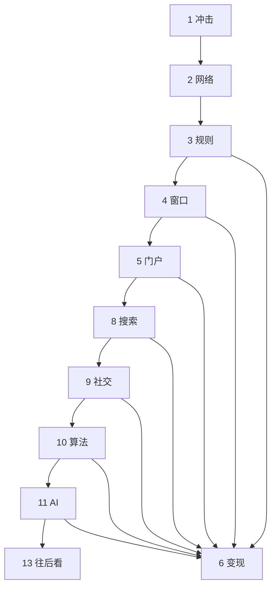

# 互联网简史：不废江河万古流

> 尔曹身与名俱灭，不废江河万古流。  
> ——杜甫《戏为六绝句》其二

> 1957 年的一声短波脉冲，把航天竞赛写成了军备与通信的同一件事。互联网不是从浏览器开始的，而是从「核打击下通信如何幸存」与「网络之网络」开始的。全文一条链：每一次外溢，都对着上一阶段的收束僵化；每一次外溢之后，又演化出更底层的新入口完成收束。上卷写到门户与信任规则（§1–7）；下卷从搜索写到 AI（§8–12）；§13 把同一条链往前推，不另起一篇预言。可与本库 [10](./10-computing-cloud-chronicle.md)（计算如何池化）、[11](./11-information-theory-chronicle.md)（信息如何被度量）、[12](./12-artificial-intelligence-chronicle.md)（智能机制编年）、[13](./13-world-hegemony-transfer-chronicle.md)（标准与公共品）、[50](../50-strategy/50-ai-industry-disruption-strategy.md)（2026 交叠点与智能体入口）对照。

先给一个直接答案：

> **谁定义协议，谁就定义架构；谁卡入口，谁就收流量。** 上卷：冲击 → 网络 → 规则 → 窗口 → 注意力（门户）→ 变现（信任规则）。下卷：搜索把主动需求明码标价；社交把注意力从版主收到平台，微信把注意力与变现装进同一闭环；算法吃掉「关注」关系；AI 收束知识源头，并把「告诉你什么」升级成「帮你做什么」。去中心化本身也需要规则。后三十年，注意力与变现趋向合一；游戏从「谁定义协议」换成「谁拥有算力、数据和模型参数」。2026 不是爆发之年，是智能体刚开场、统一调用它们的「浏览器」尚未出现的交叠点——下一场收束，大概率落在智能体协议与入口，而不是再做一个聊天框。中国从接入者变成逻辑输出者——超级应用、算法分发、内容即货架。

**10-chronicle 系列导读：** [10](./10-computing-cloud-chronicle.md)–[12](./12-artificial-intelligence-chronicle.md) 写计算、信息与智能的技术史；[13](./13-world-hegemony-transfer-chronicle.md) 写世界领导权与公共品。本文是**互联网如何成为「网络之网络」**的编年：协议是架构，入口是杠杆，注意力是流量，信任与算法是闭环。智能机制的可观察量见 [12](./12-artificial-intelligence-chronicle.md)；产业穿透与 2026 交叠点见 [50](../50-strategy/50-ai-industry-disruption-strategy.md)；本文写的是入口与权力如何一层层收束。

### 读法：一条链

全文不是上下两篇并列故事，而是同一条「收束—外溢」链。顺读按左列。§6 与上卷窗口、门户并行；到微信、直播与 AI，变现不再旁支，而是同一界面的另一面。

| 段 | 章节 | 这一段完成什么 |
|----|------|----------------|
| **一、冲击** | §1 | 斯普特尼克 → ARPA / NASA |
| **二、网络** | §2 | ARPANET、IMP、「LO」、TCP/IP |
| **三、规则** | §3 | OSI vs TCP/IP；捆绑 + 免费；协议即权力 |
| **四、窗口** | §4 | Mosaic / 网景 / IE 预装：卡位先于产品 |
| **五、注意力** | §5 | 门户定义「什么是重要信息」；人为权力外溢向搜索 |
| **六、变现** | §6 | 亚马逊评论、eBay 互评、淘宝担保 |
| **七、上卷收束** | §7 | 协议、窗口、头条、信任已经分层 |
| **八、提问** | §8 | 搜索解放主动需求；注意力明码标价；云定义算力如何被消费 |
| **九、关系** | §9 | 论坛版主 → 社交图谱 → 微信超级应用 |
| **十、分发** | §10 | 推荐引擎吃掉关注；TikTok 倒灌；内容即货架 |
| **十一、源头** | §11 | 大模型：从分发已有信息到生产新内容 |
| **十二、尾声** | §12 | 收束三类；中美位置变化 |
| **十三、往后看** | §13 | 下一场收束：智能体协议与入口；2026 是交叠点 |
| **十四、出处** | §14 | 出处可核 |

## 摘要

1957 年斯普特尼克 1 号入轨，苏联展示洲际投送与全球通信的可能。美国于 1958 年成立 ARPA（后更名 DARPA）与 NASA。ARPA 的信息处理技术办公室把「人机共生」「星际计算机网络」做成思想原型；分时系统、跨大陆实验、分组交换与 IMP，在 1969 年 10 月 29 日交出第一条主机间消息——「LO」。NCP 只能在封闭科研网里用；瑟夫与卡恩提出 TCP，1980 年代定型为 TCP/IP，「网络之网络」在技术上成型。

标准之争里，OSI 七层追求完美，TCP/IP 与 BSD Unix 捆绑且免费。1983 年 Flag Day 之后，市场即权力、免费即王道反复上演。浏览器战争把同一逻辑复刻到 Windows 预装；门户把空白地址栏收成编辑推荐的注意力；电商并行发展出三种信任规则——亚马逊的评论生态、eBay 的双向互评、淘宝的担保交易。中国 1987 年发出跨境邮件，1994 年全功能接入；上卷角色是接入者、使用者与模式移植者。

下卷从搜索开始。PageRank 按链接结构给网页打分，打破门户编辑对「什么重要」的垄断；AdWords 与竞价排名让注意力明码标价。AWS 与阿里云把闲置算力写成「计算力如何被消费」。论坛与贴吧是社交的史前时代；Facebook 把内容生产权外溢到人，平台仍是裁判；微信把即时通讯、内容、支付与小程序做成超级应用，注意力与变现第一次装进同一闭环。今日头条没有美国原型：与其让用户找，不如让系统喂。抖音 / TikTok 把算法分发倒灌给美国。Transformer 与 ChatGPT 把注意力从分发渠道抬到知识源头。尾声把六十年收成「收束—外溢」：前期如何连接，中期看到什么，后期逼近想什么、做什么。后三十年两条线趋向合一；新游戏是算力、数据与模型参数。往后看，2026 更宜读成交叠点而不是爆发之年：传统搜索面临对话与智能体分流；企业应用开始嵌入任务型智能体；智能体之间的互操作协议正在重演「谁写规则谁写架构」。统一调用智能体的入口尚未出现——结构上像浏览器出现之前的那几年。

**关键词：** 互联网史；ARPANET；TCP/IP；浏览器；门户；搜索；PageRank；社交媒体；微信；推荐算法；TikTok；Transformer；ChatGPT；智能体；协议政治

---

## 目录

- [摘要](#摘要)
- [读法：一条链](#读法一条链)

**一、冲击**

1. [序幕：斯普特尼克与 ARPA](#1-序幕斯普特尼克与-arpa)

**二、网络**

2. [ARPANET：一切开始于一个军方项目](#2-arpanet一切开始于一个军方项目)
    - [2.1 核打击下的通信与思想原型](#21-核打击下的通信与思想原型)
    - [2.2 拼图：分时、广域实验与分组交换](#22-拼图分时广域实验与分组交换)
    - [2.3 启动：三台终端、IMP 与「LO」](#23-启动三台终端imp-与lo)
    - [2.4 公开演示、NCP 与 TCP/IP](#24-公开演示ncp-与-tcpip)
    - [2.5 时间差：中国与欧洲](#25-时间差中国与欧洲)

**三、规则**

3. [标准之争：定义「游戏规则」](#3-标准之争定义游戏规则)
    - [3.1 OSI 的完美图纸](#31-osi-的完美图纸)
    - [3.2 Flag Day、BSD 与「捆绑 + 免费」](#32-flag-daybsd-与捆绑--免费)
    - [3.3 协议即权力](#33-协议即权力)
    - [3.4 越过长城](#34-越过长城)

**四、窗口**

4. [浏览器之争：搭建「通往世界的窗口」](#4-浏览器之争搭建通往世界的窗口)
    - [4.1 Mosaic 与网景](#41-mosaic-与网景)
    - [4.2 预装权与反垄断](#42-预装权与反垄断)
    - [4.3 中国接入：接入者与使用者](#43-中国接入接入者与使用者)

**五、注意力**

5. [门户网站：定义「什么是重要信息」](#5-门户网站定义什么是重要信息)
    - [5.1 雅虎与编辑推荐制](#51-雅虎与编辑推荐制)
    - [5.2 中国三大门户](#52-中国三大门户)
    - [5.3 人为权力的瓶颈](#53-人为权力的瓶颈)

**六、变现**

6. [商业变现：另一条线里的信任规则](#6-商业变现另一条线里的信任规则)
    - [6.1 亚马逊：建规则，而不只是卖书](#61-亚马逊建规则而不只是卖书)
    - [6.2 eBay：用声誉机制取代信任中介](#62-ebay用声誉机制取代信任中介)
    - [6.3 淘宝与支付宝：担保交易](#63-淘宝与支付宝担保交易)

**七、上卷收束**

7. [上卷要点](#7-上卷要点)

**八、提问**

8. [搜索引擎：解放「主动需求」](#8-搜索引擎解放主动需求)
    - [8.1 PageRank 与 Google](#81-pagerank-与-google)
    - [8.2 AdWords：注意力明码标价](#82-adwords注意力明码标价)
    - [8.3 百度竞价排名](#83-百度竞价排名)
    - [8.4 从 2C 到 2B：AWS 与阿里云](#84-从-2c-到-2baws-与阿里云)

**九、关系**

9. [社交媒体：从论坛到超级应用](#9-社交媒体从论坛到超级应用)
    - [9.1 史前：论坛与贴吧](#91-史前论坛与贴吧)
    - [9.2 Facebook 与个体赋能的悖论](#92-facebook-与个体赋能的悖论)
    - [9.3 微信超级应用](#93-微信超级应用)
    - [9.4 流媒体、本地生活与算法介入](#94-流媒体本地生活与算法介入)

**十、分发**

10. [算法时代：比你更懂你](#10-算法时代比你更懂你)
    - [10.1 今日头条：没有美国原型](#101-今日头条没有美国原型)
    - [10.2 抖音与 TikTok 倒灌](#102-抖音与-tiktok-倒灌)
    - [10.3 茧房、黑盒与内容即货架](#103-茧房黑盒与内容即货架)

**十一、源头**

11. [AI 时代：从分发已有信息到生产新内容](#11-ai-时代从分发已有信息到生产新内容)
    - [11.1 Transformer 与 ChatGPT](#111-transformer-与-chatgpt)
    - [11.2 算力、数据与话语权](#112-算力数据与话语权)
    - [11.3 中国赛道与万能入口](#113-中国赛道与万能入口)

**十二、尾声**

12. [尾声：收束与外溢](#12-尾声收束与外溢)

**十三、往后看**

13. [往后看：下一场收束还没有名字](#13-往后看下一场收束还没有名字)
    - [13.1 提问：搜索被对话分流](#131-提问搜索被对话分流)
    - [13.2 变现：货架交给代理，结账仍多半在人](#132-变现货架交给代理结账仍多半在人)
    - [13.3 规则：智能体协议重演「谁写架构」](#133-规则智能体协议重演谁写架构)
    - [13.4 窗口：还缺一个「智能体的浏览器」](#134-窗口还缺一个智能体的浏览器)
    - [13.5 边界：能力先爆，入口与治理未闭合](#135-边界能力先爆入口与治理未闭合)

**十四、出处**

14. [参考文献](#14-参考文献)

---

## 1. 序幕：斯普特尼克与 ARPA

1957 年 10 月 4 日，莫斯科时间 22 时 28 分，苏联第五科研试验靶场。哈萨克草原的寒夜里，银白色 R-7 运载火箭伫立于发射台。地下掩体中，总设计师谢尔盖·科罗廖夫（Sergei Korolev）坐镇指挥，面如平湖，胸有惊雷。R-7 此前多次试射失利，一旦再败，整个项目便会夭折。冷战背景下，为抢先完成卫星发射，项目删减科学载荷，仅保留无线电设备，准备将 83.6 公斤的「斯普特尼克 1 号」送入太空。

倒计时结束，火箭点火起飞。在芯级飞行段，助推器—贮箱平衡系统异常，导致推进剂消耗失衡，芯级发动机比预定时间提前约 0.6 秒关机。卫星入轨轨道因此低于设计预期，但仍顺利分离入轨。随后天线展开，持续发出标志性的短波脉冲，以 96.2 分钟周期环绕地球飞行。发射场欢声雷动。人类历史上第一颗人造卫星，就此进入太空。

> **图 1**　斯普特尼克 1 号搭载 R-7 进入太空。

「斯普特尼克 1 号」搭载 R-7 进入太空，是人类航天科技的里程碑事件。同时，它也意味着苏联具备了两项军事能力：其一，掌握洲际导弹远程投送技术，具备核打击威慑能力；其二，掌握通信卫星发射技术，覆盖全球的卫星通信可能。

消息迅速传遍全球，太平洋彼岸的美国舆论哗然。国会随即举行听证，举国反思尖端科技短板。为杜绝技术被动、防范战略突袭，美国于 1958 年相继成立高级研究计划局（ARPA，后更名为 DARPA）和国家航空航天局（NASA），大力布局前沿科技研发，直面苏联军备竞赛。

本文将从 ARPA 开始，讲述整个互联网的历史故事。上卷写到门户与信任规则（§1–7）；下卷从搜索写到 AI（§8–12）；趋势见 §13。

---

## 2. ARPANET：一切开始于一个军方项目

冲击之后，问题落到指挥通信：若遭遇灾难性核打击，网络如何幸存？这一节是上卷的河床——分组交换、分布式、接口报文处理机，以及「不是让任何一个网络成为中心」。

### 2.1 核打击下的通信与思想原型

ARPA 成立之初，主要承担航天运载、导弹防御、「维拉」核爆炸监测（Project Vela）等国防项目。在反导、雷达预警以及核战争条件下美军指挥通信的研究中，一个尖锐问题浮出水面：若遭遇「灾难性核打击」，通信如何幸存？这一需求后来深刻影响了 ARPANET 的分布式容错设计，但在当时，它还只停留在军事指挥的设想层面。

1962 年，ARPA 设立信息处理技术办公室（IPTO）。首任主任利克莱德（J.C.R. Licklider）提出「人机共生」与「星际计算机网络」构想：任何人可跨地域远程访问异地计算机，共享程序与数据。这成为了 ARPANET 的思想原型。

### 2.2 拼图：分时、广域实验与分组交换

1963 年，ARPA 资助麻省理工学院（MIT）的 Project MAC、兰德公司的 JOSS 等分时系统项目。分时系统让多个终端用户同时共享一台大型机算力，实现远程登录与交互操作，为跨机器资源共享铺平道路。这为 ARPANET 的诞生收集了第一块拼图。

1965 年，劳伦斯·罗伯茨（Lawrence G. Roberts）用电话线把 MIT 的 TX-2 计算机跨大陆连到圣莫尼卡的 Q-32，完成最早的广域通信实验，证明跨洲异构计算机通信可行，也暴露出电话线路效率低、不适合计算机突发流量的缺陷。打个比方：电话通信像两人占用一条专属小路，通话结束即释放；计算机通信则像一条高速公路，大家排队分时使用。值得一提的是，罗伯茨后来成为 ARPANET 项目主管。

与此同时，ARPA 支持道格拉斯·恩格尔巴特（Douglas Engelbart）的人机交互研究，让 SRI 积累网络工程能力。IPTO 吸纳伦纳德·克莱因罗克（Leonard Kleinrock）的分组交换数学模型、保罗·巴兰（Paul Baran）的分布式容错思想，并结合英国学者的分组概念，最终确定分组交换技术路线。

ARPA 汇集多方科研力量，积累工程经验，完成理论、实验、项目与人才储备，为 ARPANET 的诞生慢慢集齐所有拼图。

### 2.3 启动：三台终端、IMP 与「LO」

1966 年，IPTO 时任主任罗伯特·泰勒（Robert Taylor）发现办公室里摆着三台终端，分别连接三台不同计算机：一台在麻省理工学院，一台在加州大学伯克利分校，一台在圣莫尼卡的系统开发公司。三台终端，三套操作系统，三种命令语言。他后来回忆：「我当时想，为什么不弄一个终端，连到所有计算机上？这个想法就是 ARPANET 的起源。」

泰勒说服 ARPA 局长查尔斯·赫兹菲尔德（Charles Herzfeld），拿到 100 万美元启动经费。赫兹菲尔德后来回忆，这个决定「大约用了 20 分钟」。100 万美元，20 分钟，ARPANET 正式启动。

1968 年，BBN 公司赢得合同，负责建造第一代接口报文处理机（IMP）。IMP 可理解为一台「翻译器」：每台主机把数据交给 IMP，IMP 将其打包成标准格式，再经电话线路发给下一个 IMP。这套设计让不同型号、不同操作系统的计算机第一次能够「对话」。BBN 工程师团队中有一个人叫罗伯特·卡恩（Robert Kahn），他后来成为 TCP/IP 协议共同发明者。

历史性时刻到了。1969 年 10 月 29 日晚上 10 点 30 分，美国加州大学洛杉矶分校（UCLA）博尔特楼 3420 房间。研究生查理·克莱恩（Charley Kline）坐在一台 SDS Sigma 7 计算机终端前，准备向 500 多公里外的斯坦福研究所（SRI）发送 ARPANET 上第一条主机间消息。克莱恩先与 SRI 程序员比尔·杜瓦尔（Bill Duvall）电话确认线路畅通，然后开始输入「LOGIN」。他敲下「L」，电话那头传来杜瓦尔的声音：「收到了。」他敲下「O」，杜瓦尔说：「收到了。」他敲下「G」，然后系统崩溃了。人类互联网的第一条消息，是「LO」。这个音节在英语里恰好是「看哪」的旧式感叹词，也像极了对即将到来的互联网时代「注意力」争夺的预言。克莱因罗克后来在回忆中反复讲这个细节：我们没想搞什么革命，我们只是想登录一下。

1969 年底，ARPANET 连接四个节点：UCLA、SRI、加州大学圣巴巴拉分校（UCSB）、犹他大学（University of Utah）。到 1971 年，节点扩展到 15 个。

> **图 2**　ARPANET（1969）。

### 2.4 公开演示、NCP 与 TCP/IP

1972 年 10 月，泰勒的继任者罗伯茨在华盛顿希尔顿酒店组织 ARPANET 第一次公开演示。他把一台 IMP 直接搬进会议厅，参会者可亲自操作终端，连接全国各地计算机。这次演示让许多原本怀疑分组交换（Packet Switching，一种把大数据拆成小包裹分别传送的技术）是否可行的工程师和官员改变了态度。但彼时 ARPANET 仍是一个封闭科研网络，其通信协议 NCP（网络控制协议）只能在这套系统内部使用。

如果每个网络都用自己的「内部语言」，「网络之网络」就永远只是口号。1973 年，那位 BBN 工程师罗伯特·卡恩开始思考如何让不同网络按相同标准互相通信。他找到在 UCLA 任教授的温顿·瑟夫（Vinton G. Cerf）。两人在旧金山凯悦酒店大堂里，在一张餐巾纸上画出 TCP 协议的最初设计草图。这个细节在后来的互联网历史叙事中被反复渲染：餐巾纸、两个年轻工程师、一个改变世界的想法。瑟夫本人对此比较冷静。他在 2006 年一次访谈中说：「我不记得那张餐巾纸了，但那个讨论是真实的。我们当时想的是怎么让不同网络之间能够互相通信，而不是让任何一个网络成为中心。」

注意这句话，「不是让任何一个网络成为中心。」这是互联网最早的「去中心化」理想。但历史将证明，去中心化本身也需要规则，而规则的制定者就是权力的源头。

1974 年 5 月，瑟夫和卡恩在《IEEE Transactions on Communications》（IEEE 通信学报，IEEE 即美国电气电子工程师学会）上发表论文《一种分组网络互连协议》（A Protocol for Packet Network Intercommunication）。论文提出「传输控制协议」（TCP，Transmission Control Protocol），首次把「连接」和「传输」分开，让数据包可在不同网络之间被路由、重组、纠错。1980 年，TCP/IP 拆成两层：TCP 负责端到端可靠传输，IP（Internet Protocol，互联网协议）负责寻址和路由。TCP/IP 协议簇基本定型。至此，「网络之网络」在技术上成型，互联网的所有条件已具备。

> **图 3**　ARPANET 逻辑图（1977）。

### 2.5 时间差：中国与欧洲

彼时，远在大洋彼岸的中国。1969 年，中国科学院计算技术研究所开始研究「计算机通信」，但进度缓慢。1970 年代末，中国才有了第一台真正意义上的计算机通信试验。当美国人在凯悦酒店大堂里画 TCP 草图时，中国人还在解决「有没有计算机」的问题。这个时间差，决定了后来几十年的技术权力格局。

与中国的落后不同，彼时欧洲雄心勃勃。在美国人的「网络之网络」思想提出后，大西洋对岸的欧洲人敏锐意识到时代变化，并迅速拿出另一套方案。一场关于「谁来定义互联网底层规则」的战争，即将打响。

---

## 3. 标准之争：定义「游戏规则」

网络在技术上成型之后，真正的战争是：谁来定义底层规则。OSI 追求完美的七层图纸；TCP/IP 已经搭起来，并且免费。

### 3.1 OSI 的完美图纸

如果你在 1980 年代中期走进任何一间欧洲电信实验室，问起「未来网络应该怎么建」，得到的答案几乎不可能是 TCP/IP。你会被带进一间会议室，墙上挂着一幅巨大的七层模型图，旁边站着一位西装革履的工程师，指着图说：「这就是未来。它叫 OSI（Open Systems Interconnection，开放系统互连）。」

OSI 是国际标准化组织（ISO）自 1977 年起制定的网络通信标准。它把网络通信划分为七层：物理层、数据链路层、网络层、传输层、会话层、表示层、应用层。每一层都有严格定义的接口、功能和协议。OSI 的目标是「完美」：让任何厂商的设备、任何国家的网络都能无缝对接。欧洲各国政府、电信运营商和大厂商，包括 IBM、DEC、西门子等巨头，纷纷投入巨资支持。法国、德国、英国都设立了国家级 OSI 推广计划。

如果说 OSI 是欧洲最顶尖建筑事务所设计的摩天大楼，图纸精确到每一毫米，每根钢梁都有编号，每个房间都有规定用途；那么 TCP/IP 更像一群美国工程师搭出来的砖混房子，只有四层，没有严格分层，会话层和表示层干脆没有定义，许多功能靠「凑合」。用当时一位网络工程师的话说：「TCP/IP 是那种你不好意思写在简历上的东西，但你就是离不开它。」

> **图 4**　OSI vs. TCP/IP。

### 3.2 Flag Day、BSD 与「捆绑 + 免费」

为什么离不开？因为它已经搭起来了。1983 年 1 月 1 日，美国国防部强制要求 ARPANET 所有节点从 NCP 切换到 TCP/IP。这一天被称为「Flag Day」，因为所有节点必须在同一天完成切换，任何不切换的节点都将在第二天被切断连接。克莱因罗克回忆说：「那是一个紧张的日子，但切换非常顺利。我们当时就知道，这件事成了。」

更关键的一步，是 TCP/IP 与 BSD Unix 的合流。Unix 是 AT&T 贝尔实验室于 1969 年开发的多用户操作系统，后来在学术界广泛传播。BSD（Berkeley Software Distribution）是加州大学伯克利分校在 Unix 基础上开发的增强版本。1980 年，DARPA 资助伯克利的计算机系统研究小组（CSRG），把 TCP/IP 协议栈移植到 BSD Unix 中。合同条件是：BSD 必须免费提供 TCP/IP 代码给任何人使用。1983 年发布的 BSD 4.2 版本，内置了完整的 TCP/IP 协议栈。这意味着，任何拿到 BSD 源码的大学、实验室、初创公司，都能零成本获得 TCP/IP 的通信能力，不用向包括 DARPA 在内的任何机构支付授权费，也不用等待任何标准组织的批准。

这就像欧洲人还在开一场长达数年的标准制定会议，争论窗户该用什么玻璃、门把手该用什么合金；美国人已经把一栋砖混房子免费送给了全世界所有想住的人。房子简陋，但能住，而且不要钱。BSD Unix 支配操作系统市场，TCP/IP 协议免费，将二者捆绑简直就是王炸。这种「市场即权力 + 免费即王道」的逻辑，将在未来的互联网历史上不断上演。

ISO 的决策机制是「每一个成员国都有否决权」，这意味着任何一个国家的代表对某一层协议有异议，整个标准的推进都会被拖慢。更麻烦的是，OSI 协议栈极其复杂：光是「会话层」和「表示层」的规范就写了厚厚的几大本，而 TCP/IP 的实现代码已经在不同操作系统之间跑通了。一位参与 OSI 标准制定的工程师后来接受《IEEE Spectrum》杂志采访时说：「我们花了三年时间争论一个『连接』的定义，而美国人的代码已经飞到世界各地的服务器上去了。」

1988 年，欧洲学术网络 EARN 和 BITNET 开始测试 TCP/IP。1989 年，欧洲核子研究中心（CERN）的蒂姆·伯纳斯-李（Tim Berners-Lee）以 TCP/IP 为底层协议，开始构建后来被称为「万维网」（World Wide Web）的系统。1990 年，欧洲研究网络协会（RARE）正式宣布支持 TCP/IP。1992 年，互联网协会（ISOC）在美国弗吉尼亚州莱斯顿成立，瑟夫担任首任主席。OSI 模型彻底败北，沦为计算机网络教材中的「参考模型」，一种用来教学、却永远不会被真正使用的「理想模型」。

万维网后来成为占据绝对主导地位的应用层信息标准。依托 HTTP、HTML 与 URL 这套开放规范，图文超链接的浏览模式压倒了 Gopher、WAIS 等早期信息检索方案，成为绝大多数用户接入、浏览网络信息的首选方式，推动互联网从科研人员的专业工具走向大众。网站网址以「www.」开头，便源自万维网。

### 3.3 协议即权力

TCP/IP 的胜利，并不等于「先进」的胜利，而是「捆绑 + 免费」的胜利。美国人胜在计算与通信的系统性，胜在市场，胜在免费，胜在高效。瑟夫和卡恩被称为「互联网之父」，他们的每一个技术决策，包括地址空间大小、协议字段定义、路由策略，都成为后来所有网络应用的底层约束。IPv4 的 32 位地址空间只有约 43 亿个地址，在 1970 年代看似充足，到 2010 年代初却面临枯竭。为什么这么少？因为制定协议的时候，没有人能想到互联网会连接手机、汽车、家电、摄像头，更没有人能想到每个设备都需要一个 IP 地址。

网络法学者劳拉·迪纳尔迪斯（Laura DeNardis）在《协议政治》中写道：「互联网的治理，本质上是对协议标准的治理。谁控制了协议，谁就控制了互联网的架构。」

### 3.4 越过长城

在同时期的中国，发生了一件不起眼但影响深远的事。1987 年 9 月 20 日，中国兵器工业计算机应用研究所依托中德 CANET 合作项目，经由德国卡尔斯鲁厄大学中转节点，发出中国第一封跨境电子邮件。邮件内容：「Across the Great Wall we can reach every corner in the world（越过长城，我们可以到达世界的每一个角落）」。这次邮件互通代表中国科研网络实现跨境邮件连通，但距离 1994 年全功能接入国际互联网还有七年。

> **图 5**　中国第一封跨境电子邮件。

普通人不知道 TCP/IP 是什么，也不关心 OSI 是什么。他们只关心一件事：打开电脑，能看到什么。互联网的权力结构与逻辑，从它诞生那一天起就已被决定，美国人站在了规则的上帝视角。下一步，便是比谁能在这个结构中占据更有利的战略高地，从而掌握「流量入口」。

---

## 4. 浏览器之争：搭建「通往世界的窗口」

规则已定，第一个战略高地是窗口：用户看见世界的那一层软件。技术好、产品好、体验好，都不如卡位好。

### 4.1 Mosaic 与网景

第一个战略高地，是浏览器。

1993 年 4 月，美国伊利诺伊大学厄巴纳—香槟分校（UIUC）的国家超级计算应用中心（NCSA）发布了一款软件：Mosaic（马赛克浏览器），作者是 22 岁的马克·安德森（Marc Andreessen）和 29 岁的埃里克·比纳（Eric Bina）。Mosaic 首次实现图像与文字混排，用户点击链接就能跳转到另一个网页，安装和操作都很简单。NCSA 把它放在 FTP 服务器上供人免费下载。一年内，下载量突破 200 万次。

在 Mosaic 之前，互联网是一个「纯文本」世界，用户看到的只有文字、链接和命令行。Mosaic 让网页有了「画面」：图片、标题、按钮。这就像从报刊亭走进了电影院。但 Mosaic 的发布者 NCSA 是一个半学术、半政府机构，对商业化的态度暧昧不清。

> **图 6**　Mosaic（马赛克浏览器）。

1994 年 4 月，安德森和硅谷风险投资家吉姆·克拉克（Jim Clark）共同创立网景通信公司（Netscape Communications），同年 12 月发布 Netscape Navigator 浏览器。网景的策略是「免费给个人，收费给企业」。1995 年 8 月 9 日，网景在纳斯达克上市。发行价 28 美元，开盘价 71 美元，首日收盘市值超过 20 亿美元。一家成立仅 16 个月、累计收入不到 2000 万美元的公司，一夜之间成为华尔街神话。

> **图 7**　网景浏览器。

### 4.2 预装权与反垄断

但真正改变战局的力量在西雅图。微软创始人比尔·盖茨（Bill Gates）在 1995 年 5 月 26 日发给全体高管的备忘录《互联网潮汐》（The Internet Tidal Wave）中写道：「互联网是自 IBM PC 1981 年问世以来最重要的一项发展……它是一股潮汐，要么淹没我们，要么载我们前行。」

微软的应对策略简单粗暴：把浏览器绑定到 Windows 操作系统上。你买一台 Windows 电脑，桌面上就有一个蓝色的「e」图标。用户不需要下载网景浏览器，不需要安装任何东西。IE（Internet Explorer）就在那里，点一下就打开。这种策略被称为「预装」（Preinstallation）。不是说服你选择我，而是「帮你」选择。美国人从一开始就对互联网的逻辑门清：TCP/IP 免费，浏览器免费；捆绑 BSD Unix，捆绑 Windows。如今智能手机时代的预装 APP，学的是 ARPA，学的是微软。

1998 年 5 月，美国司法部联合 20 个州起诉微软，指控其利用操作系统垄断地位非法排挤网景浏览器。但 IE 市场份额仍旧势不可挡，并于当年首次超越网景。11 月，随着市场不断下滑，网景被美国在线（AOL）以 42 亿美元收购。在当年的庭审中，控方引用微软多封内部邮件，将其商业策略概括为「切断网景的空气供应」（to cut off Netscape's air supply），这句话成为反垄断案的标志性证据。2000 年 6 月，联邦法官裁定微软违反反垄断法，并下令拆分微软。微软上诉，2001 年与美国司法部达成和解。但六年时间不等人。战争早已结束，网景输了。

1995 年 6 月，微软曾邀请网景高管到西雅图总部「谈谈合作」。网景方面由 CEO 詹姆斯·巴克斯代尔（James Barksdale）和安德森代表出席。会议气氛并不友好。网景的人后来在证词中称，微软提出「分工」：网景做非 Windows 平台的浏览器，微软做 Windows 平台的浏览器，否则微软将不提供技术支持。网景拒绝了。微软方面否认这一说法。但有一点无法否认：微软拥有 Windows，而 Windows 是数亿人进入互联网的第一道门。这道门的钥匙上，刻着「预装权」。

浏览器战争给互联网历史留下了一个深刻的教训：技术好、产品好、体验好，都不如「卡位好」。网景的浏览器曾比 IE 更快、更稳定、更符合标准，但它需要用户主动下载。IE 什么都不用做，就躺在用户桌面上；不仅个人用户免费，企业用户也免费。用户不关心浏览器是谁做的，只关心「能不能用？花不花钱？」这是对「BSD Unix + TCP/IP」的「市场即权力 + 免费即王道」的复刻，而这样的复刻还将继续。

### 4.3 中国接入：接入者与使用者

与此同时，1994 年 4 月 20 日，中国国家计算与网络设施工程（NCFC）通过一条 64K 的国际专线，正式接入国际互联网。这条专线的带宽，不到今天一部手机网速的千分之一，但它是中国互联网的「出生证」。同年 5 月，中国国家顶级域名「.CN」服务器在北京投入使用。从这一刻起，中国用户开始进入同一张网，却没有「入口」的权力。浏览器是美国的，操作系统是美国的，连上网要用的调制解调器，大多也是进口的。在第一阶段，中国互联网的发展路径以引进和适配为主，角色是「接入者」和「使用者」。

1996 年，中国互联网络信息中心（CNNIC）成立，开始统计全国上网人数。1997 年 10 月第一次报告显示：全国上网用户数仅 62 万。而同一时期，美国的互联网用户已经接近 6000 万。

---

## 5. 门户网站：定义「什么是重要信息」

窗口打开之后，地址栏是空的。谁来填写「今天什么重要」，谁就临时握有注意力。这一节的权力是人为的，因而必然被更个人化的工具挑战。

### 5.1 雅虎与编辑推荐制

浏览器普及之后，一个尴尬的问题随之而来：用户在地址栏里输入什么？1995 年的互联网没有像样的搜索引擎。面对空白的地址栏，用户只能靠朋友推荐、杂志介绍，或者碰运气。一个普通人第一次上网，很可能在地址栏里随便敲下「www.something.com」，然后得到一个「404 Not Found」。这时，门户网站出现了。

门户网站（Portal）的逻辑很简单：把互联网当成一本杂志来编。1994 年 1 月，杨致远和大卫·费罗（David Filo）在斯坦福大学电机工程系的拖车实验室里维护一个「网址目录」，把好玩的网站分门别类，做成树状结构。这个项目后来改名为雅虎（Yahoo!）。1995 年 3 月，雅虎公司成立。1996 年 4 月 12 日上市，首日市值 8.48 亿美元。

雅虎首页的设计逻辑是「编辑推荐制」：新闻、财经、体育、娱乐，每个栏目都由编辑手工挑选内容，放在首页推荐位上。首页头条就是当天的「封面故事」。1996 年到 1999 年，雅虎首页头条的影响力，几乎可以左右美股科技股当天的舆论风向。雅虎的编辑团队就是「互联网杂志」的编辑部，他们决定「什么是重要信息」。

> **图 8**　雅虎首页。

### 5.2 中国三大门户

美国「门户战争」打响后，中国几乎在同一时间复制了这个模式。1998 年 2 月，从 MIT 回国的张朝阳在北京推出搜狐，首页完全模仿雅虎。1998 年 12 月，四通利方与华渊资讯合并，新浪网成立。1997 年 6 月，丁磊在广州创立网易，主打免费电子邮件和个人主页。中国三大门户的竞争焦点只有一样东西：首页头条。根据 CNNIC 第 5 次报告，到 2000 年 1 月，全国上网用户 890 万，绝大多数人的上网入口就是新浪、搜狐、网易的首页。而美国当时的互联网用户已超过 1 亿。从数字上看，中国依然落后一个数量级。但在「门户逻辑」上，中国已经完成了一次完整的「移植」。

1999 年 5 月 8 日，中国驻南联盟大使馆遭北约导弹袭击。新浪新闻中心是最早推送快讯的中文网站。当天，新浪首页头条持续滚动更新，新闻编辑通宵工作，服务器一度被访问请求压垮。许多中国网民就是在那一天第一次意识到：网页上的新闻比报纸和电视更快、更密集、更「实时」。此后，新浪新闻中心成为中文互联网最具影响力的信息集散地，首页头条的点击量动辄数百万。

### 5.3 人为权力的瓶颈

但门户网站的权力有一个致命瓶颈：编辑再勤奋，一天也只有 24 小时；首页推荐位再大，也就一屏半，但用户的需求却千差万别。一个想查「如何在阳台上种番茄」的人，不需要首页头条为他准备的国际新闻；一个想知道「感冒了吃什么药」的人，也不需要财经频道的股市评论。编辑的「灌输」逻辑开始失效，用户要的是「主动」。

门户网站的权力是「人为」的，它决定用户的注意力投向。而人为的权力，必然被人质疑、挑战、取代。当一个编辑决定「今天头条是某件新闻」时，他或许能影响几百万人的认知起点，却无法满足每一个用户的需求。这种「一刀切」的话语权，必然外溢向更个人化的工具。搜索引擎，就是那个工具。

门户网站的头条吸引用户注意力，搜索引擎的返回页首页也是用户注意力。不管注意力投向哪里，最终都要通过商业变现来完成闭环。

---

## 6. 商业变现：另一条线里的信任规则

注意力要闭环，就要变现。这一节不是门户的下一章，而是并行的一条线：陌生人如何在网上互相信任。亚马逊、eBay、淘宝面对同一问题，写出三种规则。

在进入下一部分之前，有必要提一下互联网另一条线的悄然发展。这条线就是商业变现。

### 6.1 亚马逊：建规则，而不只是卖书

1994 年，杰夫·贝佐斯（Jeff Bezos）辞去华尔街对冲基金 D.E. Shaw 的工作，在自家车库里创办了 Amazon.com。他最初选择的品类是图书，因为美国图书市场规模约 190 亿美元，且没有被垄断巨头把持。1995 年 7 月，亚马逊网站正式上线，上线一周后日成交量就达到 12000 美元。

> **图 9**　亚马逊公司总部。

但亚马逊的真正转折点，不是「卖书」，而是「建规则」。1996 年，传统连锁书店博德斯推出自己的网站，试图用品牌和渠道优势压制亚马逊。贝佐斯团队给出了一个颇具平台思维的对策：建立评论板块，鼓励读者对所购图书进行评价。社区一旦形成，用户就不是在买书，而是在参与一个由亚马逊定义规则的生态。这个逻辑后来被放大到几乎所有品类。

### 6.2 eBay：用声誉机制取代信任中介

在电商的另一个方向上，eBay 走了完全不同的路。1995 年 9 月 4 日，28 岁的皮埃尔·奥米迪亚（Pierre Omidyar）在圣何塞的客厅里上线了「AuctionWeb」。eBay 的杀手锏是「反馈系统」：买卖双方互相评分，用声誉机制取代传统交易中的信任中介。这个看似简单的设计，让 eBay 成为「第一个大型 P2P 在线交易平台」。它的变现逻辑不是「我卖什么」，而是「我定义买卖双方如何互信」。

### 6.3 淘宝与支付宝：担保交易

在中国，电商在 2003 年找到了自己的路径。2003 年 5 月，淘宝网上线，正面迎战当时已经占据中国 C2C 市场绝对优势的 eBay 易趣。淘宝面临的第一个问题不是流量，而是信任。2003 年的中国互联网，没有成熟的信用体系，买家不敢先付款，卖家不敢先发货。2003 年 10 月，淘宝推出「支付宝」，一个全球首创的担保交易模式：买家先付款到支付宝，支付宝通知卖家发货，买家确认收货后，支付宝才把钱打给卖家。支付宝不只是一个支付工具，更是一个「变现工具」。它用一套第三方托管机制，把用户在淘宝上与卖家之间的陌生关系，转化成了可交易的信任。

除了支付宝，淘宝还以免佣、买卖即时沟通工具等一系列本地化规则竞争。正是这套规则，让淘宝在三年内击败 eBay 易趣，也让中国的电商市场走上了一条与美国完全不同的道路。

亚马逊、eBay 和淘宝面临同样的信任问题，却给出了不同的解决方案。eBay 靠双向互评的事后声誉约束，平台不介入资金履约；淘宝充当交易第三人，在交易中冻结资金，交易完成后再决定是否打款给卖家；亚马逊则不冻结交易资金，事后追责卖家。三种模式，走出了三条不同的道路。

---

## 7. 上卷要点

上卷读完是同一条线，不是四个并列战役。

1. **冲击写成机构。** 斯普特尼克同时展示洲际投送与全球通信；ARPA / NASA 是美国对技术被动的组织回答。  
2. **网络写成结构。** 核打击下的通信、分时、分组交换与 IMP，让异构机器第一次对话；「LO」只是登录，结构已经在。  
3. **去中心化仍要规则。** NCP 困在封闭网内；TCP/IP 让「网络之网络」成立。不是让任何一个网络成为中心——但谁写协议，谁就写架构。  
4. **捆绑 + 免费反复上演。** OSI 图纸更完美，TCP/IP 已经住进去；BSD 把协议栈零成本送出去。浏览器战争把同一逻辑复刻到 Windows 预装。  
5. **入口先于产品。** 技术好、体验好，都不如卡位好。预装权是第一道门的钥匙。  
6. **注意力会外溢。** 门户用编辑推荐定义「什么是重要信息」；一刀切必然被更个人化的工具（搜索）挑战。  
7. **变现是信任规则。** 评论生态、双向互评、担保交易，是三种把陌生人写成可交易关系的办法。  
8. **中国在上卷的位置。** 1987 年邮件越过长城，1994 年专线接入；角色是接入者、使用者与模式移植者。淘宝的担保交易，是上卷里少数把规则改写成自己的段落。

普通人打开电脑只问能看到什么。能看到什么，取决于协议、窗口、头条和信任规则——这些在上卷里已经分层。下一步是搜索：注意力从编辑的一屏半，转向每个人自己键入的那一行。

---

## 8. 搜索引擎：解放「主动需求」

门户把「什么重要」交给编辑；搜索把提问权交还用户。提问权一到手，注意力就开始明码标价——这是下卷主线的第一环。

### 8.1 PageRank 与 Google

1996 年，斯坦福大学博士生拉里·佩奇（Larry Page）和谢尔盖·布林（Sergey Brin）开始做一个研究项目，名叫「BackRub」（回溯）。佩奇一直对「链接」着迷：学术论文的引用关系可以用来判断论文的重要性，那么互联网上的超链接，是否也能用来判断网页的重要性？他的导师特里·温诺格拉德（Terry Winograd）支持这个想法。布林加入后，项目于 1998 年 4 月发表论文《大规模超文本网络搜索引擎的剖析》（The Anatomy of a Large-Scale Hypertextual Web Search Engine），正式提出 PageRank 算法。佩奇与 PageRank 算法一语双关，似乎冥冥中自有天意。只是不知道 PageRank 究竟该翻译为「佩奇排名」，还是「页面排名」？

PageRank 的核心逻辑可以用一个类比说明：如果把互联网想象成一个大广场，每个网页都是一个摊位，网页之间的链接就是「推荐」。一个摊位被越多人推荐，它就越重要。如果一个重要摊位推荐了另一个摊位，那个被推荐的摊位也会变得更重要。这就好比，一个诺贝尔奖得主说「这本书很好」，和一个普通人说「这本书很好」，权重完全不同。PageRank 把所有网页的「推荐关系」建成一个巨大的数学矩阵，通过迭代计算，给每个网页打一个「重要性」分数。用户搜索关键词时，把匹配的网页按这个分数排序，显示在搜索结果里。

1998 年 9 月 7 日，Google 公司正式注册成立。9 月 21 日，「www.google.com」域名对外公开上线，提供搜索服务。互联网进入搜索引擎时代。

> **图 10**　Google 商业版图。

这套机制打破了门户编辑对「什么是重要信息」的垄断。不再是编辑替你决定什么重要，而是算法根据全互联网的链接结构，自动计算「重要性」。用户输入关键词，得到一串蓝底链接，排序依据是 PageRank。这就像从「编辑给你看一本杂志」，变成了「你问一个问题，机器给你一个答案列表」。用户以为自己获得了「主动探索」的自由，但实际上，他们的探索范围被限定在一台中心化服务器的索引中。

### 8.2 AdWords：注意力明码标价

2000 年 10 月，Google 推出 AdWords 广告系统。广告主可以为关键词竞价，广告出现在搜索结果页顶部或右侧。AdWords 的革命性设计是：搜索展示不仅看点击率，还要看竞价价格。这意味着，广告内容与用户搜索意图越匹配，广告的性价比越高。这套系统让「注意力」开始明码标价：你出价越高，你的信息就越可能被主动搜索的用户看到。

### 8.3 百度竞价排名

而在中国，几乎同一时间，李彦宏和徐勇于 2000 年 1 月在北京中关村创立百度。李彦宏本人就是搜索引擎算法专家，1997 年在美国 Infoseek 工作时申请了「超链分析」专利。百度的早期业务，是向新浪、搜狐等门户网站提供后台搜索技术。2001 年，百度决定转型为独立搜索引擎，同时推出竞价排名服务。

百度的竞价排名与 Google 不同：广告与自然结果混排，而且标注极不明显。这意味着，用户搜「治疗失眠」时，排在前面的可能不是最权威的医学信息，而是出价最高的广告。这引发了持续多年的争议。2008 年，央视曝光百度「竞价排名」导致虚假医药广告泛滥，百度随后整改，但竞价排名的商业模式没有根本改变。直到 2016 年「魏则西事件」，引发全社会对搜索业务商业化的讨论。国家网信办联合调查组开展专项调查，同年 9 月《互联网广告管理暂行办法》正式实施，推动竞价排名被明确定义为互联网广告。

美国也有类似的案例。2009 年，大卫·惠特克（David Whitaker）通过谷歌 AdWords 投放广告，向美国民众兜售未经 FDA 审批的境外处方药。谷歌的广告销售甚至帮大客户绕过系统过滤，伪装网页骗过审核。2011 年，谷歌与美国司法部和解，缴纳 5 亿美元刑事和解罚金。

用户在使用搜索引擎时，有一种普遍的心理假设：排在前面的就是最好的。这种假设在门户时代是合理的，因为编辑把最重要的放头条。但在搜索时代，它被商业逻辑彻底利用了。竞价排名把「注意力」变成了可买卖的资产，买的人不是用户，而是广告主。用户以为自己在「搜索答案」，其实在「浏览广告」。这种认知偏差，是搜索引擎时代最隐蔽的权力运作。

不管门户网站还是搜索引擎，都在争夺用户注意力，本质上都是一种商业变现的逻辑，但搜索引擎第一次实现对用户注意力明码标价。而电商作为网络变现的最直接渠道，此时已经开始从 2C 延伸到 2B。

### 8.4 从 2C 到 2B：AWS 与阿里云

2006 年 3 月 14 日，亚马逊发布 Simple Storage Service（S3），这是 AWS（Amazon Web Services）的第一个产品。它的逻辑极其朴素：亚马逊在运营电商的过程中，积累了大量的服务器、存储、带宽等 IT 基础设施。既然这些资源在非购物高峰期大量闲置，为什么不租给别的公司用？

2006 年 AWS 上线时，华尔街的反应是「困惑和不以为然」。但硅谷的创业公司立刻嗅到了机会。Dropbox 和 Airbnb 是 AWS 的早期客户。真正的突破发生在 2009 年，流媒体巨头 Netflix 成为首家完全依赖 AWS 基础设施的大型上市公司。2013 年，AWS 与美国中央情报局（CIA）签约，当竞争对手 IBM 因这笔交易起诉政府时，保密交易才被曝光。根据 Gartner 统计数据，到 2015 年，AWS 在云基础设施即服务（IaaS）市场的份额达到 39.8%，比微软 Azure、Google Cloud 和 IBM 的合计份额还要高。

云计算变现的本质是：谁定义了「计算力如何被消费」，谁就定义了所有互联网公司的成本结构和创新速度。当你的代码跑在别人的服务器上，你的变现能力就在别人的条款里。

在中国，阿里云走了类似的路。2009 年，阿里巴巴开始研发「飞天」系统，2011 年正式对外提供云计算服务。但中国云计算的逻辑与美国不同：AWS 诞生于亚马逊内部的「资源复用」需求，阿里云则诞生于阿里巴巴「双 11」流量洪峰的「技术溢出」。为了应对一天之内数亿用户的并发访问，阿里巴巴不得不自建大规模分布式系统，然后再把这套能力对外输出。这种「场景驱动」的路径，是中国互联网逻辑的典型特征。

回到主线上。搜索引擎变现的基础，是满足了用户主动搜索的需求，但仍有一个无法逾越的边界：它需要用户主动「提问」。如果用户不知道自己想要什么，搜索引擎就无能为力。而这，正是社交媒体要解决的问题。

---

## 9. 社交媒体：从论坛到超级应用

搜索要用户提问。用户还不知道自己想要什么时，关系链先替他填时间线。这一节从论坛的史前时代，走到微信把注意力与变现压进同一个应用。

### 9.1 史前：论坛与贴吧

在 Facebook 和微信之前，互联网上最早的内容社区是论坛与贴吧。它们并非社交媒体的直接前身，而是社交媒体的「史前时代」。

论坛（Forum，也称 BBS）的鼻祖，是 1978 年诞生于芝加哥的 CBBS（Computerized Bulletin Board System），由沃德·克里斯滕森（Ward Christensen）和兰迪·苏斯（Randy Suess）开发。用户通过拨号调制解调器连接到一个中心服务器，便可发布消息、回复他人、下载文件。这套逻辑在互联网时代被继承下来。1995 年，水木清华 BBS 在清华大学上线，最初只是校园内部的电子公告板，后来向校外开放。1997 年，猫扑网上线，最初是一个游戏社区，后来发展为综合性论坛。1999 年，天涯社区在海南成立，定位为「全球华人网上家园」。2003 年 12 月，百度贴吧上线：用户只需输入一个关键词，就能创建一个讨论版块。贴吧的逻辑是「关键词即社区」，你想讨论什么，就搜索什么，然后就能找到同好。

> **图 11**　水木清华 BBS。

论坛和贴吧的核心权力掌握在「版主」手中。版主决定什么帖子被置顶、什么帖子被加精、什么帖子被删除。他们取代了门户编辑，成为新的注意力分配者。但版主仍然是「人」，他们的推荐和置顶仍带有主观判断。更重要的是，论坛和贴吧的内容由用户自发生产，这为后来的 UGC 模式埋下了伏笔。

论坛的变现逻辑也很朴素：广告、会员、增值服务。天涯社区在 2000 年代巅峰时期注册用户超过 1 亿，却始终没有找到稳定的盈利模式。2008 年，天涯尝试推出「天涯钻」等虚拟货币，但收效甚微。论坛的注意力变现困境说明了一个问题：用户生产的内容虽然能聚集注意力，但如果没有高效的变现机制，注意力就无法转化为收入。

论坛和贴吧的权力瓶颈，在于「半中心化」的治理结构。版主是志愿者，不是职业管理者；平台是社区，不是商业公司。当一个论坛的规模超过一定阈值，版主的管理能力便难以为继，而平台又没有足够的商业动力投入资源。这种「治理赤字」，最终导致了论坛的衰落。

在美国，和国内论坛、贴吧对应的是 Usenet 新闻组以及早期 Web 论坛体系。Usenet 早在 80 年代就依托 ARPANET 发展起来，按主题划分新闻讨论组，全球科研人员与爱好者在此发帖交流。90 年代万维网普及后，Web 形式的论坛、留言板兴起，类似 CompuServe、AOL 的社区，还有 Slashdot 这类技术社区，成为网民讨论、分享信息的公共空间。它们同样有版主管理、用户自发讨论，不过依托早期互联网开放文化，社区更偏向技术、学术与亚文化话题，没有统一的「贴吧式」大平台，而是大量分散独立站点并存。随着 90 年代末到 2000 年代博客、社交网站陆续崛起，传统论坛的流量逐步被分流。

> **图 12**　天涯社区主页上的重启公告。

论坛的衰落，为 Facebook、Twitter、微博、微信这样的社交媒体平台腾出了空间。它们用「关注」和「好友」关系链，取代了「版块」和「版主」，把注意力分配权从志愿者手中收回到平台手中。

### 9.2 Facebook 与个体赋能的悖论

2004 年 2 月 4 日，哈佛大学二年级学生马克·扎克伯格（Mark Zuckerberg）在宿舍里上线了 Facebook（脸书）的测试版。最初只对哈佛学生开放，一个月内便覆盖了哈佛近半本科生。2006 年 9 月，Facebook 向所有 13 岁以上用户开放注册。2007 年，Facebook 推出「社交图谱」（Social Graph）概念，将用户的真实人际关系映射到线上。用户看到的内容，不再来自中心化编辑或爬虫，而是来自他所关注的人。

社交媒体的革命性在于，它让内容生产权彻底外溢。过去，只有门户编辑、专业记者、机构媒体才有能力将信息送达公众。现在，任何一个普通用户发布的内容，理论上都可以通过粉丝转发、点赞、评论，触达成百上千万人。话语权从「平台编辑」和「机器爬虫」手里，部分转移到了拥有大量粉丝的「人」身上。

> **图 13**　社交媒体时代。

但「个体赋能」很快暴露出一个悖论：它在解放个体表达的同时，也制造了新的权力集中。拥有大量粉丝的「大 V」成为新的中心化节点。他们的每一条状态、每一条微博，都能瞬间触达成百上千万人。这种影响力与门户编辑不同：编辑的权力来自机构授权，大 V 的权力来自「粉丝量」。平台是裁判，它在卸掉一部分舆论压力的同时，仍手握生杀大权。社交媒体时代，看似每个人都可以自由地发表意见，但互联网的权力结构仍然存在，只不过更加隐蔽了。

2010 年代初，Facebook 开始限制品牌和公众页面的自然触达率，迫使他们购买广告。微博大 V 在 2013 年前后经历了一波集中「限流」和「整治」。平台控制着信息流的排序、推荐、删帖、封号。一个拥有千万粉丝的账号，一旦被限流，其内容触达率可能不足 1%。

### 9.3 微信超级应用

在中国，微博的故事与 Facebook 类似，但微信的路径截然不同。2011 年 1 月 21 日，腾讯推出微信（WeChat），最初只是一个即时通讯工具。2012 年 8 月，微信公众平台上线，公众号可以向订阅用户推送文章。微信的独特之处在于：它把社交关系链建立在「即时通讯」之上，用户的「好友」是真实的通讯录联系人，公众号的推送必须经过用户「关注」才能到达。这种「订阅」逻辑，让公众号文章的打开率远高于微博。到 2015 年，公众号数量突破 1000 万，成为中文互联网最重要的内容分发平台之一。

这里需要标记一个关键转折。当美国人的社交网络还在「关注关系」的逻辑里打转时，微信已经开始把即时通讯、内容分发、支付、小程序、生活服务全部塞进一个应用。这种「超级应用」（Super App）模式，在美国没有真正的对应物。2019 年 3 月，扎克伯格在 Facebook 上表态：「四年前就应该学习微信」。中国互联网已经从「模仿者」变成了「被模仿者」。微信的「公众号 + 朋友圈 + 支付」闭环，成为全球社交媒体平台研究的样本。

在微信里，用户看公众号文章（注意力），可以直接跳转到小程序购买（变现）；用户刷朋友圈（注意力），可以看到广告并点击进入电商页面（变现）；用户使用微信支付（变现），又反过来为公众号和小程序提供交易数据（注意力优化）。注意力和商业变现，不再是两个独立环节，而是同一枚硬币的两面。

### 9.4 流媒体、本地生活与算法介入

社交媒体的注意力变现，除了广告，还催生了流媒体和本地生活的服务化。2007 年，Netflix 推出流媒体服务。Netflix 的推荐引擎很快成为其核心资产。2013 年，Netflix 投资 1 亿美元制作《纸牌屋》（House of Cards），决策依据正是用户行为数据。这是「数据驱动内容生产」的标志性案例。随着平台一手掌握注意力分配权，一手连接商业变现逻辑，让算法居中调节的想法自然而然地产生了。平台不再依赖制片人的直觉或影评人的判断，而是用算法告诉创作者「用户想要什么」。

本地生活服务，则将注意力变现深入到了人的肉身在物理空间中的移动。Uber 的核心是「算法匹配」：根据位置、行程历史、价格偏好，动态配对用户与司机。美团的逻辑更复杂。美团外卖的派单算法主要参考顺路程度和超时概率。2025 年，在监管压力下，美团取消了超时扣款，推出了防疲劳措施。这些「优化」看似在保护劳动者，背后却是一个更深层的注意力变现事实：算法决定了骑手怎么跑、跑多少、赚多少。骑手在算法面前，几乎没有议价能力。

微信同样有「算法介入」的问题。2020 年 5 月，微信公众号信息流正式从「时间序」改为「综合算法排序」。很多用户发现，自己关注的公众号推送不再按时间排列，有些内容根本看不到。社交媒体阶段的话语权特征是：大 V 和 KOL（Key Opinion Leader）崛起，平台仍是裁判。用户以为「我关注的人决定了我的时间线」，实际决定时间线的却是平台算法。这个算法决定「你应该先看到谁的内容」，而算法优化的目标，是用户停留时长和广告点击率。

此时的算法仍然停留在社交媒体为主，算法分配为辅的阶段。还在社交关系网中，去做小调整和小分配。下一步，一个超级算法将彻底吃掉「关注」关系本身。而这一次，中国将不再是跟随者。

---

## 10. 算法时代：比你更懂你

社交还留着「关注」这根绳子。推荐引擎把绳子剪掉：你不必找，也不必问，系统直接喂。这一节是中国逻辑第一次大规模倒灌。

### 10.1 今日头条：没有美国原型

2012 年 8 月，张一鸣在北京创立字节跳动，推出今日头条客户端。他的核心理念是：与其让用户去关注、去搜索，不如让系统直接「猜」用户想要什么。今日头条没有编辑团队，没有关注关系。用户打开应用，看到的是推荐引擎实时生成的信息流。张一鸣在 2014 年接受《财经》杂志采访时说：「我们做的不是新闻，是信息分发。」这句话后来被无数人引用，也被无数人批判，但它精准概括了算法时代的权力本质：决定「给你看什么」的，不再是人，而是算法。

这是一个分水岭。在此之前，中国互联网的主要产品，包括门户、搜索、社交等，都能在美国找到原型。但今日头条没有美国原型。它源自中国本土的流量竞争环境。2012 年的中国移动互联网已进入「App 争夺战」阶段，应用商店里有成千上万个应用，用户的时间和注意力成为最稀缺的资源。传统的「用户主动找内容」模式在移动端效率太低：手机屏幕太小，输入搜索关键词麻烦，关注列表又太窄。张一鸣的洞察是：与其让用户「找」，不如让系统「喂」。

算法时代推荐引擎如何工作？它的输入是用户每一次行为的「痕迹」：点击、阅读、停留、滑动、搜索、评论、转发、收藏。系统把这些行为转化为标签和向量，构成「用户画像」，再与内容库中的每一篇文章、每一条视频进行匹配，计算「匹配度」分数，把分数最高的内容排在前面。

如果用一个类比：推荐引擎就像一个深谙你胃口的服务员。你上一道菜多看了一眼，他就默默记下「这个客人可能喜欢」；你上一道菜剩了一半，他就把它从你的菜单上划掉。他不需要你开口点菜，他根据你的「无意识反应」调整下一道菜。你以为自己在「随便吃」，其实你的每一口都在训练这个服务员。

### 10.2 抖音与 TikTok 倒灌

2016 年 9 月，字节跳动推出抖音，将推荐算法应用到短视频领域。抖音的沉浸式全屏体验，让推荐算法的效率达到极致：用户只需上下滑动，系统就能在几百毫秒内判断「喜不喜欢」，并立即调整后续内容流。一个用户刷了一个小时抖音，可能看到几百条完全不同的短视频，但它们有一个共同点：都被系统判定为「这个用户可能喜欢」。

然后，互联网全球化格局迎来关键逆转。2017 年，抖音海外版 TikTok 上线。2020 年，TikTok 成为全球下载量最高的应用，累计下载量突破 20 亿。2021 年，TikTok 月活跃用户突破 10 亿。美国科技巨头第一次意识到：一款来自中国的应用，不仅在用户增长上击败了他们，更在「算法分发」的逻辑上重新定义了游戏规则。Facebook、Instagram、YouTube 纷纷推出类似 TikTok 的短视频功能，但都没能阻止 TikTok 的势头。这是中国互联网逻辑第一次大规模倒灌给美国。

### 10.3 茧房、黑盒与内容即货架

算法时代的权力结构，达到了前所未有的隐蔽程度。表面上，用户拥有无限的滑动自由。实际上，他们看到的每一条内容，都是推荐系统根据其行为数据计算出来的。这套系统不需要用户主动搜索，不需要用户主动关注，甚至不需要用户明确表达兴趣。它通过捕捉用户的「潜意识」行为，即停留时间、滑动速度、点赞与否、是否转发等，来构建一个越来越精确的「用户分身」。

芝加哥大学法学教授凯斯·桑斯坦（Cass Sunstein）在《信息乌托邦》（Infotopia, 2006）中提出的「信息茧房」（Information Cocoon）概念，在算法时代成为现实：用户被不断推送自己认同、喜欢、能激发情绪的内容，逐渐失去接触异质信息的机会。但算法时代的真正问题不在于「茧房」，而在于「黑盒」。推荐算法的目标函数通常被设定为最大化用户停留时长或广告点击率。这意味着，耸人听闻的标题、引发愤怒的言论、制造焦虑的内容，在算法分发中天然占优。用户进入信息茧房而不自知，平台在背后收获流量与广告收入。据多家财经媒体引述行业消息，2022 年字节跳动全年营收约 850 亿美元，广告收入占总营收 60% 以上。这些收入的根基，正是推荐算法对用户注意力的高效「开采」。

如果把算法时代和门户时代做一个对比，会发现一个惊人的反转：门户时代，编辑决定「什么重要」，用户虽然被动，但至少知道有一个「人」在做判断。算法时代，代码决定「什么能让你留下来」，用户连「有人在做判断」这件事都不知道。

算法时代的注意力变现，在直播电商中找到了最直接的融合方式。抖音、快手、淘宝直播把「内容」和「交易」压缩到了同一个界面里。用户看直播不是为了「看」，而是会「买」。主播不只是内容创作者，更是「算法 + 信任 + 交易」的复合节点。这种「内容即货架」的模式，标志着注意力和变现已经完全合一：用户在看内容的同时完成了购买，平台在分发内容的同时完成了变现。

---

## 11. AI 时代：从分发已有信息到生产新内容

算法分发的是已有信息。大模型开始生产新内容。注意力从渠道上升到源头——这一节与本库 [12](./12-artificial-intelligence-chronicle.md) 互参：12 写机制，这里写入口与权力。

### 11.1 Transformer 与 ChatGPT

2017 年 6 月，Google Brain 团队在神经信息处理系统大会（NIPS 2017，后改名为 NeurIPS）上发表论文《Attention Is All You Need》（注意力是你所需的一切），提出 Transformer 架构。论文作者包括瓦斯瓦尼（Ashish Vaswani）、沙泽尔（Noam Shazeer）等八位研究人员。他们提出了一种全新的神经网络结构：不再依赖传统的循环神经网络（RNN，Recurrent Neural Network）或卷积神经网络（CNN，Convolutional Neural Network），而是用「自注意力机制」（Self-Attention）捕捉序列中任意两个位置之间的关系。Transformer 的革命性在于：它让模型可以并行处理文本，训练速度大幅提升，同时能够捕捉长距离依赖。论文标题「Attention Is All You Need」后来成为 AI 领域最著名的双关语之一：注意力是你唯一需要的东西，也是人类正在被剥夺的东西。

2018 年，OpenAI（开放人工智能公司）发布第一代 GPT（Generative Pre-trained Transformer，生成式预训练变换器），参数量 1.17 亿。2020 年 5 月，OpenAI 发布 GPT-3，参数量暴涨至 1750 亿。2022 年 11 月 30 日，OpenAI 发布 ChatGPT，基于 GPT-3.5，首次将大语言模型（Large Language Model）包装成对话界面。结果超出所有人预料：ChatGPT 上线 5 天，注册用户突破 100 万；上线两个月，月活跃用户达到 1 亿，成为当时历史上用户增长最快的消费级应用。

> **图 14**　AI 时代。

AI 时代与之前所有阶段的根本区别在于：过去，无论是协议、浏览器、门户、搜索引擎、论坛、社交媒体还是推荐算法，处理的都是「已有信息」的连接、筛选与分发。AI 时代则直接「生产」新内容，包括文本、图像、代码、音频、视频。大模型的参数本质上是一种压缩后的知识表示，能够根据用户提问，生成新的、看似合理的答案。注意力从「分发渠道」上升到了「知识源头」。

### 11.2 算力、数据与话语权

一个具体场景可以说明这种权力的本质。当用户打开 ChatGPT，输入「请帮我写一篇关于环保的文章」，模型会根据训练语料、参数设置，以及人类反馈强化学习中的偏好标签，生成一篇结构完整、语法正确、内容合理的文章。用户得到的是一个「答案」，而不是一个「链接列表」。这个答案的每一个字、每一句话，都是从模型的概率分布中采样出来的。用户不知道这个答案为什么是这样，不知道训练语料中哪些内容被赋予了更高权重，不知道 RLHF 阶段哪些人类偏好标签影响了模型的输出风格，甚至不知道什么是人工智能。用户只知道：这个 AI 助手「很聪明」、「很权威」、「很可信」。

但 AI 的「聪明」不是免费的。训练一个千亿级参数的大模型，需要数万张高性能 GPU（Graphics Processing Unit，图形处理器）组成的算力集群，需要海量高质量语料库，需要顶尖的机器学习研究人员。根据斯坦福大学以人为本人工智能研究所（HAI）发布的《2023 年人工智能指数报告》，GPT-3 的训练成本估计为 460 万美元，而更先进的多模态模型训练成本可达数千万美元。GPU 方面，英伟达（NVIDIA）在 AI 训练市场占据超过 90% 的份额，其 A100 和 H100 芯片供不应求。据英伟达 2024 财年财报，数据中心业务营收达到 475 亿美元，同比增长 217%。这些数字背后是一个残酷的现实：AI 时代的话语权，高度集中在极少数拥有顶级算力和数据的巨头手中。

### 11.3 中国赛道与万能入口

2023 年，中国大模型赛道全面爆发。百度文心一言、阿里通义千问、字节跳动豆包、月之暗面 Kimi、深度求索 DeepSeek，几乎在同一时间推向市场。虽然中国在 GPU 算力上面临禁运和产能瓶颈，但在数据、场景、应用层拥有独特优势：中文语料库、微信生态、电商场景、短视频数据，都是训练和部署大模型的「燃料」。更重要的是，中国移动互联网时代积累的「算法分发」经验，正在被嫁接到大模型产品中：用户不再需要搜索，甚至不需要提问，AI 助手可以主动推送答案。这种「算法 + AI」的混合模式，有可能成为下一个倒灌给美国的「中国逻辑」。

AI 时代，注意力主线和变现副线已经更加深度融合。当用户向 AI 提问「推荐一款适合我的跑鞋」，AI 可以直接给出产品推荐、比较价格、跳转购买。AI 不再只是「告诉你什么」，而是「帮你做什么」。注意力从「定义信息」升级到了「定义行动」。

在美国，亚马逊正把 AI 整合进电商的每一个环节：从产品推荐、评论摘要到物流优化。微软的 Copilot 正在进入 Office 和 Windows，成为用户与计算机交互的默认界面。Google 的 Gemini 正在进入搜索、地图、Gmail。在中国，微信的 AI 助手正在进入聊天、支付、小程序；抖音的 AI 正在进入直播电商、本地生活、内容创作。每一个平台都在试图把 AI 变成「万能入口」，用户不需要打开不同的 App，只需对 AI 说一句话，就能完成搜索、购买、支付、预约、导航。口号已经喊出；下一节用行业口径问：这场收束落在哪一层、哪一年还没到。

---

## 12. 尾声：收束与外溢

从 1969 年的「LO」，到如今的大模型，互联网近六十年的历史，就是一部注意力不断「收束—外溢」的历史。TCP/IP 开放了连接，浏览器却收束了入口；浏览器打开了窗口，门户却收束了信息主页；门户禁锢主动需求，搜索引擎打开探索之门；打开搜索引擎不知道「该问什么」，论坛与贴吧催生了兴趣群体；论坛产生治理赤字，社交媒体收束到平台治理；社交媒体的 KOL 崛起，推荐算法收束了信息流；推荐算法只能分发新信息，AI 收束了知识源头。每一次新阶段，都是对上一阶段「收束」僵化的「外溢」。而每一次外溢之后，又会演化出一个更强大、更底层的「新入口」完成收束。这种收束大致可分三类：技术标准收束（如 TCP/IP）、产品入口收束（如浏览器、门户网站、搜索引擎、社交媒体）、规则权力收束（如平台算法、AI 模型）。前期阶段解决的是「如何连接、获取信息」；中期阶段解决的是「看到什么」；后期阶段则逼近「想什么、做什么」。

注意力与商业变现双生。电商以交易直接变现。支付把交易转化为信任基础设施，云计算把基础设施转化为服务，流媒体把内容注意力转化为订阅，本地生活把位置注意力转化为服务，物流把电商交易流转化为实体物流，游戏把参与注意力转化为虚拟资产，共享经济把闲置资源注意力转化为平台治理，创作者经济把内容注意力转化为订阅收入。

互联网前三十年，注意力和变现两条线各自发展、偶有交集。注意力主线在美国诞生、在欧洲受挫、向全球扩散；变现副线从电商萌芽，逐步延伸至支付、云计算、物流。二者像两条平行铁轨，偶尔靠近，却从未真正合流。互联网的后三十年，两条线呈现趋向合二为一。微信的超级应用模式第一次把注意力和变现装进同一个闭环。到了算法时代，抖音和 TikTok 把「内容即货架」变成现实，注意力和变现不再是两个环节，而是同一界面的两面。到了 AI 时代，AI 既是注意力的分配者，也是变现的执行者：你问一个问题，AI 给出一个答案，答案里藏着商品、服务与交易。注意力、信息、交易、服务，全部压缩进一次对话。

在美国，微软、Google、亚马逊、Meta、苹果五家公司市值合计超过 10 万亿美元，超过除中国和日本之外任何国家的 GDP。在中国，腾讯、阿里、字节跳动、百度、美团、拼多多等平台公司构成数字经济骨干，也成为监管与创新的博弈场。在欧洲，GDPR 和《数字市场法案》试图用法律约束美国平台权力，呈现出欧洲对中美互联网产业的焦虑情绪。在非洲、东南亚、拉丁美洲，互联网基础设施与平台服务几乎完全由中美两国公司提供。当互联网权力的结构走到 AI 时代，它已不只是虚拟世界内部的商业和技术叙事，而是对应着全球经济与政治格局的变迁。

故事的另一面，是中美两国在这场话语权游戏中位置的变化。前三十年，美国定义规则，中国是接入者与学习者。后三十年，中国在实体经济和互联网产业上的积累，已经走出一条不同于美国的路径，并开始反向输出逻辑叙事。微信的超级应用模式、抖音的算法分发模式、直播电商的「内容即货架」模式，正在被美国科技巨头研究与模仿。AI 时代，中美站在同一条起跑线上，但游戏规则已经改变：不再是「谁定义协议」，而是「谁拥有算力、数据和模型参数」。这个新游戏，比以往任何一次都更昂贵、更封闭、更不可逆。它的结局，取决于未来十年两国在技术、资本、人才与监管上的全方位博弈。

同一条链并未停在大模型对话框里。下一节不另起预言，只把「收束—外溢」推到 2026 前后已能核对的行业节点上：搜索是否被分流、购买是否交给代理、智能体有没有自己的 TCP/IP、入口有没有自己的 Netscape。

---

## 13. 往后看：下一场收束还没有名字

§12 把六十年收成三类收束。往后看，结构不会换：外溢之后，仍会有一个更底层的入口把流量重新收住。换的是收在哪一层。产业侧可与本库 [50](../50-strategy/50-ai-industry-disruption-strategy.md) 对照：**2026 是交叠点，不是爆发之年**——Token 刚成为可计量单位，智能体刚成为新应用，统一调用它们的「浏览器」尚未出现。下列判断是趋势，不是年表法庭；机构预测写明出处，是否兑现以当时市场与监管披露为准。

### 13.1 提问：搜索被对话分流

搜索引擎解放了主动需求，也把注意力写成了可买卖的竞价。下一阶段的外溢，不是再做一个更好的蓝链列表，而是用户越来越少「打开搜索框提问」，越来越多「对着对话或智能体要一个答案」。

Gartner 在 2024 年 2 月预测：到 2026 年，传统搜索引擎查询量将下降约 25%，搜索营销的份额会被生成式 AI 聊天机器人与其他虚拟代理分流。[31] 此为机构预测，不是已闭合的统计判决。结构上它与 §8 同构：门户编辑垄断「什么重要」时，搜索用提问权外溢；搜索用索引垄断「答案列表」时，对话用「直接给答案」再外溢。用户以为更自由，探索范围仍被限定在——这一次——模型语料、工具权限与平台条款里。

对品牌与站点，含义也同构于当年 SEO。生成式内容把网页数量打到几乎零成本之后，搜索与答案引擎会更苛求「有用、可核验、可信任」；水印与内容来源标注会从监管要求渗进排序。排在前面的仍不一定是最好的——§8.3 的认知偏差不会消失，只是从竞价广告搬进了模型采样与引用选择。

### 13.2 变现：货架交给代理，结账仍多半在人

注意力与变现在微信、直播里已经压进同一界面。下一跳是：**货架对机器可读，购买由代理发起。** eMarketer 等行业统计把 2026 年社交电商零售额推过千亿美元量级；同时指出，社交网络必须一边在站内做购物，一边防备站外购物智能体把「考虑阶段」抢走。[32]

Forrester 在 2026 年中的观察更冷：多数所谓「智能体电商」仍是对话式发现与推荐，**人仍主导决策与结账**；答案引擎改的是逛，还不是付。[33] 这与 §6 的信任规则是同一类问题。当年淘宝用担保交易把陌生人写成可交易关系；现在要写的是：一个智能体凭什么动用你的钱包、以谁的身份下单、出了错找谁。支付、身份、商品结构化数据（库存、时效、售后）会成为新的「硬软条件」——表是术，人感（这次是对代理的信任）仍是道。

因此不宜把「内容即货架」直接写成「代理即收银台」。合流在加速，闭环未闭合。谁先把机器可读的商品、可审计的授权和可追责的支付做成默认路径，谁就更像当年先写出担保交易的那一方。

### 13.3 规则：智能体协议重演「谁写架构」

§3 的课还在：OSI 图纸更完美，TCP/IP 已经住进去；捆绑 + 免费反复上演。智能体要把「告诉你什么」做成「帮你做什么」，就需要工具调用、代理之间转交任务、对机器可结算的支付。2024–2026 年，这一层出现了一批互操作尝试：例如 Anthropic 发起、生态跟进的 Model Context Protocol（MCP，模型上下文协议，把工具与数据接到模型上），以及 Google 等推动的 Agent-to-Agent（A2A，代理之间协商与委派）。支付与商务侧还有 Agentic Commerce Protocol、Agent Payments Protocol、Universal Commerce Protocol 等厂商方案并行。[34]

不必把其中任何一个写成已经胜出的「智能体 TCP/IP」。要点是结构：**去中心化的智能体网络，仍然需要规则；规则的制定者就是权力的源头。** 标准组织的七年图纸，打不过已经跑在生产环境里、且对开发者免费的那一套——如果历史韵脚还在的话。企业侧，Gartner 在 2025 年 8 月预测：到 2026 年底，约 40% 的企业应用将内嵌任务型 AI 智能体，而 2025 年这一比例不到 5%；到 2027 年，约三分之一的智能体落地会把不同技能的代理组合起来办事。[35] 预测可以错，方向与 §2 的 IMP 同构：先让异构系统「对话」，再谈网络之网络。

### 13.4 窗口：还缺一个「智能体的浏览器」

浏览器战争证明：技术好、产品好，都不如卡位好。智能体开场之后，供给端（技能、工具、模型）在爆炸，用户端仍没有把调用门槛打到「点一下」。曾鸣把 2026 读成类似 1995 的结构位置：HTML 降低了建站门槛，浏览器把使用门槛打到点击，然后才轮到目录与门户；今天技能与代理偏熵增，「AI 时代的雅虎」雏形未现，更缺的是把代理调用做成零摩擦的那一层入口。[36]

所以「万能入口」还是各平台的志向，不是已经完成的收束。微软把 Copilot 放进 Office 与 Windows，Google 把 Gemini 放进搜索与 Gmail，微信把助手放进聊天与支付——这是预装权的复刻，不是 Netscape 已经诞生。普通人的问题很朴素：怎么知道哪个代理能用？敢不敢把重要的事交给它？信任从哪来？答得了这三问的产品，才配叫下一道门。

### 13.5 边界：能力先爆，入口与治理未闭合

趋势节必须写下不会自动发生的事，否则又变成线性「灭害即安」。

斯坦福 HAI《2026 年人工智能指数》给出可核对的量级：产业界贡献了 2025 年显著前沿模型的九成以上；全球 AI 算力自 2022 年以来大约每年 3.3 倍增长，绝大部分仍经过少数芯片与代工节点；最强的模型往往最不透明，基金会模型透明度指数均值从上年约 58 降到约 40。智能体在真实计算机任务上的成功率有过跳跃（如 OSWorld 一类基准从约 12% 到约 66%），仍会在相当比例的任务上失败；长程工作流基准上，头部系统端到端完成率仍远低于专业人力。[37] 能力可以先爆，长程状态、中途信息、该问人时不问人——这些是结构缺陷，不是再加参数就能自动消失。

监管不会缺席。欧洲已用 GDPR 与《数字市场法案》约束平台；生成内容标识、高风险系统、代理越权，会把「规则权力收束」从平台算法扩到模型与工具链。中美仍是算力、数据、场景的双中心：美国在前沿模型与芯片上更密，中国在应用层、开源与超级应用场景上更熟。供应链脆弱（算力过单一代工节点）与模型不透明，是下一场收束的约束条件，不是脚注。

可带走的余数只有三句，且都从本文的链上长出来：

1. **下一场收束，大概率是智能体的协议 + 入口**，不是再做一个会聊天的首页。  
2. **2026 像交叠，不像终局**：应用开始嵌代理，购买开始被代理参谋，结账与问责多半还在人。  
3. **谁先把信任写成可审计的授权，谁就更像当年先写出担保交易的人**——捆绑与免费仍会演，卡位仍先于产品。

江河还在流。名字还没有。

---

## 14. 参考文献

正文叙事保留原口述节奏；日期、职衔与论文名以通行公开记载为准，冲突时以原始论文、官方备忘录、法院文书、监管文件与当事人口述为准。下列为文中已点名的文献与事件，供核对。

1. Cerf, V. G., & Kahn, R. E. (1974). A Protocol for Packet Network Intercommunication. *IEEE Transactions on Communications*, 22(5), 637–648.  
2. DeNardis, L. *Protocol Politics: The Globalization of Internet Governance*. MIT Press. 文中引语据中文通行转述，核对以英文本为准.  
3. Gates, B. (1995-05-26). *The Internet Tidal Wave*. 微软内部备忘录.  
4. Berners-Lee, T. 万维网（World Wide Web）相关设计说明与 CERN 时期工作. HTTP / HTML / URL.  
5. Kleinrock, L. 分组交换数学模型；ARPANET 首条消息（「LO」）的事后口述.  
6. Licklider, J. C. R. 「人机共生」「星际计算机网络」构想；IPTO 首任主任任内公开表述.  
7. Baran, P. 分布式容错与分组交换思想（兰德公司相关研究）.  
8. Roberts, L. G. TX-2 与 Q-32 广域实验；ARPANET 项目主管任内公开回忆.  
9. Taylor, R. 三台终端与 ARPANET 起源的事后口述；Herzfeld 关于启动经费「约 20 分钟」的回忆.  
10. *United States v. Microsoft Corp.* 相关起诉、2000 年一审与 2001 年和解. 「切断网景的空气供应」等语见庭审引用的内部邮件.  
11. CNNIC. 第 1 次中国互联网络发展状况统计报告（1997-10）；第 5 次报告（2000-01）.  
12. 中国国家计算与网络设施工程（NCFC）1994-04-20 国际专线接入；.CN 域名服务器 1994-05 在北京投入使用.  
13. 中德 CANET 合作项目. 1987-09-20 跨境电子邮件：「Across the Great Wall we can reach every corner in the world」.  
14. ISO / OSI 开放系统互连参考模型（1977 年起制定）. TCP/IP 与 BSD 4.2（1983）合流及 ARPANET Flag Day（1983-01-01）见 DARPA / 当事人回忆.  
15. 网景通信公司 1995-08-09 纳斯达克上市；1998-11 被 AOL 收购等资本市场公开信息.  
16. 雅虎、搜狐、新浪、网易创立与上市的公开公司史；1999-05-08 新浪新闻中心报道中国驻南联盟大使馆被袭.  
17. Amazon.com（1995-07 上线）、AuctionWeb / eBay（1995-09-04）、淘宝网（2003-05）与支付宝担保交易（2003-10）之公开公司史. 三种信任规则为教学归纳，细节以企业披露为准.  
18. Brin, S., & Page, L. (1998). The Anatomy of a Large-Scale Hypertextual Web Search Engine. *Computer Networks and ISDN Systems*, 30(1–7), 107–117. PageRank；Google 公司 1998-09-07 注册、1998-09-21 google.com 上线.  
19. Google AdWords（2000-10）；2011 年与美国司法部就未批准境外处方药广告的刑事和解（罚金约 5 亿美元）.  
20. 百度创立（2000-01）；竞价排名；2008 年央视报道；2016 年魏则西事件；《互联网广告管理暂行办法》（2016-09）. 李彦宏 Infoseek 时期「超链分析」专利为公开表述.  
21. Amazon Web Services. S3（2006-03-14）；Netflix 迁云、2013 年 CIA 合约等公开报道；Gartner 2015 年 IaaS 份额口径以原报告为准. 阿里云「飞天」（2009 起研、2011 对外）.  
22. Christensen, W., & Suess, R. CBBS（1978）. 水木清华 BBS、猫扑、天涯、百度贴吧之公开站史；Usenet / Slashdot 等为对照.  
23. Facebook（2004-02-04 测试版）；社交图谱（2007）. 微信（2011-01-21）；公众平台（2012-08）. 扎克伯格 2019-03 关于「应学习微信」的公开表态.  
24. Netflix 流媒体（2007）与《纸牌屋》（2013）数据驱动制作之公开公司史. Uber 匹配算法、美团派单与 2025 年超时扣款调整，以监管披露与公司公告为准.  
25. 张一鸣. 「我们做的不是新闻，是信息分发」，《财经》2014 年采访. 今日头条（2012）；抖音（2016-09）；TikTok（2017）下载量与月活为公开市场统计，口径随机构而异.  
26. Sunstein, C. *Infotopia* (2006). 「信息茧房」概念；推荐目标函数与直播电商「内容即货架」为教学归纳. 字节跳动 2022 年营收约 850 亿美元等为媒体引述行业消息，非审计报表.  
27. Vaswani, A., et al. (2017). Attention Is All You Need. NIPS 2017. GPT（2018）、GPT-3（2020-05）、ChatGPT（2022-11-30）为 OpenAI 公开发布.  
28. Stanford HAI. *Artificial Intelligence Index Report 2023*. GPT-3 训练成本估计等. NVIDIA 2024 财年 10-K：数据中心营收.  
29. 中国大模型产品 2023 年公开上线：文心一言、通义千问、豆包、Kimi、DeepSeek 等. 细节以各公司披露为准.  
30. 欧盟 GDPR、《数字市场法案》（Digital Markets Act）. 欧美平台市值、GDP 对照为量级描述，精确数字以当时市值与统计机构为准.  
31. Gartner (2024-02-19). Predicts Search Engine Volume Will Drop 25% by 2026, Due to AI Chatbots and Other Virtual Agents. <https://www.gartner.com/en/newsroom/press-releases/2024-02-19-gartner-predicts-search-engine-volume-will-drop-25-percent-by-2026-due-to-ai-chatbots-and-other-virtual-agents>  
32. eMarketer. The Next Era of Social Commerce. 2026 年社交电商零售额量级与购物智能体对「考虑阶段」的分流为行业统计，口径以原报告为准. <https://www.emarketer.com/content/the-next-era-of-social-commerce>  
33. Forrester (2026). The State Of Agentic Commerce In Mid-2026. 观察为：对话式发现已铺开，人仍主导多数结账. <https://www.forrester.com/blogs/the-state-of-agentic-commerce-in-mid-2026/>  
34. MCP（Anthropic 及生态）、A2A（Google 及生态）以及 ACP / AP2 / UCP 等商务支付协议为 2024–2026 年并行的互操作尝试，不是已闭合的单一国际标准；冲突时以各原厂商规范与后续 IETF / 标准组织文本为准.  
35. Gartner (2025-08-26). Predicts 40% of Enterprise Apps Will Feature Task-Specific AI Agents by 2026, Up from Less Than 5% in 2025. <https://www.gartner.com/en/newsroom/press-releases/2025-08-26-gartner-predicts-40-percent-of-enterprise-apps-will-feature-task-specific-ai-agents-by-2026-up-from-less-than-5-percent-in-2025>  
36. 本库 [50](../50-strategy/50-ai-industry-disruption-strategy.md). 2026 为交叠点；智能体为新应用；统一入口尚未出现. 产业史观，不是年表法庭.  
37. Stanford HAI. *Artificial Intelligence Index Report 2026*. 产业界占显著前沿模型比例、算力年增速、透明度指数、OSWorld 等智能体基准. <https://hai.stanford.edu/ai-index/2026-ai-index-report>
