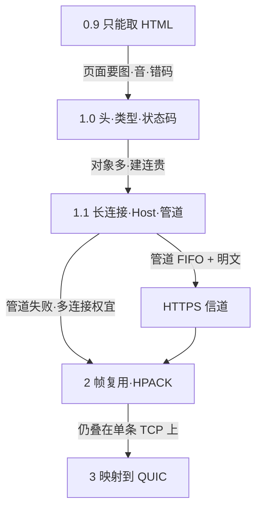
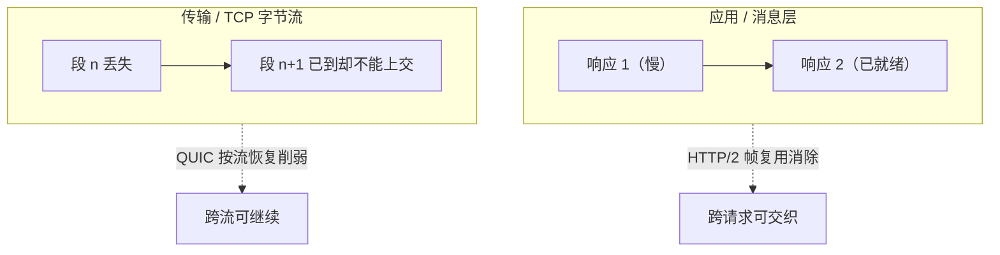

# HTTP 编年：从 0.9 到 QUIC

> HTTP 的名字三十余年几乎未变，变的是**一次连接里如何并发、丢包堵到哪一层、以及路上能否被窃听**。语义层大体连续；承载与并发模型则代际替换。
>
> 本文是 HTTP 从实验单行协议走到 HTTP/3 的编年。可与本库 [14](./14-internet-history-chronicle.md)（协议即权力）、[15](./15-browser-custody-chronicle.md)（浏览器如何代管）、[40](../40-paradigm/40-unix-agent-stateless-philosophy.md)（无状态与可组合）、[11](./11-information-theory-chronicle.md)（可靠传输与冗余）、[27](../20-architecture/27-mqtt-over-quic-treatise.md)（MQTT 接到同一条 QUIC 运输）对照。

先给一个直接答案：

> **HTTP 始终是应用层上的请求与响应；代际换的不是动词表，而是「一页很多资源」撞上的那一层瓶颈。** 无状态说的是协议不替你记会话，不是网上没有登录。0.9→1.0 补元数据与类型，因页面不再只是一篇 HTML；1.0→1.1 补默认长连接与 Host，因对象变多、建连与虚拟主机变贵，却把**应用层队头阻塞**留给管道与多连接权宜；1.1→2（经 SPDY）用二进制帧多路复用，因管道按序返回无法部署、域名分片又扭曲拥塞控制；2→3 把映射接到 QUIC，因 HTTP/2 仍叠在**单条 TCP 字节流**上，丢包会拖住整条连接上的所有流。HTTPS 是信道（HTTP over TLS），与版本号并行，不是另一套方法。队头阻塞不会消失，只会换层。

**10-chronicle 系列位置：** [14](./14-internet-history-chronicle.md) 写入口与收束；[15](./15-browser-custody-chronicle.md) 写客户端代管。本文写**浏览器与服务器之间那条应用层合同**如何一代代改写。术语先看第 1.1 节。

## 摘要

代际宜按**因—果—新债**读，不宜当功能清单。1989 年伯纳斯-李在 CERN 提出分布式超文本设想；1990–1991 年 HTML、HTTP 与浏览器/服务器一体落地，早期协议后称 **HTTP/0.9**。页面不再只是 HTML，催生 1996 年 HTTP/1.0（RFC 1945）的头字段、媒体类型与状态码，却留下短连接债。对象变多，催生 HTTP/1.1（现行 **RFC 9110/9112**）的默认持久连接与 Host；管道在 SIGCOMM’97 测量中有益，却因 FIFO 队头阻塞与中间盒在开放网失败，产业改用多连接与域名分片。明文风险催生 **SSL/TLS（HTTPS）**——信道轴，与版本轴正交。管道与分片之失败，催生 Google **SPDY** 与 2015 年 HTTP/2（现 **RFC 9113**）的帧复用；流仍叠在单条 TCP 上，丢包可拖住全连接。于是 2021–2022 年 **QUIC（RFC 9000）** 与 **HTTP/3（RFC 9114）** 把可靠流下沉到传输层，并对抗中间盒僵化。CDN 观测上 HTTP/2 仍常约半数请求，HTTP/3 约两成——不等于全网。现行语义以 RFC 9110 族为准；版本号写映射，不另起方法名。[^rfc9110][^nielsen-1997][^spdy-wp][^quic-hol][^radar-http]

**关键词：** HTTP；HTTP/1.1；HTTP/2；HTTP/3；QUIC；SPDY；队头阻塞；TLS；HTTPS；ALPN；REST；多路复用；中间件

---

## 目录

- [摘要](#摘要)
1. [读法与术语](#1-读法与术语)
    - [1.1 术语对照](#11-术语对照)
    - [1.2 边界](#12-边界)
    - [1.3 版本一览](#13-版本一览)
    - [1.4 代际因果：债在哪一层](#14-代际因果债在哪一层)
    - [1.5 两种队头阻塞：HTTP 与 TCP](#15-两种队头阻塞http-与-tcp)
2. [1989—1991：超文本系统的三件套](#2-19891991超文本系统的三件套)
3. [HTTP/0.9：单行协议](#3-http09单行协议)
4. [HTTP/1.0：头字段、类型与状态码](#4-http10头字段类型与状态码)
5. [HTTP/1.1：长连接、虚拟主机与半成品管道](#5-http11长连接虚拟主机与半成品管道)
6. [明文之外：TLS 与 HTTPS](#6-明文之外tls-与-https)
7. [HTTP/2：从 SPDY 到二进制多路复用](#7-http2从-spdy-到二进制多路复用)
    - [7.1 前身 SPDY](#71-前身-spdy)
    - [7.2 二进制分帧与多路复用](#72-二进制分帧与多路复用)
    - [7.3 头部压缩、推送与优先级](#73-头部压缩推送与优先级)
    - [7.4 债换到了哪](#74-债换到了哪)
8. [HTTP/3：接到 QUIC 上](#8-http3接到-quic-上)
    - [8.1 按流恢复：拆开 TCP 式队头阻塞](#81-按流恢复拆开-tcp-式队头阻塞)
    - [8.2 更快的握手](#82-更快的握手)
    - [8.3 连接迁移](#83-连接迁移)
    - [8.4 FEC 不是现行标配](#84-fec-不是现行标配)
    - [8.5 部署与份额](#85-部署与份额)
9. [一张表：因—果—留下的债](#9-一张表因果留下的债)
10. [本章要点](#10-本章要点)
11. [参考文献](#11-参考文献)

读法提示：先分清「语义」与「映射」；队头阻塞必先读 **1.5**（HTTP 消息层 ≠ TCP 字节流层）；再按 **1.4** 的因果链看代际如何一层层还债。



---

## 1. 读法与术语

计算机网络里的**协议（protocol）**，是通信双方共同遵守的规则：谁先说、怎么说、错了怎么办。HTTP——Hypertext Transfer Protocol，超文本传输协议——是应用层上最常见的一种：基于请求与响应，协议本身**无状态**，在 TCP（或后来的 QUIC）之上搬运超文本及相关资源。

「超文本」不只是纯文字：它包含指向其他资源的链接。最常见的载体是 HTML；浏览器再把图、脚本、样式、音视频等链过去的资源拼成页面。协议无状态，是为了少记东西、好扩展、好缓存；会话、登录、购物车，是应用用 Cookie、Token 等在协议之上自己叠的记忆。

同一套语义，还可以经过**中间件（intermediary）**——代理、网关、CDN 缓存——而不必改方法名。这是 Web 能规模化的结构前提之一，也是 Roy Fielding 后来用 **REST** 建筑风格所提炼的约束：统一接口、无状态交互、可缓存、分层系统。REST 不是「HTTP 的别名」，更不是 CRUD 动词表；它是从 Web（含 HTTP/1.1 与 URI）实践中抽象出来、又反过来指导标准化的架构透镜。[^fielding-rest]

### 1.1 术语对照

| 术语 | 一句话 |
| ---- | ------ |
| **HTTP 语义** | 方法、状态码、头字段、URI 等「说什么」。现行主文档为 RFC 9110；各版本主要改「怎么在连接上装」。 |
| **无状态** | 协议不要求服务器记住上一次请求。不等于业务不能登录。 |
| **中间件** | 代理、网关、缓存等介于客户端与源站之间的组件；可缩延迟、做策略，也可引入队头与兼容性问题。 |
| **队头阻塞（HOL）** | 队头卡住导致本可前进的后续工作也停。Web 语境须分清：**HTTP（应用/消息层）HOL** 与 **TCP（传输/字节流层）HOL**——机制、触发条件、由哪一代协议消除均不同；对照见 [1.5](#15-两种队头阻塞http-与-tcp)。 |
| **持久连接 / 长连接** | 同一条传输连接上顺序发多个请求，避免每次三握手四挥手。HTTP/1.1 默认如此。 |
| **管道（pipelining）** | 在持久连接上不等响应就发下一个请求；响应仍须按序返回。主流浏览器后放弃。 |
| **帧（frame）** | HTTP/2、HTTP/3 里的基本传输单位；多个帧组成消息，多个消息可交织在流上。 |
| **流（stream）** | 一条逻辑双向通道。HTTP/2 的流在一条 TCP 上；HTTP/3 的流在 QUIC 上，丢包恢复可按流隔离。 |
| **HPACK / QPACK** | HTTP/2 / HTTP/3 的头部压缩：用表与索引减少重复头字段。 |
| **ALPN** | TLS 握手里协商应用层协议名（如 `h2`、`http/1.1`）。浏览器里选 HTTP/2，多靠它。 |
| **Alt-Svc / HTTPS RR** | 源站或 DNS 广告「还可改走某主机 / 端口 / 协议」（常用来发现 `h3`）。 |
| **SPDY** | Google 在 HTTP/2 之前的实验协议；帧、复用、压缩等想法流入 HTTP/2，二者线格式并不兼容。 |
| **QUIC** | 在 UDP 上的传输协议（RFC 9000），自带加密与多路流。HTTP/3 是把 HTTP 语义映射到 QUIC，不是「HTTP/3 等于 QUIC」的改名。 |
| **RTT** | 往返时延：发出到收到确认大致一来一回的时间。握手要几个 RTT，是性能语言。 |
| **TLS** | 传输层安全协议（前身 SSL）。HTTP over TLS 即日常说的 HTTPS。 |
| **REST** | Representational State Transfer：分布式超媒体的建筑风格；约束交互与接口，不等于某一版 HTTP 的线格式。 |

### 1.2 边界

1. **本文写 HTTP 代际，不写完整 TCP/IP 教程。** 三次握手、拥塞控制只在挡住 HTTP 时出场。  
2. **「标准」以 RFC 为准，部署以厂商实测为准。** 草稿年、实验年与 Standards Track 定稿年分开写。  
3. **示例报文是教学示意。** 字段齐全度、版本字符串以当时实现为准，不冒充抓包审计。  
4. **无状态与 Cookie、HTTPS 是平行线。** Cookie 补的是应用记忆；TLS 补的是信道保密——都不是换一套方法动词。  
5. **份额是某一观测面，不是安装量法庭。** Cloudflare Radar 等统计的是落到该网络的请求协商结果；地区、客户是否开启 HTTP/3、UDP 是否被拦，都会让数字偏离「全互联网」。  
6. **不写攻击复现。** 多路复用带来的拒绝服务面（如 Rapid Reset）只作结构提醒：新能力会改成本不对称，细节以厂商公告与 CVE 为准。

### 1.3 版本一览

| 版本 | 关键公开节点 | 现行地位（教学口径） |
| ---- | ------------ | -------------------- |
| **HTTP/0.9** | 约 1991 年文档化用法 | 历史；无正式 IETF 标准号 |
| **HTTP/1.0** | RFC 1945（1996-05） | 被后续语义文档取代；仍可见于旧设备 |
| **HTTP/1.1** | RFC 2068（1997）→ 2616（1999）→ 7230–7235（2014）→ **RFC 9112**（2022，配合 9110/9111） | 仍广泛；语义以 9110 族为准 |
| **HTTP/2** | 自 SPDY；RFC 7540（2015-05）→ **RFC 9113**（2022） | 标准；浏览器侧常经 ALPN `h2` |
| **HTTP/3** | 草稿流行于 2010 年代末；**RFC 9114**（2022-06）；底层 **QUIC RFC 9000**（2021-05） | 标准；常经 Alt-Svc / HTTPS 记录发现；部署视 UDP 而定 |

「2019 年 HTTP/3 已是标准」不准确：那时多是草案与早期部署；IETF Standards Track 定稿在 2022 年。[^rfc9114]

### 1.4 代际因果：债在哪一层

把版本号当成功能清单，代际会显得「突然换了一批特性」。更稳的读法是一条**因 → 果 → 新债**链：网页形态变了，某一层合同变贵，下一版就改那一层；语义（GET/POST、状态码）几乎不动，动的是**并发与承载**。

| 转换 | 直接触发因 | 这一代怎么还 | 还完后显露的下一层债 |
| ---- | ---------- | ------------ | -------------------- |
| **0.9 → 1.0** | 载荷不再只是 HTML；客户端需要机器可读成败 | 头字段、`Content-Type`、状态码 | 短连接：每对象一次握手，页面对象一多就贵 |
| **1.0 → 1.1** | 一页多对象；同 IP 多站点 | 默认持久连接、`Host`、分块/Range；规范上还有管道 | 管道须**按请求顺序回响应**（应用层 HOL）；实践靠多 TCP + 域名分片；信道常仍明文 |
| **信道：HTTPS** | 登录与商业使窃听不可接受 | HTTP 语义跑在 TLS 上；后来用 ALPN 谈 `h2` | 握手多 RTT；与版本演进正交，但浏览器侧 H2/H3 几乎总绑加密 |
| **1.1 → 2** | 管道难部署；多连接扭曲慢启动/拥塞 | 二进制帧多路复用 + HPACK（自 SPDY） | 流仍封装在**一条 TCP 字节流**里：丢一包可拖住全连接（传输层 HOL） |
| **2 → 3** | TCP 对「多路复用之上的丢包」不友好；中间盒僵化 TCP 选项 | HTTP 语义映射到 QUIC：按流恢复、更快握手、连接迁移 | UDP 路径与落地差异；实现与发现更复杂 |

两条易混的轴要拆开：

1. **语义轴**（0.9→1.0→1.1 语义收束，现行 RFC 9110）：回答「说什么」。  
2. **映射轴**（1.1 报文 → H2 帧/TCP → H3/QUIC）：回答「怎么装、堵在哪」。HTTPS 是**信道轴**，横切映射，不另起方法名。

队头阻塞因此必须**分层命名**，不可把「HTTP 的 HOL」与「TCP 的 HOL」混成一句话——差别与消除路径见下一小节。

### 1.5 两种队头阻塞：HTTP 与 TCP

同叫「队头阻塞」，卡在**不同的队列、不同的合同**上。混用会导致误读：以为 HTTP/2「已经解决了队头阻塞」，或以为 HTTP/3「从此没有任何 HOL」。更准确的对照如下。[^mdn-hol][^marx-hol]

| 维度 | **HTTP（应用 / 消息层）HOL** | **TCP（传输 / 字节流层）HOL** |
| ---- | ---------------------------- | ----------------------------- |
| **卡在哪条队列** | 同一连接上的**请求—响应消息**（或未分帧的应用载荷）须按约定顺序交付 | TCP 把连接看成**一条有序字节流**：序号靠前的段未到，靠后的字节不能交给上层 |
| **典型触发** | HTTP/1.x：无管道时一问一答串行；有管道时响应仍须按请求顺序返回——队头慢响应挡住后面已就绪的响应 | 丢包 / 严重乱序：丢失段重传完成前，其后已到达的数据整段被扣住 |
| **与「多资源」的关系** | 问题在**应用语义**：协议没有（或未有效使用）可交织的流标识，后到消息不能先交 | 问题在**传输无知**：上层即使已用 HTTP/2 把多资源拆成多流，TCP 仍看不见流，只看见一个字节序列 |
| **谁消除跨请求/跨流阻塞** | **HTTP/2**（自 SPDY）：二进制帧 + `stream id`，响应可乱序交织，消掉消息层 FIFO | **HTTP/3 / QUIC**：按流做丢包恢复与交付；一流丢包不拖住其他流的已到数据 |
| **消除之后还剩什么** | 消息层跨请求阻塞不再是主矛盾；传输层 HOL 仍在（若仍跑在 TCP 上） | **跨流**传输 HOL 拆开后，**流内**仍有序：同一资源字节流的缺口仍会挡住该流后续字节；多流挤进同一 QUIC 包时，该包丢失仍会一并影响这些流 |

用场景把差异钉死：

1. **纯 HTTP 消息层（1.1 管道）：** 服务端其实已算完第 2 个响应，但规范要求先完整交出第 1 个——即使网络零丢包，第 2 个也不能先到浏览器。卡的是**应用合同**，不是 TCP 序号。[^spdy-wp]  
2. **纯 TCP 字节流层（HTTP/2 over TCP）：** 两个流的帧已在链路上交织；若只丢了携带流 A 数据的一个 TCP 段，流 B 的后续段即使到了网卡，TCP 也不能把它们交给 HTTP/2——直到 A 的缺口补上。卡的是**传输有序交付**，HTTP/2 的 `stream id` 帮不上忙，因为它还没被交给应用层。[^marx-hol]  
3. **二者会叠加，但不是同一个机制：** 1.1 管道下，慢后端造成消息层 HOL；同时若发生丢包，TCP 重传还会拉长整条连接上的等待——表现上都是「后面上不来」，根因层不同。[^mdn-hol]



> **判断：** HTTP/2 解决的是「消息能不能乱序交付」；HTTP/3 进一步解决的是「丢包时无关流能不能继续上交」。说「队头阻塞被消灭」而不指明层级，在工程上不成立——QUIC 之后仍有**流内** HOL。[^marx-hol]

**所以 · 边界在哪：** 讨论代际时，先问卡的是消息顺序还是字节流序号；再问该代改的是哪一层。后文 §5、§7、§8 均按此二分展开。

---

## 2. 1989—1991：超文本系统的三件套

1989 年 3 月，在 CERN 工作的蒂姆·伯纳斯-李提交 *Information Management: A Proposal*：目标不是再做一个文件传输工具，而是用**分布式超文本**解决大型协作项目中信息丢失与难以检索的问题。提案当时甚至未定名 World Wide Web（早期曾称 Mesh）；HTTP 线格式也尚未写成后来的 0.9。[^cern-proposal]

真正落地发生在 1990–1991 年：三件套一起长出来——

1. **HTML**——表示超文本文档的格式；  
2. **HTTP**——交换超文本文档的简单协议；  
3. **浏览器与服务器**——一边显示（并可编辑），一边提供可访问文档（早期服务端思路即后来 `httpd` 一类程序的前身）。

最早的站点与服务跑在 CERN 的 NeXT 上，主机名 `info.cern.ch` 仍是这段史的地标。1991 年 8 月，伯纳斯-李在 `alt.hypertext` 上公开说明，常被视为 Web 作为公共项目的起点之一。[^cern-www] 浏览器如何把陌生页面代管在本机，见 [15](./15-browser-custody-chronicle.md)。

**所以这一段定下什么：** 全球信息空间靠「可链接的文档 + 取回协议 + 显示端」成立；协议从一开始就被设计得薄，以便独立演进。

---

## 3. HTTP/0.9：单行协议

早期 HTTP 没有版本号，后来统称 **HTTP/0.9**。W3C 保存的 1991 年实现说明把它钉死得很清楚：叠在 TCP/IP 上（默认端口 **80**），请求往往只有一行——方法（实质只有 **GET**）加文档地址；响应是 HTML（或带 `PLAINTEXT` 等标记的字节流），**没有响应头，也没有机器可读状态码**；出错时常只是返回一段说明问题的 HTML。服务端送完就关连接；请求被描述为幂等，服务端不必在断连后记住该次交互。[^http09]

示意：

```http
GET /index.html
```

```html
<html>
  Hello World
</html>
```

**上限很清楚：** 几乎只适合传简单超文本；类型、缓存、错误码、连接复用都不在协议里。它不是「正式 IETF 标准」，是用出来的最小合同。

**所以这一代定下什么：** 请求—响应、短连接、无会话记忆。后面三十年，是在这张薄纸上不断加栏，而不是另起炉灶改动词表。

**通往 1.0 的因果：** 一旦页面要带图、要区分「找不到」与「成功」、要让代理做缓存，单行 GET + 纯 HTML 体就不够——下一节补的正是元数据与类型，而不是先改传输。

---

## 4. HTTP/1.0：头字段、类型与状态码

1996 年 **HTTP/1.0** 以 RFC 1945（Informational）记下当时已流行的用法。[^rfc1945] 它回答的是 0.9 留下的**表达力债**，关键补丁是：

1. **请求行带版本**，如 `GET / HTTP/1.0`。  
2. **请求头 / 响应头**（`Key: Value`）：先头后体，使元数据与载荷分离。  
3. **`Content-Type` 等媒体类型：** 载荷可以是 HTML、图、音视频、二进制——内容格式不再绑死 HTML。  
4. **方法扩展：** 规范正文里互操作最稳定的主要是 **GET、HEAD、POST**；PUT、DELETE 等更多在附录或不一致实现里，不宜写成「1.0 已齐备 REST 动词表」。  
5. **状态码：** 响应以状态行开头，如 `HTTP/1.0 200 OK`，客户端据此决定是否用缓存、是否重试。常见大类：1xx 信息、2xx 成功、3xx 重定向、4xx 客户端错、5xx 服务端错——细目后世继续加。  
6. **缓存相关头**（如 `Expires`、`Last-Modified`）与条件请求雏形开始进入日常，为 CDN 与浏览器缓存留下接口。

示意：

```http
GET / HTTP/1.0
User-Agent: NCSA_Mosaic/2.0 (Windows 3.1)
Accept: */*
```

```http
HTTP/1.0 200 OK
Content-Type: text/html
Content-Length: 137582
Server: Apache 0.84

<html><body>Hello World</body></html>
```

### 4.1 无状态，且常常短连接

HTTP/1.0 仍是无状态应用层协议。实践上，一次请求常对应一次 TCP：建连 → 传完 → 关掉。服务器不必记住该客户端上次来过——这是无状态；连接不默认复用——是短连接习惯。

**性能债（通往 1.1 的因）：** 表达力够了，**连接模型**不够。每个对象一次 TCP 握手；顺序请求时应用层排队与建连成本叠在一起。网页从「一篇文」变成「一堆图」后，这笔债显性化——1.1 的主战场因此是持久连接与虚拟主机，而不是再发明一套方法名。

**所以这一代定下什么：** 元数据与类型系统让 Web 成为通用内容管道；状态码让自动化客户端成为可能；短连接习惯把下一笔债交给 1.1。

---

## 5. HTTP/1.1：长连接、虚拟主机与半成品管道

**HTTP/1.1** 于 1997 年进入标准轨道（RFC 2068），1999 年大修为 RFC 2616；2014 年拆成 RFC 7230 族；2022 年再收成 **RFC 9110**（语义）+ **RFC 9111**（缓存）+ **RFC 9112**（1.1 报文与连接）等。[^rfc9110] Fielding 等在撰写 1.1 时已用 REST 约束筛提案：统一接口、无状态、可缓存与分层，使代理与缓存成为一等公民，而不是事后补丁。[^fielding-rest]

它要还的，是 1.0 的**短连接与同 IP 多站点**两笔债。SIGCOMM’97 的测量表明：在受控环境里，**持久连接 + 管道**的 1.1 实现可显著减少包数，并在多种网络条件下优于并行多连接的 1.0——设计意图因此被数据托住；但产业后来证明，管道这一半在开放互联网上极难落地。[^nielsen-1997] 下面按「解决 1.0 哪笔债」写，不按 RFC 编号逐条抄。

### 5.1 默认持久连接

1.1 默认在同一条 TCP 上顺序发多个请求（持久连接）。HTTP/1.0 时代流行的 `Connection: keep-alive` 是扩展口径；在 1.1 里，持久是默认，除非显式 `Connection: close`。浏览器对同一主机还会开有限几条并行 TCP（历史上常见约 4–6 条；早期 RFC 曾写过更严的并发建议，实践与后来修订都放宽了）。[^conn-parallel]

### 5.2 管道：纸上对了，路上没根治

1.1 允许在未收到响应时继续发请求（pipelining），本意是单连接上的并行。但规范要求**响应仍按请求顺序回来**，否则客户端分不清谁是谁。于是只要队头是一个慢请求或大响应，后面已算完的响应也不能先交——这是**应用层（消息层）队头阻塞**。SPDY 白皮书后来把症结说死：管道仍是单条 FIFO 流；处理延迟或丢包会拖住整条流；再加中间盒兼容性差，主流浏览器默认关闭管道。[^spdy-wp]

产业权宜随之出现：把每主机并发 TCP 提到约 6 条，再用**域名分片（domain sharding）**把资源拆到多个主机名上，换取更多并行——代价是更多握手、更多慢启动实例，并削弱单连接拥塞控制的「公平」假设。[^spdy-wp] 这条权宜路线，正是下一节 SPDY/HTTP/2「一条连接上真复用」要废掉的对象。

### 5.3 `Host`：一台机器多个站点

1.0 很难在同一 IP 与端口上靠名字区分虚拟站点。1.1 要求（实践上必须）带 **`Host`**，服务器按主机名把请求派到不同站点。同一机制也被拿来做域名分片：多名字指向同一机器，绕开单域名连接数上限——是工程权宜，不是协议美学。

### 5.4 分块、Range、协商与条件请求

- **分块传输（chunked）：** 不必预先知道全文长度，按块送，零长度块收尾。  
- **Range / Content-Range：** 断点续传与分段取；成功分段常用 **206 Partial Content**。  
- **内容协商：** `Accept` / `Accept-Language` / `Accept-Encoding` 等让同一 URI 可按客户端能力返回不同表示（representation）——这与 REST「资源有多种表示」一致。  
- **`Last-Modified` / `ETag`：** 判断资源是否变过，配合缓存与条件 GET，减少重复载荷。

### 5.5 Cookie：无状态之上的小块记忆

协议仍不记会话；站点用 **`Set-Cookie` / `Cookie`** 让浏览器存一小块数据，下次带回去——登录态、购物车、偏好、跟踪，都叠在这层。[^cookie] 好处是业务能连续；代价是请求变胖、隐私与安全表面变大。存储 API 兴起后，Cookie 不再是唯一选择，但「无状态协议 + 显式客户端状态」的结构没变。与 [40](../40-paradigm/40-unix-agent-stateless-philosophy.md) 同读：无状态是把状态放哪的纪律，不是禁止状态。

**所以 1.1 定下什么：** 一页上千资源在连接复用上变得可承受；虚拟主机与缓存分层成为默认；**管道未能终结消息层队头阻塞**，多连接/分片把债挪到传输与运维侧；会话靠 Cookie 外挂。安全上，它仍常是**明文**——信道债与并发债并行，下一节先还信道。

---

## 6. 明文之外：TLS 与 HTTPS

HTTP 版本演进回答「怎么并发」；**HTTPS 回答「路上能不能被看光」**——两条轴正交，只是部署史上缠在一起。HTTP/1.x 把内容写在可被中间人阅读的通道上。学术分享时代风险感弱；商业与登录普及之后，抓包即泄露。

网景在 1990 年代中期于 TCP 之上加入 **SSL**：内部 SSL 1.0 未公开；**SSL 2.0** 约 1995 随 Navigator 面世，缺陷很快暴露；**SSL 3.0**（约 1996）重构后成为后续基础。IETF 于 1999 年以 **TLS 1.0（RFC 2246）** 将其纳入标准轨道（与 SSL 3.0 故意不完全互通）；其后经 TLS 1.1 / 1.2，到 **TLS 1.3（RFC 8446，2018）** 进一步砍握手来回并收紧密码套件。[^tls] 日常所说的 **HTTPS**，是 HTTP 语义跑在 TLS 提供的加密通道上，不是第三套方法表。默认端口：HTTP **80**，HTTPS **443**。建连除 TCP 握手外，还要完成 TLS 握手，才进入密文应用数据。

教学上常概括三件事（细节随 TLS 版本变）：

1. **保密：** 对称加密保护载荷；密钥交换保护对称密钥本身。  
2. **认证：** 证书链把公钥绑到名字上，降低中间人冒充。  
3. **完整性：** 记录被改，校验失败。

浏览器把「不安全」标在地址栏上，是把信道规矩做成产品默认——见 [15](./15-browser-custody-chronicle.md) 默认 HTTPS 一节。现代栈里，TLS 握手还常带 **ALPN**：客户端与服务器用短名字商定接下来跑 `http/1.1` 还是 `h2`。[^alpn] HTTP/2、HTTP/3 在浏览器里几乎总与加密部署绑在一起；明文 h2c 存在，但不是大众上网的主路径。TLS 1.3 与 QUIC 的「运输 + 加密一体」是同一条降 RTT 的河。

**所以这一层定下什么：** 保密与认证成为 Web 默认合同的一部分；版本协商从「猜」变成握手里的显式字段。它**不**消除 1.1 的消息层队头阻塞——那笔债要等到 SPDY/HTTP/2 才还。

---

## 7. HTTP/2：从 SPDY 到二进制多路复用

**HTTP/2** 于 2015 年以 RFC 7540 定稿，2022 年修订为 RFC 9113。[^rfc9113] 语义（方法、状态码、头字段含义）刻意兼容；换的是**编码与会话层**。直接因果是：1.1 的管道在开放网上失败后，浏览器用「每域约 6 条连接 + 域名分片」硬扛并行，既贵又扭曲 TCP 拥塞控制——需要在**仍用 TCP** 的前提下，把多请求真正交织进一条会话。

### 7.1 前身 SPDY

2009 年起 Google 推出 **SPDY**，白皮书把 HTTP 的延迟病灶列得很具体：单连接一次只能有效推进一个请求（管道仍是 FIFO）；只能客户端发起；头字段未压缩且大量重复；浏览器靠多连接绕过。目标是在应用层允许多路并发、压缩头、可选服务端推送，并尽量不改站点内容、不换传输栈——因为「换传输极难部署」。实验室测得页加载可改善约三到六成量级（视链路与是否合并域名而定）。[^spdy-wp]

IETF 以 SPDY 为主要输入做 HTTP/2，线格式在标准化中改到与 SPDY **不兼容**；CDN 曾长期双栈，后随客户端离去而关掉 SPDY。[^spdy] 读史时把 SPDY 当成「实验室里的 HTTP/2」，把 RFC 7540 当成「可互操作的合同」。

### 7.2 二进制分帧与多路复用

1.x 头是文本，体可以是文本或二进制。HTTP/2 在应用语义与 TCP 之间加**二进制分帧层**：消息切成帧（如 HEADERS、DATA），带类型、标志、流标识与载荷。机器少做文本解析；多路交织更自然。浏览器侧常通过 TLS **ALPN** 选出 `h2`。

同一条连接上多个**流**并行：各请求/响应拆成帧，可交错发送，对端按 `stream id` 组装。某一流慢，不必堵住其他流的**应用层**排队——这是对 1.1 管道 FIFO 的正经回答：响应可以乱序交付。浏览器也不必再靠「多条 TCP + 域名分片」硬扛并发（连接数策略仍在，但动机从「骗并行」变为「连接管理」）。`SETTINGS` 等参数协商最大并发流数量；这既是性能旋钮，也是后来成本不对称攻击面的边界之一。

层级可记为：

| 层级 | 含义 |
| ---- | ---- |
| **连接** | 一条 TCP（通常在 TLS 上） |
| **流** | 一条逻辑请求—响应通道 |
| **消息** | 一次请求或一次响应 |
| **帧** | 最小单位 |

### 7.3 头部压缩、推送与优先级

无状态意味着许多头每次重发。**HPACK** 让两端维护静态/动态表，重复字段可改发索引；再配合压缩，省带宽。[^hpack]

**服务端推送**可在未收到某资源请求时，主动往客户端推静态资源（仍受同源等约束；客户端可用 `RST_STREAM` 拒收）。它改变的是缓存填充时机，不是把任意数据推给页面脚本——与 WebSocket 不是同一合同。产业上收益不稳定：Chrome 等自 **106** 起移除对 HTTP/2 Push 的支持；站点更常改用 `<link rel=preload>` 或 **103 Early Hints（RFC 8297）**。规范里推送仍可选，产品上已降温。[^h2-push]

流之间谁先传，早期靠 RFC 7540 的依赖树优先级，互操作差；**RFC 9113 废弃该信号**，改由 **RFC 9218** 的可扩展优先级（如 `Priority` 头）接替。[^rfc9218] 多路复用若没有可用的调度信号，带宽仍可能被大图抢走关键 CSS。

### 7.4 债换到了哪

因果要写完整：**HTTP/2 还掉的是 HTTP 消息层 HOL，不是 TCP 字节流层 HOL**（二分见 [1.5](#15-两种队头阻塞http-与-tcp)）。流在 HTTP/2 里独立编号，但都封装进**一条有序的 TCP 字节流**——TCP 看不见 `stream id`。某一 TCP 段丢失时，接收端不能把后续字节交给 HTTP/2，直到重传补齐；于是连接上**所有**流一起停，哪怕丢的只属于其中一流。[^quic-hol][^marx-hol] SPDY 白皮书当年选择「先改应用层、不换 TCP」，正是因为换传输难部署；这笔刻意留下的债，成了 QUIC/HTTP/3 的入口问题。

多路复用还改变了攻防成本结构：例如 2023 年披露的 **HTTP/2 Rapid Reset（CVE-2023-44487）**，利用「打开流后迅速取消」造成客户端与服务端工作量不对称。它提醒的是结构事实——新会话层会带来新的限流与资源会计问题——而不是要求读者复现攻击。[^rapid-reset]

**所以这一代定下什么：** 一页很多资源可以共用一条加密连接；消息层 FIFO 被帧复用废掉；**TCP 字节流层的跨流阻塞**与实现复杂度变成通往 HTTP/3 的因。

---

## 8. HTTP/3：接到 QUIC 上

**QUIC**（RFC 9000，2021）在 **UDP** 上提供多路可靠流、始终加密、连接迁移等能力；**HTTP/3**（RFC 9114，2022）把 HTTP 语义映射到 QUIC，而不是「把 HTTP 改名叫 QUIC」。[^rfc9000][^rfc9114] 早期 Google 的 gQUIC（曾与 SPDY / 早期「HTTP over QUIC」实验叠名）是前身；IETF QUIC 与 HTTP/3 是标准轨道上的收束。

**通往这一代的因有两条，缺一不可：**

1. **传输层 HOL：** HTTP/2 已在应用层多路复用，却仍受害于 TCP 单字节流——丢包拖住无关流。要把「流」做成传输原语，可靠恢复才能按流隔离。[^quic-hol]  
2. **可演进性：** Langley 等在 SIGCOMM 2017 总结：把新传输放在用户态、以 UDP 为底物，才能以应用更新速度迭代，并让报文在中间盒上**少被改写、少被僵化（ossification）**——TCP 选项与明文握手长期被中间设备钉死。加密默认打开，既是安全，也限制中间盒对内部语义的依赖。[^quic-paper]

SPDY 曾认为「先改应用层更易部署」；HTTP/2 部署成功之后，剩下的瓶颈恰好迫使生态再付一次「换运输」的成本——这是代际上的二次跃迁，不是把 HTTP/2「改个名字」。

### 8.1 按流恢复：拆开 TCP 式队头阻塞

这里消的是 **TCP 那种跨流传输层 HOL**，不是「任何排队都消失」（对照 [1.5](#15-两种队头阻塞http-与-tcp)）。QUIC 上多个流独立做丢包检测与重传：一流丢包，主要卡住这一流；其他流可继续把已到达的数据交给应用。可靠不再绑死「整条连接一个字节总序」。UDP 本身不保证可靠；可靠是 QUIC 做的。边界有二：同一流内部仍有序，缺口未补前该流后续字节不能上交（**流内 HOL**）；若多个流的数据挤进**同一个** QUIC 包，该包丢失仍会一并影响这些流——实现上需在填充效率与隔离之间权衡。[^quic-hol][^marx-hol]

### 8.2 更快的握手

HTTPS over TCP 常要 TCP 握手加 TLS 握手，冷启动多个 RTT；会话恢复可缩短。QUIC 把传输与加密握手揉在一起（密码学上对接 TLS 1.3），**首次连接可低至约 1 RTT 带业务数据，恢复连接可 0 RTT**（0 RTT 有重放风险，用途需收敛）。[^quic-rtt] 指标仍用 RTT 衡量：少一个来回，弱网下可感知延迟差距显著。

### 8.3 连接迁移

TCP 连接常绑死四元组（源 IP、源端口、目的 IP、目的端口）。换 Wi-Fi / 蜂窝时 IP 一变，连接往往重来。QUIC 用**连接 ID** 标识连接，网络切换时逻辑会话可续——移动场景是设计动机之一。

### 8.4 FEC 不是现行标配

早期 Google QUIC 试验过简单 XOR 前向纠错（FEC）：可降低重传率，但对搜索延迟无统计显著收益，对视频甚至增加卡顿；且单包 FEC 只能覆盖约三成 RTT 尺度的丢包事件，实现复杂度高。Google 约在 **2016 年初** 去掉 XOR FEC。[^quic-fec] **IETF QUIC 核心规范不以 FEC 为可靠传输主路径**，丢包主要靠检测与重传。冗余与纠错的一般道理见 [11](./11-information-theory-chronicle.md)；不要把实验特性写进现行 HTTP/3 必考清单。

### 8.5 部署与份额

HTTP/3 要求路径允许 UDP，且中间盒不乱改；不通时客户端通常回落 HTTP/2 或 1.1。发现方式常见为 **`Alt-Svc`（RFC 7838）** 广告 `h3`，或 DNS **HTTPS / SVCB 记录（RFC 9460）** 在建连前告知可用 ALPN（含 `h3`）与端点；ALPN 名在 QUIC 路径上对应 HTTP/3。[^alt-svc][^rfc9460] 主流浏览器约在 2020–2021 年陆续默认开启。头部压缩在 HTTP/3 侧是 **QPACK**（适应乱序流），不是原样 HPACK。[^qpack]

观测面举例：Cloudflare Radar 年报口径下，2024 年全球请求约 **HTTP/2 49.6%**、**HTTP/3 20.5%**、**HTTP/1.x 29.9%**；2025 年大致 **50% / 21% / 29%**，HTTP/3 略升。[^radar-http] 这是该 CDN 上的协商结果，不是终端安装份额，也不证明「HTTP/1 已死」——许多区域与客户配置仍偏旧栈。

**所以这一代定下什么：** 语义仍是 HTTP；换的是运输与加密一体化的多路流，并主动对抗中间盒僵化。跨流的传输层队头阻塞被拆开；单流有序与 UDP 路径问题成为新边界。

---

## 9. 一张表：因—果—留下的债

| 代 | 直接因（上一层哪里贵） | 果（这一代改什么） | 留下的债（下一层入口） |
| -- | ---------------------- | ------------------ | ---------------------- |
| **0.9** | 只要取回一篇超文本 | 单行 GET，响应即体 | 无类型、无状态码、无复用 |
| **1.0** | 页面要多媒体与机器可读成败 | 头、类型、状态码、短连接习惯 | 每对象握手；顺序请求排队 |
| **1.1** | 对象多、虚拟主机、要少握手 | 默认长连接、Host、分块/Range；管道（难落地） | 消息层 FIFO；多连接/分片权宜；常明文 |
| **TLS/HTTPS** | 明文信道不可接受 | HTTP over TLS；ALPN | 握手 RTT；证书与配置成本 |
| **2** | 管道失败 + 多连接扭曲拥塞 | 帧复用、HPACK（自 SPDY） | **TCP 跨流 HOL**；推送/旧优先级降温；流会计 |
| **3** | TCP 字节流拖住无关流 + 中间盒僵化 | 映射到 QUIC：按流恢复、快握手、迁移 | UDP 可达性；实现与发现复杂度 |

读法收成一句：**方法名几乎没换家族；每一代都在还「一页很多资源」撞上的那一层合同——先表达力，再连接复用，再消息层复用，再传输层按流恢复；HTTPS 并行还信道债。**

---

## 10. 本章要点

1. **两种 HOL：** HTTP 消息层（1.x 串行/管道 FIFO）≠ TCP 字节流层（丢包扣住整连）；H2 消前者，H3/QUIC 削弱跨流后者，流内 HOL 仍在。  
2. **代际读法：** 语义轴稳定；映射轴换承载；HTTPS 是信道轴。  
3. **0.9 → 1.0：** 因多媒体与自动化需要元数据；果是头、类型、状态码；债是短连接。  
4. **1.0 → 1.1：** 因对象多；果是长连接与 Host；管道在测量上有益、在部署上失败，催生多连接/分片。  
5. **HTTPS：** 因窃听不可接受；与版本号正交；ALPN 为 H2 铺路。  
6. **1.1 → 2：** 因消息层 FIFO 与分片权宜；果是帧复用；债留给 TCP 跨流 HOL。  
7. **2 → 3：** 因 TCP 拖住无关流 + 僵化；果是映射到 QUIC；定稿 2022；份额见 CDN 观测，非全网。  
8. **QUIC ≠ HTTP/3 别名；** Alt-Svc / HTTPS RR 管发现；FEC 非现行必考主路径。

---

## 11. 参考文献

[^cern-proposal]: Tim Berners-Lee, *Information Management: A Proposal*, CERN, March 1989 / May 1990. https://www.w3.org/History/1989/proposal-msw.html 。分布式超文本设想；当时未定名 WWW，亦未定义日后的 HTTP/0.9 线格式。

[^cern-www]: CERN / W3C 史述：1990 年 HTML、HTTP 与 WorldWideWeb 浏览器/服务器落地；早期站点 `info.cern.ch`。与本库 [15](./15-browser-custody-chronicle.md) 中 NeXT 节点互参。另见 MDN *Evolution of HTTP* 对 1989–1991 节点的整理：https://developer.mozilla.org/en-US/docs/Web/HTTP/Guides/Evolution_of_HTTP 。

[^http09]: W3C, *The Original HTTP as defined in 1991*（HTTP/0.9）. https://www.w3.org/Protocols/HTTP/AsImplemented.html 。单行 GET、响应为 HTML 字节流、无状态码、服务端送完断连；请求描述为幂等。

[^rfc1945]: RFC 1945, *Hypertext Transfer Protocol -- HTTP/1.0*, May 1996. https://www.rfc-editor.org/rfc/rfc1945 。Informational；反映当时通行用法。方法以 GET / HEAD / POST 为主文一致实现。

[^rfc9110]: RFC 9110, *HTTP Semantics*；RFC 9111, *HTTP Caching*；RFC 9112, *HTTP/1.1*, June 2022. https://www.rfc-editor.org/rfc/rfc9110 。现行语义与 1.1 报文/连接管理；废止/收编 RFC 7230 族等旧文的相应部分。

[^fielding-rest]: Roy Thomas Fielding, *Architectural Styles and the Design of Network-based Software Architectures*, PhD dissertation, UC Irvine, 2000. https://ics.uci.edu/~fielding/pubs/dissertation/top.htm 。提出 REST；第 6 章说明其如何指导 HTTP/1.1 与 URI 标准化及中间件/可缓存约束——REST 是建筑风格，不是 HTTP 的线格式别名。

[^conn-parallel]: RFC 2616 曾建议客户端对服务器少并发连接；浏览器实践更高；RFC 7230 起取消过时硬限制表述。正文「约 4–6 条」为历史产品常见量级，非永远不变的标准句。SPDY 白皮书亦记载约 2008 年起多数浏览器从每域 2 条提到约 6 条。

[^nielsen-1997]: Henrik Frystyk Nielsen, James Gettys, et al., *Network Performance Effects of HTTP/1.1, CSS1, and PNG*, ACM SIGCOMM 1997. https://dl.acm.org/doi/10.1145/263105.263157 ；全文 https://www.w3.org/Protocols/HTTP/Performance/Pipeline 。受控测量中，持久连接 + 管道的 1.1 在包数与多种网络条件下优于并行多连接的 1.0——支撑 1.1 设计意图；开放网上的管道部署失败见后文 SPDY 论述。

[^cookie]: Netscape Cookie 机制后经 RFC 2109、2965、**6265** 等演进。https://www.rfc-editor.org/rfc/rfc6265 。正文只取「无状态协议上的客户端状态袋」结构。

[^tls]: Netscape SSL 2.0（约 1995 公开）→ SSL 3.0（约 1996；历史文档见 RFC 6101）→ TLS 1.0（RFC 2246, 1999）→ … → TLS 1.3（RFC 8446, 2018）. https://www.rfc-editor.org/rfc/rfc2246 ；https://www.rfc-editor.org/rfc/rfc8446 。HTTPS 即 HTTP over TLS；端口 443 为惯用默认。

[^alpn]: RFC 7301, *Transport Layer Security (TLS) Application-Layer Protocol Negotiation Extension*. https://www.rfc-editor.org/rfc/rfc7301 。`h2` / `http/1.1` 等标识用于在 TLS 握手里选定应用协议。

[^spdy-wp]: Google / Chromium, *SPDY: An experimental protocol for a faster web*（SPDY 白皮书）. https://www.chromium.org/spdy/spdy-whitepaper/ 。指出单请求/FIFO 管道、未压缩重复头、仅客户端发起等延迟病灶；说明管道默认关闭；主张先改应用层因换传输难部署；记录每域约 6 连接等权宜及实验性页加载改善。

[^spdy]: Google SPDY（约 2009 起）为 HTTP/2 主要输入之一；RFC 7540 发布后线格式与 SPDY 不兼容。Cloudflare 等叙述：曾支持 SPDY，约 2018 年因客户端占比过低关闭。史述见 Cloudflare *HTTP/3: From root to tip*：https://blog.cloudflare.com/http3-from-root-to-tip/ 。

[^rfc9113]: RFC 7540, *HTTP/2*, May 2015；RFC 9113, *HTTP/2*, June 2022（废止 7540 等）. https://www.rfc-editor.org/rfc/rfc9113 。二进制帧、多路复用、HPACK；服务端推送为可选；7540 优先级信号在 9113 中废弃。

[^hpack]: RFC 7541, *HPACK: Header Compression for HTTP/2*. https://www.rfc-editor.org/rfc/rfc7541 。

[^h2-push]: 服务端推送见 RFC 9113 §8.4。Chrome 106 起移除接收/使用 HTTP/2 server push 的能力：https://developer.chrome.com/blog/removing-push 。业界常用 preload / Early Hints（RFC 8297）替代「猜你需要的静态资源」。

[^rfc9218]: RFC 9218, *Extensible Prioritization Scheme for HTTP*, June 2022. https://www.rfc-editor.org/rfc/rfc9218 。替代 RFC 7540 流优先级树；与 HTTP/2、HTTP/3 调度相关。

[^rapid-reset]: CVE-2023-44487（HTTP/2 Rapid Reset）；Cloudflare 技术拆解：https://blog.cloudflare.com/technical-breakdown-http2-rapid-reset-ddos-attack/ ；NVD：https://nvd.nist.gov/vuln/detail/CVE-2023-44487 。正文仅作「多路复用改变成本结构」的结构提醒。

[^rfc9000]: RFC 9000, *QUIC: A UDP-Based Multiplexed and Secure Transport*, May 2021. https://www.rfc-editor.org/rfc/rfc9000 。

[^rfc9114]: RFC 9114, *HTTP/3*, June 2022. https://www.rfc-editor.org/rfc/rfc9114 。HTTP 语义到 QUIC 的映射。

[^mdn-hol]: MDN Web Docs, *Head-of-line blocking*. https://developer.mozilla.org/en-US/docs/Glossary/Head_of_line_blocking 。区分 HTTP/1.1 应用层 HOL、HTTP/2 多路复用后仍存的传输层 HOL，以及 HTTP/3/QUIC 对跨流传输 HOL 的消除。注意：其「HOL problem on HTTP no longer exists」宜理解为跨流传输层问题被移除；流内有序交付造成的等待仍在（见 Marx 等）。

[^marx-hol]: Robin Marx, Tom De Decker, Peter Quax, Wim Lamotte, *Resource Multiplexing and Prioritization in HTTP/2 over TCP versus HTTP/3 over QUIC*, 2020. https://h3.edm.uhasselt.be/files/ResourceMultiplexing_H2andH3_Marx2020.pdf 。阐明 TCP 单字节流如何造成跨 HTTP/2 流的传输层 HOL；QUIC 按流可靠/有序，消除**跨流** HOL，但保留**流内** HOL；同包多流丢失会削弱隔离。通俗长文见同作者 *Head-of-Line Blocking in QUIC and HTTP/3: The Details*：https://calendar.perfplanet.com/2020/head-of-line-blocking-in-quic-and-http-3-the-details/ 。

[^quic-hol]: 传输层队头阻塞与 QUIC 按流隔离：早期 IETF QUIC 文稿（如 draft-ietf-quic-transport）明确——应用在 TCP 单字节流上多路复用时，丢一段会阻塞后续所有段，无关流亦停；QUIC 使丢失主要影响携带其数据的流。测量与调度交互见 APNIC Blog *HTTP/3 and QUIC — prioritization and head-of-line blocking*（2022）：https://blog.apnic.net/2022/11/30/http-3-and-quic-prioritization-and-head-of-line-blocking/ 。

[^quic-paper]: Adam Langley et al., *The QUIC Transport Protocol: Design and Internet-Scale Deployment*, ACM SIGCOMM 2017. https://doi.org/10.1145/3098822.3098842 。用户态迭代、UDP 底物、默认加密与对抗中间盒僵化等设计动机；并报告 FEC 试验结论。Langley 等亦指出：HTTP/2 多路复用叠在 TCP 上时，丢失段会对其后应用帧征收「延迟税」。

[^qpack]: RFC 9204, *QPACK: Field Compression for HTTP/3*. https://www.rfc-editor.org/rfc/rfc9204 。

[^alt-svc]: RFC 7838, *HTTP Alternative Services*. https://www.rfc-editor.org/rfc/rfc7838 。以协议标识 + 主机 + 端口广告替代服务；HTTP/3 发现常依赖 `Alt-Svc`。

[^rfc9460]: RFC 9460, *Service Binding and Parameter Specification via the DNS (SVCB and HTTPS Resource Records)*, 2023. https://www.rfc-editor.org/rfc/rfc9460 。HTTPS RR 可在建连前广告 `h3`/`h2` 等 ALPN 与端点参数。

[^quic-rtt]: QUIC 将传输握手与 TLS 1.3 结合；1-RTT / 0-RTT 为协议能力描述（见 RFC 9000 / RFC 9001）。0-RTT 应用数据存在重放风险，须按安全边界选用。

[^quic-fec]: Langley et al., SIGCOMM 2017（同上）：XOR FEC 降低重传但对搜索延迟无显著收益、恶化部分视频指标；约 2016 年初自 Google QUIC 移除。IETF QUIC 不以 FEC 为 RFC 9000 核心可靠机制。

[^h3-deploy]: Chrome / Edge 约 2020-11、Firefox 约 2021-04 起稳定通道默认支持 HTTP/3；QUIC v1 / `h3` 标识随 RFC 9000/9114 前后在 CDN 广告。见 Cloudflare 相关工程博文。

[^radar-http]: Cloudflare Radar Year in Review：2024 年请求份额约 HTTP/2 49.6%、HTTP/3 20.5%、HTTP/1.x 29.9%（https://blog.cloudflare.com/radar-2024-year-in-review/ ）；2025 年约 50% / 21% / 29%（https://blog.cloudflare.com/radar-2025-year-in-review/ ）。口径为该网络全球请求协商结果，随年与地区变动。

**声明：** 正文是代际编年，不是抓包教程，也不替代安全配置基线。草稿年、产品实验与 RFC 定稿年冲突时，以 RFC Editor / HTTP 工作组现行文档为准；部署份额以 CDN / Radar 等可核验统计为准并会变动。
