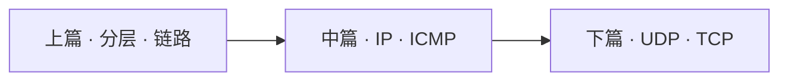
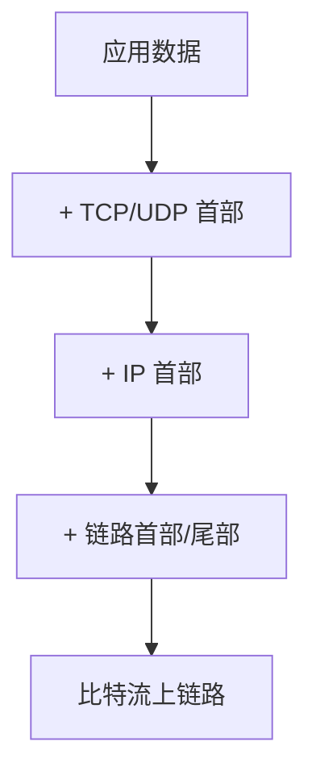

# TCP/IP 协议栈：分层、尽力而为与端到端可靠

> 应用数据不会「直接飞到对端」。它进入协议栈后逐层封装，再以比特流送上链路；对端再逐层剥开。IP 只做尽力而为的无连接投递；端到端的可靠、排序与流量控制，主要由传输层（尤其是 TCP）补上。
>
> 本文以 W. Richard Stevens《TCP/IP Illustrated, Vol. 1》的经典读法为骨架，并用现行 RFC 与部署实践纠偏过时表述。可与本库 [14](./14-internet-history-chronicle.md)（谁定义协议）、[16](./16-http-protocol-chronicle.md)（HTTP 如何叠在传输之上）、[11](./11-information-theory-chronicle.md)（可靠信道与冗余）、[27](../20-architecture/27-mqtt-over-quic-treatise.md)（换到 QUIC 时语义不变）对照：本文写**栈如何分工**；16 写应用合同如何换代。

先给一个直接答案：

> **TCP/IP 在教学上常作四层：链路 → 网络（IP / ICMP / IGMP）→ 传输（TCP / UDP）→ 应用。** IP 提供不可靠、无连接的数据报服务——不保证到达、不维护会话、可不按序抵达；若需要可靠性，由上层（如 TCP）用确认、超时重传、排序与校验来补。链路 MTU 限制单跳可承载的帧载荷；过大则可能触发 IP 分片（实践上宜尽量避免）。路径上各跳 MTU 的最小值称路径 MTU。ICMP 携带差错与诊断；Ping / Traceroute 是其经典应用。UDP 是轻量数据报；TCP 是面向连接的可靠字节流，并以滑动窗口做流量控制，以拥塞窗口 / 慢启动与快速重传等机制适应变化的网络。

**10-chronicle 位置：** [14](./14-internet-history-chronicle.md) 写互联网权力与入口；[16](./16-http-protocol-chronicle.md) 写 HTTP 代际。本文写二者底下的**传输与网络层合同**（Stevens 读法 + RFC 纠偏）。

## 摘要

Stevens 将 TCP/IP 视为四层协议族：链路层处理介质与帧；网络层负责分组在互联网络中的活动（IP、ICMP、IGMP）；传输层为两台主机上的应用提供端到端通信（TCP、UDP）；应用层处理具体业务协议。数据下行时每层增加首部，上行时剥除。IP 是协议族的核心工作马：TCP / UDP / ICMP / IGMP 都以 IP 数据报承载，但 IP 本身只做 best-effort——不可靠且无连接（RFC 791）。主机选路通常是「直连则直送，否则交默认路由器」；选路逐跳进行，节点一般只知下一跳。子网掩码把主机号再分为子网号与主机号；当代全球 IPv4 路由则以 **CIDR** 取代早期五类地址的主导地位（RFC 4632）。ICMP 在 IP 内传输差错与控制信息；差错报文须带回原数据报 IP 首部及随后至少 8 字节，以便关联到端口（RFC 792）。以太网经典 MTU 为 1500 字节；超过出口 MTU 时可能分片，重组只在目的端。UDP 首部仅 8 字节，把长度与分片责任留给应用与 IP；TCP 则提供连接、确认、重传、排序、校验与滑动窗口流量控制，并以拥塞窗口、慢启动与快速重传等算法适应网络变化。全文按「分层与封装 → 网络层 → 传输层」展开。

**关键词：** TCP/IP；四层模型；IP；ICMP；UDP；TCP；MTU；路径 MTU；分片；子网；CIDR；滑动窗口；慢启动；快速重传；Stevens

---

## 目录

- [摘要](#摘要)

**上篇 · 分层与链路**

1. [读法与术语](#1-读法与术语)
    - [1.1 术语对照](#11-术语对照)
    - [1.2 边界](#12-边界)
2. [四层模型与封装](#2-四层模型与封装)
3. [链路层：ARP、环回与 MTU](#3-链路层arp环回与-mtu)
    - [3.1 ARP 与链路层职责](#31-arp-与链路层职责)
    - [3.2 环回接口](#32-环回接口)
    - [3.3 MTU 与路径 MTU](#33-mtu-与路径-mtu)

**中篇 · 网络层**

4. [IP：不可靠、无连接](#4-ip不可靠无连接)
5. [路由、子网与 CIDR](#5-路由子网与-cidr)
6. [ICMP、Ping 与 Traceroute](#6-icmpping-与-traceroute)

**下篇 · 传输层**

7. [UDP 与 IP 分片](#7-udp-与-ip-分片)
8. [TCP：可靠字节流](#8-tcp可靠字节流)
9. [流量控制、拥塞与重传](#9-流量控制拥塞与重传)
    - [9.1 滑动窗口与流量控制](#91-滑动窗口与流量控制)
    - [9.2 慢启动与拥塞窗口](#92-慢启动与拥塞窗口)
    - [9.3 定时器、指数退避与快速重传](#93-定时器指数退避与快速重传)
10. [收束](#10-收束)
11. [本章要点](#11-本章要点)
12. [参考文献](#12-参考文献)

读法提示：先分清「IP 尽力而为」与「TCP 端到端可靠」；再分清链路 MTU 与路径 MTU。HTTP / QUIC 换代见 [16](./16-http-protocol-chronicle.md)。



---

## 1. 读法与术语

全文只钉一条因果链：

> **分层封装 → IP 尽力投递 → 传输层（可选）补可靠与复用 → 应用看到字节流或数据报。**

读旧笔记或教材时，最常见的混淆有两处：一是把「TCP/IP」整族名字当成「IP 已经可靠」；二是把单跳 MTU 当成整条路径的能力。后文按「分层与链路 → 网络层合同 → 传输层合同」展开，每节末用「所以 · 边界」收住该层该负责什么、不该负责什么。

### 1.1 术语对照

| 术语 | 一句话 |
| ---- | ------ |
| **链路层** | 设备驱动与网卡；帧与介质细节；常含 ARP |
| **网络层** | 分组在网络间的活动；IP / ICMP / IGMP |
| **传输层** | 主机间端到端；TCP（可靠字节流）/ UDP（数据报） |
| **应用层** | 具体协议：HTTP、DNS、SMTP… |
| **MTU** | 链路层最大传输单元；以太网常见 1500 字节 |
| **路径 MTU** | 源到目的路径上各跳 MTU 的最小值 |
| **分片** | IP 数据报超过出口 MTU 且允许分片时切成多片；目的端重组 |
| **ICMP** | Internet 控制报文协议；差错与诊断，封装在 IP 内 |
| **滑动窗口** | TCP 用通告窗口限制发送方未确认数据量 |
| **拥塞窗口（cwnd）** | 发送方对网络拥塞的估计上限；与通告窗口取小 |

### 1.2 边界

1. **教学以 IPv4 + Stevens 经典机制为主。** IPv6、现代拥塞控制（CUBIC、BBR）、QUIC 另见 [16](./16-http-protocol-chronicle.md) / [27](../20-architecture/27-mqtt-over-quic-treatise.md)。  
2. **五类地址是历史模型。** 当代互联网路由以 CIDR 前缀为主（§5）。  
3. **RARP 已基本退出。** 地址配置今日常见 DHCP；文中仅保留 Stevens 时代链路层职责叙述。  
4. **不是报文字段百科。** 首部字段择要；完整位图以 RFC 为准。

---

## 2. 四层模型与封装

TCP/IP 通常被看作**四层**协议族。与 OSI 七层对照时，教学上常把会话层与表示层并入应用层，把物理层并入链路层——层数不同，并不改变「端到端可靠主要在传输层」这一分工。[^stevens]

| 层 | 职责 | 代表协议 |
| -- | ---- | -------- |
| **应用层** | 特定应用语义 | HTTP、DNS、FTP、SMTP… |
| **传输层** | 端到端通信与（可选）可靠 | TCP、UDP |
| **网络层** | 分组在网络中的活动、选路 | IP、ICMP、IGMP |
| **链路层** | 介质与帧；驱动与网卡 | Ethernet、PPP…；ARP |

当应用经 TCP 发送数据时，数据进入协议栈，**逐层增加首部**，最终成为比特流送上网络；接收端反向剥头。同一主机上，TCP 端口空间与 UDP 端口空间相互独立——端口号由各自传输协议解释，不能假定「端口 53 在 TCP 与 UDP 上是同一个服务」。[^stevens]



> **所以 · 边界在哪：** 「TCP/IP」是整族名字；IP 在网络层，TCP/UDP 在传输层。可靠与否，首先看你选了谁——不是协议族名称本身自带可靠。

---

## 3. 链路层：ARP、环回与 MTU

链路层回答的是：网络层已经决定「下一跳的 IP」，如何把它真正送到本网段的下一跳接口上。尺寸约束（MTU）也在这一层显现，并向上影响 IP 是否需要分片。

### 3.1 ARP 与链路层职责

在 Stevens 的经典叙述里，链路层至少服务三件事：为 IP 收发 IP 数据报；为 ARP 发送请求并接收应答；在当时亦为 RARP 服务。[^stevens] 今日地址配置多由 DHCP 等完成，RARP 已基本退出；但 **ARP（Address Resolution Protocol）** 仍是以太网 IPv4 场景的核心：把下一跳的 IP 地址解析为 48 位以太网 MAC，才能真正发出帧（RFC 826）。[^rfc826]

### 3.2 环回接口

**环回接口**允许本机客户与服务器经 TCP/IP 通信。地址 `127.0.0.1`（名 `localhost`）指向该接口。目的为环回时，传输层与网络层过程照常走完；数据报离开网络层后，由环回「链路」送回本机 IP 输入队列——环回被当作网络层之下的一种链路，从而简化设计：本机通信不必绕开协议栈另写一套路径。[^stevens]

### 3.3 MTU 与路径 MTU

**MTU（Maximum Transmission Unit）** 是链路层对帧载荷的上限。经典以太网 MTU 为 **1500** 字节（RFC 1191 常见 MTU 表亦列此值）。[^rfc1191] 若 IP 数据报长度超过出口链路 MTU，且未禁止分片，则 IP 层可以把数据报切成适合该 MTU 的片。[^rfc791]

路径上各网络的链路 MTU 可能不同。源到目的路径上的最小 MTU 称为**路径 MTU（PMTU）**。双向选路不必对称，故两方向 PMTU 也可不同。[^rfc1191] 经典 **PMTUD** 依赖 DF（Don't Fragment）位与 ICMP「需要分片」反馈：发送方假定路径 MTU、置 DF，过大则路由器丢弃并回报，发送方再下调估计。[^rfc1191] 当 ICMP 被过滤时，这一路径可能失效；**PLPMTUD**（RFC 4821）改由传输层用逐步加大的探测包推断，以降低对 ICMP 的依赖。[^rfc4821]

> **所以 · 边界在哪：** MTU 是单跳约束；PMTU 是整条路径的瓶颈。分片能「塞过去」，但丢失一片往往迫使上层重传整份数据报——故实践上尽量避免分片，而以 PMTUD / PLPMTUD 让发送尺寸适配路径。

---

## 4. IP：不可靠、无连接

IP 是 TCP/IP 协议族中最核心的协议：TCP、UDP、ICMP、IGMP 的数据都以 **IP 数据报** 格式传输。[^stevens][^rfc791] 它的合同可以浓缩为两个词：

| 性质 | 含义 |
| ---- | ---- |
| **不可靠（best-effort）** | 不保证数据报成功到达；出错时常丢弃，并可能向源发 ICMP |
| **无连接** | 不维护后续数据报的会话状态；每份数据报独立处理，可能乱序、重复 |

普通 IPv4 首部（无选项）长 **20** 字节。总长度字段 16 位，故 IPv4 数据报理论最大长度为 **65535** 字节。选项字段（记录路由、时间戳等）可变长，现今少用。[^rfc791]

IP 首部中的 **DF** 位禁止中间节点再分片：置位后若仍超过下一跳 MTU，路由器应丢弃并（宜）返回 ICMP，而不是偷偷切开——这正是 PMTUD 的工作前提。[^rfc791][^rfc1191]

> **所以 · 边界在哪：** IP 负责「尽力送到」。「一定送到、按序、不重复」不是 IP 的合同——那是 TCP 等上层的合同。把丢包或乱序一律归咎于「IP 坏了」，是读错了层。

---

## 5. 路由、子网与 CIDR

对主机而言，IP 选路规则可以很简单：若目的与本机直连或同共享网络，则直接投递；否则把数据报交给**默认路由器**，由路由器转发。IP 模块可配置为主机或路由器。内存中有路由表；发送或转发时检索该表。若数据报来自某接口，且目的是本机地址或适当的广播地址，则交给 IP 首部协议字段所指模块；否则，在路由器模式下转发，在主机模式下丢弃。[^stevens]

选路是**逐跳**的：IP 一般不知道到目的的完整路径，只提供下一跳地址。查找顺序在概念上可记为：

1. 主机路由（与目的 IP 完全匹配）；  
2. 网络 / 前缀路由（匹配网络号或前缀）；  
3. 默认路由；  
4. 皆失败则无法传送。[^stevens]

**子网编址**把「网络号 + 主机号」中的主机号再分为子网号与主机号；**子网掩码**（32 位）标出哪些位属于网络/子网、哪些属于主机。有了地址与掩码，主机可判断目的是：本子网主机、本网其他子网，或其他网络。[^stevens]

> **纠偏（必读）：** Stevens 初版语境中的 **A/B/C/D/E 五类地址**是历史分类。当代全球 IPv4 路由以 **CIDR（无类域间路由）** 为主：前缀长度显式携带（如 `/24`），不再从地址高位比特推断「类」。[^rfc4632] 读旧笔记见到「五类格式」时，应把它当作史；运营现实是前缀 + 掩码（或等价的前缀长度）。

> **所以 · 边界在哪：** 主机常只配默认网关；路由器维护更丰富的前缀表。类满地址表已退场，CIDR 与显式前缀长度才是现状。

---

## 6. ICMP、Ping 与 Traceroute

**ICMP（Internet Control Message Protocol）** 是 IP 层的组成部分，传递差错报文及其他需注意的信息；ICMP 报文封装在 IP 数据报内传输。[^rfc792] 一条重要规则：ICMP **差错报文**必须包含引发差错的数据报的 IP 首部，以及紧随其后的至少 **8 字节**（64 比特）载荷——对 UDP/TCP，这通常盖住端口号，使接收方可把差错关联到具体进程。[^rfc792]

**Ping** 发送 ICMP 回显请求并等待回显应答，用于测试可达性，并可估算往返时延（常把时间戳放在 ICMP 数据区）。多数实现在内核中直接支持回显服务，不必另起用户态服务器。[^stevens]

**Traceroute** 用于观察数据报经过的路由器：先发 TTL=1 的探测，第一跳路由器将 TTL 减至 0 后丢弃并返回 ICMP 超时，从而暴露第一跳；再发 TTL=2、3…直至到达目的。经典实现向目的发 UDP，并选用极少使用的目的端口，使目的返回「端口不可达」，以便区分「途中超时」与「已到达」。[^stevens] 亦有基于 ICMP 或 TCP 的变体；原理仍是控制 TTL 并解读 ICMP。

> **所以 · 边界在哪：** ICMP 不是「另一套用户数据通道」，而是控制与诊断平面。过滤 ICMP 可能让经典 PMTUD 与 Traceroute 失效——这往往是运维策略选择，不是协议「可有可无」。

---

## 7. UDP 与 IP 分片

网络层把「尽力投递」定了下来之后，传输层提供两种常见合同：UDP 几乎原样暴露数据报语义；TCP 则在其上叠可靠字节流。先看更薄的一侧。

**UDP** 是简单的面向数据报的传输层协议。应用必须关心数据报长度；超过路径能力时，可能触发 IP 分片。UDP 首部含源/目的端口、长度与校验和；TCP 与 UDP 端口号空间相互独立。[^stevens][^rfc768]

IPv4 总长度上限 65535；减去至少 20 字节 IP 首部与 8 字节 UDP 首部，UDP 用户数据理论上限为 **65507** 字节——这是长度字段极限，不是推荐发送尺寸。[^stevens] 实践上，超过路径 MTU 的 UDP 数据报极易触发分片或丢弃，应用层通常应主动控制报文大小。

**IP 分片**在发送端或中间路由器上，当数据报超过出口 MTU 且允许分片时发生。片在**目的端**才重组，以使分片对传输层尽量透明。标识字段在分片时复制到各片；「更多分片」（MF）比特除末片外置 1；片偏移给出该片在原始数据报中的位置。[^rfc791] IP 本身无超时重传：丢一片往往意味着上层重传整份数据报。传输层首部通常只出现在第一片——中间设备若只看后续片，可能看不到端口信息。

> **所以 · 边界在哪：** 能分片不等于应该分片。发送端应用与 PMTUD 的目标，是尽量让每份数据报适合路径 MTU，而不是依赖中间路由器切开。

---

## 8. TCP：可靠字节流

TCP 提供**面向连接、可靠的字节流**服务。相对 UDP，它在不可靠的 IP 之上补上了一组端到端机制：[^stevens][^rfc9293]

| 机制 | 作用 |
| ---- | ---- |
| 分段 | 把应用数据切成合适的段发送 |
| 定时器 + 重传 | 发送后等待 ACK；超时则重发 |
| 确认 | 收到数据后向对端确认 |
| 首部与数据校验和 | 检测差错 |
| 排序 | 失序到达时重排再交给应用 |
| 丢弃重复 | 处理重传副本 |
| 流量控制 | 接收方通告窗口，限制发送方 |

**序号**标识发送字节流中该段第一个数据字节的位置；**确认号**是接收方期望收到的下一个字节序号（累计确认：确认号之前的数据都已收到）。[^rfc9293] 窗口字段本身 16 位，经典最大通告窗口为 65535 字节；**窗口扩大（Window Scale）选项**（现行见 RFC 7323，前身为 RFC 1323）允许在连接建立时协商比例因子，以支持更大的接收窗口。[^rfc7323]

> **所以 · 边界在哪：** TCP 合同是字节流，不是「保持应用消息边界」。消息边界若需要，由应用协议自己定（HTTP/2 帧、长度前缀、gRPC 等）。把「一次 `write` 对应一次 `read`」当成 TCP 保证，是常见误读。

---

## 9. 流量控制、拥塞与重传

可靠字节流还不够：发送方既不能压垮接收方，也不能压垮共享网络。前者靠通告窗口，后者靠拥塞控制；丢包后的恢复则靠超时重传与快速重传。

### 9.1 滑动窗口与流量控制

TCP 用滑动窗口做流量控制：发送方在等待确认前可连续发送多个段，从而提高吞吐。ACK **累计**：确认号表示「此前字节都已正确收到」。应用从接收缓冲读走数据后，接收方可发送仅推进窗口右沿的 ACK（窗口更新），而不必确认新数据。动态性可记为：[^stevens]

- 发送方不必一次发满整个窗口；  
- ACK 确认数据并把窗口向右推进；  
- 窗口可以缩小，但右沿不能向左回缩（经典规则）；  
- 接收方不必等窗口填满再发 ACK。

### 9.2 慢启动与拥塞窗口

TCP 还实现**慢启动**：新分组进入网络的速率，应与返回 ACK 的速率相称。发送方维护**拥塞窗口（cwnd）**；经典叙述中 cwnd 初值为 1 个段，每收到一个 ACK 增加约一个段。发送上限取 **min(拥塞窗口, 通告窗口)**——前者是发送方对网络的估计，后者是接收方的流量控制。[^stevens][^rfc5681]

> **纠偏：** 当代栈的初始窗口（IW）往往大于 1 个段。RFC 6928 将 IW 上界实验性地提高到约 10 个段（`min(10×MSS, max(2×MSS, 14600))` 字节）；Linux 自 2.6.39 起默认采用更大的 IW，野外测量亦显示部署并不均一。[^rfc6928] 慢启动「从小开始探测」的思想仍在，具体初值以实现与 RFC 为准。

### 9.3 定时器、指数退避与快速重传

每条连接上 TCP 管理多类定时器，经典四分法为：重传、坚持（persist，保持窗口探测）、保活（keepalive）、2MSL（TIME_WAIT）。[^stevens] 超时重传常按**指数退避**拉长间隔，直至上限；多次失败后可放弃并复位连接。

往返时延（RTT）估计是超时计算的核心：网络负载变化时，重传超时（RTO）应跟随变化。[^stevens][^rfc6298]

收到失序段时，接收方应立即 ACK（可能产生重复 ACK），以便发送方察觉。若连续收到 **3 个或以上**重复 ACK，发送方很可判定有段丢失，于是**快速重传**——不必等重传定时器超时。[^stevens][^rfc5681]

> **所以 · 边界在哪：** 通告窗口防止压垮接收方；拥塞窗口防止压垮网络；快速重传减少「干等超时」的代价。HTTP/2 仍跑在单条 TCP 字节流上时，丢包可拖住全连接——这正是 [16](./16-http-protocol-chronicle.md) 转向 QUIC 的动机之一。

---

## 10. 收束

```text
  四层封装
      │
      ▼
  链路 MTU / 环回 / ARP
      │
      ▼
  IP 尽力而为 + 逐跳路由（CIDR）
      │
      ▼
  ICMP 诊断 ── Ping / Traceroute
      │
      ▼
  UDP 数据报 或 TCP 可靠字节流
      （窗口 · 拥塞 · 重传）
```

三条主线可以收束为：

1. **分工：** IP 管送达尝试；TCP/UDP 管端到端复用与（TCP）可靠。  
2. **尺寸：** MTU / PMTU 约束分组大小；分片是不得已，不是性能策略。  
3. **控制：** 流量控制保护接收方；拥塞控制保护网络；ICMP 提供反馈与诊断。

---

## 11. 本章要点

1. TCP/IP 教学四层：链路、网络、传输、应用；下行加头、上行剥头。  
2. IP：**不可靠、无连接**的 best-effort 数据报服务（RFC 791）。  
3. 主机选路：直连直送，否则默认网关；路由器逐跳转发。  
4. 子网靠掩码；**CIDR** 已取代类满地址主导地位。  
5. 以太网 MTU 常见 1500；路径 MTU 为路径最小跳；尽量避免分片（PMTUD / PLPMTUD）。  
6. ICMP 差错带回 IP 首部 + 至少 8 字节载荷；Ping / Traceroute 基于 ICMP（及 UDP 探测）。  
7. UDP：轻量数据报；TCP：连接、确认、重传、排序、滑动窗口（窗口扩大见 RFC 7323）。  
8. 发送上限 ≈ min(cwnd, rwnd)；快速重传利用重复 ACK；IW 等默认参数随 RFC 与实现演进。  
9. 读 Stevens 时区分「经典机制」与「今日默认参数」（IW、拥塞算法、IPv6、QUIC）。

---

## 12. 参考文献

[^stevens]: W. Richard Stevens, *TCP/IP Illustrated, Volume 1: The Protocols*（Addison-Wesley）。四层模型、封装、IP/ICMP/UDP/TCP、Ping/Traceroute、滑动窗口与慢启动等教学叙述的主要来源。第 2 版由 Kevin R. Fall 与 Stevens 更新，机制演进处宜对照新版与现行 RFC。

[^rfc791]: J. Postel, *Internet Protocol*, RFC 791 / STD 5, 1981. https://www.rfc-editor.org/rfc/rfc791 。IPv4 数据报；不可靠、无连接；分片与重组；DF/MF；总长度字段。

[^rfc792]: J. Postel, *Internet Control Message Protocol*, RFC 792, 1981. https://www.rfc-editor.org/rfc/rfc792 。ICMP 报文；差错报文含原 IP 首部 + 至少 64 比特数据。

[^rfc768]: J. Postel, *User Datagram Protocol*, RFC 768, 1980. https://www.rfc-editor.org/rfc/rfc768 。UDP 数据报服务与首部。

[^rfc826]: D. C. Plummer, *An Ethernet Address Resolution Protocol*, RFC 826, 1982. https://www.rfc-editor.org/rfc/rfc826 。IP 到以太网 MAC 的动态解析。

[^rfc9293]: W. Eddy, Ed., *Transmission Control Protocol (TCP)*, RFC 9293, 2022. https://www.rfc-editor.org/rfc/rfc9293 。现行 TCP 规范（整合并更新早期 RFC 793 等）。

[^rfc5681]: M. Allman, V. Paxson, E. Blanton, *TCP Congestion Control*, RFC 5681, 2009. https://www.rfc-editor.org/rfc/rfc5681 。慢启动、拥塞避免、快速重传 / 快速恢复等。

[^rfc6298]: V. Paxson et al., *Computing TCP's Retransmission Timer*, RFC 6298, 2011. https://www.rfc-editor.org/rfc/rfc6298 。RTO 计算。

[^rfc1191]: J. Mogul, S. Deering, *Path MTU Discovery*, RFC 1191, 1990. https://www.rfc-editor.org/rfc/rfc1191 。PMTU；DF + ICMP；以太网 1500 等常见 MTU 表。

[^rfc4821]: M. Mathis, J. Heffner, *Packetization Layer Path MTU Discovery*, RFC 4821, 2007. https://www.rfc-editor.org/rfc/rfc4821 。不依赖 ICMP 的路径 MTU 探测。

[^rfc4632]: V. Fuller, T. Li, *Classless Inter-domain Routing (CIDR)*, RFC 4632, 2006. https://www.rfc-editor.org/rfc/rfc4632 。弃用类满 A/B/C 主导模型；前缀长度显式化。

[^rfc7323]: D. Borman et al., *TCP Extensions for High Performance*, RFC 7323, 2014. https://www.rfc-editor.org/rfc/rfc7323 。窗口扩大与时间戳选项（取代 RFC 1323）。

[^rfc6928]: J. Chu et al., *Increasing TCP's Initial Window*, RFC 6928, 2013. https://www.rfc-editor.org/rfc/rfc6928 。将 TCP 初始窗口上界提高到约 10 个段的实验性规范。

**声明：** 正文是 Stevens 读法上的协议栈专论，不是某一操作系统协议栈的源码级说明，也不是 IPv6 / QUIC / 现代拥塞控制的完整手册。字段宽度、初始窗口与算法默认值以现行 RFC 与内核实现为准；与 HTTP 代际、队头阻塞的衔接见 [16](./16-http-protocol-chronicle.md)。
