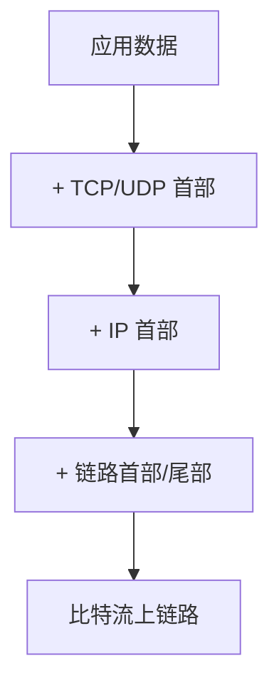

# TCP/IP 协议栈：分层、尽力而为与端到端可靠

> 应用数据不会「直接飞到对端」。它进入协议栈后逐层封装，再以比特流送上链路；对端再逐层剥开。IP 只做尽力而为的无连接投递；端到端的可靠、排序与流量控制，主要由传输层（尤其是 TCP）补上。跨网络时，数据报按逐跳转发前进，而可达性本身由控制面协议在自治系统内外交换。
>
> 本文依据 IETF RFC、部署实践与关键论文整理 TCP/IP 栈分工。可与本库 [14](./14-internet-history-chronicle.md)（谁定义协议）、[16](./16-http-protocol-chronicle.md)（HTTP 如何叠在传输之上）、[11](./11-information-theory-chronicle.md)（可靠信道与冗余）、[27](../20-architecture/27-mqtt-over-quic-treatise.md)（换到 QUIC 时语义不变）对照：本文写**栈如何分工与分组如何跨网前进**；16 写应用合同如何换代。

先给一个直接答案：

> **TCP/IP 教学上常作四层：链路 → 网络 → 传输 → 应用。** IP 只做尽力而为的无连接投递；可靠、排序与流量控制主要由 TCP 等传输层补上。链路 MTU / 路径 MTU 约束分组尺寸，分片宜避免。ICMP 承载差错与诊断。跨网靠**逐跳转发**与**最长前缀匹配**；域内常用 OSPF 等 IGP 交换拓扑，域间用 **BGP** 在自治系统之间交换可达性与策略。拥塞控制从 Jacobson 的慢启动演进到默认 **CUBIC** 与可选 **BBR**；丢失恢复常配 **SACK**，并可选用 **ECN**。工程上，POSIX socket 是协议栈门面；收包则走网卡 DMA → 硬中断调度 → 软中断 / NAPI → 协议栈解复用 → 接收队列 → 唤醒 → `recv`。

**10-chronicle 位置：** [14](./14-internet-history-chronicle.md) 写互联网权力与入口；[16](./16-http-protocol-chronicle.md) 写 HTTP 代际。本文写二者底下的**传输与网络层合同**，含跨网转发 / 路由交换，并下探到 Linux 上常见的 socket / 收包实现读法。

## 摘要

TCP/IP 教学上常作四层：链路层处理介质与帧；网络层负责分组在互联网络中的活动（IP、ICMP、IGMP）以及跨网可达性；传输层为两台主机上的应用提供端到端通信（TCP、UDP）；应用层处理具体业务协议。数据下行时每层增加首部，上行时剥除。IP 提供 best-effort、无连接的数据报服务（RFC 791）。主机选路通常是「直连则直送，否则交默认路由器」；路由器按最长前缀匹配做逐跳转发，控制面用 IGP（如 OSPF）与 BGP 填充转发表。当代寻址以 **CIDR** 为主（RFC 4632）。ICMP 携带差错与诊断（RFC 792）。以太网经典 MTU 为 1500；分片宜避免（RFC 8900）。UDP 为轻量数据报；TCP 提供可靠字节流，并以窗口、SACK、CUBIC / BBR 等适应网络。实现侧：`listen` / `accept` 与收包流水线（DMA / NAPI）见 §10–§11。全文按「分层与封装 → 网络层与跨网交换 → 传输层 → socket 与收包」展开。

**关键词：** TCP/IP；四层模型；IP；ICMP；UDP；TCP；MTU；CIDR；最长前缀匹配；IGP；OSPF；BGP；自治系统；滑动窗口；SACK；CUBIC；BBR；socket；NAPI

---

## 目录

- [摘要](#摘要)

**上篇 · 分层与链路**

1. [读法与术语](#1-读法与术语)
    - [1.1 术语对照](#11-术语对照)
    - [1.2 边界](#12-边界)
2. [四层模型与封装](#2-四层模型与封装)
3. [链路层：ARP、环回与 MTU](#3-链路层arp环回与-mtu)
    - [3.1 ARP 与链路层职责](#31-arp-与链路层职责)
    - [3.2 环回接口](#32-环回接口)
    - [3.3 MTU 与路径 MTU](#33-mtu-与路径-mtu)

**中篇 · 网络层**

4. [IP：不可靠、无连接](#4-ip不可靠无连接)
5. [路由、子网与跨网交换](#5-路由子网与跨网交换)
    - [5.1 主机选路与逐跳转发](#51-主机选路与逐跳转发)
    - [5.2 子网与 CIDR](#52-子网与-cidr)
    - [5.3 跨网：控制面与转发面](#53-跨网控制面与转发面)
    - [5.4 域内 IGP 与域间 BGP](#54-域内-igp-与域间-bgp)
6. [ICMP、Ping 与 Traceroute](#6-icmpping-与-traceroute)

**下篇 · 传输层**

7. [UDP 与 IP 分片](#7-udp-与-ip-分片)
8. [TCP：可靠字节流](#8-tcp可靠字节流)
9. [流量控制、拥塞与重传](#9-流量控制拥塞与重传)
    - [9.1 滑动窗口与流量控制](#91-滑动窗口与流量控制)
    - [9.2 慢启动与拥塞窗口](#92-慢启动与拥塞窗口)
    - [9.3 定时器、快速重传与 SACK](#93-定时器快速重传与-sack)
    - [9.4 当代拥塞控制：CUBIC、BBR 与 ECN](#94-当代拥塞控制cubicbbr-与-ecn)

**实现篇 · socket 与收包**

10. [Socket API：从调用到内核动作](#10-socket-api从调用到内核动作)
    - [10.1 socket / bind](#101-socket--bind)
    - [10.2 listen、三次握手与 backlog](#102-listen三次握手与-backlog)
    - [10.3 accept、send / recv 与 close](#103-acceptsend--recv-与-close)
11. [收包路径：从网卡到 recv](#11-收包路径从网卡到-recv)
    - [11.1 总路线](#111-总路线)
    - [11.2 DMA、硬中断与 NAPI](#112-dma硬中断与-napi)
    - [11.3 协议栈、接收队列与唤醒](#113-协议栈接收队列与唤醒)
12. [收束](#12-收束)
13. [本章要点](#13-本章要点)
14. [参考文献](#14-参考文献)

读法提示：先分清「IP 尽力而为」与「TCP 端到端可靠」；再分清「逐跳转发」与「控制面交换可达性」；再把链路 MTU / 路径 MTU、经典 Reno 与今日 CUBIC / BBR 叠图；最后用 §10–§11 接到 socket / 收包实现。HTTP / QUIC 见 [16](./16-http-protocol-chronicle.md)。


---

## 1. 读法与术语

全文只钉一条因果链：

> **分层封装 → IP 尽力投递 → 传输层（可选）补可靠与复用 →（实现上）socket 门面与收包流水线 → 应用看到字节流或数据报。**

后文按四段展开；每节末用「所以 · 边界」收住该层职责：

| 段 | 章节 | 回答的问题 |
| -- | ---- | ---------- |
| **分层与链路** | §2–§3 | 数据如何封装？下一跳如何上介质？MTU 如何约束？ |
| **网络层** | §4–§6 | IP 承诺什么？如何逐跳转发？跨网如何交换可达性？ICMP 如何诊断？ |
| **传输层** | §7–§9 | UDP / TCP 各是什么合同？窗口与拥塞如何演进？ |
| **实现** | §10–§11 | socket 调用对应哪些内核动作？一帧如何走到 `recv`？ |

读旧笔记时最常见的错位有五处：把「TCP/IP」整族名当成「IP 已可靠」；把单跳 MTU 当成整条路径能力；把 Reno 初值当成今日栈默认；把「路由」当成源端已知全路径；把 `accept` / `recv` 当成用户态在做握手或直接读网卡。

### 1.1 术语对照

| 术语 | 一句话 |
| ---- | ------ |
| **链路层** | 设备驱动与网卡；帧与介质细节；IPv4 常含 ARP，IPv6 对应 NDP |
| **网络层** | 分组在网络间的活动；IP / ICMP / IGMP；跨网转发与可达性 |
| **传输层** | 主机间端到端；TCP（可靠字节流）/ UDP（数据报） |
| **应用层** | 具体协议：HTTP、DNS、SMTP… |
| **转发 / 路由** | 转发：按表送下一跳；路由：控制面计算并安装那些表项 |
| **AS（自治系统）** | 统一管理下的路由器集合；域内用 IGP，域间用 BGP |
| **最长前缀匹配** | 目的地址命中多条前缀时，选前缀最长（最具体）的那条 |
| **MTU** | 链路层最大传输单元；以太网常见 1500 字节 |
| **路径 MTU** | 源到目的路径上各跳 MTU 的最小值 |
| **分片** | IP 数据报超过出口 MTU 且允许分片时切成多片；目的端重组 |
| **ICMP** | Internet 控制报文协议；差错与诊断，封装在 IP 内 |
| **滑动窗口** | TCP 用通告窗口限制发送方未确认数据量 |
| **拥塞窗口（cwnd）** | 发送方对网络拥塞的估计上限；与通告窗口取小 |
| **SACK** | 选择性确认；告知已收到的非连续块，减少盲目重传 |
| **CUBIC / BBR** | 当代常见拥塞控制：损失驱动 vs 瓶颈带宽/时延模型 |
| **TCB / `struct sock`** | 连接控制块：状态、缓冲、窗口等（教学名 TCB；Linux 常见为 sock） |
| **SYN 队列 / accept 队列** | 半连接 vs 已完成三次握手、待 `accept` 的连接 |
| **NAPI** | Linux 网络事件处理：硬中断调度，软中断里按 budget 批量 poll |

### 1.2 边界

1. **教学以 IPv4 合同与机制为主，§5.3–§5.4 / §7 / §9.4 补跨网交换与当代拥塞共识；§10–§11 以 Linux 常见实现为读法。** IPv6 仅在分片与邻居发现处对照；完整 BGP/OSPF 配置与策略工程另册。QUIC 见 [16](./16-http-protocol-chronicle.md) / [27](../20-architecture/27-mqtt-over-quic-treatise.md)。  
2. **五类地址是历史模型。** 当代互联网路由以 CIDR 前缀为主（§5.2）。  
3. **RARP 已基本退出。** 地址配置今日常见 DHCP；链路层职责以 ARP / NDP 为主。  
4. **不是报文字段百科，也不是路由器 CLI 手册。** 首部字段与 sysctl 择要；跨网交换给合同级结论。

---

## 2. 四层模型与封装

TCP/IP 通常被看作**四层**协议族。与 OSI 七层对照时，教学上常把会话层与表示层并入应用层，把物理层并入链路层——层数不同，并不改变「端到端可靠主要在传输层」这一分工。

| 层 | 职责 | 代表协议 |
| -- | ---- | -------- |
| **应用层** | 特定应用语义 | HTTP、DNS、FTP、SMTP… |
| **传输层** | 端到端通信与（可选）可靠 | TCP、UDP |
| **网络层** | 分组在网络中的活动、选路与跨网可达性 | IP、ICMP、IGMP；（控制面）OSPF、BGP… |
| **链路层** | 介质与帧；驱动与网卡 | Ethernet、PPP…；ARP / NDP |

当应用经 TCP 发送数据时，数据进入协议栈，**逐层增加首部**，最终成为比特流送上网络；接收端反向剥头。同一主机上，TCP 端口空间与 UDP 端口空间相互独立——端口号由各自传输协议解释，不能假定「端口 53 在 TCP 与 UDP 上是同一个服务」。[^rfc768][^rfc9293]



> **所以 · 边界在哪：** 「TCP/IP」是整族名字；IP 在网络层，TCP/UDP 在传输层。可靠与否，首先看你选了谁——不是协议族名称本身自带可靠。

---

## 3. 链路层：ARP、环回与 MTU

链路层回答的是：网络层已经决定「下一跳的 IP」，如何把它真正送到本网段的下一跳接口上。尺寸约束（MTU）也在这一层显现，并向上影响 IP 是否需要分片。

### 3.1 ARP 与链路层职责

链路层至少要服务：为 IP 收发数据报；在以太网 IPv4 上通过 **ARP** 把下一跳 IP 解析为 48 位 MAC（RFC 826）；历史上亦曾服务 RARP，今日地址配置多由 DHCP 等完成。[^rfc826]

IPv6 侧对应能力由 **Neighbor Discovery（NDP，RFC 4861）** 承担：它合并了 IPv4 中 ARP、路由器发现与重定向等角色。[^rfc4861] 合同未变——「IP → 本链路下一跳硬件地址」——实现形态随 IPv6 换皮。

### 3.2 环回接口

**环回接口**允许本机客户与服务器经 TCP/IP 通信。地址 `127.0.0.1`（名 `localhost`）指向该接口。目的为环回时，传输层与网络层过程照常走完；数据报离开网络层后，由环回「链路」送回本机 IP 输入队列——环回被当作网络层之下的一种链路，从而简化设计：本机通信不必绕开协议栈另写一套路径。

### 3.3 MTU 与路径 MTU

**MTU（Maximum Transmission Unit）** 是链路层对帧载荷的上限。经典以太网 MTU 为 **1500** 字节（RFC 1191 常见 MTU 表亦列此值）。[^rfc1191] 若 IP 数据报长度超过出口链路 MTU，且未禁止分片，则 IP 层可以把数据报切成适合该 MTU 的片。[^rfc791]

路径上各网络的链路 MTU 可能不同。源到目的路径上的最小 MTU 称为**路径 MTU（PMTU）**。双向选路不必对称，故两方向 PMTU 也可不同。[^rfc1191] 经典 **PMTUD** 依赖 DF（Don't Fragment）位与 ICMP「需要分片」反馈：发送方假定路径 MTU、置 DF，过大则路由器丢弃并回报，发送方再下调估计。[^rfc1191] 当 ICMP 被过滤时，这一路径可能失效；**PLPMTUD**（RFC 4821）改由传输层用逐步加大的探测包推断，以降低对 ICMP 的依赖。[^rfc4821]

> **所以 · 边界在哪：** MTU 是单跳约束；PMTU 是整条路径的瓶颈。分片能「塞过去」，但丢失一片往往迫使上层重传整份数据报——故实践上尽量避免分片，而以 PMTUD / PLPMTUD 让发送尺寸适配路径。

---

## 4. IP：不可靠、无连接

IP 是 TCP/IP 协议族中最核心的协议：TCP、UDP、ICMP、IGMP 的数据都以 **IP 数据报** 格式传输。[^rfc791] 它的合同可以浓缩为两个词：

| 性质 | 含义 |
| ---- | ---- |
| **不可靠（best-effort）** | 不保证数据报成功到达；出错时常丢弃，并可能向源发 ICMP |
| **无连接** | 不维护后续数据报的会话状态；每份数据报独立处理，可能乱序、重复 |

普通 IPv4 首部（无选项）长 **20** 字节。总长度字段 16 位，故 IPv4 数据报理论最大长度为 **65535** 字节。选项字段（记录路由、时间戳等）可变长，现今少用。[^rfc791]

IP 首部中的 **DF** 位禁止中间节点再分片：置位后若仍超过下一跳 MTU，路由器应丢弃并（宜）返回 ICMP，而不是偷偷切开——这正是 PMTUD 的工作前提。[^rfc791][^rfc1191]

> **所以 · 边界在哪：** IP 负责「尽力送到」。「一定送到、按序、不重复」不是 IP 的合同——那是 TCP 等上层的合同。把丢包或乱序一律归咎于「IP 坏了」，是读错了层。

---

## 5. 路由、子网与跨网交换

仅有「本机路由表」不足以解释互联网：分组如何越过多个网络、路由器之间如何知道该把流量送往何方，才是跨网交换的核心。先看主机与逐跳转发，再看控制面如何填充转发表。

### 5.1 主机选路与逐跳转发

对主机而言，规则可以很简单：若目的与本机直连或同共享网络，则直接投递；否则把数据报交给**默认路由器**，由路由器转发。IP 模块可配置为主机或路由器。若数据报来自某接口，且目的是本机地址或适当的广播地址，则交给协议字段所指模块；否则，在路由器模式下转发，在主机模式下丢弃。[^rfc791]

选路与转发都是**逐跳**的：节点一般不知道到目的的完整路径，只决定下一跳。概念上的查找顺序为：主机路由（完全匹配）→ 网络 / 前缀路由 → 默认路由；皆失败则无法传送。路由器转发时，对目的地址做**最长前缀匹配（LPM）**：多条前缀同时命中时，选前缀最长、因而最具体的那条，再送往对应下一跳与出口。[^rfc4632] 每一跳离开本链路前，仍须把下一跳 IP 解析为链路层地址（IPv4 用 ARP，IPv6 用 NDP，§3.1）——跨网前进的是 IP 数据报，换的是逐跳的帧封装。

### 5.2 子网与 CIDR

**子网编址**把「网络号 + 主机号」中的主机号再分为子网号与主机号；**子网掩码**（32 位）标出哪些位属于网络/子网、哪些属于主机。有了地址与掩码，主机可判断目的是本子网、本网其他子网，或其他网络。

早期教材中的 **A/B/C/D/E 五类地址**是历史分类。当代全球 IPv4 路由以 **CIDR（无类域间路由）** 为主：前缀长度显式携带（如 `/24`），不再从地址高位比特推断「类」，并支持路由聚合以压缩表项。[^rfc4632]

### 5.3 跨网：控制面与转发面

跨网络交换要把两件不同的事分开：

| 平面 | 回答的问题 | 典型产物 |
| ---- | ---------- | -------- |
| **转发面（数据面）** | 这个到达的分组下一跳往哪走？ | 转发表 / FIB；按 LPM 查目的地址 |
| **控制面** | 表项从何而来？拓扑与策略如何传播？ | 路由协议会话、RIB；再下发到 FIB |

IP 数据报在路径上**不携带完整路由**；每一跳独立查表转发。控制面协议在后台交换可达性，使各路由器的转发表保持一致（或按策略有意不一致）。TTL 每跳减一，耗尽则丢弃并常回 ICMP，既防环路也支持 Traceroute（§6）。

```text
  主机 A ──▶ 路由器 R1 ──▶ 路由器 R2 ──▶ … ──▶ 主机 B
           每跳：LPM 查 FIB → 改写链路帧 → 送下一跳
  控制面（并行）：IGP / BGP 交换前缀与下一跳，写入 RIB → FIB
```

### 5.4 域内 IGP 与域间 BGP

互联网在管理上划分为**自治系统（AS）**：在统一技术管理下、内部使用共同 IGP 与度量、对外使用域间协议与其他 AS 交换可达性的路由器集合。[^rfc4271]

**域内（Intra-AS）** 常用链路状态型 IGP，例如 **OSPF**（RFC 2328）：路由器洪泛链路状态，各节点计算最短路径树，从而得到区内转发路径；多区域时经骨干区汇总，以控制规模。[^rfc2328] 其目标是在单一管理域内快速收敛、共享拓扑视图。

**域间（Inter-AS）** 的事实标准是 **BGP-4**（RFC 4271）：BGP 发言者交换网络可达性前缀，并携带所经 **AS_PATH** 等信息，用以构图、防环，并在 AS 级实施策略（选路、聚合、过滤）。[^rfc4271] BGP 跑在 TCP（端口 179）之上；它支持 CIDR 前缀通告，并允许路由与 AS 路径聚合。主机通常看不到 BGP——边缘路由器学到前缀后，主机仍多半只配一个默认网关。

> **所以 · 边界在哪：** 数据报跨网靠逐跳 LPM 转发；「知道往哪走」靠控制面（IGP / BGP）事先把表填好。源主机既不持有全球路由表，也不在每个分组里携带全路径——这正是「网络之网络」可扩展的关键抽象。

---

## 6. ICMP、Ping 与 Traceroute

**ICMP（Internet Control Message Protocol）** 是 IP 层的组成部分，传递差错报文及其他需注意的信息；ICMP 报文封装在 IP 数据报内传输。[^rfc792] 一条重要规则：ICMP **差错报文**必须包含引发差错的数据报的 IP 首部，以及紧随其后的至少 **8 字节**（64 比特）载荷——对 UDP/TCP，这通常盖住端口号，使接收方可把差错关联到具体进程。[^rfc792]

**Ping** 发送 ICMP 回显请求并等待回显应答，用于测试可达性，并可估算往返时延（常把时间戳放在 ICMP 数据区）。多数实现在内核中直接支持回显服务，不必另起用户态服务器。

**Traceroute** 用于观察数据报经过的路由器：先发 TTL=1 的探测，第一跳路由器将 TTL 减至 0 后丢弃并返回 ICMP 超时，从而暴露第一跳；再发 TTL=2、3…直至到达目的。经典实现向目的发 UDP，并选用极少使用的目的端口，使目的返回「端口不可达」，以便区分「途中超时」与「已到达」。亦有基于 ICMP 或 TCP 的变体；原理仍是控制 TTL 并解读 ICMP——它观测的正是 §5 所述逐跳路径上的路由器身份。

> **所以 · 边界在哪：** ICMP 不是「另一套用户数据通道」，而是控制与诊断平面。过滤 ICMP 可能让经典 PMTUD 与 Traceroute 失效——这往往是运维策略选择，不是协议「可有可无」。

---

## 7. UDP 与 IP 分片

网络层把「尽力投递」定了下来之后，传输层提供两种常见合同：UDP 几乎原样暴露数据报语义；TCP 则在其上叠可靠字节流。先看更薄的一侧，并说明为何「能分片」不等于「应该分片」。

**UDP** 是简单的面向数据报的传输层协议。应用必须关心数据报长度；超过路径能力时，可能触发 IP 分片。UDP 首部含源/目的端口、长度与校验和；TCP 与 UDP 端口号空间相互独立。[^rfc768]

IPv4 总长度上限 65535；减去至少 20 字节 IP 首部与 8 字节 UDP 首部，UDP 用户数据理论上限为 **65507** 字节——这是长度字段极限，不是推荐发送尺寸。实践上，超过路径 MTU 的 UDP 数据报极易触发分片或丢弃，应用层通常应主动控制报文大小。

**IP 分片**在发送端或中间路由器上，当数据报超过出口 MTU 且允许分片时发生。片在**目的端**才重组，以使分片对传输层尽量透明。标识字段在分片时复制到各片；「更多分片」（MF）比特除末片外置 1；片偏移给出该片在原始数据报中的位置。[^rfc791] IP 本身无超时重传：丢一片往往意味着上层重传整份数据报。传输层首部通常只出现在第一片——中间设备若只看后续片，可能看不到端口信息。

产业与研究侧对分片的态度早已明确。Kent 与 Mogul（SIGCOMM 1987）论证：跨网分片在性能与可靠性上代价高昂，应尽量避免。[^kent87] IETF 在 RFC 8900（*IP Fragmentation Considered Fragile*）中进一步归纳：分片引入脆弱性——黑洞、中间盒状态、安全过滤等——并建议应用与传输层主动适配路径尺寸，而非依赖分片。[^rfc8900] **IPv6** 走得更远：中间路由器**不得**再分片；过大则丢弃并回 ICMPv6 Packet Too Big；仅源端可选用 Fragment 首部，且规范亦鼓励能调包大小的应用避免依赖分片（RFC 8200）。[^rfc8200]

> **所以 · 边界在哪：** 能分片不等于应该分片。发送端应用与 PMTUD / PLPMTUD 的目标，是尽量让每份数据报适合路径 MTU。IPv4 允许中间路由器分片，但是合法能力，不是当代推荐策略。

---

## 8. TCP：可靠字节流

TCP 提供**面向连接、可靠的字节流**服务。相对 UDP，它在不可靠的 IP 之上补上了一组端到端机制：[^rfc9293]

| 机制 | 作用 |
| ---- | ---- |
| 连接建立 | 三次握手协商序号与选项（窗口扩大、SACK 许可、时间戳等） |
| 分段 | 把应用数据切成合适的段发送 |
| 定时器 + 重传 | 发送后等待 ACK；超时则重发 |
| 确认 | 收到数据后向对端确认（累计 ACK；可选 SACK） |
| 首部与数据校验和 | 检测差错 |
| 排序 | 失序到达时重排再交给应用 |
| 丢弃重复 | 处理重传副本 |
| 流量控制 | 接收方通告窗口，限制发送方 |

**序号**标识发送字节流中该段第一个数据字节的位置；**确认号**是接收方期望收到的下一个字节序号（累计确认：确认号之前的数据都已收到）。[^rfc9293] 窗口字段本身 16 位，经典最大通告窗口为 65535 字节；**窗口扩大（Window Scale）选项**（现行见 RFC 7323）允许在连接建立时协商比例因子，以支持更大的接收窗口——高带宽时延积（BDP）路径上这是吞吐上限的关键约束。[^rfc7323]

**SACK（Selective Acknowledgment，RFC 2018）** 不改变累计确认号的含义，但允许接收方用选项报告已收到的非连续数据块，使发送方只重传真正缺失的段，而不是从缺口起整段重刷。[^rfc2018] 现代栈几乎普遍协商 SACK；没有它，多丢包场景下的恢复会明显变钝。

> **所以 · 边界在哪：** TCP 合同是字节流，不是「保持应用消息边界」。消息边界若需要，由应用协议自己定（HTTP/2 帧、长度前缀、gRPC 等）。把「一次 `write` 对应一次 `read`」当成 TCP 保证，是常见误读。

---

## 9. 流量控制、拥塞与重传

可靠字节流还不够：发送方既不能压垮接收方，也不能压垮共享网络。前者靠通告窗口，后者靠拥塞控制；丢包后的恢复则靠超时重传、快速重传与 SACK。1988 年 Jacobson 针对 Internet「拥塞崩溃」提出的慢启动与动态窗口调节，仍是今日叙述的起点；默认算法与信号通道则已演进。[^jacobson88]

### 9.1 滑动窗口与流量控制

TCP 用滑动窗口做流量控制：发送方在等待确认前可连续发送多个段，从而提高吞吐。ACK **累计**：确认号表示「此前字节都已正确收到」。应用从接收缓冲读走数据后，接收方可发送仅推进窗口右沿的 ACK（窗口更新），而不必确认新数据。动态性可记为：[^rfc9293]

- 发送方不必一次发满整个窗口；  
- ACK 确认数据并把窗口向右推进；  
- 窗口可以缩小，但右沿不能向左回缩（经典规则）；  
- 接收方不必等窗口填满再发 ACK。

### 9.2 慢启动与拥塞窗口

TCP 还实现**慢启动**：新分组进入网络的速率，应与返回 ACK 的速率相称——Jacobson 所谓「分组守恒」：稳态下，旧分组离开网络后才注入新分组。[^jacobson88] 发送方维护**拥塞窗口（cwnd）**；经典叙述中 cwnd 初值为 1 个段，每收到一个 ACK 增加约一个段。发送上限取 **min(拥塞窗口, 通告窗口)**——前者是发送方对网络的估计，后者是接收方的流量控制。[^rfc5681]

> **纠偏：** 当代栈的初始窗口（IW）往往大于 1 个段。RFC 6928 将 IW 上界实验性地提高到约 10 个段（`min(10×MSS, max(2×MSS, 14600))` 字节）；Linux 自 2.6.39 起默认采用更大的 IW，野外测量亦显示部署并不均一。[^rfc6928] 慢启动「从小开始探测」的思想仍在，具体初值以实现与 RFC 为准。

### 9.3 定时器、快速重传与 SACK

每条连接上 TCP 管理多类定时器，经典四分法为：重传、坚持（persist，保持窗口探测）、保活（keepalive）、2MSL（TIME_WAIT）。[^rfc9293] 超时重传常按**指数退避**拉长间隔，直至上限；多次失败后可放弃并复位连接。

往返时延（RTT）估计是超时计算的核心：网络负载变化时，重传超时（RTO）应跟随变化。[^rfc6298]

收到失序段时，接收方应立即 ACK（可能产生重复 ACK），以便发送方察觉。若连续收到 **3 个或以上**重复 ACK，发送方很可判定有段丢失，于是**快速重传**——不必等重传定时器超时。[^rfc5681] 在已协商 SACK 时，重复 ACK 可携带缺口两侧已收块的信息，发送方据此精确定位重传对象，显著改善多丢包与乱序并存时的恢复效率。[^rfc2018]

### 9.4 当代拥塞控制：CUBIC、BBR 与 ECN

RFC 5681 叙述的 Reno 族（慢启动 → 拥塞避免 → 快速重传 / 快速恢复）仍是理解其他算法的坐标系。产业默认值已前移：

| 族 | 核心信号 | 要点 | 地位（约略） |
| -- | -------- | ---- | ------------ |
| **Reno / NewReno** | 丢包 ≈ 拥塞 | AIMD；教学与 RFC 5681 基线 | 基线，少作默认 |
| **CUBIC** | 丢包 | 以三次函数增长窗口，改善高速长肥管道上的可扩展性与稳定性 | Linux / Windows / Apple 等默认 TCP CC（RFC 9438）[^rfc9438] |
| **BBR** | 瓶颈带宽 + 最小 RTT 模型 | 按估计带宽 pacing，使在途量接近 BDP，减轻 bufferbloat；浅缓冲 / 随机丢包时吞吐更稳 | Google 提出并大规模部署；IETF 仍在推进规范（BBRv3 草案）[^bbr16] |

Cardwell 等（ACM *Queue* 2016）指出：纯损失驱动在深缓冲上会堆满队列（bufferbloat），在浅缓冲或随机丢包上又会把「非拥塞丢包」误读成拥塞而压吞吐；BBR 用显式路径模型替代「以丢为信号」。[^bbr16] 与 CUBIC 的公平性随缓冲深度与版本而变，工程选型不能只看「BBR 更快」一句口号。

**ECN（Explicit Congestion Notification，RFC 3168）** 允许路由器在队列将满时标记 IP 首部 CE，而非直接丢包；TCP 端点经 ECE/CWR 协商后据此降速。[^rfc3168] 它把「拥塞信号」从「必须丢包」中解耦出来，常与 AQM（如 RED / CoDel）配合；部署仍受中间盒与路径支持约束。

> **所以 · 边界在哪：** 通告窗口防止压垮接收方；拥塞窗口（或 BBR 的在途量 / pacing）防止压垮网络；快速重传与 SACK 减少「干等超时」的代价。HTTP/2 仍跑在单条 TCP 字节流上时，丢包可拖住全连接——这正是 [16](./16-http-protocol-chronicle.md) 转向 QUIC（流级恢复、可自带拥塞控制）的动机之一。

---

## 10. Socket API：从调用到内核动作

§2–§9 写的是协议**合同**；合同要被进程使用，还需一层操作系统接口。POSIX 路径上的 `socket` → `bind` → `listen` → `accept` → `recv` / `send` → `close`，正是合同暴露给用户态的门面：每个调用背后是文件描述符、传输控制块（教学名 TCB；Linux 上常见为 `struct sock`）与协议栈状态机。本节以 Linux / POSIX 常见实现说明职责划分——符号与 sysctl 随版本漂移，合同级结论相对稳定。

### 10.1 socket / bind

```c
int sockfd = socket(AF_INET, SOCK_STREAM, 0);
bind(sockfd, (struct sockaddr *)&addr, sizeof(addr));
```

教学上常把 socket 理解为「插 + 座」：**插**是进程可见的文件描述符（网络 I/O 经 VFS 文件接口）；**座**是内核中的连接控制块，承载状态、缓冲与窗口账本。`socket()` 分配 fd，并创建尚处未绑定 / 未连接的控制块；深层收发缓冲往往延后到真正需要时再分配，以免空套接字占满内存。

`bind()` 把本地 **IP + 端口** 写入该控制块。已建立 TCP 连接的定位信息常称**五元组**（源 / 目的 IP、源 / 目的端口、协议）；协议已定为 TCP 时，解复用也可说成按**四元组**哈希到 `struct sock`。服务端通常须 `bind` 固定端口以便被发现；客户端可不显式 `bind`，由内核在 `connect` 时分配临时端口。

### 10.2 listen、三次握手与 backlog

```c
listen(sockfd, backlog);
```

对 TCP 而言，`listen()` 将套接字标为**被动打开**（进入 `LISTEN`），并准备承接入站请求。三次握手发生在客户端 `connect` 与服务端**协议栈**之间：`accept` 并不在用户态「执行握手」，只从已完成握手的队列取出连接。[^rfc9293]

```text
客户端                              服务端 (LISTEN)
  │  ① SYN, seq=ISN_c                 │
  │ ───────────────────────────────>  │
  │  ② SYN+ACK, seq=ISN_s, ack=ISN_c+1│
  │ <───────────────────────────────  │
  │  ③ ACK, ack=ISN_s+1               │
  │ ───────────────────────────────>  │  → ESTABLISHED，入 accept 队列
```

初始序号（ISN）须谨慎选取。现行规范强调三次握手的首要理由是：**防止旧重复 SYN 造成错误连接，并完成双方序号同步**——流行说法中单独强调「确认服务端接收能力」，并不是 RFC 的主论证。[^rfc9293]

内核侧通常区分两类队列（名称随文献而异）：[^cloudflare-syn]

| 队列 | 内容 | 应用可见性 |
| ---- | ---- | ---------- |
| **SYN 队列（半连接）** | 已收 SYN、握手尚未完成 | 应用通常不可见 |
| **accept 队列（全连接）** | 三次握手完成、待 `accept` | `accept` 从此取出 |

Linux 自 2.2 起，`listen(2)` 的 `backlog` 主要限制**已完成、待 accept** 的队列长度；未完成请求另受 `tcp_max_syn_backlog` 等约束，并整体被 `net.core.somaxconn` 截断。[^listen2] 当代内核上，应用传入的 backlog 也会影响 SYN 侧容量，精确上限以现行 man page 与发行版为准。队列过短，合法突发会被拒绝或依赖重传；过长，则在 `accept` 跟不上时堆积内存与尾延迟。

SYN 泛洪用大量伪造源地址的 SYN 占满半连接资源，使合法用户无法建连。SYN cookies（Bernstein / Schenk 等提出的思路）在队列溢出时把必要状态编码进 SYN+ACK 序号，合法客户端回 ACK 后再重建连接，从而不必为每个半连接占槽。[^syncookies] Linux 文档明确：cookies 是**最后手段**，会削弱部分 TCP 扩展，**不应**用来掩盖合法过载；过载应调整 backlog、`tcp_max_syn_backlog`、`tcp_abort_on_overflow` 等。[^tcp7]

### 10.3 accept、send / recv 与 close

`accept()` 从 accept 队列取出已处 `ESTABLISHED` 的连接，建立（或关联）新的 fd → 控制块映射；监听套接字本身仍留在 `LISTEN`。面试中常问的「accept 用 LT 还是 ET」，问的是**监听 fd 在 epoll 上的就绪通知模式**，并非 `accept` 另有两套内核实现：水平触发（LT）在队列非空时持续可读，不易漏连接；边缘触发（ET）须读至 `EAGAIN`，否则可能饿死后续请求。选型属于 I/O 多路复用工程，不是 TCP 状态机本身。

`send`（或 `write`）把用户缓冲拷入内核发送路径；段如何合并、何时上线，由 TCP（Nagle、通告窗口、pacing、拥塞控制等）决定——多次 `send` 不必对应同样次数的段。`recv` 从该连接的**接收队列**取已按序交付的字节：返回长度可小于请求，也可一次跨过多次 `send`，因为 TCP 是字节流、**不保留消息边界**（§8）。对方优雅关闭后，`recv` 返回 **0**，表示读到 FIN 之后的结束语义。这里再钉一句常见误读：滑动窗口管的是流量控制（对方还能收多少），**并不**单独「保证不丢失」；可靠性来自确认、重传、校验与排序（§8–§9）。

`close` 既回收 fd，也驱动连接终止。主动关闭方发出 FIN；对端 ACK 后，若对端亦关闭则再发 FIN，最后以 ACK 结束（经典四次挥手；中间两步有时可合并）。主动关闭方通常进入 **TIME_WAIT**，停留约 **2×MSL**，以便旧重复段消亡，并覆盖最后 ACK 丢失、对端重传 FIN 的情形。[^rfc9293][^rfc1337] 「双方同时 `close` → 双方都进 TIME_WAIT」对应同时关闭路径；服务端若主动关闭大量短连接，同样会在本端看到 TIME_WAIT——不能仅用「服务端没关」解释堆积。

> **所以 · 边界在哪：** 用户态 API 安排 fd 与缓冲出入；握手、段调度、重传与多数队列策略在内核。建连慢未必是 `accept`；「粘包」也不是 TCP 缺陷，而是字节流合同下应用层的分帧责任。

---

## 11. 收包路径：从网卡到 recv

合同说「TCP 把字节交给应用」；实现上，字节须先从网线进入内核。Linux 经典收包路径是一条可分层排查的流水线：把「丢包 / 延迟」拆到正确的站，才谈得上定责。[^napi-doc]

### 11.1 总路线

记忆口诀可收束为：

> **DMA 入库 → 硬中断调度 → NAPI 批量收 → 协议栈解复用 → 入队并更新窗口 → 唤醒等待者 → `recv` 拷贝。**

| 站 | 执行者 | 动作 |
| -- | ------ | ---- |
| 1 | 网卡 + DMA | 将帧写入预置 RX 环形缓冲（描述符记账） |
| 2 | 硬中断 | 登记有工作、抑制进一步收包中断、调度 NAPI / 软中断 |
| 3 | 软中断 + NAPI | 按 budget 批量取包，构造 `sk_buff` |
| 4 | 协议栈 | 剥以太网 / IP / TCP 头；校验、查连接、推进状态机 |
| 5 | socket 层 | 按序数据入接收队列，更新 rwnd |
| 6 | 等待队列 | 唤醒阻塞于 `recv` / `epoll_wait` 的任务 |
| 7 | `recv` | 内核 → 用户态拷贝，返回字节数 |

现代网卡普遍支持 **RSS（Receive Side Scaling）**：多个 RX 队列映射到不同 CPU，使收包在硬件侧即可并行——高并发主机多核收包的根基在此。

### 11.2 DMA、硬中断与 NAPI

第一站的关键事实是：把帧搬进内存的主要不是 CPU，而是 **DMA**。网卡写入事先约定的环形缓冲槽位，CPU 事后依据描述符读取；硬中断只起调度作用，不宜在关中断上下文跑完整协议栈。若每包都在硬中断里拆完，中断风暴会占满 CPU，反而加剧丢包。网卡侧还可做**中断合并（interrupt coalescing）**：攒若干包或等待一小段时间再请求 CPU。[^napi-doc]

真正的收包引擎在软中断与 **NAPI**。收包路径挂在 `NET_RX_SOFTIRQ` 上；被调度后调用驱动的 `poll`：在预算（budget）内尽量清空环上已完成描述符，再让出 CPU，以免单一设备饿死其他工作——即「一次中断、批量收割」。预算用尽仍有积压时，工作可落到 `ksoftirqd` 等路径继续。[^napi-doc] Linux 上可用 `/proc/net/softnet_stat` 分 CPU 观察：处理包数、dropped、time_squeeze（预算耗尽被迫退出）等；dropped 持续上升，说明软中断侧已经跟不上。

### 11.3 协议栈、接收队列与唤醒

帧离开环形缓冲后，沿链路层 → IP → TCP 上行。TCP 输入依据（源 IP、源端口、目的 IP、目的端口）定位连接：同一监听端口能服务海量并发，正因为定位靠整组地址，而非「一端口唯一对应一 socket」。段按序则进入接收队列；乱序则暂存等待；重复则丢弃载荷，但通常仍回 ACK。延迟 ACK 会合并确认以降低开销，代价是交互路径上可能增加数十毫秒量级的时延。

接收队列与 **rwnd** 联动：内核在 ACK 中通告剩余接收空间；应用读得慢会导致队列堆积、窗口收窄、对端减速，极端时新到段被丢弃——现象易被误诊为「网络慢」，根因却常在接收方或过小的 `SO_RCVBUF`。缓冲规模可用 **BDP ≈ 带宽 × RTT** 粗估，并配合窗口扩大选项（§8）。

数据入队后，内核发出可读就绪，唤醒睡在 socket 等待队列上的任务；阻塞 `recv` 与 epoll「可读」事件同源。传统路径上，用户态第一次拥有数据副本，发生在 `recv` 的内核→用户拷贝；此前数据停留在 DMA 缓冲或 `sk_buff` 中。因而常说的「两次拷贝」指：**(1) DMA 进入内核内存；(2) `recv` 进入用户缓冲**。`sendfile`、部分 `io_uring` / zerocopy 路径优化的是用户可见的那一侧拷贝，属后续专题。

排查丢包时，宜按站推进：网卡统计（如 `ethtool -S`）→ `softnet_stat` → `ss -tin`（Recv-Q / rwnd）→ 应用是否及时 `recv`。

> **所以 · 边界在哪：** `recv` 不是「从网卡读」，而是流水线最后一站。慢与丢可能落在环、软中断、协议栈、接收队列或应用本身——先定站，再定责。
---

## 12. 收束

```text
  四层封装
      │
      ▼
  链路 MTU / 环回 / ARP·NDP
      │
      ▼
  IP 尽力而为 + 逐跳 LPM 转发（CIDR）
      │     ╲
      │      控制面：IGP（域内）/ BGP（域间）
      ▼
  ICMP 诊断 ── Ping / Traceroute
      │
      ▼
  UDP 数据报 或 TCP 可靠字节流
      （窗口 · SACK · CUBIC/BBR · ECN）
      │
      ▼
  socket API（listen / accept / recv…）
      │
      ▼
  收包：DMA → 硬中断 → NAPI → 栈 → 队列 → 唤醒 → recv
```

六条主线可以收束为：

1. **分工：** IP 管送达尝试；TCP/UDP 管端到端复用与（TCP）可靠。  
2. **跨网：** 数据面逐跳 LPM 转发；控制面用 IGP / BGP 交换可达性。  
3. **尺寸：** MTU / PMTU 约束分组大小；分片是不得已，不是性能策略（RFC 8900）。  
4. **控制：** 流量控制保护接收方；拥塞控制保护网络；ICMP / ECN 提供反馈与诊断。  
5. **演进：** 合同以 RFC 为准；默认算法随 CUBIC / BBR / SACK 等演进。  
6. **实现：** socket 是门面；握手与多数收发包在内核；丢包排查按 DMA → softirq → 队列 → 应用读速分层。

---

## 13. 本章要点

1. TCP/IP 教学四层：链路、网络、传输、应用；下行加头、上行剥头。  
2. IP：**不可靠、无连接**的 best-effort 数据报服务（RFC 791）。  
3. 主机选路：直连直送，否则默认网关；路由器**逐跳 LPM** 转发；寻址以 **CIDR** 为主。  
4. 跨网：转发面查 FIB；控制面用 **OSPF 等 IGP**（域内）与 **BGP**（域间 / AS）填充可达性。  
5. IPv4 用 ARP，IPv6 用 NDP（RFC 4861）完成「IP → 链路地址」。  
6. 以太网 MTU 常见 1500；路径 MTU 为路径最小跳；尽量避免分片（Kent & Mogul；RFC 8900）；IPv6 禁止中间路由器分片（RFC 8200）。  
7. ICMP 差错带回 IP 首部 + 至少 8 字节载荷；Ping / Traceroute 观测逐跳路径。  
8. UDP：轻量数据报；TCP：连接、确认、重传、排序、滑动窗口（RFC 7323 / RFC 2018）。  
9. 发送上限 ≈ min(cwnd, rwnd)；IW、CUBIC / BBR、ECN 等随 RFC 与实现演进。  
10. `listen` / `accept` 与 backlog、SYN cookies；收包 DMA → NAPI → 解复用 → 唤醒 → `recv`。  
11. 区分「协议合同」「跨网控制面」「用户态 API」三层叙述，避免张冠李戴。

---

## 14. 参考文献

[^jacobson88]: V. Jacobson, *Congestion Avoidance and Control*, Proc. SIGCOMM '88, ACM, 1988. https://doi.org/10.1145/52324.52356 。慢启动、拥塞窗口与「分组守恒」等经典机制的源头论述。

[^kent87]: C. Kent and J. Mogul, *Fragmentation Considered Harmful*, SIGCOMM '87 / DEC WRL Technical Report 87.3, 1987. 论证跨网分片在性能与可靠性上的代价，推动后续 PMTUD 与「避免分片」实践。

[^bbr16]: N. Cardwell, Y. Cheng, C. S. Gunn, S. H. Yeganeh, and V. Jacobson, *BBR: Congestion-Based Congestion Control*, ACM *Queue* 14(5), 2016. https://doi.org/10.1145/3012426.3022184 。以瓶颈带宽与最小 RTT 建模的拥塞控制；对照损失驱动算法的 bufferbloat 与浅缓冲问题。

[^syncookies]: D. J. Bernstein, *SYN cookies*. https://cr.yp.to/syncookies.html 。SYN 泛洪下无状态（或弱状态）握手应答的思路来源；Linux 实现见内核 `syncookies` 与 `tcp(7)`。

[^cloudflare-syn]: M. Majkowski, *SYN packet handling in the wild*, Cloudflare Blog, 2018. https://blog.cloudflare.com/syn-packet-handling-in-the-wild/ 。SYN 队列与 accept 队列的运维向说明及 cookies 计数。

[^listen2]: Linux man-pages, *listen(2)*. https://man7.org/linux/man-pages/man2/listen.2.html 。backlog 与 `somaxconn`；2.2 后语义转向已完成连接队列。

[^tcp7]: Linux man-pages, *tcp(7)*. https://man7.org/linux/man-pages/man7/tcp.7.html 。`tcp_max_syn_backlog`、`tcp_syncookies`（明确 last resort）等。

[^napi-doc]: The Linux Kernel documentation, *NAPI*. https://docs.kernel.org/networking/napi.html 。硬中断调度 NAPI、软中断 poll 与 budget。

[^rfc791]: J. Postel, *Internet Protocol*, RFC 791 / STD 5, 1981. https://www.rfc-editor.org/rfc/rfc791 。IPv4 数据报；不可靠、无连接；分片与重组；DF/MF；总长度字段。

[^rfc792]: J. Postel, *Internet Control Message Protocol*, RFC 792, 1981. https://www.rfc-editor.org/rfc/rfc792 。ICMP 报文；差错报文含原 IP 首部 + 至少 64 比特数据。

[^rfc768]: J. Postel, *User Datagram Protocol*, RFC 768, 1980. https://www.rfc-editor.org/rfc/rfc768 。UDP 数据报服务与首部。

[^rfc826]: D. C. Plummer, *An Ethernet Address Resolution Protocol*, RFC 826, 1982. https://www.rfc-editor.org/rfc/rfc826 。IP 到以太网 MAC 的动态解析。

[^rfc4861]: T. Narten et al., *Neighbor Discovery for IP version 6 (IPv6)*, RFC 4861, 2007. https://www.rfc-editor.org/rfc/rfc4861 。IPv6 邻居发现；对应 IPv4 ARP / 路由器发现等角色。

[^rfc8200]: S. Deering and R. Hinden, *Internet Protocol, Version 6 (IPv6) Specification*, RFC 8200, 2017. https://www.rfc-editor.org/rfc/rfc8200 。IPv6；中间路由器不分片；源端 Fragment 首部；最小链路 MTU 1280。

[^rfc9293]: W. Eddy, Ed., *Transmission Control Protocol (TCP)*, RFC 9293, 2022. https://www.rfc-editor.org/rfc/rfc9293 。现行 TCP 规范；三次握手、TIME-WAIT（2×MSL）等。

[^rfc1337]: R. Braden, *TIME-WAIT Assassination Hazards in TCP*, RFC 1337, 1992. https://www.rfc-editor.org/rfc/rfc1337 。TIME-WAIT 与旧重复段危害。

[^rfc2018]: M. Mathis et al., *TCP Selective Acknowledgment Options*, RFC 2018, 1996. https://www.rfc-editor.org/rfc/rfc2018 。SACK；报告非连续已收块。

[^rfc5681]: M. Allman, V. Paxson, E. Blanton, *TCP Congestion Control*, RFC 5681, 2009. https://www.rfc-editor.org/rfc/rfc5681 。慢启动、拥塞避免、快速重传 / 快速恢复等 Reno 族基线。

[^rfc9438]: L. Xu et al., *CUBIC for Fast and Long-Distance Networks*, RFC 9438, 2023. https://www.rfc-editor.org/rfc/rfc9438 。CUBIC 标准轨规范；Linux / Windows / Apple 等默认 CC 的 IETF 定稿。

[^rfc3168]: K. Ramakrishnan, S. Floyd, D. Black, *The Addition of Explicit Congestion Notification (ECN) to IP*, RFC 3168, 2001. https://www.rfc-editor.org/rfc/rfc3168 。ECN；CE 标记与 TCP ECE/CWR。

[^rfc6298]: V. Paxson et al., *Computing TCP's Retransmission Timer*, RFC 6298, 2011. https://www.rfc-editor.org/rfc/rfc6298 。RTO 计算。

[^rfc1191]: J. Mogul, S. Deering, *Path MTU Discovery*, RFC 1191, 1990. https://www.rfc-editor.org/rfc/rfc1191 。PMTU；DF + ICMP；以太网 1500 等常见 MTU 表。

[^rfc4821]: M. Mathis, J. Heffner, *Packetization Layer Path MTU Discovery*, RFC 4821, 2007. https://www.rfc-editor.org/rfc/rfc4821 。不依赖 ICMP 的路径 MTU 探测。

[^rfc8900]: R. Bonica et al., *IP Fragmentation Considered Fragile*, RFC 8900, 2020. https://www.rfc-editor.org/rfc/rfc8900 。分片脆弱性与工程建议。

[^rfc4632]: V. Fuller, T. Li, *Classless Inter-domain Routing (CIDR)*, RFC 4632, 2006. https://www.rfc-editor.org/rfc/rfc4632 。弃用类满 A/B/C 主导模型；前缀长度显式化。

[^rfc2328]: J. Moy, *OSPF Version 2*, RFC 2328, 1998. https://www.rfc-editor.org/rfc/rfc2328 。域内链路状态路由；分区与最短路径计算。

[^rfc4271]: Y. Rekhter, T. Li, S. Hares, Eds., *A Border Gateway Protocol 4 (BGP-4)*, RFC 4271, 2006. https://www.rfc-editor.org/rfc/rfc4271 。域间路由；AS_PATH、CIDR 前缀与策略交换。

[^rfc7323]: D. Borman et al., *TCP Extensions for High Performance*, RFC 7323, 2014. https://www.rfc-editor.org/rfc/rfc7323 。窗口扩大与时间戳选项（取代 RFC 1323）。

[^rfc6928]: J. Chu et al., *Increasing TCP's Initial Window*, RFC 6928, 2013. https://www.rfc-editor.org/rfc/rfc6928 。将 TCP 初始窗口上界提高到约 10 个段的实验性规范。

**声明：** 正文是 TCP/IP 协议栈与跨网转发的专论，依据 IETF 定稿、关键论文与 Linux 文档；§5.4 给 IGP/BGP 合同级结论，不是运营商策略工程手册；§10–§11 不是某一内核版本的源码注释，也不是 BBR / QUIC / io_uring 的完整手册。字段宽度、sysctl 与路由表规模以现行 RFC 与实现为准；与 HTTP 代际、队头阻塞的衔接见 [16](./16-http-protocol-chronicle.md)。
