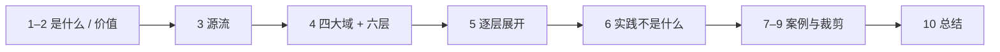
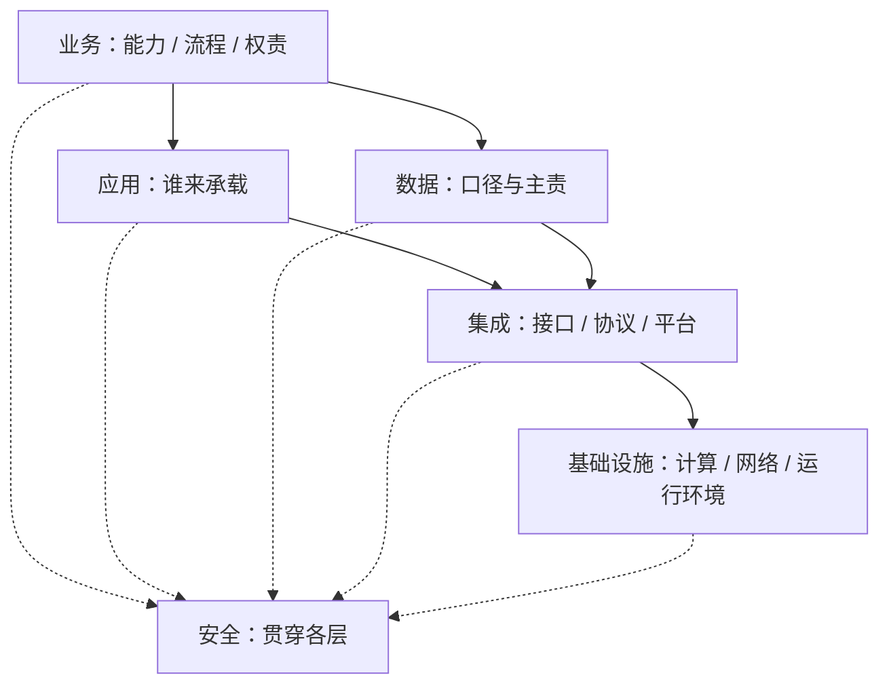

# 企业架构专论：战略如何翻译为可执行安排

> 数字化建设过程中常见一种错位。业务关注流程，信息技术关注系统，数据团队关注口径，研发关注代码，各方都在讨论架构，所指对象却并不相同。
>
> 由此带来的结果往往是系统持续增加而流程并未真正优化，数据持续积累而指标口径难以统一，技术投入上升而维护成本同步抬升。
>
> 全文分三篇：先界定定义与价值机制，再写源流、教学四大域与实践六层（含集成与安全），最后用「实践不是什么」收口，并落到案例与分规模路径。关键史实、数据与案例尽量采用可核验来源；斯维亚托斯拉夫·科图采夫（Svyatoslav Kotusev）《企业架构的艺术》对「框架与实践」的判断标为该书口径，文末附参考文献。

先给一个直接答案：

> **企业架构把战略翻译成可执行的经营安排与 IT 支撑，并持续约束该建什么、不该建什么。它不是某一种开发框架，也不是几张架构图。教学上可用四大域对齐；工作中常见六层域堆栈（业务、应用、数据、集成、基础设施、安全），靠沟通、决策与持续调整，而不是一次填满某个框架。**

## 摘要

企业架构（Enterprise Architecture，EA）针对「人人都在谈架构、所指却不同」所导致的系统堆砌、口径分裂与维护成本上升，把战略翻译为可执行的经营与 IT 安排。全文先界定定义与价值机制（翻译、统筹、对齐），再从约 1959 年商业计算写到 Zachman、TOGAF / FEAF / DoDAF 等公开节点。教学骨架用业务 / 数据 / 应用 / 技术四大域；实践对照科图采夫《企业架构的艺术》补上集成与安全，合成六层域堆栈，并交代三个流程与 CSVLOD 六种工件。误区一节说明实践不是纯技术规划、不是一次性蓝图、也不是照搬某一框架；案例与分规模路径说明如何裁剪落地。

**关键词：** 企业架构；业务与 IT 对齐；四大架构域；六层域；集成架构；TOGAF；企业架构实践

---

## 目录

- [摘要](#摘要)

**上篇 · 界定与价值**

1. [企业架构是什么](#1-企业架构是什么)
    - [1.1 三种被广泛引用的定义](#11-三种被广泛引用的定义)
    - [1.2 核心目标](#12-核心目标)
    - [1.3 一个直觉例子](#13-一个直觉例子)
2. [企业架构的价值创造机制](#2-企业架构的价值创造机制)
    - [2.1 三项核心价值](#21-三项核心价值)
    - [2.2 四个价值使能器](#22-ea-如何带来组织收益四个价值使能器)
    - [2.3 经营模式决定架构形态](#23-经营模式决定架构形态mit-cisr)
    - [2.4 实践里怎么运转](#24-实践里怎么运转科图采夫口径)

**中篇 · 源流与骨架**

3. [企业架构的起源与发展](#3-企业架构的起源与发展)
    - [3.1 阶段总览](#31-阶段总览)
    - [3.2 更早的源流：商业计算与战略信息系统规划（约 1959—1980）](#32-更早的源流商业计算与战略信息系统规划约-19591980)
    - [3.3 起源奠基：1980 年代](#33-起源奠基1980-年代)
    - [3.4 标准化发展：1990 年代—21 世纪初](#34-标准化发展1990-年代21-世纪初)
    - [3.5 普及成熟：约 2000—2010 年](#35-普及成熟约-20002010-年)
    - [3.6 数字化转型期：2010 年至今](#36-数字化转型期2010-年至今)
4. [四大架构域与实践六层](#4-四大架构域与实践六层)
    - [4.1 教学用关系图](#41-教学用关系图)
    - [4.2 四大域对照与「缺了会怎样」](#42-四大域对照与缺了会怎样)
    - [4.3 与 TOGAF ADM 的对应](#43-与-togaf-adm-的对应便于专业读者对齐)
    - [4.4 工作中常见的六层域](#44-工作中常见的六层域)
    - [4.5 工件不是按域切片：CSVLOD](#45-工件不是按域切片csvlod)
5. [从业务到代码：各层如何贯通](#5-从业务到代码各层如何贯通)
    - [5.1 为什么会「鸡同鸭讲」](#51-为什么会鸡同鸭讲)
    - [5.2 为什么不能一上来就谈技术选型](#52-为什么不能一上来就谈技术选型)
    - [5.3 业务架构](#53-业务架构企业如何运行)
    - [5.4 应用架构](#54-应用架构系统如何支撑业务)
    - [5.5 数据架构](#55-数据架构数据如何管理与使用)
    - [5.6 集成架构](#56-集成架构系统如何连成整体)
    - [5.7 技术 / 基础设施架构](#57-技术--基础设施架构系统如何稳定运行)
    - [5.8 安全架构](#58-安全架构约束如何贯穿各层)
    - [5.9 代码架构](#59-代码架构软件如何长期维护)
    - [5.10 对照总表](#510-对照总表)
    - [5.11 贯通关系](#511-贯通关系)

**下篇 · 误区、案例与落地**

6. [常见认知误区](#6-常见认知误区)
    - [6.1 速览](#61-速览)
    - [6.2 最佳实践从行业长出来](#62-最佳实践从行业长出来)
    - [6.3 实践不应与哪些事情相混淆](#63-实践不应与哪些事情相混淆)
    - [6.4 不是纯粹的技术规划，也不是特定的技术实践](#64-不是纯粹的技术规划也不是特定的技术实践)
    - [6.5 不是万能的方法](#65-不是万能的方法)
    - [6.6 不是一次性的规划项目](#66-不是一次性的规划项目)
    - [6.7 不是企业建模](#67-不是企业建模)
    - [6.8 不是企业工程，也不是系统思考](#68-不是企业工程也不是系统思考)
    - [6.9 不是突破性的解决方案](#69-不是突破性的解决方案)
    - [6.10 不是企业架构框架的实施](#610-不是企业架构框架的实施)
    - [6.11 适用范围](#611-适用范围)
7. [企业架构实践案例](#7-企业架构实践案例)
    - [7.1 轻量教学案例：50 人服饰品牌电商](#71-轻量教学案例50-人服饰品牌电商)
    - [7.2 中小金融：中邮消费金融的「三步走」](#72-中小金融中邮消费金融的三步走)
    - [7.3 大型银行：中国银行「IT 蓝图」](#73-大型银行中国银行it-蓝图)
    - [7.4 电信央企：中国联通「同舟 ERP」](#74-电信央企中国联通同舟-erp)
    - [7.5 电信金融场景：中国电信财司系统国产化重构](#75-电信金融场景中国电信财司系统国产化重构)
    - [7.6 基础设施运营：中国铁塔的「战略—价值流—能力产品化」](#76-基础设施运营中国铁塔的战略价值流能力产品化)
    - [7.7 制造集团：中国一汽「5A」企业架构](#77-制造集团中国一汽5a企业架构)
    - [7.8 案例对照：不同企业在解什么题](#78-案例对照不同企业在解什么题)
8. [企业架构在中国的应用实践](#8-企业架构在中国的应用实践)
    - [8.1 三个阶段](#81-三个阶段)
    - [8.2 行业画像](#82-行业画像)
    - [8.3 本土化四个特征](#83-本土化四个特征)
    - [8.4 误区与趋势](#84-误区与趋势)
9. [不同规模企业的落地路径](#9-不同规模企业的落地路径)
    - [9.1 中小企业（几十人到数百人）](#91-中小企业几十人到数百人)
    - [9.2 中型企业（多系统、多部门）](#92-中型企业多系统多部门)
    - [9.3 大型集团 / 受监管行业](#93-大型集团--受监管行业)
    - [9.4 一张可执行清单](#94-一张可执行清单)
10. [总结](#10-总结)
11. [参考文献](#11-参考文献)

下图为全文阅读顺序：先界定与价值，再源流；教学用四大域，实践补集成与安全成六层，然后用「不是什么」收口，最后落到案例与分规模路径。



---

## 1. 企业架构是什么

> **本节要点：** 企业架构回答「企业按什么方式运转、IT 如何支撑」；不是某一种开发框架，也不是几张架构图。

企业架构（**Enterprise Architecture**，简称 **EA**）是一套从企业**全局视角**出发，对业务能力、流程规则、数据资产、应用系统、技术底座进行**系统性梳理、设计与持续治理**的管理与工程方法论。

可以把它理解成：

> **把战略翻译成可执行的经营安排与 IT 支撑，并持续约束「该建什么、不该建什么」。**

它不是某一种开发框架，也不是几张漂亮的架构图。教学上常归纳为业务、数据、应用、技术四大域；工作中常把集成拆出、把安全单列并贯穿，见第 4.4 节。

### 1.1 三种被广泛引用的定义

| 来源 | 定义要点 |
|------|----------|
| **The Open Group（TOGAF）** | EA 描述企业中业务、数据、应用与技术等组成部分及其相互关系，并通过架构开发方法（ADM）指导从愿景到实施的迭代过程。[^togaf] |
| **MIT CISR（Ross / Weill / Robertson）** | EA 是企业业务流程与 IT 能力的**组织逻辑（organizing logic）**，反映企业经营模式（operating model）对流程**集成与标准化**的要求；架构首先是**战略执行基础**，而不只是 IT 技术设计。[^ross-ea-strategy] |
| **Tamm 等（学术综述）** | EA 是对企业业务流程与 IT 系统及其相互关系、共享程度的高层定义与表达，旨在支撑组织未来目标，并给出迈向目标架构的路线图。[^tamm-eabm] |

相邻的体系描述标准是 ISO/IEC/IEEE 42010：它规范的是「如何描述架构」，并不等于一套企业级规划方法。[^iso-42010]

> **一句话**：企业架构要回答的，不是「用什么技术」，而是「企业按什么方式运转，以及 IT 如何稳定支撑这种方式」。

### 1.2 核心目标

| 序号 | 目标 | 说明 | 典型落地表现 |
|------|------|------|--------------|
| 1 | **战略对齐** | 经营要素与战略目标一致 | 重大项目先看是否服务战略能力 |
| 2 | **降低复杂度** | 减少重复建设与数据孤岛 | 系统边界清晰、主数据统一 |
| 3 | **贯通落地** | 从战略到执行上下贯通 | 有目标架构、路线图、治理机制 |

### 1.3 一个直觉例子

同一家制造企业，如果没有企业架构视角，常见对话是：

- 业务说：「给我上一个供应链系统。」  
- IT 说：「那我们选 SAP / 自研 / 微服务？」  
- 数据说：「先把数仓建起来。」  
- 研发说：「模块怎么拆？」  

这些都重要，但顺序错了。更合理的提问是：

1. 我们的核心价值链是什么？哪些能力必须标准化？  
2. 订单、库存、采购由谁主责？跨部门规则是什么？  
3. 需要哪些系统承载，边界如何切分？  
4. 关键数据以谁为准、如何流转？  
5. 系统之间如何连接，而不是各接一套烟囱接口？  
6. 技术底座、安全与软件结构如何支撑长期演进？  

**这六步，已经覆盖业务、应用、数据、集成、基础设施 / 安全与软件实现。** 第 4.4 节给出实践六层，第 5 节用同一类制造场景展开。

---

## 2. 企业架构的价值创造机制

> **本节要点：** 价值来自翻译、统筹、对齐，经四个使能器间接起作用；形态由经营模式决定，没有唯一正确的模板。

很多人第一次接触 EA，会以为「企业架构 = 画几张架构图」。这是最常见、也最昂贵的误解。

Zachman 1987 年提出的框架，本质上是一种用于系统描述的**分类体系（taxonomy）**，作者明确指出该文讨论的是架构描述，并不等于完整战略规划方法论。[^zachman1987] 日后 ISO/IEC/IEEE 42010 将「架构描述」进一步标准化为系统与软件工程中的国际语汇。[^iso-42010]
后续 TOGAF、FEAF 等，才把「怎么描述」扩展为「怎么开发、怎么治理、怎么落地」。

### 2.1 三项核心价值

| 价值 | 内涵 | 反面案例 |
|------|------|----------|
| **翻译** | 把抽象战略翻译为能力、流程、数据标准、系统支撑 | 战略口号很多，项目清单却对不上 |
| **统筹** | 把局部工作纳入统一框架 | 各部门各自最优，整体低效 |
| **对齐** | 先对齐目标架构，再立项建设 | 先买系统，再补流程与口径 |

### 2.2 EA 如何带来组织收益：四个「价值使能器」

Tamm 等学者在综述大量 EA 文献后提出 **EA Benefits Model（EABM）**：EA 并不直接「变出利润」，而是通过改善四个使能器，间接带来更低成本、更高敏捷性与更可靠的运营平台：[^tamm-eabm]

| 使能器 | 含义 | 对应你日常能看到的变化 |
|--------|------|------------------------|
| **组织对齐（Organisational Alignment）** | 业务目标、流程与 IT 投资方向一致 | 少做「战略无关项目」 |
| **信息可用性（Information Availability）** | 决策所需信息更及时、更一致 | 少开会对口径 |
| **资源组合优化（Resource Portfolio Optimisation）** | 系统与能力组合更合理，减少重复 | 少买功能重叠的系统 |
| **资源互补性（Resource Complementarity）** | 业务能力与 IT 能力相互增强 | 上新业务更快、返工更少 |

研究也指出：规模大、IT 环境复杂、经营模式需要较高标准化与集成的组织，通常更能从 EA 中获益。[^tamm-eabm]

### 2.3 经营模式决定架构形态（MIT CISR）

Ross 等人强调：先想清楚企业经营模式对「集成」和「标准化」的要求，再设计企业架构。[^ross-ea-strategy]

一个简化理解是：

| 经营诉求 | 架构倾向 |
|----------|----------|
| 各业务线高度独立 | 更强调局部灵活，统一要求相对少 |
| 需要集团统一客户 / 产品 / 财务视图 | 必须强化主数据、共享流程与集成标准 |
| 既要统一底座、又要前端创新 | 常见「厚中台 / 共享能力 + 薄前台」 |

> **要点**：没有唯一正确的架构模板，只有与经营模式匹配的架构选择。照搬别家蓝图，往往先失败。

### 2.4 实践里怎么运转（科图采夫口径）

Ross 回答「形态跟经营模式走」；科图采夫补充「日常靠什么转起来」。该书第 2 章把企业架构首先看成**沟通介质**：用一批 EA 工件，把业务与 IT 各方拉到同一张决策桌上，而不是先画完一套完整蓝图。[^kotusev-art]

运转对应该书第 6 章三条并行、持续反馈的流程：

| 流程 | 输入 | 输出 |
|------|------|------|
| **战略规划** | 经营环境与抽象经营考量 | 中长期能力、投资方向、路线图 |
| **计划交付** | 已批准的经营考量与方案轮廓 | 可实施的解决方案设计，交给项目管理 |
| **技术优化** | 现有 IT 景观的事实 | 标准、冗余清理、复杂度收敛 |

架构实践夹在战略管理与项目管理之间：把抽象经营考量译成可实施的 IT 方案，再把落地后的事实景观喂回下一轮规划。工件如何分类，见第 4.5 节。

---

## 3. 企业架构的起源与发展

> **本节要点：** 主线是降低复杂度、对齐业务；约 1959 年起的规划方法后来被反复冠名，Zachman / TOGAF 等是公开可核验的节点。

企业架构诞生于 IT 系统复杂化带来的协同困境，随后从**技术描述框架**演进为**承接战略、贯通业务与技术**的企业级方法。主线始终是：

> **降低复杂度 · 对齐业务目标 · 提升整体效率**

### 3.1 阶段总览

| 阶段 | 时间 | 关键词 | 核心转变 |
|------|------|--------|----------|
| 商业计算前史 | 约 1959—1980 | IBM 1401 / 360、BSP、Method/1、信息工程 | 战略信息系统规划：把业务战略译成信息系统的可操作计划 |
| 起源奠基 | 1980 年代 | Zachman Framework | 建立信息系统架构描述范式 |
| 标准化发展 | 1990 年代—21 世纪初 | TOGAF / FEAF / DoDAF | 从描述框架走向方法与治理 |
| 普及成熟 | 约 2000—2010 年 | TOGAF 9、四大架构域 | 方法被广泛采用，支撑大规模信息化 |
| 数字化转型期 | 2010 年至今 | 轻量化、敏捷化、业务价值导向 | 动态迭代，融入经营管理 |

> 约 1959—1980 年的商业计算与规划方法谱系，整理自科图采夫《企业架构的艺术》**附录 A**（第 3.5 节是提要）。Zachman、TOGAF、FEAF、DoDAF 的公开节点见第 3.3–3.6 节，可核验来源见文末。框架与工作中实践是不是一回事，见第 6 节。[^kotusev-art]

### 3.2 更早的源流：商业计算与战略信息系统规划（约 1959—1980）

> 以下前史按科图采夫《企业架构的艺术》附录 A 整理。可核验节点：IBM 1401 与 7090 于 1959 年推出并带动商业计算普及（IBM 更早的晶体管机还有 1958 年的 7070）；System/360 于 1964 年宣布、1965 年起交付。时间共享等能力是后续操作系统演进，该书将其与 360 的商业扩大一并叙述。[^kotusev-art]

信息系统在商业上的广泛采用始于 1959 年左右，当时 IBM 推出了它的第一台晶体管大型计算机，即 IBM 1401 和 7090 系列。当时，人们已经广泛了解到计算机对许多组织的业务、对已有的管理实践，甚至对整个社会具有相当大的颠覆性潜力。

1965 年，在具有强大操作系统、时间共享和多任务支持的创新的 IBM 360 系列出现后，大型计算机在组织中的商业应用进一步扩大。到 20 世纪 60 年代末，计算机已在许多领先的美国公司中广泛应用，这些公司大多为高级计算机管理人员设立了永久职位（现代 CIO 的原型）。从那时起，整个组织的信息系统规划问题得到了极大的关注，并因此提出了首批规划方法。

信息系统对许多组织的业务越来越重要，这加剧了实现业务和 IT 对齐的长期问题，以及对有效的战略信息系统规划的需求。为了解决业务和 IT 对齐的紧迫问题，自 20 世纪 60 年代初以来，不同的供应商、咨询公司和个人专家提出了许多正式的、详细的、按部就班的基于架构的规划方法，最初其被定位为战略信息系统规划方法，后来被定位为企业架构框架，旨在将一个组织的业务战略转化为信息系统的可操作计划。

这些规划方法在市场上有不同的名称，包括战略信息系统规划、战略数据规划、信息架构、企业架构。**本节时间窗是商业计算与规划方法的前史（约 1959—1980）**。落在这一窗内的名称如下：

| 时期（科图采夫谱系分期） | 名称 |
|------|------|
| 早期 | BSP |
| 1970 年代 | Method/1 |
| 1980 年代 | 信息工程、战略数据 / 信息规划 |

同一套「现状—目标—路线图」后来又被冠上这些名称（已超出本节约 1959—1980 的时间窗；公开发布年见第 3.3–3.6 节，例如 TOGAF Version 1 为 1995 年，并非 2010 年代才出现）：

| 时期（科图采夫谱系分期） | 名称 |
|------|------|
| 1990 年代 | 企业架构规划（EAP）、TAFIM |
| 2000 年代 | FEAF |
| 2010 年代以来 | TOGAF |

然而，所有这些方法论和框架本质上代表了相同的逐步正式规划方法，仅有略微不同的变化，它以某种形式意味着：分析 IT 系统的当前支持，定义与战略业务目标相一致的未来架构，然后制定行动计划或路线图，从当前状态迁移到所需的目标状态。[^kotusev-art]

### 3.3 起源奠基：1980 年代

**背景**：大型机普及，信息系统激增，标准不一，数据孤岛与重复建设凸显。

**里程碑**：1987 年，IBM 的 John A. Zachman 在 *IBM Systems Journal* 发表 *A Framework for Information Systems Architecture*，提出多视角矩阵式描述框架，成为后来企业架构**描述框架**的公认起点——上一节的规划方法谱系更早，但 Zachman 把「怎么描述系统」收成可引用的分类体系。[^zachman1987]

**阶段特征**：重心仍是**信息系统架构描述**。

### 3.4 标准化发展：1990 年代—21 世纪初

**背景**：IT 投资扩大，业务与 IT 脱节、投资回报偏低；政府与行业组织推动标准化。

**关键里程碑**

1. **1995 年**：The Open Group 以美国国防部 **TAFIM** 为基础发布 **TOGAF Version 1**，并持续演进 **ADM**。[^togaf][^togaf-history]
   > 早期 TOGAF 更偏技术 / 平台架构；后续版本逐步强化业务与信息体系。
2. **1996 年**：美国《克林格—科恩法案》（**Clinger-Cohen Act**, P.L. 104-106）要求联邦机构 CIO 建立并维护一体化信息技术架构。[^clinger-cohen]
3. **1999 年 9 月**：联邦 CIO 委员会发布 **FEAF** Version 1.1，提出跨机构架构构造方法，并包含业务、数据、应用、技术等视角。[^feaf]
4. **2003/2004 年**：美国国防部发布 **DoDAF** 1.0（2003 年 8 月发布，2004 年 2 月文档出齐；此前长期使用 C4ISR Architecture Framework）。[^dodaf]

**阶段特征**：从「怎么描述」升级为「怎么实施与治理」，目标转向业务与 IT 对齐。

### 3.5 普及成熟：约 2000—2010 年

**里程碑**

1. **2009 年 2 月**：发布 **TOGAF 9**，进一步强化业务导向，并系统阐述业务、数据、应用、技术四类相关架构。[^togaf][^togaf9]
   > 四大域并非 TOGAF 9「从零发明」；FEAF 等体系已有相近表述，TOGAF 9 使其成为更稳固的全球共识表达。
2. 银行业实践中，TOGAF 常与行业内容框架结合使用。例如 The Open Group 与 **BIAN**（Banking Industry Architecture Network）发布协作白皮书：TOGAF 提供通用方法，BIAN 提供银行服务参考内容，可加速银行架构工作并提升一致性。[^togaf-bian]
3. 中国在 2000 年后逐步引入相关方法，金融、电信、能源等行业率先落地（阶段与数据见第 8 节）。

### 3.6 数字化转型期：2010 年至今

云原生、大数据、微服务、中台快速迭代，传统重型 EA「周期长、响应慢」的问题暴露。The Open Group 也发布了面向数字企业与敏捷交付的系列指南。[^togaf]

| 变化 | 说明 |
|------|------|
| 方法轻量化 | 从全量长周期蓝图，转向小步迭代 |
| 重心上移 | 业务架构、数据架构地位提升 |
| 受众下沉 | 从大型企业扩展到中型企业裁剪式实践 |

---

## 4. 四大架构域与实践六层

> **本节要点：** 四大域是教学对齐语言。工作中更常见六层：在业务、应用、数据、基础设施之外，把**集成**独立成层，**安全**贯穿各层。不是主张必须跑完某一框架。

前节按公开节点把源流说完。先用四大域作**教学骨架**，再对照科图采夫《企业架构的艺术》第 2.1.3 节「企业架构域」的实践六层。框架与工作中实践如何区分，见第 6 节。

在 TOGAF 等主流框架中，企业架构通常覆盖四类相互关联的架构域。[^togaf][^togaf9]

先澄清两个容易矛盾的点：

1. **数据架构与应用架构在方法上常并列**（TOGAF ADM Phase C 同时覆盖 Data 与 Application），并非永远「数据层压在应用层之上」。分层图是教学表达。  
2. **代码 / 软件架构不属于经典 EA 四大域**，它是单个系统内部的实现架构，是 EA 向下落地的一层。

### 4.1 教学用关系图

```text
┌──────────────────────────────────────────┐
│            业务架构（Business）             │
│     能力 · 流程 · 组织权责 · 业务规则         │
├──────────────────────────────────────────┤
│     数据架构（Data）  ║  应用架构（Application） │
│   资产·标准·流向·治理 ║  系统·边界·职责·布局    │
├──────────────────────────────────────────┤
│            技术架构（Technology）            │
│     基础设施 · 技术栈 · 运维（安全见 4.4）      │
└──────────────────────────────────────────┘
              ↓ 落地实现
┌──────────────────────────────────────────┐
│     代码 / 软件架构（Software Architecture）  │
│     模块边界 · 耦合解耦 · 可扩展性 · 可维护性   │
└──────────────────────────────────────────┘
```

### 4.2 四大域对照与「缺了会怎样」

| 架构域 | 核心问题 | 主要产出 | 缺失时的典型症状 |
|--------|----------|----------|------------------|
| **业务架构** | 靠什么能力创造价值？流程与权责如何安排？ | 能力地图、端到端流程、权责规则 | 系统上线后，扯皮依旧；流程被「原样固化」 |
| **数据架构** | 核心数据是什么？如何流转与治理？ | 资产清单、标准、口径、数据流 | 同一指标多个数；主数据冲突 |
| **应用架构** | 用哪些系统支撑？边界如何切？ | 系统清单、功能边界 | 功能重叠、重复建设 |
| **技术架构** | 底座如何保障稳定、可扩展？ | 技术标准、部署与运维体系 | 大促不稳、扩展成本飙升 |

集成与安全在教学表里常并进应用 / 技术；实践中宜拆开，见第 4.4 节。缺集成的典型症状是接口烟囱与人工导数。

> **关系口诀**（教学四域，再补实践里拆出的集成与安全）：业务定义「要什么」，应用决定「谁来做」，数据决定「信息如何一致流动」，集成决定「如何连上」，技术决定「底座能不能撑住」，安全贯穿各层。

### 4.3 与 TOGAF ADM 的对应（便于专业读者对齐）

| ADM 阶段（简化） | 主要关注 |
|------------------|----------|
| Architecture Vision | 架构愿景、范围、干系人 |
| Business Architecture | 业务架构 |
| Information Systems Architecture | 数据架构 + 应用架构 |
| Technology Architecture | 技术架构 |
| Opportunities & Solutions / Migration Planning | 路线图与迁移 |
| Implementation Governance / Architecture Change Management | 落地治理与持续变更 |

企业不必机械跑完全流程，但**「先业务、再信息系统、再技术、再迁移治理」**的节奏，比「先买平台」稳健得多。[^togaf]

### 4.4 工作中常见的六层域

TOGAF 把集成多半写进应用架构，把安全多半写进技术架构。科图采夫根据行业观察给出另一套**实践常用域堆栈**：业务、应用、数据、集成、基础设施、安全。下层支撑上层；安全不单坐在底层，而是贯穿各层。[^kotusev-art]

| 域 | 覆盖什么 | 在堆栈中的位置 |
|----|----------|----------------|
| **业务** | 客户、能力、流程、角色 | 非技术；其余五层都是技术域 |
| **应用** | 系统、套装、自研、厂商产品 | 把流程自动化 |
| **数据** | 实体、结构、来源 | 被应用使用 |
| **集成** | 接口、连接、交互协议、集成平台 | 把应用与数据连成可运转的整体 |
| **基础设施** | 硬件、服务器、操作系统、网络 | 托管应用、库与集成平台 |
| **安全** | 防火墙、认证、身份与访问、加密 | 渗透其余各域，不是贴在最底下的一块 |



上三层（业务、应用、数据）靠近经营功能，业务干系人通常要在场；下三层（集成、基础设施、安全）偏非功能支撑，业务方很少直接拍板，但缺了会把上三层架空。

与四大域对照，不必二选一：

| 教学四大域 | 实践六层里落在哪 |
|------------|------------------|
| 业务架构 | 业务 |
| 数据架构 | 数据 |
| 应用架构 | 应用；**集成常被塞进这一格，实践中宜拆开** |
| 技术架构 | 基础设施；**安全常被塞进这一格，实践中宜单列并贯穿** |
| （实现层） | 代码 / 软件架构仍在六层之下，见第 5 节 |

> **为何单独讲集成。** 系统边界清楚之后，痛点往往变成「各接一套接口」。把集成留在应用架构里，容易被当成项目附带事项；独立成层，才有人主责协议、平台与连接清单。第 7.1 节的轻量案例，最小集就是把这条说清楚。

组织不必设齐六类架构师。业务单一的组织更常按域设岗；业务线分散的组织，领域岗往往只留在集成、基础设施、安全这类与具体业务功能无关的技术域上。这是该书第 17 章对架构职能的观察，不是编制标准。[^kotusev-art]

### 4.5 工件不是按域切片：CSVLOD

域回答「描述对象是什么」；日常真正被拿来开会的，是**工件（artifact）**。科图采夫用 **CSVLOD**（Considerations, Standards, Visions, Landscapes, Outlines, Designs）把工件分成六种用途，而不是按四大域或六层再切一张完整矩阵。中译名从该书第 4、8 章；目录对 Landscapes 亦作「IT 景观 / 技术景观」。[^kotusev-art]

| 类型 | 英文 | 典型例子 | 作用 |
|------|------|----------|------|
| **经营考量** | Considerations | 原则、政策 | 长期约束「什么能做、什么不做」 |
| **技术标准** | Standards | 技术参考模型、指南、模式 | 收敛技术选择，降低景观复杂度 |
| **业务愿景** | Visions | 能力模型、路线图、目标状态 | 对齐中长期要往哪走 |
| **技术景观** | Landscapes | 景观图、系统清单、IT 路线图 | 记录现状与近期结构，供技术决策 |
| **概要设计** | Outlines | 解决方案概述、选项评估 | 立项前让业务与 IT 共同拍板 |
| **详细设计** | Designs | 解决方案设计 | 交给项目组实施 |

经营考量 / 愿景偏业务侧，标准 / 景观偏 IT 侧；概要设计与详细设计是变更件。一件工件可以同时涉及多个域（例如一张景观图同时画应用、集成与数据）。成功实践从不追求「每个域、每种类型都填满」。

---

## 5. 从业务到代码：各层如何贯通

> **本节要点：** 各词所指不同。建设宜先业务，再应用与数据，同步把集成说清楚，再谈基础设施与安全，最后落到代码；不宜长期倒置。

数字化建设中常同时出现这些词：

> **业务 · 应用 · 数据 · 集成 · 技术 / 基础设施 · 安全 · 代码**

前四个加基础设施、安全，对应第 4.4 节实践六层；代码仍是实现层。

### 5.1 为什么会「鸡同鸭讲」

| 角色 | 口中的「架构」通常指 |
|------|----------------------|
| 业务部门 | 流程、权责、组织是否合理 |
| 系统团队 | 应用如何建设与协同 |
| 数据团队 | 口径、模型、治理是否统一 |
| 集成 / 平台团队 | 接口、总线、同步还是异步 |
| 安全 / 合规 | 身份、访问、加密、等保 |
| 开发人员 | 代码是否可维护、变更是否可控 |

缺少整体规划时，常见三连困境：

1. 系统越建越多，业务流程却没有真正优化  
2. 数据越积越丰富，指标口径却依然不统一  
3. 技术投入持续增加，维护成本反而越来越高  

### 5.2 为什么不能一上来就谈技术选型

很多企业默认「架构是技术部门的事」，项目一开始就讨论数据库、语言、云平台或微服务。

**举例：制造企业要建供应链管理平台**

表面需求：「开发一个采购和库存管理系统。」

真正要先回答：

1. 采购流程如何运行？  
2. 订单如何从销售传递到生产？  
3. 库存数据由哪个系统主责？  
4. 系统间如何共享与同步数据——走统一集成，还是各接一套接口？  
5. 谁能改库存、谁能看供应商价，身份与权限落在哪一层？  

如果跳过这些，很容易出现「系统上线了，效率却没提升」：流程被固化、边界不清、数据不通，最后仍靠人工整理报表。

### 5.3 业务架构：企业如何运行

> **一句话**：回答「企业做什么、按什么方式做」。

关注点不是某个系统，而是能力与流程组织。制造企业从客户需求 → 销售接单 → 计划排产 → 采购备料 → 生产制造 → 仓储收发存 → 财务核算，这条链路就是业务架构的重要内容。

| 业务域 | 通常需要明确 |
|--------|--------------|
| 采购 | 供应商管理、采购审批、交付管理 |
| 生产 | 计划排产、生产执行、质量控制 |
| 销售 | 订单管理、客户服务、收入确认 |

业务流程没梳理清楚就上 ERP / CRM，往往只是把旧问题数字化。很多项目效果不佳，根因不是功能不够，而是业务逻辑本身没有优化。

### 5.4 应用架构：系统如何支撑业务

> **一句话**：回答「业务由哪些系统承载、如何协同」。

| 系统 | 常见职责 |
|------|----------|
| ERP | 企业资源计划与经营管理 |
| MES | 生产过程执行 |
| WMS | 仓储作业 |
| CRM | 客户与销售管理 |

关键不在系统数量，而在职责边界与业务闭环。边界不清时，客户主数据同时存在 CRM 与 ERP，两套各自维护，分析结果长期无法统一。

应用边界清楚之后，瓶颈常转向数据如何一致、系统如何连接，见第 5.5–5.6 节。

### 5.5 数据架构：数据如何管理与使用

> **一句话**：回答「数据如何产生、存储、加工、治理并服务业务」。

系统变多后，常见现象是：**数据量上升，数据价值不同步上升**。根因通常不是缺数据，而是缺统一管理体系。

没有统一数据架构时，「客户价值」可能被各部门各自定义：

| 部门 | 常见口径 |
|------|----------|
| 销售 | 成交金额 |
| 财务 | 回款情况 |
| 运营 | 活跃程度 |

再以「销售收入」为例，至少要明确：按订单金额还是收入确认？退款如何处理？跨期如何归属？跨系统如何关联？规则不沉淀，就会出现「同一个指标，三个部门三个数」。

落地难点还在于：源系统结构不同、更新频率不同。需要统一集成与治理，让数据按规则持续流动，而不是一次性堆进仓库。

### 5.6 集成架构：系统如何连成整体

> **一句话**：回答「应用与数据之间如何连接，而不是每对系统各接一套接口」。

科图采夫把集成列为独立域：接口、连接、交互协议、集成平台。它不是应用架构的附录。应用回答「谁承载哪段业务」；集成回答「它们怎样可靠地对话」。[^kotusev-art]

制造供应链里，常见要连的不是「再买一个系统」，而是：

| 连接 | 若没有统一集成 |
|------|----------------|
| 销售订单 → 生产计划 | 计划员手工抄单，漏单、错单 |
| 库存主责系统 → 渠道可售 | 超卖或超卖后的紧急锁库 |
| 收货 / 发货 → 财务应付应收 | 对账靠 Excel，关账拉长 |

做法上先定三件事：哪些对象必须一次录入、全链路共享；同步还是异步；连接走企业集成平台 / API 网关，还是继续点对点。缺这一层，第 4.2 节「接口烟囱、人工导数」就会从应用域漏到技术域，两头都管不住。

### 5.7 技术 / 基础设施架构：系统如何稳定运行

> **一句话**：回答「计算、网络与运行环境能否长期撑住变化」。

重点不是单一选型，而是整套运行环境能否托管应用、数据库与集成平台。问题会从「单系统稳不稳」，扩展到链路运维与弹性。安全不写在这一节「顺便带过」，见第 5.8 节。

### 5.8 安全架构：约束如何贯穿各层

> **一句话**：回答「身份、访问、加密与合规如何嵌进业务到基础设施，而不是上线后再打补丁」。

科图采夫将安全列为独立域，并强调它**渗透**其余各层，而不是只等于防火墙。[^kotusev-art] 业务层定谁能做什么；应用与数据层落权限与脱敏；集成层管通道与认证；基础设施层管网络隔离与密钥。中国一汽 5A 把安全架构（SA）单列，是同一判断的本土化（见第 7.7 节）。

### 5.9 代码架构：软件如何长期维护

> **一句话**：更准确称**软件架构**——单个软件内部如何组织，才能持续演进。

它不属于经典 EA 四大域，也不在实践六层之内，但与 EA 强相关：应用架构定义系统边界与职责，软件架构定义系统内部如何实现这些职责。

| 设计要点 | 目的 |
|----------|------|
| 模块合理拆分 | 边界清晰，降低变更扩散 |
| 降低耦合 | 减少复杂依赖 |
| 支持扩展 | 新增需求不必大规模推倒重来 |

### 5.10 对照总表

| 类型 | 核心问题 | 典型产出 | 主要责任方 | 与 EA 关系 |
|------|----------|----------|------------|------------|
| 业务架构 | 企业如何运行？ | 能力地图、端到端流程 | 业务 / 战略 | 教学四大域 / 实践六层 |
| 应用架构 | 系统如何支撑业务？ | 应用蓝图、职责边界 | 业务 + IT | 教学四大域 / 实践六层 |
| 数据架构 | 数据如何管理使用？ | 资产目录、指标口径 | 数据 / 业务 | 教学四大域 / 实践六层 |
| 集成架构 | 系统如何连成整体？ | 接口清单、协议、集成平台 | 集成 / 平台 | 实践六层（四大域里常并进应用） |
| 技术 / 基础设施 | 底座如何稳定运行？ | 技术标准、运维体系 | IT / 基础设施 | 教学四大域之技术 / 实践六层 |
| 安全架构 | 约束如何贯穿各层？ | 身份、访问、加密、合规 | 安全 / 合规 | 实践六层（四大域里常并进技术） |
| 代码架构 | 软件如何长期维护？ | 分层设计、模块边界 | 研发 | EA 的实现层 |

### 5.11 贯通关系

```text
业务架构（做什么、怎么跑）
    ↓
应用架构（用哪些系统承载）  ←→  数据架构（信息如何统一流转）
    ↓
集成架构（如何连接，而不是烟囱接口）
    ↓
基础设施架构（底座如何托管）    安全架构（贯穿以上各层）
    ↓
代码 / 软件架构（系统内部如何实现与演进）
```

建设顺序建议：

| 步骤 | 动作 | 目标 |
|------|------|------|
| 1 | 梳理业务架构 | 明确经营流程与管理目标 |
| 2 | 规划应用与数据 | 明确系统职责、口径与主责 |
| 3 | 规划集成 | 明确必须打通的连接、协议与平台 |
| 4 | 完善基础设施、安全与软件架构 | 保障稳定、合规与可持续演进 |

> 与第 4.3 节 ADM「先业务、再信息系统、再技术」总体同向；实践上把集成从应用里拆出、把安全从技术里拆出。可按痛点谁先动手，但不宜长期倒置。[^togaf][^kotusev-art]

---

## 6. 常见认知误区

> **本节要点：** 工作中的实践是沟通、决策与持续调整；不是填满某个框架，也不是一次完美蓝图。下列对带品牌框架的成败判断，是科图采夫口径。

### 6.1 速览

| 误区 | 正确理解 |
|------|----------|
| 把 EA 等同于 IT 架构 | 应用、集成、基础设施与安全偏 IT 支撑；业务与数据才是解决经营问题的关键抓手 |
| 把 EA 等同于一堆文档 | 架构应约束投资、项目边界与运营规则 |
| 认为只有大企业才需要 | 中小企业可裁剪聚焦核心流程、核心数据、核心系统。完整架构职能通常对应一定 IT 编制（见第 6.11 节） |
| 认为架构一次成型 | 架构能力持续演进；战略变化后目标架构应同步调整 |
| 把代码架构当成企业架构 | 软件架构很重要，但不能替代企业级统筹 |
| 照搬完整 TOGAF 才叫专业 | 专业体现在「匹配经营模式与资源约束」，不是流程跑全 |

上表是速查。下面先交代科图采夫的总判断（最佳实践从行业长出来），再按「实践不是什么」逐条展开。其中对 TOGAF / Zachman / FEAF / DoDAF「没有成功实施例子」等判断，是该书口径，不是本库对开放集团标准文本的废止；第 4、5 节用四大域作教学对齐，并用该书六层补上集成与安全。[^kotusev-art]

### 6.2 最佳实践从行业长出来

> 本节整理自该书第 3.5 节与附录 A。「没有一种方法成功运作」「超过 10 亿美元」等，均为**该书口径**。[^kotusev-art]

**炒作与失败。** 尽管几十年来，这些基于架构的规划方法被出于商业动机的供应商冠以各种行业「最佳实践」的头衔，但实际上没有一种在实践中成功运作。例如，似乎是受到「领先的行业专家」建议的启发，美国联邦政府在 1999 年启动了臭名昭著的联邦企业架构（FEA）计划，为所有政府机构开发企业架构，最终只交付了一堆基本无用的架构文档，据报道浪费了超过 10 亿美元。由于无休止地大力推广有缺陷的、基于架构的方法论，以及随之而来的众多实践的失败，架构的概念在很大程度上名誉扫地，甚至「架构」这个词后来在许多组织中也成了一个「贬义词」。

> **核验注。** 公开节点上，联邦 CIO 委员会的 **FEAF** 1.1 发布于 1999 年 9 月；OMB 主导的 **FEA** 计划始于 2002 年 2 月。科图采夫把这条联邦架构工作统称为 1999 年启动的 FEA 计划。「超过 10 亿美元」是该书对 GAO 等材料的归纳（其 BCS 文章亦写到 2010 年底联邦企业架构支出已逾十亿美元、其中大量被浪费），不是本库对某一财年的独立审计。[^kotusev-art][^feaf][^kotusev-hist]

总之，许多基于架构的规划方法和框架，虽然围绕架构进行了大量炒作，促进了企业架构的概念，并激发了架构思维，但仍未能为架构文档（即 EA 工件）的实际使用提供多少有价值的建议。

**实践从行业长出来。** 如管理学中通常发生的那样，真正的管理创新和最佳实践在行业中逐渐出现并成熟，这是众多从业者为解决最紧迫的业务问题无数次尝试后的结果。同样，就企业架构而言，真正的企业架构最佳实践是在行业中出现和成熟的，因为几十年来无数的 IT 规划者试图解决许多组织中糟糕的业务和 IT 对齐的长期问题。换句话说，一致的企业架构最佳实践的出现是由业务和 IT 一致性的迫切需求引起的行业自然反应，而非一些顾问、大师或「某某之父」的刻意产物。众多的企业架构方法论和框架可能启发了当前的企业架构最佳实践，但肯定没有在任何真正意义上发明或定义它们。从这个角度看，企业架构框架可以说对实际企业架构最佳实践的发展做出了贡献，就像战争对现代医学的发展所做出的贡献一样，即刺激甚至迫使它们发展，而自己却没有提供任何特别有用的想法。

**与带品牌框架几乎无重叠。** 由于它们在本质上的不同，因此除了一些 EA 工件确实被开发并用于信息系统规划，真正诞生于行业的企业架构最佳实践与带品牌的企业架构框架和方法论的建议几乎没有重叠。矛盾的是，尽管对于许多人来说，企业架构的概念与流行的企业架构框架（如 TOGAF、Zachman、FEAF 和 DoDAF）密切相关，甚至是同义词，但所有这些框架与实际 EA 最佳实践的关系却很小。这些最佳实践是在一段时间前出现的，经过多年的具象化，至今在业界成熟起来。这些最佳实践根本无法从任何现有的企业架构框架或方法论中得到。

### 6.3 实践不应与哪些事情相混淆

企业架构实践不应与下列事情相混淆。下列是该书第 3.6 节十二项总目；后文第 6.4–6.10 节按教学顺序展开，「自动化规划」并入 6.4，「人员能力的替身」并入 6.5，「专职专家的工作」并入 6.6。[^kotusev-art]

- 不是纯粹的技术规划
- 不是万能的方法
- 不是自动化的规划
- 不是人员能力的替身
- 不是专职专家的工作
- 不是一次性的规划项目
- 不是特定的技术实践
- 不是企业建模
- 不是企业工程
- 不是系统思考
- 不是突破性的解决方案
- 不是企业架构框架的实施

### 6.4 不是纯粹的技术规划，也不是特定的技术实践

**不是纯粹的技术规划。** 企业架构实践不应该与 IT 部门内部所完成的纯技术规划和决策或 IT 架构相混淆。因此，从企业架构实践的角度来看，许多技术性问题（如选择合适的技术、应用框架和编程语言，特定网络拓扑结构的优势，系统集成方法或其他架构模式）在很大程度上与企业架构不相关，该书也未就此讨论。尽管大多数架构师以前都是 IT 专家，而且大多数架构职能部门都向 CIO 报告，但企业架构实践的通用目的是弥合业务规划和 IT 规划之间的差距，从而提升业务和 IT 的对齐度。成功的企业架构实践自然需要与业务规划紧密结合，而与业务规划脱节的 IT 独立规划只会导致错位。

**不是特定的技术实践。** 企业架构实践是技术非相关和供应商中立的实践。它与任何特定的技术、方法或范式无关。从这个角度来看，企业架构实践可被认为是一种通用的组织实践，有利于信息系统的规划，而不管组织愿意使用什么具体的系统、产品或技术。由于企业架构实践旨在实现有效的沟通、知识共享和决策平衡，因此其主要焦点不是技术，而是人（因此，各企业架构最佳实践在本质上相当稳定，其发展速度比技术慢得多）。所以对于企业架构实践来说，组织是否要利用大数据、人工智能或任何其他技术革新，是否要部署基于云的或内部部署的解决方案，是否要从 IBM、HP 或 Oracle 购买必要的产品，是否要坚持面向服务架构（SOA）、微服务或任何其他架构风格，基本上与企业架构实践没有关系。企业架构实践的作用只是在选择合适的系统、产品、技术和方法方面提供做出最佳决策的帮助，以满足组织的需要。

### 6.5 不是万能的方法

尽管企业架构实践对大多数依赖 IT 的大型组织来说都是有益的，无论其所在的类别或行业是什么，但并不存在容易复制的「万能」方法或通用的循序渐进方法来组织成功的企业架构实践。成功组织中的企业架构实践，虽然通常遵循高阶模式，但在许多低阶细节上，如具体的企业架构工件、架构师的角色或企业架构相关流程的特殊性，总有其特殊性。

**也不是人员能力的替身。** 企业架构实践不能替代组织已有的业务理解、技术判断与决策质量。工件用于沟通和记录已达成的约定，并不自动提高能力。[^kotusev-art]

### 6.6 不是一次性的规划项目

**谁必须在场。** 企业架构实践需要多个业务和 IT 利益相关者积极参与规划过程。架构规划不能只由孤立的架构师或专家代表整个组织来进行。任何计划，无论其质量如何，都是无用的，除非这些计划的所有基本利益相关者清楚地了解这些计划是如何制定的、为什么会做出某些决策，以及当情况发生变化时应该如何修改这些计划。

企业架构实践需要业务代表和 IT 代表参与协作规划工作。虽然企业架构实践的关键角色是架构师，但架构师的角色意味着让所有相关的业务和 IT 利益相关者参与规划活动中，而非企业架构实践的唯一参与者。任何由一小群架构师代表其真正的利益相关者所产生的架构计划，最终都会被束之高阁。

**过程比计划本身更重要。** 企业架构实践是持续的组织活动，需要不同参与者不断沟通和协作，而非一次性的规划项目或活动，生成一些完美的计划。在已建立的企业架构实践中，持续的规划和沟通过程本身比实际规划更重要。成功的企业架构实践需要所有利益相关者对计划进行持续的讨论和调整，而 EA 工件仅仅被视为支持这种讨论的工具，甚至是这种讨论的副产品。企业架构实践意味着密集的组织学习，并随着时间的推移而成熟，因为其主要利益相关者通过使用 EA 工件学会了协作。同时，大量描述理想未来快照的 EA 工件，作为单一的一次性规划工作，通常最终会束之高阁，而无法改善业务和 IT 的对齐度。与持续重新调整计划的成功企业架构实践相比，即使是不连续或间歇性的规划也只能产生有限的效果。

### 6.7 不是企业建模

**比建模更广。** 企业架构实践不应该与企业建模相混淆。尽管实践企业架构意味着某种形式的建模，并且使用专门的建模符号或语言来创建 EA 工件可能是有益的，但企业架构实践和企业建模的实际重合度相对较低。成功的企业架构实践包含建模，但并不多。首先，企业架构实践是一个比建模更复杂、更广泛的活动。使用企业架构实践不仅需要开发 EA 工件，还需要涉及多个不同的参与者，让他们进行富有成效的沟通，建立一致的决策过程和治理机制。建模本身只是企业架构实践中一个狭窄且相对不重要的部分。

**工件为决策服务。** 其次，作为企业架构实践的一部分而创建的所有 EA 工件都是为了明确具体的目标而务实地开发的，通常是为了促进不同利益相关者间的沟通或支持对特定问题的决策。这些工件应该足以满足其目的，而无须完全正确。创建全面的模型，准确描述组织的每一个细节，并非企业架构实践的目标。为建模而建模是无用的活动，在企业架构实践中应该避免这种活动。

**复杂符号帮不上大多数业务方。** 最后，用复杂的建模语言或符号创建的图表对于大多数业务利益相关者来说几乎无法理解，在企业架构实践中的应用也很有限。大多数实际有用的 EA 工件使用简单和直观的格式来表示，不依赖任何正式的建模方法。先进的或「正确的」建模对于企业架构实践并不是特别重要。

### 6.8 不是企业工程，也不是系统思考

**不是企业工程。** 企业架构实践不应与企业工程相混淆。即使企业架构实践包括一些带有定量估计的分析工作，它也不意味着任何类似于传统工程中使用的严格分析—合成程序。企业架构实践通常不需要制作任何正式的蓝图或使用任何复杂的计算。与「硬性」机械工程相比，企业架构实践可以被认为是「软性」有机规划方法，它依赖于务实的文档、非正式的讨论和快速的估算，而不是细致的图纸、严格的流程和精确的计算。真正的组织是令人难以置信的复杂生命系统，无法用传统的工程方法来设计。在大多数情况下，企业工程只能被视为一种不适合现实世界的乌托邦式想法，而企业架构实践是一种务实的、被广泛采用的管理真实组织演进的方法。

**不是系统思考。** 企业架构实践不应与系统思考相混淆。虽然系统思考肯定比非系统思考要好，且有助于协作和决策过程，企业架构实践仍不能等同于系统思维的运用，它远不止是思考。企业架构实践首先意味着实施有效的沟通方式，而不是有效的系统思考。简而言之，实践企业架构主要是指沟通和行动，而非思考。

### 6.9 不是突破性的解决方案

尽管企业架构实践提供了一套行之有效的规划工具和方法来解决组织中的业务和 IT 对齐的问题，但它不应被视为能够完全消除这一问题或大幅提高生产力的神奇解决方案。任何复杂的组织和管理问题都不可能被完全解决，只能降低到可接受的水平。虽然不负责任的顾问和大师们经常承诺，通过应用他们所提倡的技术，企业效率会有数量级的提高，但在现实世界中，这种彻底的改善并不可能，也无法实现。因此，成功的企业架构实践可以使业务和 IT 对齐问题得到控制，并实现组织绩效各方面的逐步提高，但它们并不能令绩效成倍提高。组织和他们的领导应该通过建立企业架构实践来预期可以有适度但健全和持久的效果，而非推销员经常兜售的对所有问题简单、即时和突破性的解决方案。

### 6.10 不是企业架构框架的实施

**不是实施某一个带品牌的框架。** 如前所述，实践企业架构不应与实施流行的企业架构框架相混淆，例如 TOGAF、Zachman、FEAF 和 DoDAF。尽管这些框架被积极推广，并与企业架构的概念密切相关，但它们只是市场驱动的管理风潮，与工作中的企业架构实践无关，也没有成功实施的例子。所有试图在实践中遵循企业架构框架实际建议的尝试都会导致失败。从这个角度来看，流行的企业架构框架只能被看作被证实的反模式，也就是应该避免的不切实际的方法。无论是具体的细节还是一般的想法，成功组织中的企业架构实践在任何真正意义上都不像这些框架所开的处方。

**从未按单元格或 ADM 步骤去做。** 例如，成功的企业架构实践从未填满 Zachman 框架的单元格，从未遵循 TOGAF 架构开发方法（ADM）的步骤，也从未开发 TOGAF 推荐的大量 EA 工件，即使是在开放集团自己提供的 TOGAF 用户名单中的组织。此外，成功的企业架构实践甚至没有遵循大多数企业架构框架所倡导的一般高阶顺序逻辑，即制定一个理想的未来状态的全面计划，然后实施这个计划。虽然流行的企业架构框架是营销专家和管理大师的无用产品，但真正的企业架构最佳实践是在业界出现和成熟的，与这些框架没有太多共同之处。

### 6.11 适用范围

该书对适用范围的判断如下（该书口径）：[^kotusev-art]

- 企业架构适用范围广，不受行业限制，可以说，所有雇用至少 30～50 名 IT 专家以及 IT 系统的组织都能从中受益。
- 现代企业架构最佳实践在组织中已出现了一段时间，经过多年的发展，在行业中成熟达到目前的状态，与积极推广但却完全无用的企业架构框架并无真正的关系。

---

## 7. 企业架构实践案例

> **本节要点：** 从轻量电商到央企，抓手都是边界、口径与价值链，而不是照搬某一框架。

下面按「规模从小到大」展开。第 7.1 节是教学推演，按六层裁剪；其后各例均有公开资料可核验，解读跟随当时材料用语，不强行补出当时未单列的集成 / 安全层。

### 7.1 轻量教学案例：50 人服饰品牌电商

**背景**

| 维度 | 现状 |
|------|------|
| 规模 | 约 50 人服饰品牌电商 |
| 渠道 | 天猫、抖音小店、私域 |
| 部门 | 商品、运营、仓储、客服、财务 |
| 支撑方式 | 零散系统 + 人工对接 |
| 痛点 | 库存超卖、订单漏发、对账慢、客户信息分散 |

**六层怎么落（轻量裁剪）**

| 架构层 | 做法 | 直接解决的问题 |
|--------|------|----------------|
| 业务架构 | 明确 6 项核心能力；拉通「上新→下单→发货→售后→结算」；规定退款审批与库存调整权责 | 跨部门扯皮 |
| 数据架构 | 统一「销售额=用户实付」「可售库存扣减待发货」；订单一次录入全链路共享 | 口径打架、超卖、用户分散 |
| 应用架构 | 渠道后台 / ERP / WMS / SCRM / 财务各司其职 | 重复建设、职责不清 |
| 集成架构 | 订单、库存、物流、财务走统一连接，禁止再开点对点手工表 | 人工导数与漏单 |
| 基础设施 | 云资源弹性、备份 | 大促稳定性 |
| 安全 | 统一登录、权限与备份防护 | 越权改库存、数据泄露 |

> **启发**：中小企业不必上完整 EA 办公室，也不必设齐六类架构师，但至少要把「规则、口径、系统边界、集成」说清楚。这就是轻量化企业架构。

---

### 7.2 中小金融：中邮消费金融的「三步走」

中小金融机构常面临预算与人力约束，难复制大型银行的重型 EA。中邮消费金融公开介绍了一套轻量化路径：[^zhongyou-ea]

| 步骤 | 做法 | 架构含义 |
|------|------|----------|
| **第一步** | 锚定顶层规划，搭建轻量化全域架构：围绕经营全链路梳理市场营销、产品服务、风控内控、经营决策、业务支撑等价值链，并拆解为若干业务领域 | 先做业务架构，而不是先堆系统 |
| **第二步** | 分级建模 + 功能点拆解，厘清业务与系统边界；搭建「纵向分层、横向分域」应用架构；形成规划—建设—运营—优化闭环 | 用应用架构卡住重复投入 |
| **第三步** | 聚焦专项工程落地：围绕获客、风控、服务等主线推进系统改造、数据治理与 AI 场景 | 防止蓝图停在纸面 |

> **可复制点**：资源有限时，用「价值链拆解 + 边界建模 + 专项见效」代替大而全长周期规划。

---

### 7.3 大型银行：中国银行「IT 蓝图」

**问题从哪来**

公开报道显示，IT 蓝图启动前，中国银行面临核心系统版本不统一（多版本并存）、数据集中度不足、系统偏「以账户为中心」等瓶颈；新产品推广周期长，科技对业务支撑不足。[^boc-itblueprint]

**做了什么**

| 时间线 | 关键动作 |
|--------|----------|
| 2003 年 | 启动 IT 蓝图咨询与规划 |
| 2004 年 | 规划获批：从应用架构、基础设施、IT 治理、安全等方面明确中长期路径；目标应用架构覆盖交付渠道、客户管理、产品管理、财务会计、决策支持等层次 |
| 2006 年 | 正式进入实施 |
| 2011 年 10 月 | 新一代核心业务系统在总行投产，境内分行上线收官 |

实施阶段推进核心系统统一、数据集中、流程再造，从「以账户为中心」转向「以客户为中心」。[^boc-itblueprint]

**架构视角解读**

| 架构层 | 对应动作 |
|--------|----------|
| 业务 / 运营 | 前后台分离、交易与核算分离、全行一本账等能力目标 |
| 应用架构 | 统一核心、分层应用蓝图 |
| 数据架构 | 客户信息集中、全行唯一客户号等 |
| 技术 / 基础设施 | 「两地三中心」等运维体系规划 |
| 安全 | 规划阶段单列安全体系，与基础设施一并推进 |

> **准确表述**：这是大型银行信息化 / IT 架构转型的标杆工程，为企业架构在中国落地提供了重要实践土壤；不宜简单说成「完整照搬某一国际 EA 框架」。公开材料按当时信息化表述，集成含在核心统一与数据贯通里，未单列「集成架构」一词。[^boc-itblueprint]

---

### 7.4 电信央企：中国联通「同舟 ERP」

**痛点**：传统闭源 ERP 架构封闭、核心逻辑不可见，企业在管理自主权与长期演进上承压。

**做法（公开披露）**[^unicom-erp]

- 2022 年启动 ERP 自研攻坚，联通数科主导研发「同舟 ERP」  
- 贯通**人力、财务、供应链**三大核心价值链，集成九大关键业务模块  
- 覆盖集团及 31 家省级分公司业务场景，承接近 20 年历史数据资产  
- 在年度关账等高并发场景下验证稳定性（公开报道提及覆盖 300 余家核算主体、支撑上万用户作业等）

**架构视角解读**

| 架构层 | 体现 |
|--------|------|
| 业务架构 | 以人力 / 财务 / 供应链价值链贯通为目标，推动从分散运营到全域协同 |
| 应用架构 | 以一体化 ERP 承载关键经营管理模块，减少烟囱式管理应用 |
| 数据架构 | 打破业务数据壁垒，支撑穿透追溯与精细管控 |
| 技术架构 | 强调开放、兼容、可扩展，并与国产化底座、性能攻坚绑定 |

> **启发**：大型集团的架构升级，往往不是「多买一个系统」，而是用统一经营底座重做价值链协同；在中国语境下，还常与信创自主可控叠加。

---

### 7.5 电信金融场景：中国电信财司系统国产化重构

中国电信公开披露，其财务公司新一代数智金融系统（「辰玑」等相关品牌与平台）实现从底层基础设施到上层应用的全栈国产化与自主可控，面向资金管理、风险管控与金融服务流程。[^telecom-finance]

**架构视角解读**

| 架构层 | 体现 |
|--------|------|
| 业务架构 | 覆盖财司业务全流程，强化资金管理与风控能力 |
| 应用架构 | 以新一代核心业务系统替代传统依赖外部技术的烟囱体系 |
| 数据架构 | 打破资金管理信息孤岛，支撑智能化升级 |
| 技术架构 | 国产芯片 / OS / 数据库等全栈适配，微服务与容灾能力 |

> **启发**：当「合规 + 自主可控」成为硬约束时，技术架构升级会反向倒逼应用与数据重构；EA 的价值在于保证重构仍服务统一业务目标，而不是为国产化而国产化。

---

### 7.6 基础设施运营：中国铁塔的「战略—价值流—能力产品化」

中国铁塔在数字化建设中提出「五化」运营体系（专业化、集约化、精益化、高效化、数字化），并通过数字化平台提升资产管理与运营效率；同时拓展「数字塔」等对外服务能力。[^chinatower-digital]

中国信通院相关观察报告进一步将其 EA 实践概括为：基于战略规划与价值流分析，推动**数智化能力产品化**——业务架构界定核心能力，应用架构以中台化实现「能力即服务」，数据架构推进数据能力产品化，技术架构支撑能力封装与生态开放。[^caict-ea-report]

**架构视角解读**

```text
战略目标（五化运营 / 价值创造）
    ↓ 解码
核心价值流（业务流 + 数智能力）
    ↓ 产品化
业务能力 → 应用中台能力 → 数据能力 → 技术封装能力
```

> **启发**：成熟阶段的 EA，不只是「支撑现有流程」，而是把可复用能力沉淀为产品，同时服务内部运营与外部生态。

---

### 7.7 制造集团：中国一汽「5A」企业架构

中国一汽公开介绍，参考 TOGAF 方法论，结合自身数字化转型需求，形成以业务单元为核心的 **5A** 架构体系：[^faw-5a]

| 架构 | 含义 |
|------|------|
| BA | 业务架构 |
| IA | 信息架构（偏数据 / 信息视角） |
| AA | 应用架构 |
| TA | 技术架构 |
| SA | 安全架构 |

其方法强调：从价值流解耦到业务单元，识别业务要素与对象，推动业务能力化、组件化、服务化，并以业务单元为枢纽融合业务、信息与应用。

> **启发**：  
> 1）四大域不是教条；安全单列，对应实践六层里贯穿各层的安全域（见第 4.4 节）；  
> 2）「业务单元 / 能力」是连接战略与系统的关键中间层；  
> 3）本土化改造（5A）往往比原样照搬 TOGAF 更可落地。

---

### 7.8 案例对照：不同企业在解什么题

| 案例 | 企业类型 | 核心矛盾 | 架构抓手 |
|------|----------|----------|----------|
| 50 人电商 | 中小零售 | 人工协同导致超卖、漏发、对账慢 | 轻量规则 + 口径 + 系统集成 |
| 中邮消费金融 | 中小金融 | 资源有限，难做重型 EA | 价值链拆解 + 分级建模 + 专项见效 |
| 中国银行 IT 蓝图 | 大型银行 | 多版本核心、数据分散、业务响应慢 | 统一核心 + 数据集中 + 治理机制 |
| 联通同舟 ERP | 电信央企 | 经营协同不足 + 自主可控 | 价值链贯通的一体化经营底座 |
| 电信财司系统 | 电信金融 | 关键系统外部依赖 | 全栈技术重构服务业务连续性 |
| 中国铁塔 | 基础设施 | 从资产运营走向能力变现 | 战略—价值流—能力产品化 |
| 中国一汽 5A | 制造集团 | 业务与系统难原子化协同 | 业务单元驱动的 5A 体系 |

---

## 8. 企业架构在中国的应用实践

> **本节要点：** 中国是重型与轻量并存：大型企业体系化落地，中小企业痛点裁剪，并常与集团管控、信创叠在一起。

整体格局可概括为：

> **大型企业体系化落地 · 中小企业轻量化探索 · 行业特征鲜明**

### 8.1 三个阶段

| 阶段 | 时间 | 核心特征 |
|------|------|----------|
| 萌芽引入期 | 约 2000—2010 年 | IT 导向，解决孤岛与重复建设 |
| 体系化发展期 | 约 2011—2016 年 | 从技术工具转向治理手段 |
| 数智化创新期 | 约 2017 年至今 | 与数字化转型深度绑定 |

**萌芽期关键事实**

- 中行 IT 蓝图（见第 7.3 节）[^boc-itblueprint]  
- 2010 年 IDC 调查（金蝶新闻稿所引公开转述）：超过 **73%** 大型 / 超大型受访企业已开始或已构建企业架构；TOGAF 认知度与接受度较高（约 37.5% 企业构建时会选择 TOGAF）。[^idc-2010]

**数智化阶段关键事实**

- 2023 年 6 月国资委专题会通报：89 家央企明确数字化转型发展规划；90 多家组建「一把手」负责的转型领导机制。同场「行动计划要点」要求开展业务与数字化能力适应性评估，保障业务 / 数据 / 应用 / 技术架构融合一致。[^sasac-digital2023] 相关规划口径亦可对照《国有企业数字化转型工作指南》等文件中对业务 / 应用 / 技术 / 数据等架构安排的要求。[^sasac-guide]

### 8.2 行业画像

| 行业 | 实践特征 | 代表路径 |
|------|----------|----------|
| 金融 | 起步早、治理要求高 | 大行重型治理；中小机构轻量化三步走 |
| 电信 | 超大规模 + 信创 | 经营底座重构、关键系统国产化 |
| 央企制造 / 基建 | 集团管控强 | 战略解码、能力中台、考核闭环 |
| 互联网 | 敏捷与中台 | 业务架构 + DDD + 能力复用，反向影响传统企业 |

### 8.3 本土化四个特征

| 特征 | 说明 |
|------|------|
| 强集团管控 | 统一标准、数据与规范，避免分散建设失控 |
| 信创绑定 | 技术底座重构常与架构升级同步发生 |
| 重型与轻量并存 | 头部做完整方法，中小做痛点裁剪 |
| 业务主导增强 | 从 IT 单干，转向一把手 / 战略 / 运营牵头 |

### 8.4 误区与趋势

**误区**：把 EA 当 IT 项目；追求完美蓝图；照搬西方框架不适配本土管控。  

**趋势**：动态迭代、智能化辅助治理、架构边界向产业链生态延伸。

---

## 9. 不同规模企业的落地路径

> **本节要点：** 按规模裁剪：中小解痛点，中型建语言与准入，大型把治理写入投资与考核。

### 9.1 中小企业（几十人到数百人）

**目标**：90 天内解决 1—2 个真痛点，而不是建 EA 部门。IT 编制未到第 6.11 节所说约 30～50 人时，用第 7.1 节的轻量化做法即可，不必上完整架构职能。[^kotusev-art]

建议最小集：

1. 画清 1 条端到端主流程（含权责）  
2. 选定 5 个以内核心数据对象与口径  
3. 明确现有系统边界与「必须打通」的 3 条集成  
4. 形成「能做什么 / 暂不做什么」清单  

### 9.2 中型企业（多系统、多部门）

**目标**：建立可复用的架构语言与项目准入机制。

1. 形成业务能力地图（不必一次完美）  
2. 应用清单 + 主责系统 + 集成关系图  
3. 主数据与核心指标口径治理  
4. 设立轻量架构评审（重大项目必须过）  

### 9.3 大型集团 / 受监管行业

**目标**：架构能力产品化与治理制度化。

1. 明确经营模式对集成 / 标准化的要求  
2. 建立目标架构与迁移路线图  
3. 架构治理嵌入投资决策与考核  
4. 安全、合规、信创纳入统一架构约束  
5. 持续度量：重复建设率、主数据冲突、接口烟囱数量、需求交付周期等  

### 9.4 一张可执行清单

与第 5.11 节建设顺序同构，便于按规模裁进项目：

1. 先问业务：价值链、能力、权责是否清晰？  
2. 再定应用与数据：系统职责、主数据、指标、数据流是否清楚？  
3. 再定集成：必须打通的连接、协议与平台是什么，还是继续点对点？  
4. 技术与安全托底：稳定、扩展、身份、访问、合规是否可持续？  
5. 代码落地：模块边界是否支持演进？  
6. 治理闭环：谁决策、谁评审、谁对效果负责？  

---

## 10. 总结

> **本节要点：** 好的架构不追求最复杂，而追求在当前需求与未来发展之间找到可执行的平衡。

真正决定数字化水平的，不是系统数量或技术名词密度，而是：

> **业务、应用、数据、集成、基础设施与安全是否形成清晰协同，并能落实到可维护的软件实现。**

Tamm 等的研究提醒我们：EA 通过「对齐、信息可用、资源优化、能力互补」创造价值；[^tamm-eabm]  
Ross 等的研究提醒我们：先匹配经营模式，再谈架构形态；[^ross-ea-strategy]  
科图采夫该书提醒我们：实践企业架构主要是指沟通和行动，而非思考；工作中常见六层域（含集成与安全），工件按 CSVLOD 六种用途使用，而不是填满某个框架单元格。[^kotusev-art]  
中国实践则提醒我们：在集团管控与信创约束下，EA 必须本土化裁剪，才能既正确又可用。

> **企业架构不是画图比赛，而是用业务 →（数据 ∥ 应用）→ 集成 → 基础设施，安全贯穿，并向下落到软件实现的贯通体系，把战略翻译成可执行的全局协同框架。**

---

## 11. 参考文献

> 文中统计与案例均尽量采用可公开核验来源；企业成效表述以官方 / 权威媒体披露为准，避免过度外推。科图采夫书中的成败判断均为该书口径，不是本库独立审计。

### 主要书目

斯维亚托斯拉夫·科图采夫（Svyatoslav Kotusev）.《企业架构的艺术：业务架构与 IT 架构一体化实践指南（原书第 2 版）》. 傅盛, 李强, 赵隆兵 译. 北京: 机械工业出版社, 2025. 丛书「架构师书库」. ISBN 978-7-111-76627-8. 原作见 [^kotusev-orig]。

| 该书章节 | 本篇位置 | 对应关系 |
|----------|----------|----------|
| 第 2 章，尤其 2.1.3 企业架构域 | §2.4 首段、§4.4、§5.6、§5.8 | 沟通介质；六层域（业务、应用、数据、集成、基础设施、安全） |
| 第 3.5 节、附录 A | §3.2、§6.2 | 历史谱系与「最佳实践从行业长出来」；长篇前史在附录 A，不是第 3 章正文 |
| 第 3.6 节 | §6.3–6.11 | 「实践不是什么」十二项 |
| 第 4、8 章 | §4.5 | CSVLOD 六种工件 |
| 第 6 章 | §2.4 流程表 | 战略规划、计划交付、技术优化 |
| 第 17 章 | §4.4 末段 | 架构职能是否按域设岗 |

[^togaf]: The Open Group. *The TOGAF® Standard*. [https://www.opengroup.org/togaf](https://www.opengroup.org/togaf) / [https://publications.opengroup.org/c220](https://publications.opengroup.org/c220)

[^ross-ea-strategy]: Jeanne W. Ross, Peter Weill, David C. Robertson. *Enterprise Architecture as Strategy: Creating a Foundation for Business Execution*. Harvard Business School Press, 2006.  
   MIT CISR: [https://cisr.mit.edu/publication/enterprise-architecture-as-strategy](https://cisr.mit.edu/publication/enterprise-architecture-as-strategy)

[^zachman1987]: John A. Zachman. "A Framework for Information Systems Architecture." *IBM Systems Journal*, 26(3), 1987, 276–292. DOI: [10.1147/sj.263.0276](https://doi.org/10.1147/sj.263.0276)

[^togaf-history]: The Open Group. TOGAF 历史说明：1995 年 Version 1 基于美国国防部 TAFIM（见 TOGAF 标准引言）.

[^clinger-cohen]: U.S. Congress. *Clinger-Cohen Act of 1996* (P.L. 104-106)；及相关联邦架构监管材料（可检索 GAO）：[https://www.gao.gov](https://www.gao.gov)

[^feaf]: Chief Information Officers Council. *Federal Enterprise Architecture Framework, Version 1.1*, September 1999.

[^dodaf]: U.S. Department of Defense. *DoD Architecture Framework (DoDAF) Version 1.0*, 2003/2004.

[^togaf9]: The Open Group. *TOGAF® Version 9*（2009）. [https://publications.opengroup.org/g091](https://publications.opengroup.org/g091)

[^boc-itblueprint]: 中国银行「IT 蓝图」公开报道（2003 年启动，约 2011 年新一代核心全辖上线）：  
   [https://www.bankofchina.com/aboutboc/ab8/201201/t20120111_1669779.html](https://www.bankofchina.com/aboutboc/ab8/201201/t20120111_1669779.html)

[^idc-2010]: IDC.《架构企业未来——2010 企业架构中国管理者调查报告》公开转述：  
    [https://www.prnasia.com/story/29147-1.shtml](https://www.prnasia.com/story/29147-1.shtml)

[^sasac-digital2023]: 国务院国资委「深入推进国有企业数字化转型专题会」（2023-06-27）相关通报转载：  
    [https://gzw.taian.gov.cn/art/2023/6/30/art_178900_10294440.html](https://gzw.taian.gov.cn/art/2023/6/30/art_178900_10294440.html)

[^zhongyou-ea]: 中邮消费金融.「以企业架构为引擎，探索中小金融机构数智化转型新路径」：  
    [https://www.youcash.com/zuixingdongtai/77947.html](https://www.youcash.com/zuixingdongtai/77947.html)

[^iso-42010]: ISO/IEC/IEEE 42010. *Systems and software engineering — Architecture description*.

[^sasac-guide]: 国务院国资委等.《国有企业数字化转型工作指南》等政策文件（规划内容通常包含业务 / 应用 / 技术 / 数据等架构安排）.

[^tamm-eabm]: Toomas Tamm, Peter B. Seddon, Graeme Shanks, Peter Reynolds. "How Does Enterprise Architecture Add Value to Organisations?" *Communications of the Association for Information Systems*, 28, 2011. DOI: [10.17705/1CAIS.02810](https://doi.org/10.17705/1CAIS.02810)

[^kotusev-art]: 斯维亚托斯拉夫·科图采夫（Svyatoslav Kotusev）.《企业架构的艺术：业务架构与 IT 架构一体化实践指南（原书第 2 版）》. 傅盛, 李强, 赵隆兵 译. 北京: 机械工业出版社, 2025. ISBN 978-7-111-76627-8. 强判断（框架与实践几乎无重叠、遵循框架建议都会失败、FEA 据报道浪费超过 10 亿美元等）均为该书口径。§6.8 系统思考一节有一页原文缺失，按前后可见句补成完整判断。配套讲义 Lecture 2 对六层域的界定与第 2.1.3 节一致：[https://kotusev.com/teaching_pack/Lecture%202%20-%20The%20Concept%20of%20Enterprise%20Architecture.pdf](https://kotusev.com/teaching_pack/Lecture%202%20-%20The%20Concept%20of%20Enterprise%20Architecture.pdf)

[^kotusev-orig]: Svyatoslav Kotusev. *The Practice of Enterprise Architecture: A Modern Approach to Business and IT Alignment*. SK Publishing. 上条中译本之原作。

[^kotusev-hist]: Svyatoslav Kotusev. “The History of Enterprise Architecture: An Evidence-Based Review.” *Journal of Enterprise Architecture*, 2016. 联邦支出归纳另见其 BCS 文章：[https://www.bcs.org/articles-opinion-and-research/enterprise-architecture-frameworks-the-fad-of-the-century/](https://www.bcs.org/articles-opinion-and-research/enterprise-architecture-frameworks-the-fad-of-the-century/)

[^togaf-bian]: The Open Group / BIAN. TOGAF 与 BIAN 协作白皮书相关介绍：  
    [https://blog.opengroup.org/2012/08/30/togaf-and-bian-a-strong-proposition-for-the-banking-industry/](https://blog.opengroup.org/2012/08/30/togaf-and-bian-a-strong-proposition-for-the-banking-industry/)

[^unicom-erp]: 人民网等关于中国联通「同舟 ERP」的报道：  
    [http://finance.people.com.cn/n1/2026/0114/c1004-40645351.html](http://finance.people.com.cn/n1/2026/0114/c1004-40645351.html)

[^telecom-finance]: 中国电信关于财司数智金融系统 / 「辰玑」相关公开报道，例如：  
    [https://www.chinatelecom.com.cn/ct/news/jtxw/161366.html](https://www.chinatelecom.com.cn/ct/news/jtxw/161366.html)

[^chinatower-digital]: 国务院国资委网站转载：中国铁塔数字化建设与「五化」运营体系：  
    [http://www.sasac.gov.cn/n2588025/n2588124/c30220496/content.html](http://www.sasac.gov.cn/n2588025/n2588124/c30220496/content.html)

[^caict-ea-report]: 中国信息通信研究院.《企业架构实践与创新观察报告》（含中国铁塔等案例观察）：  
    [https://www.caict.ac.cn/kxyj/qwfb/ztbg/202602/P020260213391813440785.pdf](https://www.caict.ac.cn/kxyj/qwfb/ztbg/202602/P020260213391813440785.pdf)

[^faw-5a]: 中国一汽「以业务单元为核心的 5A 架构」公开介绍（参考 TOGAF，扩展 BA/IA/AA/TA/SA），例如国务院国资委网站转载：  
    [http://www.sasac.gov.cn/n2588025/n2588124/c29729742/content.html](http://www.sasac.gov.cn/n2588025/n2588124/c29729742/content.html)  
    以及《国企管理》2024 年第 14 期相关文章。

---

**作者说明**：本文面向知识分享与实践梳理。不同企业约束差异很大，请按规模、监管与组织能力裁剪。转载时建议保留参考文献，便于读者核验。
