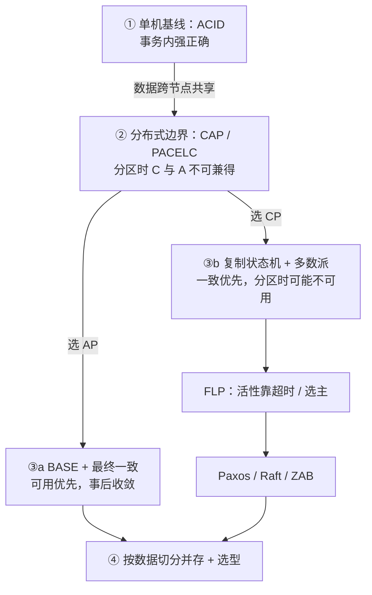
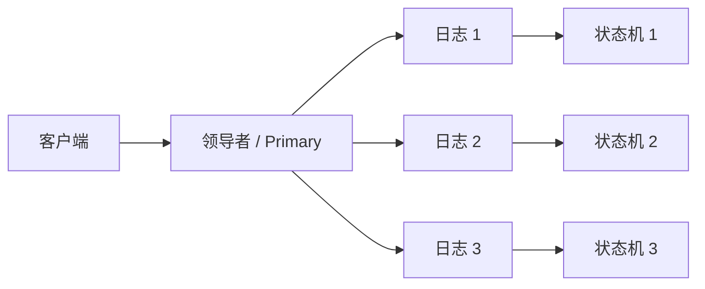

# 分布式一致性专论：ACID、CAP、BASE 与共识协议

> 单机时代用 **ACID** 把正确性收进事务边界；一旦数据跨节点共享，网络分区迫使我们在**强一致**与**持续可用**之间取舍——这是 **CAP**。取舍之后有两条工程路径：**AP → BASE（最终一致）**，或 **CP → 复制状态机 + 共识（Paxos / Raft / ZAB）**。
>
> 全文按这一条暗线展开：**先立单机基线，再看分布式边界，再分叉深入，最后谈并存与选型。** 定义尽量对齐一手文献，文末附参考文献。

先记住总纲：

> **ACID 回答「单机事务要什么」；CAP 回答「分布式还能不能全要」；BASE 回答「放弃强一致后怎么活」；共识协议回答「坚持强一致时怎么让多数派安全地同意」。**

---

## 目录

**上篇 · 取舍从何而来**

1. [一条主线：问题如何层层展开](#1-一条主线问题如何层层展开)
2. [单机基线：ACID](#2-单机基线acid)
3. [分布式边界：CAP 定理](#3-分布式边界cap-定理)
4. [CAP 的现代理解与常见误区](#4-cap-的现代理解与常见误区)

**中篇 · 两条路径**

5. [AP 路径与 BASE](#5-ap-路径与-base)
6. [最终一致性的客户端语义](#6-最终一致性的客户端语义)
7. [CP 路径与复制状态机](#7-cp-路径与复制状态机)
8. [FLP：为何共识必须借助超时](#8-flp为何共识必须借助超时)
9. [Paxos](#9-paxos)
10. [Raft](#10-raft)
11. [ZAB](#11-zab)
12. [Paxos / Raft / ZAB 对照](#12-paxos--raft--zab-对照)

**下篇 · 并存与落地**

13. [ACID 与 BASE 如何在同一系统并存](#13-acid-与-base-如何在同一系统并存)
14. [工程选型与使用场景](#14-工程选型与使用场景)
15. [总结](#15-总结)
16. [参考文献](#16-参考文献)

下图为全文暗线：先立单机 ACID，再看 CAP 边界，然后分叉为 BASE（AP）与共识（CP）。



---

## 1. 一条主线：问题如何层层展开

读本文时，请按「提问顺序」而不是「名词堆砌」来理解：

| 步骤 | 提问 | 回答它的理论 |
|------|------|--------------|
| **①** | 单机上，一次业务变更怎样才算「正确」？ | **ACID** |
| **②** | 数据复制到多台机器后，还能不能同时要「正确」与「一直能响应」？ | **CAP**（辅以 **PACELC**） |
| **③a** | 若宁可暂时不一致也要可用，系统怎么设计、客户端能看到什么？ | **BASE**、最终一致变体 |
| **③b** | 若必须强一致，多节点如何对同一命令序列达成唯一决定？ | **复制状态机**、**FLP**、**Paxos / Raft / ZAB** |
| **④** | 真实业务往往两者都要——如何切分、如何选型？ | 并存原则与场景对照 |

适用范围（全文通用）：

1. 讨论对象是**共享数据系统**：节点互联，并对同一逻辑状态提供读写或命令执行。[^gilbert-lynch-cap][^gilbert-lynch-perspectives]
2. **共识 ≠ 最终一致**：共识要求对某值 / 某日志槽位达成**唯一决定**；最终一致只承诺分歧会收敛。
3. Paxos / Raft / ZAB 默认**崩溃—恢复**模型（非拜占庭）：消息可丢、可迟、可重，但不被恶意篡改。

---

## 2. 单机基线：ACID

在引入网络之前，关系型数据库用 **ACID** 刻画事务应满足的性质。它是后续所有分布式取舍的**对照原点**：分布式并不是发明了「一致性」一词，而是把单机事务里「几乎可同时满足」的几件事拆开了。

| 字母 | 全称 | 含义 |
|------|------|------|
| **A** | Atomicity（原子性） | 事务中的操作要么全部生效，要么全部不生效；不存在「做到一半」的对外可见结果。 |
| **C** | Consistency（一致性） | 事务把数据库从一个**满足完整性约束**的状态变到另一个满足约束的状态（外键、唯一、业务不变量等）。 |
| **I** | Isolation（隔离性） | 并发事务互不干扰的程度；由隔离级别（读已提交、可重复读、可串行化等）调节。 |
| **D** | Durability（持久性） | 事务一旦提交，其结果在故障（如进程崩溃）后仍可恢复。 |

### 2.1 为何单机上 ACID「好用」

- 故障面集中：主要是本机进程与磁盘，而不是不确定的跨机网络。
- 协调成本低：锁、WAL、崩溃恢复都在同一信任域内完成。
- 程序员心智简单：用事务边界表达「要么成功，要么回滚」。

### 2.2 必须区分的两种「C」

| | ACID 的 C | CAP 的 C |
|--|-----------|----------|
| **含义** | 不破坏库内完整性约束 / 业务不变量 | 读到**最近一次成功写入**（偏线性一致） |
| **范围** | 一次事务提交后的状态合法性 | 多副本之间的即时可见性 |
| **常见混淆** | 以为满足 ACID 就自动满足 CAP 的 C | 多副本异步复制时，库仍可有 ACID 事务，但跨副本读可能旧 |

> **一句话**：ACID 管「这一笔事务在语义上对不对」；CAP 的 C 管「你读到的是不是集群认定的最新写」。二者相关，但不是同一个 C。[^gilbert-lynch-cap][^pritchett-base]

### 2.3 单机假设一旦被打破

当同一逻辑数据有多份副本、写与读可能落在不同节点时：

- 原子性要跨机 → 需要两阶段提交或补偿，失败模式变复杂；
- 隔离性要跨机 → 分布式锁 / 冲突检测成本陡增；
- 持久性要跨机 → 「写成功」要定义成写到几个副本；
- **一致性（CAP 意义）与可用性开始互斥**——这正是下一章 CAP 要形式化的边界。

---

## 3. 分布式边界：CAP 定理

### 3.1 历史：从猜想成为定理

| 时间 | 事件 | 说明 |
|------|------|------|
| 约 1998–1999 | Eric Brewer 提出 CAP 思想 | 源于宽域集群等实践中「可用性优先、事后调和」[^brewer-cap-twelve-years] |
| 2000 | Brewer 在 PODC 提出猜想 | Brewer's Conjecture [^brewer-podc-2000] |
| 2002 | Gilbert & Lynch 形式化证明 | 猜想成为定理 [^gilbert-lynch-cap] |

### 3.2 三条性质

| 字母 | 名称 | 含义 |
|------|------|------|
| **C** | Consistency | 读返回**最近一次成功写入**（或错误）；形式化上接近线性一致读写共享存储。[^gilbert-lynch-cap][^gilbert-lynch-perspectives] |
| **A** | Availability | **非故障节点**对请求在有限时间内给出响应。 |
| **P** | Partition Tolerance | 节点间消息可任意丢失或延迟；系统仍须给出明确的 C/A 策略。 |

直觉：写在分区一侧、读在另一侧——两侧都立刻应答，可能读不到最新写（牺牲 C）；坚持读到最新写，则一侧必须拒绝或阻塞（牺牲 A）。

### 3.3 为何工程上强调 CP / AP

真实多机网络无法从概率上消除分区。宣称同时保证 C 与 A 却否认 P，等于假设网络永不分裂。[^hale-sacrifice-pt]

| 组合 | 分区时的典型行为 | 相对 ACID 的直观 |
|------|------------------|------------------|
| **CP** | 部分请求失败 / 阻塞，直到法定人数恢复 | 更接近「宁可拒绝，也要保住类似强正确」 |
| **AP** | 继续应答，允许旧值或冲突，事后合并 | 明确放弃即时强一致，换持续服务 |
| **CA** | 仅在**假设不分区**时有意义 | 近似退回单机 / 单逻辑主库世界观 |

> 真正要问的不是标签，而是：**分区时停写，还是继续写并接受不一致。**

### 3.4 一句话

> 在可能发生网络分区的共享数据系统中，**不可能同时保证线性一致读写与对每个请求的持续可用性**。[^gilbert-lynch-cap]

---

## 4. CAP 的现代理解与常见误区

Brewer（2012）指出「三选二」容易误导：[^brewer-cap-twelve-years]

1. **分区少见**：无分区时应尽量同时做好 C 与 A。
2. **粒度很细**：不同子系统、操作、数据项可做不同选择——这为后文「ACID 与 BASE 并存」埋下伏笔。
3. **三者都是连续谱**：可用性有百分比；一致性有强弱；分区判定本身也可能不一致。

更可操作的问题是：如何检测分区、分区期间保 C 还是保 A、愈合后如何收敛 / 补偿 / 审计。

| 误区 | 更准确的说法 |
|------|----------------|
| 「永远只能保住两项」 | 定理约束的是**分区期间**的极限。[^brewer-cap-twelve-years] |
| 「可以放弃 P」 | 共享数据分布式系统不能假装网络完美。[^hale-sacrifice-pt] |
| 「一致性 = 最终相同」 | CAP 的 C 通常指强一致；最终一致是弱模型。[^gilbert-lynch-cap][^vogels-ec] |
| 「可用性 = 低延迟」 | CAP 的 A 是「能响应」；延迟是另一 SLA 维度。 |
| 「某产品永远 CP/AP」 | 读模式、超时、法定人数、客户端缓存都会改变实际体验。 |

**PACELC**（Abadi）：即使没有分区（Else），系统仍常在延迟（L）与一致性（C）之间权衡。[^abadi-pacelc]  
CAP 管「分区时怎么办」；PACELC 提醒「平时也要为延迟付账」。

---

> **至此，边界已清晰。**  
> 下面进入中篇：CAP 分叉后的两条路径——先走 **AP（BASE）**，再走 **CP（共识）**。两条路径不是互相否定，而是同一业务里常按数据切开使用（见第 13 节）。

---

## 5. AP 路径与 BASE

选定 **AP**，意味着分区期间允许暂时读到旧值或不完整视图。接下来要回答的不是「如何立刻全局一致」，而是：

1. 故障时如何仍**基本可用**？  
2. 如何容忍副本间的**中间状态**？  
3. 如何保证在无新更新时**最终收敛**？

**BASE** 正是对这些问题的工程语言。它由 eBay 的 Dan Pritchett（2008）系统阐述，标题即 *BASE: An ACID Alternative*——明确把自己放在与 ACID **对照、而非替换一切事务**的位置上。[^pritchett-base]

| 缩写 | 全称 | 要点 |
|------|------|------|
| **BA** | Basically Available | 允许局部失败、降级、变慢，但不让整体不可用 |
| **S** | Soft State | 允许副本间存在短暂中间态 |
| **E** | Eventually Consistent | 若一段时间无新更新，副本最终收敛 |

### 5.1 基本可用（Basically Available）

- **响应时间损失**：搜索从亚秒退化为数秒仍可返回。
- **功能损失**：大促关闭非核心入口，保住下单主链路。
- **故障隔离**：用户按库分片后，一台库故障只影响约 20% 用户，而非全站不可用。[^pritchett-base]

### 5.2 软状态（Soft State）

承认复制延迟与中间态；中间态不等于系统失败，只要业务规则与补偿能消化它。相对地，要求各副本「时刻呈现同一确定值」可称为硬状态——更接近强一致叙事。

### 5.3 最终一致性（Eventual Consistency）

若没有新更新，经过足够长时间（取决于延迟、负载、复制拓扑、冲突解决），所有副本收敛，客户端最终读到最新值。[^vogels-ec][^pritchett-base]

日常例子：关系库**异步主从复制**——复制完成前从库可能读旧值；这并不否定主库上的 ACID 事务，只是把「跨副本可见性」推迟了。

> **与 ACID 的关系（本路径）**：BASE 不是否定 ACID，而是说——在大规模分区数据上，**不必对每一次跨分区操作都用悲观的强一致事务收尾**；可用乐观设计换扩展性，再用应用层手段把状态拉回一致。[^pritchett-base]

---

## 6. 最终一致性的客户端语义

「最终一致」只描述终点。工程还必须约定：**收敛过程中客户端允许看到什么。** Vogels（2009）归纳了常用模型：[^vogels-ec]

| 模型 | 含义 | 典型诉求 |
|------|------|----------|
| **因果一致性** Causal | 若 A 的更新已「通知」到 B，则 B 后续访问基于该更新 | 「我告诉过你的变更，你不能装作没看见」 |
| **读己之所写** Read-your-writes | 写成功后，自己再读一定能看到自己的新值 | 改完资料立刻刷新 |
| **会话一致性** Session | 同一会话内提供读己之所写 | 会话粘滞到同一副本 |
| **单调读** Monotonic read | 一旦读到某版本，后续读不应更旧 | 时间不倒流 |
| **单调写** Monotonic write | 同一进程的写按序被系统串行化 | 避免后写被更早状态覆盖 |

读己写 / 单调读常依赖客户端粘滞，或客户端携带版本号丢弃过旧响应。[^vogels-ec]

---

## 7. CP 路径与复制状态机

选定 **CP**，意味着分区期间宁可拒绝部分请求，也要保住强一致。工程标准骨架是 **复制状态机（Replicated State Machine）**：[^ongaro-raft][^lamport-paxos-simple]

1. 客户端命令进入**复制日志**；  
2. 共识模块保证各副本日志最终包含**相同顺序的相同命令**；  
3. 确定性状态机按日志顺序执行 → 各副本状态与输出一致。

下图为复制状态机：客户端命令进入复制日志，各副本按同一顺序执行确定性状态机。



| 概念 | 说明 |
|------|------|
| **共识（Consensus）** | 对单个值达成一致：只选被提议的值；只选一个值；只有真正被选定后才可被学习。[^lamport-paxos] |
| **多数派 / 法定人数（Quorum）** | 任意两个多数派必相交 → 不会选出两个不同值。 |
| **原子广播（Atomic Broadcast）** | 向全体可靠投递同一消息序列；与共识在异步系统中可互相归约。ZAB 属此类。[^junqueira-zab] |
| **容错规模** | \(2f+1\) 节点通常可容忍 \(f\) 个崩溃（多数派可达时仍可推进）。 |

> **与 ACID 的关系（本路径）**：复制状态机追求的是——在分布式故障下，让集群**表现得像一台可靠的确定性服务器**。客户端眼中的「提交成功」，通常对应「命令已获多数派确认并进入可执行前缀」。这与单机 ACID 的「提交」不同构，但**目标相近：对外给出强正确的顺序状态演进**。

Paxos / Raft / ZAB 都在这一层，把「强一致复制」落成可实现的协议。在进入具体协议前，先看清一个理论上限：FLP。

---

## 8. FLP：为何共识必须借助超时

Fischer、Lynch、Paterson（1985）证明：在**完全异步**、进程可能崩溃、消息最终送达的模型中，**不存在**能同时保证安全性与必然终止性的确定性共识算法——即便只有一个进程可能故障。[^flp1985]

| 性质 | 能否绝对保证 | 工程含义 |
|------|--------------|----------|
| **安全性 Safety** | 可以 | 「绝不达成错误决定」——协议不变量必须守住 |
| **活性 Liveness** | 纯异步下不能仅靠确定性算法保证 | 实践用**超时、随机化、部分同步**推进 |

因此 Raft / Paxos / ZAB 都用超时选主：超时影响可用性与收敛速度；**不能**靠错误时钟破坏已提交结果的安全性（Raft 明确：timing 不用于保证日志一致性）。[^ongaro-raft]

---

## 9. Paxos

### 9.1 定位与出处

| 项目 | 内容 |
|------|------|
| **提出者** | Leslie Lamport |
| **经典文献** | *The Part-Time Parliament*（1998）[^lamport-parliament]；*Paxos Made Simple*（2001）[^lamport-paxos] |
| **解决什么** | 异步、非拜占庭网络中的共识；可经多实例构成复制状态机 |
| **家族** | Single-decree（单值）→ Multi-Paxos（日志序列，工程变体多） |

### 9.2 角色与安全目标

三类角色（可兼任）：**Proposer、Acceptor、Learner**。[^lamport-paxos]

1. 只有被提议的值可被选定；  
2. 至多选定一个值；  
3. 只有值真正被选定后才可被学习。

### 9.3 两阶段协议（Single-decree）

核心直觉：用**递增提案号** + **多数派承诺**，保证一旦某值被选定，更高号提案只能带同一值。

**Phase 1 — Prepare**

1. Proposer 选新提案号 \(n\)，向多数派发 Prepare(\(n\))。  
2. Acceptor 若未应答过更大号 Prepare，则承诺不再接受编号 \(< n\) 的提案，并返回曾接受的最高号提案（若有）。

**Phase 2 — Accept**

1. 收到多数派对 \(n\) 的响应后：提案值取响应中**最高号已接受提案的值**；若皆无，可自由选值。  
2. 发 Accept(\(n\), \(v\))；Acceptor 接受，除非已对更大号 Prepare 做过承诺。

值被多数派接受后即 **chosen**；Learner 经通知或再发起一轮获知。

### 9.4 Multi-Paxos 与工程现实

将共识实例编号为槽位 \(1,2,3,\ldots\)，即可实现状态机命令序列。[^lamport-paxos]  
稳态下选出 **distinguished proposer（Leader）** 后，多数槽位可跳过重复 Phase 1，主要支付 Phase 2 成本。

| 优势 | 局限 |
|------|------|
| 理论奠基深，正确性论述完整 | 单值抽象与「日志」直觉有距离 |
| 影响 Chubby 等一代系统 | Multi-Paxos 细节文献中常不统一 [^ongaro-raft] |
| 变体丰富（如 Fast Paxos） | 多 Proposer 活锁需靠选主保证进度 [^lamport-paxos] |

**典型场景**：强一致元数据 / 锁 / 配置内核；教学与形式化参照；数据库内部 Paxos 系模块。  
**选型提示**：从零做可维护日志复制，现代工程更常直接选 Raft；对接存量 Paxos 系或特定变体时再深入本家族。

---

## 10. Raft

### 10.1 定位与出处

| 项目 | 内容 |
|------|------|
| **提出者** | Diego Ongaro、John Ousterhout |
| **文献** | *In Search of an Understandable Consensus Algorithm*（USENIX ATC 2014）[^ongaro-raft] |
| **目标** | 与（multi-）Paxos **结果等价、效率相当**，但更易理解与实现 |
| **分解** | Leader 选举 + 日志复制 + 安全性（+ 成员变更） |

### 10.2 强领导者模型

- 日志只从 Leader 流向 Follower；  
- Leader 决定新条目位置；  
- Leader 失联后重新选举。  

三态：**Follower / Candidate / Leader**；时间切成 **term**，每 term 至多一位 Leader。

### 10.3 三个子问题

**(1) Leader 选举**  
超时无心跳 → 自增 term 成 Candidate 拉票；获多数成为 Leader 并发心跳；**随机化超时**降低分票。[^ongaro-raft]

**(2) 日志复制**  
客户端只写 Leader；Leader 追加并并行 AppendEntries；复制到多数派后 **commit** 并应用到状态机；用 `prevLogIndex/prevLogTerm` 对齐日志，禁止随意空洞。

**(3) 安全性**  
- **Election Restriction**：Candidate 日志须至少与投票者一样新，才能获票——新 Leader 必含已提交条目。[^ongaro-raft]  
- Leader 只追加、只向下游复制。  
- 对前任 term 条目的提交有额外限制。  

成员变更用 **Joint Consensus**：过渡期同时满足新旧配置多数派。[^ongaro-raft]

### 10.4 场景与边界

| 适合 | 说明 |
|------|------|
| 服务发现 / KV 共识层 | etcd、Consul 等 |
| 库的元数据 / 分片副本组 | 多数 NewSQL、存储引擎 |
| 自研协调组件 | 文档全、实现多、心智负担相对低 |

边界：写路径集中于 Leader；多数派不可达则不能提交（典型 CP）；Follower 直读可能旧——需租约读、线性一致读或只读 Leader。

---

## 11. ZAB

### 11.1 定位与出处

| 项目 | 内容 |
|------|------|
| **全称** | ZooKeeper Atomic Broadcast |
| **文献** | Junqueira、Reed、Serafini，*DSN 2011* [^junqueira-zab] |
| **载体** | Apache ZooKeeper 复制内核 |
| **问题形态** | **主备下的原子广播**，而非泛化的「任意节点提议单值」叙述 |

Primary 执行客户端操作，将增量事务经 ZAB 广播给 Backup；Backup 按序投递并应用。[^junqueira-zab][^hunt-zookeeper]

### 11.2 为何不能直接套用「朴素多槽 Paxos」叙述

1. 事务对前缀有**依赖**：投递 \(B\) 前必须已投递其所依赖前缀。  
2. 需要**多个 outstanding** 操作且保持前缀序。  
3. 按槽位独立达成一致时，可能选出**违反依赖**的序列；「批量 + 单飞行」又伤吞吐或延迟。[^junqueira-zab]

故强调 **Primary Order（主序）**，称 **PO atomic broadcast**。[^junqueira-zab]

### 11.3 三阶段

| 阶段 | 作用 |
|------|------|
| **Discovery** | 法定人数支持下确立 epoch 与 Primary |
| **Synchronization** | 新主与多数派对齐历史；**完成前不广播新变更** |
| **Broadcast** | 广播新事务，多数确认后 commit |

事务标识常为 **(epoch, counter)**，便于快速判断缺什么、从谁恢复。[^junqueira-zab]

### 11.4 与 ZooKeeper 对外语义

写路径依赖 ZAB 总序；**默认读**可走任意节点，可能稍旧；更强一致读需 `sync` 等——**写偏 CP，读可放宽**。[^hunt-zookeeper]

**典型场景**：选主、锁、配置、小规模强一致元数据。  
ZAB 深度绑定 ZK 事务模型；新系统若只需通用复制日志，更常选 Raft。

---

## 12. Paxos / Raft / ZAB 对照

| 维度 | Paxos | Raft | ZAB |
|------|-------|------|-----|
| **问题抽象** | 单值共识 → 多实例日志 | 复制日志共识 | Primary-backup 原子广播 |
| **领导模型** | 可优化为 distinguished proposer | **强 Leader** | **单一 Primary** |
| **核心阶段** | Prepare / Accept | 选举 + AppendEntries | Discovery / Sync / Broadcast |
| **顺序重点** | 每槽位安全选定 | 无空洞日志 + 选举限制 | **Primary order** + 依赖前缀 |
| **代表系统** | Chubby 等（Paxos 系） | etcd、Consul、TiKV 等 | ZooKeeper |
| **CAP 取向** | 多数派提交 → 偏 CP | 同左 | 同左（写路径） |

三者共同点：多数派、崩溃—恢复下保安全、用超时 / 选主换活性。

---

## 13. ACID 与 BASE 如何在同一系统并存

上篇立了 ACID，中篇分别走完 AP 与 CP。落到真实系统，关键不是「站队」，而是**按数据与操作切开**。

### 13.1 对照：不是互相消灭，而是光谱两端

| 维度 | 更靠近 ACID / CP | 更靠近 BASE / AP |
|------|------------------|------------------|
| **心态** | 操作结束时强制一致 | 接受暂时不一致，事后收敛 |
| **机制** | 单机事务、同步复制、共识提交 | 异步复制、降级、补偿、对账 |
| **代价** | 锁、协调、法定人数延迟 | 应用复杂：幂等、冲突合并、审计 |
| **适合** | 资金、强约束库存、主从切换、监管 | 足迹、计数、推荐候选、可补偿通知 |

Pritchett 把 BASE 写成 *An ACID Alternative*，用意是：**在分区与规模压力下，为可用性打开设计空间**；并不是宣称账本也可以随便最终一致。[^pritchett-base]

### 13.2 并存的典型切法

```text
下单请求
  ├─ 库存扣减 / 支付记账  → 强约束（ACID 事务或 CP 共识 / 严谨对账）
  ├─ 订单主状态           → 通常强一致或可控的短窗口一致
  └─ 积分、消息、搜索索引 → BASE：异步投递 + 最终一致 + 补偿
```

### 13.3 设计时只问三件事

对每一类数据固定回答：

1. **错了的代价**是什么？（钱、合规、用户信任 vs 体验瑕疵）  
2. **多久必须收敛**？（秒级 / 分钟 / 日终对账）  
3. **谁负责补偿**？（数据库约束、共识层、还是应用与对账任务）

> **主题回收**：ACID 是单机正确性基线；CAP 逼出分叉；BASE 与共识是两条实现路径；并存原则决定你在地图上落在哪一段光谱。

---

## 14. 工程选型与使用场景

### 14.1 决策顺序（与第 1 节主线对齐）

```text
业务代价
  → 要不要跨节点共享写？
    → 要：进入 CAP 取舍
        → 错不起：偏 CP → 要不要多数派共识？→ Raft / ZK(ZAB) / Paxos 系
        → 可补偿：偏 AP → BASE + 明确客户端语义
    → 不要：能单机 / 单分片事务解决则优先 ACID，别为了分布式而分布式
```

### 14.2 策略速查

| 业务问题 | 策略 | 机制方向 |
|----------|------|----------|
| 错了比慢更贵 | 偏 **CP** | 共识、同步复制、严谨对账 |
| 慢了比错更贵且可补偿 | 偏 **AP + BASE** | 异步复制、合并、降级 |
| 平时要低延迟 | 参考 **PACELC** | 可调一致性、本地读 + 异步修 |

### 14.3 协调组件对照

| 系统 | 协议取向 | 分区时直觉 | 适合 |
|------|----------|------------|------|
| **ZooKeeper** | ZAB，写偏 CP | 无多数派则写困难 | 选主、锁、协调 |
| **etcd / Consul** | Raft，偏 CP | 无多数派则不能提交 | 服务发现、KV、配置 |
| **Eureka** | 非多数派共识，偏 AP | 可返回陈旧注册表 | 可接受短暂脏读的发现 |

> **纠正**：Consul 不是 CA；共识层基于 Raft，法定人数不足时写入不可用。[^hashicorp-consul]

### 14.4 协议怎么选

| 需求 | 更合适 | 原因 |
|------|--------|------|
| 自研强一致复制日志 | **Raft** | 规范完整、生态成熟 |
| 已有 ZK 生态 | **ZAB（经 ZK）** | 协调语义开箱即用 |
| 存量 Paxos 系 / 特定变体 | **Paxos 家族** | 共同语言与历史实现 |
| 业务可最终一致 | **不要强行上共识** | 共识有法定人数与延迟成本 |

### 14.5 实践原则

1. 共识集群宜小（常见 3 或 5 节点）。  
2. 不要用共识替代消息队列。  
3. 读模型（Leader / 租约 / 最终一致）必须写进契约。  
4. 跨机房 RTT 会直接拉高选举与提交延迟。  
5. 正确性优先于巧妙旁路优化。

---

## 15. 总结

按主线回收全文：

1. **ACID** 给出单机事务正确性基线；其 C 与 CAP 的 C 不是同一概念。  
2. **CAP** 界定分区下强一致与可用性的极限；工程必须正视 **P**。[^gilbert-lynch-cap][^brewer-cap12][^hale-cpt]  
3. **PACELC** 提醒无分区时仍常在延迟与一致性之间权衡。[^abadi-pacelc]  
4. **BASE + 最终一致语义** 是 **AP 路径**的工程语言。[^vogels-ec][^pritchett-base]  
5. **复制状态机 + 多数派共识** 是 **CP 路径**的标准骨架；**FLP** 说明活性依赖超时等假设。[^ongaro-raft][^lamport-paxos][^flp1985]  
6. **Paxos / Raft / ZAB** 分别从单值共识、可理解日志复制、主备原子广播逼近同一目标。[^ongaro-raft][^lamport-paxos][^junqueira-zab]  
7. **真实系统按数据并存**：账本偏 ACID/CP，可补偿链路偏 BASE/AP。  
8. **选型顺序**：业务代价 → 是否共享写 → CP/AP → 是否需要共识 → 选具体协议。

---

## 16. 参考文献

[^gilbert-lynch-cap]: Seth Gilbert, Nancy Lynch. "Brewer's Conjecture and the Feasibility of Consistent, Available, Partition-Tolerant Web Services." *ACM SIGACT News*, 33(2), 2002. DOI: [10.1145/564585.564601](https://doi.org/10.1145/564585.564601)

[^gilbert-lynch-perspectives]: Seth Gilbert, Nancy Lynch. "Perspectives on the CAP Theorem." *IEEE Computer*, 45(2), 2012. [PDF](https://groups.csail.mit.edu/tds/papers/Gilbert/Brewer2.pdf)

[^brewer-cap12]: Eric Brewer. "CAP Twelve Years Later: How the 'Rules' Have Changed." *IEEE Computer*, 45(2), 2012. DOI: [10.1109/MC.2012.37](https://doi.org/10.1109/MC.2012.37)

[^brewer-podc2000]: Eric A. Brewer. "Towards Robust Distributed Systems." Invited Talk, *PODC 2000*.

[^hale-cpt]: Coda Hale. "You Can't Sacrifice Partition Tolerance." 2010. [https://codahale.com/you-cant-sacrifice-partition-tolerance/](https://codahale.com/you-cant-sacrifice-partition-tolerance/)

[^vogels-ec]: Werner Vogels. "Eventually Consistent." *ACM Queue* / *CACM*, 2009. [https://queue.acm.org/detail.cfm?id=1466448](https://queue.acm.org/detail.cfm?id=1466448)

[^abadi-pacelc]: Daniel J. Abadi. "Consistency Tradeoffs in Modern Distributed Database System Design: CAP is Only Part of the Story." *IEEE Computer*, 45(2), 2012.

[^hashicorp-consul]: HashiCorp. Consul Consensus / Raft. [https://developer.hashicorp.com/consul/docs/concept/consensus](https://developer.hashicorp.com/consul/docs/concept/consensus)

[^pritchett-base]: Dan Pritchett. "BASE: An ACID Alternative." *ACM Queue*, 6(3), 2008. [https://queue.acm.org/detail.cfm?id=1394128](https://queue.acm.org/detail.cfm?id=1394128)

[^ongaro-raft]: Diego Ongaro, John Ousterhout. "In Search of an Understandable Consensus Algorithm." *USENIX ATC 2014*. [https://raft.github.io/raft.pdf](https://raft.github.io/raft.pdf)

[^lamport-paxos]: Leslie Lamport. "Paxos Made Simple." *ACM SIGACT News*, 32(4), 2001. [https://www.lamport.org/pubs/paxos-simple.pdf](https://www.lamport.org/pubs/paxos-simple.pdf)

[^junqueira-zab]: Flavio P. Junqueira, Benjamin C. Reed, Marco Serafini. "Zab: High-performance Broadcast for Primary-Backup Systems." *DSN 2011*. DOI: [10.1109/DSN.2011.5958223](https://doi.org/10.1109/DSN.2011.5958223)

[^flp1985]: Michael J. Fischer, Nancy A. Lynch, Michael S. Paterson. "Impossibility of Distributed Consensus with One Faulty Process." *Journal of the ACM*, 32(2), 1985. DOI: [10.1145/3149.214121](https://doi.org/10.1145/3149.214121)

[^lamport-parliament]: Leslie Lamport. "The Part-Time Parliament." *ACM TOCS*, 16(2), 1998.

[^hunt-zookeeper]: Patrick Hunt et al. "ZooKeeper: Wait-free Coordination for Internet-scale Systems." *USENIX ATC 2010*.

[^zookeeper-docs]: Apache ZooKeeper 文档：Zab / Internals（宜与 [^junqueira-zab] 对照）。

---

**作者说明**：本次调优重点是理顺主题脉络——以 ACID 为单机基线，经 CAP 分叉为 BASE 与共识两条路径，再在并存与选型处回收。转载请保留参考文献。
