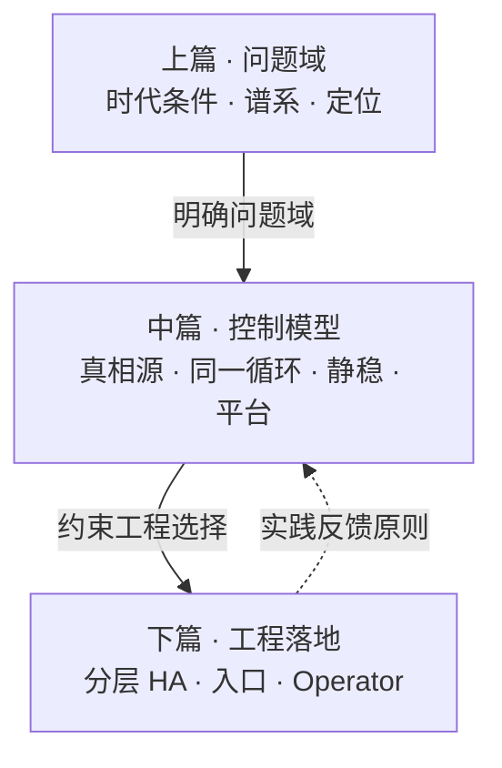
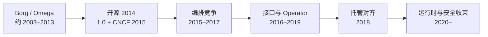
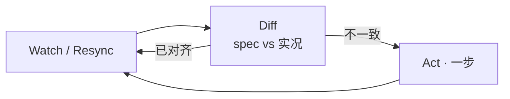
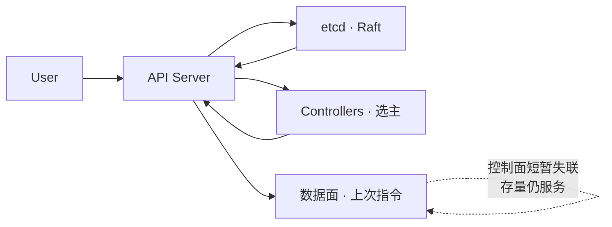
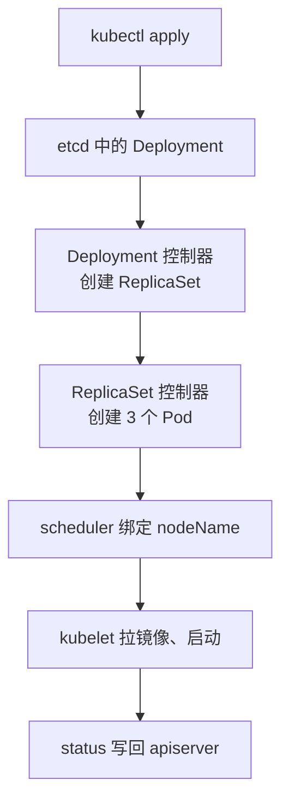
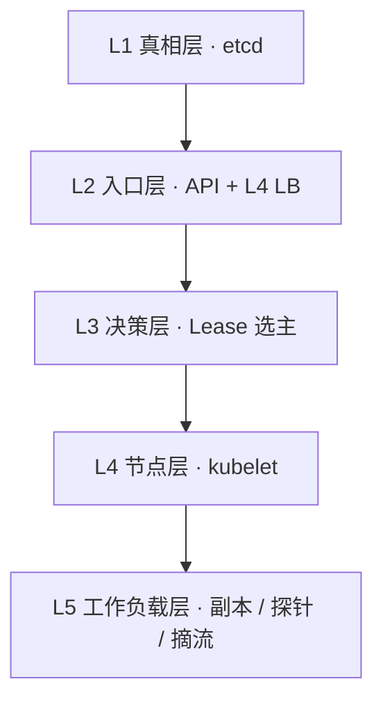

# Kubernetes 控制面原则：声明式 API、控制循环与分层自愈

> Kubernetes 之名源于希腊语，意为「舵手 / 飞行员」。Google 于 2014 年开源该项目，将十余年 Borg / Omega 生产经验凝练为可对外使用的容器编排平台。社区简称 **K8s**；七边形 logo 致敬内部代号 Project Seven of Nine。[1][6][27]

先记住总纲：

> **Kubernetes 不是一次性编排脚本，而是一台「分布式控制计算机」：**  
> 以 etcd 为真相源，以声明式 API 为协调语言，以可失败的控制循环持续逼近期望态；控制面短暂失联时，数据面尽量按上次指令继续服务。  
> 调度、自愈、服务发现、滚动发布，并不是四套魔法——**驱动这一切的，是同一个调谐循环。**[1][11][12][18]

全文可与本库 [《服务架构演进》](./21-service-architecture-evolution.md)（复杂度如何转移）、[《分布式一致性专论》](./22-distributed-consistency-treatise.md)（CAP / Raft）、[《Calico 三层网络专论》](./24-calico-l3-dataplane-treatise.md)（网络控制面如何写表；kubelet 经 CNI 调用插件）对照阅读。更长的容器与云原生时间线见 [《云计算发展编年史》](../10-chronicle/10-computing-cloud-chronicle.md) §8。关键史实与论断尽量对齐一手文献，文末附参考文献。

## 摘要

Kubernetes 应被理解为持续收敛的分布式控制计算机，而不是一次性编排脚本。etcd 为真相源，声明式 API 为协调语言；每个控制器只问「世界应该什么样 / 现在实际上什么样」，不一致就走一步，然后永远再问一遍。调度、自愈、服务发现与滚动发布，都是这同一个调谐循环作用在不同对象上。控制面可以短暂失败，数据面按上次指令尽量保持静态稳定。全文分三篇：上篇划定问题域与 Borg → Omega 谱系；中篇收束控制模型（一份真相、同一循环、静态稳定、平台的平台）；下篇落到分层高可用、控制面入口、CRD / Operator 与能力边界。可与本库 21、22、24 对照：编排原则、一致性取舍与网络写表是同一台控制计算机的不同平面。

**关键词：** Kubernetes；声明式 API；调谐循环；etcd；静态稳定；CNCF

---

## 目录

- [摘要](#摘要)

**上篇 · 问题域与谱系**

1. [为何需要编排平面](#1-为何需要编排平面)
2. [谱系：Borg → Omega → Kubernetes](#2-谱系borg--omega--kubernetes)
    - [2.1 三代系统](#21-三代系统) · [2.2 开源到默认底座](#22-开源到默认底座) · [2.3 年表](#23-年表) · [2.4 何以成为默认底座](#24-何以成为默认底座)
3. [定位：是什么、不是什么](#3-定位是什么不是什么)

**中篇 · 控制模型**

4. [前提与核心理念](#4-前提与核心理念)
5. [一份真相与松耦合协调](#5-一份真相与松耦合协调)
6. [持续收敛与静态稳定](#6-持续收敛与静态稳定)
    - [6.1 持续收敛](#61-持续收敛而非一次成功的剧本) · [6.2 调谐循环](#62-调谐循环驱动一切的同一个循环) · [6.3 静态稳定](#63-静态稳定static-stability)
7. [控制平面与设计原则](#7-控制平面与设计原则)
    - [7.1 组件](#71-组件与高可用形态) · [7.2 声明式与调谐](#72-声明式与调谐) · [7.3 设计原则](#73-设计原则精要) · [7.4 同一循环](#74-同一循环从-apply-到自愈)

**下篇 · 工程落地**

8. [分层高可用](#8-分层高可用)
9. [控制面入口](#9-控制面入口)
10. [扩展模型：CRD 与 Operator](#10-扩展模型crd-与-operator)
11. [能力边界与检查清单](#11-能力边界与检查清单)

**收束**

12. [总结](#12-总结)
13. [参考文献](#13-参考文献)

全文按「问题域 → 控制模型 → 工程落地」展开。原则先于技巧——否则容易把 YAML、组件名与营销口号当成定律。



---

## 1. 为何需要编排平面

若数据中心是港口、容器是标准化集装箱，则 Kubernetes 是港口的调度系统：船停哪个泊位、货物怎么装卸、出故障怎么办、流量暴增时怎么扩容。它不制造箱子，它决定这些箱子能不能规模化运行。

它出现在三股潮流交汇处：

| 潮流 | 内容 | 对编排的含义 |
|------|------|--------------|
| **云可编程** | 计算 / 存储 / 网络变成 API 驱动的弹性自助服务 | 基础设施可被更高层系统「编写」与组合 |
| **容器不可变** | 镜像成为版本化制品；发布等于替换，而非就地打补丁 | 运行单元可被声明、调度、批量替换 |
| **复杂度下沉** | 微服务把应用复杂度切开后，运维复杂度上涌（见本库服务架构演进） | 需要把发现、扩缩、自愈从应用层**下沉到基础设施** |

2013 年 Docker 把容器从运维黑科技变成开发者日常工具：同一个镜像，在笔记本、CI 和生产里运行结果一致。一台机器上几个容器很容易管——**一个容器是一个程序；一群容器是一个运维问题。** 一旦跨越多台机器，问题立刻成套出现：[1][11]

| 问题 | 若无编排平面 |
|------|----------------|
| **放置** | 哪台主机该跑哪个容器？ |
| **故障** | 主机挂了，谁来补上？ |
| **发现** | IP 每次重建都变，容器如何找到对方？ |
| **发布** | 如何零停机换版？新版本坏了如何回滚？ |

这四问有一个共同答案：把期望写进声明，交给持续运行的控制循环。谁把它做成通用平台，谁就有机会成为云基础设施的标准。

上一代「命令式编排 / 手工剧本」在规模下成本急剧上升：故障组合爆炸，逐步脚本既不经济，也不诚实。行业需要的不是更长的 Runbook，而是**把故障当成稳态输入、用持续收敛代替一次性剧本**的控制平面。

> **判断**：Kubernetes 应时而生——不是发明了容器，而是为「可编程云 + 不可变制品 + 微服务后的运维洪峰」提供了编排与自愈平面。Docker 解决打包；它补上规模化运维。

---

## 2. 谱系：Borg → Omega → Kubernetes

下图为谱系主线：内部生产经验外溢为开源平台，再经治理、接口与云厂商对齐，收束成默认编排底座。



### 2.1 三代系统

Burns / Grant / Oppenheimer 区分了 Google 内部三代容器管理系统：[2]

| 系统 | 时期 | 定位 |
|------|------|------|
| **Borg** | 约 2003–2004 起 | 内部大规模集群管理：数千应用、数十万作业、多集群、数万台机器。[3] |
| **Omega** | 约 2013 前后 | 共享持久状态 + 乐观并发，控制面拆为对等组件。[2][4] |
| **Kubernetes** | 2014 开源，2015 达 1.0 | 面向外部开发者与公有云；吸收前两代经验，**并非 Borg 源码开源**。[2] |

Brian Grant 指出：Kubernetes「更像开源的 Omega，而非开源的 Borg」；Scheduling Unit 等概念随后演进为 Pod。[5]

它继承了 Borg 的若干本能，最明显的是把一组紧密协作的容器当作一个调度单元（Borg 称 alloc，Kubernetes 称 **Pod**）。同时刻意改进 Borg 的局限：Borg 主要用相对僵硬的 Job 分组工作，Kubernetes 用 Label / Selector 组织对象，并更强调声明式期望态——你描述想要什么，系统努力去实现它。[2]

从分布式视角，三代留下三条遗产：

1. **共享集群状态**作为协调枢纽；
2. **异步控制器**监视变化并写回观测；
3. Kubernetes 的关键升级：状态**不直接暴露存储**（有别于 Omega 让受信组件直连共享状态），而必须经 **REST API** 完成版本、校验与策略。[2]

### 2.2 开源到默认底座

**开源与中立治理（2013–2015）。** 2013 年夏，Joe Beda、Brendan Burns、Craig McLuckie 向领导层提议：把 Borg / Omega 经验做成开源容器管理系统。内部代号 Project Seven of Nine，致敬《星际迷航》九之七，这也是 logo 七条边的来历。[27] 2014-06-06 首个 commit 落地；6 月 10 日 Eric Brewer 在 DockerCon 宣布。行业通常把 6 月 6 日当作生日。[6]

2015-07-21 发布 1.0，并捐赠给新成立的 CNCF（Linux 基金会托管）。[6][7] 象征意义大于版本号：若仍是「Google 的开源项目」，竞争对手会犹豫；落到中立基金会之下，Red Hat、IBM、Intel、VMware，以及后来的 AWS 与微软，都更愿意押注。CNCF 的目标从来不只是发展 Kubernetes，而是推进整个云原生栈。约一个月后，2015-08-26，Google Container Engine（后来的 GKE）达到 GA——云厂商开始把「我们帮你运行控制平面」当作产品来卖。[28]

到 1.0，最小闭环已经在：

| 概念 | 含义 |
|------|------|
| **Pod** | 最小调度单元：可容纳一个或多个紧密协作容器 |
| **Node** | 一台工作机器（物理或虚拟） |
| **Service** | 变化的一组 Pod 前面的稳定访问点 |
| **Label / Selector** | 给对象打标签再按标签过滤 |
| **声明式 API** | 声明期望副本数，由系统收敛，而非手工 SSH |

人们后来习以为常的 Deployment、DaemonSet、StatefulSet、Ingress、成熟 RBAC，都是 1.0 之后长出来的。1.0 更像「可用的最小闭环」：证明编排可以成为平台。

**编排竞争（2015–2017）。** 市场上至少有三大竞争者：Docker Swarm（与 Docker 集成最紧、最好上手）、Apache Mesos + Marathon（更老牌，擅长超大规模与异构负载）、Kubernetes（学习曲线陡，但模型完整且可扩展）。Nomad 等也在混战。媒体后来称之为「编排战争」。Kubernetes 获胜不是某个单一开关，而是多股力量叠加：Google 的生产可信度与 CNCF 的中立治理；设计良好的 API 与扩展点；监控、网络、存储、CI/CD、安全工具优先支持它；云厂商排队站队。高潮出现在 2017-10 DockerCon Europe：Docker 宣布在 Swarm 之外原生支持 Kubernetes。[31] Swarm 没有一夜消失，Mesos 仍活在某些细分领域，但行业已经知道默认答案是什么。2017-11-13，CNCF 启动 Certified Kubernetes Conformance：自称 Kubernetes 的发行版须通过测试套件，保证核心 API 行为一致，避免严重的 Unix / Android 式碎片化。[32]

**工作负载 API 与可插拔接口（2016–2019）。** `apps/v1`（Deployment、DaemonSet、ReplicaSet、StatefulSet）于 1.9（2017-12-15）达 GA——常见应用形态有了稳定的一等公民 API。[30] RBAC 于 1.8（2017-09）GA，把集群从共享特权账号的机器集合，变成有门禁的系统。NetworkPolicy 于 1.7（2017-06）达 `networking.k8s.io/v1` stable；1.8 增加 egress 策略。更关键的是可插拔合同：CRI 随 1.5（2016-12）以 Alpha 引入；CNI 把容器网络交给插件（Kubernetes 采用该合同，而非自造网络栈）；CSI 随 1.13（2018-12）达 GA。[29][34] 三者的战略价值超过几乎任何单个功能——网络、存储、运行时厂商可以在不修改内核的情况下加入竞争。

CRD 由 ThirdPartyResource 重设计而来，1.7 入 beta，1.16（2019）以 `apiextensions.k8s.io/v1` 达 GA。[30][35] 2016-11-03，CoreOS 提出 Operator 模式：把部署、备份、故障转移、升级的专家经验，编码进监视自定义资源的控制器；当时 CRD 未稳，早期实现更多依赖 TPR。[36] CRD 成熟后，Operator 几乎都迁到这条路上。Deployment 让「三个相同的 Web 副本」保持存活；Operator 让「这个有状态系统以专家期望的方式保持存活」。

**托管对齐（2018）。** Amazon EKS 于 2018-06-05 GA，Azure AKS 于 2018-06-13 GA；加上 2015 年已 GA 的 GKE，三大云都提供托管 Kubernetes。[33] 对企业意味着：学一套模型，就能在多个云上说话。差异更多落在周边服务、网络和身份上，而不是「必须再学第三个编排器」。Kubernetes 不能完全消除锁定，但大幅降低了「应用怎么运行」这一层的锁定。一致性认证让托管服务更像同一种语言的不同口音。

**运行时、安全与入口演进（2020–）。** 许多人曾以为「Kubernetes = 用 Docker 跑容器」。实际上它依赖的是容器运行时接口；为兼容 Docker，kubelet 曾内置 dockershim。该垫片于 1.20 弃用，1.24（2022-04）移除，标准收束到 OCI / CRI。[37] 终端用户仍可用 Docker 构建镜像；变化主要影响节点上由哪个运行时来跑容器。PodSecurityPolicy 于 1.21 弃用、1.25 移除，代以更简单的 Pod Security Admission（给 Namespace 打标签，套 Privileged / Baseline / Restricted）；更细的需求交给 OPA / Gatekeeper 或 Kyverno 等外部引擎。[37] 方向明确：默认更安全，机制里更少魔法。

入口侧，Ingress 简单但扩展碎片化（annotation 行为随实现而异）。Gateway API 于 2023-10-31 发布 v1.0，`Gateway`、`GatewayClass`、`HTTPRoute` 达 stable，把「基础设施如何提供入口」与「应用如何声明路由」分开。[38] Ingress 不会一夜消失，新项目越来越默认走 Gateway API。与此同时，大模型把 GPU / TPU 与大规模作业调度推回舞台中央。约 2023-11，Google 公开用 GKE 及相关能力调度一次 50,944 颗 TPU v5e 芯片的分布式训练作业。[39] Kubernetes 不是为 LLM 发明的，但眼下是多数组织够得着的、足够通用的集群底座。安全、可观测与平台工程则不断把它藏到自助服务后面：开发者可能永远不直接碰集群，平台团队几乎总是在它之上构建。

### 2.3 年表

| 时间 | 事件 |
|------|------|
| 约 2003 起 | Borg 大规模管理容器化工作负载。[3] |
| 2013 | Docker 成为开发者日常工具；Kubernetes 以 Project Seven of Nine 起步。[27] |
| 2014-06-06 | 首个 commit；2014-06-10 Eric Brewer 在 DockerCon 宣布。[6] |
| 2015-07-21 | Kubernetes 1.0；捐赠新成立的 CNCF。[6][7] |
| 2015-08-26 | Google Container Engine（后来的 GKE）GA。[28] |
| 2016-11-03 | CoreOS 提出 Operator。[36] |
| 2016-12 | CRI Alpha（1.5）。[29] |
| 2017-06 / 09 | NetworkPolicy GA（1.7）；RBAC GA（1.8）。[30] |
| 2017-10 | Docker 宣布原生支持 Kubernetes。[31] |
| 2017-11-13 | CNCF 启动 Certified Kubernetes Conformance。[32] |
| 2017-12-15 | 1.9，`apps/v1` 核心工作负载 API GA。[30] |
| 2018-06 | EKS（06-05）、AKS（06-13）GA。[33] |
| 2018-12 | 1.13，CSI GA（官方 GA 说明文 2019-01）。[34] |
| 2019 | 1.16，CRD 以 `apiextensions.k8s.io/v1` GA。[35] |
| 2020–2022 | dockershim 于 1.20 弃用、1.24 移除；PSP 移除；Pod Security Admission 于 1.25 稳定。[37] |
| 2023-10-31 | Gateway API v1.0，核心资源稳定。[38] |
| 2023-11 | 公开报道：GKE 调度 50,944 颗 TPU v5e 的分布式训练作业。[39] |
| 2024– | 开源十周年；继续向 AI、多集群、平台工程推进。[6] |

### 2.4 何以成为默认底座

回看这十几年，胜利可以压成四个因素：

| 因素 | 含义 |
|------|------|
| **时机** | Docker 解决打包，它补上规模化运维 |
| **经验** | 十几年 Borg 伤痕换来更清晰的抽象（Pod、声明式、Label） |
| **治理** | 交给 CNCF，让竞争对手也愿意共建 |
| **接口** | CRI / CNI / CSI 加上 CRD / Operator，让其他人能在它之上继续建设 |

它从来不是「简单」的。学习曲线陡，YAML 冗长，生产事故可以很戏剧化——这些都是合理的抱怨。基础设施很少因为无懈可击而赢；它赢在足够通用、足够可扩展、有足够强的生态。监控、service mesh、GitOps 与平台工程，大多是在这座港口上加建的码头、吊机和海关。展望未来，港口不会消失，但会越来越不像开发者每天面对的栈桥。

> **判断**：开源的不是 Borg 的源码外壳，而是「规模下故障是常态」这一工程假设——把内部生产经验，变成外部可复用的控制模型。未来十年更可能发生的，不是从零再建一个新港口，而是把这座港口建得更高更深。

---

## 3. 定位：是什么、不是什么

### 3.1 定义

Kubernetes 是可移植、可扩展的**开源平台**，用于管理容器化工作负载与服务，同时支持**声明式配置**与**自动化**。[1]

生产集群由**控制平面**与多台**工作节点**组成；二者均横向复制，以提供容错与高可用。[18]

### 3.2 核心能力（节选）

| 能力 | 含义 |
|------|------|
| 服务发现与负载均衡 | DNS / VIP；分散流量 |
| 存储编排 | 自动挂载所选存储 |
| 自动发布与回滚 | 按期望态受控推进 |
| 自动装箱 | 按资源请求摆放容器 |
| 自愈 | 重启、替换、按健康检查摘流 |
| 水平扩展 | 命令、UI 或指标驱动扩缩 |
| 可扩展设计 | 不必改上游即可扩展 |

### 3.3 明确边界

- **不是**大而全 PaaS——提供积木，保留用户选择权。[1]
- **不是**传统编排器——编排是「先 A 再 B 再 C」；Kubernetes 是独立可组合的控制过程，持续把当前态推向期望态。[1]

| 类别 | 典型组件 | 边界 |
|------|----------|------|
| 网络 / DNS | Calico、Cilium、CoreDNS | 插件实现；kubelet 经 CNI 调用。Calico 合同见 [《Calico 三层网络专论》](./24-calico-l3-dataplane-treatise.md) §2.5 |
| 工作负载入口 | Ingress、**Gateway API**、云 LB、MetalLB | 业务流量，**非**控制面入口。Gateway API 为下一代入口，见 §2.2 |
| 可观测 / 网格 | Prometheus、Istio | 周边生态 |

> **要点**：Kubernetes 管「如何声明与收敛」；生态管「具体实现插件」。核心价值是**同一个调谐循环**（§6.2 / §7.4），而非中心化剧本。

---

## 4. 前提与核心理念

### 4.1 云基础设施的三个前提

Kubernetes 能成立，建立在云把基础设施「产品化」之后的三个前提之上：

| 前提 | 含义 |
|------|------|
| **可编程** | API 驱动；可堆叠更高抽象 |
| **声明式** | 用户描述结果，平台负责路径——降低分布式协调复杂度 |
| **不可变** | 以版本化制品**替换**运行单元，避免配置漂移[1] |

与「不可变」相关、不可混谈：**无侵入性**（通常无需改业务代码适配）[8]；**PV / PVC**（屏蔽存储差异，有状态亦可迁移）[9]。

### 4.2 Platform for Platform

Kubernetes 的定位是 **Platform for Platform**——用来构建分布式系统的分布式系统。首要用户是分布式应用开发者。

「平台之平台」意味着：不把所有领域知识写死在核心里，而把**声明与收敛的能力**开放出去。上层经 CRD / Operator 扩展，而不必每次重造控制平面。官方要求与此一致：可扩展、可自动化；声明式是自愈的关键。[8]

机制上对应两层接口：CRI / CNI / CSI 让运行时、网络、存储可插拔（核心当裁判，不当全部运动员）；CRD / Operator 让领域对象与运维知识可外挂。这是编排竞争第二回合的胜负手，工程细节见 §10。[29][34][36]

> **判断**：复杂度不会消失，只会转移——Kubernetes 把「如何协调分布式」收成平台能力，把「协调什么」留给领域。

---

## 5. 一份真相与松耦合协调

若只用「容器编排」理解 Kubernetes，会错过真正难点。它首先是一台**分布式控制系统**。

### 5.1 一份共享真相源（CP）

全部对象落在 **etcd**（强一致键值存储）。[18][19]

- 共识：**Raft**；写入须多数派确认（quorum = \(\lfloor n/2\rfloor + 1\)）；[20][21]
- CAP 语言下偏向 **CP**：多数派不可达时，**宁可停写，也不交出两份互相矛盾的真相**。[19][20]

> **纪律一**：关于「集群应该是什么样」的真相，只能有一份。

### 5.2 唯一协调语言（API 松耦合）

Omega 曾让受信组件直连存储；Kubernetes 改为：**仅 API Server 访问 etcd**，其余一律经 API。[2][12]

- 组件**互不直连**，只通过 `spec` / `status` 对话；
- 可独立升级、失败、重启；
- 新控制器理解 API 即可加入协调网络。

模式：**控制逻辑松耦合 + 状态强一致共享**。结构统一（`apiVersion` / `kind` / `metadata` / `spec` / `status`），横切策略可忽略资源语义差异；控制面透明，无隐藏内部 API。[12]

---

## 6. 持续收敛与静态稳定

中篇的枢纽在这里。你在清单里写下工作负载的期望态——「这个镜像在负载均衡后面跑 3 个副本」——然后 Kubernetes 运行一组控制器，持续把集群的实际状态推向期望状态。后面所有组件、自愈与 Operator，都是这个循环的实例。[11][12][40]

### 6.1 持续收敛，而非一次成功的剧本

| 对比项 | 传统编排器 | Kubernetes |
|--------|------------|------------|
| 执行模型 | 按步骤推进 | 按偏差调谐 |
| 成功标准 | 走完剧本 | 持续逼近期望 |
| 稳态假设 | 可静止稳态 | 可能长期达不到完全稳态[11] |

官方用恒温器作类比：你设定目标温度（期望态），房间实际温度是当前态；控制器只负责缩小差距——开或关设备。集群亦然：对象的 `spec` 是一份意图记录（record of intent），`status` 与集群实况是当前态；控制面持续把实际状态推向你写下的期望。[11][40]

### 6.2 调谐循环：驱动一切的同一个循环

控制器是一个「只关心一件事」的小程序。它监视集群中某类对象——Deployment、Node、PersistentVolumeClaim、Job……每当对象变化（也会周期性 resync），它只问自己两件事：[11]

1. **这个对象的世界应该是什么样？**（`spec`）
2. **它现在实际上是什么样？**（观测到的集群状态 / `status`）

两个答案不一致，它就采取**一步**行动来缩小差距，然后重新开始。Kubernetes 内置数十个这样的循环并行运行：一个维持正确数量的 Pod，一个挂载云磁盘，一个在 Pod 来去时更新端点列表，一个清理已完成的 Job。[11][18]

```text
for {
    actual  := 获取实际状态
    desired := 获取期望状态
    if actual != desired { 把 actual 推向 desired }  // 只走一步
}
```

> **要点**：这就是全部诀窍。调度、自愈、服务发现、滚动发布，并不是四套不同的魔法——它们是同一套 watch → diff → act 循环，作用在不同对象上。



信条是**多简单控制器各管一块**，而不是一个互相缠绕的巨型控制程序。某个环失败，其他环仍可工作；某个控制器用一种资源当期望、用另一种资源去兑现——例如 Job 控制器读 Job、写 Pod。[11]

配套：**level-based（电平触发）**——正确性只依赖当前观测与期望；边沿触发仅为优化。[12] 丢事件、重启、短暂分区，都设计成「下一轮再对齐」。controller-runtime 写明：Reconcile 不是「响应某条删除事件」，而是重新读集群、发现对象已经不在；同一状态跑一次与跑十次，结果应当等价——**调谐必须幂等**。[23]

### 6.3 静态稳定（Static Stability）

缺少新指令时，组件应**继续执行上次被告知的行为**。[12] 与控制面 / 数据面分离同向：数据面在请求路径；控制面可短时中断而不必然中断业务。[10]

> **纪律二**：高可用不是「控制面永不挂」，而是「控制面挂了，正在服务的世界尽量不塌」。

下图把循环嵌回集群：用户写入期望态，控制器持续把当前态推向 spec；控制面短暂失联时，数据面仍按上次指令服务。



---

## 7. 控制平面与设计原则

原则需要具体组件承载。

### 7.1 组件与高可用形态

| 组件 | 角色 | 高可用形态 |
|------|------|------------|
| **kube-apiserver** | 控制面前端 | 无状态扩展 + **L4 LB**[18][25] |
| **etcd** | 一致存储 | 奇数成员 + Raft 多数派[19][20] |
| **kube-scheduler** | 调度 | 多实例 + **Lease 选主**[22] |
| **kube-controller-manager** | 内置控制器 | 同上[22] |
| **cloud-controller-manager** | 云厂商对接 | 可水平扩展[18] |

节点侧：kubelet、可选 kube-proxy、容器运行时。[18] kubelet 创建/删除 Pod 时读取节点 `/etc/cni/net.d/` 下的 CNI 配置并调用插件——网络不在核心控制面内，正是 §3.3 / §4.2「平台的平台」的边界；Calico 侧合同见 [专论 §2.5](./24-calico-l3-dataplane-treatise.md#25-cni-配置kubelet-如何调用-calico)。kube-proxy 把 Service 虚地址 DNAT 成 Endpoint，见 [专论 §4.2](./24-calico-l3-dataplane-treatise.md#42-dnat-与-conntrackvip-如何变成-endpoint)。

各组件并不互相打电话，只通过 API 读写对象——这是 §5.2 松耦合的落地。分工刻意不对称：

| 角色 | 做什么 | 刻意不做什么 |
|------|--------|----------------|
| **apiserver** | 认证、鉴权、校验；唯一读写 etcd；提供 Watch | 不调度、不启动容器 |
| **scheduler** | 为未绑定 Pod 做过滤 + 打分，写入绑定（`nodeName`）[41] | **不启动任何容器** |
| **kubelet** | 看见分配给本节点的 Pod，才拉镜像、调运行时、挂卷、跑探针，再把 `status` 写回[18] | 不做全局调度 |
| **kube-proxy** | 按 EndpointSlice 在本机编程 iptables / IPVS / nftables[43] | 不决定谁该跑 |

调度器改的只是一个字段；kubelet 会「看见」。下一步总是留给下一个循环。[11][41]

| 平面 | 定义 | 故障含义 |
|------|------|----------|
| **数据平面** | 请求路径；随请求量扩展 | 须尽量保持可用 |
| **控制平面** | 资源管理、容错、部署 | 可短时中断[10] |

**Controller** = §6.2 的持续控制循环；信条是**多简单控制器各管一块**，容忍单环失败。[11]

> **要点**：通用控制平面首先取决于 **API + 一致性存储**，其次才是「会跑容器」。

### 7.2 声明式与调谐

循环的语义见 §6.2；此处只补工程约束。

| 维度 | 声明式 | 命令式 |
|------|--------|--------|
| 关注点 | 要什么 | 怎么做 |
| 分布式含义 | 故障交给平台循环 | 调用方自行编排重试 |

Informer 先 `LIST` 再 `WATCH`——**缓存是运行模型**，调谐读的是本地观测，而不是对 apiserver 的轮询。[23] 容错靠持续收敛，而非一次性排障剧本。[11]

### 7.3 设计原则精要

官方设计原则中与上述纪律最相关的条目：[12]

| 类别 | 原则 | 含义 |
|------|------|------|
| API | 全部声明式 | 字段表达期望，而非动作 |
| API | 可组合、无隐藏 API | 透明控制面 |
| API | `status` 可观察重建 | 历史非正确性前提 |
| 控制逻辑 | **Level-based** | 只凭期望与观测即可正确 |
| 控制逻辑 | 开放世界、自愈、优雅降级 | 容忍外部角色与过载 |
| 架构 | 仅 API Server↔etcd | 其余经 API |
| 架构 | 分区时执行上次指令 | **静态稳定** |
| 架构 | 优先 Watch；单节点不毁集群 | 事件驱动与故障域隔离 |

### 7.4 同一循环：从 apply 到自愈

把 §6.2 的循环放到组件上走一遍。你写一份 Deployment 清单——「这个镜像在负载均衡后面跑 3 个副本」——然后 `kubectl apply`。[40][42]

#### 一次 apply 的链路

1. kubectl 把清单交给 apiserver；认证、RBAC、校验通过后，Deployment 写入 etcd。对你来说命令已返回；对集群来说循环才刚开始。[18][40]
2. Deployment 控制器的 Watch 看到新对象，发现还没有匹配的 ReplicaSet，于是创建一个。[42]
3. ReplicaSet 控制器看到期望 3 个 Pod、实际 0 个，于是创建 3 个尚未绑定节点的 Pod 对象。
4. scheduler 看到无 `nodeName` 的 Pod，过滤不可行节点、对可行节点打分，把胜者写成绑定。[41]
5. 被选中节点上的 kubelet 看到「属于我」的 Pod，拉镜像、启动容器，持续把 `status` 写回 apiserver。[18]

每一步都是同一个循环：看见偏差，写回一步，让别人看见。没有中心剧本在编排「先 A 再 B」。



#### 节点挂了：计数不对，然后又对了

某节点失联，kubelet 不再上报。默认约 50 秒无心跳后，Node 的 `Ready` 变为 `Unknown`，并打上 `node.kubernetes.io/unreachable` 污点；默认再过约 5 分钟，不容忍该污点的 Pod 被驱逐。[44][45]

ReplicaSet 控制器并不「处理节点火灾」。它只是一直盯着自己的对象：期望 3 个，现在只剩 2 个——于是再创建一个。scheduler 给新 Pod 找活着的节点，kubelet 拉起它。

没人被呼叫。计数错了，然后计数对了。这仍是同一个循环。[11][13]

#### Pod 如何互相找到：Service 也是循环

Pod 故意短命：每次重建换 IP，不能拿单个 Pod 当身份。Service 是一层很薄的对象：标签选择器 + 虚拟 IP（ClusterIP）。控制器持续扫描匹配且已就绪的 Pod，维护 EndpointSlice；kube-proxy 在每个节点把发往虚 IP 的包转到活着的 Pod IP。[43]

虚 IP 并不长在某块网卡上；内核只是「看见这个地址时知道该怎么办」。新 Pod 的就绪探针通过之前，不会进入端点列表——坏版本因此接不到流量。[14][43]

#### 零停机发布：还是同一个循环

把镜像标签改掉再 apply。Deployment 控制器发现当前 ReplicaSet 的模板不再匹配，就在旧 ReplicaSet 旁边创建一个新的，然后按 `maxSurge`（允许超出期望的个数）与 `maxUnavailable`（允许低于期望的个数）慢慢把新的扩上去、旧的缩下来；二者默认都是 25%。[42]

新 Pod 未就绪就不进 Service。若新版本一直不就绪，滚动会按 `maxUnavailable` 卡住，流量仍打在旧副本上——控制器**停住扩新，并不会自动 undo**；`kubectl rollout undo` 把期望态改回上一版，循环再走一遍。[42]

> **判断**：Operator、服务网格、GitOps 同步器，都是这套循环的变体：把期望写给 apiserver，让控制器去调谐，让 kubelet 在节点上兑现。[15][36]

---

## 8. 分层高可用

高可用应按故障域分层，而不是口号式「多副本」。横切约束是控制面 / 数据面分离（纪律二）：控制面可短时中断，数据面尽量按上次指令继续服务。

| 层 | 职责 | 手段 | 对应纪律 |
|----|------|------|----------|
| **L1 真相** | 一份集群状态 | etcd / Raft 共识 | 纪律一 |
| **L2 入口** | 稳定控制面入口 | API Server + L4 LB | — |
| **L3 决策** | 单一活跃调谐者 | Lease 选主 | — |
| **L4 节点** | 本机闭环 | kubelet | — |
| **L5 负载** | 业务连续性 | 副本、探针、摘流 | — |

下图为控制平面五层，自上而下依赖：etcd 真相 → API 入口 → 选主决策 → kubelet → 工作负载自愈。



### 8.1 真相层：etcd

| 要求 | 说明 |
|------|------|
| 多成员 + 备份 | 生产多节点运行并定期备份；常见五成员等建议[19] |
| 奇数规模 | quorum = \(\lfloor n/2\rfloor + 1\)；盲目加节点容错未必升[20] |
| 忌自动伸缩 | 扩容不自动提吞吐[19] |
| 无主则停写 | I/O / 心跳饥饿致选主抖动时，无法推进变更（如调度）[19] |

| 拓扑 | 取舍 |
|------|------|
| **Stacked** | 简单；一节点同时损失 etcd 与控制面实例 |
| **External etcd** | 故障域解耦更好；主机约翻倍[24] |

### 8.2 决策层：Lease 选主

多副本同时调谐会冲突。用 Lease：**同时仅领导者执行主循环**，须续约，否则他者接管。[22] 模式：active / passive——短租约换故障转移，「单一写者」避双重控制。

### 8.3 节点与工作负载自愈

节点失联后的补齐，正是 §7.4 里 ReplicaSet 循环的再一次运行：控制器并不处理火灾，只是发现副本数不对。[11][13][44]

| 层级 | 机制 | 作用 |
|------|------|------|
| 容器 | `restartPolicy` | 进程级回收 |
| 工作负载 | 副本控制器 + 重调度 | 补齐期望 |
| 存储 | 卷再挂载 | 有状态迁移 |
| 流量 | EndpointSlice 摘除 | 避开坏实例 |
| 节点 | kubelet 闭环 | 本地保证[13] |

| 探针 | 行为 |
|------|------|
| **Liveness** | 卡住则重启 |
| **Readiness** | 未就绪摘流，不强制杀进程 |
| **Startup** | 慢启动免误杀[14] |

### 8.4 为何抗造

- 声明期望，失败后再调谐；[11][13]
- 控制循环永不停止——apply、节点故障、服务发现、滚动发布走的是同一个循环；[11]
- 多控制器可失败；[11]
- 探针切开故障域；[14]
- 控制面 / 数据面分离 + 静态稳定。[10][12]

血统上，继承的是 Borg「规模下故障是常态」的假设，而非某次手工剧本。[2][3]

---

## 9. 控制面入口

多实例**不足以**构成入口高可用：所有客户端必须认**同一个稳定入口**。kubeadm 要求：先建 TCP 转发型 LB，设为 `controlPlaneEndpoint`，对 `:6443` 做健康检查，且与 endpoint 一致。[25]

### 9.1 入口约束

| 原则 | 做法 | 原因 |
|------|------|------|
| **仅 L4 透传** | HAProxy TCP / Nginx stream / 云 NLB | 保护 apiserver mTLS |
| **单一稳定入口** | DNS → VIP / NLB → `:6443` | 一处配置 |
| **主动摘流** | TCP 或 `/readyz` | 坏实例不进流量 |
| **LB 自身高可用** | Keepalived 双机或云托管 | 避免新的单点 |
| **证书覆盖入口** | DNS / VIP 入 SAN | TLS 名称校验 |
| **避免循环依赖** | 不用 MetalLB 扛控制面 | 依赖可用 apiserver |

### 9.2 按环境选型

| 环境 | 推荐 |
|------|------|
| **公有云** | 托管 NLB + DNS；托管 K8s 通常已内置 |
| **自建 / 裸机** | Keepalived + HAProxy（TCP），或 kube-vip[26] |
| **验证环境** | 单机 HAProxy 可演示；**生产勿用** |

VIP 通常需同二层；跨子网可用 BGP。kube-vip 可选 ARP 或 BGP。[26]

### 9.3 配置示意

```haproxy
defaults
  mode tcp
  timeout client  300s
  timeout server  300s
  timeout connect 10s

frontend k8s-api
  bind *:6443
  default_backend apiservers

backend apiservers
  balance roundrobin
  option tcp-check
  server cp1 10.0.0.11:6443 check fall 3 rise 2 inter 5s
  server cp2 10.0.0.12:6443 check fall 3 rise 2 inter 5s
  server cp3 10.0.0.13:6443 check fall 3 rise 2 inter 5s
```

注意：无需 sticky；长连接放宽超时；Keepalived 用脚本检查代理存活；`nc` 测通时「拒绝」可接受，「超时」则网络未通。[25]

> **要点**：云上 = NLB + DNS；裸机 = Keepalived + HAProxy 或 kube-vip；一律 **L4 passthrough**。[25][26]

---

## 10. 扩展模型：CRD 与 Operator

若止于内置资源，Kubernetes 只是调度器。Platform for Platform 靠**同一套收敛模型可被领域复用**：

| 机制 | 作用 |
|------|------|
| **CRD** | 领域对象获得声明式外表。由 TPR 重设计而来，1.7 入 beta，1.16 以 `apiextensions.k8s.io/v1` 达 GA。[30][35] |
| **Operator** | 运维知识编码为持续调谐（Controller + CRD）。CoreOS 于 2016-11 提出；早期依赖 TPR，CRD 成熟后成为主路。[15][36] |

集群里许多「高级能力」并不是突然写进内核的：有人用 CRD 教集群认识一个新对象，再写一个 controller 去实现它。Deployment 让「三个相同的 Web 副本」保持存活；Operator 让「这个有状态系统以专家期望的方式保持存活」——二者跑的是**同一个调谐循环**，只是「收敛什么」换成了领域知识。[15][36]

> **工程含义**：先统一「如何描述、如何共识、如何在故障下收敛」，再让各领域填写「收敛什么」——「通用软件控制平面」不过是同一控制模型的外推。

---

## 11. 能力边界与检查清单

### 11.1 边界（避免神话化）

| 层次 | 能保证 | 不能保证 |
|------|--------|----------|
| etcd / 控制面 | quorum 内不脑裂；L4 LB 稳定入口 | quorum 丢失停写；不替代备份；LB 单点仍拖垮入口 |
| 工作负载自愈 | 替换实例、维持副本 | 修不好错误配置、业务 bug、容量不足[13] |
| 静态稳定 | 控制面短失联时维持存量服务 | 无控制面时无限期扩缩 / 调度 / 发布 |

> **公式**：高可用 ≈ 正确的一致性边界 × 分层冗余 × 正确的期望声明 × 合理的容量与探针。

### 11.2 入口落地清单

1. `controlPlaneEndpoint` = DNS → VIP / NLB
2. 证书 SAN 覆盖入口名
3. LB ↔ 全部控制面 `:6443` 互通
4. 健康检查可摘除；摘除后客户端仍可用
5. LB 双活或云托管
6. 控制面与 LB 跨故障域
7. 监控后端状态与延迟（常受 etcd 牵动）

---

## 12. 总结

| 层次 | 命题 | 要点 |
|------|------|------|
| **上篇** | 时代与谱系 | 云可编程 × 容器不可变 × 复杂度下沉；Borg/Omega 经验外溢，非 Borg 开源版；CNCF 治理 + 可插拔接口使其成为默认底座[2][6] |
| **中篇** | 可久约束 | 一份真相 · API 松耦合 · **同一个调谐循环** · 静态稳定 · Platform for Platform[11][12][19] |
| **下篇** | 工程工艺 | L1–L5 分层 HA；L4 入口；CRD/Operator 外推；边界清晰[13][25] |

| 偏废 | 后果 |
|------|------|
| 只堆技巧、不守原则 | 堆 HAProxy / 探针，却不懂为何停写、为何静稳——技巧失据 |
| 空谈原则、无视前提 | 云与容器尚未成熟时强行套用声明式控制——理想空悬 |
| 看清趋势、无落地工艺 | 知道需要编排平面，却无分层 HA 与入口设计——机遇空过 |

> **收束**  
> Docker 把软件变成标准集装箱；Kubernetes 把「如何调度这些箱子」写成云原生的共同语言。  
> 接受「故障是常态」的生产假设；守住「一份真相、同一循环、静态稳定」；把原则落成「分层高可用与可扩展控制平面」。  
> 舵手之意，不在无风浪，而在有原则可依、有工艺可操，于故障中仍能指向可用。

---

## 13. 参考文献

| 编号 | 文献 / 文档 | 说明 |
|------|-------------|------|
| [1] | Kubernetes Documentation, *Overview*. https://kubernetes.io/docs/concepts/overview/ | 定义、能力、「不是编排器」 |
| [2] | Burns, Grant, Oppenheimer, *Borg, Omega, and Kubernetes*, ACM Queue 2016. https://queue.acm.org/detail.cfm?id=2898444 | 三代系统；共享状态与 API |
| [3] | Verma et al., *Borg*, EuroSys 2015. https://research.google/pubs/pub43438/ | Borg 规模与实践 |
| [4] | Schwarzkopf et al., *Omega: flexible, scalable schedulers for large compute clusters*, EuroSys 2013. https://research.google/pubs/pub41684/ | 共享状态与多调度器 |
| [5] | Kubernetes Podcast, *Ep. 43 — Brian Grant*. https://kubernetespodcast.com/episode/043-borg-omega-kubernetes-beyond/ | 「更像开源 Omega」 |
| [6] | Kubernetes Blog, *10 Years of Kubernetes* (2024-06-06). https://kubernetes.io/blog/2024/06/06/10-years-of-kubernetes/ | 2014-06-06 首 commit；2014-06-10 DockerCon；2015-07-21 1.0 |
| [7] | CNCF 成立公告 (2015-07-21). https://www.cncf.io/announcements/2015/06/21/new-cloud-native-computing-foundation-to-drive-alignment-among-container-technologies/ | 种子技术；URL 日期戳为 06-21，宣布日为 07-21 |
| [8] | Design Proposals Archive, *Architecture*. https://github.com/kubernetes/design-proposals-archive/blob/main/architecture/architecture.md | 可扩展、声明式 |
| [9] | Kubernetes Documentation, *Persistent Volumes*. https://kubernetes.io/docs/concepts/storage/persistent-volumes/ | PV / PVC |
| [10] | Marc Brooker, *Control Planes vs Data Planes* (2019). https://brooker.co.za/blog/2019/03/17/control | 控制面 / 数据面 |
| [11] | Kubernetes Documentation, *Controllers*. https://kubernetes.io/docs/concepts/architecture/controller/ | 控制循环、恒温器类比、多简单控制器 |
| [12] | Design Proposals Archive, *Design Principles*. https://github.com/kubernetes/design-proposals-archive/blob/main/architecture/principles.md | level-based、静态稳定 |
| [13] | Kubernetes Documentation, *Self-Healing*. https://kubernetes.io/docs/concepts/architecture/self-healing/ | 分层自愈 |
| [14] | Kubernetes Documentation, *Configure Probes*. https://kubernetes.io/docs/tasks/configure-pod-container/configure-liveness-readiness-startup-probes/ | 探针 |
| [15] | CNCF, *Operator White Paper*. https://tag-app-delivery.cncf.io/whitepapers/operator/ | Operator |
| [16] | Kubernetes Documentation, *Pod Lifecycle*. https://kubernetes.io/docs/concepts/workloads/pods/pod-lifecycle/ | Pod 生命周期 |
| [17] | Kubernetes Community, *API Conventions*. https://github.com/kubernetes/community/blob/main/contributors/devel/sig-architecture/api-conventions.md | 资源惯例 |
| [18] | Kubernetes Documentation, *Cluster Architecture*. https://kubernetes.io/docs/concepts/architecture/ | 组件架构 |
| [19] | Kubernetes Documentation, *Operating etcd clusters*. https://kubernetes.io/docs/tasks/administer-cluster/configure-upgrade-etcd/ | etcd HA |
| [20] | etcd Documentation, *FAQ*. https://etcd.io/docs/v3.5/faq/ | quorum |
| [21] | Ongaro & Ousterhout, *Raft*, USENIX ATC 2014. https://raft.github.io/raft.pdf | Raft |
| [22] | Kubernetes Documentation, *Leases*. https://kubernetes.io/docs/concepts/architecture/leases/ | 选主 |
| [23] | Kubernetes Blog, *controller-runtime Cache* (2026). https://kubernetes.io/blog/2026/07/29/controller-runtime-cache-explained/ | Informer、电平触发、调谐须幂等 |
| [24] | Kubernetes Documentation, *HA Topology*. https://kubernetes.io/docs/setup/production-environment/tools/kubeadm/ha-topology/ | Stacked / External |
| [25] | Kubernetes Documentation, *HA with kubeadm*. https://kubernetes.io/docs/setup/production-environment/tools/kubeadm/high-availability/ | TCP LB、endpoint |
| [26] | kubeadm, *HA considerations*. https://github.com/kubernetes/kubeadm/blob/main/docs/ha-considerations.md | Keepalived、kube-vip |
| [27] | McLuckie, *How Kubernetes came to be*, Google Cloud Blog. https://cloud.google.com/blog/products/containers-kubernetes/from-google-to-the-world-the-kubernetes-origin-story | Project Seven of Nine；七边形 logo |
| [28] | Google Cloud Platform Blog, *Google Container Engine is Generally Available* (2015-08-26). https://cloudplatform.googleblog.com/2015/08/Google-Container-Engine-is-Generally-Available.html | GKE 前身 GA |
| [29] | Kubernetes Blog, *Introducing CRI* (2016-12). https://kubernetes.io/blog/2016/12/container-runtime-interface-cri-in-kubernetes/ | CRI Alpha（1.5） |
| [30] | Kubernetes Blog：*1.7*（NetworkPolicy GA、CRD 取代 TPR）https://kubernetes.io/blog/2017/06/kubernetes-1-7-security-hardening-stateful-application-extensibility-updates/ ；*Using RBAC, GA in 1.8* https://kubernetes.io/blog/2017/10/using-rbac-generally-available-18/ ；*1.9*（apps/v1 GA）https://kubernetes.io/blog/2017/12/kubernetes-19-workloads-expanded-ecosystem/ | 工作负载与安全 API 达 GA |
| [31] | InfoQ, *DockerCon Europe 2017: Docker EE and CE to Include Kubernetes Integration*. https://www.infoq.com/news/2017/10/docker-kubernetes-integration/ | 编排竞争高潮 |
| [32] | CNCF, *Certified Kubernetes Conformance Program* (2017-11-13). https://www.cncf.io/announcements/2017/11/13/cloud-native-computing-foundation-launches-certified-kubernetes-program-32-conformant-distributions-platforms/ | 一致性认证 |
| [33] | AWS, *Amazon EKS – Now Generally Available* (2018-06-05). https://aws.amazon.com/blogs/aws/amazon-eks-now-generally-available/ ；Azure, *AKS GA* (2018-06-13). https://azure.microsoft.com/en-us/blog/azure-kubernetes-service-aks-ga-new-regions-new-features-new-productivity/ | 三大云托管对齐 |
| [34] | Kubernetes Blog, *CSI for Kubernetes GA* (2019-01-15). https://kubernetes.io/blog/2019/01/15/container-storage-interface-ga/ ；*1.13 release* (2018-12-03). https://kubernetes.io/blog/2018/12/03/kubernetes-1-13-release-announcement/ | CSI 随 1.13 GA |
| [35] | Kubernetes Blog, *Kubernetes 1.16 Release Announcement* (2019-09-18). https://kubernetes.io/blog/2019/09/18/kubernetes-1-16-release-announcement/ | CRD `apiextensions.k8s.io/v1` GA |
| [36] | CoreOS, *Introducing Operators* (2016-11-03). https://web.archive.org/web/20191125171801/https://coreos.com/blog/introducing-operators.html | Operator 模式提出 |
| [37] | Kubernetes Blog, *Removals in 1.24*（dockershim）. https://kubernetes.io/blog/2022/04/07/upcoming-changes-in-kubernetes-1-24/ ；*Pod Security Admission Stable*（1.25，PSP 移除）. https://kubernetes.io/blog/2022/08/25/pod-security-admission-stable/ | 运行时与安全模型收束 |
| [38] | Kubernetes Blog, *Gateway API v1.0: GA Release* (2023-10-31). https://kubernetes.io/blog/2023/10/31/gateway-api-ga/ | Gateway / HTTPRoute stable |
| [39] | Google Cloud Blog, *The world's largest distributed LLM training job on TPU v5e* (2023-11). https://cloud.google.com/blog/products/compute/the-worlds-largest-distributed-llm-training-job-on-tpu-v5e | GKE 调度 50,944 颗 TPU v5e |
| [40] | Kubernetes Documentation, *Objects In Kubernetes*. https://kubernetes.io/docs/concepts/overview/working-with-objects/ | `spec` / `status`；对象是意图记录 |
| [41] | Kubernetes Documentation, *Kubernetes Scheduler*. https://kubernetes.io/docs/concepts/scheduling-eviction/kube-scheduler/ | 过滤 + 打分 + 绑定；kubelet 才运行 |
| [42] | Kubernetes Documentation, *Deployments*. https://kubernetes.io/docs/concepts/workloads/controllers/deployment/ | ReplicaSet 链路；`maxSurge` / `maxUnavailable`；滚动卡住 ≠ 自动回滚 |
| [43] | Kubernetes Documentation, *Service*. https://kubernetes.io/docs/concepts/services-networking/service/ | ClusterIP、EndpointSlice、kube-proxy |
| [44] | Kubernetes Documentation, *Nodes*. https://kubernetes.io/docs/concepts/architecture/nodes/ | Ready=`Unknown`；默认约 5 分钟后驱逐 |
| [45] | Kubernetes Documentation, *Taints and Tolerations*. https://kubernetes.io/docs/concepts/scheduling-eviction/taint-and-toleration/ | `unreachable` 污点；默认 `tolerationSeconds=300` |
