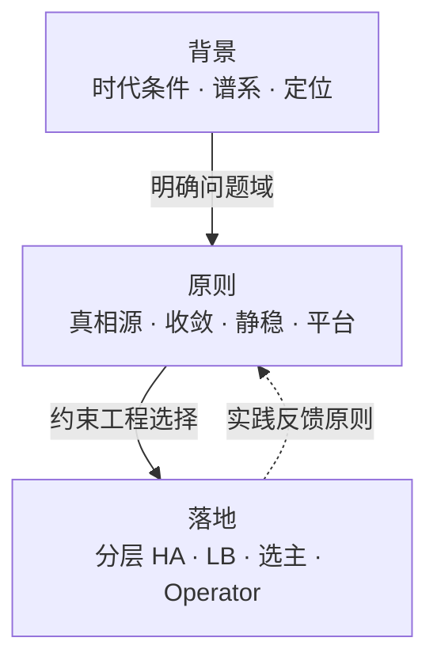
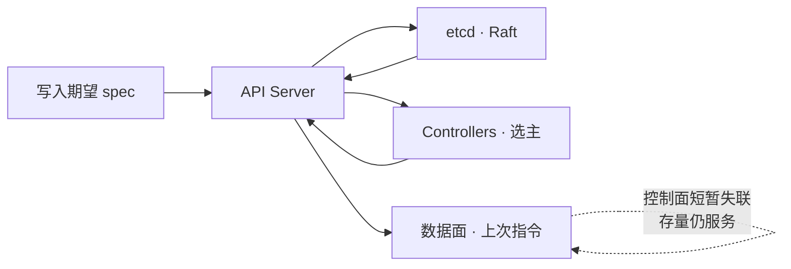
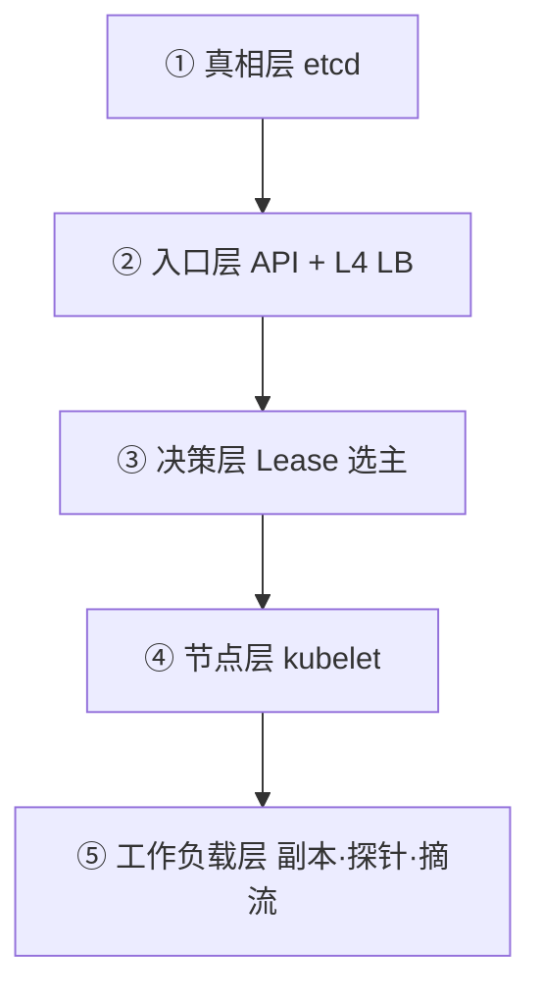

# Kubernetes 设计哲学：声明式 API、控制循环与分层自愈

> Kubernetes 之名源于希腊语，意为「舵手 / 飞行员」。Google 于 2014 年开源该项目，将十余年大规模生产负载经验与社区最佳实践，凝练为一套可对外使用的容器编排平台。[1]

先记住总纲：

> **Kubernetes 不是一次性编排脚本，而是一台「分布式控制计算机」：**  
> 以 etcd 为真相源，以声明式 API 为协调语言，以可失败的控制循环持续逼近期望态；控制面短暂失联时，数据面尽量按上次指令继续服务。[1][12][18]

全文可与本库 [《服务架构演进》](./service-architecture.md)（复杂度如何转移）、[《分布式系统理论》](./distributed-systems.md)（CAP / Raft）对照阅读。关键史实与论断尽量对齐一手文献，文末附参考文献。

---

## 目录

**背景与定位**

1. [阅读主线](#1-阅读主线)
2. [行业背景：为何需要编排平面](#2-行业背景为何需要编排平面)
3. [谱系：Borg → Omega → Kubernetes](#3-谱系borg--omega--kubernetes)
4. [定位：是什么、不是什么](#4-定位是什么不是什么)

**设计原则**

5. [云基础设施的三个前提](#5-云基础设施的三个前提)
6. [核心理念：Platform for Platform](#6-核心理念platform-for-platform)
7. [原则一：一份真相与松耦合协调](#7-原则一一份真相与松耦合协调)
8. [原则二：持续收敛与静态稳定](#8-原则二持续收敛与静态稳定)
9. [控制平面、API 与控制器](#9-控制平面api-与控制器)
10. [设计原则精要](#10-设计原则精要)

**工程落地**

11. [分层高可用：按故障域设计](#11-分层高可用按故障域设计)
12. [控制面入口：API Server 负载均衡](#12-控制面入口api-server-负载均衡)
13. [扩展模型：CRD 与 Operator](#13-扩展模型crd-与-operator)
14. [能力边界与检查清单](#14-能力边界与检查清单)

**收束**

15. [总结](#15-总结)
16. [参考文献](#16-参考文献)



---

## 1. 阅读主线

| 步骤 | 问题 | 对应章节 |
|:----:|------|----------|
| **①** | 上一代运维 / 编排方式在规模下为何不够用？ | §2 |
| **②** | Google 内部经验如何外溢为开源平台？ | §3 |
| **③** | Kubernetes 在生态中站在哪一格？ | §4 |
| **④** | 它依赖哪些基础设施前提？核心理念是什么？ | §5–§6 |
| **⑤** | **分布式控制精髓与可久原则是什么？** | **§7–§10** |
| **⑥** | **高可用与控制面入口如何落地？** | **§11–§12** |
| **⑦** | 同一套模型如何扩展到任意领域？ | §13–§14 |

> **读法**：先弄清问题域与历史约束，再抓住少数几条设计原则，最后落到可试点的高可用与扩展工艺。原则先于技巧——否则容易把 YAML、组件名与营销口号当成定律。

---

## 2. 行业背景：为何需要编排平面

Kubernetes 出现在三股行业潮流交汇处：

| 潮流 | 内容 | 对编排的含义 |
|------|------|--------------|
| **云可编程** | 计算 / 存储 / 网络变成 API 驱动的弹性自助服务 | 基础设施可被更高层系统「编写」与组合 |
| **容器不可变** | 镜像成为版本化制品；发布等于替换，而非就地打补丁 | 运行单元可被声明、调度、批量替换 |
| **复杂度下沉** | 微服务把应用复杂度切开后，运维复杂度上涌（见本库服务架构演进） | 需要把发现、扩缩、自愈从应用层**下沉到基础设施** |

上一代「命令式编排 / 手工剧本」在规模下成本急剧上升：故障组合爆炸，逐步脚本既不经济，也不诚实。行业需要的不是更长的 Runbook，而是**把故障当成稳态输入、用持续收敛代替一次性剧本**的控制平面。

> **判断**：Kubernetes 应时而生——不是发明了容器，而是为「可编程云 + 不可变制品 + 微服务后的运维洪峰」提供了编排与自愈平面。

---

## 3. 谱系：Borg → Omega → Kubernetes

### 3.1 三代系统

Burns / Grant / Oppenheimer 区分了 Google 内部三代容器管理系统：[2]

| 系统 | 时期 | 定位 |
|------|------|------|
| **Borg** | 约 2003–2004 起 | 内部大规模集群管理：数千应用、数十万作业、多集群、数万台机器。[3] |
| **Omega** | 约 2013 前后 | 共享持久状态 + 乐观并发，控制面拆为对等组件。[2][4] |
| **Kubernetes** | 2014 开源，2015 达 1.0 | 面向外部开发者与公有云；吸收前两代经验，**并非 Borg 源码开源**。[2] |

Brian Grant 指出：Kubernetes「更像开源的 Omega，而非开源的 Borg」；Scheduling Unit 等概念随后演进为 Pod。[5]

从分布式视角，三代留下三条遗产：

1. **共享集群状态**作为协调枢纽；
2. **异步控制器**监视变化并写回观测；
3. Kubernetes 的关键升级：状态**不直接暴露存储**，而必须经 **REST API** 完成版本、校验与策略。[2]

### 3.2 关键节点（可核验）

| 时间 | 事件 |
|------|------|
| **2014-06** | 首批提交；Eric Brewer 在 DockerCon 宣布。[6] |
| **2015-07-21** | Kubernetes **1.0**；捐赠新成立的 **CNCF**。[6][7] |
| **2016–2018** | Prometheus、Istio、托管服务与 KubeCon 推动生态主流化。 |

> **判断**：开源的不是 Borg 的源码外壳，而是「规模下故障是常态」这一工程假设——把内部生产经验，变成外部可复用的控制模型。

---

## 4. 定位：是什么、不是什么

### 4.1 定义

Kubernetes 是可移植、可扩展的**开源平台**，用于管理容器化工作负载与服务，同时支持**声明式配置**与**自动化**。[1]

生产集群由**控制平面**与多台**工作节点**组成；二者均横向复制，以提供容错与高可用。[18]

### 4.2 核心能力（节选）

| 能力 | 含义 |
|------|------|
| 服务发现与负载均衡 | DNS / VIP；分散流量 |
| 存储编排 | 自动挂载所选存储 |
| 自动发布与回滚 | 按期望态受控推进 |
| 自动装箱 | 按资源请求摆放容器 |
| 自愈 | 重启、替换、按健康检查摘流 |
| 水平扩展 | 命令、UI 或指标驱动扩缩 |
| 可扩展设计 | 不必改上游即可扩展 |

### 4.3 明确边界

1. **不是**大而全 PaaS——提供积木，保留用户选择权。[1]
2. **不是**传统编排器——编排是「先 A 再 B 再 C」；Kubernetes 是独立可组合的控制过程，持续把当前态推向期望态。[1]

| 类别 | 典型组件 | 边界 |
|------|----------|------|
| 网络 / DNS | Calico、Cilium、CoreDNS | 插件实现 |
| 工作负载入口 | Ingress、云 LB、MetalLB | 业务流量，**非**控制面入口 |
| 可观测 / 网格 | Prometheus、Istio | 周边生态 |

> **要点**：Kubernetes 管「如何声明与收敛」；生态管「具体实现插件」。核心价值是**持续收敛**，而非中心化剧本。

---

## 5. 云基础设施的三个前提

Kubernetes 能成立，建立在云把基础设施「产品化」之后的三个前提之上：

| 序号 | 前提 | 含义 |
|:----:|------|------|
| **①** | **可编程** | API 驱动；可堆叠更高抽象 |
| **②** | **声明式** | 用户描述结果，平台负责路径——降低分布式协调复杂度 |
| **③** | **不可变** | 以版本化制品**替换**运行单元，避免配置漂移[1] |

与 ③ 相关、不可混谈：**无侵入性**（通常无需改业务代码适配）[8]；**PV / PVC**（屏蔽存储差异，有状态亦可迁移）[9]。

---

## 6. 核心理念：Platform for Platform

Kubernetes 的定位是 **Platform for Platform**——用来构建分布式系统的分布式系统。首要用户是分布式应用开发者。

「平台之平台」意味着：不把所有领域知识写死在核心里，而把**声明与收敛的能力**开放出去。上层经 CRD / Operator 扩展，而不必每次重造控制平面。官方要求与此一致：可扩展、可自动化；声明式是自愈的关键。[8]

> **判断**：复杂度不会消失，只会转移——Kubernetes 把「如何协调分布式」收成平台能力，把「协调什么」留给领域。

---

## 7. 原则一：一份真相与松耦合协调

若只用「容器编排」理解 Kubernetes，会错过真正难点。它首先是一台**分布式控制系统**。

### 7.1 一份共享真相源（CP）

全部对象落在 **etcd**（强一致键值存储）。[18][19]

- 共识：**Raft**；写入须多数派确认（quorum = \(\lfloor n/2\rfloor + 1\)）；[20][21]
- CAP 语言下偏向 **CP**：多数派不可达时，**宁可停写，也不交出两份互相矛盾的真相**。[19][20]

> **纪律一**：关于「集群应该是什么样」的真相，只能有一份。

### 7.2 唯一协调语言（API 松耦合）

Omega 曾让受信组件直连存储；Kubernetes 改为：**仅 API Server 访问 etcd**，其余一律经 API。[2][12]

1. 组件**互不直连**，只通过 `spec` / `status` 对话；
2. 可独立升级、失败、重启；
3. 新控制器理解 API 即可加入协调网络。

模式：**控制逻辑松耦合 + 状态强一致共享**。结构统一（`apiVersion` / `kind` / `metadata` / `spec` / `status`），横切策略可忽略资源语义差异；控制面透明，无隐藏内部 API。[12]

---

## 8. 原则二：持续收敛与静态稳定

### 8.1 持续收敛，而非一次成功的剧本

| 对比项 | 传统编排器 | Kubernetes |
|--------|------------|------------|
| 执行模型 | 按步骤推进 | 按偏差调谐 |
| 成功标准 | 走完剧本 | 持续逼近期望 |
| 稳态假设 | 可静止稳态 | 可能长期达不到完全稳态[11] |

配套：**level-based（电平触发）**——正确性只依赖当前观测与期望；边沿触发仅为优化。[12] 丢事件、重启、短暂分区，都设计成「下一轮再对齐」。

### 8.2 静态稳定（Static Stability）

缺少新指令时，组件应**继续执行上次被告知的行为**。[12] 与控制面 / 数据面分离同向：数据面在请求路径；控制面可短时中断而不必然中断业务。[10]

> **纪律二**：高可用不是「控制面永不挂」，而是「控制面挂了，正在服务的世界尽量不塌」。



---

## 9. 控制平面、API 与控制器

原则需要具体组件承载。

### 9.1 组件与高可用形态

| 组件 | 角色 | 高可用形态 |
|------|------|------------|
| **kube-apiserver** | 控制面前端 | 无状态扩展 + **L4 LB**[18][25] |
| **etcd** | 一致存储 | 奇数成员 + Raft 多数派[19][20] |
| **kube-scheduler** | 调度 | 多实例 + **Lease 选主**[22] |
| **kube-controller-manager** | 内置控制器 | 同上[22] |
| **cloud-controller-manager** | 云厂商对接 | 可水平扩展[18] |

节点侧：kubelet、可选 kube-proxy、容器运行时。[18]

| 平面 | 定义 | 故障含义 |
|------|------|----------|
| **数据平面** | 请求路径；随请求量扩展 | 须尽量保持可用 |
| **控制平面** | 资源管理、容错、部署 | 可短时中断[10] |

**Controller** = 持续控制循环；信条是**多简单控制器各管一块**，容忍单环失败。[11]

> **要点**：通用控制平面首先取决于 **API + 一致性存储**，其次才是「会跑容器」。

### 9.2 声明式与调谐

| | 声明式 | 命令式 |
|--|--------|--------|
| 关注点 | 要什么 | 怎么做 |
| 分布式含义 | 故障交给平台循环 | 调用方自行编排重试 |

```text
for {
    actual  := 获取实际状态
    desired := 获取期望状态
    if actual != desired { 把 actual 推向 desired }
}
```

Informer 先 `LIST` 再 `WATCH`——**缓存是运行模型**；调谐必须**幂等**。[23] 容错靠持续收敛，而非一次性排障剧本。[11]

---

## 10. 设计原则精要

官方设计原则中与上述纪律最相关的条目：[12]

| 类别 | 原则 | 含义 |
|------|------|------|
| API | 全部声明式 | 字段表达期望，而非动作 |
| API | 可组合、无隐藏 API | 透明控制面 |
| API | `status` 可观察重建 | 历史非正确性前提 |
| 控制逻辑 | **Level-based** | 只凭期望与观测即可正确 |
| 控制逻辑 | 开放世界、自愈、优雅降级 | 容忍外部角色与过载 |
| 架构 | 仅 API Server↔etcd | 其余经 API |
| 架构 | 分区时执行上次指令 | **静态稳定** |
| 架构 | 优先 Watch；单节点不毁集群 | 事件驱动与故障域隔离 |

---

## 11. 分层高可用：按故障域设计

高可用应按故障域分层，而不是口号式「多副本」。

| 层 | 手段 | 对应纪律 |
|:--:|------|----------|
| **①** | etcd / Raft 共识 | 纪律一：一份真相 |
| **②** | API Server + L4 LB | 入口冗余 |
| **③** | Lease 选主 | 单一活跃调谐者 |
| **④⑤** | kubelet + 负载自愈 | 业务连续性 |
| **—** | 控制面 / 数据面分离 | 纪律二：静态稳定 |



### 11.1 真相层：etcd

| 要求 | 说明 |
|------|------|
| 多成员 + 备份 | 生产多节点运行并定期备份；常见五成员等建议[19] |
| 奇数规模 | quorum = \(\lfloor n/2\rfloor + 1\)；盲目加节点容错未必升[20] |
| 忌自动伸缩 | 扩容不自动提吞吐[19] |
| 无主则停写 | I/O / 心跳饥饿致选主抖动时，无法推进变更（如调度）[19] |

| 拓扑 | 取舍 |
|------|------|
| **Stacked** | 简单；一节点同时损失 etcd 与控制面实例 |
| **External etcd** | 故障域解耦更好；主机约翻倍[24] |

### 11.2 决策层：Lease 选主

多副本同时调谐会冲突。用 Lease：**同时仅领导者执行主循环**，须续约，否则他者接管。[22] 模式：active / passive——短租约换故障转移，「单一写者」避双重控制。

### 11.3 节点与工作负载自愈

| 层级 | 机制 | 作用 |
|------|------|------|
| 容器 | `restartPolicy` | 进程级回收 |
| 工作负载 | 副本控制器 + 重调度 | 补齐期望 |
| 存储 | 卷再挂载 | 有状态迁移 |
| 流量 | Endpoints 摘除 | 避开坏实例 |
| 节点 | kubelet 闭环 | 本地保证[13] |

| 探针 | 行为 |
|------|------|
| **Liveness** | 卡住则重启 |
| **Readiness** | 未就绪摘流，不强制杀进程 |
| **Startup** | 慢启动免误杀[14] |

### 11.4 为何抗造（五条）

| # | 理由 |
|:-:|------|
| 1 | 声明期望，失败后再调谐[11][13] |
| 2 | 控制循环永不停止[11] |
| 3 | 多控制器可失败[11] |
| 4 | 探针切开故障域[14] |
| 5 | 控制面 / 数据面分离 + 静态稳定[10][12] |

血统上，继承的是 Borg「规模下故障是常态」的假设，而非某次手工剧本。[2][3]

---

## 12. 控制面入口：API Server 负载均衡

多实例**不足以**构成入口高可用：所有客户端必须认**同一个稳定入口**。kubeadm 要求：先建 TCP 转发型 LB，设为 `controlPlaneEndpoint`，对 `:6443` 做健康检查，且与 endpoint 一致。[25]

### 12.1 六条硬性原则

| # | 原则 | 做法 | 原因 |
|:-:|------|------|------|
| 1 | **只用 L4** | HAProxy TCP / Nginx stream / 云 NLB | 保护 apiserver mTLS |
| 2 | **单一稳定入口** | DNS → VIP / NLB → `:6443` | 一处配置 |
| 3 | **主动摘流** | TCP 或 `/readyz` | 坏实例不进流量 |
| 4 | **LB 自身 HA** | Keepalived 双机或云托管 | 避免新 SPOF |
| 5 | **证书覆盖入口** | DNS / VIP 入 SAN | TLS 名称校验 |
| 6 | **避免鸡生蛋** | 不用 MetalLB 扛控制面 | 依赖可用 apiserver |

### 12.2 按环境选型

| 环境 | 推荐 |
|------|------|
| **公有云** | 托管 NLB + DNS；托管 K8s 通常已内置 |
| **自建 / 裸机** | Keepalived + HAProxy（TCP），或 kube-vip[26] |
| **POC** | 单机 HAProxy 可演示；**生产勿用** |

VIP 通常需同二层；跨子网可用 BGP。kube-vip 可选 ARP 或 BGP。[26]

### 12.3 配置示意

```haproxy
defaults
  mode tcp
  timeout client  300s
  timeout server  300s
  timeout connect 10s

frontend k8s-api
  bind *:6443
  default_backend apiservers

backend apiservers
  balance roundrobin
  option tcp-check
  server cp1 10.0.0.11:6443 check fall 3 rise 2 inter 5s
  server cp2 10.0.0.12:6443 check fall 3 rise 2 inter 5s
  server cp3 10.0.0.13:6443 check fall 3 rise 2 inter 5s
```

注意：无需 sticky；长连接放宽超时；Keepalived 用脚本检查代理存活；`nc` 测通时「拒绝」可接受，「超时」则网络未通。[25]

> **要点**：云上 = NLB + DNS；裸机 = Keepalived + HAProxy 或 kube-vip；一律 **L4 passthrough**。[25][26]

---

## 13. 扩展模型：CRD 与 Operator

若止于内置资源，Kubernetes 只是调度器。Platform for Platform 靠**同一套收敛模型可被领域复用**：

| 机制 | 作用 |
|------|------|
| **CRD** | 领域对象获得声明式外表 |
| **Operator** | 运维知识编码为持续调谐（Controller + CRD）[15] |

> **工程含义**：先统一「如何描述、如何共识、如何在故障下收敛」，再让各领域填写「收敛什么」——「通用软件控制平面」不过是同一控制模型的外推。

---

## 14. 能力边界与检查清单

### 14.1 边界（避免神话化）

| 层次 | 能保证 | 不能保证 |
|------|--------|----------|
| etcd / 控制面 | quorum 内不脑裂；L4 LB 稳定入口 | quorum 丢失停写；不替代备份；LB 单点仍拖垮入口 |
| 工作负载自愈 | 替换实例、维持副本 | 修不好错误配置、业务 bug、容量不足[13] |
| 静态稳定 | 控制面短失联时维持存量服务 | 无控制面时无限期扩缩 / 调度 / 发布 |

> **公式**：高可用 ≈ 正确的一致性边界 × 分层冗余 × 正确的期望声明 × 合理的容量与探针。

### 14.2 入口落地清单

1. `controlPlaneEndpoint` = DNS → VIP / NLB  
2. 证书 SAN 覆盖入口名  
3. LB ↔ 全部控制面 `:6443` 互通  
4. 健康检查可摘除；摘除后客户端仍可用  
5. LB 双活或云托管  
6. 控制面与 LB 跨故障域  
7. 监控后端状态与延迟（常受 etcd 牵动）

---

## 15. 总结

| 层次 | 命题 | 要点 |
|------|------|------|
| **背景** | 时代与谱系 | 云可编程 × 容器不可变 × 复杂度下沉；Borg/Omega 经验外溢，非 Borg 开源版[2] |
| **原则** | 可久约束 | 一份真相 · API 松耦合 · level-based 收敛 · 静态稳定 · Platform for Platform[12][19] |
| **落地** | 工程工艺 | 共识 → L4 入口 → 选主 → 节点闭环 → 负载自愈；CRD/Operator 外推；边界清晰[13][25] |

| 偏废 | 后果 |
|------|------|
| 只堆技巧、不守原则 | 堆 HAProxy / 探针，却不懂为何停写、为何静稳——技巧失据 |
| 空谈原则、无视前提 | 云与容器尚未成熟时强行套用声明式控制——理想空悬 |
| 看清趋势、无落地工艺 | 知道需要编排平面，却无分层 HA 与入口设计——机遇空过 |

> **收束**  
> 接受「故障是常态」的生产假设；守住「一份真相、持续收敛、静态稳定」；把原则落成「分层高可用与可扩展控制平面」。  
> 舵手之意，不在无风浪，而在有原则可依、有工艺可操，于故障中仍能指向可用。

---

## 16. 参考文献

| 编号 | 文献 / 文档 | 说明 |
|------|-------------|------|
| [1] | Kubernetes Documentation, *Overview*. https://kubernetes.io/docs/concepts/overview/ | 定义、能力、「不是编排器」 |
| [2] | Burns, Grant, Oppenheimer, *Borg, Omega, and Kubernetes*, ACM Queue 2016. https://queue.acm.org/detail.cfm?id=2898444 | 三代系统；共享状态与 API |
| [3] | Verma et al., *Borg*, EuroSys 2015. https://research.google/pubs/pub43438/ | Borg 规模与实践 |
| [4] | Schwarzkopf et al., *Omega*, EuroSys 2013. | 共享状态与多调度器 |
| [5] | Kubernetes Podcast, *Ep. 43 — Brian Grant*. https://kubernetespodcast.com/episode/043-borg-omega-kubernetes-beyond/ | 「更像开源 Omega」 |
| [6] | Kubernetes Blog, *10 Years of Kubernetes* (2024). https://kubernetes.io/blog/2024/06/06/10-years-of-kubernetes/ | 2014 / 2015-07-21 |
| [7] | CNCF 成立公告 (2015-07-21). https://www.cncf.io/announcements/2015/06/21/new-cloud-native-computing-foundation-to-drive-alignment-among-container-technologies/ | CNCF 种子技术 |
| [8] | Design Proposals Archive, *Architecture*. https://github.com/kubernetes/design-proposals-archive/blob/main/architecture/architecture.md | 可扩展、声明式 |
| [9] | Kubernetes Documentation, *Persistent Volumes*. https://kubernetes.io/docs/concepts/storage/persistent-volumes/ | PV / PVC |
| [10] | Marc Brooker, *Control Planes vs Data Planes* (2019). https://brooker.co.za/blog/2019/03/17/control | 控制面 / 数据面 |
| [11] | Kubernetes Documentation, *Controllers*. https://kubernetes.io/docs/concepts/architecture/controller/ | 控制循环 |
| [12] | Design Proposals Archive, *Design Principles*. https://github.com/kubernetes/design-proposals-archive/blob/main/architecture/principles.md | level-based、静态稳定 |
| [13] | Kubernetes Documentation, *Self-Healing*. https://kubernetes.io/docs/concepts/architecture/self-healing/ | 分层自愈 |
| [14] | Kubernetes Documentation, *Configure Probes*. https://kubernetes.io/docs/tasks/configure-pod-container/configure-liveness-readiness-startup-probes/ | 探针 |
| [15] | CNCF, *Operator White Paper*. https://tag-app-delivery.cncf.io/whitepapers/operator/ | Operator |
| [16] | Kubernetes Documentation, *Pod Lifecycle*. https://kubernetes.io/docs/concepts/workloads/pods/pod-lifecycle/ | Pod 生命周期 |
| [17] | Kubernetes Community, *API Conventions*. https://github.com/kubernetes/community/blob/main/contributors/devel/sig-architecture/api-conventions.md | 资源惯例 |
| [18] | Kubernetes Documentation, *Cluster Architecture*. https://kubernetes.io/docs/concepts/architecture/ | 组件架构 |
| [19] | Kubernetes Documentation, *Operating etcd clusters*. https://kubernetes.io/docs/tasks/administer-cluster/configure-upgrade-etcd/ | etcd HA |
| [20] | etcd Documentation, *FAQ*. https://etcd.io/docs/v3.5/faq/ | quorum |
| [21] | Ongaro & Ousterhout, *Raft*, USENIX ATC 2014. https://raft.github.io/raft.pdf | Raft |
| [22] | Kubernetes Documentation, *Leases*. https://kubernetes.io/docs/concepts/architecture/leases/ | 选主 |
| [23] | Kubernetes Blog, *controller-runtime Cache* (2026). https://kubernetes.io/blog/2026/07/29/controller-runtime-cache-explained/ | Informer |
| [24] | Kubernetes Documentation, *HA Topology*. https://kubernetes.io/docs/setup/production-environment/tools/kubeadm/ha-topology/ | Stacked / External |
| [25] | Kubernetes Documentation, *HA with kubeadm*. https://kubernetes.io/docs/setup/production-environment/tools/kubeadm/high-availability/ | TCP LB、endpoint |
| [26] | kubeadm, *HA considerations*. https://github.com/kubernetes/kubeadm/blob/main/docs/ha-considerations.md | Keepalived、kube-vip |
