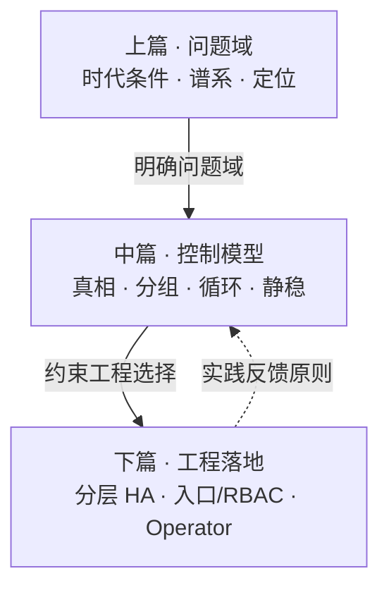
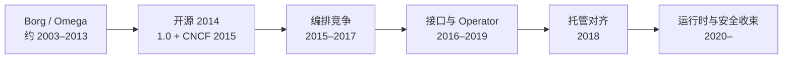
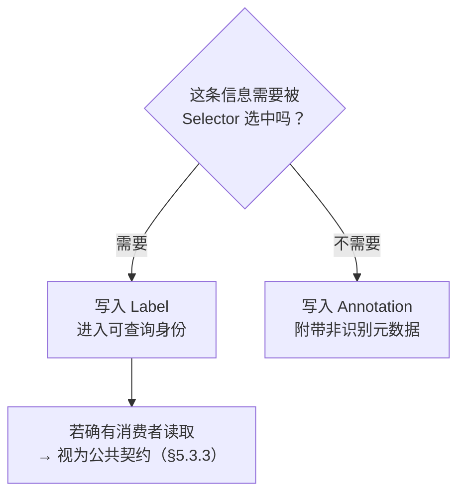
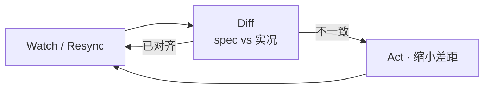
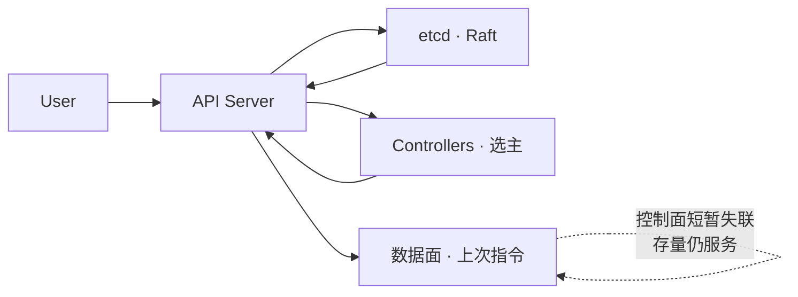
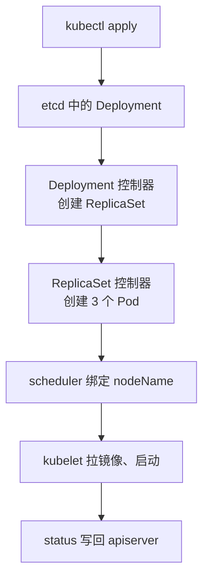
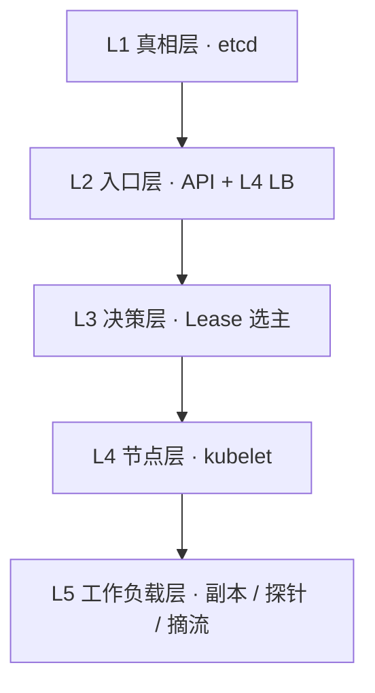

# Kubernetes 控制面原则：声明式协调、分组契约与控制循环

> Kubernetes 之名源于希腊语，意为「舵手 / 飞行员」。Google 于 2014 年开源该项目，将十余年 Borg / Omega 生产经验凝练为可对外使用的容器编排平台。社区简称 **K8s**；七边形 logo 致敬内部代号 Project Seven of Nine。[1][6][27]

先记住总纲：

> **Kubernetes 不是一次性编排脚本，而是一台「分布式控制计算机」：**  
> 以 etcd 为真相源，以声明式 API 为协调语言，以 Label / Selector 做查询式分组，以可失败的控制循环持续逼近期望态；控制面短暂失联时，数据面尽量按上次指令继续服务。  
> 调度、自愈、服务发现、滚动发布，并不是四套魔法——**驱动这一切的，是同一个调谐循环。**[1][11][12][18][46]

全文可与本库 [《服务架构演进》](./21-service-architecture-evolution.md)（复杂度如何转移）、[《分布式一致性》](./22-distributed-consistency-treatise.md)（CAP / Raft）、[《Calico 三层数据面》](./24-calico-l3-dataplane-treatise.md) / [《Cilium》](./24a-cilium-ebpf-dataplane-treatise.md)（CNI 如何兑现网络合同）、[《TCP/IP 协议栈》](../10-chronicle/16a-tcp-ip-illustrated-treatise.md)（跨网转发与地址空间）对照阅读。更长的容器与云原生时间线见 [《计算与云编年》](../10-chronicle/10-computing-cloud-chronicle.md) §8。关键史实与论断尽量对齐一手文献，文末附参考文献。

## 摘要

Kubernetes 应被理解为持续收敛的分布式控制计算机，而不是一次性编排脚本。etcd 充当真相源，声明式 API 充当协调语言；Label / Selector 则是松耦合的核心分组原语——先问「需要被 Selector 选中吗」以区分 Label 与 Annotation，再承认**一旦被读取即成公共契约**，因而只宜承载有限、稳定、可分组的维度；讨论高基数时，还须分清对象层治理成本与指标映射层的时间序列膨胀。每个控制器只反复追问「世界应该什么样 / 现在实际上什么样」，发现偏差就走一步，然后再问——调度、自愈、服务发现与滚动发布，都是这同一个调谐循环作用在不同对象上。控制面可以短暂失败，数据面则尽量按上次指令保持静态稳定；API 入口除 L4 高可用外，还须以 RBAC 约束「谁能对哪些资源做什么」。网络侧，核心只规定**扁平可达的 Pod IP 合同**与 **Service / ClusterIP** 稳定入口；Pod / Service / Node 三类地址空间须事先划分且互不重叠，节点级子网常由 Node IPAM 从 cluster CIDR 切出，再由 CNI 兑现到接口——细节实现留给插件（Calico / Cilium 等）。全文分三篇：上篇划定问题域与 Borg → Omega 谱系；中篇收束控制模型（含网络合同与地址划分）；下篇落到分层高可用、入口与 RBAC、CRD / Operator 与能力边界。可与本库 21、22、24 / 24a、16a 对照。

**关键词：** Kubernetes；声明式 API；调谐循环；etcd；Label / Selector；CNI；Pod CIDR；Service CIDR；Node IPAM；ClusterIP；NetworkPolicy；RBAC；静态稳定；CNCF

---

## 目录

- [摘要](#摘要)

**上篇 · 问题域与谱系**

1. [为何需要编排平面](#1-为何需要编排平面)
2. [谱系：Borg → Omega → Kubernetes](#2-谱系borg-omega-kubernetes)
    - [2.1 三代系统](#21-三代系统) · [2.2 开源到默认底座](#22-开源到默认底座) · [2.3 年表](#23-年表) · [2.4 何以成为默认底座](#24-何以成为默认底座)
3. [定位：是什么、不是什么](#3-定位是什么不是什么)

**中篇 · 控制模型**

4. [前提与核心理念](#4-前提与核心理念)
5. [一份真相与松耦合协调](#5-一份真相与松耦合协调)
    - [5.1 真相源](#51-一份共享真相源cp) · [5.2 API 松耦合](#52-唯一协调语言api-松耦合) · [5.3 Label / Selector](#53-label--selector核心分组原语)
      - [5.3.1 怎么选](#531-选择器语法与谁在读) · [5.3.2 Label 还是 Annotation](#532-label-还是-annotation先问需要被选中吗) · [5.3.3 公共契约](#533-标签一旦被读取即成公共契约) · [5.3.4 危险标签与基数](#534-危险标签与两层基数风险) · [5.3.5 推荐标签与审计](#535-推荐标签与上线前审计)
6. [持续收敛与静态稳定](#6-持续收敛与静态稳定)
    - [6.1 持续收敛](#61-持续收敛而非一次成功的剧本) · [6.2 调谐循环](#62-调谐循环驱动一切的同一个循环) · [6.3 静态稳定](#63-静态稳定static-stability)
7. [控制平面与设计原则](#7-控制平面与设计原则)
    - [7.1 组件](#71-组件与高可用形态) · [7.2 设计原则](#72-设计原则精要) · [7.3 同一循环](#73-同一循环从-apply-到自愈)
    - [7.4 网络模型与地址空间](#74-网络模型与地址空间划分)
      - [7.4.1 网络合同](#741-网络模型合同) · [7.4.2 三类 CIDR](#742-三类地址空间须事先划分) · [7.4.3 节点子网](#743-节点级子网划分与-ipam) · [7.4.4 CNI 与策略](#744-cni-兑现与-networkpolicy)

**下篇 · 工程落地**

8. [分层高可用](#8-分层高可用)
9. [控制面入口](#9-控制面入口)
    - [9.1–9.3 入口工程](#91-入口约束) · [9.4 RBAC](#94-接口权限rbac) · [9.5 集群内 UI](#95-web-界面集群内-ui-与权限同构)
10. [扩展模型：CRD 与 Operator](#10-扩展模型crd-与-operator)
11. [能力边界与检查清单](#11-能力边界与检查清单)

**收束**

12. [总结](#12-总结)
13. [参考文献](#13-参考文献)

全文按「问题域 → 控制模型 → 工程落地」展开。原则先于技巧——否则容易把 YAML、组件名与营销口号当成定律。读中篇时抓住三条纪律：**一份真相、同一循环、静态稳定**；Label/Selector 是循环如何圈定作用域的寻址语言；§7.4 则补上循环之外的另一条基础设施合同——**Pod 如何在扁平地址空间里可达、三类 CIDR 如何划分**；RBAC 是入口如何约束主体的门禁。


```mermaid
%% K8s 设计全景：问题域约束原则，原则约束落地
flowchart TB
  Ctx["上篇 · 问题域<br/>时代条件 · 谱系 · 定位"]
  Prin["中篇 · 控制模型<br/>真相 · 分组 · 循环 · 静稳"]
  Eng["下篇 · 工程落地<br/>分层 HA · 入口/RBAC · Operator"]

  Ctx -->|"明确问题域"| Prin
  Prin -->|"约束工程选择"| Eng
  Eng -.->|"实践反馈原则"| Prin
```

---

## 1. 为何需要编排平面

若数据中心是港口、容器是标准化集装箱，则 Kubernetes 是港口的调度系统：船停哪个泊位、货物怎么装卸、出故障怎么办、流量暴增时怎么扩容。它不制造箱子，它决定这些箱子能不能规模化运行。

它出现在三股潮流交汇处：

| 潮流 | 内容 | 对编排的含义 |
|------|------|--------------|
| **云可编程** | 计算 / 存储 / 网络变成 API 驱动的弹性自助服务 | 基础设施可被更高层系统「编写」与组合 |
| **容器不可变** | 镜像成为版本化制品；发布等于替换，而非就地打补丁 | 运行单元可被声明、调度、批量替换 |
| **复杂度下沉** | 微服务把应用复杂度切开后，运维复杂度上涌（见本库服务架构演进） | 需要把发现、扩缩、自愈从应用层**下沉到基础设施** |

2013 年 Docker 把容器从运维黑科技变成开发者日常工具：同一个镜像，在笔记本、CI 和生产里运行结果一致。一台机器上几个容器很容易管——**一个容器是一个程序；一群容器是一个运维问题。** 一旦跨越多台机器，问题立刻成套出现：[1][11]

| 问题 | 若无编排平面 |
|------|----------------|
| **放置** | 哪台主机该跑哪个容器？ |
| **故障** | 主机挂了，谁来补上？ |
| **发现** | IP 每次重建都变，容器如何找到对方？ |
| **发布** | 如何零停机换版？新版本坏了如何回滚？ |

这四问有一个共同答案：把期望写进声明，交给持续运行的控制循环。谁把它做成通用平台，谁就有机会成为云基础设施的标准。

上一代「命令式编排 / 手工剧本」在规模下成本急剧上升：故障组合爆炸，逐步脚本既不经济，也不诚实。行业需要的不是更长的 Runbook，而是**把故障当成稳态输入、用持续收敛代替一次性剧本**的控制平面。

> **判断**：Kubernetes 应时而生——不是发明了容器，而是为「可编程云 + 不可变制品 + 微服务后的运维洪峰」提供了编排与自愈平面。Docker 解决打包；它补上规模化运维。

---

## 2. 谱系：Borg → Omega → Kubernetes

下图为谱系主线：内部生产经验外溢为开源平台，再经治理、接口与云厂商对齐，收束成默认编排底座。


```mermaid
%% K8s 谱系：内部经验 → 开源治理 → 编排竞争 → 接口锁定 → 托管对齐
flowchart LR
  Borg["Borg / Omega<br/>约 2003–2013"] --> OSS["开源 2014<br/>1.0 + CNCF 2015"]
  OSS --> War["编排竞争<br/>2015–2017"]
  War --> Ext["接口与 Operator<br/>2016–2019"]
  Ext --> Cloud["托管对齐<br/>2018"]
  Cloud --> Adult["运行时与安全收束<br/>2020–"]
```

### 2.1 三代系统

Burns / Grant / Oppenheimer 区分了 Google 内部三代容器管理系统：[2]

| 系统 | 时期 | 定位 |
|------|------|------|
| **Borg** | 约 2003–2004 起 | 内部大规模集群管理：数千应用、数十万作业、多集群、数万台机器。[3] |
| **Omega** | 约 2013 前后 | 共享持久状态 + 乐观并发，控制面拆为对等组件。[2][4] |
| **Kubernetes** | 2014 开源，2015 达 1.0 | 面向外部开发者与公有云；吸收前两代经验，**并非 Borg 源码开源**。[2] |

Brian Grant 指出：Kubernetes「更像开源的 Omega，而非开源的 Borg」；Scheduling Unit 等概念随后演进为 Pod。[5]

它继承了 Borg 的若干本能，最明显的是把一组紧密协作的容器当作一个调度单元（Borg 称 alloc，Kubernetes 称 **Pod**）。同时刻意改进 Borg 的局限：Borg 主要用相对僵硬的 Job 分组工作，Kubernetes 用 Label / Selector 组织对象，并更强调声明式期望态——你描述想要什么，系统努力去实现它。[2]

从分布式视角，三代留下三条遗产：

1. **共享集群状态**作为协调枢纽；
2. **异步控制器**监视变化并写回观测；
3. Kubernetes 的关键升级：状态**不直接暴露存储**（有别于 Omega 让受信组件直连共享状态），而必须经 **REST API** 完成版本、校验与策略。[2]

### 2.2 开源到默认底座

**开源与中立治理（2013–2015）。** 2013 年夏，Joe Beda、Brendan Burns、Craig McLuckie 向领导层提议：把 Borg / Omega 经验做成开源容器管理系统。内部代号 Project Seven of Nine，致敬《星际迷航》九之七，这也是 logo 七条边的来历。[27] 2014-06-06 首个 commit 落地；6 月 10 日 Eric Brewer 在 DockerCon 宣布。行业通常把 6 月 6 日当作生日。[6]

2015-07-21 发布 1.0，并捐赠给新成立的 CNCF（Linux 基金会托管）。[6][7] 象征意义大于版本号：若仍是「Google 的开源项目」，竞争对手会犹豫；落到中立基金会之下，Red Hat、IBM、Intel、VMware，以及后来的 AWS 与微软，都更愿意押注。CNCF 的目标从来不只是发展 Kubernetes，而是推进整个云原生栈。约一个月后，2015-08-26，Google Container Engine（后来的 GKE）达到 GA——云厂商开始把「我们帮你运行控制平面」当作产品来卖。[28]

到 1.0，最小闭环已经在：

| 概念 | 含义 |
|------|------|
| **Pod** | 最小调度单元：可容纳一个或多个紧密协作容器 |
| **Node** | 一台工作机器（物理或虚拟） |
| **Service** | 变化的一组 Pod 前面的稳定访问点 |
| **Label / Selector** | 给对象打标签再按标签过滤；被读取后即成公共契约 |
| **声明式 API** | 声明期望副本数，由系统收敛，而非手工 SSH |

人们后来习以为常的 Deployment、DaemonSet、StatefulSet、Ingress、成熟 RBAC，都是 1.0 之后长出来的。1.0 更像「可用的最小闭环」：证明编排可以成为平台。

**编排竞争（2015–2017）。** 市场上至少有三大竞争者：Docker Swarm（与 Docker 集成最紧、最好上手）、Apache Mesos + Marathon（更老牌，擅长超大规模与异构负载）、Kubernetes（学习曲线陡，但模型完整且可扩展）。Nomad 等也在混战。媒体后来称之为「编排战争」。Kubernetes 获胜不是某个单一开关，而是多股力量叠加：Google 的生产可信度与 CNCF 的中立治理；设计良好的 API 与扩展点；监控、网络、存储、CI/CD、安全工具优先支持它；云厂商排队站队。高潮出现在 2017-10 DockerCon Europe：Docker 宣布在 Swarm 之外原生支持 Kubernetes。[31] Swarm 没有一夜消失，Mesos 仍活在某些细分领域，但行业已经知道默认答案是什么。2017-11-13，CNCF 启动 Certified Kubernetes Conformance：自称 Kubernetes 的发行版须通过测试套件，保证核心 API 行为一致，避免严重的 Unix / Android 式碎片化。[32]

**工作负载 API 与可插拔接口（2016–2019）。** `apps/v1`（Deployment、DaemonSet、ReplicaSet、StatefulSet）于 1.9（2017-12-15）达 GA——常见应用形态有了稳定的一等公民 API。[30] RBAC 于 1.8（2017-09）GA，把集群从共享特权账号的机器集合，变成有门禁的系统。NetworkPolicy 于 1.7（2017-06）达 `networking.k8s.io/v1` stable；1.8 增加 egress 策略。更关键的是可插拔合同：CRI 随 1.5（2016-12）以 Alpha 引入；CNI 把容器网络交给插件（Kubernetes 采用该合同，而非自造网络栈）；CSI 随 1.13（2018-12）达 GA。[29][34] 三者的战略价值超过几乎任何单个功能——网络、存储、运行时厂商可以在不修改内核的情况下加入竞争。

CRD 由 ThirdPartyResource 重设计而来，1.7 入 beta，1.16（2019）以 `apiextensions.k8s.io/v1` 达 GA。[30][35] 2016-11-03，CoreOS 提出 Operator 模式：把部署、备份、故障转移、升级的专家经验，编码进监视自定义资源的控制器；当时 CRD 未稳，早期实现更多依赖 TPR。[36] CRD 成熟后，Operator 几乎都迁到这条路上。Deployment 让「三个相同的 Web 副本」保持存活；Operator 让「这个有状态系统以专家期望的方式保持存活」。

**托管对齐（2018）。** Amazon EKS 于 2018-06-05 GA，Azure AKS 于 2018-06-13 GA；加上 2015 年已 GA 的 GKE，三大云都提供托管 Kubernetes。[33] 对企业意味着：学一套模型，就能在多个云上说话。差异更多落在周边服务、网络和身份上，而不是「必须再学第三个编排器」。Kubernetes 不能完全消除锁定，但大幅降低了「应用怎么运行」这一层的锁定。一致性认证让托管服务更像同一种语言的不同口音。

**运行时、安全与入口演进（2020–）。** 许多人曾以为「Kubernetes = 用 Docker 跑容器」。实际上它依赖的是容器运行时接口；为兼容 Docker，kubelet 曾内置 dockershim。该垫片于 1.20 弃用，1.24（2022-04）移除，标准收束到 OCI / CRI。[37] 终端用户仍可用 Docker 构建镜像；变化主要影响节点上由哪个运行时来跑容器。PodSecurityPolicy 于 1.21 弃用、1.25 移除，代以更简单的 Pod Security Admission（给 Namespace 打标签，套 Privileged / Baseline / Restricted）；更细的需求交给 OPA / Gatekeeper 或 Kyverno 等外部引擎。[37] 方向明确：默认更安全，机制里更少魔法。

入口侧，Ingress 简单但扩展碎片化（annotation 行为随实现而异）。Gateway API 于 2023-10-31 发布 v1.0，`Gateway`、`GatewayClass`、`HTTPRoute` 达 stable，把「基础设施如何提供入口」与「应用如何声明路由」分开。[38] Ingress 不会一夜消失，新项目越来越默认走 Gateway API。与此同时，大模型把 GPU / TPU 与大规模作业调度推回舞台中央。约 2023-11，Google 公开用 GKE 及相关能力调度一次 50,944 颗 TPU v5e 芯片的分布式训练作业。[39] Kubernetes 不是为 LLM 发明的，但眼下是多数组织够得着的、足够通用的集群底座。安全、可观测与平台工程则不断把它藏到自助服务后面：开发者可能永远不直接碰集群，平台团队几乎总是在它之上构建。

### 2.3 年表

| 时间 | 事件 |
|------|------|
| 约 2003 起 | Borg 大规模管理容器化工作负载。[3] |
| 2013 | Docker 成为开发者日常工具；Kubernetes 以 Project Seven of Nine 起步。[27] |
| 2014-06-06 | 首个 commit；2014-06-10 Eric Brewer 在 DockerCon 宣布。[6] |
| 2015-07-21 | Kubernetes 1.0；捐赠新成立的 CNCF。[6][7] |
| 2015-08-26 | Google Container Engine（后来的 GKE）GA。[28] |
| 2016-11-03 | CoreOS 提出 Operator。[36] |
| 2016-12 | CRI Alpha（1.5）。[29] |
| 2017-06 / 09 | NetworkPolicy GA（1.7）；RBAC GA（1.8）。[30] |
| 2017-10 | Docker 宣布原生支持 Kubernetes。[31] |
| 2017-11-13 | CNCF 启动 Certified Kubernetes Conformance。[32] |
| 2017-12-15 | 1.9，`apps/v1` 核心工作负载 API GA。[30] |
| 2018-06 | EKS（06-05）、AKS（06-13）GA。[33] |
| 2018-12 | 1.13，CSI GA（官方 GA 说明文 2019-01）。[34] |
| 2019 | 1.16，CRD 以 `apiextensions.k8s.io/v1` GA。[35] |
| 2020–2022 | dockershim 于 1.20 弃用、1.24 移除；PSP 移除；Pod Security Admission 于 1.25 稳定。[37] |
| 2023-10-31 | Gateway API v1.0，核心资源稳定。[38] |
| 2023-11 | 公开报道：GKE 调度 50,944 颗 TPU v5e 的分布式训练作业。[39] |
| 2024– | 开源十周年；继续向 AI、多集群、平台工程推进。[6] |

### 2.4 何以成为默认底座

回看这十几年，胜利可以压成四个因素：

| 因素 | 含义 |
|------|------|
| **时机** | Docker 解决打包，它补上规模化运维 |
| **经验** | 十几年 Borg 伤痕换来更清晰的抽象（Pod、声明式、Label） |
| **治理** | 交给 CNCF，让竞争对手也愿意共建 |
| **接口** | CRI / CNI / CSI 加上 CRD / Operator，让其他人能在它之上继续建设 |

它从来不是「简单」的。学习曲线陡，YAML 冗长，生产事故可以很戏剧化——这些都是合理的抱怨。基础设施很少因为无懈可击而赢；它赢在足够通用、足够可扩展、有足够强的生态。监控、service mesh、GitOps 与平台工程，大多是在这座港口上加建的码头、吊机和海关。展望未来，港口不会消失，但会越来越不像开发者每天面对的栈桥。

> **判断**：开源的不是 Borg 的源码外壳，而是「规模下故障是常态」这一工程假设——把内部生产经验，变成外部可复用的控制模型。未来十年更可能发生的，不是从零再建一个新港口，而是把这座港口建得更高更深。

---

## 3. 定位：是什么、不是什么

### 3.1 定义

官方定义可收束为一句：Kubernetes 是可移植、可扩展的**开源平台**，用于管理容器化工作负载与服务，并支持**声明式配置**与**自动化**。[1] 生产集群由**控制平面**与多台**工作节点**组成；二者均可横向复制，以提供容错与高可用。[18] 上篇回答「为何与从何而来」，本节钉住「它声称管什么、明确不管什么」，以免后文把插件能力误当成核心定律。

### 3.2 核心能力（节选）

| 能力 | 含义 |
|------|------|
| 服务发现与负载均衡 | DNS / VIP；把流量分散到健康后端 |
| 存储编排 | 按声明挂载所选存储 |
| 自动发布与回滚 | 按期望态受控推进；回滚是再次改期望，而非失败即自动 undo |
| 自动装箱 | 按资源请求在节点间摆放 |
| 自愈 | 重启、替换、按健康检查摘流 |
| 水平扩展 | 命令、UI 或指标驱动扩缩 |
| 可扩展设计 | 不必改上游即可扩展（CRI/CNI/CSI、CRD） |

### 3.3 明确边界

它**不是**大而全 PaaS：提供积木，保留用户对网络、存储、发布策略的选择权。[1] 它也**不是**传统意义上的编排器——传统编排常指「先 A 再 B 再 C」的步骤剧本；Kubernetes 是一组可组合的控制过程，持续把当前态推向期望态。[1]

| 类别 | 典型组件 | 边界 |
|------|----------|------|
| 网络 / DNS | Calico、Cilium、CoreDNS | 核心定网络合同与 CIDR 账本（§7.4）；插件兑现。见 [24](./24-calico-l3-dataplane-treatise.md) / [24a](./24a-cilium-ebpf-dataplane-treatise.md) |
| 工作负载入口 | Ingress、**Gateway API**、云 LB、MetalLB | 业务流量，**非**控制面入口（§9）。Gateway API 见 §2.2 |
| 可观测 / 网格 | Prometheus、Istio | 周边生态，非控制面内核 |

> **要点**：核心管「如何声明与收敛」；生态管「具体用哪块积木」。价值在**同一个调谐循环**（§6.2 / §7.3），不在中心化剧本。

---

## 4. 前提与核心理念

### 4.1 云基础设施的三个前提

Kubernetes 能成立，建立在云把基础设施「产品化」之后的三个前提之上：

| 前提 | 含义 |
|------|------|
| **可编程** | API 驱动；可堆叠更高抽象 |
| **声明式** | 用户描述结果，平台负责路径——降低分布式协调复杂度 |
| **不可变** | 以版本化制品**替换**运行单元，避免配置漂移[1] |

与「不可变」相关、不可混谈：**无侵入性**（通常无需改业务代码适配）[8]；**PV / PVC**（屏蔽存储差异，有状态亦可迁移）[9]。

### 4.2 Platform for Platform

Kubernetes 的定位是 **Platform for Platform**——官方表述为：提供积木，用来构建开发者平台，而不是大而全的 PaaS。[1][8] 设计文档进一步写明：API **不只（甚至不主要）面向终端用户**，而面向工具与扩展的开发者；控制面没有隐藏的内部 API。[8]

「平台之平台」意味着：不把所有领域知识写死在核心里，而把**声明与收敛的能力**开放出去。上层经 CRD / Operator 扩展，而不必每次重造控制平面。官方要求与此一致：可扩展、可自动化；声明式是自愈的关键。[8]

机制上对应两层接口：CRI / CNI / CSI 让运行时、网络、存储可插拔（核心当裁判，不当全部运动员）；CRD / Operator 让领域对象与运维知识可外挂。这是编排竞争第二回合的胜负手，工程细节见 §10。[29][34][36]

> **判断**：复杂度不会消失，只会转移——Kubernetes 把「如何协调分布式」收成平台能力，把「协调什么」留给领域。

---

## 5. 一份真相与松耦合协调

若只用「容器编排」理解 Kubernetes，会错过真正难点：它首先是一台**分布式控制系统**。系统要在故障与并发下仍可协调，至少同时满足三件事——**状态有唯一真相、组件经统一语言对话、对象以可查询方式成组**。本节依次对应 etcd、API，以及 Label / Selector。

### 5.1 一份共享真相源（CP）

全部集群对象落在 **etcd**（强一致键值存储）中。[18][19] 成员间以 **Raft** 达成共识，写入须多数派确认（quorum = \(\lfloor n/2\rfloor + 1\)）。[20][21] 用 CAP 语言表述：多数派不可达时，控制面**宁可停写，也不交出两份互相矛盾的真相**——这是刻意的 CP 偏向，而非运维疏忽。[19][20]

> **纪律一**：关于「集群应该是什么样」的真相，只能有一份。

### 5.2 唯一协调语言（API 松耦合）

Omega 曾允许受信组件直连共享存储；Kubernetes 改为：**仅 API Server 访问 etcd**，其余组件一律经 API。[2][12] 于是控制逻辑松耦合、状态却强一致共享：组件互不直连，只通过对象的 `spec` / `status` 对话；可独立升级、失败与重启；新控制器只要理解 API，即可加入协调网络。对象结构统一为 `apiVersion` / `kind` / `metadata` / `spec` / `status`，横切策略可忽略具体资源语义；控制面保持透明，无隐藏内部 API。[12][17]

> **所以 · 边界在哪：** 真相在 etcd，对话在 API——二者缺一，要么脑裂，要么把控制逻辑重新焊死成单体。有了统一语言之后，还须回答：控制器如何在规模下圈定「属于自己的那一群」——这便是下一节 Label / Selector。

### 5.3 Label / Selector：核心分组原语

松耦合进一步要求：**作用域不能绑死在对象名字上**。官方将 **Label Selector** 称为核心分组原语（core grouping primitive）：对象携带短键值标签，选择器圈出子集；Deployment、Service、调度与策略据此识别「属于自己的那一群」，而不是写死 Pod 名。这与 Borg 时代相对僵硬的 Job 分组形成对照——Burns 等文亦强调 Label 带来的组织灵活性。[2][46]

读本节时抓住一条因果链，勿把后文当成彼此无关的名词表：

```text
怎么选（Selector）→ 什么进「可被选中」的身份（Label vs Annotation）
                 → 一旦被读，便签成公共契约 → 危险键 / 基数 → 词典与审计
```

#### 5.3.1 选择器语法与谁在读

先回答「怎么选」。选择器有等值与集合两层表面：API 中的 `LabelSelector` 由 `matchLabels` 与 `matchExpressions` 组成，二者及各项之间均为逻辑 **AND**（无逻辑 OR）。就 `metav1.LabelSelector` 而言，空选择器匹配全部对象，`null` 选择器不匹配任何对象——具体 API 字段若另有约定，以该类型文档为准。[46][48] `matchLabels` 的每一对 `{key: value}` 等价于一条 `operator: In` 且 `values` 仅含该值的表达式；`matchExpressions` 支持 **`In` / `NotIn` / `Exists` / `DoesNotExist`**（前两者要求 `values` 非空，后两者不填 `values`）。列表过滤的查询字符串（`=` / `in` / `exists` 等）与对象字段中的表达式，是同一思想的不同表面。[46]

```yaml
# 逻辑：app=nginx 且 env∈{dev,test} 且不存在 tier 键
selector:
  matchLabels:
    app: nginx
  matchExpressions:
    - key: env
      operator: In
      values: ["dev", "test"]
    - key: tier
      operator: DoesNotExist
```

这些选择器并非抽象语法游戏，而是控制面里真实的「读者」：Deployment / ReplicaSet / StatefulSet 靠 selector 锁定受管 Pod；Service 靠标签发现后端并生成 EndpointSlice（§7.3）；NetworkPolicy、部分调度规则（`nodeSelector` / `nodeAffinity`，常与污点/容忍并用）以及 GitOps / 内部平台，亦按标签切片。在 `apps/v1` 中，**`.spec.selector` 创建后不可变**，且必须与 `.spec.template.metadata.labels` 匹配，否则 API 拒绝；模板标签与 selector 不一致时，控制器无法认领 Pod——这是清单层的结构性错误。若必须更换选择器，通常只能重建 Deployment（例如以 orphan 策略保留旧 Pod 后再接新控制器）。[42][46]

知道「谁在读」之后，下一个问题才变得具体：**某条元数据，要不要放进这些读者能够查询的身份空间？**

#### 5.3.2 Label 还是 Annotation？先问「需要被选中吗」

Label 与 Annotation 都挂在对象的 `metadata` 上，容易被当成两种「备注」。官方分界却很硬：Label 用于表达**识别属性（identifying attributes）**，供组织、查询与选中子集；**非识别信息应记入 Annotation**——Annotation 可以很大、可结构化，但**不能**用来 identify / select 对象。[46][47]

因此，选型时只先问一句：

> **需要被 Selector（或等价查询）选中吗？**  
> 需要 → 放 **Label**（进入可被选中的身份空间）；  
> 不需要 → 放 **Annotation**（附带说明、构建信息、工具私有配置）。

| | **Label** | **Annotation** |
|--|-----------|----------------|
| 官方定位 | 识别属性；可查询、可分组 | 任意非识别元数据 |
| 能否被 Label Selector 选中 | **能** | **不能** |
| 体量 / 字符集 | key/value 偏短（见 §5.3.5） | 值可含空白、JSON 等；单对象全部注解合计通常 ≤ **256 KiB** |
| 典型内容 | 应用名、实例、环境、组件角色 | Git SHA、变更说明、镜像仓库地址、控制器私有状态 |

这里有一个常见误解：**Annotation ≠「只给人看」**。控制器、Webhook、Ingress Controller、Service Mesh 都可以读取 Annotation；区别只在于——读 Annotation 是「取附加数据」，不能把它写进 Selector 去圈选对象。[47] 反过来，Git SHA 也并非绝对不能做 Label：若发布系统确实要按构建版本**选择** Pod，它可以进 Label；若只用于审计追溯，放 Annotation 更合适。

```yaml
# 同一对象上并存：能被选中的进 labels；只需附带的进 annotations
metadata:
  labels:
    app.kubernetes.io/name: checkout          # Service / Deployment 可能按它选
    platform.example.com/environment: prod    # NetworkPolicy / 平台策略可能按它选
  annotations:
    build.example.com/git-sha: "a1b2c3d"      # 工具可读，但不能写进 Selector
    change.example.com/summary: "修复结算超时"
```


```mermaid
flowchart TD
  Q{"这条信息需要被<br/>Selector 选中吗？"}
  Q -->|需要| L["写入 Label<br/>进入可查询身份"]
  Q -->|不需要| A["写入 Annotation<br/>附带非识别元数据"]
  L --> C["若确有消费者读取<br/>→ 视为公共契约（§5.3.3）"]
```

把信息放进 Label，只是打开了「可被选中」的大门；下一小节说明：门一旦被真实消费者推开，标签就不再是私人备注。

#### 5.3.3 标签一旦被读取，即成公共契约

§5.3.1 列出的读者——Service、Deployment、NetworkPolicy、调度规则、平台脚本——可以同时依赖**同一张** Label。于是 `environment=prod` 的修改，往往不再是「改了一个字段」，而可能同时改变流量落点、策略边界与调度结果。

这便是公共契约的含义：**Label 的价值不取决于你贴了多少，而取决于是否有系统稳定地依赖它。** 新增之前，先写出消费者——哪个 Selector、策略、脚本或平台会读？若答案是「暂时没有，只是怕以后用到」，它大概率不该成为 Label，而应留在 Annotation，或干脆不写。[46][47]

进入 Label 空间的键，宜只回答**有限、稳定、可分组**的问题：

| 维度 | 示例键 | 为何适合做 Label |
|------|--------|------------------|
| 应用身份 | `app.kubernetes.io/name=checkout` | 值域有限，工具与平台可复用 |
| 部署实例 | `app.kubernetes.io/instance=checkout-prod` | 同应用多实例可区分 |
| 组成角色 | `app.kubernetes.io/component=api` | 架构切片稳定 |
| 环境边界 | `platform.example.com/environment=prod` | 策略与路由常依赖 |

```yaml
metadata:
  labels:
    app.kubernetes.io/name: checkout
    app.kubernetes.io/instance: checkout-prod
    app.kubernetes.io/component: api
    platform.example.com/environment: prod
    platform.example.com/team: payments
```

#### 5.3.4 危险标签与两层基数风险

把不该进身份空间的东西硬塞进 Label，常见有三类后果：

1. **无人读取**——没有任何 Selector、策略或工具使用，只会增加认知成本。  
2. **频繁变化**——如负责人姓名；团队一调整就批量改标，若消费者依赖它，变更风险会持续放大。  
3. **值几乎唯一**——请求 ID、精确时间戳、随机流水号等，难以形成有意义的分组。

讨论高基数时，还须分清两层。在 Kubernetes 对象层，高基数 Label 会抬高治理、审计与查询成本；但它不会凭空让 Prometheus 产生海量时间序列。真正的监控风险出现在采集链路把 Kubernetes Label **映射为指标标签**之时——例如 kube-state-metrics 的 `--metric-labels-allowlist`，或 Prometheus relabeling。kube-state-metrics 自 v2 起逐步收紧该路径：现行默认下 `kube_*_labels` 类指标**本身也不暴露**，须经 allowlist 显式放开；对某一资源使用 `*` 放开全部标签，会有严重性能影响。[55] 一旦映射打开，几乎唯一的对象标签就可能被复制进大量指标，时间序列才会快速增长。因此不要只问「能不能贴」，还要问「它会不会被带进别的系统」。[55][56]

#### 5.3.5 推荐标签与上线前审计

`app.kubernetes.io/*` 是**共同词典，不是强制套餐**：它便于 Helm Chart、GitOps、监控配置与内部平台复用，但官方明确——推荐标签**并非**任何核心工具的硬性要求，也不意味着「每个字段都填满，工具就会零配置识别」。[54] 实践上可分成两层：通用应用语义使用 `app.kubernetes.io/*`（`name` / `instance` / `version` / `component` / `part-of` / `managed-by`）；企业特有维度使用自己控制的 DNS 前缀，例如 `platform.example.com/team`。无前缀的键视为用户私有约定；`kubernetes.io/` 与 `k8s.io/` 前缀保留给核心组件。[46][54]

语法约束（大小写敏感）：key 的名称段最长 **63** 字符，可选 DNS 前缀最长 **253** 字符；value 最长 **63** 字符，也可为空。[46]

```bash
# 查看全部标签
kubectl get pods --show-labels
# 把指定标签展示为独立列
kubectl get pods -L app.kubernetes.io/name,platform.example.com/environment
```

上线前可用六个问题做一次审计——前三问对应「谁读 / 稳不稳 / 会不会爆」，后三问对应「谁维护 / 改了伤谁 / 该不该进 Label」：

| 问题 | 问什么 |
|------|--------|
| **用途** | 谁会读取它？（接 §5.3.1） |
| **稳定性** | 值会频繁变化吗？ |
| **基数** | 可能产生多少种值？会不会被映射进指标？ |
| **所有权** | 哪个团队负责维护？ |
| **兼容性** | 修改后会影响哪些消费者？（含不可变的 `.spec.selector`） |
| **类型** | 应放 Label 还是 Annotation？（接 §5.3.2） |

> **判断：** Label / Selector 是声明式控制面的**寻址语言**——把「谁管谁、谁给谁转发」从名字耦合改为查询耦合。先分清「能否被选中」，再承认「被选中即成契约」；没有稳定消费者的键，不应进入 Label 空间。

---

## 6. 持续收敛与静态稳定

中篇的枢纽在这里。§5 解决了「真相在哪、如何对话、如何成组」；本节回答控制面如何运转——你在清单里写下工作负载的期望态（例如「这个镜像在负载均衡后面跑 3 个副本」），Kubernetes 便以一组控制器持续把实际状态推向期望状态。后面所有组件、自愈与 Operator，都是这个循环的实例。[11][12][40]

### 6.1 持续收敛，而非一次成功的剧本

| 对比项 | 传统编排器 | Kubernetes |
|--------|------------|------------|
| 执行模型 | 按步骤推进 | 按偏差调谐 |
| 成功标准 | 走完剧本 | 持续逼近期望 |
| 稳态假设 | 可静止稳态 | 可能长期达不到完全稳态[11] |
| 关注点 | 怎么做（命令式） | 要什么（声明式） |

官方用恒温器作类比：你设定目标温度（期望态），房间实际温度是当前态；控制器只负责缩小差距——开或关设备。集群亦然：对象的 `spec` 是一份意图记录（record of intent），`status` 与集群实况是当前态；控制面持续把实际状态推向你写下的期望。[11][17][40]

### 6.2 调谐循环：驱动一切的同一个循环

控制器是一个「只关心一件事」的小程序：监视某类对象（Deployment、Node、PersistentVolumeClaim、Job……），在对象变化或周期性 resync 时反复追问两件事——[11]

1. **这个对象的世界应该是什么样？**（`spec`）
2. **它现在实际上是什么样？**（观测到的集群状态 / `status`）

两个答案不一致，就采取行动缩小差距，然后重新评估。一次调谐不必只改一处，但目标是**逼近**期望，而不是一次走完全部剧本。[11] Kubernetes 把许多这样的循环编进 `kube-controller-manager`（逻辑上各自独立，部署上打成一个进程）：一个维持正确数量的 Pod，一个处理卷的挂载与卸除，一个维护 EndpointSlice，一个清理已完成的 Job。[11][18]

```text
for {
    actual  := 获取实际状态
    desired := 获取期望状态
    if actual != desired { 把 actual 推向 desired }
}
```

> **要点**：调度、自愈、服务发现、滚动发布并不是四套彼此无关的机制——它们是同一套 watch → diff → act 循环，作用在不同对象上。


```mermaid
%% 调谐循环：观察 → 对比 → 行动 → 再观察；永不停止
flowchart LR
  W["Watch / Resync"] --> D["Diff<br/>spec vs 实况"]
  D -->|"不一致"| A["Act · 缩小差距"]
  D -->|"已对齐"| W
  A --> W
```

信条是**多简单控制器各管一块**，而不是一个互相缠绕的巨型控制程序。某个环失败，其他环仍可工作；某个控制器用一种资源当期望、用另一种资源去兑现——例如 Job 控制器读 Job、写 Pod。[11]

配套：**level-based（电平触发）**——正确性只依赖当前观测与期望；边沿触发仅为优化。[12] Informer 先 `LIST` 再 `WATCH`，调谐默认读本地缓存而非轮询 apiserver。[23] 丢事件、重启、短暂分区，都设计成「下一轮再对齐」。controller-runtime 写明：Reconcile 不是「响应某条删除事件」，而是重新读集群、发现对象已经不在；同一状态跑一次与跑十次，结果应当等价——**调谐必须幂等**。[23]

### 6.3 静态稳定（Static Stability）

缺少新指令时，组件应**继续执行上次被告知的行为**。[12] 与控制面 / 数据面分离同向：数据面在请求路径；控制面可短时中断而不必然中断业务。[10]

> **纪律二**：高可用不是「控制面永不挂」，而是「控制面挂了，正在服务的世界尽量不塌」。

下图把循环嵌回集群：用户写入期望态，控制器持续把当前态推向 spec；控制面短暂失联时，数据面仍按上次指令服务。


```mermaid
%% 静态稳定：控制面失联时，数据面按上次指令继续服务
flowchart LR
  API["API Server"]
  ETCD["etcd · Raft"]
  Ctrl["Controllers · 选主"]
  Node["数据面 · 上次指令"]

  User --> API --> ETCD
  ETCD --> API
  API --> Ctrl --> API --> Node
  Node -.->|"控制面短暂失联<br/>存量仍服务"| Node
```

---

## 7. 控制平面与设计原则

原则需要落到具体组件上——否则「真相 / 循环 / 静稳」仍停留在口号。

### 7.1 组件与高可用形态

| 组件 | 角色 | 高可用形态 |
|------|------|------------|
| **kube-apiserver** | 控制面前端 | 无状态扩展 + **L4 LB**[18][25] |
| **etcd** | 一致存储 | 奇数成员 + Raft 多数派[19][20] |
| **kube-scheduler** | 调度 | 多实例 + **Lease 选主**[22] |
| **kube-controller-manager** | 内置控制器 | 同上[22] |
| **cloud-controller-manager** | 云厂商对接（本地集群可无） | 多实例 + **Lease 选主**[18][22] |

节点侧：kubelet、可选 kube-proxy、容器运行时。[18] kubelet 创建/删除 Pod 时读取节点 `/etc/cni/net.d/` 下的 CNI 配置并调用插件——网络不在核心控制面内，正是 §3.3 / §4.2「平台的平台」的边界；Calico 侧合同见 [数据面 §2.5](./24-calico-l3-dataplane-treatise.md#25-cni-配置kubelet-如何调用-calico)。kube-proxy 把 Service 虚地址 DNAT 成 Endpoint，见 [数据面 §4.2](./24-calico-l3-dataplane-treatise.md#42-dnat-与-conntrackvip-如何变成-endpoint)。

各组件并不互相打电话，只通过 API 读写对象——这是 §5.2 松耦合的落地。分工刻意不对称：

| 角色 | 做什么 | 刻意不做什么 |
|------|--------|----------------|
| **apiserver** | 认证、鉴权、校验；唯一读写 etcd；提供 Watch | 不调度、不启动容器 |
| **scheduler** | 为未绑定 Pod 做过滤 + 打分，写入绑定（`nodeName`）[41] | **不启动任何容器** |
| **kubelet** | 看见分配给本节点的 Pod，才拉镜像、调运行时、挂卷、跑探针，再把 `status` 写回[18] | 不做全局调度 |
| **kube-proxy** | 按 EndpointSlice 在本机编程 iptables / IPVS / nftables[43] | 不决定谁该跑 |

调度器改的只是一个字段；kubelet 会「看见」。下一步总是留给下一个循环。[11][41]

| 平面 | 定义 | 故障含义 |
|------|------|----------|
| **数据平面** | 请求路径；随请求量扩展 | 须尽量保持可用 |
| **控制平面** | 资源管理、容错、部署 | 可短时中断[10] |

**Controller** = §6.2 的持续控制循环。逻辑上每个控制器是独立过程，部署上多编进 `kube-controller-manager` 同一个进程；信条是**多简单控制器各管一块**，容忍单环失败。[11][18] 官方对 cloud-controller-manager 也写「水平扩展」，含义是多副本容错；与 scheduler / controller-manager 一样，同时通常只有领导者在调谐。[18]

> **要点**：通用控制平面首先取决于 **API + 一致性存储**，其次才是「会跑容器」。

### 7.2 设计原则精要

官方设计原则中与上述纪律最相关的条目：[12]

| 类别 | 原则 | 含义 |
|------|------|------|
| API | 全部声明式 | 字段表达期望，而非动作 |
| API | 可组合、无隐藏 API | 透明控制面 |
| API | `status` 可观察重建 | 历史非正确性前提 |
| 控制逻辑 | **Level-based** | 只凭期望与观测即可正确 |
| 控制逻辑 | 开放世界、自愈、优雅降级 | 容忍外部角色与过载 |
| 架构 | 仅 API Server↔etcd | 其余经 API |
| 架构 | 分区时执行上次指令 | **静态稳定** |
| 架构 | 优先 Watch；单节点不毁集群 | 事件驱动与故障域隔离 |

### 7.3 同一循环：从 apply 到自愈

把 §6.2 的循环放到组件上走一遍。你写一份 Deployment 清单——「这个镜像在负载均衡后面跑 3 个副本」——然后 `kubectl apply`。[40][42]

#### 一次 apply 的链路

1. kubectl 把清单交给 apiserver；认证、RBAC、校验通过后，Deployment 写入 etcd。对你来说命令已返回；对集群来说循环才刚开始。[18][40]
2. Deployment 控制器的 Watch 看到新对象，发现还没有匹配的 ReplicaSet，于是创建一个。[42]
3. ReplicaSet 控制器看到期望 3 个 Pod、实际 0 个，于是创建 3 个尚未绑定节点的 Pod 对象。
4. scheduler 看到无 `nodeName` 的 Pod，过滤不可行节点、对可行节点打分，把胜者写成绑定。[41]
5. 被选中节点上的 kubelet 看到「属于我」的 Pod，拉镜像、启动容器，持续把 `status` 写回 apiserver。[18]

每一步都是同一个循环：看见偏差，写回变更，让别人看见。没有中心剧本在编排「先 A 再 B」。


```mermaid
%% 一次 apply：每个箭头都是一次调谐，而不是中心剧本
flowchart TB
  Apply["kubectl apply"] --> Etcd["etcd 中的 Deployment"]
  Etcd --> Dep["Deployment 控制器<br/>创建 ReplicaSet"]
  Dep --> RS["ReplicaSet 控制器<br/>创建 3 个 Pod"]
  RS --> Sch["scheduler 绑定 nodeName"]
  Sch --> Kube["kubelet 拉镜像、启动"]
  Kube --> St["status 写回 apiserver"]
```

#### 节点挂了：计数不对，然后又对了

某节点失联，kubelet 不再上报。默认约 50 秒无心跳后，Node 的 `Ready` 变为 `Unknown`，并打上 `node.kubernetes.io/unreachable` 污点；默认再过约 5 分钟，不容忍该污点的 Pod 被驱逐。[44][45]

ReplicaSet 控制器并不「处理节点火灾」。它只盯着自己的对象：期望 3 个，现在只剩 2 个——于是再创建一个；scheduler 为新 Pod 绑定存活节点，kubelet 拉起实例。无需中心值班剧本：偏差被观测到，计数随后被调谐回期望。这仍是同一个循环。[11][13]

#### Pod 如何互相找到：Service 也是循环

Pod 故意短命：每次重建换 IP，不能拿单个 Pod 当身份。[16] Service 是一层很薄的对象：**标签选择器**（§5.3）+ 虚拟 IP（ClusterIP）。EndpointSlice 控制器持续扫描匹配且已就绪的 Pod，维护端点切片；kube-proxy 在每个节点把发往虚 IP 的包转到活着的 Pod IP。后端发现靠标签解耦，不绑 Pod 名。[18][43][46]

ClusterIP 是虚拟地址：iptables / nftables 模式下不必对应一块业务网卡；IPVS 模式会把各 Service IP 绑到本机 dummy 接口 `kube-ipvs0`，好让内核把包交给 IPVS。无论哪种，流量都由节点上的代理规则转发，而不是由一块「Service 网卡」终结连接。[43] 这些机制成立的前提，是集群已具备扁平可达的 Pod 网络，以及互不重叠的地址划分——见 §7.4。

新 Pod 的就绪探针通过之前，不会进入端点列表——坏版本因此接不到流量。[14][43]

#### 零停机发布：还是同一个循环

把镜像标签改掉再 apply。Deployment 控制器发现当前 ReplicaSet 的模板不再匹配，就在旧 ReplicaSet 旁边创建一个新的，然后按 `maxSurge`（允许超出期望的个数）与 `maxUnavailable`（允许低于期望的个数）慢慢把新的扩上去、旧的缩下来；二者默认都是 25%。[42]

新 Pod 未就绪就不进 Service。若新版本一直不就绪，滚动会按 `maxUnavailable` 卡住，流量仍打在旧副本上——控制器**停住扩新，并不会自动 undo**；`kubectl rollout undo` 把期望态改回上一版，循环再走一遍。[42]

> **判断**：Operator、服务网格、GitOps 同步器，都是这套循环的变体：把期望写给 apiserver，让控制器去调谐，让 kubelet 在节点上兑现。[15][36]

### 7.4 网络模型与地址空间划分

调度解决「谁跑在哪台机器」；网络必须再回答「跑起来之后，别人如何按 IP 找到它」。核心控制面**不实现**完整网络栈，但规定一套必须兑现的合同，并把实现交给 CNI 插件——这与 CRI / CSI 同属「平台的平台」（§3.3 / §4.2）。[29][57][58] 数据面如何写表，见本库 [24](./24-calico-l3-dataplane-treatise.md) / [24a](./24a-cilium-ebpf-dataplane-treatise.md)；IP 跨网转发一般原理见 [16a](../10-chronicle/16a-tcp-ip-illustrated-treatise.md)。

#### 7.4.1 网络模型合同

官方网络模型可收束为几条硬约束（barring 有意的 NetworkPolicy 分段）：[57]

| 约束 | 含义 |
|------|------|
| **每 Pod 唯一集群 IP** | 每个地址族上，Pod 在集群范围内有唯一 IP；同 Pod 内容器共享网络命名空间，可用 `localhost` 互通 |
| **Pod↔Pod 直接可达** | 任意节点上的 Pod 可与其他 Pod 通信，**无需 NAT**（也不依赖应用层代理） |
| **身份一致** | Pod 看见自己的 IP，与其他主体看见的是同一地址——避免「内网一套、外看一套」的歧义 |
| **节点 / 主机网络可达** | 节点代理与（在模型要求下的）主机网络主体，亦应能在无 NAT 前提下与 Pod 通信 |

Service API 在此之上提供**稳定入口**：后端 Pod 集合随标签与就绪状态变化，客户端仍可使用长期存活的 ClusterIP 或 DNS 名；Gateway / Ingress（或云上的 `LoadBalancer`）再把集群外流量接到 Service。[43][57][38]

> **所以 · 边界在哪：** Kubernetes 保证的是「扁平可达 + 稳定虚入口」的合同，不是某一种叠加网络或某一种 BGP 拓扑。换 CNI，换的是兑现方式，不是改写上述合同。

#### 7.4.2 三类地址空间须事先划分

集群要同时为 Pod、Service、Node 分配地址；官方要求这三类范围**互不重叠**，并分别由不同组件负责：网络插件（经 CNI）为 Pod 分配；kube-apiserver 为 Service（ClusterIP）分配；kubelet 或 cloud-controller-manager 为 Node 分配。[58] 工程上常见的三分法是：

| 空间 | 典型配置入口 | 用途 |
|------|--------------|------|
| **Pod CIDR**（cluster CIDR） | `--cluster-cidr` / CNI 自身 IPAM | 真实工作负载地址；跨节点路由或封装的终点 |
| **Service CIDR** | apiserver `--service-cluster-ip-range` | ClusterIP 虚地址池；**不是**某块业务网卡上的主机地址 |
| **Node 地址** | 基础设施 / CCM | 节点互通、控制面与 kubelet 通道 |

重叠的后果不是「慢一点」，而是路由歧义、Service 与 Pod 争抢同一前缀、排查时无法区分虚地址与真终点。ClusterIP 的动态分配另有防碰撞策略：控制面把 Service 范围按公式切成上下带，动态分配优先用上带，静态指定多用下带，以降低与保留地址冲突的概率。[59]

双栈集群还须分别规划 IPv4 / IPv6 族，并保证各对象 `status` 中登记的地址族与模型一致——Kubernetes 只认对象上声明的地址，不认网卡上「多出来」却未登记的 IP。[58]

#### 7.4.3 节点级子网划分与 IPAM

「子网划分」在 Kubernetes 里通常指：**把整段 Pod CIDR 切成每节点一小段，再在节点内给 Pod 发地址**。

当启用控制器侧 Node IPAM（`--allocate-node-cidrs=true`）时，`kube-controller-manager` 从 `--cluster-cidr` 按 `--node-cidr-mask-size`（常见如 `/24`）切块，写入 `Node.spec.podCIDR` / `podCIDRs`；并会把与 Service CIDR 重叠的区间从可分配池中滤掉。[58][60] 例如 `10.244.0.0/16` 配掩码 24，理论上下可支撑约 256 个节点、每节点约 256 个 Pod 地址（含网络 / 广播等开销后的可用主机数更少）——规划时必须按峰值 Pod 密度与节点规模反算，而不是沿用数据中心「一个大二层」的直觉。

CNI 插件随后在该节点的 podCIDR（或插件自管的 IPAM，如部分云厂商 VPC CNI）内为每个沙箱分配地址、创建 veth、下发路由或封装。部分插件**不**依赖 Node IPAM，而自行向云 API 申请弹性网卡 / 辅助 IP；此时 `--cluster-cidr` 与 `podCIDR` 字段的语义以该插件文档为准，但「Pod / Service / Node 不重叠」的纪律不变。[58][57]

单段 cluster CIDR 不够用、或不同节点组需要不同块大小时，社区以 **ClusterCIDR**（KEP-2593）等机制支持多段、可选择器绑定的 Pod 地址池——属于规模与多租户规划能力，不是改网络模型本身。[61]

```text
  cluster CIDR（如 10.244.0.0/16）
        │  Node IPAM 按 mask 切分
        ▼
  Node A: 10.244.1.0/24    Node B: 10.244.2.0/24
        │ CNI IPAM                 │
        ▼                          ▼
     Pod IPs                    Pod IPs
  ── 与此并行 ──  Service CIDR（如 10.96.0.0/12）→ ClusterIP
```

#### 7.4.4 CNI 兑现与 NetworkPolicy

**CNI（Container Networking Interface）** 规定运行时如何调用插件完成沙箱入网 / 出网（ADD / DEL / CHECK 等），是 kubelet ↔ 网络实现之间的二进制合同；Kubernetes 要求使用兼容的 CNI 插件来实现上述网络模型。[62][57] kubelet 读节点 `/etc/cni/net.d/` 配置并调用插件——控制面对象（Pod）被调度后，**网络兑现发生在节点循环里**，与 §7.1 的分工一致。

**NetworkPolicy**（`networking.k8s.io/v1`）在模型之上叠加**意图级微隔离**：按标签选择 Ingress / Egress 允许集。策略对象由 apiserver 存真，由支持策略的 CNI / 代理在数据面执行；不支持策略的插件会让策略「写了却无效」——这是选型问题，不是 API 失效。[30][57] 默认（无策略命中时）行为取决于插件实现，不能假定「安装了 NetworkPolicy CRD 就等于默认拒绝」。

> **要点**：网络是控制循环的**兑现层**——Service / EndpointSlice / kube-proxy 解决稳定虚入口；CNI 解决真实 Pod IP 与可达性；CIDR 规划是二者共用的地址账本。账本划错，循环再正确也救不回路由黑洞。

---

## 8. 分层高可用

高可用应按故障域分层，而不是口号式「多副本」。横切约束是控制面 / 数据面分离（纪律二）：控制面可短时中断，数据面尽量按上次指令继续服务。

| 层 | 职责 | 手段 | 对应纪律 |
|----|------|------|----------|
| **L1 真相** | 一份集群状态 | etcd / Raft 共识 | 纪律一 |
| **L2 入口** | 稳定控制面入口 | API Server + L4 LB | — |
| **L3 决策** | 单一活跃调谐者 | Lease 选主 | — |
| **L4 节点** | 本机闭环 | kubelet | — |
| **L5 负载** | 业务连续性 | 副本、探针、摘流 | — |

下图为控制平面五层，自上而下依赖：etcd 真相 → API 入口 → 选主决策 → kubelet → 工作负载自愈。


```mermaid
%% K8s 控制平面分层：etcd 真相层 → API 层 → 控制器层 → 工作节点层
flowchart TB
  L1["L1 真相层 · etcd"]
  L2["L2 入口层 · API + L4 LB"]
  L3["L3 决策层 · Lease 选主"]
  L4["L4 节点层 · kubelet"]
  L5["L5 工作负载层 · 副本 / 探针 / 摘流"]
  L1 --> L2 --> L3 --> L4 --> L5
```

### 8.1 真相层：etcd

| 要求 | 说明 |
|------|------|
| 多成员 + 备份 | 生产多节点运行并定期备份；常见五成员等建议[19] |
| 奇数规模 | quorum = \(\lfloor n/2\rfloor + 1\)；盲目加节点容错未必升[20] |
| 忌自动伸缩 | 扩容不自动提吞吐[19] |
| 无主则停写 | I/O / 心跳饥饿致选主抖动时，无法推进变更（如调度）[19] |

| 拓扑 | 取舍 |
|------|------|
| **Stacked** | 简单；一节点同时损失 etcd 与控制面实例 |
| **External etcd** | 故障域解耦更好；主机约翻倍[24] |

### 8.2 决策层：Lease 选主

多副本同时调谐会冲突。用 Lease：**同时仅领导者执行主循环**，须续约，否则他者接管。[22] 模式：active / passive——短租约换故障转移，「单一写者」避双重控制。

### 8.3 节点与工作负载自愈

节点失联后的补齐，正是 §7.3 里 ReplicaSet 循环的再一次运行：控制器并不处理火灾，只是发现副本数不对。[11][13][44]

| 层级 | 机制 | 作用 |
|------|------|------|
| 容器 | `restartPolicy` | 进程级回收 |
| 工作负载 | 副本控制器 + 重调度 | 补齐期望 |
| 存储 | 卷再挂载 | 有状态迁移 |
| 流量 | EndpointSlice 摘除 | 避开坏实例 |
| 节点 | kubelet 闭环 | 本地保证[13] |

| 探针 | 行为 |
|------|------|
| **Liveness** | 卡住则重启 |
| **Readiness** | 未就绪摘流，不强制杀进程 |
| **Startup** | 慢启动免误杀[14] |

### 8.4 为何抗造

抗造不是「组件永不挂」，而是故障被当作稳态输入后系统仍能收敛：声明期望并在失败后继续调谐；[11][13] apply、节点故障、服务发现与滚动发布走同一套循环；[11] 多控制器可独立失败而不拖垮全局；[11] 探针切开进程、摘流与启动等故障域；[14] 控制面与数据面分离并配合静态稳定，使短时失联不等于业务中断。[10][12] 血统上，这继承自 Borg「规模下故障是常态」的工程假设，而非某次手工 Runbook。[2][3]

---

## 9. 控制面入口

控制面入口要同时回答两件事：**流量如何稳定抵达 apiserver**，以及**抵达之后谁被允许做什么**。多实例本身不足以构成入口高可用——所有客户端必须认**同一个稳定入口**；kubeadm 要求先建 TCP 转发型负载均衡，设为 `controlPlaneEndpoint`，对 `:6443` 做健康检查，且与 endpoint 一致。[25] 入口工程（§9.1–9.3）解决可达与 TLS；RBAC（§9.4）解决授权；集群内 UI（§9.5）只是同一条链上的图形化客户端。

### 9.1 入口约束

| 原则 | 做法 | 原因 |
|------|------|------|
| **仅 L4 透传** | HAProxy TCP / Nginx stream / 云 NLB | 保护 apiserver mTLS |
| **单一稳定入口** | DNS → VIP / NLB → `:6443` | 一处配置 |
| **主动摘流** | TCP 或 `/readyz` | 坏实例不进流量 |
| **LB 自身高可用** | Keepalived 双机或云托管 | 避免新的单点 |
| **证书覆盖入口** | DNS / VIP 入 SAN | TLS 名称校验 |
| **避免循环依赖** | 不用 MetalLB 扛控制面 | 依赖可用 apiserver |

### 9.2 按环境选型

| 环境 | 推荐 |
|------|------|
| **公有云** | 托管 NLB + DNS；托管 K8s 通常已内置 |
| **自建 / 裸机** | Keepalived + HAProxy（TCP），或 kube-vip[26] |
| **验证环境** | 单机 HAProxy 可演示；**生产勿用** |

VIP 通常需同二层；跨子网可用 BGP。kube-vip 可选 ARP 或 BGP。[26]

### 9.3 配置示意

```haproxy
defaults
  mode tcp
  timeout client  300s
  timeout server  300s
  timeout connect 10s

frontend k8s-api
  bind *:6443
  default_backend apiservers

backend apiservers
  balance roundrobin
  option tcp-check
  server cp1 10.0.0.11:6443 check fall 3 rise 2 inter 5s
  server cp2 10.0.0.12:6443 check fall 3 rise 2 inter 5s
  server cp3 10.0.0.13:6443 check fall 3 rise 2 inter 5s
```

注意：无需 sticky；长连接放宽超时；Keepalived 用脚本检查代理存活；`nc` 测通时「拒绝」可接受，「超时」则网络未通。[25]

> **要点**：云上 = NLB + DNS；裸机 = Keepalived + HAProxy 或 kube-vip；一律 **L4 passthrough**。[25][26]

### 9.4 接口权限：RBAC

入口在网络层稳定之后，必须立刻回答：**谁能对 API 做什么**。几乎一切集群操作都经 apiserver 的 REST 接口；默认授权模型是 **RBAC**（Role-Based Access Control）——在某一作用域内，某一主体能否对某类资源执行某类动词。[30][49]

请求在 apiserver 上按固定顺序处理。**认证**确认身份（证书、OIDC、ServiceAccount Token 等），得到用户名、组与额外属性；**授权**（RBAC / Node / Webhook 等）判断该身份是否被允许执行该动词；**准入控制**在写路径上校验或改写对象内容，且**不拦截**纯 `get` / `list` / `watch`。[50] RBAC 只做授权，不负责「登录」。多授权模块并存时，常见策略是任一模块允许即可通过，全部拒绝则返回 403。内置组 `system:masters` 可绕过常规授权限制，生产上应避免把日常账号塞入该组。[49][50]

接口语义可压缩为「资源 + 动词」。常用动词包括 `get`、`list`、`watch`、`create`、`update`、`patch`、`delete`、`deletecollection`。资源分命名空间级（Pod、Deployment、Service、ConfigMap、Role 等）与集群级（Node、PersistentVolume、ClusterRole 等）。RBAC 用四个对象表达授意：

| 对象 | 作用 | 作用域 |
|------|------|--------|
| **Role** | 权限规则（apiGroups / resources / verbs） | 单个 namespace |
| **ClusterRole** | 同样是规则集合 | 集群范围定义；可绑到全局或某一 ns |
| **RoleBinding** | 将 Role **或** ClusterRole 授给主体 | 仅在该 Binding 所在 namespace 生效 |
| **ClusterRoleBinding** | 将 ClusterRole 授给主体 | 集群全局 |

工程上常用 **RoleBinding 引用 ClusterRole**：在集群级维护一份「只读 / 编辑」规则，再按命名空间绑定，避免复制多份 Role。[49] 主体（Subject）有三类——**User**（外部身份，API 不持久化用户对象）、**Group**（如 `system:serviceaccounts:<ns>`）、**ServiceAccount**（供 Pod 调 apiserver；未指定 `serviceAccountName` 时使用该 ns 的 `default`）。[49][51] 生产纪律是为应用配置**专用 SA + 最小权限**，而不是抬高 `default` 或全体 SA 的权限。[49]

> **判断：** 只做 L4 高可用、不做 RBAC，等于把「稳定的特权门」交给所有持证者。权限是入口工程的组成部分，不是附加选修。

### 9.5 Web 界面：集群内 UI 与权限同构

集群内 Web UI（历史上以 **Kubernetes Dashboard** 为代表）把图形操作翻译为对 apiserver 的调用：浏览器 → UI 后端 → apiserver（认证 + RBAC）。集群默认不安装此类组件；权限完全复用 Kubernetes 身份与绑定——Bearer Token 对应主体有什么权限，界面就能看或改什么。UI **不另建权限体系**，只是代理。[52][53]

因此安全边界与 kubectl 同构：应按最小权限签发短期 Token，示例「集群管理员」Token 仅供教学；勿将 UI 裸露公网。Dashboard 适合查看工作负载状态、事件与日志，以及快速编辑清单排错；多集群治理、告警与深度可观测通常另选平台。须注意官方文档已标明 **Dashboard 项目归档、不再积极维护**，新装可考虑 **Headlamp** 等替代——正文保留它，是为了说明「任何走 apiserver 的 UI，权限模型必与控制面同构」这一结构事实。[52]

> **所以 · 边界在哪：** 入口、认证、授权是一条链；UI 不创造权限，Token 与 RBAC 才创造权限。

---

## 10. 扩展模型：CRD 与 Operator

若止于内置资源，Kubernetes 已是工作负载编排器，但还不是「平台的平台」。§4.2 的定位要落地，靠的是**同一套收敛模型可被领域复用**：用 **CRD** 让领域对象获得声明式外表（由 TPR 重设计而来，1.16 以 `apiextensions.k8s.io/v1` 达 GA），用 **Operator**（Controller + CRD）把部署、备份、故障转移等专家经验编进持续调谐——CoreOS 于 2016-11 提出该模式，CRD 成熟后成为主路。[15][30][35][36]

谱系史见 §2.2；此处只收工程含义：Deployment 维持「三个相同 Web 副本」；Operator 维持「该有状态系统按专家期望存活」——二者跑的是**同一个调谐循环**，区别只在「收敛什么」。先统一「如何描述、如何共识、如何在故障下收敛」，再让各领域填写内容——「通用软件控制平面」不过是同一控制模型的外推。[15][36]

---

## 11. 能力边界与检查清单

### 11.1 边界（避免神话化）

| 层次 | 能保证 | 不能保证 |
|------|--------|----------|
| etcd / 控制面 | quorum 内不脑裂；L4 LB 稳定入口 | quorum 丢失停写；不替代备份；LB 单点仍拖垮入口 |
| 工作负载自愈 | 替换实例、维持副本 | 修不好错误配置、业务 bug、容量不足[13] |
| 静态稳定 | 控制面短失联时维持存量服务 | 无控制面时无限期扩缩 / 调度 / 发布 |
| 网络合同（§7.4） | 扁平 Pod IP + Service 虚入口的模型；CIDR 账本由控制面/IPAM 划定 | 不自带某一种 CNI；CIDR 重叠 / 耗尽；策略插件不支持时 NetworkPolicy「写了无效」 |

> **公式**：高可用 ≈ 正确的一致性边界 × 分层冗余 × 正确的期望声明 × 合理的容量与探针。

### 11.2 入口落地清单

1. `controlPlaneEndpoint` = DNS → VIP / NLB
2. 证书 SAN 覆盖入口名
3. LB ↔ 全部控制面 `:6443` 互通
4. 健康检查可摘除；摘除后客户端仍可用
5. LB 双活或云托管
6. 控制面与 LB 跨故障域
7. 监控后端状态与延迟（常受 etcd 牵动）
8. RBAC 默认开启；应用使用专用 ServiceAccount + 最小 Role/Binding
9. 集群内 UI（若部署）仅用短期 Token，勿裸露公网；新装注意 Dashboard 已归档停维
10. Label 上线前完成 §5.3.5 六问审计；勿把无消费者 / 高基数键写进公共契约；指标侧用 kube-state-metrics allowlist 显式放开
11. Pod / Service / Node 三类 CIDR 事先划定且互不重叠；按节点规模与 Pod 密度核算 `--cluster-cidr` 与 `--node-cidr-mask-size`；CNI 须兑现扁平可达合同，NetworkPolicy 须选支持策略的插件

---

## 12. 总结

| 层次 | 命题 | 要点 |
|------|------|------|
| **上篇** | 时代与谱系 | 云可编程 × 容器不可变 × 复杂度下沉；Borg/Omega 经验外溢，非 Borg 开源版；CNCF 治理 + 可插拔接口使其成为默认底座[2][6] |
| **中篇** | 可久约束 | 一份真相 · API 松耦合 · **Label/Selector 分组（公共契约）** · **同一个调谐循环** · 静态稳定 · **网络合同与 CIDR 账本** · Platform for Platform[11][12][19][46][54][57] |
| **下篇** | 工程工艺 | L1–L5 分层 HA；L4 入口 + **RBAC**；CRD/Operator 外推；边界清晰[13][25][49] |

| 偏废 | 后果 |
|------|------|
| 只堆技巧、不守原则 | 堆 HAProxy / 探针，却不懂为何停写、为何静稳——技巧失据 |
| 空谈原则、无视前提 | 云与容器尚未成熟时强行套用声明式控制——理想空悬 |
| 看清趋势、无落地工艺 | 知道需要编排平面，却无分层 HA 与入口设计——机遇空过 |

> **收束**  
> Docker 把软件变成标准集装箱；Kubernetes 把「如何调度这些箱子」写成云原生的共同语言。  
> 接受「故障是常态」；守住「一份真相、查询式分组（公共契约）、同一循环、静态稳定」；把扁平网络合同与互不重叠的地址账本交给 CNI 兑现；把原则落成「分层高可用、受控入口与可扩展控制平面」。  
> 舵手之意，不在无风浪，而在有原则可依、有工艺可操，于故障中仍能指向可用。

---

## 13. 参考文献

| 编号 | 文献 / 文档 | 说明 |
|------|-------------|------|
| [1] | Kubernetes Documentation, *Overview*. https://kubernetes.io/docs/concepts/overview/ | 定义、能力、「不是编排器」 |
| [2] | Burns, Grant, Oppenheimer, *Borg, Omega, and Kubernetes*, ACM Queue 2016. https://queue.acm.org/detail.cfm?id=2898444 | 三代系统；共享状态与 API |
| [3] | Verma et al., *Borg*, EuroSys 2015. https://research.google/pubs/pub43438/ | Borg 规模与实践 |
| [4] | Schwarzkopf et al., *Omega: flexible, scalable schedulers for large compute clusters*, EuroSys 2013. https://research.google/pubs/pub41684/ | 共享状态与多调度器 |
| [5] | Kubernetes Podcast, *Ep. 43 — Brian Grant*. https://kubernetespodcast.com/episode/043-borg-omega-kubernetes-beyond/ | 「更像开源 Omega」 |
| [6] | Kubernetes Blog, *10 Years of Kubernetes* (2024-06-06). https://kubernetes.io/blog/2024/06/06/10-years-of-kubernetes/ | 2014-06-06 首 commit；2014-06-10 DockerCon；2015-07-21 1.0 |
| [7] | CNCF 成立公告 (2015-07-21). https://www.cncf.io/announcements/2015/06/21/new-cloud-native-computing-foundation-to-drive-alignment-among-container-technologies/ | 种子技术；URL 日期戳为 06-21，宣布日为 07-21 |
| [8] | Design Proposals Archive, *Architecture*. https://github.com/kubernetes/design-proposals-archive/blob/main/architecture/architecture.md | 可扩展、声明式；API 面向工具与扩展开发者 |
| [9] | Kubernetes Documentation, *Persistent Volumes*. https://kubernetes.io/docs/concepts/storage/persistent-volumes/ | PV / PVC |
| [10] | Marc Brooker, *Control Planes vs Data Planes* (2019). https://brooker.co.za/blog/2019/03/17/control | 控制面 / 数据面 |
| [11] | Kubernetes Documentation, *Controllers*. https://kubernetes.io/docs/concepts/architecture/controller/ | 控制循环、恒温器类比、多简单控制器 |
| [12] | Design Proposals Archive, *Design Principles*. https://github.com/kubernetes/design-proposals-archive/blob/main/architecture/principles.md | level-based、静态稳定 |
| [13] | Kubernetes Documentation, *Self-Healing*. https://kubernetes.io/docs/concepts/architecture/self-healing/ | 分层自愈 |
| [14] | Kubernetes Documentation, *Configure Probes*. https://kubernetes.io/docs/tasks/configure-pod-container/configure-liveness-readiness-startup-probes/ | 探针 |
| [15] | CNCF, *Operator White Paper*. https://tag-app-delivery.cncf.io/whitepapers/operator/ | Operator |
| [16] | Kubernetes Documentation, *Pod Lifecycle*. https://kubernetes.io/docs/concepts/workloads/pods/pod-lifecycle/ | Pod 短命、相位与探针 |
| [17] | Kubernetes Community, *API Conventions*. https://github.com/kubernetes/community/blob/main/contributors/devel/sig-architecture/api-conventions.md | 资源惯例 |
| [18] | Kubernetes Documentation, *Cluster Architecture*. https://kubernetes.io/docs/concepts/architecture/ | 组件架构；CCM 多副本；EndpointSlice 控制器 |
| [19] | Kubernetes Documentation, *Operating etcd clusters*. https://kubernetes.io/docs/tasks/administer-cluster/configure-upgrade-etcd/ | etcd HA |
| [20] | etcd Documentation, *FAQ*. https://etcd.io/docs/v3.5/faq/ | quorum |
| [21] | Ongaro & Ousterhout, *Raft*, USENIX ATC 2014. https://raft.github.io/raft.pdf | Raft |
| [22] | Kubernetes Documentation, *Leases*. https://kubernetes.io/docs/concepts/architecture/leases/ | 选主 |
| [23] | Kubernetes Blog, *controller-runtime Cache* (2026). https://kubernetes.io/blog/2026/07/29/controller-runtime-cache-explained/ | Informer、电平触发、调谐须幂等 |
| [24] | Kubernetes Documentation, *HA Topology*. https://kubernetes.io/docs/setup/production-environment/tools/kubeadm/ha-topology/ | Stacked / External |
| [25] | Kubernetes Documentation, *HA with kubeadm*. https://kubernetes.io/docs/setup/production-environment/tools/kubeadm/high-availability/ | TCP LB、endpoint |
| [26] | kubeadm, *HA considerations*. https://github.com/kubernetes/kubeadm/blob/main/docs/ha-considerations.md | Keepalived、kube-vip |
| [27] | McLuckie, *How Kubernetes came to be*, Google Cloud Blog. https://cloud.google.com/blog/products/containers-kubernetes/from-google-to-the-world-the-kubernetes-origin-story | Project Seven of Nine；七边形 logo |
| [28] | Google Cloud Platform Blog, *Google Container Engine is Generally Available* (2015-08-26). https://cloudplatform.googleblog.com/2015/08/Google-Container-Engine-is-Generally-Available.html | GKE 前身 GA |
| [29] | Kubernetes Blog, *Introducing CRI* (2016-12). https://kubernetes.io/blog/2016/12/container-runtime-interface-cri-in-kubernetes/ | CRI Alpha（1.5） |
| [30] | Kubernetes Blog：*1.7*（NetworkPolicy GA、CRD 取代 TPR）https://kubernetes.io/blog/2017/06/kubernetes-1-7-security-hardening-stateful-application-extensibility-updates/ ；*Using RBAC, GA in 1.8* https://kubernetes.io/blog/2017/10/using-rbac-generally-available-18/ ；*1.9*（apps/v1 GA）https://kubernetes.io/blog/2017/12/kubernetes-19-workloads-expanded-ecosystem/ | 工作负载与安全 API 达 GA |
| [31] | InfoQ, *DockerCon Europe 2017: Docker EE and CE to Include Kubernetes Integration*. https://www.infoq.com/news/2017/10/docker-kubernetes-integration/ | 编排竞争高潮 |
| [32] | CNCF, *Certified Kubernetes Conformance Program* (2017-11-13). https://www.cncf.io/announcements/2017/11/13/cloud-native-computing-foundation-launches-certified-kubernetes-program-32-conformant-distributions-platforms/ | 一致性认证 |
| [33] | AWS, *Amazon EKS – Now Generally Available* (2018-06-05). https://aws.amazon.com/blogs/aws/amazon-eks-now-generally-available/ ；Azure, *AKS GA* (2018-06-13). https://azure.microsoft.com/en-us/blog/azure-kubernetes-service-aks-ga-new-regions-new-features-new-productivity/ | 三大云托管对齐 |
| [34] | Kubernetes Blog, *CSI for Kubernetes GA* (2019-01-15). https://kubernetes.io/blog/2019/01/15/container-storage-interface-ga/ ；*1.13 release* (2018-12-03). https://kubernetes.io/blog/2018/12/03/kubernetes-1-13-release-announcement/ | CSI 随 1.13 GA |
| [35] | Kubernetes Blog, *Kubernetes 1.16 Release Announcement* (2019-09-18). https://kubernetes.io/blog/2019/09/18/kubernetes-1-16-release-announcement/ | CRD `apiextensions.k8s.io/v1` GA |
| [36] | CoreOS, *Introducing Operators* (2016-11-03). https://web.archive.org/web/20191125171801/https://coreos.com/blog/introducing-operators.html | Operator 模式提出 |
| [37] | Kubernetes Blog, *Removals in 1.24*（dockershim）. https://kubernetes.io/blog/2022/04/07/upcoming-changes-in-kubernetes-1-24/ ；*Pod Security Admission Stable*（1.25，PSP 移除）. https://kubernetes.io/blog/2022/08/25/pod-security-admission-stable/ | 运行时与安全模型收束 |
| [38] | Kubernetes Blog, *Gateway API v1.0: GA Release* (2023-10-31). https://kubernetes.io/blog/2023/10/31/gateway-api-ga/ | Gateway / HTTPRoute stable |
| [39] | Google Cloud Blog, *The world's largest distributed LLM training job on TPU v5e* (2023-11). https://cloud.google.com/blog/products/compute/the-worlds-largest-distributed-llm-training-job-on-tpu-v5e | GKE 调度 50,944 颗 TPU v5e |
| [40] | Kubernetes Documentation, *Objects In Kubernetes*. https://kubernetes.io/docs/concepts/overview/working-with-objects/ | `spec` / `status`；对象是意图记录 |
| [41] | Kubernetes Documentation, *Kubernetes Scheduler*. https://kubernetes.io/docs/concepts/scheduling-eviction/kube-scheduler/ | 过滤 + 打分 + 绑定；kubelet 才运行 |
| [42] | Kubernetes Documentation, *Deployments*. https://kubernetes.io/docs/concepts/workloads/controllers/deployment/ | ReplicaSet 链路；`maxSurge` / `maxUnavailable`；滚动卡住 ≠ 自动回滚 |
| [43] | Kubernetes Documentation, *Service*. https://kubernetes.io/docs/concepts/services-networking/service/ | ClusterIP、EndpointSlice、kube-proxy |
| [44] | Kubernetes Documentation, *Nodes*. https://kubernetes.io/docs/concepts/architecture/nodes/ | Ready=`Unknown`；默认约 5 分钟后驱逐 |
| [45] | Kubernetes Documentation, *Taints and Tolerations*. https://kubernetes.io/docs/concepts/scheduling-eviction/taint-and-toleration/ | `unreachable` 污点；默认 `tolerationSeconds=300` |
| [46] | Kubernetes Documentation, *Labels and Selectors*. https://kubernetes.io/docs/concepts/overview/working-with-objects/labels/ | 核心分组原语；等值 / 集合选择器；key 名称段 ≤63、前缀 ≤253、value ≤63；非识别信息用 Annotation |
| [47] | Kubernetes Documentation, *Annotations*. https://kubernetes.io/docs/concepts/overview/working-with-objects/annotations/ | 不可用于 Selector；值可结构化；单对象全部注解合计通常 ≤ 256 KiB |
| [48] | Kubernetes API, *LabelSelector*. https://kubernetes.io/docs/reference/kubernetes-api/definitions/label-selector-v1-meta/ | `matchLabels` 与 `matchExpressions` AND；空匹配全部、null 匹配无（就该类型而言） |
| [49] | Kubernetes Documentation, *Using RBAC Authorization*. https://kubernetes.io/docs/reference/access-authn-authz/rbac/ | Role / ClusterRole / Binding；Subject；RoleBinding 引用 ClusterRole |
| [50] | Kubernetes Documentation, *Controlling Access to the Kubernetes API*；*Authorization*. https://kubernetes.io/docs/concepts/security/controlling-access/ ；https://kubernetes.io/docs/reference/access-authn-authz/authorization/ | 认证 → 授权 → 准入顺序；准入不挡只读；`system:masters` 警示 |
| [51] | Kubernetes Documentation, *Service Accounts*. https://kubernetes.io/docs/concepts/security/service-accounts/ | 默认 SA；最小权限绑定 |
| [52] | Kubernetes Documentation, *Deploy and Access the Kubernetes Dashboard*. https://kubernetes.io/docs/tasks/access-application-cluster/web-ui-dashboard/ | 非默认安装；Bearer Token；**项目已归档停维**，新装可考虑 Headlamp |
| [53] | Kubernetes Dashboard（归档说明 / 访问控制）. https://github.com/kubernetes/dashboard ；历史访问控制说明见项目文档 | UI 作 apiserver 代理；权限复用 RBAC |
| [54] | Kubernetes Documentation, *Recommended Labels*. https://kubernetes.io/docs/concepts/overview/working-with-objects/common-labels/ | `app.kubernetes.io/*` 为推荐而非强制；`name` / `instance` / `version` / `component` / `part-of` / `managed-by` |
| [55] | Kubernetes Blog, *kube-state-metrics goes v2.0* (2021-04-13). https://kubernetes.io/blog/2021/04/13/kube-state-metrics-v-2-0/ ；v2.10.0 release notes（默认不再暴露 label/annotation metrics）. https://github.com/kubernetes/kube-state-metrics/releases/tag/v2.10.0 ；cli：`--metric-labels-allowlist` | v2 起收紧 Label→指标映射；现行默认下 `kube_*_labels` 须 allowlist 才暴露；`*` 有严重性能影响 |
| [56] | Grafana Labs / CNCF 等关于 Prometheus 高基数的实践综述（如 Grafana Blog *How to manage high cardinality metrics in Prometheus and Kubernetes*）. https://grafana.com/blog/how-to-manage-high-cardinality-metrics-in-prometheus-and-kubernetes/ | 无界标签值（user/session/request id）会笛卡尔式放大时间序列；与 K8s 对象层基数是两层问题 |
| [57] | Kubernetes Documentation, *Services, Load Balancing, and Networking*；*Cluster Networking*. https://kubernetes.io/docs/concepts/services-networking/ ；https://kubernetes.io/docs/concepts/cluster-administration/networking/ | 网络模型：每 Pod 唯一 IP、Pod↔Pod 无 NAT；CNI 兑现；Service / NetworkPolicy |
| [58] | Kubernetes Documentation, *Cluster Networking*（地址分配段落）. https://kubernetes.io/docs/concepts/cluster-administration/networking/ | Pod / Service / Node 地址来源；三类范围勿重叠；双栈注意事项 |
| [59] | Kubernetes Documentation, *Service ClusterIP allocation*. https://kubernetes.io/docs/concepts/services-networking/cluster-ip-allocation/ | ClusterIP 动态/静态分配；上下带策略降低碰撞 |
| [60] | Kubernetes `nodeipam`（`pkg/controller/nodeipam`）. https://github.com/kubernetes/kubernetes/tree/master/pkg/controller/nodeipam | `--allocate-node-cidrs` / `--cluster-cidr` / `--node-cidr-mask-size`；滤除 Service 重叠区间 |
| [61] | Kubernetes KEP-2593, *Multiple Cluster CIDRs*；`kubernetes-sigs/node-ipam-controller`. https://www.kubernetes.dev/resources/keps/2593/ ；https://github.com/kubernetes-sigs/node-ipam-controller | 多段 / 不连续 Pod CIDR；按节点选择器与 perNodeHostBits 划分 |
| [62] | CNI Specification（containernetworking/cni）. https://www.cni.dev/docs/spec/ ；https://github.com/containernetworking/cni/blob/main/SPEC.md | 运行时↔插件合同（ADD/DEL/CHECK 等）；Kubernetes 经此调用网络插件 |
