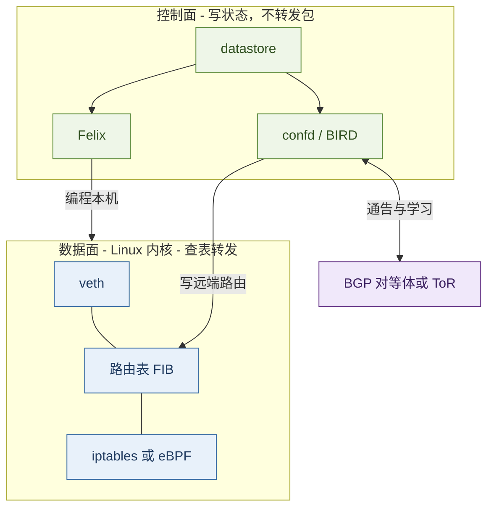
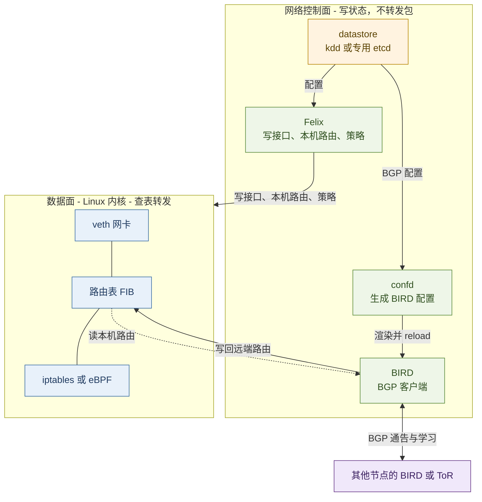
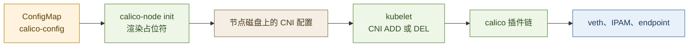
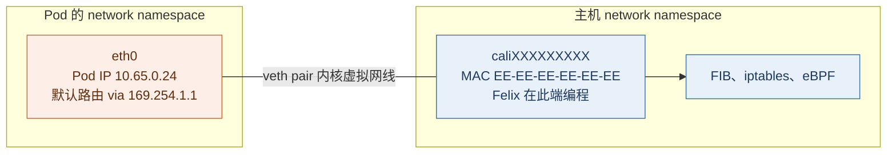
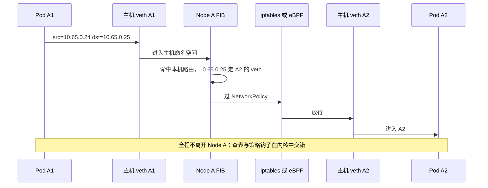
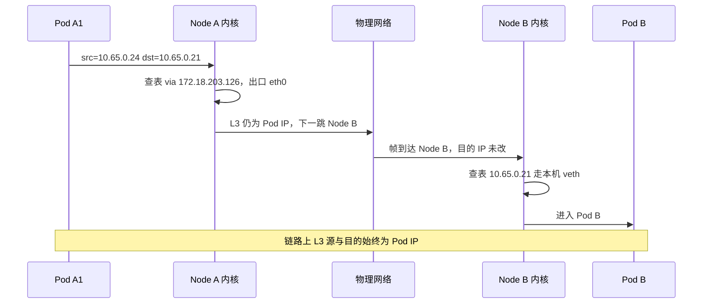
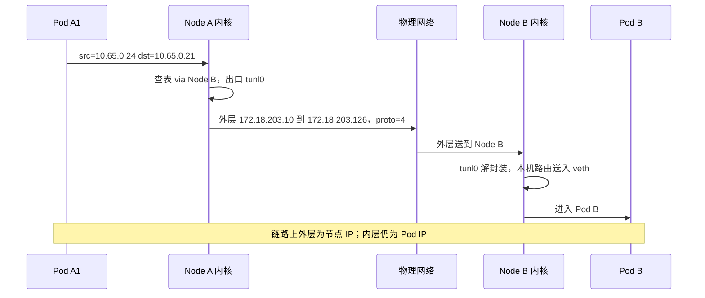
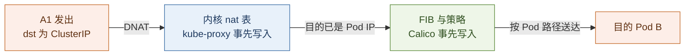

# Calico 三层网络专论：控制面写表与内核转发

> Calico 之名源自 Felix（卡通形象「菲力猫」），由 Metaswitch 于 2015 年发起，后由 Tigera 维护并以开源形式进入 CNCF 生态。它把数据中心网络的老问题——「容器之间如何互通」——收敛到一个最朴素的答案：**让每台节点即一台路由器**。

先记住总纲：

> **Calico 是分布式路由控制面 + Linux 内核数据面：**  
> 控制面（Felix、BIRD、confd，以及默认的 kube-proxy）只负责把状态写进内核；数据面是路由表（FIB）、veth、iptables/eBPF——**真正转发数据包的是内核**。控制面短暂异常时，已写入的表项通常仍可继续转发，直至被改写或删除。[1][2][10][13]

可与本库 [《Kubernetes 控制面原则》](./23-kubernetes-control-plane-doctrine.md) 对照：彼处是编排控制面如何收敛；此处是网络控制面如何写表、数据面如何查表。两文合看，编排与网络同属一台「分布式控制计算机」的两个平面。

全文统一用下列节点与地址，便于对照：

| | 节点 IP | 负载 |
|--|---------|------|
| **Node A** | `172.18.203.10` | Pod A1 `10.65.0.24`、A2 `10.65.0.25` |
| **Node B** | `172.18.203.126` | Pod B `10.65.0.21` |
| **Service** | ClusterIP `10.96.0.50:80` | Endpoint B `10.65.0.21:8080`（§4） |

---

## 目录

| | |
|--|--|
| **取舍** | [1. 问题与 Calico 的取舍](#1-问题与-calico-的取舍) |
| **控制面** | [2. 节点控制面：三个进程 + CNI](#2-节点控制面三个进程--cni) · [2.5 CNI 配置](#25-cni-配置kubelet-如何调用-calico) |
| **数据面** | [3. 数据面：Pod 包的路径](#3-数据面pod-包的路径) · [4. Service 与 kube-proxy](#4-service-与-kube-proxy) · [4.1 kube-proxy](#41-kube-proxy节点上的-service-控制器) · [4.2 DNAT 与 conntrack](#42-dnat-与-conntrackvip-如何变成-endpoint) |
| **路由与地址** | [5. 路由如何装上](#5-路由如何装上) · [6. 地址分配与封装](#6-地址分配与封装) |
| **落地** | [7. 选型与排查](#7-选型与排查) |
| **收束** | [8. 总结](#8-总结) · [9. 参考文献](#9-参考文献) |



kube-proxy 同属控制面（watch API、写本机 Service 规则），不在 `calico-node` 内，见 §4。

---

## 1. 问题与 Calico 的取舍

Kubernetes 对网络的要求很简洁：每个 Pod 一个 IP，任意两个 Pod 直接互访，中间不做 NAT。[3] 这只约束 **Pod IP ↔ Pod IP**（§3）。访问 ClusterIP 时，目的是虚地址，内核须先做 DNAT，把目的改成某个 Endpoint 的 Pod IP（§4.2）——那不是对「Pod 互访不做 NAT」的违背。

满足该要求常见有两条路径：

| 思路 | 做法 | 代价 |
|------|------|------|
| **Overlay（封装）** | underlay 只转发节点 IP；将 Pod 包再封装一层节点 IP | 每包多一层头；underlay 不必认识 Pod IP |
| **原生路由（不封装）** | 让 underlay 也识别 Pod IP，按三层转发（同二层则可直达节点） | L3 时 underlay 须能把「不属于节点子网」的地址送到目的节点 |

二者都跑在同一张 **underlay** 上——即节点之间已有的二层/三层网络或 VPC。差别只在：原生路由把 **Pod IP 原样交给 underlay**；overlay 再封一层，让 underlay **只看见节点 IP**。业界与 Tigera 也常把前者叫 underlay 组网、后者叫 overlay 组网，但这是组网方式的简称，不是说「不封装 = underlay 这张网」。[5][10]

Calico 的**设计本意**是第二条：每台节点即一台路由器，转发交给 Linux 内核；「该 Pod IP 位于哪台机器」由 BGP 在节点间分发。[10] 仅当 underlay 无法转发 Pod IP（公有云跨子网、交换机不可控）时，才退回 IPIP / VXLAN overlay。[5] 须与**安装器默认**区分：Operator 安装时 IP 池封装默认为 IPIP（§6.2）。

### 1.1 宏观视角：控制面与数据面

网络侧与编排侧同一套划分：**控制面决定期望态，数据面执行每一个包。** 在 Calico 集群里：

| 平面 | 职责 | 典型组件 | 故障时的表现 |
|------|------|----------|--------------|
| **控制面** | 监视期望态，把路由、策略、Service 规则写入本机内核 | Felix、confd、BIRD；默认还有 kube-proxy；上游为 datastore | 新 Pod / 新策略可能装不上；**已写入的表项通常仍可转发** |
| **数据面** | 按内核表项转发与过滤每一个包 | 路由表（FIB）、veth、iptables 或 eBPF | 表项错误或缺失则丢包或误转发；控制面进程不在包路径上 |

**FIB（Forwarding Information Base，转发信息库）** 是内核里真正用来做「这个目的 IP 下一跳是谁、从哪块网卡出去」的那张表。Felix 官方职责即把本机 endpoint 的路由「program into the Linux kernel FIB」；`ip route` / `ip route get` 看到的，就是这份 FIB（或其用户可见视图）。[1][2] 后文凡写「查路由表」，均指查 FIB。

由此须分开看待的三类问题（后文分别展开）：

| 问题 | 默认由谁编程数据面 | 写入什么 |
|------|-------------------|----------|
| **Pod IP 能否到达** | Calico：本机路由 Felix；跨节点 cluster routes 默认 BIRD | 路由表（FIB）[1][2] |
| **到达后是否放行** | Calico：NetworkPolicy → Felix | iptables / eBPF 策略链 [1] |
| **Service VIP → Endpoint** | **kube-proxy**（ClusterIP / NodePort 等） | iptables `KUBE-*`、IPVS 或 nft [13][18] |

**Pod 互通与 Service 转发是两条数据面路径**：前者见 §3，后者见 §4。控制面如何把路由事先装上，见 §5。

---

## 2. 节点控制面：三个进程 + CNI

每个节点上有一个 `calico-node` Pod（镜像 `calico/node`），内含三个常驻进程——它们属于**网络控制面**。此外 kubelet 在创建/删除 Pod 时调用 **CNI 插件**（不属于这三个进程）：分配 IP、创建 veth；Felix 再补齐本机内核状态。[1][3] kubelet 读的不是 API 里的 ConfigMap，而是节点磁盘上由该 ConfigMap 渲染出的 CNI 配置（§2.5）。同节点上通常还有 **kube-proxy**（独立 DaemonSet，不属于 `calico-node`），只编程 Service 虚地址，见 §4。



三个进程的边界，按「与内核」「与其他节点」两条线划分：

| | **Felix** | **BIRD** | **confd** |
|--|-----------|----------|-----------|
| 职责 | 将本机 endpoint 所需路由与策略写入内核 [1] | 用 BGP 分发本机路由，并将习得的远端路由写回 [1][2] | 监视集群配置，生成 BIRD 配置并触发其加载 [1] |
| 与内核 | **写**：接口属性、本机 Pod 路由、防火墙规则 | **读**本机路由，**写**远端路由 | **不接触内核** |
| 与其他节点 | 不建立 BGP | 与其他节点 / 交换机建立 BGP | 不建立会话 |
| 不做 | 不建 veth，不跑 BGP | 不建 veth，不写 NetworkPolicy | 不转发，不写 iptables |

### 2.1 datastore：先予澄清，勿与 etcd 混为一谈

文档中反复出现的 **datastore** 是一个抽象，而非某个具体组件。Calico 将所有配置（`IPPool`、`BGPPeer`、`FelixConfiguration`、NetworkPolicy、endpoint 状态……）放入 datastore，Felix / confd / kube-controllers 均从中读取。它有两种实现，**Kubernetes 集群默认并非直接使用 etcd**：[1][12]

| datastore | 实际存储位置 | 访问方式 | 适用场景 |
|-----------|---------|----------------|-----------|
| **Kubernetes API datastore（kdd）** | Kubernetes API server 背后的 etcd（**即 K8s 自身的 etcd**），以 `projectcalico.org/v3` CRD 形式存储 | 经 Kubernetes API（kube-apiserver），与 `kubectl` 同路径 | **K8s 集群默认**；管理简单，可复用 RBAC / audit log |
| **etcd** | 一个**专供 Calico 的 etcd**（可独立于 K8s 的 etcd，也可共享） | Calico 组件直连 etcd gRPC | 非 K8s 平台、多 K8s 集群共用一份 Calico、或希望 Calico 与 K8s 数据存储独立扩容 |

两处易混点：

- **kdd 模式下，物理存储仍是 etcd** —— 因 Kubernetes 自身以 etcd 为后端。区别仅在于 Calico **不直连 etcd**，而是经 kube-apiserver 读写 CRD。故「datastore = etcd」在 kdd 下**只对一半**：物理上对，访问路径上不对。
- **etcd 模式下，该 etcd 归 Calico 专属**，与 K8s 控制面的 etcd 通常为两套，可独立扩容、独立备份。这才是「datastore 指 etcd」最准确的语境。

此区别的重要性：

- **扩容对象不同**：kdd 的瓶颈在 kube-apiserver（以 Typha 缓解）；etcd 模式的瓶颈在专用 etcd（按 etcd 规模调参）。
- **故障域不同**：kdd 下 K8s apiserver 故障则 Calico 亦读不到配置；etcd 模式下两套存储互不影响。
- **运维边界不同**：kdd 复用 `kubectl` 一套工具、一套 RBAC、一套 audit；etcd 模式须单独维护 etcd 的备份、证书、压缩。

概括：K8s 默认安装里 datastore 是 kube-apiserver 背后那套 etcd，Calico 只经 Kubernetes API 访问；唯有显式 etcd 模式才直连专用 etcd。

### 2.2 Felix：本机执行者

官方列出四项职责，全部发生在**本机**：[1]

| 职责 | 写入位置 | 效果 |
|------|--------|------|
| 接口 | 网卡参数、ARP、转发开关 | 主机以**自身 MAC** 回答 Pod 的 ARP；开启 IP 转发 [1][2] |
| 本机路由 | 路由表（FIB） | 「去往本机某 Pod IP，从对应 veth 出去」 |
| 策略 | iptables 或 eBPF | 仅放行 NetworkPolicy 允许的流量，且 Pod 无法绕过 |
| 状态上报 | 写回 datastore | 使本机配置失败可见 |

Felix 不与其他节点交换路由。

### 2.3 BIRD：BGP 客户端

Felix 将本机路由插入内核 FIB 后，BIRD 用 BGP 将其分发；对端通告的路由，BIRD 再写回本机 FIB。[1][2] 它不创建网卡，也不解释 NetworkPolicy。VXLAN 池的 cluster routes 默认由 Felix 写，见 §5.3。

### 2.4 confd：BIRD 的配置生成器

confd 监视 datastore（kdd 下为 kube-apiserver 中的 CRD，etcd 模式下为专用 etcd）中与 BGP 相关的配置（AS 号、对等体、IPAM 等）。配置变更后，重写 BIRD 配置文件并触发 BIRD 重新加载。[1] BGP 对等体变更链路：

```text
改 BGPPeer / BGPConfiguration
   → 写入 datastore（kubectl apply CRD，或写 etcd）
   → confd 监到变化，生成新 BIRD 配置
   → BIRD reload
   → 会话按新配置建立
```

Felix 写策略 **不经过** confd。

仅需策略、不分发节点间路由时（部分托管云），设 `CALICO_NETWORKING_BACKEND=none`：仅保留 Felix，不运行 BIRD 与 confd。[1]

### 2.5 CNI 配置：kubelet 如何调用 Calico

三个进程负责把状态写入内核；**真正在创建/删除 Pod 时被 kubelet 调用的，是 CNI 插件**。manifest / Kubespray 安装把这份合同放在 `kube-system/calico-config` ConfigMap：`calico-node` 的 init 容器把它写到每个节点的 `/etc/cni/net.d/`（并安装 `/opt/cni/bin/` 下的二进制），kubelet 只读磁盘上的那份。[3][15]

Operator 安装不走这份 ConfigMap，而由 `Installation` CR 生成等价文件。下文标本取自 **Kubespray + BGP** 集群（已去掉 `uid`、`resourceVersion`、`last-applied-configuration` 等运行时元数据）。



```yaml
apiVersion: v1
kind: ConfigMap
metadata:
  name: calico-config
  namespace: kube-system
data:
  calico_backend: bird
  cluster_type: kubespray,bgp
  cni_network_config: |-
    {
      "name": "calico",
      "cniVersion": "0.3.1",
      "plugins": [
        {
          "type": "calico",
          "datastore_type": "kubernetes",
          "nodename": "__KUBERNETES_NODE_NAME__",
          "log_level": "info",
          "log_file_path": "/var/log/calico/cni/cni.log",
          "ipam": {
            "type": "calico-ipam",
            "assign_ipv4": "true"
          },
          "policy": {
            "type": "k8s"
          },
          "kubernetes": {
            "kubeconfig": "__KUBECONFIG_FILEPATH__"
          }
        },
        {
          "type": "portmap",
          "capabilities": { "portMappings": true }
        },
        {
          "type": "bandwidth",
          "capabilities": { "bandwidth": true }
        }
      ]
    }
```

**顶层两键：管 `calico-node` 怎么跑，不直接给 kubelet。**

| 键 | 标本值 | 含义 |
|--|--------|------|
| `calico_backend` | `bird` | 注入环境变量 `CALICO_NETWORKING_BACKEND`：跑 BIRD + confd，用 BGP 分发 cluster routes。取值 `none` 则只留 Felix（§2.4）；`vxlan` 则内部可不跑 BGP（§5.3）。[8] |
| `cluster_type` | `kubespray,bgp` | 逗号分隔的**遥测 / 部署标签**，标明安装器与组网特征。`kubespray` 说明谁装的，`bgp` 与 `bird` 后端配套；**它本身不开启 BGP**。真正决定是否跑 BIRD 的是 `calico_backend`。[8] |

Kubespray 的模板正是：后端为 `bird` 时写入 `cluster_type: kubespray,bgp`，否则只标 `kubespray`。见到此组合即可判断：manifest 安装、BGP 原生路由后端，而非 Operator 或纯 VXLAN 后端。

**`cni_network_config`：kubelet 实际执行的插件链。**

`cniVersion: 0.3.1` 是 **CNI 规范版本**（0.3.0 起支持 `plugins` 数组链式调用），不是 Calico 版本。[16] `name: calico` 是这条网络的名字，IPAM 用它隔离地址空间。数组按序执行：第一个建网，后两个叠加能力。Calico 官方默认即链上 `portmap` 与 `bandwidth`。[15]

| 插件 | 职责 | 与后文的关系 |
|------|------|----------------|
| **calico** | 分配 IP、创建 veth、写 WorkloadEndpoint | §3.1、§5.2、§6.1 |
| **portmap** | 实现 Pod 的 `hostPort` | **不是** Service / NodePort（那是 kube-proxy，§4） |
| **bandwidth** | 实现 `kubernetes.io/ingress-bandwidth`、`egress-bandwidth` 注解 | 用 TBF / IFB 做限速；无注解则几乎无开销 [17] |

calico 插件各字段：

| 字段 | 标本值 | 含义 |
|------|--------|------|
| `datastore_type` | `kubernetes` | CNI 走 kdd：经 kube-apiserver 读写 CRD，**不直连 etcd**（§2.1）。插件默认值其实是 `etcdv3`；K8s 安装必须显式写成 `kubernetes`。[15] |
| `nodename` | `__KUBERNETES_NODE_NAME__` | 占位符，init 容器替换为本机 Kubernetes Node 名。须与 datastore 中的 node 一致，否则 IPAM / WorkloadEndpoint 对不上节点 |
| `log_level` / `log_file_path` | `info` / `/var/log/calico/cni/cni.log` | **CNI 插件自己的日志**，在宿主机上，不在 `calico-node` 容器的 stdout。Pod 卡在 `ContainerCreating` 时先看这里 |
| `ipam.type` | `calico-ipam` | 使用 Calico 块分配（§6.1），而非 `host-local` 取 Node 的 `podCIDR` |
| `ipam.assign_ipv4` | `"true"` | 只分配 IPv4；双栈须再开 `assign_ipv6`。CNI 惯例里布尔常写成字符串 |
| `policy.type` | `k8s` | 从 Kubernetes API 读 NetworkPolicy；**此处不写任何具体策略**，只声明策略源。还须 kube-controllers 的 policy / workloadendpoint 控制器配合 [15] |
| `kubernetes.kubeconfig` | `__KUBECONFIG_FILEPATH__` | 占位符，通常换成 `/etc/cni/net.d/calico-kubeconfig`。CNI 用它访问 apiserver：读 Pod 标签、写 endpoint——与 Felix 同为 kdd 路径，但是**另开的一份凭证** [15] |

两个占位符由 `calico-node` 的 install-cni 容器在写盘时替换。kubelet 从未见过 `__KUBERNETES_NODE_NAME__` 这种字面量。

**这份 ConfigMap 不包含什么——比它包含什么更要紧。**

| 不在 ConfigMap 里 | 实际在哪 |
|-------------------|----------|
| IP 池、块大小 | `IPPool` CRD（§6.1） |
| 封装 IPIP / VXLAN | `IPPool` 的 `ipipMode` / `vxlanMode`（§6.2） |
| BGP 对等体、AS 号 | `BGPConfiguration` / `BGPPeer`；confd 再生成 BIRD 配置（§2.4、§5.4） |
| NetworkPolicy 规则 | K8s / Calico 的 Policy 对象；此处 `policy.type: k8s` 只选策略源 |
| Service VIP → Endpoint | kube-proxy 或 eBPF（§4） |
| MTU | Felix / IPPool / 自动探测（§7.1）；本标本甚至未写 `mtu` 字段 |

故：**改 ConfigMap 改的是「kubelet 怎么调 CNI」以及「calico-node 用哪种 networking backend」；改路由、封装、地址池，须改 datastore 里的 CRD。** 二者都改了，还须等节点上的 conflist 被重新渲染——只改 API 对象、磁盘上的旧文件还在，kubelet 仍按旧合同执行。

---

## 3. 数据面：Pod 包的路径

官方将数据面归纳为：**主机 MAC 答 ARP、按 FIB 转发、用 iptables 或 eBPF 做防火墙。**[2] 无用户态转发进程。注意：内核里路由查找与 iptables 钩子是交错的（PREROUTING → 查 FIB → FORWARD / INPUT → POSTROUTING），下图把 FIB 与策略画成并列对象，避免理解成严格的「先路由后防火墙」流水线。

### 3.1 veth：Pod 与主机之间的虚拟网线

三种场景的首步均为「包从 Pod 出来，经 veth 进主机」。此处一次性讲透，后文不再展开。

**veth 是 Linux 内核的一种虚拟网卡，永远成对出现**：两块接口如同一根虚拟网线相连，从一端注入的包会从另一端弹出。两端可置于不同的 network namespace，故 veth 成为连接两个网络命名空间的标准手段。[3]

Calico 在 K8s 中的用法（Pod 创建时由 **CNI 插件**完成，而非 Felix；kubelet 所读配置见 §2.5）：[3]



各步骤按执行者分类：[1][3]

| 对象 | 执行者 | 作用 |
|------|----------|------|
| **veth 这对网卡** | **CNI 插件**（kubelet 调 CNI 时创建） | 一端入 Pod ns，一端留主机 ns；Pod 收发包的物理通道 |
| Pod 端接口名 | CNI 按 CNI args 的 `IfName`，通常为 `eth0` | Pod 内可见的网卡 |
| 主机端接口名 | CNI 命名为 `cali` + 容器 ID 前 11 位（老版本）或 `cali` + `sha1(namespace.pod)[:11]`（新版本），前缀 `cali` 是 Felix `InterfacePrefix` 的默认值 | Felix 据此识别 workload 接口 |
| 主机端 MAC | CNI 设为 `EE:EE:EE:EE:EE:EE` | 固定值，免去内核生成持久 MAC，并便于 Felix 统一处理 |
| Pod 端路由 | CNI 配置：默认网关指向 `169.254.1.1`（link-local），走 `eth0` | Pod 将所有流量发往 eth0，无须感知真实下一跳 |
| 主机端属性 | **Felix**：开启 IP 转发、令主机以自身 MAC 回答 ARP、将 `10.65.0.24` 路由指向该 `cali…` | 包进入主机即可被正确转发与过滤 |
| WorkloadEndpoint | CNI 创建后写入 datastore；记录 `interfaceName: cali…`、Pod IP、MAC、node 等 | Felix 据此识别归属并编程 |

故「**包从 Pod 出来，经 veth 进主机**」可拆解为：

1. Pod 将包发给默认网关 `169.254.1.1`，从 `eth0` 出去；
2. `eth0` 是 veth 的一端，包穿过内核虚拟网线，**出现在主机 ns 的对端 `cali…` 上**——即「进入主机」；
3. 主机内核接管：查 FIB、过 iptables/eBPF、决定出口网卡。

关键：**veth 只是通道，不转发也不路由**。真正决定包去向的是主机 FIB；Felix 的职责即保证此表与接口属性正确。Pod 一侧无须感知真实拓扑——仅将包发往 eth0。

以下三种场景，前两步相同：包从 Pod 出来，经 veth 进主机，主机以自身 MAC 回答 ARP。区别仅在主机查 FIB 后的出口。

### 3.2 同一台机器：A1 → A2

Node A 上 `10.65.0.24 → 10.65.0.25`。此路径不经物理网卡、不经隧道、转发不依赖 BGP。



| 步 | 发生什么 | 谁事先写好的 |
|----|----------|--------------|
| 1 | A1 将包发给默认网关 `169.254.1.1` | CNI 配置的 Pod 内路由 |
| 2 | 主机以自身 MAC 回答 ARP，包进主机 | Felix 的接口/ARP 设置 [2] |
| 3 | FIB：`10.65.0.25` 直连，出口为 A2 的 veth | Felix 写入的本机路由 [2] |
| 4 | 策略链决定放行或丢弃 | Felix 写入的 iptables / eBPF |
| 5 | 包从 A2 的 veth 进入 A2 | — |

Node A 的 FIB 中这两条均由 Felix 写入：

```text
10.65.0.24/32   dev cali…A1    # 本机 Pod
10.65.0.25/32   dev cali…A2    # 本机 Pod
```

### 3.3 跨节点、不封装（原生路由 / underlay 组网）：A1 → B

**何时用：** underlay 已经能把 Pod IP 送到目的节点。两种常见形态：[3][5]

| 形态 | underlay 做什么 | 是否要求交换机认识 Pod 网段 |
|------|-----------------|------------------------------|
| 节点同二层 | 按 Node B 的 MAC 把帧送到 Node B | 否（二层转发看 MAC，不看 Pod IP） |
| L3 结构 / 与 ToR 建 BGP | 按 Pod CIDR 路由到 Node B | 是（ToR 须学会这些地址） |

两种都**不封装**：包以 Pod IP 原样上路。这是 Calico「节点即路由器」的本意，常称 underlay 组网或原生路由。[3][5][10]

判定很直接：包以目的 IP = `10.65.0.21` 离开 Node A 后，能否出现在 Node B 的网卡上。同二层靠 Node B 的 MAC；跨三层靠 underlay 是否已有该 Pod CIDR。能，用不封装；不能，改 overlay。



| 位置 | FIB 表示意 | 写入者 |
|------|------------|--------|
| Node A | `10.65.0.0/26 via 172.18.203.126 dev eth0` | 默认 BIRD（习得的远端块路由）[2] |
| Node B | `10.65.0.21/32 dev cali…B` | Felix（本机路由）[2] |

`ip route get 10.65.0.21` 在 Node A 上命中的是这块 **/26**，不是每个远端 Pod 一条 /32。BGP 通告以块为主；借用地址才会在远端看到更细的 /32（§6.1）。

### 3.4 跨节点、IPIP（overlay）：A1 → B

**何时用：** underlay 只认识节点 IP，不认识 Pod IP——公有云跨子网、动不了交换机、安全组只放行节点地址。用 IP-in-IP 把原包封装进节点 IP（IPv4 协议号 **4**），隧道口通常为 `tunl0`。这是 overlay：underlay 只转发外层节点 IP。[5][7]

不封装走不通、又需要 IPv4 且不在 Azure 上时，IPIP 是常见退路。Azure 会丢弃协议 4，应改 VXLAN overlay。[4][5]

```text
内层（原包）   10.65.0.24   →  10.65.0.21
外层（封装头） 172.18.203.10 →  172.18.203.126   proto = 4
```



| 位置 | FIB 表示意 | 写入者 |
|------|------------|--------|
| Node A | `10.65.0.0/26 via 172.18.203.126 dev tunl0` | 默认 BIRD；常见带 `proto bird` |
| Node B | `10.65.0.21/32 dev cali…B` | Felix |

FIB 出口是 `tunl0`（封装），封装后的外层包仍从物理网卡送出。IPIP 与 BGP **并非互斥**：BGP 管下一跳，`tunl0` 管封装。[5]

### 3.5 三条路径对照

| | 同机 A1→A2 | 跨机不封装 A1→B | 跨机 IPIP A1→B |
|--|------------|-----------------|---------------|
| **网络形态** | 包不出节点，无 underlay / overlay 之分 | **原生路由**（常称 underlay 组网）：Pod IP 由 underlay 直接转发 | **Overlay**：IP-in-IP 封装；underlay 只见节点 IP |
| **何时用** | 两 Pod 在同一节点（与封装无关） | underlay 能把 Pod IP 送到 Node B | underlay 不能转发 Pod IP；IPv4 且非 Azure |
| 出 Pod | veth 进主机 | 同上 | 同上 |
| Node A 查 FIB | 直连 A2 的 veth | `via Node B`，出口物理网卡 | `via Node B`，出口 `tunl0`，封装后再出物理网卡 |
| 链路上的 L3 头 | 无物理链路 | 仍是 Pod IP | 外层节点 IP，内层原包 |
| 到达目的 Pod | 本机 veth 送入 A2 | 包到 Node B 后，内核按已写入的本机路由送入 | 先解封装，再按本机路由送入 |
| 包路径是否经过 BGP | 否 | 否（路由已事先装入 FIB） | 否 |
| BGP 的作用（控制面） | 向其他节点通告 A1/A2 所在块 | 事先将「B 所在块在 Node B」写入 A 的 FIB | 同上 |

末行是关键：BGP 运行于**控制面、事先**；每个数据包仅查内核。两端策略链在同机与跨机时均会检查，与是否封装无关。[2] 封装里 IPIP 与 VXLAN 都是 overlay；`CrossSubnet` 为同子网原生、跨子网再封装，见 §6.2、§7.1。

---

## 4. Service 与 kube-proxy

§3 描述的是 **Pod IP ↔ Pod IP** 的数据面路径。应用日常访问的却多是 **Service VIP**（ClusterIP、NodePort、LoadBalancer）。须分开看：**默认 iptables 数据面下，Calico 不替代 kube-proxy；二者协作——kube-proxy 编程 Service 规则，Calico 编程 Pod 路由与策略。**[13]

### 4.1 kube-proxy：节点上的 Service 控制器

| | **Calico（默认 iptables 数据面）** | **kube-proxy** |
|--|-----------------------------------|----------------|
| 管什么 | Pod 互通、NetworkPolicy、跨节点路由（BGP / cluster routes） | Service VIP → Endpoint 的 DNAT 与负载均衡（§4.2） |
| 写入内核 | 路由表（FIB）、`cali*` 接口侧策略链 | iptables `KUBE-*` 链，或 IPVS / nft 表 |
| 包路径上是否出现 | 否（只写表） | 否（只写规则；转发仍在内核） |
| 与对方关系 | **与 kube-proxy 共存、兼容第三方 iptables** [13] | 独立组件，不依赖 Calico |

kube-proxy 是**每台节点上的 Service 控制器**（通常为 `kube-system` 中的 DaemonSet），默认不是用户态代理。它 watch Service 与 EndpointSlice，把「该 VIP 此刻对应哪些 Pod」写成**本机**内核规则；各节点各自从 API 收敛到同一语义，彼此不互相同步这份表。[18] 故从任一节点访问同一个 ClusterIP，都在**本机**完成 DNAT。进程退出后，已写入的规则通常仍生效，直到被改写或节点重启。

| `--proxy-mode` | 写入何处 |
|----------------|----------|
| **iptables** | nat 表 `KUBE-*`（最常见） |
| **ipvs** | IPVS 虚拟服务 + 少量 iptables |
| **nftables** | nft（较新可选） |

三种模式表达的规则相同：VIP → Endpoint；差别只在内核对象。目的如何改写见 §4.2。

| Service 类型 | kube-proxy 在本机做的 | 不做的 |
|--------------|----------------------|--------|
| **ClusterIP** | 为虚地址写 DNAT / 负载均衡 | Pod 路由、NetworkPolicy、CoreDNS、Ingress、`hostPort`（§2.5） |
| **NodePort** | 把 `节点IP:nodePort` 导入同一套后端 | 同上 |
| **LoadBalancer** | 节点侧仍是 ClusterIP + NodePort | 云上的外部地址（cloud-controller / MetalLB 等）；其余同上 |



可观察结论：**访问 Service 时，先过 kube-proxy 写下的 DNAT，再进入 Calico 已装好的 Pod 路由与策略。** 查不通时，先分清卡在「VIP 没翻译」还是「Pod IP 走不到」。

### 4.2 DNAT 与 conntrack：VIP 如何变成 Endpoint

**DNAT（Destination Network Address Translation，目的地址转换）** 改写数据包的**目的** IP（常连同目的端口）。相对的是 **SNAT**（Source NAT，源地址转换），改写**源** IP。kube-proxy 默认 iptables 模式下，Service 靠的就是 DNAT。[18]

| | 改写 | 在 Service 路径上的用途 |
|--|------|--------------------------|
| **DNAT** | 目的地址与端口 | ClusterIP / NodePort → 某个 Endpoint 的 Pod IP:Port |
| **SNAT / MASQUERADE** | 源地址 | NodePort 且 `externalTrafficPolicy: Cluster` 时常见：把源改成节点 IP，使回程必经本机 |

ClusterIP（如 `10.96.0.50`）是**虚地址**：不配在任何网卡上，FIB 里也没有「去这个 IP 从哪块网卡出去」。客户端把包发给它之后，必须在**查路由之前**把目的改成真实 Endpoint，后面才能走 §3 的 Pod 路径。执行改写的是内核 netfilter（或 IPVS / eBPF），不是 kube-proxy 进程。[13][18]

iptables 模式下发生在 nat 表：

| 包从哪来 | DNAT 钩子 | 随后 |
|----------|-----------|------|
| 经 veth / 物理网卡进入本机（Pod 访问 ClusterIP 属此类） | **PREROUTING** | 再查 FIB，目的已是 Pod IP |
| 本机进程自己发出 | **OUTPUT** | 同样先改目的，再路由 |

链的名字可在节点上看到：`KUBE-SERVICES` → 某 Service 的 `KUBE-SVC-*`（在多个 Endpoint 间按概率负载均衡）→ 某个 Endpoint 的 `KUBE-SEP-*`（`-j DNAT --to-destination`）。[18]

用全文地址走一遍 A1 访问该 Service：

```text
A1 发出     src=10.65.0.24     dst=10.96.0.50:80     （客户端只看见 VIP）
Node A DNAT src=10.65.0.24     dst=10.65.0.21:8080   （目的换成 Endpoint B）
此后        按 §3 送到 Node B，进入 Pod B
```

**conntrack（connection tracking，连接跟踪）** 是内核模块 `nf_conntrack` 维护的流表，按五元组记下每条连接及其 NAT 结果。DNAT 规则主要作用于**首包**（`NEW`）；同一连接的后续包和回程包查这张表，而不是再走一遍 `KUBE-SVC-*` 做负载均衡。[19] 它不是 kube-proxy 写入的规则，而是 netfilter 做 NAT 时自动建立的**数据面状态**。

| | 正向（A1 → Service） | 反向（B → A1） |
|--|----------------------|----------------|
| 改写 | DNAT：目的 VIP → Endpoint | conntrack **自动反向**：源 Endpoint → VIP |
| 发生在哪 | 做 DNAT 的节点（此处 Node A） | **必须仍经过 Node A** |

B 的应答是 `src=10.65.0.21 dst=10.65.0.24`。回到 Node A 后，conntrack 把源改回 `10.96.0.50`，A1 看见的对端仍是 VIP。若回程不经过 Node A，表项用不上，客户端会看到源是 Pod IP，TCP 对不上而失败——这正是 NodePort 在 `externalTrafficPolicy: Cluster` 下要 SNAT 的原因：正向把源改成节点 IP，回程目的就是本机，必经这份 conntrack。

IPVS 自有连接表，语义相同。eBPF 数据面则把等价状态放进 BPF maps（§4.4）。表满（`nf_conntrack_count` 触顶）时表现为随机断连，与「规则没写上」不同。

因此三条路径必须分开：

| 路径 | 是否 NAT | 谁编程 |
|------|----------|--------|
| Pod IP ↔ Pod IP（§3） | 否 | Calico（FIB / 策略） |
| 访问 ClusterIP / NodePort | **DNAT**（可能再加 SNAT） | kube-proxy 或 eBPF |
| Overlay 封装 | 不是 NAT；是再套一层头 | IPIP / VXLAN（§3.4、§6.2） |

### 4.3 故障对照（标准 Linux 数据面）

Calico 标准数据面与 kube-proxy 共存。[13] 概念路径：veth 进主机 → DNAT（§4.2）→ FIB（§3）→ 策略链 → 目的 Pod。

- **关掉 kube-proxy、又未启用 eBPF 替代** → ClusterIP / NodePort 不通。
- **Calico 挂了、kube-proxy 还在** → DNAT 可能仍在，但 Pod 路由/策略可能已坏。
- 排查：`iptables-save | grep KUBE-SERVICES`（或 `ipvsadm -Ln`）看 VIP 映射；`ip route get <PodIP>` 看 Calico 路由。

### 4.4 eBPF 数据面：Calico 可替代 kube-proxy

启用 eBPF 数据面后，Calico **在数据面内直接实现 Kubernetes Service 网络**，不再依赖 kube-proxy；官方明确建议此时 **禁用 kube-proxy**，以免浪费资源、混淆「到底谁在处理 Service」。[13][14]

| 维度 | 标准 Linux 数据面（默认） | eBPF 数据面 |
|------|---------------------------|-------------|
| Service 实现 | kube-proxy（iptables / IPVS / nftables） | Calico BPF 程序与 maps [13] |
| 与 kube-proxy | **共存** | **宜禁用**；继续跑则浪费且易冲突 [14] |
| 外部源 IP（NodePort） | 通常需 `externalTrafficPolicy: Local` 才保留 | 默认可保留外部源 IP [13] |
| 策略实现 | iptables / ipset | BPF 指令与 maps |
| 设计重心 | 兼容性 | 吞吐、时延、体验 [13] |

若发行版**不允许**关掉 kube-proxy，须将 Felix 的 `bpfKubeProxyIptablesCleanupEnabled` 设为 `false`。否则 Felix 会清理 kube-proxy 写下的 iptables 规则，kube-proxy 再写回，规则来回抖动，CPU 飙高。[14]

```bash
# eBPF 且无法禁用 kube-proxy 时
kubectl patch felixconfiguration default --type merge \
  -p '{"spec":{"bpfKubeProxyIptablesCleanupEnabled":false}}'
```

另：从 IPVS 模式迁到 eBPF / 禁用 kube-proxy 前，须先把 kube-proxy **切到 iptables 模式**并重启节点，否则迁移失败。[14]

### 4.5 排查对照：谁在编程 Service

| 现象 | 更可能的原因 |
|------|----------------|
| Pod IP 互通，ClusterIP 不通 | DNAT 未发生（§4.2）：kube-proxy 未运行 / 规则缺失；或 eBPF 未就绪却已关 kube-proxy |
| ClusterIP 通，跨节点 Pod IP 不通 | Calico 路由/BGP/封装问题（§3、§5），与 kube-proxy 无关 |
| 连上 VIP 但回程源地址对不上、连接重置 | 回程未经过做 DNAT 那台节点的 conntrack；或需 SNAT（§4.2） |
| eBPF 开启后 CPU 很高、iptables 抖动 | kube-proxy 仍在跑，且 `bpfKubeProxyIptablesCleanupEnabled=true` [14] |
| NodePort 日志里源 IP 是节点 IP | 标准数据面 + `externalTrafficPolicy: Cluster` 的 SNAT；要保留源 IP 用 Local，或考虑 eBPF [13] |

```bash
# 谁在跑
kubectl -n kube-system get ds kube-proxy
kubectl get felixconfiguration default -o yaml | grep -E 'bpf|linuxDataplane|dataplane'

# Service 规则是否存在（iptables 模式）
iptables-save -c | grep -E 'KUBE-SERVICES|KUBE-SEP' | head
# 本机是否已有该 VIP 的连接跟踪
grep 10.96.0.50 /proc/net/nf_conntrack | head
```

---

## 5. 路由如何装上

跨机转发成立的前提是：Node A 的 FIB 中**事先**已有「去 `10.65.0.21` 下一跳为 Node B」。这是**控制面**工作；每一个数据包仍只查**数据面**。

### 5.1 数据面对象由谁编程

| 内核对象 | 默认写入者 | 转发时用途 |
|----------|----------------|--------------|
| veth 这对虚拟网线 | **CNI** 创建（合同见 §2.5）；Felix 再写 ARP、转发等属性 [1][3] | 包进出 Pod |
| 路由表（FIB） | **本机 Pod**：Felix；**其他节点上的 Pod**：默认 BIRD（VXLAN 池则为 Felix）[2][5] | 决定下一跳与出口网卡 |
| 策略链（iptables / eBPF） | **Felix**（NetworkPolicy） | 决定放行或丢弃 |
| **conntrack** | 内核在 NAT 时自动建立（§4.2） | 同一连接后续包与回程的反向改写 |
| Service 链（`KUBE-*` / IPVS / nft） | **kube-proxy**（默认）；eBPF 模式下改由 Calico [13] | VIP → Endpoint |

### 5.2 控制面时序：新建 Pod 之后

```text
1. kubelet 按节点上的 CNI 配置（§2.5）调 Calico CNI：分配 IP，创建 veth，写 WorkloadEndpoint
2. Felix 写入本机：
      接口（主机 MAC 答 ARP、开启转发）
      FIB 添加「10.65.0.24 → 该 veth」
      策略规则
3. BIRD 从 FIB 读取此本机路由
4. BIRD 经 BGP 通告 Node B：去 A1 **所在块**（常见 /26），下一跳 `172.18.203.10`
5. Node B 的 BIRD 将对端路由写入本机 FIB
```

第 3～5 步仅发生一次（或随 Pod 增删而变化）。此后 **A1 访问 B 的每个包仅查内核，不再涉及 Felix 或 BIRD**。[2]

### 5.3 cluster routes 由谁写入

到其他节点的路由，官方称 cluster routes。默认分工：[5]

- IPIP 池与不封装的池：由 BGP（BIRD）分发；
- VXLAN 池：由 Felix 直接写入。

亦可改为全部由 Felix 写入（`FelixConfiguration.programClusterRoutes=Enabled`，Operator 中为 `clusterRoutingMode: Felix`）。此时集群内部可不运行 BGP；若仍需向机房交换机通告地址，则保留 BGP。[5]

### 5.4 BGP 拓扑

默认为节点间 **iBGP 全连接**（每两台间建立会话）。官方建议量级约 **100 台及以下**；更多则采用路由反射器。默认 AS 号为 **64512**。[4]

| 连接方式 | 含义 | 适用场景 |
|--------|------|------------|
| 节点全连接 | 默认启用 | 中小集群 |
| 路由反射器 | 普通节点连接少数反射器（常用两台做备份）。反射器**只传路由，业务包不经过它** [1][4] | 节点较多时全连接会话数过大 |
| 与机柜交换机对接 | 关闭节点互连，改与 ToR 建 BGP | 机房中希望集群外也能直接访问 Pod IP [3][4] |

查看 BGP 是否建立，使用 `calicoctl node status`，须在**目标节点上**执行，因其查询本机进程。[4] BGP 使用 TCP **179**。

---

## 6. 地址分配与封装

### 6.1 地址分配

Calico IPAM 按块分配给节点，IPv4 默认 **/26**（64 个地址）。块大小仅在创建 IP 池时设定。[6] 是否走这套 IPAM，由 CNI 的 `ipam.type: calico-ipam` 决定（§2.5）；若改成 `host-local` 且 `subnet: usePodCidr`，则改用 Node 的 `podCIDR`。

内核中仍可能出现到某 Pod 的 /32，此为 Felix 写入的本机转发条目；BGP 通告时尽量以整块发布，以减少路由条目。[2][6]

一块用尽后会再申请一块。若无空块，可能从其他节点已占用的块中**借用**地址，此时会为借用地址下发更细的路由，FIB 随之膨胀。官方建议：池中块数不少于节点数。[6]

`disableBGPExport: true` 可禁止将该池地址通过 BGP 发出（v3.21 起）。[6]

### 6.2 是否封装

IPIP / VXLAN 与 BGP **并非互斥**（§3.4）：BGP 回答下一跳是哪台机器；封装回答途中要不要再套一层。开启 IPIP 时 BGP 默认仍通告块路由，本机转发出口走 `tunl0`。[5]

| | 不封装（原生路由） | IPIP overlay | VXLAN overlay |
|--|--------|------|-------|
| 链路上 L3 头所见 | Pod IP | 外层节点 IP，内层原包 | UDP 再封装一层，头比 IPIP 大 |
| 隧道口 | 无 | `tunl0` | `vxlan.calico` |
| 限制 | underlay 须能把 Pod IP 送到目的节点 | 仅 IPv4；Azure 不可用 [4][5] | 若集群中只有 VXLAN 池，内部可不运行 BGP [5] |
| 额外头部 | 0 | IPv4 约 20 字节 | IPv4 约 50 字节，IPv6 约 70 字节 [11] |

同一 IP 池不能同时开启 IPIP 与 VXLAN。[6] 切换封装模式可能中断已建立的连接，应安排在维护窗口。[5]

`ipipMode` / `vxlanMode` 三个取值：[6]

| 取值 | 实际含义（按官方） |
|------|--------------------|
| **Always** | 从启用 Calico 的主机访问该池中的容器/虚拟机时，均走该封装 |
| **CrossSubnet** | 仅当**目的节点 IP 与本节点不在同一子网**时才封装。节点所属子网记录于 Node 对象，一般由 `calico/node` 自行探测 |
| **Never** | 不使用该封装 |

可用 CrossSubnet 时，官方更建议采用：同一子网不封装，跨子网再封装。适合 AWS 多可用区、Azure VNet，以及「一组机器同二层、组间经路由」的网络。[3][5]  
Google 云为纯三层网络，**无** CrossSubnet 这一档，要封装则整网封装。[3]

安装时有两套「默认」，须区分：

- 用 Operator 安装，IP 池的 `encapsulation` **默认为 IPIP**（相当于 `ipipMode: Always`）；[9]
- 自行创建 `IPPool` 对象，字段默认值为 **Never**。[6]

开启 IPIP 或 VXLAN 时，官方建议同时开启 `natOutgoing`。否则出集群流量以 Pod IP 为源，回程可能到不了，或被反向路径检查丢弃。[6]

---

## 7. 选型与排查

### 7.1 选型

先问一句：underlay 是否识别 Pod IP？识别则原生路由，不识别再 overlay。Azure 不可用 IPIP。[3][4][5]

| 环境 | 更稳妥的做法 |
|------|----------------|
| 机房，能与交换机做 BGP | 不封装，与 ToR 交换路由；集群外也可直接访问 Pod |
| 机房，节点同二层 | 节点间 BGP、不封装；集群外仍到不了这些 Pod IP |
| 机房，underlay 不可控 | VXLAN CrossSubnet（或 IPIP CrossSubnet） |
| AWS，希望用 VPC 内 IP | Amazon VPC CNI 做网络，Calico 做策略 |
| AWS / Azure，VPC 地址不足 | Calico 自行组网 + VXLAN CrossSubnet |
| Azure，希望用 VNet 内 IP | Azure CNI + Calico 策略（不要 IPIP） |
| GCP，希望用 VPC 内 IP | 云厂商路由 + host-local IPAM，Calico 做策略 |
| GCP 上自行做 Overlay | VXLAN（或 IPIP）Always，无 CrossSubnet |
| 暂不与 underlay 对接、先快速落地 | VXLAN CrossSubnet |
| 要更高吞吐 / 保留 NodePort 外部源 IP，且可关 kube-proxy | 考虑 eBPF 数据面（§4.4）；**须禁用 kube-proxy** [13][14] |

约一百台以上：BGP 不宜再用全连接，改用反射器或与交换机对接，并开启 **Typha**——它在 datastore（kdd 下即 kube-apiserver）与 Felix / confd 之间做一层缓存与去重，将「N 个节点各自 watch apiserver」收敛为「少数几个 Typha watch，再 fan-out 给数百个 Felix」，否则 apiserver 将被 watch 请求压垮。[1][4]

MTU 默认按当前封装自动计算。修改 MTU **仅对之后新建的 Pod 生效**。[11] 常见 1500 的网络：不封装用 1500，IPIP 用 1480，VXLAN 用 1450，IPv4 WireGuard 用 1440。[11]  
AKS 网卡常显示 1500，underlay 实际更接近 1400；开启 WireGuard 时须按 1400 再减 60，否则易丢包。[11]

### 7.2 排查

先分清：**控制面是否装上表**，还是 **数据面表项已有但被策略/封装挡住**；再分清是 **Pod IP** 还是 **Service VIP**。

| 症状 | 先查 |
|------|------|
| 两 Pod IP 不通 | 数据面路由 / BGP / 封装（§3、§5）：`ip route get` |
| Pod 卡在 `ContainerCreating`，事件含 CNI | 节点 `/etc/cni/net.d/`、`/var/log/calico/cni/cni.log`；对照 ConfigMap（§2.5） |
| Pod IP 通，ClusterIP 不通 | Service DNAT 未发生：kube-proxy 或 eBPF（§4.2、§4.5） |
| 能访问 VIP 但回程异常 | 做 DNAT 节点上的 conntrack / 是否缺 SNAT（§4.2） |
| eBPF 后 CPU 高、iptables 抖动 | 是否与 kube-proxy 双跑（§4.4） |
| 通但策略不符预期 | Felix 策略链 / NetworkPolicy |

```yaml
apiVersion: projectcalico.org/v3
kind: IPPool
metadata:
  name: default-ipv4-ippool
spec:
  cidr: 10.65.0.0/16
  blockSize: 26
  ipipMode: CrossSubnet    # Always | CrossSubnet | Never
  vxlanMode: Never
  natOutgoing: true
```

```bash
calicoctl node status              # 须在目标节点上执行
kubectl -n kube-system get cm calico-config -o yaml   # manifest / Kubespray：CNI 合同
# 节点上 kubelet 实际读取的是磁盘文件，不是 ConfigMap 本身
ls /etc/cni/net.d/; ls /opt/cni/bin/calico*
kubectl get ippool -o yaml
ip route get 10.65.0.21            # 从 Node A 查去 Pod B
ip route get 10.65.0.25           # 从 Node A 查去本机 A2
kubectl -n kube-system get ds kube-proxy   # Service 路径：是否仍由 kube-proxy 负责
```

| `ip route get` 出口 | 通常表示 |
|---------------------|----------|
| 出口为本机 `cali…` / veth | 同机，或已到达目的节点本机 |
| `dev eth0` 且下一跳为对端节点 | 跨机、未封装 |
| `dev tunl0` | 跨机、IPIP |
| `dev vxlan.calico` | 跨机、VXLAN |
| 无到对端 Pod 的路由 | 远端路由尚未装上：查 BIRD / BGP / IP 池 |

再核对：安全组是否放行 TCP 179、IP 协议 4（IPIP）、UDP 4789（VXLAN）。Felix / BIRD 日志在 `calico-node` 容器（安装方式不同，命名空间亦不同）；**CNI ADD/DEL 失败**则看宿主机 `/var/log/calico/cni/cni.log`，二者不是同一条日志。

---

## 8. 总结

Calico 的设计可收成一句：**控制面写表，数据面查表；转发交还给内核。**

| 原则 | 含义 | 落地 |
|------|------|------|
| **数据面即内核** | 包路径上无用户态转发进程；查 FIB / iptables / eBPF | Felix、kube-proxy（或 eBPF 替代）只写表 |
| **控制面即分发与编程** | 「Pod 在哪」「策略如何」「VIP 映到谁」事先写入各节点 | datastore → Felix / BIRD / confd / kube-proxy；kubelet → CNI（§2.5） |
| **封装是退路，不是默认** | underlay 识别 Pod IP 则原生路由；否则 IPIP / VXLAN overlay | `ipipMode` / `vxlanMode` |

须事先排除的误读：

- **「datastore 即 etcd」**——K8s 默认走 kube-apiserver 读写 CRD；物理后端才是 etcd。仅显式 etcd 模式才直连专用 etcd（§2.1）。
- **「不封装就是 underlay，IPIP 就是 overlay」**——方向对：不封装是原生路由（常称 underlay 组网），IPIP/VXLAN 是 overlay。但 underlay 始终存在；overlay 是在它之上再封装。不封装内部还有「同二层直达」与「ToR 学会 Pod CIDR」两种（§1、§3.3–§3.5）。
- **「Calico 默认不封装」**——设计本意是原生路由；Operator 安装时 IP 池封装默认为 IPIP（§6.2）。
- **「开了 IPIP 就不用 BGP」**——BGP 管下一跳，IPIP 管是否封装（§3.4、§6.2）。
- **「Felix / kube-proxy 转发数据包」**——二者写表；转发在内核（§1.1、§3）。
- **「访问 Service 也没有 NAT」**——Pod 互访不做 NAT；ClusterIP 须 DNAT 成 Endpoint，回程靠 conntrack 反向转换（§4.2）。封装也不是 NAT。
- **「Calico 替代了 kube-proxy」**——默认不替代；仅 eBPF 数据面才宜禁用 kube-proxy（§4）。
- **「`calico-config` 就是全部网络配置」**——它只是 kubelet 调用 CNI 的合同，外加 `calico-node` 的 backend 选择；封装、IP 池、BGP 对等体在 datastore 的 CRD 里（§2.5、§6）。

> **收束**  
> 先分清控制面与数据面，再分清 Pod 路径与 Service 路径；选型时先问 underlay 是否识别 Pod IP，再决定原生路由还是 overlay、BGP、Typha，以及 Service 由 kube-proxy 还是 eBPF 承担。  
> 节点即路由器，不在多一层智能，而在把复杂控制面收成可观察的表，让数据面回归内核转发。

---

## 9. 参考文献

以 Calico Open Source **3.32** 为准。

| 编号 | 文献 / 文档 | 说明 |
|------|-------------|------|
| [1] | Tigera, *Calico Component Architecture* (v3.32). https://docs.tigera.io/calico/latest/reference/architecture/overview | Felix / BIRD / confd / datastore 职责 |
| [2] | Tigera, *The Calico Data Path*. https://docs.tigera.io/calico/latest/reference/architecture/data-path | 主机 MAC 答 ARP、本机路由、跨节点路由 |
| [3] | Tigera, *Determine the Best Networking Option*. https://docs.tigera.io/calico/latest/networking/determine-best-networking | veth、选型、云平台建议 |
| [4] | Tigera, *Configure BGP Peering*. https://docs.tigera.io/calico/latest/networking/configuring/bgp | BGP 拓扑、AS 号、Azure 与 IPIP |
| [5] | Tigera, *Overlay Networking (VXLAN/IP-in-IP)*. https://docs.tigera.io/calico/latest/networking/configuring/vxlan-ipip | 封装模式；cluster routes 由谁写 |
| [6] | Tigera, *IP Pool Resource*. https://docs.tigera.io/calico/latest/reference/resources/ippool | `ipipMode`、`blockSize`、`natOutgoing` |
| [7] | RFC 2003, *IP Encapsulation within IP*. https://www.rfc-editor.org/rfc/rfc2003 | IP-in-IP 协议号 4 |
| [8] | Tigera, *Configuring calico/node*. https://docs.tigera.io/calico/latest/reference/configure-calico-node | 三个常驻进程、`CALICO_NETWORKING_BACKEND` |
| [9] | Tigera, *Installation API Reference*. https://docs.tigera.io/calico/latest/reference/installation/api | Operator 默认封装 |
| [10] | Tigera, *Calico over IP Fabrics*. https://docs.tigera.io/calico/latest/reference/architecture/design/l3-interconnect-fabric | 节点当路由器的设计前提 |
| [11] | Tigera, *Configure MTU*. https://docs.tigera.io/calico/latest/networking/configuring/mtu | 封装开销与 MTU 取值 |
| [12] | Tigera, *The Calico Datastore*. https://docs.tigera.io/calico/latest/getting-started/kubernetes/hardway/the-calico-datastore | kdd vs etcd 两种 datastore |
| [13] | Tigera, *About Calico eBPF*. https://docs.tigera.io/calico/latest/about/kubernetes-training/about-ebpf | 标准数据面与 kube-proxy 共存；eBPF 替代 Service |
| [14] | Tigera, *Enabling the eBPF data plane*. https://docs.tigera.io/calico/latest/operations/ebpf/enabling-ebpf | 禁用 kube-proxy；`bpfKubeProxyIptablesCleanupEnabled` |
| [15] | Tigera, *Configure the Calico CNI plugins*. https://docs.tigera.io/calico/latest/reference/configure-cni-plugins | `datastore_type`、`policy.type: k8s`、插件链 |
| [16] | CNCF, *CNI Specification*. https://www.cni.dev/docs/spec/ | `cniVersion`、`plugins` 链式调用 |
| [17] | CNCF, *portmap* / *bandwidth* plugins. https://www.cni.dev/plugins/current/meta/portmap/ · https://www.cni.dev/plugins/current/meta/bandwidth/ | `hostPort` 与带宽注解 |
| [18] | Kubernetes, *Service*. https://kubernetes.io/docs/concepts/services-networking/service/ | ClusterIP 虚地址；kube-proxy iptables/IPVS DNAT |
| [19] | Netfilter, *Connection Tracking System*. https://wiki.nftables.org/wiki-nftables/index.php/Connection_Tracking_System | `nf_conntrack`：NAT 流表与反向转换 |

