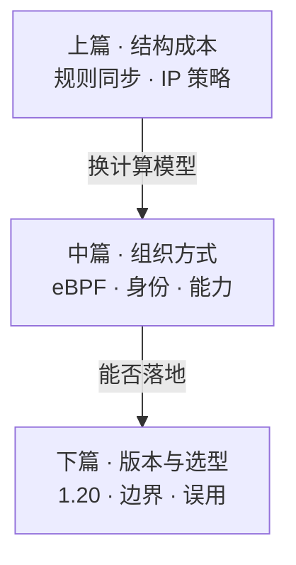
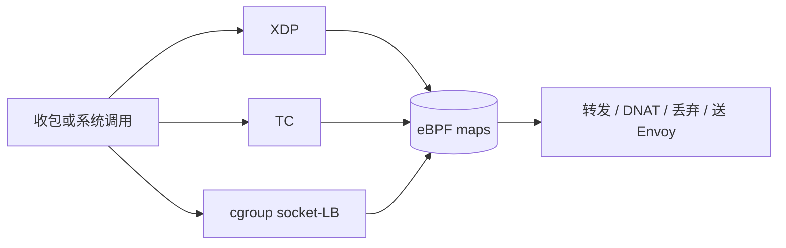

# Cilium：eBPF 数据面何以成为 Kubernetes 网络的主流路径

> Cilium 是以 **eBPF** 为数据面底座的云原生网络、安全与可观测平台：承担 CNI、可替代 kube-proxy、以工作负载身份执行三到七层策略、实现 Gateway API，并以 Hubble 提供流级可见性。它于 2021 年 10 月进入 CNCF 孵化，**2023 年 10 月 11 日毕业**；至 **1.20**，竞争重心已从「功能清单」转向超大规模集群的 Day-2 工程化。[^cncf-grad][^cilium-120]
>
> 全文按一条因果链展开：**规模下旧路径贵在何处 → eBPF 改变了什么计算模型 → Cilium 如何组织控制面与数据面 → 能力如何落到 Service、策略、入口与观测 → 1.20 与选型边界**。可与本库 [《Kubernetes 控制面原则》](./23-kubernetes-control-plane-doctrine.md)、[《Calico 三层数据面》](./24-calico-l3-dataplane-treatise.md) 对照：前者谈编排如何收敛；Calico 把「节点即路由器」落到 FIB / BGP /（默认）kube-proxy；本文谈另一条合同——在内核钩子上用 eBPF **直接编程转发与策略**。

先给一个直接答案：

> **Cilium 要降低的，是「规则链表达服务」与「以 IP 充当身份」在超大规模下的结构成本，而不是在旧路径上再叠一层加速补丁。**  
> Service 侧，kube-proxy 的 iptables 模式用链表式规则把 VIP 映射到后端，规则量随 Service 与端点增长，同步与逐包匹配都会变贵。策略侧，若执行键落成 IP 集合，则 Pod 重建即地址漂移，标签所表达的意图与内核所执行的键长期错位。eBPF 把经验证器约束的程序挂到 XDP、TC、cgroup 等钩子，用 map 承载后端与策略，使更新粒度从「重放规则集」变为「改写表项」。Cilium 进一步用标签导出的 **CiliumIdentity** 做策略键，仅在需要七层语义时把流量送入节点级 Envoy，并用 Hubble 在裁决点生成带原因的流事件。  
> 它不是唯一合法数据面——上游 kube-proxy 已有 nftables 等演进——但在「连通 + 微隔离 + 可观测 + 可选网格」希望收束到同一控制面、且多家云产品线已深度采用的路径上，它已成为事实主流之一。

**20-architecture 位置：** [24](./24-calico-l3-dataplane-treatise.md) 写经典 L3 写表合同；本文写 eBPF 路径如何改写数据面假设。内核机制对齐 Linux 文档；产品行为以 Cilium 稳定版本文档与云厂商矩阵为准。[^ebpf-verifier]

## 摘要

Kubernetes 长期用 **Service + kube-proxy** 提供稳定虚地址。iptables 模式概念清晰，却在「对象规模大、EndpointSlice 抖动频」时暴露两类结构代价：规则集随 Service/端点膨胀，同步路径与逐包遍历成本难被参数调优消解；NetworkPolicy 若实现为 IP 集合，则与 Pod 生命周期绑定，滚动发布等于策略重算。[^k8s-vip][^kep-3453] eBPF 提供内核内可编程执行环境：字节码须通过验证器，程序与用户态经 map 交换状态，从而支持增量更新。[^ebpf-verifier]

Cilium 将上述能力组织为完整 CNI 栈。每节点 `cilium-agent` 把 Kubernetes 意图编译为 eBPF 程序与 map；`cilium-operator` 承担 IPAM、云网卡对接等集群级协调；可选 **kube-proxy replacement** 在 TC 与 socket-LB 路径上完成服务负载均衡；策略以 **CiliumIdentity** 为键；七层命中才进入节点级 Envoy；Hubble 以嵌入 Agent 的 Observer 采集流事件，经 Hubble Relay 汇成集群视图。[^cilium-kpr][^cilium-policy][^hubble]

云侧采用须按产品线陈述，不宜概括为「三大云一律默认」：GKE Dataplane V2 基于 Cilium，新 Autopilot 集群默认启用；AKS Automatic 默认 Azure CNI Overlay powered by Cilium；EKS 默认仍是 Amazon VPC CNI，Cilium 多为可选增强。[^gke-dpv2][^aks-cilium] 1.20（2026-07 发布）对齐 Kubernetes 1.36、Envoy 1.37.x、Gateway API 1.6.1，标志竞争进入大规模 Day-2。[^cilium-120]

**关键词：** Cilium；eBPF；kube-proxy replacement；CiliumIdentity；IPCache；Hubble；Gateway API；ClusterMesh；Maglev

---

## 目录

- [摘要](#摘要)

**上篇 · 问题与底座**

1. [读法、术语与边界](#1-读法术语与边界)
2. [规模下的旧路径：贵在结构](#2-规模下的旧路径贵在结构)
3. [eBPF：可验证的内核可编程模型](#3-ebpf可验证的内核可编程模型)

**中篇 · 组织与能力**

4. [控制面与数据面如何分工](#4-控制面与数据面如何分工)
5. [身份模型：策略的复杂度单位](#5-身份模型策略的复杂度单位)
6. [能力版图：服务、策略、入口与观测](#6-能力版图服务策略入口与观测)

**下篇 · 版本与选型**

7. [1.20：从功能齐全到 Day-2](#7-120从功能齐全到-day-2)
8. [落地判据与常见误用](#8-落地判据与常见误用)
9. [收束](#9-收束)
10. [参考文献](#10-参考文献)

读法提示：先确认「规则链 / IP 身份」是否已构成贵的成本，再讨论是否采用 Cilium；小集群上 iptables 仍然合理默认。



---

## 1. 读法、术语与边界

### 1.1 术语

| 术语 | 含义 |
| ---- | ---- |
| **eBPF** | Linux 内核中的可编程执行环境：字节码经验证器加载，挂到钩子上运行；与用户态经 map 交换状态。 |
| **XDP / TC / cgroup** | 网络侧常用钩子：驱动收包早期、流量控制入/出向、套接字系统调用时刻。 |
| **kube-proxy replacement** | 用 eBPF 实现 ClusterIP、NodePort、LoadBalancer 等服务转发，使节点不再依赖 kube-proxy 的 iptables/IPVS 规则链。 |
| **CiliumIdentity** | 由工作负载标签集合导出的数值身份；同标签等价类共享身份，策略以身份（及端口等）为键。 |
| **IPCache** | IP/CIDR ↔ 身份（及宿主信息）的映射，供跨节点策略与转发还原身份空间。 |
| **Hubble** | 流可观测子系统：Agent 内嵌 Observer 采集事件，Hubble Relay 做多节点聚合。 |
| **ClusterMesh** | 多集群互联：不合并各集群控制面，经 clustermesh-apiserver 交换状态，以支持跨集群连通、发现与策略。 |

### 1.2 边界（本文不承诺什么）

1. **选型与模型，不是安装手册。** Helm 值、内核版本矩阵、特性门控以官方文档为准。  
2. **iptables 并未「失效」。** 小规模集群上它仍简单可靠；上游亦推进 nftables 模式。本文讨论的是**规模与抖动**下的结构成本。[^k8s-vip][^nftables-kp]  
3. **「O(1)」不可神话化。** BPF 哈希 map 查找通常为常数时间；策略路径可能涉及 LPM 或少量多次查找。相对「穿越随对象数增长的规则链」，含义是**复杂度与更新粒度换了底座**。  
4. **托管 ≠ 上游全量。** GKE Dataplane V2、AKS「Powered by Cilium」会裁剪或滞后特性，须对表云厂商矩阵。  
5. **七层有代价。** 仅命中 L7 策略或网格能力的流量才进入 Envoy；默认东西向 L3/L4 应留在 eBPF 快路径。

**所以 · 边界在哪：** 先问成本结构是否已变贵，再问产品名字是否流行。

---

## 2. 规模下的旧路径：贵在结构

Kubernetes 用 Service 提供稳定虚地址；节点侧长期由 **kube-proxy** 把 VIP 翻译为 Endpoint。iptables 模式下，每个 Service、每个端点对应若干规则，对象增多则规则集膨胀。官方文档指出：在数万级 Pod/Service 的集群中，EndpointSlice 变化时，kube-proxy 可能长时间忙于向内核同步规则。[^k8s-vip]

代价应拆成两段看，避免混为一谈：

| 阶段 | 贵在哪里 |
| ---- | -------- |
| **控制面同步** | 把 API 中的 Service/端点变化写成内核规则。旧实现常接近「大范围重写」；KEP-3453 等优化使 1.28 起尽量只更新变更相关链，但 iptables-restore 的接口形态仍使部分成本与 Service 总量相关。`minSyncPeriod` 用聚合换延迟——抖动被抹平的同时，端点生效变慢。规模测试中网络编程延迟曾以秒计，正是同步路径的症状。[^kep-3453] |
| **数据面匹配** | 报文沿规则链遍历。对象越多，最坏路径越长。IPVS 改善查找复杂度，但仍嵌在 netfilter，并依赖独立同步组件。 |

上游后来的 **nftables** 模式进一步改善增量更新与锁竞争，说明社区也承认：纯 iptables 默认路径不是规模终点。[^nftables-kp] Cilium 的回应更彻底——不再用规则链表达服务与策略，而用 eBPF 程序加 map。

策略与可观测上的结构性摩擦同样清晰：

| 现象 | 结构原因 |
| ---- | -------- |
| 策略「跟不住」滚动发布 | 执行键若是 IP，则地址生命周期与标签意图不一致。 |
| 排障依赖猜测 | 缺少带工作负载身份与裁决原因的统一事件流。 |
| 用 sidecar 换可见性 | 可得协议细节，但引入每副本延迟、内存与版本错配。 |

> **判断：** 大规模上的成本首先来自**计算模型**（规则链 + IP 键），其次才是某次参数未调优。

**所以 · 边界在哪：** 没有规模指标时，「换底座」往往是过早优化；有同步延迟、CPU 或策略抖动时，才进入 Cilium 的问题域。

---

## 3. eBPF：可验证的内核可编程模型

理解 Cilium，须先把 eBPF 从口号还原为内核机制。

**eBPF**（extended Berkeley Packet Filter）是 Linux 内核中的可编程执行环境。用户态加载字节码后，**验证器**做静态分析——控制流须可判定终止、内存访问须有界、辅助函数参数须符合契约——通过后方可挂到钩子；事件到达时在内核上下文执行。验证失败则拒绝加载。生产环境敢运行第三方逻辑，前提正在于此，而非「内核模块想装就装」。[^ebpf-verifier]

程序与用户态通过 **map**（哈希表、数组、LPM trie 等）通信：控制面写入后端集合与策略裁决，数据面读取后完成转发或放行/拒绝。端点变化时，典型路径是更新 map 项，而不是重放整段规则脚本。

Cilium 网络路径依赖的三类钩子，对应「尽可能早、尽可能浅地做完决策」：

| 钩子 | 在路径上的位置 | 典型用途 |
| ---- | -------------- | -------- |
| **XDP** | 驱动收包早期，分配完整 sk_buff 之前 | 尽早丢弃、部分负载均衡与过滤；能力受限，路径最短 |
| **TC** | 网卡入向 / 出向 | Pod 间转发、服务 DNAT、策略执行；可在较浅位置完成重定向 |
| **cgroup 套接字钩子** | `connect` / `sendmsg` 等系统调用时刻 | 在报文生成前把服务地址改写为后端（socket-LB）；同节点访问 ClusterIP 的最短路径之一 |

发行版文档亦按 XDP、tc、cgroup v2 归纳网络侧能力；`BPF_PROG_TYPE_CGROUP_SOCK_ADDR` 明确允许在 connect 等操作中改写地址，正是 socket-LB 的接口族。[^rhel-ebpf]

> **要点：** Cilium 不是在 iptables 链尾再挂加速器，而是在协议栈多个深度打开短路——能在套接字层解决的，不必走到完整路由与连接跟踪；能在 TC 解决的，不必绕经用户态代理。



**所以 · 边界在哪：** eBPF 提供的是可验证的执行位置与增量状态面；Cilium 解决的是如何把 Kubernetes 对象可靠地编译进这些位置。

---

## 4. 控制面与数据面如何分工

部署形态可概括为：**每节点一个 Agent，少量集群级 Operator，转发与 L3/L4 策略在内核执行。**

### 4.1 控制面组件

| 组件 | 职责 |
| ---- | ---- |
| **cilium-agent** | 以 DaemonSet 运行于每节点。监视 Pod、Service、EndpointSlice、NetworkPolicy 等；将意图编译为 eBPF 程序与 map；管理本机 veth（或 netkit）、路由、邻居与负载均衡表；负责健康检查与策略同步。 |
| **cilium-operator** | 集群级、多副本选主。承担 IPAM、云弹性网卡对接、部分负载均衡器 / Ingress / Gateway 协调、垃圾回收等不宜在每节点重复的工作。 |
| **CNI 插件** | 由 kubelet 在 Pod 创建与销毁时调用，完成网卡接入与端点注册；本身不是常驻数据面进程。 |

### 4.2 数据面、观测与多集群

数据面以挂载于上述钩子的 eBPF 程序为主，处理 L3/L4 转发与策略。仅当流量需要七层语义（HTTP 路径匹配、部分网格能力等）时，才被重定向到**节点级 Envoy**——这与「每 Pod 一个 sidecar」是不同的故障域与资源模型。

节点之间的连通通常有两类合同：**原生路由**（依赖底层网络能路由 Pod CIDR）与**隧道/封装**（如 VXLAN）。选型影响 MTU、云网卡集成与排障方式，但不改变「策略以身份为键」这一核心；具体模式以集群安装参数为准。[^cilium-routing]

**Hubble** 的服务器组件嵌入 cilium-agent，以低开销消费数据面事件并提供 Observer API；**Hubble Relay** 连接各节点实例，聚合为集群级（乃至 ClusterMesh 场景下的更广）流查询，供 CLI / UI 使用。[^hubble]

**ClusterMesh** 通过每集群的 `clustermesh-apiserver` 向外暴露并同步状态，使跨集群 Pod 连通、服务发现与基于身份的策略成为可能。官方明确提醒：加入网格的集群形成一个信任域，仅应连接安全姿态相当、相互信任的集群。[^clustermesh]

与 Calico 对照，合同差异可以压成一句：Calico 的默认叙事是 **FIB +（可选）BGP + kube-proxy 写 Service 规则**；Cilium 的默认叙事是 **eBPF map +（可选）完全去掉 kube-proxy**。二者都能执行 NetworkPolicy，但快路径与策略键不同。

**所以 · 边界在哪：** Agent 负责「意图→内核」；Operator 负责集群级协调；Hubble / ClusterMesh 是可观测与多集群的延伸，不是 CNI 的必选项。

---

## 5. 身份模型：策略的复杂度单位

若只记住 Cilium 的一个设计分叉，应是：**安全与寻址分离。**

在「每 Pod 一个 IP」模型下，若策略写成「允许所有 frontend IP 访问所有 backend IP」，则每当 frontend 扩缩，所有承载 backend 的节点都可能要更新规则——规模与 churn 会把策略控制面拖垮。Cilium 的做法是：根据标签集合为工作负载分配 **CiliumIdentity**；相同安全标签的 Pod 共享身份。第一个 `role=frontend` 启动时分配身份并授权其访问 `role=backend` 身份；后续同类 Pod 主要是解析已有身份，而不必在所有 backend 节点上重写 IP 列表。[^cilium-identity]

策略编译进 eBPF map 时，键是**源身份、目的身份、方向、协议、端口**一类元组，而不是「此刻的 Pod IP」。跨节点时，通过隧道元数据或 **IPCache**（IP/CIDR ↔ 身份）还原身份空间，使远端节点上的程序看到一致的身份语义。[^cilium-identity][^ipcache]

由此得到三条工程推论：

1. **滚动发布**时，只要标签集合不变，身份不变，策略 map 不必随每次 IP 分配重写。  
2. **策略表规模**更贴近「身份种类 × 端口规则」，而非「Pod 个数 × 规则」。  
3. **微隔离**讨论的是「工作负载是谁」，而不是「它暂时租了哪个地址」。

> **判断：** 身份模型改变的是策略控制面的**复杂度单位**——从 IP 换成标签等价类。这不是命名游戏，而是可扩展性的前提。

**所以 · 边界在哪：** 身份稳定依赖于标签设计稳定；标签混乱时，身份模型帮不上忙。

---

## 6. 能力版图：服务、策略、入口与观测

### 6.1 服务转发：替代 kube-proxy

启用 kube-proxy replacement 后，Agent 监视 EndpointSlice，将 Service 到后端的映射写入 eBPF 负载均衡 map；报文在 TC 或 socket-LB 钩子上完成后端选择与 DNAT，用户态代理不在热路径上。[^cilium-kpr] 端点更新的主成本是改 map，而不是重放整库 iptables 规则。

后端选择可配置随机、**Maglev** 等。Maglev 出自 Google NSDI’16：用固定大小查找表获得近似均匀分布，并在后端集合变化时限制无关连接的扰动。[^maglev] Cilium 1.20 进一步支持在 EndpointSlice 上以 `service.cilium.io/weight` 做加权；**权重为 0** 时排空新连接并保留已有连接。[^cilium-120] 同节点优先与拓扑感知提示（如 `PreferSameZone`、`PreferSameNode`）则尽量把流量留在本地故障域。

### 6.2 策略：从 L3/L4 到可选 L7

| 层次 | 要点 |
| ---- | ---- |
| **L3/L4** | 基于身份、命名空间、服务账户、CIDR、端口、节点、FQDN 等。FQDN 依赖节点侧 DNS 代理维护域名到 IP 的动态映射。 |
| **L7** | 经节点 Envoy 匹配 HTTP 方法/路径/头、gRPC 等。协议扩展能力随版本变化，升级前须阅读发行说明（1.20 对部分旧能力有迁移提示）。 |
| **策略 API** | 自有 `CiliumNetworkPolicy` / `CiliumClusterwideNetworkPolicy`；1.20 起可启用上游 **ClusterNetworkPolicy（KCNP）** 的 Admin / Baseline 分层（须显式打开并安装 CRD）。[^cilium-policy] |
| **加密** | **WireGuard** 在节点间建隧道：默认加密跨节点的 Cilium 管理 Pod 流量；同节点流量不加密；节点到节点加密为可选（beta）。**IPsec** 更贴近传统密钥与合规流程。工作负载互认（SPIFFE / ztunnel 等）以版本文档为准；1.20 对旧版 Mutual Authentication 有升级注意。[^wireguard] |
| **拒绝可见性** | 可选在策略拒绝时返回 ICMP Destination Unreachable。IPv4 egress 见于 1.19 路径，1.20 补齐 **IPv6 egress**；默认仍可能静默丢弃，且入向等方向仍有限制。[^cilium-120] |

### 6.3 南北向入口与东西向网格

南北向方面，Cilium 实现 Gateway API；1.20 对齐 **v1.6.1**，HTTP、gRPC、TCP、UDP 路由更完整，并支持 ListenerSet（平台维护共享 Gateway，应用挂载监听器）、BackendTLS、ExternalAuth、CORS 等。[^cilium-120]

东西向七层治理采用**节点级代理**：由 eBPF 将需要代理的流量透明重定向到本节点 Envoy。相对 Istio sidecar 模式，它避免「每个业务副本绑定一个代理版本」的错配，但把故障域与资源池上收到节点——这是路线分歧，不是单纯的优劣排序。

### 6.4 Hubble：裁决点上的可观测性

传统排障往往在「kube-proxy / NetworkPolicy / 路由」之间猜测。Hubble 在转发、丢弃、送入代理等裁决点生成流事件，携带源与目的身份、Service、策略原因等；七层可附带 HTTP 状态与路径，DNS 查询亦可观测。[^hubble] 相对每 Pod sidecar 采集，开销集中在内核程序与节点组件，并能看见**被策略拒绝**的连接——这正是仅靠 `tcpdump` 难以系统化的部分。指标与日志可对接 Prometheus、OpenTelemetry 等既有体系。

**所以 · 边界在哪：** 四大能力可以分阶段启用；把 L7 与网格当作默认全家桶，会先吃掉快路径红利。

---

## 7. 1.20：从功能齐全到 Day-2

在 1.20 发布周期，项目并行维护多条稳定线，**1.20 为当时主线**，对齐 Kubernetes 1.36、Envoy 1.37.x、Gateway API 1.6.1；生产环境应跟踪最新补丁号。[^cilium-120]

相较于继续堆叠功能条目，1.20 更突出工程化：

| 方向 | 发行说明中的要点 |
| ---- | ---------------- |
| **数据面扩展** | Datapath plugins，使云厂商可独立版本化扩展 eBPF 程序，减少长期私有分支。 |
| **规模效率** | 共享后端的 Service 同步、策略 map 编码等内存路径优化。 |
| **控制面效率** | Envoy ADS / Delta xDS 等模式，以增量下发降低 CPU 与策略更新延迟。 |
| **交付体积** | `cilium-cni` 二进制约从 77MB 降至 16MB 量级。 |
| **可运维性** | 配置漂移检测、Agent 启动阶段可度量等。 |
| **吞吐** | 带宽管理、BigTCP 等继续压低单流路径上的 CPU 成本。 |
| **LB 与策略** | 加权 Maglev；KCNP；IPv6 策略拒绝的 ICMP 响应等。 |

> **判断：** CNCF 毕业解决的是治理信任与生态位置；1.20 回答的是——在超大规模下，Day-2 是否仍然可控。

**所以 · 边界在哪：** 选 1.20 是为了工程属性，不是为了版本号本身；升级仍须阅读迁移说明。

---

## 8. 落地判据与常见误用

### 8.1 优先考虑的情形

1. 已观测到 kube-proxy / iptables **同步耗时或 CPU** 上升，或 Service/端点规模进入「万」量级。  
2. 需要稳定的微隔离，且工作负载**滚动频繁**，IP  churn 已成为策略运维负担。  
3. 希望连通、L4/L7 策略、可观测与 Gateway **收束到同一控制面**，并评估无 sidecar 网格。  
4. 所在云产品线已提供 Dataplane V2 或 Azure CNI Powered by Cilium 等路径，希望与上游心智对齐。

### 8.2 不必强行替换的情形

1. 集群规模小、策略简单，团队已熟 Calico 或云默认 CNI，且无规模指标支撑替换。  
2. 强依赖某云默认 CNI 的集成能力（例如 EKS 上 VPC CNI 的既有约定），又缺乏链式或替换验证资源。  
3. 内核版本无法满足目标 Cilium 版本的 eBPF 特性矩阵。

### 8.3 常见误用

1. **以为安装 Cilium 即自动移除 kube-proxy。** 须显式配置 replacement，并按文档安排迁移顺序。  
2. **把托管「基于 Cilium」当成上游全特性。** 先对表云厂商功能矩阵。  
3. **默认开启大量 L7 规则。** 每条不必要的 L7 规则都可能把流量拉出快路径。  
4. **用 Hubble 替代 APM。** 它擅长网络与策略因果，不替代分布式追踪与业务指标。  
5. **忽略拒绝响应的默认行为。** 需要快速失败时显式配置 `policy-deny-response`，并理解方向与协议限制。  
6. **忽视升级说明。** 1.20 对旧 Mutual Authentication、部分 API 与 CNI 配置等列有迁移项。

与 Calico 的选型可以写成一句可执行判断：**若组织需要经典 L3/BGP 运维心智与广泛主机路由经验，Calico 仍然有力；若要把服务转发、身份策略与可观测绑在同一 eBPF 数据面上，Cilium 更完整。** 二者是数据面合同之别，不是道德高下。

**所以 · 边界在哪：** 用指标决定是否替换；用分阶段启用保护快路径；用文档矩阵约束托管预期。

---

## 9. 收束

```text
  规模下的结构成本
  （规则链同步/匹配 · IP 充当身份）
            │
            ▼
  eBPF：验证器 + 钩子 + map
            │
            ▼
  Cilium：身份 · 服务 map · Hubble · Gateway
            │
            ▼
  1.20：Day-2 工程化；选型看指标与矩阵
```

三条主线足以携带全文：

1. **问题：** 贵的是规则链的同步与匹配，以及用 IP 代理工作负载身份所造成的 churn。  
2. **解法：** 用可验证的 eBPF 短路协议栈，用身份做策略键，用 map 做增量控制面。  
3. **边界：** 并非唯一出路；云默认不可一概而论；L7 与网格有代价；内核与版本矩阵属于变更管理的一部分。

| # | 命题 |
|:-:|------|
| 1 | iptables kube-proxy 的成本在规则集规模与同步形态；nftables 是上游演进，Cilium 是换底座。 |
| 2 | eBPF 的安全前提是验证器；网络主钩子为 XDP、TC、cgroup。 |
| 3 | Agent 编译意图，Operator 做集群协调，L3/L4 数据面在内核。 |
| 4 | CiliumIdentity + IPCache 使策略复杂度单位变为标签等价类。 |
| 5 | kube-proxy replacement 与 Maglev（含 1.20 加权）服务规模化负载均衡。 |
| 6 | Hubble（Agent 内 Observer + Relay）提供带裁决原因的流事件。 |
| 7 | 云采用须分产品线：GKE Autopilot Dataplane V2、AKS Automatic 等已默认相关路径；EKS 默认仍为 VPC CNI。 |
| 8 | 落地先看规模指标与内核/版本矩阵，再审慎打开 L7 与网格。 |

---

## 10. 参考文献

[^cncf-grad]: Cloud Native Computing Foundation, *Cloud Native Computing Foundation Announces Cilium Graduation*, 2023-10-11. https://www.cncf.io/announcements/2023/10/11/cloud-native-computing-foundation-announces-cilium-graduation/ 。Cilium 于 2021-10 进入孵化，2023-10-11 毕业。

[^cilium-120]: Cilium *v1.20.0*（约 2026-07-29）发行说明与讨论；CNCF 博客摘要（2026-09-14）. https://github.com/cilium/cilium/releases/tag/v1.20.0 ；https://www.cncf.io/blog/2026/09/14/cilium-1-20-gateway-api-externalauth-tcproute-udproute-eni-ipam-for-ipv6-and-more/ 。依赖 Kubernetes 1.36、Envoy 1.37.x、Gateway API 1.6.1；加权 Maglev、KCNP、IPv6 策略拒绝 ICMP、datapath plugins、CNI 瘦身、Envoy 增量 xDS 等。

[^ebpf-verifier]: The Linux Kernel Documentation, *eBPF verifier*. https://docs.kernel.org/bpf/verifier.html 。验证器对控制流、内存访问与辅助函数契约做静态检查。

[^rhel-ebpf]: Red Hat Enterprise Linux 9 Documentation, *Understanding the eBPF networking features*. https://docs.redhat.com/en/documentation/red_hat_enterprise_linux/9/html/configuring_and_managing_networking/assembly_understanding-the-ebpf-features-in-rhel-9_configuring-and-managing-networking 。归纳 XDP、tc、cgroup 套接字程序类型及 connect 时改写地址等能力。

[^k8s-vip]: Kubernetes Documentation, *Virtual IPs and Service Proxies*. https://kubernetes.io/docs/reference/networking/virtual-ips/ 。iptables 模式下规则随 Service/端点增长；大规模集群中同步可能耗时；并说明 `minSyncPeriod` 与 1.28 后的更小化更新策略。

[^kep-3453]: Kubernetes Enhancement Proposal, *KEP-3453: Minimize iptables-restore*. https://github.com/kubernetes/enhancements/blob/master/keps/sig-network/3453-minimize-iptables-restore/README.md 。记录大规模下 iptables 同步对网络编程延迟的影响及增量恢复优化。

[^nftables-kp]: Kubernetes Blog, *NFTables mode for kube-proxy*. https://kubernetes.io/blog/2025/02/28/nftables-kube-proxy/ 。nftables 模式改善增量更新与数据面效率；即便晋级后 iptables 仍可能保持默认以兼容。

[^cilium-kpr]: Cilium Documentation, *Kubernetes Without kube-proxy*. https://docs.cilium.io/en/stable/network/kubernetes/kubeproxy-free/ 。eBPF kube-proxy replacement、socket-LB、Maglev 等。

[^cilium-policy]: Cilium Documentation, *Network Policy*. https://docs.cilium.io/en/stable/network/kubernetes/policy/ 。策略资源模型，以及 1.20 起对 Kubernetes ClusterNetworkPolicy 的支持与启用方式。

[^cilium-identity]: Cilium Documentation, *Identity-Based Security*. https://docs.cilium.io/en/stable/security/network/identity/ 。论述为何以标签导出身份、使安全与寻址分离，并说明相对「按 IP 枚举」的可扩展性。

[^ipcache]: Cilium Documentation, *cilium-dbg bpf ipcache*；*eBPF Maps*. https://docs.cilium.io/en/stable/cmdref/cilium-dbg_bpf_ipcache/ ；https://docs.cilium.io/en/stable/network/ebpf/maps/ 。IPCache 维护 IP/CIDR ↔ 身份映射；节点作用域，默认容量约 512k 条目量级。

[^cilium-routing]: Cilium Documentation, *Routing*. https://docs.cilium.io/en/stable/network/concepts/routing/ 。原生路由与底层网络须能路由 Pod CIDR 等前提。

[^hubble]: Cilium Documentation, *Hubble internals*. https://docs.cilium.io/en/stable/internals/hubble/ 。Observer 嵌入 Agent；Hubble Relay 聚合多节点流事件。

[^clustermesh]: Cilium Documentation, *Multi-Cluster (Cluster Mesh)*. https://docs.cilium.io/en/stable/network/clustermesh/intro/ 。跨集群连通、发现与策略；参与集群形成单一信任域。

[^wireguard]: Cilium Documentation, *WireGuard Transparent Encryption*. https://docs.cilium.io/en/stable/security/network/encryption-wireguard/ 。节点间 WireGuard 隧道与 Pod 流量加密行为。

[^maglev]: Danielle E. Eisenbud et al., *Maglev: A Fast and Reliable Software Network Load Balancer*, USENIX NSDI 2016. https://www.usenix.org/conference/nsdi16/technical-sessions/presentation/eisenbud 。

[^gke-dpv2]: Google Cloud Documentation, *GKE Dataplane V2*. https://cloud.google.com/kubernetes-engine/docs/concepts/dataplane-v2 。基于 Cilium；新 Autopilot 默认启用。

[^aks-cilium]: Microsoft Learn, *Configure Azure CNI Powered by Cilium in AKS*. https://learn.microsoft.com/en-us/azure/aks/azure-cni-powered-by-cilium 。AKS Automatic 默认相关路径；Standard 上为可选配置。

**声明：** 正文是数据面选型与模型判断，不是某一云厂商或某一补丁号的配置清单。内核版本、特性门控与托管裁剪差异很大；冲突时以 Linux、Cilium、云文档与集群规模指标为准。
