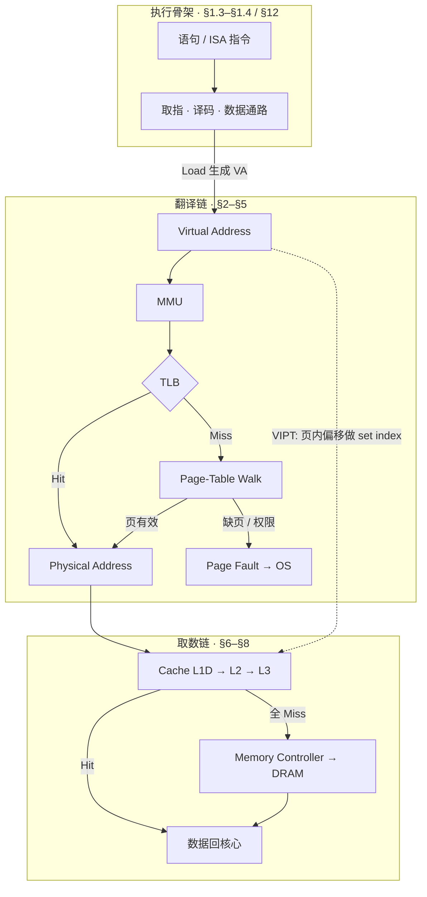
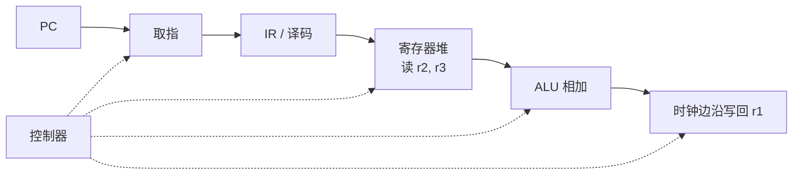
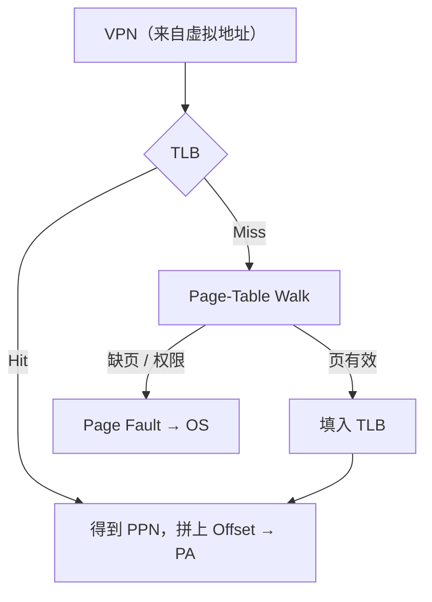
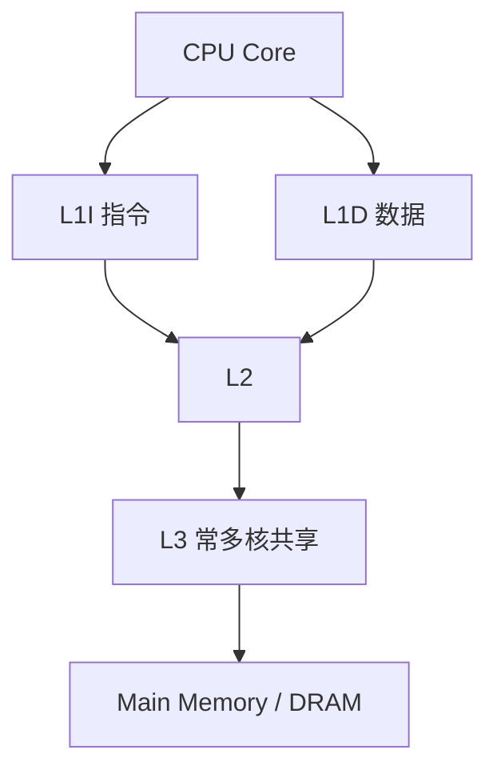
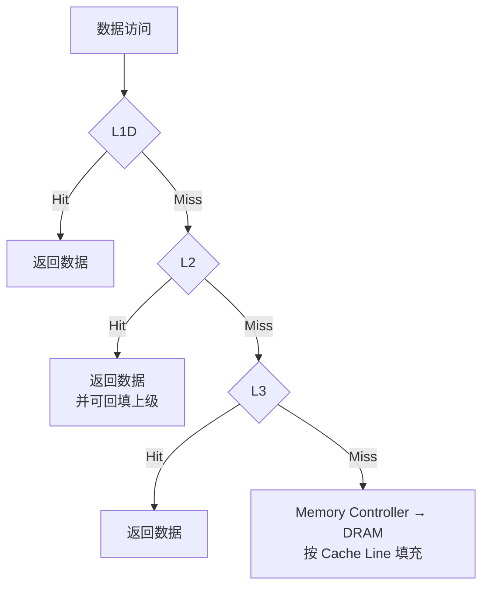
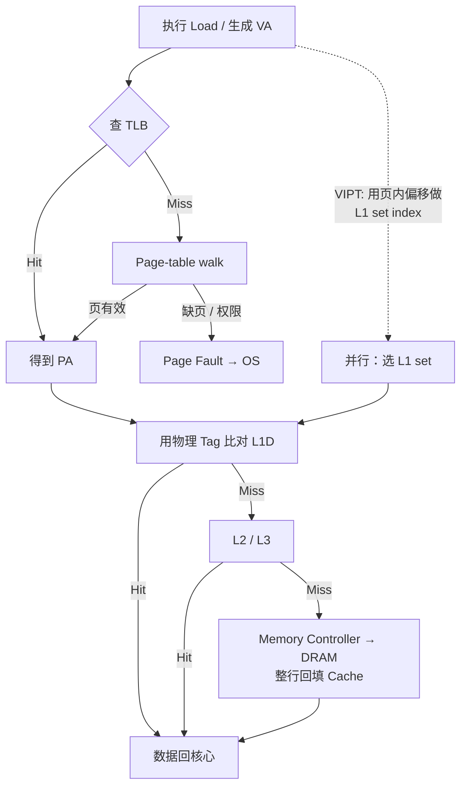

# CPU 访存：从虚地址到 Cache 与 DRAM

> `int x = array[100];` 在程序员眼里是一行赋值；在机器眼里，是编译成指令、取指译码、数据通路运算，以及地址翻译、多级 Cache 与可能的 DRAM。
>
> 组成原理的核心，是抽象计算模型如何被逐层实现为可执行机器指令的物理系统。本文把其中最常卡住的一段——**一次 Load 如何找到数据**——拆成可跟的链路：**语句 / 指令 → Virtual Address → MMU / TLB / Page Table → Physical Address → Cache（按 tag / set / offset 定位）→ Memory Controller → DRAM**。可与本库 [10](../10-chronicle/10-computing-cloud-chronicle.md)（计算如何池化）、[40](../40-paradigm/40-unix-agent-stateless-philosophy.md)（工具边界与可观察）、[22](./22-distributed-consistency-treatise.md)（跨节点之后的另一套「找数据」）对照：本文写单机上一次访存的硬件路径，不是分布式副本协议。

先给一个直接答案：

> **CPU 不是拿着程序里的地址去 RAM 里「搜索标签」。** 高级语言先变成机器指令；指令在处理器里经取指、译码与数据通路完成运算。访存时，程序给出的多半是**虚拟地址（VA）**；**MMU** 借助 **TLB**（及必要时遍历 **Page Table**）把它译成**物理地址（PA）**；随后在 **Cache** 里用地址切成的 **offset / set index / tag** 定位一行；全未命中才经 **Memory Controller** 访问 **DRAM**，并通常整行填入 Cache。三者各答一问：**TLB**——这一页映到哪；**Cache**——附近是否已有这份数据；**DRAM 子系统**——物理介质上如何选通。访问模式友好时极快，TLB Miss 与 Cache Miss 叠加时极贵——慢的往往不是算术，而是这条链路。

**20-architecture 位置：** [20](./20-enterprise-architecture-treatise.md)–[25](./25-architecture-thinking-cto-treatise.md) 多写企业与平台架构。本文写**机器内部的访存与执行骨架**：一条语句如何落到指令与数据通路，一次 Load 又经过哪些硬件与 OS 交界。术语与关系总图见第 1 节。

## 摘要

学习组成原理，宜先问「一条程序语句经过哪些硬件机制，才变成电路上的计算」。因果上有两层：**执行骨架**（语句 → 机器指令 → 取指 / 译码 / 数据通路）决定「算什么」；**访存链路**决定「操作数从哪来」。一次典型 Load 走访存链路：生成 VA → MMU 译页号（页内偏移不变）→ 优先查 TLB，Miss 则多级页表遍历（x86-64 常见四级，可选 LA57 五级），必要时 Page Fault 由 OS 处理 → 再查 Cache（常见 64B Cache Line；地址拆成 offset / set index / tag）→ L1 常按页内偏移做虚拟索引并与 TLB 重叠，标签仍用物理地址比对 → L1D / L2 / L3 逐级 Miss 后才到 Memory Controller 与 DRAM，并回填 Cache Line。流水线让多条指令分处不同阶段，其中 **MEM** 阶段正是这条访存链的入口；相关靠转发、暂停与分支预测处理。Cache Miss 与 TLB Miss 是两类不同代价。

**关键词：** 虚拟地址；MMU；TLB；页表；Page Fault；Cache Line；set / tag / offset；L1D；DRAM；局部性；Working Set；数据通路；流水线

---

## 目录

- [摘要](#摘要)
1. [读法与术语](#1-读法与术语)
    - [1.1 术语与从属关系](#11-术语与从属关系)
    - [1.2 边界](#12-边界)
    - [1.3 从「程序如何执行」建立最小机器](#13-从程序如何执行建立最小机器)
    - [1.4 指令：连接软件与硬件](#14-指令连接软件与硬件)
2. [程序给出的通常是虚拟地址](#2-程序给出的通常是虚拟地址)
3. [MMU：虚拟页到物理页](#3-mmu虚拟页到物理页)
4. [TLB：避免每次都走页表](#4-tlb避免每次都走页表)
5. [TLB Miss 与页表遍历](#5-tlb-miss-与页表遍历)
6. [查 Cache：标签要比对物理页](#6-查-cache标签要比对物理页)
    - [6.1 地址如何定位到 Cache](#61-地址如何定位到-cache)
7. [Cache Line、Hit 与 Miss](#7-cache-linehit-与-miss)
8. [Cache 全 Miss：Memory Controller 与 DRAM](#8-cache-全-missmemory-controller-与-dram)
9. [串起来：一次 Load 的简化路径](#9-串起来一次-load-的简化路径)
10. [地址是选通，不是检索](#10-地址是选通不是检索)
11. [为何有时访存极贵](#11-为何有时访存极贵)
12. [流水线：多条指令同时在路上](#12-流水线多条指令同时在路上)
13. [收束：三条问题](#13-收束三条问题)
14. [本章要点](#14-本章要点)
15. [参考文献](#15-参考文献)

---

## 1. 读法与术语

组成原理研究的，是抽象计算模型如何被逐层实现为可执行机器指令的物理系统。全文只钉一条因果链：

> **语句 → 机器指令 → 取指 / 译码 / 数据通路 → 多级存储提供指令与数据。**

其中「多级存储提供数据」又可拆成两段，后文按此顺序展开：

| 段 | 章节 | 回答的问题 | 核心部件 |
| -- | ---- | ---------- | -------- |
| **翻译** | §2–§5 | 这个 VA 对应哪一块物理页？ | MMU、Page Table、TLB |
| **取数** | §6–§8 | 附近是否已有数据？没有则如何选通 DRAM？ | Cache、Memory Controller、DRAM |
| **合图** | §9–§11 | 一次 Load 如何串起来？为何有时极贵？ | 全链路 |
| **叠指令** | §12 | 流水线的 MEM 阶段如何接上访存链？ | IF–ID–EX–MEM–WB |

一次典型数据 Load 的四问如下；后文流程图是教学简图，真实微架构会重叠、推测与乱序。

| 环节 | 回答的问题 |
| ---- | ---------- |
| Virtual Address | 这个进程眼里的地址是什么？ |
| MMU + Page Table / TLB | 对应哪一块物理页？ |
| CPU Cache（L1 / L2 / L3） | 附近是否已有这份数据？如何用地址定位到行？ |
| Memory Controller + DRAM | 物理介质上如何选中并读出？ |

关系总图（实线为因果顺序；虚线表示 L1 **VIPT** 下索引可与 TLB 并行）：



读图时只须记住两句：

1. **Page Table 是翻译的权威来源；TLB 是它的缓存；MMU 是做翻译的硬件。**  
2. **TLB 缓存的是「页怎么映」；Cache 缓存的是「字节附近的数据」——两套缓存，职责不同，常可并行启动。**

### 1.1 术语与从属关系

| 术语 | 一句话 | 从属 / 关系 |
| ---- | ------ | ----------- |
| **Virtual Address（VA）** | 进程地址空间中的地址；程序与多数用户态指针所见通常是它。 | 翻译链的输入（§2） |
| **Physical Address（PA）** | 经翻译后、面向物理内存与部分外设映射的地址。 | 翻译链的输出；取数链的输入（§3→§6） |
| **Page / 页** | 地址翻译的粒度；常见 4 KiB，亦有大页（如 2 MiB / 1 GiB 等，视架构与 OS）。 | MMU 按页翻译，不按字节 |
| **Page Offset** | 页内偏移；翻译时通常不变，拼在物理页号之后。 | VA 与 PA 共用；亦供 L1 VIPT 取 index / offset |
| **MMU** | Memory Management Unit：负责（或参与）虚实地址翻译的硬件。 | 使用 Page Table；常先查 TLB |
| **Page Table** | OS 维护的映射结构：虚拟页 → 物理页（及权限等位）；本身也在内存中。 | 翻译的权威表；TLB Miss 时被遍历 |
| **TLB** | Translation Lookaside Buffer：缓存近期虚→实翻译。 | **Page Table 的缓存**，不是数据 Cache |
| **Page-Table Walk** | TLB Miss 后硬件（或软硬协同）遍历多级页表以取得翻译。 | 发生在翻译链内；walk 本身可能再触发 Cache / DRAM 访问 |
| **Page Fault** | 页表项表明页不在内存、或权限不符等时触发的异常。 | 走出硬件路径，交 OS 处理 |
| **Cache Line** | Cache 与内存之间常见的传输 / 存储粒度；许多平台上为 **64 bytes**。 | 取数链的填充粒度（§7） |
| **Offset / Index / Tag** | 用地址定位 Cache 行时的三段：块内字节、所选组、组内比对标签。 | 取数链的定位方式（§6.1） |
| **L1I / L1D** | 一级指令 Cache / 数据 Cache；Load 数据走 L1D。 | 取数链最近的一级 |
| **Spatial / Temporal Locality** | 空间局部性（附近地址）、时间局部性（不久会再访问）。 | Cache / TLB 设计所利用的统计规律 |
| **Working Set** | 一段时间窗口内实际触达的页 / 数据集合。 | 过大则 TLB 与 Cache 同时承压（§11） |
| **PC / IR** | 程序计数器给出下一条指令地址；指令寄存器保存当前指令。 | 执行骨架（§1.3） |
| **Datapath / Control** | 数据通路搬运与运算；控制器产生读写与运算的时序控制信号。 | 执行骨架；Load 在此生成有效地址 |
| **ISA** | Instruction Set Architecture：处理器向软件承诺的指令与寻址接口。 | 软件与硬件的契约（§1.4） |
| **Pipeline hazard** | 流水线中的结构 / 数据 / 控制相关。 | §12；Load-Use 停顿接在 MEM 上的访存延迟 |

### 1.2 边界

1. **本文写通用 CPU + 分页 + 多级 Cache 的教学路径。** 嵌入式无 MMU、GPU、IOMMU、CXL 等另论。  
2. **级数、页大小、Cache 组织因架构而异。** x86-64 四级 / 五级、ARM 等表述以厂商手册为准；正文取通行概念。  
3. **简化流不是时序图。** 乱序执行、预取、推测执行、多级 TLB、store buffer 等会改变「看起来的顺序」。  
4. **性能数字不冻结。** 延迟随微架构与频率变化；正文讲结构，不背某一代 CPU 的纳秒表。  
5. **§1.3–§1.4 与 §12 是读法骨架，不是完整组成教材。** 门级实现、微码、异常精确细节见 Patterson / Hennessy 等教材。[^cod]

### 1.3 从「程序如何执行」建立最小机器

最有效的入口通常不是先背逻辑门清单，而是先建立一个**最小计算机模型**。假设要执行一条寄存器加法（教学写法 `add rd, rs1, rs2`，含义 `rd ← rs1 + rs2`），至少要完成：取指、译码、读操作数、运算、写回。问题就从「CPU 有哪些部件」变成「这些动作分别由什么硬件完成」。[^cod]

| 部件 | 在这条加法里做什么 |
| ---- | ------------------ |
| **PC（程序计数器）** | 给出下一条指令的地址（经 I-Cache / 指令存储取指） |
| **IR（指令寄存器）** | 保存当前取到的指令字 |
| **寄存器堆** | 提供高速操作数 `rs1` / `rs2`，并接收写回的 `rd` |
| **ALU** | 执行加法（或其它算术 / 逻辑运算） |
| **控制器** | 决定各部件何时读、何时写、ALU 做哪一种运算 |
| **存储系统** | 提供指令；若操作数在内存，还要提供数据（后文主线） |

组成原理的基本对象因此不是一张部件清单，而是：**数据在部件之间如何流动，以及控制信号如何决定这种流动。**

进一步可以把任何机器指令画成「执行过程图」。例如 `add r1, r2, r3`（`r1 ← r2 + r3`）：



追问「谁选择 ALU 的输入」「谁产生加法控制信号」「结果在哪个边沿写入」，就会自然进入数据通路、多路选择器、时序逻辑——概念被放进真实执行过程，比单独背「ALU 是算术逻辑单元」更稳。

寄存器是能保存状态的时序电路；ALU 多为组合逻辑（加法器、逻辑单元与选择电路）；多路选择器决定哪一路进入下一阶段。组合逻辑的输出主要由当前输入决定；时序逻辑有状态，须在时钟控制下更新。**计算与保存要分开：** ALU 可以立刻算出结果，若没有寄存器在边沿锁存，下一阶段就无法可靠使用它。CPU 因而可理解为一个受时钟驱动的状态转换系统。[^cod]

若加法的操作数不在寄存器而在内存，数据通路会在「读操作数」处插入一次 Load——也就是后文 §2–§9 的整条访存链。**执行骨架决定何时要访存；翻译链与取数链决定访存如何完成。**

### 1.4 指令：连接软件与硬件

**指令集体系结构（ISA）** 是处理器向软件提供的计算接口：规定能做哪些基本操作、操作数在哪、数据如何表示、内存如何访问。高级语言里的 `a = b + c` 不会直接变成电路动作，而是经编译器变成若干机器指令——加载、加法、存储等。学习组成时，宜同时看高级语言、汇编与机器指令三层。[^cod]

值得反复做的练习：写一小段 C，对照其汇编，再追一条汇编在 CPU 内经过哪些阶段。循环为何需要比较与条件转移？函数调用为何要保存返回地址与部分寄存器？数组访问为何常表现为「基址 + 偏移」？这些问题会把抽象程序收成地址计算、寄存器操作、条件判断与内存访问——后文的 VA、TLB 与 Cache，正是这条链在存储侧的展开。

**所以 · 边界在哪：** 先会跟一条指令的数据流，再进虚实翻译；存储与 CPU 同等关键，§2 起专解「地址如何变成数据」。

---

## 2. 程序给出的通常是虚拟地址

从本节到 §5，只谈**翻译链**：把程序员手里的地址变成硬件能用来选通物理介质的地址。

程序使用的地址通常是 **Virtual Address（VA）**，而不是物理 RAM 地址。执行 `int value = array[100];` 时，编译器生成含地址计算的机器指令；CPU 最终可能访问类似：

```text
VA 示例：0x7F1234567890
```

该地址属于当前进程的 **Virtual Address Space**。每进程通常自有一套虚拟空间：隔离进程，并允许 OS 独立地把虚拟页映到物理页。[^va]

CPU 首先要回答：**这个 VA 对应哪一块物理内存？** ——这就是 **Address Translation**，由下一节的 MMU 完成。

**所以 · 边界在哪：** 程序员手里的指针，默认不是 DRAM 上的门牌号。

---

## 3. MMU：虚拟页到物理页

**MMU（Memory Management Unit）** 是做翻译的硬件；它读的权威映射是 OS 维护的 **Page Table**（本身也在内存里）。二者关系：OS 写表，MMU 查表（通常先经 TLB，见 §4）。

一个虚拟地址（以常见 **4 KiB** 页为例）分成：高位的虚拟页号（VPN）与低 **12** 位的页内偏移（Page Offset）。

```text
Virtual Address（概念模型，页大小 = 4 KiB）
┌─────────────────────────────────┬────────────────────┐
│     Virtual Page Number (VPN)   │  Page Offset (12b) │
│         （页号，参与翻译）        │   页内字节，不翻译  │
└─────────────────────────────────┴────────────────────┘
```

内存按固定大小的 **Page** 划分。**4 KiB** 是一种常见页大小；现代处理器与 OS 也支持更大的页，以减少页表项数量、提高 TLB 覆盖率（代价是内部碎片与管理复杂度）。[^page-size]

翻译只改页号，**Page Offset 原样拼回**：

```text
 Virtual Address                      Physical Address
┌──────────┬──────────┐              ┌──────────┬──────────┐
│   VPN    │  Offset  │              │   PPN    │  Offset  │
└────┬─────┴──────────┘              └────▲─────┴──────────┘
     │                                    │
     │         Page Table / TLB           │
     └──────── VPN ──────► PPN ───────────┘
               Offset 不变，直接下传

  PA = 拼接(PPN, Offset)
```

因此，硬件转换的是虚拟页号（VPN → PPN），偏移不变，再拼出物理地址。[^mmu]

**所以 · 边界在哪：** 翻译的粒度是页，不是「每个字节一张地图」。

---

## 4. TLB：避免每次都走页表

上一节的问题立刻暴露：**Page Table 本身也在内存中**。若每次翻译都直读 RAM，一次数据访问可能先要多次访存，才能知道数据到底在哪。

现代 CPU 用 **Translation Lookaside Buffer（TLB）** 解决这个问题。TLB 是**翻译缓存**：保存最近用过的虚→实页映射。它与后文的数据 Cache 同属「缓存」家族，但缓存的对象不同——一个是页翻译，一个是数据本身。



- 翻译已在 TLB 中 → **TLB Hit**：可避免当场遍历页表。  
- 翻译不在 TLB 中 → **TLB Miss**：需要 **Page-Table Walk**（及可能的缺页处理）。

现代处理器还可缓存页表项或 walk 的中间结果，进一步加速。若页表项表明该页当前不在物理内存中（或权限不允许），处理器会触发 **Page Fault**；操作系统处理异常——可能从存储调入该页、更新映射，然后让指令重试；也可能向进程投递信号或终止进程。[^tlb]

**所以 · 边界在哪：** TLB 缓存的是「页怎么映」，Cache 缓存的是「字节附近的数据」；没有 TLB，分页在性能上几乎不可用。

---

## 5. TLB Miss 与页表遍历

TLB Miss 之后，MMU（或软硬协同）必须**真正去读 Page Table**。现代系统通常使用**多级页表**，以免一张扁平表过大。

以 **x86-64 四级分页、4 KiB 页** 为例：规范可用线性地址约 **48 bit**（高位须为规范符号扩展）；MMU 用各 9 bit 索引四级表，最低 **12 bit** 为页内偏移：[^la57]

```text
 63          48 47      39 38      30 29      21 20      12 11           0
┌──────────────┬──────────┬──────────┬──────────┬──────────┬─────────────┐
│  canonical   │  PML4    │  PDPT    │   PD     │   PT     │   Offset    │
│  sign-ext    │  idx 9b  │  idx 9b  │  idx 9b  │  idx 9b  │    12 bit   │
└──────────────┴────┬─────┴────┬─────┴────┬─────┴────┬─────┴─────────────┘
                    │          │          │          │            │
                    ▼          ▼          ▼          ▼            │
                 PML4 ──►   PDPT ──►    PD ──►     PT            │
              （CR3 指向）                                      不翻译 │
                                                                 │
                                                    PTE 给出 PPN ─┘
                                                    PA = 拼接(PPN, Offset)
```

走法：`CR3` 指向 PML4；用 `VA[47:39]`、`VA[38:30]`、`VA[29:21]`、`VA[20:12]` 依次索引，最后用 `VA[11:0]` 作为页内偏移。支持 **LA57** 时再加一层 PML5，线性地址扩到约 **57 bit**；须由系统软件置位，不是所有机器默认开启。[^la57]

这些页表结构本身也在内存中，故一次 TLB Miss 可能在 walk 期间触发**多次**访存（中间层命中页表缓存时可减少次数）——walk 时的访存，同样可能经过后文的 Cache。OS 还可用大页、透明大页等扩大单次翻译的覆盖（权衡碎片与延迟）。[^drepper]

至此，翻译链结束：得到可用的 PA（或进入 Page Fault）。下一节进入**取数链**——用这个地址（或 VIPT 下可先用的页内偏移）去问 Cache。

**所以 · 边界在哪：** Miss 的代价不是「多查一次表」四个字，而是可能拖出一串依赖访存。

---

## 6. 查 Cache：标签要比对物理页

从本节到 §8，谈**取数链**：翻译已经（或即将）给出物理页语义之后，数据从哪一级存储器回来。

得到可用的物理页语义之后，下一步通常**不是**直奔 DRAM，而是先问片上 **Cache Hierarchy**。DRAM 的延迟与带宽远逊于 Cache；把热数据留在离核心更近的地方，是性能的基本盘。教学上可先画成「先翻译、再查 Cache」；实现上，L1 的索引往往与 TLB **重叠进行**（见下）。

一个简化的层次可以表示为（Load 数据走 **L1D**；取指走 **L1I**）：



L1 通常最小最快；更低层级更大、更慢。末级 Cache 是否包含下级副本（inclusive / non-inclusive）因微架构而异，不影响「先近后远」的读法。[^cache-hier]

实现上，L1 常见 **VIPT**（Virtually Indexed, Physically Tagged：虚拟索引、物理标签）：用虚拟地址里**未经翻译的页内偏移**做组索引，因此可以和 TLB 并行；标签比对仍要物理页号。索引若用到页号，同一物理页的不同虚拟别名会进不同组，所以 L1 的路数与容量受页大小约束。更下级 Cache 更常接近「先有物理地址再查」（PIPT）。[^cache-hier]

**所以 · 边界在哪：** 下一步通常不是 DRAM，而是问 Cache；L1 不必等完整物理地址才开始索引，但命中与否仍由物理标签裁定。

### 6.1 地址如何定位到 Cache

上一小节回答「先问哪一级」；本小节回答「在这一级里，地址如何落到某一行」。不要先背相联度表，先答三问：要访问什么地址？这个地址如何选中一组并比对标签？未命中时硬件下一步做什么？

教学上，一次 Cache 查找把地址切成三段（PIPT 用完整 PA；VIPT 的 **Set Index** 与 **Offset** 可取自 VA 的页内偏移，**Tag** 仍用物理页相关位，见 §6）。下例刻意取 **32 KiB · 8-way · 64 B/line**：组索引 6 bit + 行内偏移 6 bit = 12 bit，恰好落在 4 KiB 页的页内偏移内，因而可与 TLB 并行做 VIPT：[^cache-map]

```text
例：32 KiB 数据阵列 · 8-way · 64 B/line · 假设 48-bit PA
     ←──────── tag 36b ────────→← index 6b →← off 6b →
┌──────────────────────────────┬────────────┬──────────┐
│            Tag               │ Set Index  │  Offset  │
└───────────────┬──────────────┴─────┬──────┴────┬─────┘
                │                    │           │
                │              选中某一个 set      │
                │                    ▼           │
                │            ┌── set 的 N 路 ──┐  │
                │            │ way0: V|Tag|Data│  │
                └─ 比对 Tag ─►│ way1: V|Tag|Data│  │
                  + Valid    │ ...             │  │
                             └────────┬────────┘  │
                                      │ hit       │
                                      ▼           ▼
                                   该行 Data ──► 按 Offset 取字节
```

| 字段 | 作用 |
| ---- | ---- |
| **Block Offset** | 行内字节位置。行宽 64B 时占 **6 bit**（\(2^6 = 64\)）。 |
| **Set Index** | 选中哪一个 **set**。组数 \(S\) 时占 \(\log_2 S\) bit。 |
| **Tag** | 与该 set 内各 way 的标签比对；通常还须 **valid** 为真，才算命中。 |

**组相联（set-associative）** 是常见折中：一个 set 里有 \(N\) 路（way），索引只选 set，再在 \(N\) 个标签里并行比较。直接映射相当于 1-way；全相联相当于只有 1 个 set、标签比对所有行。数据阵列容量可记：

\[
\text{数据容量} = N_{\text{sets}} \times N_{\text{ways}} \times \text{行字节数}
\]

（另有 tag、valid、一致性状态等位开销，上式不计。）上例：32 KiB、8-way、64B 行 → 行数 \(32768 / 64 = 512\)，set 数 \(512 / 8 = 64\) → index **6 bit**、offset **6 bit**；其余为 tag。若改成同容量 4-way，则 set 数翻倍、index 需 **7 bit**，会吃进页号位——纯 VIPT 下可能别名冲突，须靠更高相联、页着色或改用 PIPT。[^cache-map]

未命中时：按替换策略（如 LRU 近似、随机等）选出牺牲行，从下一级 Cache 或 DRAM **整行填充**，再按 offset 取出请求字节。写策略（write-through / write-back）与写分配另论；正文只钉「定位 + 填充行」。

**所以 · 边界在哪：** 定位 = offset 选字节 + index 选组 + tag（及 valid）比对；Miss 则整行回填，不是只取一个变量宽度的字。

---

## 7. Cache Line、Hit 与 Miss

§6.1 说明了「如何用地址定位一行」；本节说明这一行**有多大**，以及命中 / 未命中时请求如何在层级间下沉。

CPU Cache 通常不会按「每个字节一个独立格子」来组织。它们使用固定大小的数据块，称为 **Cache Line**。许多现代平台上常见 **64 bytes** 一行，具体组织（相联度、组数、写策略）取决于微架构。[^cache-line]

假设 CPU 需要访问地址 `0x1008`。Cache 按**对齐的 Cache Line** 装入，不是从 `0x1008` 起再读 64 字节：

```text
请求字节 0x1008
        │
        ▼
0x1000              0x1008                         0x103F
  ├───────────────────┼──────────────────────────────┤
  │◄──────────── 对齐的 64-byte Cache Line ──────────►│
  └──────────────────────────────────────────────────┘
  行起点 = 地址 − (地址 mod 64)
```

需要的数据落在这一行里。这种设计利用了 **Spatial Locality**：若程序访问了一个位置，接下来往往也会访问附近位置。

```c
for (int i = 0; i < 1000; i++) {
    sum += array[i];
}
```

连续元素在内存中相邻时，一次行填充可以服务多次迭代——这正是顺序扫描常比随机跳跃更快的结构原因之一。

CPU 在对应 Cache 层级中寻找所需 Cache Line：



- **Cache Hit**：在该级找到，延迟相对低。  
- **Cache Miss**：请求下沉到下一级；各级皆 Miss 则走向主存（§8）。

不同 CPU 的 Cache 组织不同，真实硬件还可重叠 Cache 访问与其他内存操作。基本原则不变：**让经常访问的数据尽可能靠近核心。**

**所以 · 边界在哪：** Cache 按「行」与局部性组织；一次未命中常常拉回一整行邻居。

---

## 8. Cache 全 Miss：Memory Controller 与 DRAM

取数链的最后一站：各级 Cache 皆 Miss 后，请求走向 **Main Memory**（通常是 DRAM）。内存子系统与 **Memory Controller** 通信，由控制器按物理地址选通位置：


回填时仍按更大粒度：把数据放入一条 Cache Line，使邻域后续访问有机会命中。一次 DRAM 访问往往是在**填充一行**，而不只是吐回最初那一个字节。[^dram]

在 DRAM 界面上，PA 还会被解码为 Channel、Rank、Bank、Row、Column 等（随 DIMM 与控制器而变）——地址是**选通输入**，不是仓库里的货名标签。下一节把翻译链与取数链收成一张 Load 全图。

**所以 · 边界在哪：** 主存是层级的最后一站，不是程序员默认的第一站。

---

## 9. 串起来：一次 Load 的简化路径

前面分述了翻译（§2–§5）与取数（§6–§8）。执行 `x = array[100];` 时，教学用路径可收成一张图（实线为因果顺序；虚线表示 L1 **VIPT** 下索引可与 TLB 并行）：



真实处理器会重叠、推测、乱序、预取，并并发多个请求。本图只保**基本原理**。§10–§11 钉心智与代价；§12 说明流水线如何把这条链嵌进 MEM 阶段。

**所以 · 边界在哪：** 能跟上这张简图，就够读大多数「为啥这么慢」的讨论。

---

## 10. 地址是选通，不是检索

把 §2–§9 收成一句反常识的话：常见误读是「CPU 喊一个地址，RAM 全文检索后喊找到了」。地址不是检索标签，而是硬件 **Addressing Mechanism** 的输入——经 TLB / 页表得到 PA，再经 Cache 的 index / tag 查找或控制器选通 DRAM。[^drepper]

**所以 · 边界在哪：** 找数据 = 翻译 + 查找 + 选通，不是按名字搜库。

---

## 11. 为何有时访存极贵

算术量相近的两段代码，墙钟时间可以差出一个数量级以上：一个反复命中 L1；另一个局部性差，**Cache Miss** 与 **TLB Miss** 叠加。二者落在不同链上，不可混为一谈：

| 概念 | 落在哪条链 | 含义 |
| ---- | ---------- | ---- |
| **TLB Miss** | 翻译链 | 要的虚→实翻译不在 TLB 中（可能触发 walk / Page Fault） |
| **Cache Miss** | 取数链 | 要的数据不在相关 Cache 中（可能下沉到 DRAM） |

相关旋钮包括：Cache / TLB 局部性、Cache Line、顺序访问、数据布局、Working Set、页大小（含大页）。[^drepper] 工程上常见的拖慢：大图指针追逐、按列扫行主序矩阵、**伪共享**（false sharing：不同核改同一 Cache Line 里无关字段，引发行来回作废）、工作集远超末级 Cache 与 TLB 覆盖——根子多在这条链，而不在多写了一句 `if`。

**所以 · 边界在哪：** 优化算术前，先问数据离核心有多远、翻译是否总在 TLB 里。

---

## 12. 流水线：多条指令同时在路上

§1.3 跟的是**单条**指令的数据流；§9 跟的是**一次 Load** 的访存链。流水线回答第三问：多条指令如何叠在一起，而访存链落在哪一阶段。

经典教学模型把 RISC 执行拆成五级：

```text
  指令 i     IF → ID → EX → MEM → WB
  指令 i+1       IF → ID → EX → MEM → WB
  指令 i+2           IF → ID → EX → MEM → WB
                 ─── 同一拍可有多条指令分处不同阶段 ───
```

即 **IF（取指）→ ID（译码 / 读寄存器）→ EX（运算或有效地址）→ MEM（访存）→ WB（写回）**。核心思想是让不同指令同时处于不同阶段，提高单位时间完成的指令数（吞吐），而不是把单条指令的墙钟延迟神奇地缩成 1/5。[^pipeline]

对本文而言：Load 的 VA 常在 **EX** 算出，**MEM** 阶段走 §9 的翻译 + 取数链；取指则走 L1I。访存一旦 Miss，MEM 阶段拉长，后面的指令就可能停顿——这就是访存代价进入流水线墙钟的入口。

此时问题从「指令怎么执行」转向「多条指令叠在一起时会发生什么」——三类相关（hazard）：[^pipeline]

| 相关 | 含义 | 常见对策 |
| ---- | ---- | -------- |
| **结构相关** | 争用同一硬件（如单口存储器同时取指与访存） | 分离 I/D Cache、增加端口、暂停 |
| **数据相关** | 后指令需要前指令尚未写回的结果 | **转发（forwarding）** 多可消掉 ALU→ALU 相关；**Load-Use** 在经典五级里数据要到 MEM 末才就绪，紧跟的使用仍常须 **暂停一拍**，再转发 |
| **控制相关** | 分支结果未定，下一条 PC 不明 | 尽早判断、分支预测、预测错误则冲刷 |

Load-Use 在时间轴上可收成：

```text
  Load:    IF  ID  EX  MEM  WB
  Use:         IF  ID  Stall EX  MEM  WB
                   ↑        ↑
                   需要 Load 结果，但 MEM 尚未结束 → 插一拍气泡后再转发
```

乱序执行、寄存器重命名与多发射，仍沿着同一逻辑：提高指令级并行，同时保持 ISA 要求的程序语义。它们不取消本文的访存链——Load 依然要过 TLB 与 Cache；只是多条访存可以重叠、重排。[^pipeline]

**所以 · 边界在哪：** 流水线提高的是吞吐；相关与访存停顿决定你能否吃到峰值。

---

## 13. 收束：三条问题

若只留一个心智模型，记住开篇那句：**不是拿着程序地址直接搜 RAM。** 语句先变成指令与数据通路上的动作；访存时再用三个问题跟一次 Load：

| 部件 | 落在哪条链 | 问什么 |
| ---- | ---------- | ------ |
| **TLB** | 翻译 | 这个虚拟页映到哪？ |
| **Cache** | 取数 | 附近是否已有这份数据？地址的 offset / index / tag 如何定位？ |
| **Memory Subsystem** | 取数末站 | 物理位置如何选通？ |

`x = array[100];` 背后，可能叠着编译与取指、地址生成、翻译、TLB、页表 walk、按行组织的多级 Cache，以及 DRAM。访问模式友好时极快，不友好时极慢——慢的往往是这条链路。

---

## 14. 本章要点

1. **组成是因果链：** 语句 → 指令 → 数据通路与控制 → 存储层次提供指令 / 数据。  
2. **两条存储子链：** 翻译（MMU / Page Table / TLB）回答「页映到哪」；取数（Cache → DRAM）回答「数据在不在近处」。  
3. **从属关系：** Page Table 是权威映射；TLB 是其缓存；MMU 是翻译硬件；Cache 是数据缓存——与 TLB 职责不同。  
4. **最小机器：** PC / IR / 寄存器堆 / ALU / 控制器；对象是数据流与控制信号，不是部件名词表。  
5. **程序地址多为 VA**；每进程一空间；MMU 译页号、保偏移（常 4 KiB，可有大页）。  
6. **TLB Hit 免走页表**；Miss 可能多次访存 + 缺页；x86-64 常见四级，LA57 可启五级。  
7. **先问 Cache，再谈 DRAM**；定位靠 offset / set index / tag；L1 常用 VIPT；Load 走 L1D；传输粒度常为 64B Cache Line。  
8. **Hit / Miss 逐级下沉**；全 Miss 经 Memory Controller 到 DRAM，并回填行。  
9. **地址不是搜索标签**；是翻译、查找与选通的输入。  
10. **Cache Miss ≠ TLB Miss**；局部性、布局与 Working Set 决定墙钟时间。  
11. **流水线**提高吞吐；Load 的访存链落在 MEM；相关靠转发、暂停与预测处理。

---

## 15. 参考文献

[^va]: 虚拟内存与进程地址空间为现代通用 OS（如 Linux、Windows、macOS）的通行模型。教学表述见 OpenStax 等计算机系统教材中 Virtual Memory 章节；细节以具体 OS 与架构手册为准。

[^page-size]: 4 KiB 页在 x86 与许多 Unix 系统上长期为默认；大页（huge pages）用于降低 TLB 压力。具体可用页大小见处理器与内核文档。

[^mmu]: MMU / 分页翻译的通用模型：VPN → PPN，offset 不变。实现含硬件 walk、软件辅助 walk 等变体；正文取「硬件 MMU + 内存中页表」的常见桌面 / 服务器路径。

[^tlb]: TLB 作为地址翻译缓存；Miss 触发 page-table walk 或陷阱。多级 TLB、在 walk 时缓存中间页表项，是现代微架构的常见优化。厂商说明见 Intel 软件开发者手册中关于 paging / TLB 的章节。

[^la57]: Intel 5-level paging（CR4.LA57）：在 IA-32e 模式下将线性地址宽度扩至 57 bit；**Ice Lake** 一代起出现于 Intel 产品，其后部分 AMD 服务器等亦支持同类扩展。未置位时仍用四级分页（约 48 bit 规范地址）。见 Intel 白皮书 *5-Level Paging and 5-Level EPT* 及后续 SDM。

[^cache-hier]: 多级 Cache（L1 / L2 / L3）为现代 CPU 标配；L1 常分指令 / 数据。容量与延迟随型号变化；正文只取「越近越快、越远越大」结构。末级是否 inclusive / non-inclusive（如部分 Xeon 自 Skylake Scalable 起）因微架构而异。L1 的 VIPT 用页内偏移做组索引、物理地址做标签，索引才能与翻译重叠；组索引一旦用到页号，别名就会冲突。

[^cache-line]: 64-byte Cache Line 在 x86 服务器与客户端上极为常见；并非所有架构皆然。Cache 按行对齐填充，利用空间局部性。见 Intel 关于 Cache 组织的公开文档及系统教材。

[^cache-map]: 地址切分为 tag / index / offset 为组相联 Cache 的标准模型。行宽决定 offset 位数；set 数决定 index 位数；其余为 tag。例：32 KiB、8-way、64B 行 → 64 sets → 6-bit index、6-bit offset（二者之和 ≤ 12 bit 时，可在 4 KiB 页上做纯 VIPT）。见 Patterson & Hennessy, *Computer Organization and Design* 存储层次章节，以及常见课程讲义中的 Cache 位宽计算。

[^dram]: 内存控制器将物理地址映射到 DRAM 的 channel / bank / row / column 等；一次未命中常按 burst 填充 Cache Line。细节见 JEDEC / 控制器文档；正文取教学粒度。

[^drepper]: Ulrich Drepper, *What Every Programmer Should Know About Memory*（2007，后续有修订讨论）。系统程序员理解 Cache、TLB、局部性与布局的经典长文；数值已过时，结构仍可用。

[^cod]: David A. Patterson & John L. Hennessy, *Computer Organization and Design: The Hardware/Software Interface*（多版）。数据通路与控制、ISA、组合 / 时序逻辑在处理器中的角色，以该书为通行教学参照；正文取概念骨架，不绑定某一版页码。

[^pipeline]: 经典五级流水线 IF–ID–EX–MEM–WB 及结构 / 数据 / 控制相关，见 Patterson & Hennessy 流水线章节。ALU 结果常可从流水线寄存器转发；Load 的数据在 MEM 末才可用，紧邻的使用指令在经典模型里通常仍须插入一拍气泡后再转发。乱序、重命名、多发射是提高 ILP 的后续机制，语义上仍须遵守 ISA；不取消访存链上的 TLB / Cache 代价。

**声明：** 正文是访存路径与组成读法的教学整理，不是某一代 CPU 的周期精确模型，也不替代性能计数器实测。微架构、页大小与 Cache 几何会变；冲突时以处理器手册、内核文档与 profiling 为准。
