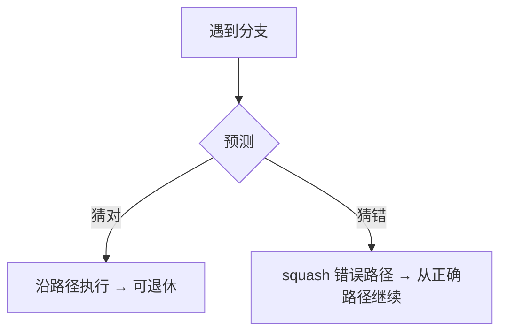

# CPU 指令流水线：吞吐、冒险与乱序

> 一条指令还没走完，处理器已经开始处理下一条——这不是「同一块硬件瞬间把两条指令算完」，而是**不同阶段、不同部件同时推进不同指令**。流水线提高吞吐；冒险决定你能否吃到峰值；乱序与推测让执行单元在等待时仍忙；退休则保证程序员看到的仍是 ISA 语义。
>
> 可与本库 [26](./26-cpu-memory-access-treatise.md)（一次 Load 的访存链落在流水线 **MEM**）、[22](./22-distributed-consistency-treatise.md)（另一层「顺序与可见性」）对照：本文写**指令级如何重叠**；26 写操作数从哪来。

先给一个直接答案：

> **经典模型把指令拆成取指 → 译码 → 执行 → 访存 → 写回等阶段；各阶段用不同硬件，故可重叠。** 理想填满后，单发射五级流水线吞吐约每周期完成一条，但单条指令仍可能要五个周期才走完——流水线主要抬的是**吞吐（throughput）**，不是把单指令延迟神奇地缩成 1/5。依赖、资源争用与分支分别造成数据 / 结构 / 控制冒险；转发、停顿、分支预测与推测执行用来减气泡。现代高性能核进一步做**乱序执行**与**按序退休**：内部发射顺序可变，架构结果仍按程序序提交。超标量则允许每周期发射多条独立操作。

**20-architecture 位置：** [26](./26-cpu-memory-access-treatise.md) 写访存链路；本文写指令如何叠进流水线并进到乱序 / 超标量。教学以经典五级为骨架；工业实现远更复杂，但纪律相同。

## 摘要

取指、译码、执行、访存、写回并不占用完全同一套硬件，这使指令执行可被切成流水线阶段并重叠——类似工厂生产线。MIT 6.004 等材料明确区分：指令**延迟**可为多周期，理想**吞吐**可达约每周期一条；以为「五级流水线让每条指令快五倍」是常见误读。三类冒险限制理想吞吐：结构冒险争用硬件；数据冒险依赖未就绪结果（可用停顿或 forwarding / bypassing）；控制冒险来自未解析分支（靠预测与推测执行填前端，误预测则 squash 错误路径）。Hennessy & Patterson 将冒险处理与指令级并行（ILP）作为定量体系结构的核心议题。Intel 等文档进一步区分：乱序执行核可在操作数就绪时绕过等待中的指令；**retirement** 按原程序序提交结果，错误推测路径上的 transient 指令被丢弃且不进入架构状态。超标量扩大每周期可发射的独立操作数。全文按「为何能重叠 → 吞吐与延迟 → 冒险 → 预测与乱序 → 收束」展开。

**关键词：** 指令流水线；吞吐；延迟；冒险；转发；分支预测；推测执行；乱序执行；退休；超标量；ILP

---

## 目录

- [摘要](#摘要)

**上篇 · 为何能重叠**

1. [读法与术语](#1-读法与术语)
2. [阶段分工：不同硬件同时工作](#2-阶段分工不同硬件同时工作)
3. [经典五级：吞吐与延迟](#3-经典五级吞吐与延迟)

**中篇 · 冒险与对策**

4. [三类流水线冒险](#4-三类流水线冒险)
5. [数据冒险：停顿与转发](#5-数据冒险停顿与转发)
6. [控制冒险：预测与推测](#6-控制冒险预测与推测)

**下篇 · 现代执行核**

7. [乱序执行与按序退休](#7-乱序执行与按序退休)
8. [超标量与 in-flight](#8-超标量与-in-flight)
9. [收束](#9-收束)
10. [本章要点](#10-本章要点)
11. [参考文献](#11-参考文献)

读法提示：先分清吞吐与延迟，再分清「内部执行顺序」与「架构可见顺序」；访存细节回 [26](./26-cpu-memory-access-treatise.md)。


---

## 1. 读法与术语

程序员看见的是程序序：`ADD` 然后 `SUB` 然后 `AND`。硬件看见的是：前端持续取指，中端调度就绪操作，后端多个执行单元忙碌，最后按序把正确结果变成架构状态。本文只钉一条因果链：

> **阶段可重叠 → 吞吐上升 → 冒险引入气泡 → 预测 / 乱序 / 多发射尽量填满执行资源 → 退休守住语义。**

### 1.1 术语对照

| 术语 | 一句话 |
| ---- | ------ |
| **流水线（pipeline）** | 把指令处理拆成多阶段，使不同指令同时处于不同阶段。 |
| **延迟（latency）** | 一条指令从进入到完成所需时间（常以周期计）。 |
| **吞吐（throughput）** | 指令完成的频率（如每周期多少条）。 |
| **冒险（hazard）** | 阻碍理想流水的情况：结构 / 数据 / 控制。 |
| **转发 / 旁路（forwarding / bypassing）** | 结果在写回寄存器文件前，直接送到后续执行阶段。 |
| **分支预测** | 在分支解析前猜测方向 / 目标，以继续取指。 |
| **推测执行** | 按预测路径执行更年轻指令；错了则 squash，不提交架构状态。 |
| **乱序执行（OoO）** | 操作数就绪的指令可绕过仍在等待的指令发射到执行单元。 |
| **退休 / 提交（retirement / commit）** | 按程序序使结果对架构可见；错误路径结果丢弃。 |
| **超标量（superscalar）** | 每周期可发射 / 完成多条独立操作。 |
| **ILP** | Instruction-Level Parallelism：指令级并行。 |

### 1.2 边界

1. **教学五级 ≠ 某一款商用核的精确微架构。** 阶段名、深度、是否微操作（µop）因实现而异；纪律可迁移。  
2. **不展开 Spectre 等侧信道攻击细节。** 推测执行有安全后果，以厂商安全文档为准；本文只讲性能机制。  
3. **访存链另文。** Load 未命中如何拖慢 MEM，见 [26](./26-cpu-memory-access-treatise.md)。  
4. **示例为示意。** 寄存器编号、停顿拍数随是否转发、是否 Load-Use 而变。

---

## 2. 阶段分工：不同硬件同时工作

熟悉的串行心智是：取指 → 译码 → 执行 → 写回，一条做完再开下一条。有用，但不完整。这些步骤依赖**不同硬件**：取指要指令 Cache / 取指单元；译码要译码器与读寄存器逻辑；算术要 ALU 等执行单元；写回要寄存器文件端口。它们不必在同一时刻全部被同一条指令独占——于是可以把处理拆成阶段，让多条指令重叠在不同阶段上，像工厂流水线：产品 A 在步骤 3 时，B 可在步骤 2，C 可在步骤 1。[^hennessy][^mit-6004]

假设三条互相独立的指令：

```text
I1: ADD R1, R2, R3
I2: SUB R4, R5, R6
I3: AND R7, R8, R9
```

「下一条已经开始」的含义是：例如 I1 在 EX，I2 在 ID，I3 在 IF——各用不同部件，而非同一 ALU 同时算完三条。

**所以 · 边界在哪：** 重叠的前提是阶段可分离；若所有步骤争用同一资源，流水线无从谈起（结构冒险正是对此的破坏）。

---

## 3. 经典五级：吞吐与延迟

教学上常用的经典五级（广见于 1980 年代 RISC 设计与教材）：[^mit-6004][^hennessy]

| 阶段 | 名称 | 典型工作 |
| ---- | ---- | -------- |
| **IF** | Instruction Fetch | 按 PC 取指令 |
| **ID** | Instruction Decode | 译码、读寄存器 |
| **EX** | Execute | ALU 运算或有效地址 |
| **MEM** | Memory Access | Load/Store 访存（接 [26](./26-cpu-memory-access-treatise.md)） |
| **WB** | Write Back | 结果写入寄存器文件 |

单发射（single-issue）标量流水线下，每周期最多一条新指令进入。理想时空图：

```text
Cycle   I1    I2    I3
-------------------------
  1     IF
  2     ID    IF
  3     EX    ID    IF
  4     MEM   EX    ID
  5     WB    MEM   EX
  6           WB    MEM
  7                 WB
```

Cycle 3 时已有三条指令同时在管线中。关键纠正：

| 概念 | 含义 |
| ---- | ---- |
| **延迟** | I1 仍可能要五个周期才走完全部阶段 |
| **吞吐** | 管线填满且无停顿时，约每周期完成一条 |

MIT 6.004 明确：流水化后，单条指令的延迟甚至可能略增（寄存器与划分开销），但因时钟周期缩短且每周期可完成一条的末级工作，**指令吞吐显著提高**；阶段延迟不均时，也达不到「完美五倍」的理想加速比。[^mit-6004] 因此「五级流水线让每条指令快五倍」不成立——好处是让不同部件同时保持忙碌。

**所以 · 边界在哪：** 谈流水线收益，先问吞吐还是单指令延迟；再问有无冒险把 CPI 抬回 1 以上。

---

## 4. 三类流水线冒险

Hennessy & Patterson 将流水线的主要障碍概括为三类冒险（hazards）：[^hennessy]

| 类型 | 卡在哪里 | 直观例子 |
| ---- | -------- | -------- |
| **结构冒险** | 同一周期争用同一硬件 | 单端口存储器同时要取指又要 Load |
| **数据冒险** | 后指令需要前指令尚未就绪的结果 | `ADD` 写 R1，下一条 `SUB` 读 R1 |
| **控制冒险** | 下一条 PC 取决于尚未解析的分支 | `if` 走哪条路径未定 |

对策方向各异：增加端口或分离 I/D Cache；停顿、转发、编译调度；尽早解析分支、延迟槽（历史手段）、硬件预测与推测。现代核上结构冒险因分离缓存与多端口而相对少见，数据与控制仍是主战场。

---

## 5. 数据冒险：停顿与转发

```text
ADD R1, R2, R3
SUB R4, R1, R5   # 需要新的 R1
```

在新 R1 可用前，`SUB` 不能正确执行——这是**数据冒险**。若无转发，简化时间轴可能变成：`SUB` 在 ID/EX 前插入 stall，直到 `ADD` 的 WB 完成。有了 **forwarding（bypassing）**，ALU 结果可从流水线寄存器直接旁路到后续 EX，而不必等正式写入寄存器文件——许多 ALU→ALU 相关因此可消除气泡。[^hennessy]

经典五级里仍有顽固情形：**Load-Use**。Load 的数据往往要到 MEM 末才就绪，紧跟的使用指令通常仍须暂停约一拍，再转发（详见 [26 §12](./26-cpu-memory-access-treatise.md)）。编译器也可通过指令调度拉开生产者与消费者距离，减少停顿。

**所以 · 边界在哪：** 转发减的是「结果已在芯片内却还没写回」的等待；它不消灭依赖，也不掩盖 Cache Miss 的长延迟。

---

## 6. 控制冒险：预测与推测

分支使「下一条取谁」在解析前不确定。若流水线空等分支结果，前端变空，吞吐骤降。现代 CPU 使用**分支预测**：在分支真正执行完之前猜测方向与目标，并沿预测路径继续取指、译码甚至执行。[^hennessy]

预测正确则节省等待；错误则必须丢弃错误路径上已处理的指令，从正确路径重来——代价随流水线深度与推测窗口增大而升高。按预测路径执行更年轻指令、错了再清除，称为**推测执行（speculative execution）**。Intel 表述：处理器可根据对未来执行的预测，推测执行更年轻的指令；预测正确则结果可退休并进入架构可见状态；错误则将这些仅推测执行的指令 **squash**，且不影响架构状态（此类被丢弃的指令亦称 transient instructions）。[^intel-spec]



**所以 · 边界在哪：** 预测让前端保持忙碌；正确性仍靠「解析后提交或丢弃」。推测提高性能，也扩大了瞬态执行的安全攻击面——机制与缓解见厂商安全指南，本文不展开。[^intel-spec]

---

## 7. 乱序执行与按序退休

经典流水线仍是简化模型。现代高性能 CPU 通常采用**乱序执行**：

```text
I1: LOAD R1, [mem]     # 可能很慢（Cache Miss）
I2: ADD  R2, R1, R3    # 依赖 I1
I3: MUL  R4, R5, R6    # 与 I1/I2 独立
```

顺序核可能在 I1 等待时堵住后面一切；乱序核可在 I1 等待期间执行已就绪的 I3，待 I1 完成后再执行 I2。Intel SDM 对乱序执行核的表述是：若某一微操作被延迟，其他微操作可绕过它继续；**Retirement Unit** 接收乱序核的结果，并按**原始程序顺序**更新架构状态——Reorder Buffer（ROB）缓冲已完成的微操作、按序提交并管理异常排序。[^intel-ooo]

因此必须区分两层：

| 层 | 顺序 |
| -- | ---- |
| **内部执行** | 可为乱序、可推测 |
| **架构结果** | 必须遵守程序所要求的语义（按序可见） |

程序员（在忽略并发存储模型细节时）应看到「仿佛按程序序执行」；硬件用重命名、ROB、按序提交等维持这一契约。

**所以 · 边界在哪：** 乱序提高的是执行单元利用率；语义正确性寄托在退休，而不是「发射顺序 = 程序顺序」。

---

## 8. 超标量与 in-flight

流水线让不同**阶段**同时工作；乱序让独立指令在等待时仍占用执行单元；分支预测让前端不必空等每个分支。合在一起，大量指令可同时处于 **in flight**（已取入、尚未退休）。

现代 CPU 通常还是**超标量（superscalar）**：每周期可发射多条相互独立的操作，进一步挖掘 ILP。执行资源昂贵且多样——整数 ALU、浮点、Load/Store、向量、分支单元等——若必须等一条完全结束后才开下一条，多数单元会空闲。流水线、乱序、预测与多发射的共同目标，是让这些单元尽量保持忙碌。[^hennessy]

概念上的现代前端可记为：

```text
分支预测 → 取指 → 译码 → 指令队列
              ↓
        乱序调度 / 重命名
              ↓
     ┌────────┼────────┐
    ALU    Load/Store   FP/Vector …
              ↓
           按序退休
```

**所以 · 边界在哪：** 「同时处理很多指令」不等于无视依赖；窗口再大，Cache Miss、误预测与序列化点仍会拉开与峰值的差距。

---

## 9. 收束

```text
  阶段可分离
       │
       ▼
  流水线重叠（吞吐 ↑，单指令延迟 ≠ ÷N）
       │
       ▼
  冒险 → 停顿 / 转发 / 预测
       │
       ▼
  乱序执行 + 按序退休；超标量扩大发射宽度
```

三条主线：

1. **重叠：** 不同阶段用不同硬件，故可同时推进多条指令。  
2. **度量：** 流水线主收益在吞吐；冒险决定实际 CPI。  
3. **现代核：** 内部可乱序、可推测；架构状态按序提交。

---

## 10. 本章要点

1. **流水线**把指令拆成 IF–ID–EX–MEM–WB（教学模型），使多指令分处不同阶段。  
2. **吞吐 ≠ 单指令延迟**；「快五倍」是误读。  
3. **三类冒险：** 结构、数据、控制。  
4. **转发**减轻数据冒险；Load-Use 在经典五级常仍须一拍气泡。  
5. **分支预测 + 推测执行**填前端；误预测则 squash。  
6. **乱序执行**绕过等待；**退休**按程序序提交。  
7. **超标量**提高每周期可发射的独立操作数；与 [26](./26-cpu-memory-access-treatise.md) 的访存链正交互补。

---

## 11. 参考文献

[^hennessy]: John L. Hennessy, David A. Patterson, *Computer Architecture: A Quantitative Approach*（多版；流水线基础见附录 *Pipelining: Basic and Intermediate Concepts*，ILP / 预测 / 动态调度见相关章节）. 冒险分类、转发、分支代价与指令级并行的标准教材表述。

[^mit-6004]: MIT OpenCourseWare, *6.004 Computation Structures*（如 Spring 2017，流水线讲次）. https://ocw.mit.edu/courses/6-004-computation-structures-spring-2017/ ；注解幻灯 https://ocw.mit.edu/courses/6-004-computation-structures-spring-2017/pages/c15/c15s1/ 。区分指令延迟与每周期一条的吞吐；指出阶段不均时达不到理想五倍加速。

[^intel-spec]: Intel, *Hardware Features and Behaviors Related to Speculative Execution*. https://www.intel.com/content/www/us/en/developer/articles/technical/software-security-guidance/technical-documentation/hardware-behavior-related-to-speculative-execution.html ；术语细化见 *Refined Speculative Execution Terminology*. https://www.intel.com/content/www/us/en/developer/articles/technical/software-security-guidance/best-practices/refined-speculative-execution-terminology.html 。预测正确则推测结果可退休并进入架构可见状态；错误则 squash，不影响架构状态；被丢弃者称 transient instructions（已执行但不退休）。

[^intel-ooo]: Intel® 64 and IA-32 Architectures Software Developer’s Manual, Volume 1: *Basic Architecture*, §2.2.2.2 Out-Of-Order Execution Core；§2.2.2.3 Retirement Unit. https://www.intel.com/content/www/us/en/developer/articles/technical/intel-sdm.html 。「若某一微操作延迟，其他微操作可绕过」；Retirement Unit 按原程序序更新架构状态；ROB 缓冲已完成微操作、按序提交并管理异常。

**声明：** 正文是指令级并行与流水线的教学编年，不是某一微架构的周期精确模型，也不替代侧信道安全基线。阶段划分、发射宽度与预测器实现以具体 CPU 与厂商文档为准；与访存延迟叠加时，以 [26](./26-cpu-memory-access-treatise.md) 的链路为补充。
