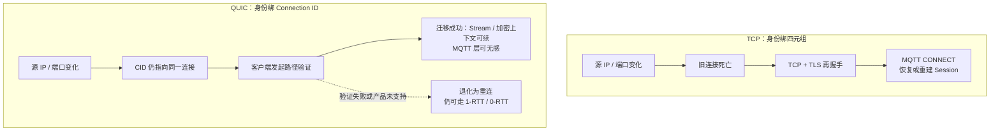
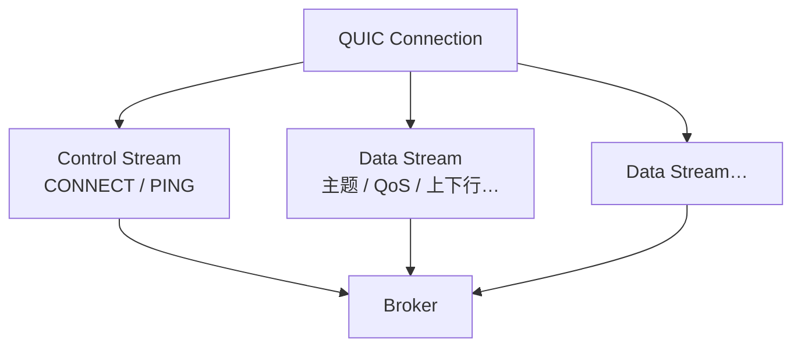

# MQTT over QUIC：弱网下的传输层替换

> 一辆车驶入隧道：5G → 4G → 无信号 → 再回 5G。物理上「有没有网」与业务上「MQTT 会话是否还活着」往往不是同一件事。MQTT 语义可以不变；变的是底下那一层传输。
>
> 本文把 **MQTT over QUIC** 收成一条链：**弱网错配 → TCP 三重代价 → QUIC 如何对症 → MQTT 如何映到 Stream → 落地边界**。可与本库 [16](../10-chronicle/16-http-protocol-chronicle.md)（HTTP/3 接到 QUIC）、[14](../10-chronicle/14-internet-history-chronicle.md)（协议即架构）、[21](./21-service-architecture-evolution.md)（复杂度换层）对照：彼处写 Web 语义换传输；此处写物联网消息协议换传输。

先给一个直接答案：

> **MQTT over QUIC 不是新的 MQTT，而是把既有 MQTT 字节跑在 QUIC（RFC 9000）上。** 要压的是两类痛：终端「物理有网、业务失联」的窗口，以及 Broker 侧海量设备几乎同时重连的风暴。QUIC 以 **Connection ID** 支撑连接迁移、将传输与 TLS 1.3 握手合成 **1-RTT / 0-RTT**、并在 **Stream** 粒度做丢包恢复——对症 TCP 的四元组绑死、握手叠层与单字节流队头阻塞。边界也须钉死：今日主流仍是 **单双向 Stream 承载整条 MQTT 连接**；按主题 / 优先级拆多 Stream 是演进，不是默认已兑现。UDP 不通须能回落 TCP；0-RTT 有重放风险；某云「开了 QUIC 端口」≠ 连接迁移已在生产可用。

**20-architecture 位置：** [16](../10-chronicle/16-http-protocol-chronicle.md) 写 HTTP 如何接到 QUIC；本文写 **MQTT 如何接到同一条传输**。开源侧 EMQX / NanoMQ 等已推进多年；公有云侧（如腾讯云 TDMQ MQTT）在产品商业化后提供 `mqtt-quic` 接入点——正文区分 **协议能力** 与 **某产品某版本是否已可生产使用**。

## 摘要

TCP 在有线与数据中心长期成立的假设——**丢包多半意味着拥塞**——在移动与蜂窝链路上经常不成立：丢包更常来自衰减、切换与干扰。MQTT 跑在 TCP（及 TCP+TLS）上时，弱网会放大三重结构代价：地址一变就要重建连接与应用会话；单一有序字节流造成传输层队头阻塞；连接生死由内核超时主导，应用发现偏慢。QUIC 在 UDP 上提供多路可靠流、内置 TLS 1.3 级加密、连接迁移与更短握手，既是 HTTP/3 的底层传输，也被用来承载 MQTT。产业以 **单 Stream 映射一条 MQTT 连接** 为主（OASIS 侧有 Single Stream Mode 的 Committee Note 推进）；多 Stream 可隔离控制流与高低频数据，映射与互操作仍在演进。选型先问三句：路径是否允许 UDP？失联窗口与重连风暴是否真是瓶颈？会话恢复靠 MQTT Session，还是还指望传输层迁移？

**关键词：** MQTT；QUIC；Connection ID；连接迁移；队头阻塞；0-RTT；Stream；Keep Alive；Session；弱网；车联网

---

## 目录

- [摘要](#摘要)
1. [读法与术语](#1-读法与术语)
    - [1.1 术语对照](#11-术语对照)
    - [1.2 边界](#12-边界)
2. [场景：失联窗口与重连风暴](#2-场景失联窗口与重连风暴)
3. [前提错配：不是 TCP 不行](#3-前提错配不是-tcp-不行)
4. [TCP 上的三重结构代价](#4-tcp-上的三重结构代价)
    - [4.1 重连代价高](#41-重连代价高)
    - [4.2 传输层队头阻塞](#42-传输层队头阻塞)
    - [4.3 故障发现偏慢](#43-故障发现偏慢)
5. [QUIC：四条能力如何对症](#5-quic四条能力如何对症)
6. [MQTT 如何映到 QUIC](#6-mqtt-如何映到-quic)
    - [6.1 语义不变，传输替换](#61-语义不变传输替换)
    - [6.2 单 Stream：今日主流](#62-单-stream今日主流)
    - [6.3 多 Stream：演进重点](#63-多-stream演进重点)
    - [6.4 与 MQTT Session 的分工](#64-与-mqtt-session-的分工)
7. [产业落地与选型](#7-产业落地与选型)
    - [7.1 能力对照](#71-能力对照)
    - [7.2 谁在落地](#72-谁在落地)
    - [7.3 更值得评估的场景](#73-更值得评估的场景)
    - [7.4 接入时少踩的坑](#74-接入时少踩的坑)
8. [收束](#8-收束)
9. [本章要点](#9-本章要点)
10. [参考文献](#10-参考文献)

---

## 1. 读法与术语

全文只钉一层替换关系：

> **MQTT 应用语义（CONNECT / PUBLISH / SUBSCRIBE…）尽量不变；替换的是传输：TCP（+TLS / WebSocket）→ QUIC。**

| 层 | 回答的问题 | 常见选项 |
| -- | ---------- | -------- |
| **应用** | 主题、QoS、会话、遗嘱 | MQTT 3.1.1 / 5.0 |
| **传输** | 可靠、多路、握手、迁移 | TCP · WebSocket · **QUIC** |
| **安全** | 加密与身份 | TCP 上叠 TLS；QUIC 内置 TLS 1.3 握手（RFC 9001）[^rfc9001] |

层叠关系（本文只换中间一层）：

```text
┌─────────────────────────────────────┐
│  MQTT 语义（包格式不变）              │  CONNECT / PUBLISH / SUBSCRIBE…
├─────────────────────────────────────┤
│  传输：TCP(+TLS) / WebSocket / QUIC  │  ← 本文替换点
├─────────────────────────────────────┤
│  UDP / IP（QUIC 路径）或 TCP / IP     │
└─────────────────────────────────────┘
```

### 1.1 术语对照

| 术语 | 一句话 |
| ---- | ------ |
| **MQTT** | 发布 / 订阅消息协议；常见于物联网与车联网；传输层历史上以 TCP 为主。 |
| **QUIC** | UDP 上的多路安全传输（RFC 9000）；HTTP/3 的底层；可靠与拥塞控制在用户态实现。[^rfc9000] |
| **四元组** | TCP 连接身份：源 IP、源端口、目的 IP、目的端口。文档口语常称**五元组**（再含协议号）；路径变化时二者都会失效。 |
| **Connection ID** | QUIC 用来标识逻辑连接的 ID；IP / 端口可变，连接仍可续。[^rfc9000] |
| **连接迁移** | 客户端换地址后，经路径验证把同一 QUIC 连接迁到新路径；RFC 9000 本版由客户端发起。[^rfc9000] |
| **Stream** | QUIC 上的逻辑通道；丢包恢复与流控可按流独立。 |
| **队头阻塞（HOL）** | 先到的缺失阻塞后到的已就绪数据。TCP 字节流是连接级；QUIC 多 Stream 可降到流级。 |
| **1-RTT / 0-RTT** | 首次建连约 1 个往返后可带应用数据；持有会话票据时可 0-RTT 发早期数据（有重放风险）。[^rfc9001] |
| **MQTT Session** | 应用层会话状态（订阅、未确认消息等）；MQTT 5 用 Clean Start 与 Session Expiry Interval 控制。[^mqtt5] |
| **Keep Alive** | MQTT 心跳间隔；超时未活动则判定连接异常。设短费流量 / 电，设长发现慢。 |
| **ALPN** | 握手时协商应用协议名；QUIC 上跑 MQTT 时常见约定为 `mqtt`（以厂商文档为准）。[^tdmq] |

### 1.2 边界

1. **本文写协议机理与选型边界，不是某一云厂商的操作手册。** 端口、SDK、计费以当时产品文档为准。  
2. **「MQTT over QUIC」在 OASIS 侧以 Committee Note / 草案推进为主**（如 Single Stream Mode），并非已定稿的 MQTT 新大版本；互操作以实现与测试矩阵为准。[^oasis-quic]  
3. **单 Stream 映射 ≠ 多主题已无队头阻塞。** 一流上的 MQTT 包序仍在；多 Stream 才谈业务级隔离。  
4. **连接迁移是 RFC 能力，不是每个 Broker / SDK 的已交付清单。** 路径验证、CID 轮换、NAT、中间盒与产品开关都会卡住。  
5. **场景中的秒数是教学量级，不是可外推的 SLA。** 墙钟取决于 RTO、RTT、TLS 版本、会话是否恢复与实现质量。

---

## 2. 场景：失联窗口与重连风暴

用一个车联网教学场景钉住问题（数字为量级，不是实测报告）：

车辆在数十秒内经历蜂窝衰减与恢复。TCP 路径上常见两段延迟叠在一起：

1. **死亡宣告偏慢：** 信号变差时，内核仍按丢包 / 拥塞逻辑重传与退避；应用层往往要等超时才知「事实断连」。  
2. **复活偏贵：** 连接被判定死亡后，再走 TCP 握手 + TLS + MQTT CONNECT，并恢复订阅、清理旧连接。弱信号下 RTT 拉长，每一跳都更疼。

两端同时痛：

| 侧 | 现象 |
| -- | ---- |
| **终端** | 一段「物理上可能已有网、业务上仍失联」的窗口 |
| **服务端** | 同一地理障碍后，大量设备几乎同时重连 → 握手、鉴权、会话恢复、旧连接回收叠加成**重连风暴** |

QUIC 不能消灭隧道，但可以压缩「宣告死亡 + 重建会话」的成本；若连接迁移生效，部分切换甚至不必走到应用层重连。下一节先说明：为何在移动网上，TCP 的默认反应常常不对症。

**所以 · 边界在哪：** 优化对象是失联窗口与重连风暴，不是「让无线信道不再丢包」。

---

## 3. 前提错配：不是 TCP 不行

TCP 诞生并成熟于有线与数据中心语境。其经典拥塞控制把**丢包**当作**拥塞信号**：降速、退避、等待。这一假设在缓冲溢出主导的环境里工作了很久。[^tcp-assump]

移动与蜂窝链路里，丢包的主因经常不是瓶颈队列满，而是无线信道：衰减、多径、切换、瞬时干扰。此时「降速退避」可能是错动作——路径上仍有带宽，只是刚好丢了若干包。更现代的拥塞控制（如 BBR 一类）试图更多看延迟与带宽估计，但 **MQTT 设备侧仍大量跑在通用内核 TCP 栈上**，超时与重传参数应用难以精细干预。

错配落到 MQTT，就表现为下一节的三重结构代价——不是实现写得差，而是传输假设与场景不一致。

**所以 · 边界在哪：** 批评的是「丢包≡拥塞」在弱网的错配，不是宣布 TCP 在数据中心失效。

---

## 4. TCP 上的三重结构代价

### 4.1 重连代价高

TCP 连接身份绑在四元组上。设备从蜂窝切到 Wi-Fi、或 NAT 重绑导致对外地址变化，**旧四元组上的连接在协议意义上已经结束**，必须重新建连。

叠层成本（冷启动、无丢包的理想量级）：

| 组合 | 量级 |
| ---- | ---- |
| TCP + TLS 1.2 | 常约 **3 RTT** 才到应用数据 |
| TCP + TLS 1.3 | 常约 **2 RTT**（TCP 1 + TLS 1） |
| QUIC（TLS 1.3 融入） | 首次约 **1 RTT**；恢复可 **0-RTT** |

RTT 越大（跨公网、漫游、弱信号），少一次往返的收益越明显；同城内网差异可以很小。[^handshake]

传输断了之后，MQTT 还要再付一层：CONNECT / 鉴权、是否恢复 Session、重新 SUBSCRIBE（若未保留会话）、Broker 清理旧连接。MQTT 5 可用 **Clean Start = 0** 与 **Session Expiry Interval** 在断连后一段时间内保留会话，但**前提是客户端尽快再次连上**——传输层重建越慢，越容易顶到过期或堆积未确认消息。[^mqtt5]

### 4.2 传输层队头阻塞

TCP 提供**单一有序字节流**。序号 100 的段丢失时，即便 101–150 已到达接收缓冲，应用层也不得交付——必须等 100 重传成功。这是**传输层队头阻塞**：

```text
  已到达：  …  [101][102][103] …  [150]
  缺失：         [100]  ← 卡住
  应用可见：     （等待 100 重传成功之前，后面一律不交付）
```

MQTT 常在一条连接上复用多类流量：高频车身状态、低频故障码、偶发大块日志。在 TCP 眼里它们是同一条字节流：**任一处丢包，全部主题一起等**。业务侧有时拆多条 TCP 按优先级分流——连接数、Broker 状态与终端电量成本一起上升。

HTTP/2 也曾把多流复用在一条 TCP 上，于是把队头阻塞从「HTTP 消息层」挪到「TCP 层」——见 [16](../10-chronicle/16-http-protocol-chronicle.md)。MQTT over TCP 是同一类结构。

### 4.3 故障发现偏慢

TCP 连接状态主要由操作系统内核维护。弱网下重传与 RTO 退避可以持续较长时间；在内核放弃之前，应用层往往无法「自行宣判死亡」并立刻改走新路径。

MQTT **Keep Alive** 可补一刀：超时无活动则断开。心跳设在数十到数百秒量级时很常见——设短了费流量与射频时间，设长了发现不及时。Keep Alive 与内核超时是两套钟，任一偏慢都会拉长失联窗口。

**所以 · 边界在哪：** 三重代价分别打在「身份 / 有序字节流 / 超时主权」上；对症也要分三条看，不能收成一句「换 QUIC 就全好」。

---

## 5. QUIC：四条能力如何对症

QUIC（RFC 9000）由 Google 早期实践推动，经 IETF 标准化；运行在 UDP 之上，并把可靠传输、多路流与加密握手收进用户态。HTTP/3（RFC 9114）是其最广为人知的应用映射；MQTT 是另一条。[^rfc9000][^rfc9114]

| QUIC 能力 | 对症哪一条 TCP 代价 | 要说清的边界 |
| --------- | ------------------- | ------------ |
| **Connection ID + 连接迁移** | 四元组绑死 → 一切重来 | 客户端发起；需路径验证；新路径拥塞状态宜重估；稳定 CID 有关联风险，实践常轮换 CID[^rfc9000] |
| **1-RTT / 0-RTT 握手** | TCP+TLS 叠 RTT | 0-RTT 早期数据可被重放，只适合幂等 / 可容忍重放的载荷[^rfc9001] |
| **多 Stream、流级恢复** | 连接级队头阻塞 | **仅当业务真拆到多 Stream 时** 才隔离主题；单 Stream 映射仍共享一流有序 |
| **用户态拥塞控制 + 默认加密** | 内核栈难改；TLS 另叠一层 | 实现与调参质量参差；UDP 被拦时必须回落 |

对 MQTT 最敏感的，往往是前两条在弱网切换里的组合：迁移成功则加密上下文与传输状态可续，应用层甚至无感；迁移失败或未实现，则至少还能靠更短握手压缩重连。**MQTT Session 是否保留，仍由 MQTT 会话参数决定**——传输层迁移是「尽量别拆到要重 CONNECT」，不是替代 Session Expiry。

切网时两条路径对比（QUIC 侧为 RFC 能力示意；产品是否完整支持须实测）：[^rfc9000]



**所以 · 边界在哪：** QUIC 压缩的是重建与阻塞的成本；无线丢包率本身不会因换协议而下降。

---

## 6. MQTT 如何映到 QUIC

### 6.1 语义不变，传输替换

> **兼容 MQTT 3.1.1 / 5.0 的包格式与语义；QUIC 替换传输层。** 客户端建立 QUIC 连接后，在 Stream 上跑既有 MQTT 字节。

不是「发明另一种发布订阅语义」，也不是「HTTP/3 的别名」。

### 6.2 单 Stream：今日主流

产业与标准化讨论里，**单双向 Stream 承载一条 MQTT 连接**是当前主路径：实现简单、保序与现有 MQTT 一致，先吃到握手、迁移、用户态恢复等传输红利。OASIS MQTT TC 上已有 *MQTT over QUIC — Single Stream Mode* 的 Committee Note 草案贡献（不修改 MQTT 包格式；定稿状态以 TC 为准）。[^oasis-quic]

```text
  QUIC Connection（CID）
  └── 一条双向 Stream
        └── 全部 MQTT 包（CONNECT / PUBLISH / PING…）按序走同一流
```

在此模式下：

- **吃到的红利**主要是迁移、1-RTT / 0-RTT、用户态丢包与拥塞控制——相对 TCP+TLS 的重建与弱网恢复成本；  
- **没有消除**「同一 MQTT 连接内、因单流有序而导致的主题间互相等待」。大块低优先级报文仍可能拖住同流上的 PING，极端时拖到 Keep Alive 超时。[^emqx-hol]

营销若写「已彻底消除队头阻塞」，在单 Stream 落地里**过满**。业务级隔离看多 Stream。

### 6.3 多 Stream：演进重点

多 Stream 模式通常保留一条**控制流**（CONNECT、CONNACK、PING 等），再为发布 / 订阅数据开额外 Stream——可按主题、QoS、上下行等策略映射。控制流与数据流解耦后，数据流拥塞时仍可能靠控制流维持 Keep Alive。[^emqx-quic]

```text
  QUIC Connection（CID）
  ├── Control Stream     CONNECT / CONNACK / PING…
  ├── Data Stream A      如高频状态主题
  └── Data Stream B      如大块日志主题（丢包不拖住 A 与 PING）
```



相关主题若强依赖全局次序，应映到**同一** Data Stream；次序只在流内保证。[^emqx-quic]

EMQX 自 5.0 引入、5.1 起将含多 Stream 的 MQTT over QUIC 视为 generally available，并常见 QUIC 失败时回落 TCP/TLS；NanoMQ 等可用 QUIC 桥接把边缘传统客户端接到云侧 QUIC 监听。[^emqx-quic][^nanomq]

代价是映射规则、流生命周期与互操作更复杂。

### 6.4 与 MQTT Session 的分工

| 机制 | 层 | 做什么 |
| ---- | -- | ------ |
| **连接迁移** | QUIC | 尽量不拆传输连接 |
| **0-RTT** | QUIC | 重连时尽快重送数据 |
| **Session Expiry / Clean Start** | MQTT | 传输断了之后，会话状态留多久、是否恢复 |

三者叠加才像完整故事；只开 QUIC 端口但 Session 立即过期，重连风暴仍可能很重。

**所以 · 边界在哪：** 先确认映射是单流还是多流，再决定「无队头阻塞」能说到哪一步。

---

## 7. 产业落地与选型

### 7.1 能力对照

| 能力 | 说明 |
| ---- | ---- |
| **协议兼容** | MQTT 语义不变；传输可为 TCP / WebSocket / QUIC 并行接入 |
| **握手** | 首次约 1-RTT；恢复可 0-RTT（注意重放边界） |
| **迁移** | RFC 支持；产品是否完整支持须查文档与实测 |
| **队头阻塞** | 多 Stream 才业务级隔离；单 Stream 先吃传输红利 |
| **安全** | QUIC 无长期明文应用通道；密码学对接 TLS 1.3；常见仅 IETF QUICv1，不含早期 gQUIC[^rfc9001][^tdmq] |
| **可观测** | 连接数、握手失败、回落 TCP、迁移成功与否应进监控 |

纠错一句常见宣传：**QUIC 不「降低无线丢包率」**，而是让丢包的**业务影响面与恢复路径**更可控。

### 7.2 谁在落地

- **开源 Broker / 边缘：** EMQX 5.0 实验引入，5.1 起视为 GA（含多 Stream）；客户端侧常见回落 TCP/TLS；NanoMQ / NanoSDK 提供桥接与 C 系路径。[^emqx-quic][^nanomq]  
- **公有云示例（腾讯云 TDMQ MQTT）：** 产品于 **2024-12-26** 结束公测并商业化计费；其后有 **QUIC 端口开放** 记录。文档中 `mqtt-quic` 常见默认端口 **14567**、ALPN **`mqtt`**，并写明仅支持 IETF RFC 9000。同一产品线的 *MQTT over QUIC* 说明仍可能标注**实验性、不建议生产**，且**连接迁移尚未完整支持**——「端口已开」与「迁移 / 生产可用」必须分开核对。[^tdmq]

### 7.3 更值得评估的场景

| 场景 | 为何对症 |
| ---- | -------- |
| **车联网 / 高频切网** | 迁移与短握手压失联窗口；削峰重连风暴 |
| **低空、AGV、园区漫游** | 弱信号与 AP 切换是常态，不是异常 |
| **跨公网 / 长 RTT 远控** | 少 RTT 的收益随延迟放大 |
| **周期性唤醒的低功耗终端** | 0-RTT 缩短射频工作时间（仍受安全与实现约束） |

同城机房、稳定有线、主题单一且已用好 MQTT Session 的系统，换 QUIC 的边际收益可能很小，还要付 UDP 路径与 SDK 成熟度的成本。

### 7.4 接入时少踩的坑

1. **UDP 与中间盒：** 企业网 / 部分运营商对 UDP 不友好；客户端宜具备回落 TCP/TLS（或边缘 QUIC 桥接）。  
2. **只换传输、不调会话：** Session Expiry、QoS、遗嘱与离线消息策略仍要设计。  
3. **把演示当成 SLA：** 隧道叙事里的秒数不可写进合同。  
4. **0-RTT 乱塞控制指令：** 重放可能导致重复动作；控制面宜走 1-RTT 或应用层去重。  
5. **把 RFC 能力写成产品承诺：** 尤其是连接迁移——以当前地域文档与实测为准。

**所以 · 边界在哪：** 弱网是物联网常态；QUIC 是评估清单上的传输选项，不是无条件默认。

---

## 8. 收束

若只留一张心智图：

```text
  弱网丢包 ≠ 一定拥塞
            │
            ▼
  ┌─────────────────────────────────────┐
  │ TCP：四元组死亡 · 字节流 HOL · 内核超时 │
  └─────────────────┬───────────────────┘
                    ▼
  ┌─────────────────────────────────────┐
  │ QUIC：CID 迁移 · 流级恢复 · 1/0-RTT   │
  └─────────────────┬───────────────────┘
                    ▼
  ┌─────────────────────────────────────┐
  │ MQTT：语义不变                        │
  │   单 Stream 先落地 → 多 Stream 再拆业务 │
  └─────────────────┬───────────────────┘
                    ▼
    Session / Keep Alive / 回落 TCP 仍要接住
```

一句话：**不是让车不再进隧道，而是让进隧道之后业务失联更短，出隧道之后重连更轻。**

---

## 9. 本章要点

1. **MQTT over QUIC = 语义不变 + 传输替换**；不是新的发布订阅协议。  
2. **弱网错配：** 无线丢包常被 TCP 当成拥塞来退避。  
3. **三重代价：** 重连贵、连接级 HOL、故障发现慢。  
4. **QUIC 对症：** 迁移、短握手、流级恢复、用户态拥塞控制与内置加密。  
5. **单 Stream 是今日主流**；多 Stream 才谈主题级无阻塞。  
6. **迁移 ≠ Session：** 传输续连与 MQTT 会话保留是两层旋钮。  
7. **0-RTT 有重放风险**；UDP 不通要回落；产品能力以文档与实测为准。  
8. **优先场景：** 切网频繁、长 RTT、重连风暴贵的移动物联网。

---

## 10. 参考文献

[^rfc9000]: RFC 9000, *QUIC: A UDP-Based Multiplexed and Secure Transport*, May 2021. Connection ID、连接迁移（客户端发起）、流多路复用等。

[^rfc9001]: RFC 9001, *Using TLS to Secure QUIC*. QUIC 与 TLS 1.3 的结合；1-RTT / 0-RTT；0-RTT 应用数据的重放风险说明。

[^rfc9114]: RFC 9114, *HTTP/3*, June 2022. HTTP 语义到 QUIC 的映射；说明 QUIC ≠「HTTP/3 改名」。

[^handshake]: TLS 1.3 over TCP 冷启动通常约 2 RTT（TCP + TLS）；TLS 1.2 over TCP 常见约 3 RTT。QUIC 将传输与加密握手合并为约 1 RTT，恢复可为 0-RTT。比较见公开密码学与测量文献对 TLS/TCP 与 QUIC 建连延迟的对照；实现与丢包会改变墙钟。

[^tcp-assump]: 经典 TCP 拥塞控制将丢包视为拥塞信号（如 Reno 族）。无线环境中丢包原因更复杂，是移动网络性能文献中的长期议题；正文取教学对比，不展开拥塞控制谱系。

[^mqtt5]: OASIS *MQTT Version 5.0*. Clean Start、Session Expiry Interval、Keep Alive 等会话与活性机制。Session 可跨越多次 Network Connection，但仍依赖及时重连。

[^oasis-quic]: OASIS MQTT TC：*MQTT over QUIC — Single Stream Mode* Committee Note 草案等公开贡献（如 TC 文档区 / GitHub `oasis-tcs/mqtt` 讨论）。**以 TC 当前状态为准**；本文不将其表述为已批准的最终国际标准。

[^emqx-quic]: EMQX 文档：*MQTT over QUIC* 介绍与 Features（单 / 多 Stream、回落 TCP、控制流与数据流分工、按主题 / QoS 映射、流内保序等）。*What's New*（5.1）：5.0 实验引入，5.1 起视为 generally available。细节随版本变化。

[^emqx-hol]: EMQ 工程叙述：单 Stream 上大块低优先级报文可阻塞同流 Keep Alive，导致 MQTT 层超时；多 Stream 将 PING 放在控制流、数据分主题开流，用以缓解主题间 HOL。见 *How Multi-Stream of QUIC Could Mitigate the HOL Blocking Issue of MQTT Connection* 一类公开博文；属实现经验，不是 RFC 条文。

[^nanomq]: NanoMQ 文档：*MQTT over QUIC Bridge*——边缘以 QUIC 桥接云侧 Broker；可配置 hybrid（QUIC 优先、回落 TCP/TLS）、单 / 多 Stream 等。用于「端侧仍是 TCP MQTT、上云走 QUIC」的过渡路径。

[^tdmq]: 腾讯云：*关于 TDMQ MQTT 版结束公测和商业化通知*（2024-12-26 起商业化）；*新功能发布记录*（QUIC 端口开放）；*网络连接说明*（`mqtt-quic` 等接入点）；*MQTT over QUIC*（端口 14567、ALPN `mqtt`、仅 IETF RFC 9000；文中仍可能标注实验性，且连接迁移未完整支持）。**以当前控制台与地域文档为准。**

**声明：** 正文是弱网场景下 MQTT 传输层替换的教学整理，不是某一代内核、某一款 SDK 或某一云地域的周期精确模型。冲突时以 RFC、OASIS 文档、厂商发布说明与实测为准。
