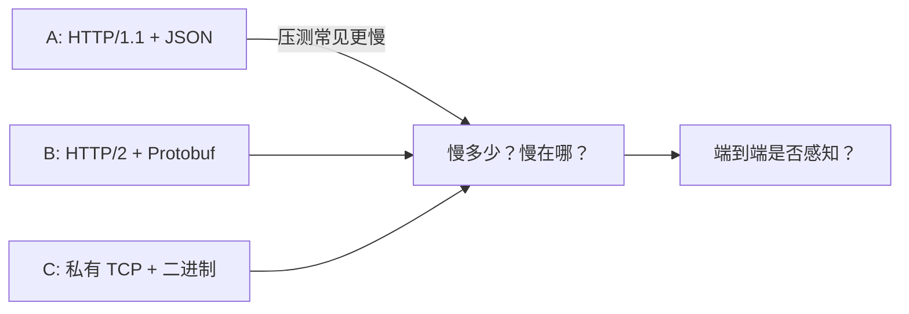

# 微服务间通信：HTTP 与 RPC 慢在哪

> 「HTTP 比 RPC 慢」在群里经久不衰；Spring Cloud 里 OpenFeign 却依然到处可见。矛盾不在口号，在**口径**与**瓶颈位置**。
>
> 本文按可核对的链展开：**对齐组合 → 公开压测量级 → 慢在哪三环 → 业务账 → 选型**。可与 [21](./21-service-architecture-evolution.md)（微服务选型自由）、[16](../10-chronicle/16-http-protocol-chronicle.md)（HTTP 代际与队头阻塞）、[27](./27-mqtt-over-quic-treatise.md)（传输层替换）对照：此处专写服务间调用里**慢多少、慢在哪、值不值得换**。

先给一个直接答案：

> **口语「HTTP vs RPC」，多半不是在比四个字母，而是在比两套组合：HTTP/1.1 + JSON（常见 OpenFeign / RestTemplate）对上 HTTP/2 或私有 TCP + 二进制序列化（gRPC、Dubbo 等）。** 公开压测里，后者吞吐常见约 **1～2×**、延迟常低约 **三成到一半**——这是某一环境的量级，不是定律；低流量、侧重单次延迟时，REST 偶可不输。慢的大头往往在 **JSON 与文本头**，其次才是连接复用；**gRPC 的传输正是 HTTP/2**，并非绕开 HTTP。多数业务里通信只占端到端一小截，被数据库与逻辑淹没；长链路、极高 QPS、大报文或弱网时差距才放大。先测量真实瓶颈，再决定是否为协议与序列化买单。

**20-architecture 位置：** [21](./21-service-architecture-evolution.md) 写微服务时代「远程调用有一长串选项」；本文专解其中最吵的一问——**HTTP 风格调用与 RPC 框架，性能差从哪来、差多少、何时不用纠结**。

## 摘要

微服务间通信的争论，若把「HTTP」与「RPC」当成互斥四字口号，必然鸡同鸭讲。宜先钉口径：日常「HTTP 慢」多指 **HTTP/1.1 + JSON**；日常「RPC 快」多指 **TCP 私有协议或 HTTP/2 + 二进制序列化（Protobuf / Hessian2 等）**。公开博客基准（如 gRPC+Protobuf vs REST+JSON）与 Dubbo 官方协议基准，方向大体一致：二进制组合在高并发吞吐与延迟上常占优；但学术与社区微基准也表明，**低流量或极小报文、侧重单次延迟时，REST 并不必然落败**。更关键的纠错是：**同属 HTTP/2 的 Triple，点对点仍可能慢于 Dubbo TCP 私有协议**——「上了 RPC 框架」不等于「一定最快」。HTTP/2 相对 HTTP/1.1 的收益高度依赖是否吃到多路复用。工程上用 Amdahl 式拆账：通信省下的毫秒若只占总耗时一成多，用户往往无感。真正该盯的是监控里的瓶颈，以及通用性、网关穿透、浏览器可达、团队技能等非性能变量。

**关键词：** HTTP；RPC；gRPC；REST；JSON；Protobuf；Dubbo；Triple；HTTP/2；序列化；微服务；OpenFeign

---

## 目录

- [摘要](#摘要)
1. [读法与口径](#1-读法与口径)
    - [1.1 术语对照](#11-术语对照)
    - [1.2 边界](#12-边界)
2. [我们在比什么](#2-我们在比什么)
3. [公开数据：量级而非定律](#3-公开数据量级而非定律)
    - [3.1 gRPC + Protobuf vs REST + JSON](#31-grpc--protobuf-vs-rest--json)
    - [3.2 Dubbo 官方：私有 TCP 与 Triple](#32-dubbo-官方私有-tcp-与-triple)
    - [3.3 序列化单独看](#33-序列化单独看)
    - [3.4 HTTP/1.1 与 HTTP/2：别写成固定百分比](#34-http11-与-http2别写成固定百分比)
4. [慢在哪三环](#4-慢在哪三环)
    - [4.1 文本协议头 vs 紧凑帧](#41-文本协议头-vs-紧凑帧)
    - [4.2 序列化：常常是大头](#42-序列化常常是大头)
    - [4.3 连接与并发模型](#43-连接与并发模型)
5. [gRPC 用的也是 HTTP](#5-grpc-用的也是-http)
6. [业务账：你能感知那一截吗](#6-业务账你能感知那一截吗)
7. [选型：何时值得换组合](#7-选型何时值得换组合)
8. [收束](#8-收束)
9. [本章要点](#9-本章要点)
10. [参考文献](#10-参考文献)

---

## 1. 读法与口径

全文只钉一句：

> **比的是「协议版本 × 序列化 × 连接模型」的组合，不是「HTTP」与「RPC」四个字母对立。**

| 口语说法 | 更准确的所指（常见） |
| -------- | -------------------- |
| 「用 HTTP」 | HTTP/1.1（或 HTTP/2）+ JSON + 资源风格 API；客户端如 OpenFeign / RestTemplate |
| 「用 RPC」 | 带 IDL / 桩代码的远程调用框架：Dubbo、gRPC、Thrift…；载荷多为二进制 |
| 「HTTP 慢、RPC 快」 | 多为 **HTTP/1.1 + JSON** 慢于 **HTTP/2 或私有 TCP + Protobuf/Hessian2** |

RPC 是调用模型（像调本地函数）；HTTP 是应用层协议族。二者本可交叉：**gRPC = RPC 模型 + HTTP/2 传输 + 默认 Protobuf**。[^grpc-http2]

### 1.1 术语对照

| 术语 | 一句话 |
| ---- | ------ |
| **REST** | 资源导向的架构风格；实践中常与 HTTP + JSON 绑在一起，但 REST ≠ 「慢」。 |
| **RPC** | 远程过程调用模型；实现可跑在私有 TCP、HTTP/2 等之上。 |
| **gRPC** | 默认 Protobuf、跑在 HTTP/2 上的 RPC 框架；可流式。[^grpc-http2] |
| **OpenFeign** | Spring 生态声明式 HTTP 客户端；默认常见 JSON over HTTP；可启用 Http2Client 等走 HTTP/2，序列化仍取决于编码器。[^feign-h2] |
| **Protobuf** | 二进制序列化与 IDL；体积与编解码通常优于文本 JSON（随 schema 与语言实现而变）。 |
| **Hessian2** | Dubbo 默认常用的二进制序列化（实现为 hessian lite 一脉）；折中性能与 Java 易用。[^dubbo-ser] |
| **Dubbo 协议** | 基于 TCP 的私有 RPC 协议；点对点压测常很能打。[^dubbo-bench] |
| **Triple** | Dubbo 3 基于 HTTP/2 的协议，兼容 gRPC 方向；优势在穿透与流式，非点对点峰值。[^dubbo-bench] |
| **队头阻塞** | HTTP/1.1 单连接上请求排队；HTTP/2 用多 Stream 缓解应用层排队（TCP 层仍可能 HOL，见 [16](../10-chronicle/16-http-protocol-chronicle.md)）。 |

### 1.2 边界

1. **压测数字绑定环境。** 语言、机器、并发、报文大小、是否过 Mesh / 网关，都会改墙钟；正文给**量级与方向**，不背某一博客的 SLA。  
2. **不采信无出处的厂商迁移神话。** 未给出方法与基线的「某司延迟降 40%」类叙述，本文不引。  
3. **性能不是唯一选型轴。** 可读性、调试、浏览器可达、网关生态、多语言契约、团队习惯同等重要。  
4. **「Spring Cloud 选 HTTP」≠ 否认性能。** 往往是通用性与工程惯性；与「RPC 性能碾压」可以同时为真，只是瓶颈不在协议。

---

## 2. 我们在比什么

把组合拆开，争论才可证伪。远程调用至少有三个正交旋钮：

```text
        调用模型              ×    传输 / 协议           ×    序列化
   ┌──────────────┐        ┌─────────────────┐      ┌──────────────────┐
   │ REST 风格     │        │ HTTP/1.1         │      │ JSON              │
   │ RPC 风格      │        │ HTTP/2           │      │ Protobuf          │
   └──────────────┘        │ 私有 TCP（Dubbo） │      │ Hessian2 / Kryo…  │
                           └─────────────────┘      └──────────────────┘
```

| 组合（教学标签） | 典型栈 | 口语常叫 |
| ---------------- | ------ | -------- |
| **A** | HTTP/1.1 + JSON + Feign | 「HTTP」 |
| **B** | HTTP/2 + Protobuf + gRPC / Triple | 「RPC / gRPC」 |
| **C** | Dubbo TCP + Hessian2 / Protobuf | 「RPC / Dubbo」 |



后文主要答三问：**A 相对 B/C 慢多少量级；B 是否必然快于 C；慢主要摊在头、序列化还是连接模型。**

**所以 · 边界在哪：** 先写清组合，再谈倍数；否则就是鸡同鸭讲。

---

## 3. 公开数据：量级而非定律

先看方向与数量级，再拆因。所有表都只回答「某一环境下大概差多少」，不替代你自己的压测。

### 3.1 gRPC + Protobuf vs REST + JSON

一组常被转述的公开博客基准（Markaicode，2025；Go 服务、K8s/AWS、高并发客户端；**属博客环境，非论文复现包**）给出的量级如下：[^markai]

| 场景 | gRPC + Protobuf | REST + JSON | 约略差 |
| ---- | --------------- | ----------- | ------ |
| 小报文吞吐 | 25,800 req/s | 12,450 req/s | 吞吐约 **2×** |
| 1MB 报文吞吐 | 2,350 req/s | 1,250 req/s | 吞吐约 **1.9×** |
| 小报文平均延迟 | 12.8 ms | 24.5 ms | REST 约高一倍 |
| 小报文 P99 | 29 ms | 56 ms | 同向量级 |
| 等负载资源 | CPU / 内存 / 带宽更低 | 更高 | REST 侧约高一至四成（该文表内） |

方向性结论与若干学位论文一致：**小报文、高并发时 gRPC 优势更明显；大报文时优势可能收窄**。[^thesis-grpc] 同时须保留反例：期刊向对比发现低流量场景下 REST 吞吐可更高、GET 响应偶可更快；[^jaic-grpc] 可复现微基准也表明，在**极小报文、侧重单次延迟**时，HTTP/1.1 + JSON 未必输给 gRPC。[^go-bench] **压测目标（吞吐 vs 延迟）与负载形态，会翻转叙事。**

**读数纪律：** 上表是「某一环境下的数量级插画」，不是「全世界 REST 只有 gRPC 一半快」。

### 3.2 Dubbo 官方：私有 TCP 与 Triple

相对博客，Dubbo 官方协议基准（Dubbo 3.0，单连接、消费者 32 并发线程、4C8G 等条件）更具可引用性。POJO 返回值场景摘录：[^dubbo-bench]

| 组合 | 约略吞吐 | P99（约） |
| ---- | -------- | --------- |
| Dubbo 协议 + Hessian2（3.0） | **12,279** ops/s | 5.7 ms |
| Triple + Protobuf（3.0） | **6,255** ops/s | 8.9 ms |
| Dubbo 协议 + Protobuf（3.0） | **21,479** ops/s | 3.0 ms |

同用 Protobuf 时，Dubbo TCP 协议（约 21k ops/s）仍明显高于 Triple（约 6k ops/s）。官方自己写明的两点，比「RPC 一定更快」更重要：

1. **点对点**看，基于 TCP 的 Dubbo 协议仍常强于基于 HTTP/2 的 Triple；  
2. Triple 的价值在**网关穿透、通用性、Stream 流式**带来的整体能力，不在单链路峰值。[^dubbo-bench]

这直接纠正一句口号：**上了 RPC 框架 ≠ 性能自动封顶**；同是「RPC」，协议实现可以差出一截。

### 3.3 序列化单独看

许多人把锅甩给「HTTP」四个字母，**序列化往往才是大头**。

- 同一结构下，JSON 文本体积常见为 Protobuf 的数倍；编解码耗时随语言与 schema 变化，Protobuf 一侧通常更省 CPU 与带宽（博客材料常引约 60%–80% 体积优势一类说法——以你自己的对象测准）。[^markai]  
- Dubbo 文档中的序列化对比（复杂对象、历史基准表）：Kryo 响应约 **90** 字节、TPS 约 **8444**；Hessian2 响应约 **329** 字节、TPS 约 **6701**——同为二进制，换实现也能差出约 **20%+** 吞吐。[^dubbo-ser]

> 性能是连环扣：协议帧 + 序列化 + 连接池 / 多路复用 + 业务与存储。单选题思维会漏掉真正的杠杆。

### 3.4 HTTP/1.1 与 HTTP/2：别写成固定百分比

「HTTP/2 一定比 HTTP/1.1 快 X%」在公开讨论里**并不成立**。HTTP/2 的强项是**单连接多路复用、二进制帧、HPACK**；若压测是「一连接一请求、吃不到并发流」，帧开销反而可能让 HTTP/1.1 看起来更快。[^h2-caveat] 浏览器多资源、服务间连接上打满并行流时，HTTP/2 的优势才稳定出现——机理见 [16](../10-chronicle/16-http-protocol-chronicle.md)。

因此：把「慢」全部归咎于「还在用 HTTP/1.1」过满；把「上了 HTTP/2」当成性能银弹也过满。REST 跑在 HTTP/2 上、仍用 JSON，可以吃到多路复用，却吃不到 Protobuf 的体积红利——差距会收窄，但不自动消失。[^ms-grpc]

**所以 · 边界在哪：** 数据用来校准数量级与拆因，不用来替代你自己的压测与 profiling。

---

## 4. 慢在哪三环

相对组合 A（HTTP/1.1 + JSON），慢通常摊在三处，且可叠加。拆开看，才知道该换哪一环。

### 4.1 文本协议头 vs 紧凑帧

HTTP/1.1 请求头是文本，Host、Content-Type、Authorization 等每次携带；体积随 Cookie / Token 膨胀，解析按文本规则走。Dubbo2 协议头为固定 **16 字节**二进制（含 magic、flags、status、**8 字节 requestId**、body 长度），用 requestId 在单连接上匹配并发调用；gRPC 走 HTTP/2 二进制帧，并靠 HPACK 压重复头。[^dubbo-header][^grpc-http2]

```text
  HTTP/1.1 头（示意）     数百字节级文本，逐次携带
  Dubbo 协议头            ├─ 16 B 固定头 ─┤ + 序列化 body
  HTTP/2 / gRPC           二进制帧 + HPACK（重复头可压得很小）
```

单次差距可以不大；**高 QPS 下头与解析会变成稳定税**。

### 4.2 序列化：常常是大头

JSON：文本扫描、转义、临时对象与内存分配。  
Protobuf / Hessian2 / Kryo：二进制、字段号或约定布局，CPU 与带宽通常更友好。

同一条 HTTP/2 连接上若仍扛巨大 JSON，收益会被序列化吃掉——「只把 Feign 开到 HTTP/2、不改编码器」时常失望，原因在此。[^feign-h2]

### 4.3 连接与并发模型

HTTP/1.1 虽有 Keep-Alive，**单连接上仍是请求—响应排队**（管道化在实践中基本被弃）；要并行就靠**多连接池**。Dubbo 在单连接上用 requestId 并发多个调用；gRPC 用 HTTP/2 Stream 多路复用。[^grpc-http2][^dubbo-header]

```text
  HTTP/1.1 连接池
  TCP₁ ── req → wait → resp ──
  TCP₂ ── req → wait → resp ──     多连接，每条上串行
  TCP₃ ── req → wait → resp ──

  HTTP/2 / gRPC（少连接）
  TCP  ══ Stream1 ══╗
       ══ Stream2 ══╬══ 并行，流级调度
       ══ Stream3 ══╝

  Dubbo TCP（单连接）
  TCP  ══ reqId=1 ══╗
       ══ reqId=2 ══╬══ 并行，按 requestId 匹配
       ══ reqId=3 ══╝
```

**所以 · 边界在哪：** 慢的是组合里的头、序列化与连接模型；不是「HTTP」这个词本身。

---

## 5. gRPC 用的也是 HTTP

把 HTTP 与 RPC 对立，会推出荒谬推论：好像 gRPC「不用 HTTP」。事实相反：[^grpc-http2]

| 层级 | gRPC |
| ---- | ---- |
| 调用模型 | RPC（方法 / 消息） |
| 传输 | **HTTP/2** |
| 载荷（默认） | Protobuf |
| 浏览器 | 需 gRPC-Web 等额外路径；浏览器直连原生 gRPC 受限 |

因此更干净的说法是：

> **gRPC 是帮你选好的一套「HTTP/2 +（默认）Protobuf + 多路复用 + 契约生成」实践；它优化的是版本与序列化，不是「抛弃 HTTP」。**

推论随之清楚：OpenFeign 可启用 Http2Client 走 HTTP/2；若再把 JSON 换成 Protobuf（或同等二进制），**性能可以逼近 gRPC 量级**——仍差在实现成熟度、流式 API、生态与纪律，而不是「四个字母」。[^feign-h2] 微软文档亦写明：HTTP/2 并不为 gRPC 独占，带 JSON 的 HTTP API 也能跑在 HTTP/2 上吃多路复用。[^ms-grpc]

**所以 · 边界在哪：** 问题从「HTTP 还是 RPC」改写成「哪一版 HTTP、哪种序列化、哪种并发模型」。

---

## 6. 业务账：你能感知那一截吗

压测可以把协议差拉满；线上要用**端到端**算账。下面数字是教学示意，不是某次实测：

```text
  端到端 ≈ 74 ms（示意）
  ├─ 数据库 ·············· 30 ms ████████████
  ├─ 业务逻辑 ············ 20 ms ████████
  └─ 通信（A 组合量级）···· 24 ms █████████
                              │
                              ▼ 若通信降到 ~13 ms（B 组合量级差）
  端到端 ≈ 63 ms，约省 11 ms（≈15%）
```

| 环节 | 示意耗时 |
| ---- | -------- |
| 数据库 | 30 ms |
| 业务逻辑 | 20 ms |
| 通信（A：HTTP/1.1 + JSON） | 24 ms |
| **合计** | **74 ms** |

用户能否感知这约 15%，取决于产品是否在「几十毫秒级」上竞争。很多 CRUD 型内部接口，**监控里第一名是 SQL 与锁，不是 Feign**——此时换协议，体感接近零。

协议差被放大的典型条件：

| 条件 | 为何放大 |
| ---- | -------- |
| **调用链很长** | 每跳省 10 ms，七、八跳就是百毫秒级 |
| **QPS 极高** | 吞吐与 CPU / 带宽成本近似线性放大 |
| **报文很大** | JSON 体积与编解码开销陡增 |
| **弱网 / 跨机房** | 带宽与 RTT 让小体积二进制更硬 |

**所以 · 边界在哪：** 先看 APM / 火焰图里通信占比；占比不高就别为口号换栈。

---

## 7. 选型：何时值得换组合

| 更偏向保持 HTTP + JSON | 更偏向 gRPC / Dubbo 等 |
| ---------------------- | ---------------------- |
| 对外 API、浏览器、第三方易接入 | 内网服务网格、强契约、多语言桩代码 |
| 团队熟 Spring MVC / Feign，瓶颈在 DB | 长链路、高 QPS、大报文、流式 |
| 要人可读报文与生态中间件 | 要网关后内网打满吞吐或强类型演进 |
| 已用 HTTP/2 + 二进制且达标 | 点对点极致延迟且可接受私有协议 |

实务上常见**混搭**：北向 REST/JSON，南向 gRPC 或 Dubbo——不是站队，是把「通用性」与「内网效率」拆开买。[^ms-grpc] 更小的切口往往也够用：只上 HTTP/2、或只换序列化、或只收紧连接池——不必一上来换框架。

清单三问：

1. 监控里通信是否进 Top 瓶颈？  
2. 慢在头、序列化，还是连接与线程模型？  
3. 换组合的工程成本（契约、网关、可观测、人员）是否低于收益？

**所以 · 边界在哪：** 没有银弹；二选一思维会挡住更小、更便宜的切口。

---

## 8. 收束

```text
  「HTTP vs RPC」口号
           │
           ▼
  ┌────────────────────────────────┐
  │ 对齐组合 A / B / C              │
  └───────────────┬────────────────┘
                  ▼
  ┌────────────────────────────────┐
  │ 压测量级：吞吐约 1～2×（视环境） │
  └───────────────┬────────────────┘
                  ▼
  ┌────────────────────────────────┐
  │ 拆因：头 · 序列化（常为大头）· 连接 │
  └───────────────┬────────────────┘
                  ▼
  ┌────────────────────────────────┐
  │ gRPC = HTTP/2；慢的是旧组合 A    │
  └───────────────┬────────────────┘
                  ▼
     通信占比低 → 别纠结；长链/高 QPS/大包 → 再换
```

一句话：**数据上可以承认旧组合更慢；工程上多数时候慢在别处——先测量，再换栈。**

---

## 9. 本章要点

1. **对齐口径：** 比的是组合，不是 HTTP/RPC 四字对立。  
2. **公开量级：** 高并发下 gRPC+Protobuf 相对 REST+JSON，吞吐常见约 1～2×、延迟常低一截；低流量 / 单次延迟场景可翻转。  
3. **Dubbo 官方：** 私有 TCP 点对点仍可快于 Triple；RPC 框架内部也有快慢。  
4. **序列化是连环扣中的大头；** 同属二进制，Kryo/Hessian 等也能差一截。  
5. **HTTP/2 收益看多路复用是否吃到；** 勿写死「快 X%」。  
6. **gRPC = HTTP/2 +（默认）Protobuf 等；** 并非非 HTTP。  
7. **业务账：** 通信占比低则用户无感；长链 / 高 QPS / 大包 / 弱网才放大。  
8. **选型混搭常见；** 监控定位瓶颈优于站队；小切口往往先于换框架。

---

## 10. 参考文献

[^grpc-http2]: gRPC 官方文档：*Core concepts*；*gRPC over HTTP2*（Protocol）。默认 Protobuf；传输为 HTTP/2。

[^ms-grpc]: Microsoft Learn, *Compare gRPC services with HTTP APIs*. 对比契约、HTTP/2、Protobuf 与 JSON；并指出 HTTP/2 可被普通 HTTP JSON API 使用。

[^markai]: Markaicode, *gRPC vs REST in 2025: Performance Benchmarks for Microservices*（2025-03）。吞吐量 / 延迟 / 资源表见该文；环境为 K8s/AWS/Go/高并发等。**作博客基准引用，不作跨环境保证。** 文中未附方法论文的第三方迁移百分比，本文不转引。

[^thesis-grpc]: Johansson, *Benchmarking and performance analysis of communication protocols: A comparative case study of gRPC, REST, and SOAP*（公开 PDF，DiVA）。结论方向：gRPC 吞吐与延迟整体更优，小报文优势更显著；大报文时相对 REST 优势收窄。具体数字以论文实验设置为准。

[^jaic-grpc]: Yanuardi 等, *Comparative Performance Analysis of GRPC and Rest API Under Various Traffic Conditions and Data Sizes…*, *Journal of Applied Informatics and Computing*. 低流量场景下 REST 吞吐可更高；大报文与稳定延迟侧 gRPC 更有利；ANOVA 未显示统计显著时尤须谨慎外推。

[^go-bench]: 社区可复现基准（如对比 gRPC / REST-HTTP/1.1 / REST-HTTP/2 的公开仓库）：侧重单次延迟、小报文时，HTTP/1.1+JSON 可能优于 gRPC；并行吞吐场景结论会变。提醒「压测目标决定叙事」。

[^dubbo-bench]: Apache Dubbo 文档：*RPC Protocol Triple & Dubbo Benchmark Testing*（`dubbo.apache.org` … `/rpc-benchmarking/`）。含 Dubbo 3.0 与 Triple 在无参 / POJO / POJO List 下的 ops/s 与 P99；并说明点对点场景 TCP 协议相对 HTTP/2 的优劣与 Triple 的定位。数据源亦指向 `apache/dubbo-benchmark`。

[^dubbo-header]: Apache Dubbo：*Dubbo Protocol* / Dubbo2 协议说明。协议头固定 16 字节（magic `0xdabb`、flags、status、64-bit requestId、32-bit body length），以 requestId 做单连接多路匹配。

[^dubbo-ser]: Apache Dubbo 文档：*Kryo 和 FST 序列化*（及历史 Dubbox 序列化说明）。含 Hessian2 默认地位，以及 Kryo / Hessian2 等字节数与 TPS 对比表；**表为文档记载的基准结果，版本与硬件会过时，宜用 dubbo-benchmark 自测。**

[^feign-h2]: Spring Cloud OpenFeign 参考文档：可启用 `spring.cloud.openfeign.http2client.enabled`（Java 11+ HttpClient）等以使用 HTTP/2；与是否仍用 JSON 编码器相互独立。

[^h2-caveat]: HTTP/2 与 HTTP/1.1 的对比强烈依赖是否多路复用、是否单请求大包等；公开基准中两种「谁更快」都出现过。机理与队头阻塞换层见本库 [16](../10-chronicle/16-http-protocol-chronicle.md)。

**声明：** 正文是微服务通信选型的教学整理，不是某一语言、某一云或某一版 Spring 的性能承诺。冲突时以你的压测、官方文档与 profiling 为准。
