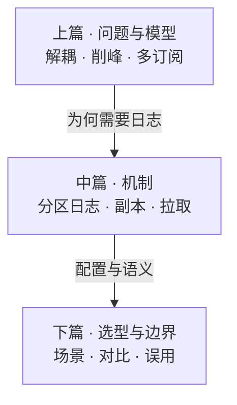
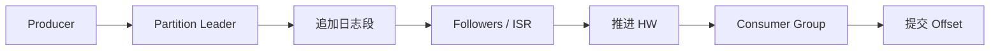

# Kafka：分布式事件日志解决什么问题

> Kafka 常被叫作消息队列，更准确的定位是**分布式事件流平台 / 可回放的提交日志（commit log）**。生产者追加写入，消费者按偏移量拉取；同一份事件可被多个下游独立消费。Jay Kreps 后来把这一抽象概括为：日志是实时数据集成的统一底座——有序、可多订阅、写入与读取速度可以解耦。[^kreps-log]
>
> 本文按一条因果链展开：**它解决什么 → 与传统队列差在哪 → 解耦与削峰如何成立 → 核心概念 → 消息路径与吞吐机制 → 场景、选型与边界**。可与 [21](./21-service-architecture-evolution.md)（服务拆分后的集成压力）、[28](./28-http-rpc-microservice-communication-treatise.md)（同步调用慢在哪）、[22](./22-distributed-consistency-treatise.md)（跨节点一致性代价）对照：彼处谈同步 RPC 与共识，此处谈**异步事件主干**。

先给一个直接答案：

> **Kafka 解决的是海量实时事件在多服务之间的传输、缓冲与多路分发——不是替下游完成业务。** 它把消息持久化为分区追加日志：上游快速写入「发生了什么」，下游按各自进度与能力消费；同一 Topic 可被多个消费组独立订阅，也可在保留窗口内按 Offset 回放。因此注册、下单一类主流程不必同步等待短信、邮件、积分或数仓；高峰流量可先落入日志，再被慢慢消化。它**不是**用完即丢的邮箱，也**不是**数据库或同步 RPC。分区内有序、分区之间不保证全局有序；端到端默认更接近**至少一次**，正确性依赖副本配置、提交策略与下游幂等。

**20-architecture 位置：** [28](./28-http-rpc-microservice-communication-treatise.md) 写同步服务间调用；本文写拆分之后常见的**异步事件中枢**。起源与早期日志模型见 Kreps、Narkhede、Rao 的 NetDB’11 论文；生产管道动机见 Goodhope 等 2012 年 IEEE Data Engineering Bulletin；运维与副本语义以当前 Apache Kafka 文档为准。[^kafka-netdb][^linkedin-pipeline]

## 摘要

Apache Kafka 起源于 LinkedIn（约 2009–2011），为高吞吐活动流与多订阅者而设计：2011 年初开源，2012 年 10 月自 Apache 孵化器毕业为顶级项目。[^kafka-hist] 设计核心是**分区、持久化的提交日志**：Producer 追加写入 Topic 的 Partition；Consumer 以 Offset 记录进度并用拉取模型消费；删除由保留时间、体积或压缩策略决定，而非「确认即从队列移除」。NetDB’11 强调的非常规选择包括：**Broker 侧尽量无消费状态**、顺序写盘与页缓存、`sendfile` 零拷贝、拉取而非推送——这些仍是今日吞吐叙事的根基；内建多副本复制是后续版本补上的生产能力，不宜把「有 ISR」写回 2011 年那篇论文。[^kafka-netdb]

相对传统消息队列（如 RabbitMQ 一类以任务分发与路由为中心的模型），Kafka 更强调多消费组独立读取、可回放与海量顺序写入。它主要覆盖三类问题：**异步解耦**、**削峰填谷**、**数据管道（一份事件、多次使用）**。耐久与可见性由副本、ISR 与高水位（HW）共同约束；投递语义上，幂等生产者与事务可加强路径，端到端无重复仍依赖业务键幂等。[^eos][^acks] 元数据平面历史上依赖 ZooKeeper；Kafka 3.3 起 KRaft 对新集群生产就绪，**4.0 起已移除 ZooKeeper 模式**。[^kraft] 正文仍以客户端可见的日志模型为主，不展开控制器迁移手册。

**关键词：** Apache Kafka；事件流；提交日志；Topic；Partition；Offset；Consumer Group；ISR；高水位；削峰；至少一次；KRaft

---

## 目录

- [摘要](#摘要)

**上篇 · 问题与模型**

1. [读法与术语](#1-读法与术语)
2. [它到底解决什么问题](#2-它到底解决什么问题)
3. [与传统消息队列的模型差异](#3-与传统消息队列的模型差异)
4. [没有事件日志时：同步链路为何又慢又脆](#4-没有事件日志时同步链路为何又慢又脆)

**中篇 · 机制如何成立**

5. [异步解耦如何成立](#5-异步解耦如何成立)
6. [削峰填谷如何成立](#6-削峰填谷如何成立)
7. [六个核心概念](#7-六个核心概念)
8. [一条消息如何走完](#8-一条消息如何走完)
9. [为何吞吐可以很高](#9-为何吞吐可以很高)

**下篇 · 选型与边界**

10. [典型业务场景](#10-典型业务场景)
11. [Kafka、RabbitMQ、Redis 与同步 RPC 如何选](#11-kafkarabbitmqredis-与同步-rpc-如何选)
12. [限制与常见误用](#12-限制与常见误用)
13. [收束](#13-收束)
14. [参考文献](#14-参考文献)

全文只钉一句：先分清「日志模型」与「队列模型」，再谈是否该上 Kafka。



---

## 1. 读法与术语

### 1.1 术语对照

| 术语 | 一句话 |
| ---- | ------ |
| **Topic** | 事件的逻辑分类；生产者写入、消费者订阅的命名通道。 |
| **Partition** | Topic 内的有序追加日志分片；并行与顺序的基本单位。 |
| **Offset** | 分区内消息的单调位置编号；消费者用它记录读到哪里。 |
| **Producer** | 向 Topic 追加消息的客户端。 |
| **Consumer / Consumer Group** | 拉取消息的客户端；组内分担分区，组间可独立重读同一数据。 |
| **Broker** | 存储分区日志并服务读写的集群节点。 |
| **Leader / Follower / ISR** | 分区副本角色；Leader 处理读写，Follower 同步；ISR 为跟上进度的副本集合。 |
| **LEO / HW** | Log End Offset 为副本本地「下一写入位置」；High Watermark 为已复制到当前 ISR 的最高偏移。消费者通常只能读到 HW，HW 与 LEO 之间的数据对消费方尚不可见。[^kafka-repl] |
| **acks** | 生产者认为「写入成功」前须等待的确认级别（如 leader 本地 / 全部 ISR）。 |
| **Consumer Lag** | 分区高水位与消费者已提交 Offset 之差；衡量积压。 |
| **保留策略（retention）** | 按时间、体积删除旧段，或按 key **压缩（compaction）** 只保留最新值；与「消费确认」解耦。[^compaction] |

### 1.2 边界

1. **本文写日志模型与选型判断，不是运维手册。** 具体版本的默认配置、监控面板与调参以官方文档为准。  
2. **不把 RabbitMQ / Redis 写成「不能持久化」。** 差异首先在抽象与默认消费语义，其次才是实现细节。  
3. **不把「恰好一次」当成默认业务保证。** 幂等生产者（Kafka 3.0 起默认开启，且默认 `acks=all`）与事务可在支持路径上加强投递语义；端到端无重复仍依赖生产—消费协作与业务键幂等。[^eos]  
4. **隐喻有限。** 「物流中心」帮助建立边界；不替代副本、提交与 Lag 的工程指标。  
5. **小流量、单下游、必须同步拿到结果时，不要默认上 Kafka。**

---

## 2. 它到底解决什么问题

Kafka 要回答的工程问题可以压成一句：**如何在多服务之间，以高吞吐、可缓冲、可多路订阅的方式传递「已发生之事」，且不必让上游同步等待每个下游完成业务。**

职责边界因此清晰：Producer 写入事件，Consumer 按进度拉取；Broker 集群负责追加、复制与按 Offset 提供读取，**不负责**短信是否发出、积分是否入账。下游变慢、重启或短时故障时，只要保留策略与集群健康允许，事件仍可留在日志中，而不必立刻拖死上游写入路径。

问题起源上，LinkedIn 面对的是活动流与日志体量远超业务表、且须同时供给在线与离线多种消费者；传统企业消息中间件与「刮日志再批处理」难以兼顾高吞吐、低延迟与多订阅。[^kafka-netdb] Goodhope 等 2012 年公开的生产量级（当时口径）是：日写入超过 100 亿条、峰值超过 17.2 万条/秒、向数十个订阅系统日投递超过 550 亿条——数字会随时代变化，但动机未变：**一份活动流，同时喂在线特征与离线分析**。[^linkedin-pipeline] 今日许多后端仍把它（或兼容实现）当作事件中枢。

Kreps 在 *The Log* 中把这层抽象抬到组织级：把组织数据放进可实时订阅的中心日志，各系统按自己的 Offset 前进——Kafka 是这一思想在工程上最成功的落地之一。[^kreps-log]

> **Kafka 不是用完即丢的邮箱，而是一条高吞吐、可持久化、可回放的分布式提交日志。**

**所以 · 边界在哪：** 它解决传输、缓冲与多路分发；不解决业务正确性本身。

---

## 3. 与传统消息队列的模型差异

与传统消息队列最大的差异，**不是**「一个只在内存、一个只在磁盘」——RabbitMQ、ActiveMQ 等同样可以持久化——而是：**消费之后，这条数据在系统里还意味着什么。**

| 维度 | 传统消息队列（典型） | Kafka（典型） |
| ---- | -------------------- | ------------- |
| **存储模型** | 队列；确认处理后通常移除 | 追加日志；按保留期 / 容量 / 压缩删除 |
| **消费状态** | 常由 Broker 跟踪「谁拿走了」 | 消费进度由客户端（组协调器）以 Offset 维护；Broker 更偏「无订阅者状态的日志」 |
| **消费方式** | 一条消息常由一个消费者取走 | 多个消费组可独立读取同一份数据 |
| **回放** | 一般不作为数据回放系统设计 | 保留窗口内可按 Offset 重放 |
| **典型目标** | 任务分发、复杂路由、请求—应答风格 | 事件管道、日志采集、削峰、多订阅 |
| **顺序** | 视队列与路由而定 | **分区内有序**；分区之间不保证全局有序 |
| **吞吐侧重** | 中等吞吐，强调灵活路由与协议 | 海量顺序写入与批量拉取 |

NetDB’11 对当时企业消息系统的批评至今仍有参考价值：过重的投递保证与协议、弱批量 API、弱分区扩展、以及「假设消息很快被消费完」——当离线消费者需要堆积数小时乃至数天数据时，性能会塌。Kafka 用**时间/容量 SLA 决定删除**，换来多订阅与回放。[^kafka-netdb]

因此 Kafka 特别适合做**数据管道**：一份订单事件可同时供给库存、通知、实时计算与数仓，而不要求上游分别同步调用这些系统。若核心需求是复杂路由、优先级队列或协议族齐全的传统消息总线，RabbitMQ 一类往往更贴手。

**所以 · 边界在哪：** 先问「要不要多订阅与回放」，再问「要不要上 Kafka」。

---

## 4. 没有事件日志时：同步链路为何又慢又脆

典型反例：用户注册后，接口同步调用发短信、发邮件、送积分。注册变慢；任一下游卡住，整条链路可能失败——即便账号其实已创建成功。

同步副作用链路放大三类问题：

1. **延迟叠加：** 总耗时接近最慢下游。  
2. **故障传播：** 邮件超时被表述成「注册失败」，体验与真实状态不一致。  
3. **扩展困难：** 再加发券、同步 CRM，注册服务继续增加依赖与失败点。

同步调用适合必须立刻拿到结果的路径（校验验证码、检查用户名是否占用）。它不适合可以稍后完成、失败后可重试的副作用。这与 [28](./28-http-rpc-microservice-communication-treatise.md) 的提醒同向：同步链路的瓶颈常在最慢一环；事件日志把「可异步的部分」移出关键路径。

**所以 · 边界在哪：** 没有 Kafka 时系统也会工作；脆的是「把副作用焊进同步请求」。

---

## 5. 异步解耦如何成立

引入 Kafka 后，注册服务的职责收窄为：把「用户已注册」事件**可靠写入** Topic，然后尽快返回。短信、邮件、积分等下游各自订阅并异步处理。

| 角色 | 保证什么 |
| ---- | -------- |
| **上游** | 在约定的 acks / 重试策略下，事件已写入 Kafka |
| **下游** | 按自身能力消费；失败可重试、告警、补偿 |
| **新增订阅方** | 通常新开消费组订阅同一 Topic，不必改注册主流程 |
| **短暂故障的下游** | 消息可按保留策略暂留；恢复后继续消化 |

代价必须写明：用户点击注册后，短信未必「同一毫秒」到达；系统接受**最终一致**，并为重复投递、乱序与毒消息准备幂等、死信与人工补偿。解耦的是控制流与失败域，不是业务规则本身。

**所以 · 边界在哪：** 上游只保证事件入日志；用户可感知的完成，以下游为准。

---

## 6. 削峰填谷如何成立

促销高峰时，每秒订单可能远超数据库或库存链路的瞬时能力。请求先写入 Kafka，下游按处理能力消费，瞬时尖峰变成可观测的积压。

削峰成立依赖三个前提：

1. **写入路径足够快：** 分区追加与批量发送适合承接短时高于下游的写入。  
2. **积压可被消化：** 高峰后消费者吞吐与分区并行度必须跟得上，否则只是延后崩溃（磁盘与恢复时间一并恶化）。  
3. **业务允许延迟：** 入口可快速确认「事件已接收」；扣库存、加积分、出报表可以滞后。

因此 Kafka **不会让下游凭空变快**；它把不可管理的过载，变成可管理的 **Consumer Lag**。生产上，「Kafka 进程还在」远不如「Lag 是否在 SLO 内」重要。

**所以 · 边界在哪：** 削峰是缓冲，不是无限队列；要配套消费扩容与积压告警。

---

## 7. 六个核心概念

六个词分别回答：如何分类、如何并行、谁来写、谁来读、数据放在哪、读到了哪里。

### 7.1 Topic

Topic 是消息的逻辑分类容器。例如「订单事件」与「用户行为」通常分开。Topic 用于组织与隔离，不宜无限细分：过粗则不相关消费者挤在一起，权限与容量难管；过细则主题爆炸，监控与运维成本上升。实践上常按「一类可被多个下游共享的事件」切分，而不是为每个微服务建私有队列。

清理策略上，默认多为按时间/体积 **delete**；`cleanup.policy=compact` 则按 key 保留最新值（changelog / 状态镜像场景），null value 可作为墓碑（tombstone）。压缩是异步的，不保证日志中「同一时刻只有一条某 key」；它也不是通用查询引擎。[^compaction]

### 7.2 Partition

Topic 可拆成多个 Partition。每个分区内部按追加顺序排列，故**分区内有序**；分区间相互独立，可分布到不同 Broker 并行读写。

必须记住的限制：

1. **不保证全局顺序。** 跨分区消息无统一先后。  
2. **保序靠 key。** 同一用户 / 同一订单若必须保序，通常以稳定 key（如 `userId`）路由到同一分区。  
3. **并行度受分区数约束。** 同一消费组内，有效并行消费者数通常不超过分区数；多于分区的实例会空转。

### 7.3 Producer 与 Consumer Group

Producer 负责写入：可指定 key（影响分区路由），也可不指定 key 以打散负载（具体分配器随客户端与配置而变）。Kafka 3.0 起，在无冲突配置时默认开启幂等，并将默认 `acks` 调整为 `all`（KIP-679）——这加强的是**同会话重试不重复写入**，不是业务级恰好处理一次。[^eos]

Consumer 以拉取方式读取。多个消费者组成 **Consumer Group**：

- **组内：** 一个分区在同一时刻通常只分配给一个消费者，避免组内重复处理。  
- **组间：** 不同消费组可各自读取同一份数据，互不影响。

这把「负载分担」与「多次订阅」分开了：库存服务的多个实例应属**同一组**，共同消化分区；通知与分析应属**不同组**，以便各自完整看到订单流。扩容消费能力时，往往要同时评估**增加分区**与**增加消费者**。

组成员变更会触发**再均衡（rebalance）**。经典 eager 协议会「停世界」式回收分区；增量协作协议（KIP-429，如 cooperative-sticky）尽量只移动需要移交的分区，缩短停顿，但仍可能带来短时重复或停顿——处理超时与会话超时配置不当会放大抖动。[^rebalance]

### 7.4 Broker、副本与 Offset

Broker 是存储与服务节点，多个 Broker 组成集群。每个分区通常有多副本：Leader 处理读写，Follower 同步；Leader 故障时优先在 ISR 内选举。`unclean.leader.election.enable=false`（常见生产默认）宁可分区短暂不可用，也不让落后副本上位造成已确认数据丢失。[^kafka-repl]

耐久与可见性可记三层，不必一次吞完整白皮书：

| 概念 | 含义（工程口径） |
| ---- | ---------------- |
| **ISR** | 与 Leader 足够同步的副本集合；落后过久会踢出。 |
| **LEO** | 某副本本地日志末端（下一写入 offset）。 |
| **HW** | 已进入当前 ISR 的最高 offset；**消费可见上界通常是 HW**，不是 Leader 的 LEO。 |

`acks=all` 且 `min.insync.replicas` 足够时，生产者确认更接近「已进入足够多副本」；`acks=1` 只等 Leader 本地写入，Leader 在复制完成前宕机仍可能丢。配置组合常记：`replication.factor=3`、`min.insync.replicas=2`、`acks=all`、关闭 unclean election——以吞吐换单机故障下的耐久。[^acks]

Offset 是分区内位置编号。消费者提交 Offset 以记录进度——处理成功后再提交，可减少漏处理；提交过早，崩溃后可能跳过未完成工作。无论自动还是手动提交，端到端讨论里更常见的工程假设是**至少一次**：重复消费靠下游幂等消化。[^eos]

元数据与控制器：长期依赖 ZooKeeper；KRaft 将元数据置于 Kafka 自身的法定人数日志。KIP-833 将 KRaft 标为新集群生产就绪（3.3）；**Kafka 4.0 起 ZooKeeper 模式已移除**，存量 ZK 集群须经桥接版本（如 3.x 末段）迁移后再升 4.x。[^kraft] 对应用开发者而言，Topic / Partition / Offset 模型不变。

**所以 · 边界在哪：** 六个词够用；ISR / HW 解释「为何确认了仍可能读不到或丢失」；细节配置服务于这些词，而不是相反。

---

## 8. 一条消息如何走完

教学路径可收成五步：

```text
Producer → 选 Partition → Leader 追加日志 → 副本同步（视 acks）→ Consumer 拉取至 HW 并提交 Offset
```

1. **生产：** 应用指定 Topic，附带 key / value（及可选头）。  
2. **选分区：** 有 key 则按约定路由；无 key 则分散负载。  
3. **Leader 追加：** 顺序写入磁盘上的日志段（log segment）；Leader LEO 前进。  
4. **副本同步：** Follower 拉取复制；ISR 跟上后 HW 前进。`acks=all`（或 `-1`）时，通常须等 ISR 内足够副本确认，并与 `min.insync.replicas` 共同决定耐丢窗口。[^acks]  
5. **消费与提交：** 消费者批量拉取（可见上界为 HW）、处理业务、提交 Offset；下次从新位置继续。

两个常被忽略的点：

1. **拉取模型：** 消费者按自己的节奏取数，Broker 不强行把处理速度焊死在下游最慢实例上——这是 NetDB’11 相对当时推送型日志聚合器的明确取舍。[^kafka-netdb]  
2. **「写入成功」≠「业务完成」。** 生产者 ack、HW 可见、下游持久化是三道不同的关；要看 Lag、重试与下游结果。



**所以 · 边界在哪：** 能跟上这五步，就够读懂多数「消息丢了 / 重复了 / 积压了」的讨论。

---

## 9. 为何吞吐可以很高

高吞吐主要来自减少磁盘、内存与网络上的多余开销，而不是「堆机器就自动快」。NetDB’11 与后续工程叙述强调的路径包括：[^kafka-netdb]

1. **顺序写磁盘：** 分区日志追加写入，利于顺序 I/O 与操作系统页缓存；Broker 不维护按消息 ID 的随机索引，而以 Offset 寻址段文件。  
2. **零拷贝传输：** Broker 向消费者发送已在页缓存中的数据时，可走 `sendfile` 一类路径，减少内核态 / 用户态之间的多余拷贝。  
3. **批量发送与拉取：** 摊薄协议头、系统调用与网络往返。  
4. **Broker 少管消费状态：** 进度在客户端一侧，Broker 专注追加与按 Offset 读——复杂度从中心节点挪开，换来堆积时仍可线性扩展的读路径。[^kafka-netdb]

这些优化有使用条件：消息过小且不批量，网络开销会重新变大；同步等待过严的确认、过重压缩、或消费者逐条处理超大报文，都会把吞吐打回去。Kafka「快」，是因为默认路径按**追加日志 + 批量传输**设计，不是任意配置都能跑满磁盘。

**所以 · 边界在哪：** 吞吐是设计结果；配置可以轻易把它关掉。

---

## 10. 典型业务场景

高频场景可收成四类——共同点是：**一份事件，多次使用；写入与读取速度可以不同步。**

| 场景 | 在做什么 |
| ---- | -------- |
| **行为 / 日志采集** | 点击、曝光、搜索等事件入管道；大屏、特征与离线分析按各自窗口消费 |
| **业务解耦** | 下单、支付、库存、物流、通知订阅同一订单 Topic；新增下游少改主流程 |
| **流计算输入** | 作为 Flink / Spark Streaming / Kafka Streams 等的源；作业失败可从检查点对应 Offset 重读 |
| **变更分发（CDC）** | 库表变更写入 Kafka，再更新缓存、搜索索引或数仓；压缩 Topic 可承载 changelog |

若两个服务偶尔传递一条**必须立刻得到结果**的请求，HTTP / RPC 通常更简单——见 [28](./28-http-rpc-microservice-communication-treatise.md)。

**所以 · 边界在哪：** 场景对了，运维成本才盖得住；场景不对，Kafka 是更重的耦合。

---

## 11. Kafka、RabbitMQ、Redis 与同步 RPC 如何选

| 维度 | Kafka | RabbitMQ（代表） | Redis Stream / 轻量队列 | 同步 HTTP / RPC |
| ---- | ----- | ---------------- | ----------------------- | --------------- |
| **核心模型** | 持久化事件日志 | 队列与交换机路由 | 内存中的流或列表 | 请求立刻等待响应 |
| **多订阅** | 多消费组天然 | 需绑定 / 复制等设计 | 可做消费组，容量受内存等约束 | 调用方显式通知每个下游 |
| **回放** | 保留期内按 Offset | 通常不作为回放系统 | 有限，受长度与内存影响 | 不支持 |
| **更适合** | 日志、事件总线、削峰、管道 | 任务分发、复杂路由 | 已有 Redis、流量不大的异步 | 必须同步拿到结果 |

实用判断：

1. **多个下游独立消费同一份事件** → 优先考虑 Kafka。  
2. **复杂路由、优先级、传统消息协议** → RabbitMQ 往往更顺手。  
3. **轻量异步且已有 Redis** → Redis Stream 可能足够。  
4. **必须成功或失败立刻返回** → 不要把 Kafka 塞进该链路。

**所以 · 边界在哪：** 选型看数据量、多订阅、回放与运维负担，不看名字是否流行。

---

## 12. 限制与常见误用

1. **不是数据库。** 保留期后消息会删；也不提供按任意字段查询。长期事实应落库、数仓或对象存储。压缩 Topic 保留的是「每 key 最新值」，仍不是通用存储。  
2. **不是同步 RPC。** 「查余额」「提交支付」等必须马上给用户结果的请求，丢进 Kafka 只会增加延迟与不确定性。  
3. **分区内有序 ≠ 全局有序。** key 缺失或设计错误时，同一对象事件可能乱序。  
4. **默认工程假设常是至少一次。** 处理前崩溃可能导致重复；下游按业务键幂等。幂等生产者消除的是**同会话重试重复**；事务 + `isolation.level=read_committed` 覆盖另一类路径；业务恰好一次仍要自己设计。[^eos]  
5. **积压推迟问题，不消灭问题。** 只扩 Broker 不提消费能力，磁盘与恢复时间一起恶化。  
6. **再均衡会打断消费。** 成员变更或分区变化时组内重分配；eager 协议停顿更明显，协作协议减轻但不消失。处理时间过长触发会话超时，会制造反复再均衡。[^rebalance]  
7. **消息体不是网盘。** 大文件放对象存储，Kafka 传引用；单条宜保持较小体积（常见实践为数百 KB 量级以内，具体受 `message.max.bytes` 等约束）。  
8. **acks、ISR 与 unclean election 决定丢失窗口。** `acks=1` 时 Leader 本地写入即可返回，在复制完成前宕机可能丢数据；更严确认与更高 `min.insync.replicas` 以吞吐换耐久。[^acks]  
9. **Schema 不管会写乱管道。** 字段随意变更会拖垮所有下游；需兼容规则或 Schema Registry 一类机制。  
10. **安全与隐私单独设计。** ACL、网络隔离、TLS，以及手机号等敏感字段是否应出现在明文事件里。

**所以 · 边界在哪：** Kafka 缓冲流量、解耦系统；业务正确性仍在你这边。

---

## 13. 收束

```text
  要解决的问题
       │
       ├─ 异步解耦：上游写事件，下游各消费
       ├─ 削峰填谷：尖峰变可控 Lag
       └─ 数据管道：一份事件，多次使用
       │
       ▼
  日志模型：Topic / Partition / Offset
       │         （副本 · ISR · HW）
       ▼
  不是：数据库 · 同步 RPC · 「接上就更快」
```

用三条主线收束：

1. **解决什么：** 上游快速写下事件，下游按自己的速度处理；多系统共享同一事件流；高峰先入日志再被消化。  
2. **六个词：** Topic 分类，Partition 并行，Producer 写入，Consumer 读取，Broker 存储与副本，Offset 进度——ISR / HW 解释耐久与可见上界。  
3. **不是什么：** 不是数据库，不是同步接口，也不是接上就一定更快的开关。顺序在分区内成立；正确性依赖副本、提交与幂等。

要点备查：

| # | 命题 |
|:-:|------|
| 1 | **定位：** 分布式事件流 / 提交日志；可当消息系统用，但不等于「取走即删」队列。 |
| 2 | **文献：** NetDB’11 定日志模型；2012 Bulletin 写生产管道；*The Log* 抬到数据集成抽象。 |
| 3 | **三类问题：** 异步解耦、削峰填谷、多订阅数据管道。 |
| 4 | **模型差：** 消费移动 Offset；删除由保留策略决定；多消费组可重读。 |
| 5 | **顺序：** 分区内有序；跨分区不保证；保序靠稳定 key。 |
| 6 | **路径：** 追加 → 复制（视 acks）→ HW 可见 → 拉取 → 提交 Offset。 |
| 7 | **吞吐：** 顺序写、页缓存 / 零拷贝、批量、Broker 少状态；配置可毁掉优势。 |
| 8 | **选型：** 多订阅与回放偏 Kafka；复杂路由偏 RabbitMQ；轻量异步可 Redis；同步结果走 RPC。 |
| 9 | **误用：** 当数据库、当同步接口、忽略 Lag / 幂等 / Schema / 再均衡 / unclean election。 |

在现代数据架构里，Kafka 一类系统充当**事件主干**：服务拆开之后，系统需要能缓冲、能分发、能回放的共享日志。理解这套模型，比记住产品名更重要。

---

## 14. 参考文献

[^kafka-netdb]: Jay Kreps, Neha Narkhede, Jun Rao, *Kafka: a Distributed Messaging System for Log Processing*, NetDB’11（6th International Workshop on Networking Meets Databases）, Athens, June 12, 2011. PDF（社区常用镜像）：https://people.csail.mit.edu/matei/courses/2015/6.S897/readings/kafka.pdf 。阐述面向高吞吐日志 / 活动流的发布—订阅设计：分区日志、Offset、拉取消费、顺序 I/O、页缓存、`sendfile`、Broker 少状态与时间保留；并与当时企业消息系统及 Scribe / Flume 等日志聚合器对照。**注意：该文描述的早期 Kafka 尚无今日意义上的内建多副本复制。**

[^linkedin-pipeline]: Ken Goodhope, Joel Koshy, Jay Kreps, Neha Narkhede, Richard Park, Jun Rao, Victor Yang Ye, *Building LinkedIn’s Real-time Activity Data Pipeline*, IEEE Data Engineering Bulletin, Vol. 35, No. 2, June 2012, pp. 33–45. http://sites.computer.org/debull/A12june/pipeline.pdf 。从批式文件汇聚转向实时 pub/sub 的动机、误区与当时生产量级（文中：日写入 >10B、峰值 >172k msg/s、日投递 >55B 等；今日规模以各公司公开材料为准）。

[^kreps-log]: Jay Kreps, *The Log: What every software engineer should know about real-time data’s unifying abstraction*, LinkedIn Engineering, 2013. https://www.linkedin.com/blog/engineering/distributed-systems/log-what-every-software-engineer-should-know-about-real-time-datas-unifying 。把「提交日志」提升为数据集成、流处理与分布式复制的统一抽象；是理解 Kafka 产品形态背后思想的必读长文。

[^kafka-hist]: Apache 孵化器提案与项目史：Kafka 于 LinkedIn 开发（约 2009 年起），2011 年初开源，2012 年 10 月 23 日自孵化器毕业为 Apache 顶级项目。命名由来见 Narkhede 等 *Kafka: The Definitive Guide* 中对 Jay Kreps 的引述（系统面向写优化，故取作家之名）。

[^kafka-repl]: Apache Kafka 文档：副本、Leader / Follower、ISR、高水位（HW）与 Log End Offset（LEO）。消费者可读上界通常为 HW；分区可用性与数据耐久取决于副本数、同步集合与 `unclean.leader.election.enable` 等配置。官方入口：https://kafka.apache.org/documentation/#replication 。

[^acks]: 生产者 `acks`（`0` / `1` / `all`）与 `min.insync.replicas`：共同决定「写入成功」的耐久含义。`acks=all` 且 ISR 不足时，生产者可能收到错误而非静默丢数据——具体行为以所使用版本文档为准。耐久组合常见讨论：`replication.factor≥3`、`min.insync.replicas=2`、`acks=all`、关闭 unclean leader election。

[^eos]: 投递语义见 Apache / Confluent 文档对 at-least-once、idempotent producer、transactional producer 的区分。幂等生产者自 0.11 引入；KIP-679 起 Kafka 3.0 默认 `enable.idempotence=true` 且默认 `acks=all`（无冲突配置时），主要消除**同会话重试**导致的重复写入。事务与 `isolation.level=read_committed` 可进一步支持跨分区原子写入与 Streams 类路径上的更强语义。端到端「业务恰好处理一次」仍依赖消费者 Offset 提交时机、去重键与失败补偿，不能理解为「打开开关即业务无重复」。KIP-679：https://cwiki.apache.org/confluence/display/KAFKA/KIP-679 。

[^kraft]: KIP-500：以 KRaft 取代 ZooKeeper 管理元数据；KIP-833 将 KRaft 标为新集群生产就绪（Kafka 3.3）；ZooKeeper 模式在 3.5 起弃用路径上推进，并在 **Apache Kafka 4.0** 移除。存量 ZK 集群须先经桥接发行版迁移到 KRaft 再升 4.x。客户端读写模型不因控制器实现而改变。KIP-833：https://cwiki.apache.org/confluence/display/KAFKA/KIP-833 ；4.0 公告：https://kafka.apache.org/blog/2025/03/18/apache-kafka-4.0.0-release-announcement/ 。

[^compaction]: Apache Kafka Topic 配置：`cleanup.policy`（`delete` / `compact` / 二者兼有）、墓碑与 `delete.retention.ms`。压缩保留每 key 最新值，异步执行，不替代数据库查询。https://kafka.apache.org/documentation/#topicconfigs 。

[^rebalance]: KIP-429：增量 / 协作式再均衡协议；`cooperative-sticky` 等分配器尽量避免「停世界」式回收全部分区。再均衡仍可能造成短时停顿或重复消费，需与 `max.poll.interval.ms`、会话超时等一并设计。https://cwiki.apache.org/confluence/display/KAFKA/KIP-429 。

**声明：** 正文是事件日志模型与选型判断的教学整理，不是某一发行版的配置清单，也不构成容量规划。版本默认值、安全与云托管差异很大；冲突时以 Apache Kafka 官方文档、集群实测与你们的 SLO 为准。
