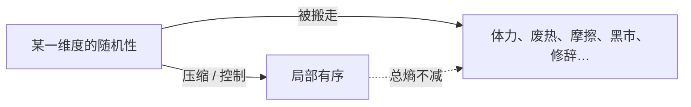
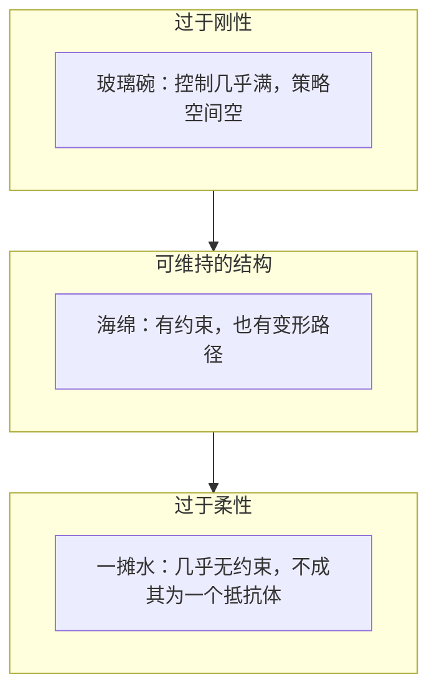

# 熵与复杂系统：控制是搬运，有序是局部现象

> 孤立系统里，熵只增不减。我们每天却生活在树、城市、技术与文明一层层堆起来的世界里。两件事同时成立，只因为「有序」从来不是总熵下降，而是**局部被控制住的维度**。每一次让事情更整齐，都是把混乱搬到别处。
>
> 本文用「熵」一条线索，把收拾房间、空调、制度、产品、进化与诊断收成同一套分析框架。写给普通读者。可与 [21 服务架构演进](../20-architecture/21-service-architecture-evolution.md) 对照：彼处是复杂度在架构代际间转移，此处是同一原理在任意系统上的一般说法。

先给一个直接答案：

> **控制不是消灭混乱，是搬运熵：压平一个维度，别的维度就会鼓起来。好系统不是控制最多的那个，而是刚柔落在对的维度上、进化引擎还在转的那个。诊断只问三句：控制落在哪、谁在接熵、熵接着会流向哪。**

**40-paradigm 系列导读：** [40](./40-unix-agent-stateless-philosophy.md) 工具如何自处，[41](./41-ai-engineering-paradigm.md) 组织如何承接提效，[42](./42-agentic-sre-operations-playbook.md) 运维如何压缩可验证的恢复时间。三篇是智的优术。本文是横切的分析镜片：任何复杂系统——房间、空调、团队、市场、国家——都可以用熵、搬运、散热与进化来读。

## 摘要

热力学第二定律说：孤立系统的熵只增不减。日常却看见树、城市与技术越来越有序。本文用「熵」一条线索说明：控制是搬运而非消灭；反脆弱不是把更多维度拧死，而是判断哪些维该刚、哪些维该柔；进化是新约束催生新组合、再逼出更新约束的正反馈。有序是局部现象。诊断只问三句：控制落在哪、谁在接熵、熵接着流去哪。

**关键词：** 熵；控制；压缩映射；散热；反脆弱；进化

---

## 目录

- [摘要](#摘要)
1. [开篇：越来越乱，与越来越有序](#1-开篇越来越乱与越来越有序)
2. [熵：可能性的多寡](#2-熵可能性的多寡)
3. [控制是搬运](#3-控制是搬运)
    - [3.1 收拾房间的时候，你在做什么？](#31-收拾房间的时候你在做什么)
    - [3.2 空调的真相](#32-空调的真相)
    - [3.3 压缩一个维度，别的维度就会膨胀](#33-压缩一个维度别的维度就会膨胀)
    - [3.4 所以你没办法控制一切](#34-所以你没办法控制一切)
4. [散热：隐形天花板](#4-散热隐形天花板)
    - [4.1 回头看收拾房间](#41-回头看收拾房间)
5. [刚性、柔性与反脆弱](#5-刚性柔性与反脆弱)
    - [5.1 一个碗和一块海绵](#51-一个碗和一块海绵)
    - [5.2 刚性，柔性，和中间的平衡](#52-刚性柔性和中间的平衡)
    - [5.3 生物界的玻璃碗](#53-生物界的玻璃碗)
6. [控制落在错误的维度上](#6-控制落在错误的维度上)
    - [6.1 为什么我们反复掉进同一个坑](#61-为什么我们反复掉进同一个坑)
    - [6.2 真正的诊断](#62-真正的诊断)
7. [进化：新约束到新组合](#7-进化新约束到新组合)
    - [7.1 怎样的系统才是好系统（活得更久）？](#71-怎样的系统才是好系统活得更久)
    - [7.2 进化到底是怎么运作的](#72-进化到底是怎么运作的)
    - [7.3 进化本身是一个系统](#73-进化本身是一个系统)
    - [7.4 回答开头的问题](#74-回答开头的问题)
    - [7.5 生命——以熵为食](#75-生命以熵为食)
8. [戴上这副眼镜](#8-戴上这副眼镜)
    - [8.1 什么让一个集体活着？](#81-什么让一个集体活着)
    - [8.2 效率不是唯一的尺子](#82-效率不是唯一的尺子)
    - [8.3 制度设计的盲区](#83-制度设计的盲区)
9. [三问：怎么用](#9-三问怎么用)
    - [9.1 三句话](#91-三句话)
    - [9.2 从系统视角出发](#92-从系统视角出发)
10. [结语](#10-结语)
11. [参考文献](#11-参考文献)

---

## 1. 开篇：越来越乱，与越来越有序

> **本节要点：** 一个说越来越乱，一个说越来越有序。漏掉的是对「有序」的理解。

热力学第二定律讲了一个基本原理：在孤立系统中，熵只会增加，不会减少。一切都在不可逆转地滑向混乱。[^clausius]

但这不可能是故事的全部。还有另一件事同样确定：我们每天生活在一个越来越有序的世界里。树在生长，城市在扩张，技术在迭代，文明一层一层向上堆叠。看不到任何「正在均匀地热寂化」的迹象。

一个说越来越乱，一个说越来越有序。这两件事不可能同时成立，除非我们对「有序」的理解从一开始就漏掉了什么。

那就从头说起。

---

## 2. 熵：可能性的多寡

> **本节要点：** 乱不是脏，是可能性太多。熵衡量的就是这种多寡。

一间没收拾的房间。书摊在沙发上，杯子放在地上，充电线缠成一团。这个房间可以有多少种状态？近乎无限多：每一本书可以出现在任何位置，杯子可以倒向任何一个角落，充电线可以以任何方式缠绕。

这就是「乱」。乱不是脏，不是难看，是可能性太多。一个房间如果只有一种排布方式对应「整洁」，却有上百万种对应「乱」，那么在没有任何外力干预的时候，它会天然滑向可能性最大的方向，就像山坡上的球滚向谷底。

物理学有一个专门衡量「可能性多寡」的概念，叫「熵」。一个系统可以处于的不同状态越多，它的熵就越大。空气分子均匀散布在房间各个角落，每个分子都可能在任何位置，这是高熵。一盒积木拼成了城堡，能对应「城堡」这个形状的排列方式只有少数几种，这是低熵。[^boltzmann]

热力学第二定律的核心是：孤立系统的总熵只增不减。你什么都不干，东西只会越来越乱。这是宇宙最底层的规律，和引力一样基本。

---

## 3. 控制是搬运

> **本节要点：** 控制不是消灭熵，是把一个维度上的随机性搬到别处。

### 3.1 收拾房间的时候，你在做什么？

你现在开始动手收拾房间了。

你拿起书放回书架，杯子归位厨房，充电线缠好放进抽屉。做完之后，房间整洁了，物品位置这个维度上的随机性大幅降低。你完成了「熵减」。热力学定律被打破了吗？

没有。

你消耗了体力。腺苷三磷酸（ATP）在分解，肌肉纤维在微撕裂，你的身体需要更多休息。分子层面的随机性增加了。你制造了一袋垃圾——垃圾袋被运到焚烧厂，碳变成二氧化碳飞进大气层，废物处理链上的混乱在成倍扩散。你占用了本可以做别事的时间，错过了一篇文章、一趟散步、一个电话。时间的其他所有用法，全被「收拾房间」这个决策压扁了。

你不是在消灭混乱。你只是把混乱搬走了。物品位置这个维度的熵，被你搬运到了体力消耗、废物排放和机会成本这几个维度上。

### 3.2 空调的真相

空调的工作原理能让这个道理变得很清楚。

夏天你开空调，房间凉快了。从分子运动的角度看，凉快意味着空气分子的速度降低了，速度分布从宽范围收窄到窄范围。温度这个维度上的随机性下降，熵减。

但室外机在干什么？它正在往外排热。房间里的热量没有凭空蒸发，它被压缩机和制冷剂搬到了室外。你站到外机旁边，能感到一阵扑面而来的热浪。整栋楼，甚至整个街区，因为你这台空调的运转，变得更热了。还不止，压缩机本身做功也会产生额外热量，就像运货的卡车在路上自己也要烧汽油。

控制不是在消灭熵，而是在搬运熵。挤压一个维度上的随机性，它不会消失，只会从别的维度鼓出来。就像捏一只气球：一头瘪下去，另一头就胀起来。

*图 1　控制 = 搬运：压平一个维度，熵从其他维度鼓出。*

### 3.3 压缩一个维度，别的维度就会膨胀

再往深走一层。控制到底是通过什么机制实现的？

你做菜的时候规定自己「只用三样调料」。在调料选择这个维度上，原来你可以从二三十种东西里任意组合，可能性的空间很大。现在只剩下三种，可能性被急剧压缩。这就是施加了一个压缩映射：把一个大的可能集合映射到一个小的可能集合。

压缩成功了，调料维度的熵减少了。但你现在面临一个新问题：只用盐、酱油、醋，怎么把菜做得好吃？

你必须在烹饪方法上琢磨得更细。火候要掐到秒，大了焦，小了生。下锅顺序要精确，先爆香再翻炒和先煮后调味出来的完全不是一个东西。食材本身的新鲜度、切法和搭配开始变成关键变量，原来被调料多样性掩盖的差异全部浮了上来。这些维度的随机性正在膨胀。你做菜的整体复杂度并没有下降，它只是从调料选择的维度扩散到了烹饪技巧的维度。

换一个场景。你规定自己每天只工作三个小时，这是在时间维度上施加了一个压缩映射。为了在更短的时间里完成同样的工作量，你必须在任务优先级排序上下功夫：什么先做什么后做，什么可以不做？必须在工具效率上想办法：有没有能自动化重复步骤的脚本？必须在沟通方式上做文章：怎么写需求才能让对方一遍看懂，不再反复确认？你的工作系统没有因为三个小时的限制而变简单。它只是把原来散落在「时间充裕、可以慢慢来」里的复杂度，挤压到了「怎么在三个小时之内高效运转」这条轴上。

压缩映射有一个不容忽视的后果：总熵不会减少。你把一个维度上的随机性打平了，那些被打压下去的可能性不会凭空消失，它们一定会从别的、你暂时还没控制的维度里泄漏出来。每一次「让事情更有序」的努力，都以「让另一些事情更混乱」为代价。这个道理和热力学第二定律完全一致——自然界没有免费的熵减。

### 3.4 所以你没办法控制一切

到这里应该已经不难理解了，但它还有一个更隐蔽的推论。

每一次控制都在别处制造新的混乱，所以你能控制的维度永远是局部的、有限的。你不可能同时把所有维度全部压平，就像一颗气球——你按一面，另一面就鼓出来；两只手同时按，橡胶本身的张力就会让气球在你没碰到的方向上变形。

这就解释了为什么人类社会从来没有任何一种制度能把「一切管起来」。管了价格，黑市就冒出来，价格维度的熵转移到了渠道维度。管了言论，暗语、讽刺和隐喻就疯狂生长，表达维度的熵转移到了修辞维度。你不可能把所有的漏洞同时堵上，因为你每堵一个漏洞，等于把压力传导到了别的地方。在那些你看不到的、暂时还没出问题的维度上，熵正在无声地堆积。

---

## 4. 散热：隐形天花板

> **本节要点：** 熵只能搬运不能消灭；产生快于释放时，崩溃只是时间问题。

熵只能搬运不能消灭，那每个系统在维持自身有序的过程中，都必须面对释放问题。

回想一下空调：室内熵减的代价是室外和整栋楼的熵增。但空调的精妙之处在于，它有一个室外机。室内的热能被有组织地搬运到了室外，热量有了去处。如果没有室外机，压缩机把热能抽出来却无处可放，整个机器自己就会先烧掉。

任何一个系统都存在同样的逻辑：在关键维度上拼命维持低熵（有序），同时在别的维度上产生大量高熵（混乱）。这些附带产生的熵如果排不出去，就会在系统内部缓慢积累。就像把空调室外机搬进了房间：你把制冷功率开到最大，但外机也在房间里排热，房间里不会凉快一丝一毫。

熵释放不是无限度的。它有两层天花板。

**第一层：不是所有维度都可以当室外机。** 你可以把写字楼的外机挂在楼体外墙上，但你没法把办公室内部积累的沟通混乱也「挂出去」。部门之间的信息不对称、利益冲突、协作摩擦，这些东西没有物理散热口。它们要么通过内部消化——会议、调停、重组，把摩擦产生的熵传导到人员流失、项目延期、士气降低这几个承受力较强的维度；要么就默默堆积，直到某一根稻草压上来。

**第二层：即便是能当室外机的维度，也有散热上限。** 一条河可以排掉正常的降雨量。暴雨大到超过河流容量的时候，水就漫过堤岸。如果系统内部产生的熵太快、太猛，项目压力持续高涨，救火频率爆表，信息流动量超出任何一个人的加工能力，那些排不掉的熵最终会在系统内部积存。熵产生速度大于熵释放速度的时候，崩溃只是时间问题。

这个关系值得记住。后面它会反复出现在每一个关于「系统为什么会崩」的解释里。

还有一个连带的直觉需要纠正。速度快不代表控制力强。高温气体里的分子跑得飞快，但整体运动毫无方向，是高度随机的。一辆车跑得很快，不代表它的刹车和转向同样优秀。恰恰相反，速度本身就意味着物体位置的不确定性被放大，你需要投入更多控制力才能稳住它。加速发展带来了巨量熵，但散热带宽不会自动跟着扩容。如果散热跟不上，高速运转的系统不是更强壮，而是更脆弱——它正在被自己制造出来的、来不及排走的混乱从内部加热。

### 4.1 回头看收拾房间

现在你再次站在那个乱糟糟的房间中间。你拿起一本书放回书架。你已经知道自己刚才在做什么了。

你没有消灭任何混乱。书的位置维度的熵，被你搬运到了消耗掉的 ATP 分子、垃圾袋里的废弃物，以及因此而错过的两个小时里。温度、化学反应熵、时间机会成本，这三个维度替你接住了原本散落在地板上的随机性。

每一次控制，都是一次搬运。每一次搬运，都在别处制造新的混乱。熵从来不曾消失，它只是换了一个地方，在等下一轮被搬运。

---

## 5. 刚性、柔性与反脆弱

> **本节要点：** 玻璃碗不是反脆弱，它只是刚性。反脆弱是判断哪些维该刚、哪些维该柔。

前面讲了一件事：控制是搬运熵，搬一处胀一处。顺着这个逻辑往下想，很自然就会问一个问题：一个更好的系统，就是把更多维度都牢牢控制住的系统吗？

### 5.1 一个碗和一块海绵

你把一只玻璃碗从橱柜里拿出来，放在桌上。它精致，透亮，每一个二氧化硅分子都被牢牢锁定在晶格节点上，这是一团被控制到了极致的物质。几乎没有分子可以自由移动。它在这个维度上极其有序。

然后你一失手，碗从桌上掉下去。碎了。

它为什么碎？不是因为受到了冲击——冲击本身只是一段能量输入。真正的原因是这只碗没有任何预案。当「坠落」发生，碗能走的路径只有一条：按晶格结构破裂。它没有「变形」这个选项，没有「弹跳」这个选项，没有「留下一道裂纹但勉强撑住」这个选项。它的策略空间在掉落之前就已经被清空了。

现在你捡起一块海绵。你捏它，它变形。你松手，它弹回原来的样子。你把它扔出去，它在地上滚两圈，坐起来，纹路还在，形状还在。海绵的控制量远低于玻璃碗，大量孔隙和可滑动分子让它的结构远没有那么「铁」。但正是这种「没被拧紧」的状态，给了它玻璃碗一辈子也没有的东西：策略空间。坠落发生的时候，海绵能动用的备选路径不是一条，而是「挤压 - 回弹」「滚动 - 摩擦」「多孔吸能」这些路径的任意组合。

玻璃碗不是反脆弱的。它只是刚性。

*图 2　刚性与柔性：控制量与策略空间此消彼长。*

### 5.2 刚性，柔性，和中间的平衡

到这里，可以引入一对更直觉的概念了。

**刚性**就是控制更多。对更多的维度施加压缩映射，或者把某个维度上的限制拉到极紧，总控制量更大，可用的策略空间就更窄。玻璃碗是典型的过于刚性：控制量几乎满了，但一旦走在控制覆盖不到的路径上，就只有一个「碎」字。**柔性**就是控制更少。少施加压缩映射，或者约束放得宽松一些，总控制量更小，可用的策略空间就更宽。海绵就是一个偏向柔性的结构。

刚性和柔性的概念本身不带褒贬。它们只是描述一个系统在「控制量」这个连续谱上偏向哪一侧。碗偏向刚性一侧，海绵偏向柔性一侧。真正出问题的是过于刚性（控制压到策略空间被清空，一碰就散）和过于柔性（控制太弱以至于连一个「系统」都算不上）。

一滩泼在地上的水可以提供最直观的「过于柔性」画面。每一滴水都可以流向任何方向，策略空间无限大。但它没有任何足以把水分子组织成「一个东西」的约束。一阵大风过来它干了，一个斜坡过来它流走了。它没有任何抵抗能力，因为它根本不是一个抵抗体，只是随机游走。

回到我们的话题。刚性把控制拉满，牺牲策略空间。柔性保留策略空间，但牺牲控制力。反脆弱性不在「刚性」和「柔性」之间二选一，是判断在哪些维度上该刚、哪些维度上该柔。玻璃碗刚性过头，海绵柔性适中，水柔性过度——没有一个天然就是「反脆弱的」。[^taleb]

还有一件事容易被直觉搞反：一个人决定撤掉所有控制，不代表柔性注入了正确的地方，更不代表反脆弱性在上升。试想一个团队，「所有人想做什么就做什么」，任务分配、协作流程、质量标准，这些维度的控制一次撤光。每个人获得了最大自由。但系统整体变成了什么？没有人知道别人在做什么，交付日期没人负责，依赖链断裂。策略空间扩大的收益被控制力归零的损失完全碾压。反脆弱性不是增加了，是雪崩了，比撤掉控制之前更脆。柔性落在了不该落的地方。

刚柔是一对中性的方向描述。但有一种更隐蔽的偷换概念，不在刚和柔之间混淆，是把「在某一个维度上控制做到了极致」偷换成了「好」。玻璃碗在分子排列这个维度上控制力登峰造极，如果你只看这一个维度的表现——结构稳定性、光洁度、抗压硬度——你会说这是一件完美的器物。但它的策略空间已经被这一条维度的控制给清空了，所以它不反脆弱。控制效率高，不等于反脆弱性强。这一点，生物界有一个老天爷故意安排的对照实验。

### 5.3 生物界的玻璃碗

癌细胞是这个逻辑在生物学里的极端示范。

从任何一个单点指标来看，癌细胞都是完美的：分裂快，分化程度低，对局部微环境适应力极强。如果你手里只有「效率」这把尺子，癌细胞会在上面把正常细胞杀干净。但它是怎么做到这些的？它把一个维度上的控制拉到了满格——分裂。其他的功能，对宿主的反馈机制的响应、对整体资源分配的协调、对空间边界的遵守，这些维度的控制全部被放弃或压制。

后果呢？正常细胞和组织在母体这个大系统里运作了几十年，互相协调，维持宿主生存。癌细胞接管了资源，拼命复制自己，免疫系统被压制，器官一个接一个衰竭。宿主死了。

这时候回看癌细胞的「高效」，一个冰冷的推论浮现：宿主一死，癌细胞的分裂速度这个指标本身也灰飞烟灭。如果「控制」的目的只是单维度拉到极限，这个指标在系统死后毫无意义。反脆弱性是系统能存活的整体能力，不是某一条控制曲线的峰值高度。

---

## 6. 控制落在错误的维度上

> **本节要点：** 崩溃往往从把一条控制线拉到极致开始。反脆弱是一幅维度分布图。

### 6.1 为什么我们反复掉进同一个坑

大量的系统崩溃，起点不是「控制太少了」。恰恰相反，是从「把某一条控制线拉到极致」开始的。人们看到控制换来了短期收益，就沿着这条路一路踩油门。以下四个例子来自不同的领域，但走向崩溃的逻辑是同一个。

**科学正在变成论文生产线。** 当下的科研评价体系，在所有可能衡量「学术产出」的维度里，只保留了三个：论文数量、影响因子、引用次数。剩下的——你做的研究是否挑战了主流范式，是否提出了一个找不到评审专家的新方向，是否花三年验证了一个「阴性结果」——全都不在计量范围内。f(所有科研活动) → {可发表的，不可发表的}。这套压缩映射运行多年之后，后果正在逐个浮出水面：选题必须迁就评审口味，方法必须符合主流范式，结论必须显著。阴性结果和复现实验，科学赖以自我修正的基石，全部从「可发表」的窄门里被过滤掉了。「挑战已有认识」这个维度——科学系统的进化动力源——正在被自己编织的效率指标从内部卡死。[^publish]

**原神是个很好的产品案例。** 从系统理论的视角看，它最初的成功来自共情。中式美学，角色叙事，开放世界探索——设计团队围绕「玩家在文化上感受到什么」这个维度在做控制。这套控制成功了，但转折随之而来：营收被确立为唯一决策轴——f(全部产品和运营决策) → {提升营收，不提升营收}。角色被压成抽卡转化函数，剧情被压成日活留存函数。营收维度控制越绷越紧，共情维度就越难维持创作质量——不是主创变了，是在营收压缩映射下，他们连操作共情维度的基本空间都没有了。当一个产品被这样的单一编码主导，共情品质下降、玩家流失几乎只是时间问题。而到那时，营收指标本身也已经失去了意义——你连被控制的系统都已经不存在了。

**当组织开始用单一的财务刻度审视自己，代价出现得比所有人预想的都快。** 大部分企业把部门分成两类：赚钱的（利润中心）和花钱的（成本中心）。利润中心值得投入。成本中心——法务、研发、运维、团队建设——需要被压缩。这个看似中性的二分法一旦执行到底，一个组织就会发现：法务被压缩到只剩合规表格，研发只剩直接创收项目，团队建设在裁员潮里第一个消失。但这些维度恰好是承接系统熵的关键通道。法务承接合规风险和纠纷压力，研发承接技术债和产品迭代的不确定性，团队建设承接协作摩擦和人员流失。压到极致之后，这些维度连自己曾经有过的基本控制能力都维持不住了。真正的法律危机或技术风险到来的时候，组织发现这些部门已经不具备任何抵御功能。它们不是在某一刻突然被「泄漏过来的熵」淹没的，它们是被主动拆掉了外机。

**最后说一个更容易中招的陷阱：加速 + 加压。** 这是第 4 节「散热带宽」的直接回旋镖。你提高了速度，单位时间内探索更多的状态，产生更多的熵。你同时加强了控制，在更多维度上施加压缩，把散热带宽进一步收窄。熵排量变大的同时排气管收窄，内部只有一条路：温度持续升高，直到某一块最薄弱的组件先烧掉。想象一台空调，你把制冷功率调到最大，同时把外机搬进了房间——房间不仅不会变凉，它会更热。慢慢走稳的反脆弱性，远高于高压快跑。

### 6.2 真正的诊断

回头看这四个案例，它们的共性问题不在「控制得太多了」或「控制得太少了」，而在控制落在了哪个维度上。

该控住的维度放了水，系统连基本结构都站不住。该放开的维度加了码，该呼吸的地方被封住了，一口气接不上，系统就崩。反脆弱性不是对控制总量的简单加减法。它是一幅维度分布图。你需要一个一个维度看：这里应该紧，还是应该松？每调整一个维度上的控制强度，都是在重新画这幅图。

这幅图，就是后文反复要用的诊断工具。

---

## 7. 进化：新约束到新组合

> **本节要点：** 进化是新约束催生新组合、再逼出更新约束的正反馈。有序是局部现象。生命以熵为食。

上一节给出了一个结论：好系统不是控制最多的那个，是反脆弱性最强的那个。顺着这个结论往下想，一个很自然的问题就出来了。

### 7.1 怎样的系统才是好系统（活得更久）？

答案出乎意料的简洁：反脆弱性越强的系统，能处理的随机性就越多，在各种意外面前存活的概率就越大。提升反脆弱性就等于延长寿命的期望。道理不复杂——你反脆弱性不足，一次黑天鹅你就没了。

但你可能会遇到这样一个情形：当我好不容易把反脆弱性拉到一个「还不错」的水平，能不能停下来歇一歇？

不能。这里藏着一个更深的原因。

系统存活，靠的是在各个维度上持续维持控制——搬运熵。但这些控制的集合，也就是反脆弱性，并不是一件你可以放在保险柜里吃利息的资产。它每一刻都在被环境磨损。外部环境在不断变化。今天管用的控制，明天气候变化、竞争对手转型、需求崩塌，完全可能在一夜之间失效。新熵一股接一股涌进来，散热带宽持续被挑战。反脆弱性如果不主动往上走，它其实是在往下掉的，因为环境在往上走。

更关键的一步推理在这里。你把「反脆弱性的变化过程」也当成一个系统来看。

原始系统——你的企业、你的身体、你那套花了十年打磨的技术栈——能不能稳住，取决于一个更大的东西：负责让反脆弱性持续增长的那个进程本身是不是还在健康运行。这个进程自己就是一套系统。如果这个「进化系统」崩了，反脆弱性开始掉头向下，原始的、你拼命保护的实体系统并不会安然无恙地继续飘在原地。它会紧跟着瓦解，因为让它活着的那个发动机已经停了。

反脆弱性不能停在那里。它必须持续往前跑。把这件事放在时间轴上，就会看到一个重要的区分：系统随时间变化，这叫演化，演化只是描述「变了」，不承诺「变好还是变坏」。而从这条推理链里推导出来的结论是，一个系统如果想稳定地活下去，它能走的演化方向只有一条：进化，也就是反脆弱性持续增强。没有任何一个系统可以在「不进化」的状态下长期存活。所谓「不增不减的稳定」，不过是均衡态，一个看起来还没死、但已经一步都动不了的状态，等那个你从没见过的意外来敲门。

### 7.2 进化到底是怎么运作的

好。必须进化。但进化是怎么一回事？

不是你印象中那个「基因随机突变，然后自然选择慢慢筛」的漫长故事。我们身边就有一个看得更清楚的版本。

几千年前，人类社会有一部简单的法典。「不得杀人」「不得偷窃」，几条基本的约束，暴力维度被压缩，社会变得有序了。但紧随其后发生了一件谁也没料到的事：「钻法律空子」本身变成了一个全新的行为维度。法律越堵暴力，那些刚好落在条款缝隙里的行为就生长得越茂盛。条文不够用了。于是立法者写出更多条款。新条款定义了新的边界，也制造了新的灰色地带。然后需要更新的条款。几千年之后，汉谟拉比石柱上那近三百条楔形文字已经膨胀成了一头庞然大物，光是一个国家的合同法就够你读三年。

注意这个过程的本质。每一次获得新秩序（立法），同时就在另一个维度上制造了新的混乱（漏洞）。新混乱逼迫新秩序（补漏洞）。新秩序再一次制造更新的混乱（更新的漏洞）。这是一架正反馈引擎。它会自己踩油门。没有任何人决定「我们应该让法律体系越来越庞大」，但正反馈结构决定了它必然越来越庞大。

这不是法学独有的现象。往任何一个领域里看，引擎都在转。

唐诗。初唐的诗人规定绝句必须四句、律诗必须八句，每句五言或七言，还要严格押韵——约束，熵减，在语言表达维度上画了一个极其狭窄的框。结果是什么？那个框没有把诗写死。它把诗人日常用词里的所有可能性锁住之后，意象、倒装、炼字，这些原本藏在口语层面之下的维度全部被逼了出来。「僧敲月下门」的「敲」——一个字，在框里意味着几十种可能的意境。绝句的信息含量远超过日常语言。然后宋词又松了一部分格律，现代诗又松了一部分。每次松绑都等于在「组合维度」上再次引爆熵增，然后又催生出新的约束——新诗体、新流派、新的美学标准。循环一直在转，框一直在变，复杂度持续叠加。

程序和足球，它们和法律的逻辑完全一样。汇编语言用助记符约束了手写 0/1 的绝对混乱，于是人类写出了第一批真正可读的程序。紧接着，人们发现在汇编框架下可以玩出无数种优化技巧，复杂性开始不受控制地膨胀。C 语言出现，再次约束，限定在结构化编程的维度上。但 C 写出大量软件之后，内存管理、指针错误这些新维度的混乱全面爆发。于是 Python、Rust、Go 一轮一轮地接着出现。足球同理。规定「不能用手」，最简单的约束，动作维度的压缩。然后全世界的球员在脚法、头球、胸停这些新维度里玩出了几代人都没见过的花样。全攻全守，Tiki-taka，高位逼抢——新战术就是新约束，新约束释放新战术变体。然后规则跟着改，越位细则、视频助理裁判（VAR），每一次规则修订都是这个循环的一圈转动。

你看，这套机制和弹钢琴一个逻辑。每一条新规则就是按下一个琴键，它在表达维度上做了一次压缩映射。但这个被按下的音符立刻和所有还在回响的老音符交织出无穷多种新的组合——这就是熵增，这就是新的可能性暴增。然后某些组合里暴露出了「这里需要一个新的规则来理顺」，于是下一根手指落下，下一圈循环开始。进化 = 新约束 → 新组合 → 新问题 → 更新的约束 → 无止境。

*图 3　进化回路：新约束催生新组合，新组合露出新漏洞。*

### 7.3 进化本身是一个系统

把这个逻辑推到极限，一个更根本的结论浮出来：进化这件事，自己就是一套可以被分析的系统。怎么分析？来做一个视角翻转。用编码来描述系统的规则，系统演化就成了编码演化。现在再往上翻一层，把编码演化本身当成系统来分析。你很容易看到：把随机性往下压，它只有一种手段——形成新编码。

每一条新进入的规则，无论是一部新法律、一门新语言、还是一个足球的新战术理念，都是在把某个维度上的随机性往下压。策略空间是组合的多样性：新编码和旧编码之间能产生多少种排列组合？多到你根本无法穷举，这正是进化永不停机的根本原因。散热带宽决定了这套编码循环能不能在各种外部冲击（战争、市场崩盘、技术突变）中继续转动：如果能，进化系统自身的反脆弱性就在增强；如果不能，这套进化模式会被另一种能应对更大随机性的模式淘汰。

就像任何一个系统一样，进化系统也需要刚性和柔性之间的平衡。进化系统里的「刚性」体现在那些淘汰机制上——自然选择淘汰不适应的个体，市场竞争淘汰老旧的企业，代码审查淘汰有漏洞的提交。这些都在把种群、行业、代码库的方向往一个更有序的极点收敛。进化系统里的「柔性」则体现在那些允许胡乱试探的机制上——基因漂变在微小的尺度上随机扰动，初创团队在做一些看起来毫无胜算的小项目，开源社区有人在周末尝试一种奇怪的语法。没有这些「看起来像是浪费的冗余试探」，进化系统的策略空间会被完全清空，它就变成了一个只会往已知方向跑、撞到新障碍时毫无备选路径的死系统。

而进化这件事最让人惊叹的地方是：它连自己的进化方式都在进化。从无性生殖（缺乏组合，极其缓慢）到有性生殖（可以组合，爆发式发展），从纯粹基因代际传递到语言和文化的出现（组合方式完全脱离生物代际限制），从等待真实变异到反事实推理（人可以「在脑子里」模拟那些还没发生的组合）——进化的手段本身在不停地跃迁。每一次跃迁都是在用「新的一层描述旧的一层」，把上一层的策略空间当作下一层的新材料来操作。这就解释了为什么随着时间的推移，控制的维度越来越多，系统的反脆弱性越来越高——不是因为有人设计了一个向上的路线图，而是因为进化本身就有这种「层层叠加、层层拓维」的内建方向。

### 7.4 回答开头的问题

现在，开篇抛出的那个矛盾可以解开了。

热力学说一切都在滑向更大的混乱。你却每天看到树在生发，技术在迭代。问题不在「你觉得看到了有序」，而在你以为「有序就是熵减少了」。有序是一种局部现象。你看到的「越来越有序」，只是那些被控制住的维度，而每一次控制，都在看不到的维度上释放了规模更大、速度更快的熵增。法律越精密，法律漏洞的生态就越多彩。编程语言越安全，新语言需要处理的复杂性就越恐怖。进化没有消灭过熵，谁也消灭不了熵。它只是在更大的体量上搬运随机性，让系统拥有越来越宽广的策略空间去接住下一波不期而至的冲击。

这就是开篇那两个矛盾观察的完整答案。世界越来越有序，这是事实。熵永远在增加，这也是事实。它们之间从来不是互相否定，而是同一个运动过程的两个侧面。你看到的正面是越来越有序，背面是更快地、在更宽阔的维度上制造无序。而我们一直在做的事，就是学会在这两面同时存在的情况下设计系统。

### 7.5 生命——以熵为食

最后一件事：驱动这套进化引擎一直转下去的燃料是什么？

薛定谔当年在《生命是什么》里给出的答案传得很广：生命从环境中吸收「负熵」，来对抗自己身体内部的熵增。这个解释很美，但它把生命放到了一个被动的位置上，好像生命只是一个拼命在抵挡混乱的可怜虫。[^schrodinger]

我们的理解不同。生命不是抵抗者，它是主动的寻熵者。生命以熵为食。它主动寻找某些特定维度的随机性——新鲜的信息，外部刺激，环境中的能量——把这些东西摄入、代谢、排出。在摄熵和排熵的过程中，它维持住了自身关键维度的低熵状态。你不是「为了活下去而不得不去找吃的」，而是被演化设定成「去找吃的这件事本身就是你活着的底层燃料循环」。

你刷抖音停不下来，需要的不是自我管理的劝诫。演化在你的大脑里安了一整套多巴胺装置——「找到一条没看过的新鲜内容？奖励。」你滑了三个小时，不是因为意志薄弱，是因为你被如此设计。快乐不是来自你看的那条视频本身，而是来自「寻找和摄入新随机性」这个行为触发了你的奖赏系统。这种设定为什么会被演化保留下来？因为恰恰是它，让生命有了一台不需要外部点火就能自启动、自维持的引擎。寻熵让你快乐，快乐驱动你继续寻熵，继续寻熵让系统的进化循环有了永续的燃料。这就是生命最底层的逻辑。它解释了为什么任何会「活」的东西——一个还在增长的企业、一门还在更新的语言、一个还有新人在创作的艺术流派——总会有一种内在的、无法靠命令熄灭的躁动。

---

## 8. 戴上这副眼镜

> **本节要点：** 集体靠内核的信息交换活着；效率当唯一编码时，缓冲会被译成浪费。

前面几节建立了一套概念工具：熵是随机性，控制是搬运熵，反脆弱性是刚柔平衡，进化是新约束到新组合再到新约束的正反馈循环。现在把这些概念戴在脸上，去看几个日常碰到的东西，看看它们到底在做什么。

### 8.1 什么让一个集体活着？

先问一个听起来很蠢的问题。一家公司，到底是因为什么而「存在」的？

标准答案是：因为它通过某种业务持续赚钱。但如果这家公司今天还在盈利，内部成员之间的信息交换却已经干涸——所有人只在重复前些年定下来的流程，不再提出任何新的想法，不再碰撞出新的共识，不再产生编码层面的新东西——它还能活多久？任何一个见过公司烂掉的人都知道答案：它看起来还站着，但内部已经是空的。只要一波意外——一个客户的流失、一份政策的调整、一个竞品的突袭——它就散了。

所以不是赚钱让公司活着。赚钱是结果，是「活着」的伴随现象，不是「活着」的原因。

公司真正的存活机制藏在另一个维度里。一个组织天然可以拆成两层。内核维度是信息交换。这群人之间有没有一套共享的编码——共同的语言、共同的目标定义、共同的协作预期——能够在上面持续产生新的信息组合？今天开一个会，能不能聊出昨天没聊到的新方案？这个项目做完，团队里能不能沉淀出对「下一次怎么做得更好」的新理解？内核是一台信息引擎，引擎转着，组织就活着。功能维度是信息以外的控制，比如产品定价、渠道管理、财务核算。在这条轴上跑的所有效率指标，都落在功能维度上。功能弱，一家公司赚钱效率低，但只要内核还没停，它在波折中调整回来的概率就还在。反过来，内核一旦死了，功能再强的组织遇到风浪，内部成员之间已经没有机制在交换新的信息了，一吹就瓦解。

这件事最极端的例子不是公司，是国家。

一个国家的经济效率、基础设施、军事力量，这些全部落在功能维度上。而内核维度是共享的历史叙事、共同的价值体系、对「我们是一群人」的认同。如果内核崩了，国民之间不再有任何共同的叙事可以用来编码对齐，不再觉得自己和身边这群人属于同一个系统，这个国家经济效率再高，实际上也已经「死」了。活在这片土地上的人，已经不是同一个系统的组成部分。他们在信息交换的内核维度上没有编码可以对齐，在物理上比邻而居，在系统上早已解体。

这在人类历史上发生过无数次。一个帝国的末期，既得利益者利用特权寻租，所有人抱怨别人寻租，但没有人能从格局中挣脱。这是典型的均衡态：系统看起来还完整，但已经丧失了在任何维度上演化的能力。纳什均衡就是对这种状态的精确描述——每个参与者都做出了对自身最优的选择，整体系统却一步都动不了。系统还在，但它在等一把外力来把自己撞散。[^nash]

那这套共情编码，历史上是谁建起来的？

在语言不够丰富、不同部落之间连基本概念都难以对齐的时代，最早的大规模共情编码系统是宗教。共享的神话叙事，共同的价值体系，统一的仪式和禁忌——这些就是一套所有人都能把自己的行为塞进去的框架。在这个框架里，原本利益冲突、习俗各异的部落之间，开启了第一波有组织的信息交换，也就是第一个超部落规模的社会系统。

更底层的东西是语言本身。没有语言这套编码生成系统，宗教、国家、货币这些「让大量陌生人瞬间编码对齐」的机制一个都不可能存在。每发明一个新词，认知空间里就多了一个锚点，多了一个可以让更多人在更精细的维度上找到对齐位置的坐标。从上一章的视角回看，语言（以及以语言为基础的国家和宗教叙事）就是进化的一次历史性跃迁。它把共情编码的传递从基因的代际物理传递，升级到了可以跨越血缘、跨越地域、跨越时间的文化层面传播。人类和其他动物真正的分界线，不是脑容量，是这套积累了几万年、可以被每一代重新注入新编码的语言系统。

### 8.2 效率不是唯一的尺子

经济学教了我们一个经典故事：市场是一个个理性参与者在最大化自身利益的过程中，被一双「看不见的手」配置到最高效的状态。每个人为自己多赚一分钱，社会整体就多一份福利。

但如果从进化论的视角重新审视这件事，你会发现这个故事漏掉了太多东西。

先看市场的基本单元。它不是「追逐自身效用最大化的原子化个人」。市场的基本单元是交易，是交换。买卖双方在共同的价格语言中达成协议，完成信息的传递。交易发生的前提不是「我比对方更聪明」，而是「我们先用一套共享的定价编码校准了一次，然后各自在编码框架内向着自己的目标移动」。这就是信息交换。双方在编码对齐之后，各自产生新的决策，生成新的信息组合。癌细胞的故事在这里再度浮现。细胞正常分裂是好的，它遵循身体组织施加的约束。癌细胞把自身的复制最大化拉到满格，杀了宿主，自己也死了。市场同理：如果每一个参与者只追求个人利益最大化，共同编码——定价规则、信息披露标准、合同契约——就会被持续破坏。编码一旦碎了，交易不再是信息交换，变成了纯粹的零和博弈。市场不是更高效了，它直接失去了运转的前提。

所以市场的核心不是「最大化个人利益」。市场的核心是维持一套所有人都能参与的交换体系，让信息在买卖双方的每一次交易中往前流动。这个结论已经足以松动很多人的固有认知，但它还引出了一个更普遍的盲区：当「效率」成为评判一切的唯一尺度，大量被经济学判定为「低效」的行为，恰好是系统反脆弱性的支柱。

**攒钱。** 从理性人效用模型来看，持有大量现金而不投资是彻头彻尾的低效——钱应该跑去最有回报的地方，你把它捂在银行里等于主动放弃收益。但你去问任何一个经历过失业、大病或者市场崩盘的人钱放在哪里最值，答案不会是那支他来不及套现的基金。现金是一段缓冲层。它不参与「增值效率」的博弈，但它承担了一份完全不同的工作：在随机冲击砸下来的时候，撑住系统的体温不骤降。传统经济学的编码只衡量了增值效率，没衡量抗冲击能力。

**精益生产**是这个盲区在企业运营维度的镜像。丰田当年的精益模式是制造业的标杆——零库存，即时到货，供应链逼近物理压缩的极限。在稳态环境下，这是无可争议的效率巅峰。然后新冠疫情劈头盖脸砸了下来。一个零件断供，整条产线停摆。为了效率而被削到骨头的所有冗余，正是系统应对突发冲击的缓冲层。越精益，越精准地在效率维度上获得了控制，越在大冲击面前丧失了反脆弱性。[^lean]

2025 年底中文互联网出现了一个词叫「斩杀线」（借自游戏术语，指血量低到会被一刀斩杀的临界值）。它的意思是，一个家庭如果没有任何储蓄缓冲，一次意外——一次急诊、一张罚单、一轮裁员——就会直接跌入债务深渊或者无家可归。从「斩杀线」往上看：这恰恰是「效率最大化」这条单一编码在个人维度上踩出来的产物。所有资源都已被推向了即刻的、可被经济指标度量的「增值通道」，没有一寸余裕是留给「暂时不被计算的东西」的。一个社会里，如果相当比例的人口站在斩杀线上，这个社会不是「效率更高」了，它是一整层抗震垫被抽走了。这不是任何人的恶意造成的，是编码本身把「冗余」翻译成了「浪费」。

精益生产和斩杀线指向同一个问题：效率有时是反脆弱性的敌人。不是效率本身有罪，是当效率成为压倒所有其他评估维度的唯一编码时，那些恰好不产生可度量收益、但却在承担系统熵释放的生命线维度，会被全面压缩。压缩到极致，这些维度连自己的基本功能都维持不住——一场疫情、一次意外、一轮危机袭来，你发现那些被压平的维度已经什么也兜不住。

*图 4　效率与反脆弱：单一效率编码会把缓冲译成浪费。*

### 8.3 制度设计的盲区

上一节说的是经济学把效率当成了唯一的压缩轴。但单维度压缩映射不止出现在市场中，它同样长在政治制度和治理理念的深处。当一群人试图设计一套让全社会运转起来的规则时，他们最容易犯的错误和攒钱被判定为低效、精益被判定为最优时的逻辑如出一辙：把高维的现实压进一个窄得容不下冗余、容不下叙事、容不下「暂时无法度量的东西」的单通道里。

我们反复在说一件事：共情需要高维的信息传递。共享编码框架之上，不断产生新的信息组合。这套「新约束→新组合→新约束」的逻辑放到社会系统里，就是「新共识→新行为→新共识」的循环。社会在进化，就是在这个循环上跑。

先看投票。它是这套逻辑最鲜明的反例。把 N 个人全部的价值权衡、专业知识、情感判断，压缩成一个 0 或 1。这不是信息交换，是信息碾压。多数的选票压倒少数的全部考量，少数派的复杂意见没有被吸纳进交换体系，被直接从信息环上抹除。你不可能从这种低维算术中长出新共识，因为新共识的诞生需要信息在多个维度上流动，而不是被碾平到「是/否」这唯一一个维度上。

更致命的是：社会要进化，需要不断涌现新的共情编码——新的价值体系、新的叙事框架、新的组织方式——让更多元的人在更多维度上找到对齐的可能性。但投票这台机器不生产新编码。它只在老编码的框架内做加法计数。新的共情编码一定是通过交换、协商、小范围试点、多维度反馈这些高维路径生长出来的，而不是靠一个每几年把全民意志碾成两三个数的仪式。公司不投票选首席执行官（CEO），不是因为「不民主」，是因为组织存活依赖的是一套精密的编码交换系统——专业判断、多轮协商、责任分配——你很难想象把这些全部碾成「赞成/反对」，然后指望从中长出一个真正能扛的管理体系。投票把系统锁在了均衡态，看起来秩序井然，实际上它的进化通道已经被封死了。

但投票只是冰山一角。制度设计的真正盲区，在于把无法被现有指标度量的东西翻译成了「不存在」。

**国内生产总值（GDP）。** 全世界几乎所有国家衡量自身发展质量的最重要指标。它度量了经济活动的总量——多少商品被生产，多少服务被交易。但它完全不度量一个社会里有多少人站在斩杀线上，不度量一次大规模失业会把多少个家庭从「还能喘气」推到「再也翻不了身」，不度量一口饭一口药撑过饥饿和病痛的那段漫长日子。GDP 是一个单一维度的压缩映射。f(整个国家所有维度的活动) → {一个数字}。这个数字本身没有错，但当它成了一条驱动所有公共决策的电击棒——「必须保增长」「GDP 增速不能跌破 X」——它就变成了病态的扩张依赖。一个有反脆弱性的社会，需要的不只是一个加速度表，还需要一套能看清多维熵分布的诊断工具。

再看一个更温和的例子。人类文明的一个核心进步，是我们开始赡养老人。这件事从效率角度看简直疯了——不产生任何直接经济产出，占用大量人力时间和医疗资源，回报周期无限长。但任何一个还在运转的社会系统都知道这对共情编码的意义。赡养的背后不是「效率计算」，是一套更深层的叙事：「我们不是一个人在跑，我们是一个代际相连的系统。我们照料老去的人，是因为我们知道自己将来也会老。」这套叙事一旦断掉，GDP 再高，社会在内核维度上已经病了。它在停止产生新的共识，它只是在重复旧模式，它离一碰就碎不远了。

GDP 和扩张依赖的背后有一个对称的版本：刚性不是自己加上去的，是外部持续施加的。一个国家长期面对来自某个固定方向的、可预测的压力——北方的周期性入侵、海上的贸易封锁、邻国的持续军备竞赛——这个压力源本身就是一台外部的压缩映射机器。f(所有国家策略) → {在这个固定方向上有效的策略}。国家为了应对，在法制、商贸、军事这些维度上不断拧紧控制，策略空间在一代人接一代人的拧紧中逼近于零。斯巴达用全部的社会资源应对希洛人起义的威胁，当希腊世界的竞争从军事对抗转向商业和文化时，它已经没有第二个档位可以挂。罗马的军事 - 行政机器为边疆小规模摩擦优化了几百年，四世纪气候一变冷、蛮族迁徙规模一升级，整个边境编码直接过期。秦朝在战国百年杀伐中把一切社会行为压缩成「农战」，统一之后从战争跳到了和平治理，外交弹性、文化整合、民生缓冲全部被压平，十五年就碎了。扩张依赖是把增长这个弹性指标自己做成枷锁，外部压力则是环境把楔子打进系统最窄的那个维度里，逼着你在那条线上越绷越紧。两者指向同样的死因：外部条件一变，里面连一条能绕过去的路都没有。

投票、GDP 崇拜、对「低效」的系统性鄙视、外压下不经抵抗就被锁死的刚化——它们本质上都是同一件事的不同面孔。控制落在了不该控制的维度上。该放开让组合熵自由流动的地方（社会叙事、代际纽带、缓冲冗余、多方向策略探索）被压进了窄得喘不过气的管道。而该控住的地方（信息交换的通道、共识生长的土壤）却常常被随手丢弃。制度设计从来不是选择题，是维度分布图的绘制工作。

---

## 9. 三问：怎么用

> **本节要点：** 面对还能影响、无法完全控制的系统，问三句：控制在哪、谁在扛、熵接着流去哪。

一本书的解释功能只是它的入场券。理论真正要竞争的不是「能不能说圆过去」，是「能不能让你面对一个还没坏、但正在生病的系统时，找到真正的病灶」。所以我们最后要回答的问题是：怎么用。

### 9.1 三句话

面对任何一个系统——一个你可以影响它、但你无法完全控制它的系统，你的团队，你的身体，你的公司，你所在的城市——问三句话。

**第一句：控制落在了哪些维度上？**

这里的「控制」不是那种「管着谁不让动」的权力感。它是第 5 节里的玻璃碗，对某些维度施加了压缩映射，挤压了那些维度上的随机性。你的团队被压得最紧的是哪个维度？考勤？代码行数？客户反馈的响应时间？你自己的身体，被压得最紧的是哪个维度？睡眠时长？热量摄入？心率区间？去把这些控制在纸上画出来。每个系统都有一张即便你不画它也实际在运行的控制分布图。你看不见它，它就在暗中替你决定什么叫「正常」什么叫「出格」。

**第二句：哪些维度已经快要喘不过气？**

熵从来不会消失，它只会转移。你挤压了考勤维度，要求所有人必须在十点前打卡，这个维度的随机性被压下去了。但你有没有问过，这些被挤走的熵流向了哪里？它是不是淌到了「大家不再主动交流，因为任何自发的讨论都可能在考勤系统里显得不成样子」？是不是漫进了「能应付就不创新，因为创新需要大块不被打扰的时间而现在这些时间被切成了打卡碎片」？找出来，那些已经在默默替你接熵的维度。看它们还剩多少散热容量。如果某个维度已经满头大汗而你还在隔壁维度拧紧螺丝，它会在将来的某一天直接烧断。

**第三句：熵正在往哪里流？**

这句话听上去像是在重复第二句，但不是。第二句问的是「谁在被折磨」。第三句问的是「如果继续被折磨下去，它会把熵再转嫁给谁」。消化系统扛不住的时候，熵并不是原地爆炸，它会流向免疫系统。法务部被压缩到只剩表格之后，合规风险的熵没有消失，它流向业务部门，变成合同里的地雷，变成售后纠纷里炸掉的品牌声誉。追踪熵的流向，就是在画一张崩塌的路线图。你画得越早，越有机会在下一个节点崩塌之前叫停。

*图 5　三个问题：控制在哪、谁在扛、熵接着流去哪。*

这三句话没有一丁点神秘。它们是同一条逻辑的三次连续转弯：控制是转移熵，所以你要问「控制在哪」；转移就会有承受方，所以你要问「谁在扛」；承受方接近极限就会继续转移，所以你要问「它会把压力扔给谁」。

但它们还没问完。前三个问题帮你摸清了控制体系和它的代价。问到底，真正的判准在上面等着你：这套控制体系，是在给进化留空间，还是在把进化的门一扇一扇关上？

### 9.2 从系统视角出发

如果你读完前面之后觉得「这东西很有道理」，然后想找一套已经被写好的、拿来就能用的操作手册——坦白说，没有。系统理论的视角被忽视得太久，以至于我们并没有一套成熟的、有共识的「系统问题解决方法论」。但有一些已经存在的东西，恰好是在用系统的视角工作，只是它们各自散落在不同的领域里，彼此之间没有认出对方。

第一个是第一性原理。它和其他科学方法论最大的不同，是它终于开始尝试忽视细节了。传统科学的方法是：把系统拆成零件，把零件拆成分子，一层一层往下钻。第一性原理反其道而行——它面对一个复杂系统时问的不是「这个零件的构造是怎样的」，是「如果我把所有历史包袱剥掉，这个系统作为一个整体，它的输入和输出之间的最基本关系是什么」。它不关心中间哪个齿轮转了几圈，它关心的是整个盒子到底在做什么。这就是系统思维的核心特征——从整体输入输出上把握系统的方向，而不是被零件层面的细节淹没。

第二个是 PDCA（Plan–Do–Check–Act，计划—执行—检查—处理）。它的另一个名字叫全面质量管理（TQM，Total Quality Management），二十世纪后半段在日本和美国制造业里大规模铺开。有意思的地方在于，PDCA 完全不依赖某个具体行业的专业知识，也完全不绑定任何特定的效率指标。它是一套纯形式的操作：选定一个维度，施加一次压缩，验一下熵有没有泄到不该泄的地方，有效就固化。在任何领域都可以直接上手。很多人把它误读成管理咨询的套话，但从进化论的视角看，它恰好是进化循环在微观尺度上的精确复现。你不是在等基因漂变，你是在手动转动那个「新约束→检查→固化→再约束」的旋钮。实践反复证明，这种看似什么具体措施都没说的循环，就是能稳定地提升系统的反脆弱性。它不告诉你应该做什么，它只告诉你应该一遍一遍做什么。[^deming]

第一个例子教你诊断，第二个例子教你操作。第三个例子把这两件事合在了一起，而且已经合了上千年。

中医不看胃蛋白酶浓度，它看舌苔、脉象、面色。它在从体表可观察的间接信号里反推整个身体的熵分布状态。经络里是不是有维度在过热，是不是有维度在过冷，熵在这个系统里是不是被堵在了某条通路上不能流动。针灸不是在止痛，它是在特定经络维度上给一个精确的微扰，让整个系统的熵流重新找到一条不被卡死的路径。草药不是在补充某种化学元素，它是在调整系统排放和转换熵的节奏。

把这个观察再拉远一层。中国传统文化里，从中庸之道到国家治理，一直有一种倾向于从系统整体看待问题的本能。一件事是否「好」，不看它单个指标是否亮眼，而看它和周围的一切能不能相安无事地继续运转。这种思维方式在追求单点效率的现代科学标尺下一直被诟病——速度不够快，边界不够清晰，指标不够硬。但反过来说，它恰好贡献了现代效率思维最稀缺的东西——反脆弱性。一个文明几千年没有中断，独自熬过了王朝更迭、外族入侵和最近两个世纪的全面冲击，最后还能重新崛起——你不能只用「走运」解释它。它的系统里有某种对「不能把所有鸡蛋放在一个维度里」的本能警觉，这种警觉就是反脆弱性的文化基因。

---

## 10. 结语

> **本节要点：** 好系统的秘密不是控制有多强，是进化的引擎还在不在转。

回头看这篇文章里出现过的每一个崩溃。

癌细胞把分裂锁死——正常细胞之间的协调、分化和反馈，这些维度的编码被单一指令替代。编码之间的组合空间被清空了，没有变异材料送进环境筛选，进化停了。宿主死了，癌细胞也死了。

库存被归零——精益把供应链的碰撞空间压到没有余量。一次碰撞（疫情）把整条线路打穿，因为没有变异组合能让系统在冲击中绕开断裂点。

营收压扁共情——产品系统的「碰撞→新创作→筛选」循环被营收这条单维度编码架空。创作不再进化，因为进化的第一拍（跟世界碰撞、感受到「现有框架处理不了」的痛感）已经没了——营收编码把所有决策都翻译成了数字，数字不会痛。

论文数量碾碎范式创新——「挑战已有认识」是科学进化最核心的碰撞源，把它压成「可发表/不可发表」的窄门，科学系统里再也没有一寸空间留给「这个东西现有框架解释不了，但我们得搞清楚」——引擎熄火。

增长速度被做成刚性约束——缓冲层（冗余、代际叙事、多方向策略探索）被全部归零，社会不再有进化空间，只剩一条靠惯性滑行的单行道。

每一条崩溃，表面看都是同一件事：在应该释放熵的维度上，施加了过于刚性的控制。但再往下追一层，你会撞到另一个更根本的问题：控制本身不是问题，问题是控制把进化的发动机给关掉了。你把碰撞空间铲平了，把变异土壤推干净了，把筛选机制换成了单维度公式——进化停了，系统从活的变成了死的，区别只是报表还没反映出来。

好系统的秘密，不是控制有多强，也不是控制落在了哪个维度。是进化的引擎还在不在转。碰撞、变异、筛选、再碰撞——只要这个循环在转，草履虫都有一天会变成智人。循环停了，狮子也会被做成博物馆里的化石。

控制之所以重要，是因为它决定了这台发动机进多少氧气。刚柔平衡之所以重要，是因为它决定了发动机的转速能不能持续。但最终判定一个系统是活是死的，不是控制做得多漂亮——是它是否依旧在持续进化。

---

## 11. 参考文献

同一篇内概念互相指回：熵 → 搬运 → 散热 → 刚柔 → 进化 → 三问。与 [21](../20-architecture/21-service-architecture-evolution.md) 合读：架构代际是熵在工程里的专名；本文是通用语法。

[^clausius]: Rudolf Clausius 对热力学第二定律的经典表述：孤立系统中熵不减。见任何标准热力教材对 Clausius 不等式的介绍。
[^boltzmann]: Ludwig Boltzmann，\(S = k \ln W\)：熵与微观状态数。
[^taleb]: Nassim Nicholas Taleb, *Antifragile*, 2012. 反脆弱：从波动中获益。
[^publish]: 科研计量与「发表或灭亡」的公开讨论见近年科学计量学与科研评价改革文献。
[^schrodinger]: Erwin Schrödinger, *What is Life?*, 1944. 生命从环境吸收「负熵」。
[^nash]: John Nash，纳什均衡：各自最优不必等于整体仍可演化。
[^lean]: 精益 / 即时生产在稳态下的效率，与 2020 年起全球供应链中断的公开报道对照阅读。
[^deming]: W. Edwards Deming，PDCA / 持续改进循环。
