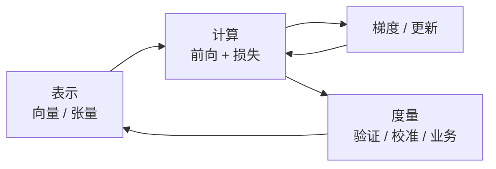

# 人工智能中的数学之美：表示、计算与度量

> 看似智能、复杂、自主的系统，落地时多半是**可写清的数学对象**在算：向量与矩阵承载世界，损失与梯度驱动学习，概率刻画不确定，优化在约束下做取舍。
>
> 本文是对 Anil Ananthaswamy《人工智能中的数学之美》（英文原著 *Why Machines Learn*，2024）的阅读整理与核验补强——保留书中「用数学故事讲清学习何以可能」的主线，同时用标准文献校正过强表述，并与本库 [12](../10-chronicle/12-artificial-intelligence-chronicle.md)、[17](../10-chronicle/17-large-language-model-chronicle.md)、[47](./47-no-silver-bullet-ai-essential-difficulty-philosophy.md) 对齐。勿与吴军《数学之美》混淆：后者以信息检索与自然语言处理为主轴，书名相近、谱系不同。

先给一个直接答案：

> **机器学习没有脱离数学的「黑箱天赋」。** 感知、分类、生成与决策，都可以拆成三类操作：**表示**（世界如何成为可计算对象）、**计算 / 优化**（参数如何沿误差下降）、**度量**（好坏、不确定与泛化如何被定义）。线性代数、微积分、概率统计与优化理论是四根支柱，不是装饰。所谓「美」，不是公式好看，而是**以统一对象包容多元模态、以迭代收敛替代穷尽规则、以概率语言承认噪声与未知**。掌握这套骨架，才能从「会调参」走到「会诊断失效」。

**40-paradigm 位置：** [41](./41-ai-engineering-paradigm.md) 写组织如何承接吞吐；[47](./47-no-silver-bullet-ai-essential-difficulty-philosophy.md) 写偶然 / 本质之难；本文写智能系统的**数学认识论前置**——先分清表示、损失与度量，再谈模型与产品。编年侧见 [12](../10-chronicle/12-artificial-intelligence-chronicle.md)。

## 摘要

Ananthaswamy 的 *Why Machines Learn*（中译《人工智能中的数学之美》，中国科学技术出版社，2025）从感知机到深度网络，把线性代数、优化、概率、聚类、核方法、反向传播与视觉等串成可读叙事。[^ananthaswamy-2024] 阅读笔记宜抽出可带走的结构，而不是复述全书章节。本文采用教学上更稳的三命题——**表示、计算、度量**——组织四大数学支柱与经典算法；并明确边界：每一步运算可以是数学的，**不等于**整条推理链对人可解释；「最简数学驱动最强模型」是启发式，不是定律；分布外失败与可解释性瓶颈，既有数学原因，也有数据、目标与治理原因。

**关键词：** 表示学习；线性代数；梯度下降；概率；优化；反向传播；过拟合；泛化；可解释性；Why Machines Learn

---

## 目录

- [摘要](#摘要)
1. [读法与书目定位](#1-读法与书目定位)
2. [三命题：表示、计算、度量](#2-三命题表示计算度量)
3. [四大支柱](#3-四大支柱)
    - [3.1 线性代数：表示语言](#31-线性代数表示语言)
    - [3.2 微积分：学习引擎](#32-微积分学习引擎)
    - [3.3 概率与统计：不确定性语言](#33-概率与统计不确定性语言)
    - [3.4 优化：约束下的取舍](#34-优化约束下的取舍)
4. [经典模型的数学内核](#4-经典模型的数学内核)
5. [核心难题：数学归因与边界](#5-核心难题数学归因与边界)
6. [案例：四命题各钉一句](#6-案例四命题各钉一句)
7. [可带走的判断](#7-可带走的判断)
8. [与本库其它篇如何合读](#8-与本库其它篇如何合读)
9. [本章要点](#9-本章要点)
10. [参考文献](#10-参考文献)

---

## 1. 读法与书目定位

全文只钉一句：

> **先问「世界被写成什么、误差如何下降、好坏如何度量」，再问「该调哪个超参」。**

| 项目 | 说明 |
|------|------|
| **原著** | Anil Ananthaswamy, *Why Machines Learn: The Elegant Math Behind Modern AI*（Dutton / Penguin，2024-07）[^ananthaswamy-2024] |
| **中译** | 《人工智能中的数学之美》，邓高胜译，中国科学技术出版社，ISBN 9787523616895（2025） |
| **作者** | 科学作家；曾任 *New Scientist* 副新闻编辑；叙事风格是「人物—思想史—公式直觉」并进 |
| **易混书** | 吴军《数学之美》：信息论、搜索、NLP 工程故事为主，**不是**本书 |

书中章节大致从模式识别与感知机，经向量表示、优化「碗底」、概率、聚类、矩阵与核方法、物理启发、反向传播，再到机器视觉与开放理论问题。[^ananthaswamy-toc] 本文**不按章复述**，而把读书笔记收成可检索的认知骨架：三命题 × 四支柱 × 算法实例 × 失效归因。

**所以 · 边界在哪：** 本文是阅读整理与工程认识论，不是教材习题集，也不是某一框架的调参手册。

---

## 2. 三命题：表示、计算、度量

诊断或设计一个学习系统时，不必先背公式清单。先固定三问，即可覆盖从输入到评估的全流程；后文四支柱与经典模型，都挂在这三问之下。

| 命题 | 所问 | 典型数学对象 | 失效时常见症状 |
|------|------|--------------|----------------|
| **表示** | 世界如何进入机器？ | 向量、矩阵、张量；嵌入；特征图 | 模态接不上；语义漂移；维度灾难 |
| **计算** | 信息如何被变换与学习？ | 线性映射 + 非线性；损失；梯度；迭代 | 不收敛；梯度消失 / 爆炸；算不动 |
| **度量** | 结果如何被评判与校准？ | 风险、似然、间隔、校准、泛化界 | 过拟合；分布外崩；指标与业务错位 |

工具服务于命题，而不是相反。同一套线性代数，在表示侧是「像素变张量」，在计算侧是「一层仿射变换」，在度量侧可进入核方法的内积几何。[^bishop-2006]

两条边界须先钉死，以免后文被读成颂歌：

1. **可微 ≠ 可解释。** 前向与反向的每一步可以是数学运算，但大规模复合函数的归因与问责仍可在工程上不可行。[^lipton-2018]  
2. **简洁利于规模化，不是充分条件。** 矩阵乘与点积注意力确实便于硬件与软件栈；[^vaswani-2017] 目标设计、正则、数据与系统工程仍不可省略。

---

## 3. 四大支柱

四支柱对应四类能力：**表示世界、更新参数、表达不确定、在约束下取舍**。它们常同时出现在同一条训练循环里（见节末示意图），分节只为检索清晰。

### 3.1 线性代数：表示语言

**功能：** 把图像、文本、语音与表格写成向量 / 矩阵 / 张量，使之进入统一的运算语法。

| 场景 | 表示 | 在算什么 |
|------|------|----------|
| 计算机视觉 | 图像 → 多通道张量；卷积核 → 局部线性滤波 | 特征提取、检测、分割的主干是张量运算[^lecun-1998] |
| 自然语言 | 词 / 句 → 嵌入向量 | 相似度、检索、注意力里的「关系」常是内积与投影[^mikolov-2013] |
| 推荐与表格 | 用户 / 物品 → 隐向量或特征矩阵 | 距离、分解、排序分 |

核心直觉（教学压缩，非公理）：

- **维度** 是容量与噪声的折中：过高易稀疏与过拟合，过低丢结构。  
- **线性变换** 是「改坐标系 / 提特征」的基本动作；深度网络一层 ≈ 仿射 + 非线性。[^goodfellow-2016]  
- **SVD / 特征分解** 等提供降维与去相关的经典手段；现代大模型更常靠随机梯度与架构归纳偏置，但「用低维结构解释高维数据」的思想未变。

**工程含义：** 统一表示使多模态可共用算子、加速器与软件栈——规模化首先是对象同构，其次才是堆参数。

### 3.2 微积分：学习引擎

**功能：** 在足够光滑的设定下，把训练写成对损失 \(L(\theta)\) 的数值优化；梯度给出局部最速上升方向，**梯度下降**沿反方向更新参数。[^cauchy-1847][^rumelhart-1986]

标准循环：

1. 随机初始化 \(\theta\)；  
2. 前向计算预测与损失；  
3. 反向传播用链式法则求 \(\nabla_\theta L\)；[^rumelhart-1986]  
4. 更新 \(\theta \leftarrow \theta - \eta \nabla_\theta L\)（或 Adam 等变体）；  
5. 重复至验证集度量停止改善或触达预算。

**边界：** 训练并非「完全自主」——学习率、正则、数据管线、早停与评估协议都是人设的归纳偏置。微积分提供的是可微目标上的**局部搜索**，不是真理发现程序；非凸损失上常见的是「足够好的盆地」，而非可证明的全局最优。[^goodfellow-2016]

**工程含义：** 把试错收成可中断、可度量、可复现的迭代过程。

### 3.3 概率与统计：不确定性语言

**功能：** 在噪声、错标与分布漂移下，把「不确定」写成可加、可更新、可校准的对象。

| 用途 | 例子 | 备注 |
|------|------|------|
| 降噪与描述 | 均值、方差、稳健统计 | 脏数据先于模型 |
| 判别 / 生成 | Softmax 概率、似然、贝叶斯更新 | 输出常是分布而非单点真理[^bishop-2006] |
| 序列与结构 | HMM、条件随机场等 | 经典语音 / NLP 管线的骨干之一 |
| 决策 | 期望风险、校准、置信区间 | 高风险场景不能只看 top-1 |

贝叶斯更新（先验 × 似然 → 后验）是动态修正信念的经典骨架；朴素贝叶斯等是可计算特例。[^murphy-2012] **边界：** 概率输出 ≠ 已校准的置信度；深度网络常过度自信，需温度缩放、集成或显式校准。[^guo-2017]

**工程含义：** 用分布语言对接开放世界，避免用点估计假装确定。

### 3.4 优化：约束下的取舍

**功能：** 把「最优」落实为**带约束的折中**——拟合与泛化、精度与时延、收益与风险很少能同时取满。

| 概念 | 在 AI 中的位置 |
|------|----------------|
| 经验风险最小化 | 在训练集上最小化平均损失 |
| 正则（L1, L2 等） | 惩罚复杂度，缓解过拟合[^hastie-2009] |
| 凸 vs 非凸 | SVM 等可落在凸优化；深度网多为非凸 |
| 多目标 | 推荐、风控、对齐中的权衡，很少有单标量「唯一正确」 |

**工程含义：** 可部署智能首先是约束下的可行最优，不是无约束的试卷最优。

---

## 4. 经典模型的数学内核

有了三命题与四支柱，经典模型便可读成「支柱组合」，而不是彼此无关的名词表：

| 模型 | 数学本质（一句话） | 支柱交汇 |
|------|--------------------|----------|
| **线性回归** | 最小化平方误差 → 正规方程或梯度法 | 线性代数 + 优化 |
| **逻辑回归** | 线性分数 + sigmoid / Softmax → 最大似然 | 概率 + 微积分 |
| **SVM** | 最大间隔超平面；核技巧隐式升维 | 几何间隔 + 凸优化[^cortes-1995] |
| **K-means** | 交替分配与更新中心，降类内平方距离 | 距离度量 + 坐标下降式迭代 |
| **前馈 / 卷积网** | 多层「仿射 + 激活」；反传训权重 | 四支柱同时在场[^lecun-1998][^rumelhart-1986] |
| **核方法** | 用 \(k(x,x')\) 做内积，不显式造高维坐标 | 线性代数几何 + 正则[^scholkopf-2002] |

对「神经网络是黑箱」的可用改写：

> 网络是**复合函数** \(f_\theta = f_L \circ \cdots \circ f_1\)；训练是选 \(\theta\) 使风险近似最小。黑箱感来自规模与非线性嵌套，不是「没有方程」。

激活函数（Sigmoid、tanh、ReLU 等）引入非线性，否则多层仿射仍坍缩为单层线性。[^goodfellow-2016] 反向传播则是链式法则的系统应用；1986 年 *Nature* 文使其成为主流叙述节点，算法思想本身有更早谱系。[^rumelhart-1986]

场景侧只需记映射，不必另造「数学文明」：

| 场景 | 常见数学组合 |
|------|----------------|
| NLP | 嵌入空间、序列似然、注意力中的缩放点积[^vaswani-2017] |
| 视觉 | 卷积 = 权值共享的局部线性；池化与归一化 |
| 推荐 | 隐向量距离 / 内积；学习排序；多目标约束 |
| 控制与规划（混合系统） | 概率轨迹 + 约束优化；常与规则 / 安全层共存 |

---

## 5. 核心难题：数学归因与边界

### 5.1 过拟合与泛化

**现象：** 训练误差很低，部署误差很高。  
**数学读法：** 假设类过富、样本不足或噪声被当信号时，经验风险最小解不等于期望风险最小解。[^vapnik-1998][^hastie-2009]  
**常见对策：** 正则、数据增广、早停、简化结构、更多与更干净的数据——皆是在改**有效假设空间或数据分布估计**。

纠偏：过拟合是中心问题之一，但不是「中小模型的唯一核心问题」；标注偏差、目标错设、延迟反馈同样致命。

### 5.2 分布外与鲁棒性

**现象：** 训练分布外样本上置信仍高、错误陡增。  
**数学读法：** 多数学习算法估计的是训练分布下的风险；**外推没有免费定理**。  
**含义：** 这是统计学习的边界，也是为何高风险系统需要监控、拒识、冗余与人类问责——不能单靠把同一损失再训久一点。

### 5.3 可解释性

**现象：** 能输出，难逐步说明「为何是这个输出」。  
**可用区分：**[^lipton-2018]

| 层次 | 含义 |
|------|------|
| 透明模型 | 本身结构可读（短规则、浅树、稀疏线性） |
| 事后解释 | 对复杂模型的局部近似（显著性、代理模型） |
| 问责机制 | 日志、测试、规则护栏、人工复核——治理对象 |

纠偏：把可解释性瓶颈**全部**归咎于「数学理论不够」过窄；目标函数未编码「可说明」、产品未要求可审计，同样关键。未来是否必须「全新数学」才能通向可信通用智能——属研究纲领，不是已证必然。

### 5.4 与「银弹」叙事的衔接

算力与数据推动的是**可优化对象的规模**；数学规定的是**可说清的对象与目标**。长期突破往往需要表示、目标或优化景观上的新思想，但短期工程改进大量来自数据、系统与评估协议——两者不要互相取消。见 [47](./47-no-silver-bullet-ai-essential-difficulty-philosophy.md)。

---

## 6. 案例：四命题各钉一句

| 案例 | 钉住的命题 | 一句话 |
|------|------------|--------|
| **图像识别** | 表示 | 像素进张量；卷积提取局部结构——能力来自表示与学习的组合，不是「矩阵单独超越人类」 |
| **回归拟合** | 计算 | 梯度给出损失下降方向；迭代逼近统计关联，不自动给出因果 |
| **文本分类（贝叶斯等）** | 度量 / 不确定 | 用后验或似然比较类别，可包容同义与噪声；硬规则关键词是脆弱特例 |
| **推荐多目标** | 优化 | 兴趣、多样、生态与商业是加权与约束问题，不是单标量「最懂用户」 |

---

## 7. 可带走的判断

1. **智能落地首先是数学对象落地**：表示、损失、优化、度量四件套。  
2. **四支柱分工**：线性代数（表示）、微积分（学习动态）、概率统计（不确定）、优化（约束取舍）。  
3. **黑箱要分两层**：运算是否可写清 vs 对人是否可解释 / 可问责——前者常有，后者常无。  
4. **训练 ≈ 风险最小化的迭代近似**，不是机器「顿悟」。  
5. **概率是对接真实世界的接口语言**；点估计假装确定，在开放场景更脆。  
6. **统一表示成就通用算子**——简洁是规模化的朋友，不是唯一美德。  
7. **泛化、鲁棒、可解释**同时受数学假设、数据与产品约束；勿单线归因。  
8. **工具会旧，对象与目标的问法更长寿**——这是读此类书的实践理由。  
9. **「美」= 以简驭繁、以迭代代穷举、以概率纳不确定、以约束求可部署。**  
10. **学习的终点不是会调用 API，而是会把失效写回上述三命题。**

---

## 8. 与本库其它篇如何合读

| 篇 | 合读关系 |
|----|----------|
| [12](../10-chronicle/12-artificial-intelligence-chronicle.md) | 思潮与阶段史；本文补「每一阶段在算什么数学」 |
| [17](../10-chronicle/17-large-language-model-chronicle.md) | 语言模型细谱；注意力与缩放是表示 + 优化的当代高峰 |
| [41](./41-ai-engineering-paradigm.md) | 个人算得快 ≠ 组织交得出；数学懂了仍要流程承接 |
| [47](./47-no-silver-bullet-ai-essential-difficulty-philosophy.md) | 清掉调参偶然之后，需求与概念构造仍是本质之难 |
| [50](../50-strategy/50-ai-industry-disruption-strategy.md) | 预测变便宜 ≠ 好决策；度量必须接到业务问责 |

---

## 9. 本章要点

1. 书目锚定 Ananthaswamy *Why Machines Learn* / 《人工智能中的数学之美》，并与吴军《数学之美》区分。  
2. 用**表示—计算—度量**组织阅读，避免算法名词堆叠。  
3. 四支柱各有美学内核：统一、迭代、包容不确定、约束下平衡。  
4. 经典模型是支柱的组合，不是另一套神秘学。  
5. 过拟合、分布外、可解释性：给数学归因，同时守住工程与治理边界。  
6. 可带走的是问法：失效时回到「表示错了、优化错了，还是度量错了」。

---

## 10. 参考文献

[^ananthaswamy-2024]: Ananthaswamy, A. *Why Machines Learn: The Elegant Math Behind Modern AI*. Dutton (Penguin Random House), 2024. 中译：《人工智能中的数学之美》，邓高胜译，中国科学技术出版社，2025（ISBN 9787523616895）。作者页：<http://anilananthaswamy.com/why-machines-learn>

[^ananthaswamy-toc]: 原著目录节点包括：Desperately Seeking Patterns；We Are All Just Numbers Here；The Bottom of the Bowl；In All Probability；Birds of a Feather；There’s Magic in Them Matrices；The Great Kernel Rope Trick；以及反向传播、机器视觉与开放问题等章（以纸书 / 出版社目录为准）。

[^bishop-2006]: Bishop, C. M. *Pattern Recognition and Machine Learning*. Springer, 2006.

[^goodfellow-2016]: Goodfellow, I., Bengio, Y., Courville, A. *Deep Learning*. MIT Press, 2016.

[^hastie-2009]: Hastie, T., Tibshirani, R., Friedman, J. *The Elements of Statistical Learning*. 2nd ed. Springer, 2009.

[^murphy-2012]: Murphy, K. P. *Machine Learning: A Probabilistic Perspective*. MIT Press, 2012.

[^vapnik-1998]: Vapnik, V. N. *Statistical Learning Theory*. Wiley, 1998.

[^rumelhart-1986]: Rumelhart, D. E., Hinton, G. E., Williams, R. J. Learning representations by back-propagating errors. *Nature* 323: 533–536 (1986).

[^cortes-1995]: Cortes, C., Vapnik, V. Support-vector networks. *Machine Learning* 20(3): 273–297 (1995).

[^lecun-1998]: LeCun, Y. et al. Gradient-based learning applied to document recognition. *Proceedings of the IEEE* 86(11): 2278–2324 (1998).

[^mikolov-2013]: Mikolov, T. et al. Efficient estimation of word representations in vector space. arXiv:1301.3781 (2013).

[^scholkopf-2002]: Schölkopf, B., Smola, A. J. *Learning with Kernels*. MIT Press, 2002.

[^vaswani-2017]: Vaswani, A. et al. Attention Is All You Need. *NeurIPS* (2017). arXiv:1706.03762.

[^guo-2017]: Guo, C. et al. On calibration of modern neural networks. *ICML* (2017).

[^lipton-2018]: Lipton, Z. C. The mythos of model interpretability. *Communications of the ACM* 61(10): 36–43 (2018).

[^cauchy-1847]: Cauchy, A.-L. Méthode générale pour la résolution des systèmes d'équations simultanées. *Comp. Rend. Acad. Sci.* 25: 536–538 (1847).（梯度法思想的早期节点；现代 ML 优化是其漫长后裔。）

---

> **可核对的是书目与文献。可带走的是三命题与四支柱。可警惕的是：把「每步可微」误认成「已经理解与已经可信」。**
