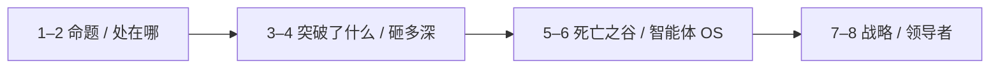
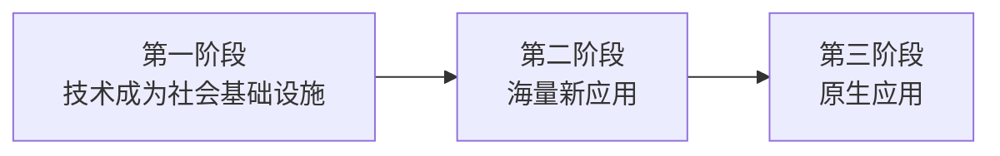
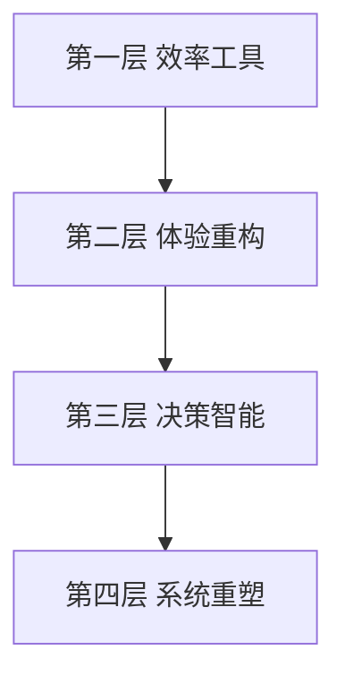

# AI 产业穿透与竞争战略：死亡之谷、智能体与企业操作系统

> AI 正从算法能力走向产业穿透。理解其突破边界、行业冲击层级、落地关键要素、智能体与企业操作系统，以及竞争战略重构，是企业把握这一轮技术变革的基本前提。
>
> 阿里巴巴前总参谋长、战略学者曾鸣给出一个反直觉的时间判断：**2026 不是爆发之年，而是第一阶段刚熟、第二阶段刚开场的交叠点。** 在巨浪面前，没有人是安全的；谁觉得自己安全，谁就是最不安全的。[15]

先给一个直接答案：

> **这一轮突破的是预测与内容生成的边际成本，不是自动好决策。2026 是交叠点：Token 成为可计量的基础设施单位，智能体成为新应用，统一调用它们的「浏览器」尚未出现。冲击用四层看深度；落地卡在死亡之谷；下一跳是智能体嵌进企业操作系统。通用模型在商品化，护城河在专有数据与主流程。模型公司更像 AI 云，第一阶段赢家未必活到原生应用阶段。**

**50-strategy 系列导读：** 本文写智能如何穿透产业与重构护城河。实体产能如何在地理上迁徙，见 [55](./55-global-manufacturing-migration-chronicle.md)；Token 如何成为计量单位，见 [52](./52-token-economics-treatise.md)。

## 摘要

这一轮 AI 的显著突破，是预测成本与内容生产边际成本大幅下降；预测变便宜并不自动等于好决策——判断、目标与问责仍主要由人承担。曾鸣把通用技术拆成三阶段（基础设施 → 海量应用 → 原生应用），并将 2026 标为交叠点：Token 成为可计量单位，智能体成为第二阶段的应用主体；模型公司更像「AI 云」，第一阶段赢家未必活到原生应用阶段。全文再用四层模型判断产业冲击深度（效率工具 → 体验重构 → 决策智能 → 系统重塑），用「死亡之谷」说明普及不等于企业级财务收益，并把智能体、企业操作系统与数据—流程护城河作为战略含义。三阶段是技术浪潮分期，四层是产业冲击深度，二者不要混成一张表。

**关键词：** 生成式 AI；死亡之谷；产业穿透；智能体；通用技术三阶段；创新者窘境

---

## 目录

- [摘要](#摘要)
1. [核心命题](#1-核心命题)
2. [2026 处在哪：基础设施刚熟、智能体刚开场](#2-2026-处在哪基础设施刚熟智能体刚开场)
    - [2.1 通用技术的三个阶段](#21-通用技术的三个阶段)
    - [2.2 为何说 2026 像 1995](#22-为何说-2026-像-1995)
    - [2.3 模型公司更像「AI 云」](#23-模型公司更像ai-云)
    - [2.4 与后文如何咬合](#24-与后文如何咬合)
3. [这一轮 AI 到底突破了什么](#3-这一轮-ai-到底突破了什么)
    - [3.1 从计算智能到感知智能再到生成智能](#31-从计算智能到感知智能再到生成智能)
    - [3.2 当前大模型能做什么](#32-当前大模型能做什么)
    - [3.3 当前 AI 不能做什么](#33-当前-ai-不能做什么诚实的边界)
4. [AI 产业穿透力的四层模型](#4-ai-产业穿透力的四层模型)
    - [4.1 效率工具层](#41-第一层效率工具层)
    - [4.2 体验重构层](#42-第二层体验重构层)
    - [4.3 决策智能层](#43-第三层决策智能层)
    - [4.4 系统重塑层](#44-第四层系统重塑层)
    - [4.5 如何运用这个框架](#45-如何运用这个框架)
5. [跨越死亡之谷：从算法到产业的真实路径](#5-跨越死亡之谷从算法到产业的真实路径)
    - [5.1 问题定义](#51-问题定义的精准度)
    - [5.2 数据闭环](#52-数据闭环的设计)
    - [5.3 系统兼容](#53-业务系统的兼容性)
    - [5.4 组织心智](#54-组织心智的转变)
    - [5.5 试点到规模化](#55-从试点到规模化工作流重构与评测治理)
6. [智能体与企业操作系统](#6-智能体与企业操作系统)
    - [6.1 从会写到会做](#61-从会写到会做智能体意味着什么)
    - [6.2 三跳演进](#62-三跳演进效率工具--智能体编排--流程重塑)
    - [6.3 企业操作系统](#63-企业操作系统智能体规模化的底座)
    - [6.4 决策权三分法](#64-决策权三分法什么交给-agent什么留给人)
    - [6.5 90 天清单](#65-企业推进清单90-天内可做的五件事)
    - [6.6 复杂任务、标准与入口](#66-复杂任务标准与入口)
7. [AI 时代的竞争战略重构](#7-ai-时代的竞争战略重构)
    - [7.1 从规模经济到智能经济](#71-从规模经济到智能经济)
    - [7.2 数据与流程护城河](#72-从护城河到数据与流程护城河)
    - [7.3 Taker / Shaper / Maker](#73-三种采纳姿态taker-shaper-maker)
    - [7.4 智能附加与智能原生](#74-智能原生与智能附加两种-ai-战略路径)
    - [7.5 第一阶段赢家未必活到下一阶段](#75-第一阶段的企业很难原样活到第二阶段)
8. [领导者在 AI 时代的角色](#8-领导者在-ai-时代的角色)
    - [8.1 技术知情者](#81-成为技术知情者)
    - [8.2 提出正确的问题](#82-提出正确的问题)
    - [8.3 责任边界](#83-捍卫-ai-时代的责任边界)
    - [8.4 从战略规划到战略生成](#84-从战略规划到战略生成)
    - [8.5 岗位退场，任务登场](#85-组织岗位退场任务登场)
9. [结语：元问题与思考方向](#9-结语元问题与思考方向)
10. [参考文献](#10-参考文献)

下图为全文阅读顺序：先立命题与浪潮位置，再写能力边界与冲击深度，然后是死亡之谷与智能体操作系统，最后落到战略与领导者。



---

## 1. 核心命题

> **本节要点：** 五条命题按后文阅读顺序排列：先定时间位置，再谈能力、穿透、落地与战略。

**命题一：时间位置**

2026 更宜读成**交叠点**，而不是「全面爆发之年」。曾鸣把通用技术浪潮拆成三阶段：技术成为社会基础设施 → 基于基础设施的海量新应用 → 原生应用。第一阶段企业很难原样活到第二阶段，第二阶段企业很难原样活到第三阶段；模型公司更接近「AI 云 / 炼油厂」，原生应用阶段的大赢家尚未出现。该框架是产业史观，不是年表法庭；史实节点与口述预测在第 2 节分开标注。[15]

**命题二：能力跃迁**

这一轮 AI 的显著突破，是从“识别已有之物”走向“生成新的候选内容”。用 Agrawal、Gans、Goldfarb 的经济学框架说，许多 AI 能力可理解为**预测成本的大幅下降**；生成式模型则进一步压低了文本、代码与多媒体内容的生产边际成本。但预测变便宜，并不自动等于好决策——判断（judgment）、目标设定与责任归属，仍主要由人来承担。[1][2]

**命题三：穿透深度**

AI 对产业的冲击可深入至系统重塑层，即从根本上改变行业结构与竞争逻辑。不同行业受到的冲击深度与速度，取决于数字化程度、数据可获得性、任务标准化程度，以及容错成本与监管强度。

**命题四：落地路径**

AI 从算法到产业的落地，面临“死亡之谷”——实验室里表现优异的模型，往往在真实业务场景中折戟。麦肯锡等机构的调研显示：生成式 AI 在企业中已高度普及，但多数组织仍难把试点转化为企业级财务收益。[4][5] 跨越死亡之谷的关键要素是：问题定义的精准度、数据闭环的设计、业务系统的兼容性、组织心智的转变，以及从试点走向规模化时所必需的工作流重构与评测治理。下一阶段的关键载体，是能调用工具、编排多步任务的智能体，以及支撑其规模化运行的企业级“操作系统”。[6][7]

**命题五：战略含义**

AI 时代的竞争战略正在从“规模经济”转向“智能经济”——数据飞轮、算法优势与人机协同正在成为新的护城河。通用模型能力正快速商品化，真正难复制的是专有数据、嵌入核心流程的智能，以及对 AI 采纳路径（用现成工具、用私有数据定制，或自建基座）的清醒选择。传统行业的领先者若不主动拥抱 AI，将面临“创新者的窘境”。[3]

---

## 2. 2026 处在哪：基础设施刚熟、智能体刚开场

> **本节要点：** 曾鸣把通用技术拆成三阶段。2026 是交叠点，不是爆发之年。框架是产业史观；年份类比与市值折算标出口述口径，可核验节点另行注明。[15]

所有人都在问 AI 走到哪一步。反直觉的答案是：第一阶段刚刚成熟，第二阶段刚刚开场。机会恰恰藏在交叠里——智能体已经出现，统一调用它们的「浏览器」还没有。

### 2.1 通用技术的三个阶段

曾鸣对移动互联网、PC 互联网与历次工业革命的归纳是：新技术大致经历三阶段。这与第 4 节「四层穿透」不是同一把尺：三阶段回答**浪潮走到哪**，四层回答**对某个行业砸多深**。



| 阶段 | 含义 | 移动互联网对照（教学用） |
|------|------|--------------------------|
| **一、基础设施** | 技术可被规模化、标准化调用 | 智能机与移动网络铺开；可用性先于完美体验 |
| **二、海量应用** | 基于基础设施百花齐放，探索方向仍散 | App 爆发；应用反哺下一阶段该往哪走 |
| **三、原生应用** | 用更底层的方法运行新世界；真正解决核心需求 | App Store 之后，短视频 + 推荐这类「又是技术模式又是商业模式」的现象级产品 |

原生应用往往不诞生于第二阶段的起点：应用爆发才给技术下一阶段的方向。曾鸣用字节的路径作口述类比——文字与信息流成熟后有今日头条，推荐算法与带宽、算力叠合后才有抖音。第二阶段本身可以很长（他估计或有 8–10 年），没有这一段积累，跨不到第三阶段。[15]

第一阶段的「可不可用」赢家，未必带得走第二阶段要的产品力与用户同理心。教学对照：2010 年前后黑莓仍占美国智能手机使用份额约四成（comScore：2009 年末约 41.6%）；iPhone 4 与 Android 起量后，份额迅速被切走——第一阶段终端巨头没有自动成为原生应用时代的定义者。[16]

### 2.2 为何说 2026 像 1995

**标志一：Token 成为度量衡。** 当技术有了可规模化的标准单位，它才真正像一度电、一吨水、一 GB 流量那样被买卖。黄仁勋把英伟达的未来说成 token factory；奥尔特曼也把卖 token 当作 OpenAI 的核心生意叙事。度量衡成型，是第一阶段基本完成的商业信号，不是「智能已经到顶」。Token 作为计价与计量单位的展开，见本库 [52](./52-token-economics-treatise.md)。[15][17]

**标志二：智能体开场。** 2026 年春节前后，开源项目 OpenClaw（中文圈称「龙虾」，由 Moltbot 更名）出圈：它不再只待在对话框里，而是调用工具、操作环境、拆解多步任务。曾鸣把它读成第二阶段的开幕式——智能体就是 AI 时代的新应用。随后的安全事故与风险提示说明：能力可以先爆，治理与权限必须跟上，否则只是把死亡之谷从聊天框搬到了本机与网关。[15][18]

**结构类比，不要年份一一对应。** 曾鸣琢磨过「今天相当于互联网哪一年」：三年前讲「拥抱雅虎」，2026 年初又觉得退回到了浏览器。关键不是 1995 这个数字，而是抽象结构：

| 1990 年代初的信息网 | 2026 前后的智能体 |
|---------------------|-------------------|
| 建站，分享**信息** | 建 agent / skill，分享**能力** |
| HTML 降低供给门槛，浏览器把使用门槛打到「点击」 | 仍缺一套把 agent 调用做成「点击」的统一标准 |
| 站点爆炸后，雅虎做目录，本质是**熵减** | 今日 skill 爆发仍偏**熵增**；「AI 时代的雅虎」雏形未现 |

浏览器做成了两件事：供给端有标准，用户端零摩擦。二者一起爆，才轮到目录与门户。下一个最大的机会，因此不是再做一个会聊天的助手，而是**类似浏览器的入口：把 agent 的标准统一起来，让普通人用很简单的方法调用它**。产品形态长什么样，访谈明确说「想象不出来」——那是要被创造的，不是已经写在商业计划里的。熵增 / 熵减的一般原理，见本库 [43](../40-paradigm/43-entropy-complex-systems-philosophy.md)。[15]

> **核验注。** 「2026 ≈ 1995」是教学锚点：1995 年前后是 Netscape 上市、Web 进入大众视野的窗口之一，不是法庭日期。Yahoo! 目录可上溯 1994，公司 1995 年注册。结构对上即可，不必把每一个月对齐。

### 2.3 模型公司更像「AI 云」

若数据是石油，大模型更像炼油厂：让人比较容易接到「智能」上，有点像当年 AOL 让人接到互联网上。OpenAI、Anthropic、国内的 Kimi / DeepSeek 等，终局叙事更接近**少数稳定的 AI 云公司**——云厂商觉得付出太多、模型公司想自建云甚至自研芯片，博弈会很长。[15]

第一波跑出来的公司可以极大，这不是「这一次不一样」。可核验的数量级：

| 公司 | 节点 | 市值量级（当时美元） |
|------|------|----------------------|
| Yahoo! | 约 1995 年公司化；2000 年初峰值 | 约 **1250–1400 亿美元**[19] |
| AOL | 服务可上溯 1980 年代末；1999 年 12 月峰值 | 约 **2220 亿美元**[20] |
| Google | 1998 年成立；2005 年秋 | 市值一度越过 / 贴近 **1000 亿美元**[21] |

访谈里「当年 1000 亿约等于今天 1 万亿」是**数量级修辞**，不是 CPI 折算（2000–2026 年美国 CPI 远不到十倍）。它要说明的是：通用技术第一波公司可以贵得吓人，也仍可能不是下一阶段的定义者。Anthropic「不到十年接近万亿」同属市场叙事与访谈对照，本库不作市值审计。[15]

公共基础设施行业，长期像样的商业模式往往是**寡头 + 强监管**：社会依赖它，不能只剩一家，政府也不会放任零监管。炼油厂可以活得很好，却很难因此成为汽车公司——石油公司离开了车转不动，但石油公司很少做得成车。陆奇式「OpenAI 未来一定比 Google 大 5–10 倍」与「未来会有十万亿美元公司，但不一定是现在领跑的两家」可以并存：后者才是三阶段框架的推论。[15]

第二阶段开始的标志，是技术渐渐变成「大家都能调用」，比拼转向洞察、产品力、与普通用户的同理心，以及上下文管理等应用层新能力。接下来要看的，是谁成为这个时代的 Netscape、谁成为雅虎：**谁把 agent 的标准建立起来，谁控制用户入口。** 普通人的问题很朴素——怎么知道哪个 agent 能用？敢不敢把重要的事交给它？信任从哪来？这需要新的服务商，而不是再堆一百个 Demo。[15]

### 2.4 与后文如何咬合

| 后文 | 咬合点 |
|------|--------|
| 第 3 节能力边界 | 智能体扩大执行半径，不自动获得可靠的目标设定与价值判断 |
| 第 4 节四层穿透 | 浪潮阶段 ≠ 行业冲击深度；同一年里，有的行业还在效率工具层，有的已碰系统重塑 |
| 第 5–6 节死亡之谷与 OS | 简单任务是脚手架，会被模型溢出淹没；复杂任务才可能形成智能闭环。OpenClaw 说明先 OS、先权限，再谈自主 |
| 第 7 节竞争战略 | 第一阶段赢家难原样活到第三阶段；Taker / Shaper / Maker 是企业侧选择，与「模型公司变云」互补 |
| 第 8 节领导者 | 「看 10 年、想 3 年、干 1 年」；战略从规划走向生成；科层作为默认操作系统会受压，组织不会消失 |

---

## 3. 这一轮 AI 到底突破了什么

> **本节要点：** 能力史上有计算 → 感知 → 生成三截，与第 2 节「基础设施 → 应用 → 原生」不是同一把尺。生成压低了内容与代码的边际成本；判断、目标与问责仍在人这边。

### 3.1 从“计算智能”到“感知智能”再到“生成智能”

人工智能的能力史可粗略划分为三截——此处说的是**机器能干什么**，不是第 2.1 节那种浪潮分期。

**计算智能（1950s—2010s）**

机器在明确的规则与搜索框架内执行计算任务——下棋、求解数学问题、执行高度结构化的流程。1997 年深蓝击败国际象棋冠军卡斯帕罗夫，是这一阶段的标志性事件。此时的 AI，更多是强大的“规则与搜索执行器”，而非开放世界的感知与生成系统。

**感知智能（2010s）**

深度学习的兴起，使机器在图像识别、语音识别、自然语言处理等“感知”任务上取得了突破性进展。2012 年 AlexNet 在 ImageNet 竞赛中大比分领先传统方法夺冠，标志着这一阶段的开启。机器开始能够“看”和“听”，但其输出仍然是分类标签或预测数值——它能认出这是一只猫，但无法画出一只猫。

**生成智能（2020s）**

大语言模型与扩散模型的成熟，使机器具备了大规模生成内容的能力——写作、编程、绘画、作曲、视频制作。这一突破的性质不同：机器不再只是“识别已有之物”，而是能够基于训练分布组合出新的候选内容。需要强调：这仍是统计学习意义上的生成，并不等于具备人类式的意图、理解或原创；但其商业含义已经足够深刻——内容与软件生产的边际成本被显著压低。

**洞见**

> “经常有企业家问：这一轮 AI 和之前到底有什么不一样？以前的 AI 是‘你看这一张猫的图片，机器判断它是猫’，现在的 AI 是‘你跟机器说画一只猫，它就画一只猫给你’。从识别到生成，这个跨越在哲学意义上丝毫不亚于工业革命对体力劳动的解放。”

### 3.2 当前大模型能做什么

理解 AI 的商业潜力，首先需要诚实地分开「能做什么」与「不能做什么」。当前大语言模型较成熟的能力可概括为四项：

**第一，语言理解与生成。**  
这是大模型最成熟的能力。它可以撰写报告、翻译文档、总结摘要、回答客户咨询。在企业环境中，这一能力已经可以在法律文书初稿、客服对话、营销文案等场景产生实际价值。

**第二，代码生成与调试。**  
辅助编程已成为 AI 较早证明商业价值的领域之一。GitHub 与 Microsoft Research 的对照实验（Peng 等，2023）显示：在完成一个标准化编程任务时，使用 Copilot 的开发者平均完成速度快约 **55.8%**（95% 置信区间约 21%–89%）。[9][10] 该结果来自受控实验中的特定任务，不能直接外推为所有研发场景的普遍增幅；真实组织中的收益会随任务类型、代码库复杂度与工程师经验显著变化。关键启发在于：编码是“问题定义相对清晰、反馈即时、容错相对可控”的理想落地场景之一。

**第三，知识检索与整合。**  
大模型像一个阅读了海量文本的超级分析师，可以在短时间内提炼多个文档的核心信息并形成整合性报告。这一能力对咨询、投研、法务等知识密集型行业的影响正在显现。企业落地时，通常需叠加检索增强生成（RAG）与权限控制，才能把“会写”变成“写得对、写得可溯源”。

**第四，多模态理解与生成。**  
最新的模型已能同时处理文本、图像、音频、视频——输入一段文字生成图片，输入一张设计图生成 HTML 代码，输入一段会议录音生成会议纪要与待办事项。多模态能力正在将 AI 的应用边界从“白领工具”扩展到更多场景。

### 3.3 当前 AI 不能做什么：诚实的边界

对商业决策者而言，知道 AI 不能做什么，有时比知道它能做什么更重要。

**幻觉与事实可靠性不足。**  
大模型会以流畅、自信的语气输出错误内容。对客服、法务、医疗、财务等高信任场景，这不是边角问题，而是上线门槛。企业侧的应对通常是：检索增强、引用溯源、人工复核，以及对关键字段做规则/结构化校验。

**输出可溯源性与责任边界不清。**  
模型给出一个结论，往往难以像传统系统那样清晰回答“依据哪条制度、哪份合同、哪条数据”。没有溯源与审计日志，合规、客诉与事故追责都会卡住。

**缺乏面向业务结果的评测体系。**  
实验室榜单不等于业务 KPI。若没有离线评测集、线上 A/B、人工抽检与事故复盘机制，项目很容易“演示漂亮、上线翻车”。评测与治理，应被视为落地能力的一部分，而非上线后的附加项。

**因果推理仍是弱项。**  
大模型擅长发现相关性，但在严格的因果推断上表现不佳。你可以让它分析“降价与销量的历史关系”，但它无法可靠地回答“如果下个月降价 10%，利润会变化多少”——这需要因果模型而非统计关联。

**常识与物理世界理解有限。**  
以文本为主训练的大模型，其“知识”主要来自语料共现，而非亲身与物理世界交互。它可能写出关于杯子的流畅描述，却并不具备稳定、可迁移的物理直觉。这使得纯语言模型在复杂制造、外科操作、现场施工等高物理依赖场景中，难以单独承担直接执行角色；多模态与机器人学习正在推进，但离通用可靠仍有距离。

**自主目标设定与长期规划能力不足。**  
当前的 AI 可以高效执行被清晰定义的任务，但无法可靠地自主设定目标、制定长期规划并坚持执行。智能体（Agent）可以通过工具调用完成多步任务，但在开放目标、长周期与高风险环境中，仍需人类设定边界与兜底。

**价值判断与道德推理存在局限。**  
大模型可以模仿人类的道德语言，但它没有真正的价值信念。在涉及道德两难的商业决策中——例如“是否应该为追求利润而裁撤一个传统部门”——AI 可以提供分析框架，但不应被期待做出价值判断。经济学家 Agrawal、Gans、Goldfarb 的表述很贴切：机器擅长预测，人必须保留判断。

**洞见**

> “推动 AI 落地的最大教训之一是：AI 的能力边界与业务需求之间，往往存在一个企业家看不见的鸿沟。技术团队说‘可以’，业务团队觉得‘不行’，根源常常在于对 AI 能做什么、不能做什么缺乏共识。因此，建立这份清醒的认知地图，是避免 AI 投资打水漂的第一步。”

---

## 4. AI 产业穿透力的四层模型

> **本节要点：** 四层回答「对你这个行业砸多深」，与第 2 节「浪潮走到哪」正交。同一年里，有的行业还在效率工具层，有的已碰系统重塑。

理解 AI 能做什么之后，下一个问题是：它对不同行业的影响深度与速度有何不同？以下四层分析框架，可用于判断 AI 对自身行业的穿透路径。它与咨询机构常用的成熟度分层（如从试点到规模化）互补：前者回答「冲击有多深」，后者回答「组织走了多远」。

下图由浅入深：越往下，冲击越深，组织与商业模式改造越重。



### 4.1 第一层：效率工具层

在这一层，AI 被用作提高现有流程效率的工具——它不改变业务的基本逻辑，只让做同样的事情更快、更便宜、更准确。

- **典型应用：** 智能客服回答常规问题、AI 辅助编写代码、自动生成会议纪要、财务单据的智能审核。
- **影响特点：** 门槛较低，ROI 易于衡量，但难以形成结构性优势——竞争对手也能购买同样的工具。麦肯锡对生成式 AI 的观察也印证了这一点：横向助手类应用最容易铺开，却未必自动转化为企业利润表上的显著改善。
- **适用行业：** 几乎所有行业都处于或即将进入这一层，尤其以信息密集型服务业（金融、保险、法律、会计）最为显著。

### 4.2 第二层：体验重构层

在这一层，AI 不只是优化后端流程，而是开始重塑用户界面与交互方式。产品或服务的形态因为 AI 而发生了改变。

- **典型应用：** 从搜索框到对话式交互（ChatGPT 等正与传统搜索形成竞争与互补，而非简单替代）、从“千人一面”到更细粒度的个性化推荐、从标准产品到 AI 辅助的个性化方案（如自适应教学路径）。
- **影响特点：** 开始触及客户体验的核心，可能重塑品牌认知与用户忠诚度。先行者有可能建立体验层面上的差异化优势。
- **代表性行业：** 零售、教育、内容与媒体、医疗健康。

**洞见**

> “体验重构层往往被企业家低估。很多人认为 AI 就是省钱——裁减客服、自动化流程。省钱当然重要，但真正的战略价值在于，AI 让你能提供竞争对手提供不了的客户体验。当一家教育公司能够为每个学生提供量身定制的学习路径时，它的护城河就不只是课程质量，而是个性化体验本身。”

### 4.3 第三层：决策智能层

在这一层，AI 开始进入企业决策的核心——辅助甚至部分替代管理判断。

- **典型应用：** AI 驱动的供应链需求预测与动态库存管理、基于实时数据的动态定价策略、AI 辅助的招聘与人岗匹配、AI 驱动的投资组合优化与风险预警。
- **影响特点：** 开始触及管理者的核心职能。对组织的决策文化、权力分配与管理者的角色认知产生冲击。
- **代表性行业：** 零售供应链、金融投资、物流调度、能源管理。

进入这一层，组织面临的挑战不再只是技术问题，而是管理问题：管理者愿意在多大程度上信任算法的建议？当算法建议与经验直觉相悖时，听谁的？决策权如何重新分配？这里再次回到“预测 vs 判断”：可以把预测交给机器，但判断标准、风险偏好与问责主体必须事先设计清楚。

### 4.4 第四层：系统重塑层

这是影响最深的一层——AI 不再只是优化或决策工具，而是从根本上改变了行业的竞争结构、价值创造方式与商业模式。

- **典型特征：** 行业边界被重新划定。竞争从“企业与企业”变成“平台与平台”或“生态与生态”。核心价值从产品本身转移到数据与智能。
- **代表性案例：**
  - **内容与分发：** 传统媒体 → 个性化内容平台（推荐算法重塑了内容生产、分发与消费链条；生成式 AI 进一步压低内容生产成本）
  - **软件与服务：** 传统功能型 SaaS → AI 原生工作流产品（产品逻辑从“人点菜单”转向“人设定目标、智能体执行任务”）
  - **出行与匹配（更早一轮数字化）：** 传统出租车 → 网约车平台（供需匹配与动态定价重塑结构；说明“系统重塑”并非本轮大模型独有，但可作类比）
  - **医疗（进行中）：** 从“医生诊断”到“AI 辅助诊断 + 医生决策”，再走向“AI 处理标准化初诊、医生专注复杂病例”——速度受监管与容错要求显著约束
- **影响特点：** 行业领先者如果无法适应，可能被跨界而来的“智能原生”竞争者颠覆。这正是“创新者的窘境”在 AI 时代的再现。

### 4.5 如何运用这个框架

对企业家而言，关键问题是：你的行业正在被 AI 穿透到第几层？接下来的三到五年，可能穿透到第几层？

一个更完整的判断维度是：**任务标准化程度 × 数据可获取性 × 容错成本 × 监管强度**。

- 任务越标准化、数据越丰富、容错越高、监管越松，AI 的穿透速度越快（如客服分流、翻译、营销文案、内部知识问答）。
- 任务越依赖隐性知识、数据越稀缺或越碎片化、出错代价越高、监管越严，AI 的穿透速度越慢（如高端战略咨询、复杂外科手术、信贷终审、关键合规决策）。

但请注意，“慢”不等于“不会发生”。隐性知识的部分标准化是 AI 正在攻克的方向——这正是大模型从海量文本中学习“模式”的核心能力所在。

---

## 5. 跨越死亡之谷：从算法到产业的真实路径

> **本节要点：** 普及不等于利润表。跨越靠问题定义、数据闭环、系统兼容、组织心智，以及从试点到规模化的工作流与评测——不是更先进的算法。

AI 实验室里令人惊艳的 Demo，与真正能产生商业价值的落地之间，横亘着一道鸿沟——业界常借用技术转移语境中的「死亡之谷」来形容它。麦肯锡则将其概括为「生成式 AI 价值悖论」：企业广泛使用新工具，但多数难以在收入或成本上看到实质性改善；横向效率工具容易铺开，纵向高价值用例约九成仍停在试点。[5] BCG（2024）的调研更具体：仅约 26% 的企业走出概念验证并开始产生价值（其中约 4% 形成较强的价值引擎），约 74% 尚未展现出可观的 AI 价值。[8]

跨越这道鸿沟需要的不是更先进的算法，而是以下关键要素。

### 5.1 问题定义的精准度

技术团队最常见的错误，是用 AI 的“锤子”到处找“钉子”。而业务团队最常见的错误，是把一个模糊的战略期望——“我们要 AI 赋能”——直接抛给技术团队。

精准的问题定义，意味着将“我们要用 AI 提升客户体验”拆解为：

> 在哪个旅程环节，由 AI 执行哪个具体任务，预期将哪个 KPI 从 A 提升到 B，判断成功的标准是什么。

**实战案例（示意）**

一家零售企业在推进 AI 客服时，最初的目标是“用 AI 替代人工客服降低 30% 成本”。多次试错后他们发现，更有价值的切入点是“用 AI 在高峰期分流 40% 的简单咨询，让人工客服集中精力处理复杂问题”——后者同时提升了客户满意度。问题定义从“替代人”转向“增强人”，ROI 的达成路径清晰了数倍。

可核验的对照是编程助手场景：GitHub Copilot 之所以能较早证明价值，很大程度上因为任务边界清楚、成功标准可测、反馈周期短——这与“模糊的 AI 赋能”形成鲜明对比。

### 5.2 数据闭环的设计

很多 AI 项目失败，不是因为模型不够好，而是因为缺乏可持续的数据闭环。

数据闭环包含四个环节：

```text
数据采集 → 模型训练/检索更新 → 效果反馈 → 数据再采集
```

如果一个 AI 系统上线后，无法自动收集其决策的反馈信号（例如：推荐的方案被采纳了吗？采纳后效果如何？客服回答是否被用户点赞/转人工？），这个系统就不会持续迭代。没有闭环的 AI，就像一个不接收反馈的员工——它的能力上线第一天就是它的天花板。

### 5.3 业务系统的兼容性

AI 不是凭空运行的。它需要嵌入企业的现有 IT 系统、业务流程与组织架构。

两个务实建议：

1. **起步时选择“低耦合”场景：** 优先选择那些可以相对独立运行、不需要大规模改造现有系统、失败了影响可控的应用。
2. **AI 的边界要清晰：** 在 AI 系统与人类决策者之间，必须设计清晰的交接规则。例如，AI 可以自动处理金额低于 X 元的理赔，超过阈值则自动转入人工审核。

公开实践中，制造与零售龙头推进企业级智能体时，往往先打通业务 API、权限与数据口径，再谈“全员用 Agent”——没有系统兼容性，智能体只能停在聊天窗口。

### 5.4 组织心智的转变

这可能是一切困难中最被低估的一项。AI 落地的最大阻力通常不是技术，而是来自组织内部的“免疫系统”——中层管理者担心权力被架空，一线员工担忧岗位安全，业务负责人对新工具缺乏信任。

跨越这一挑战，需要企业家亲自推动两件事：

1. **建立“AI 增强而非替代”的叙事框架：** 这不仅是安抚，在很多场景下这也是事实。AI 接管的是任务，不是岗位——当一个岗位中有 30% 的重复性任务被 AI 接管时，这个岗位的定义可能需要重设，但未必意味着要被消灭（更远的地平线见第 8.5 节）。
2. **用“早期胜利”建立信心：** 不要试图用 AI 一次性改革整个组织。选择一个小而痛、见效快的场景，用那个成功案例来说服怀疑者。

### 5.5 从试点到规模化：工作流重构与评测治理

四个要素解决“能不能做成一个可用场景”；真正跨越死亡之谷，还取决于能否把单点成功复制为企业级能力。

**第一，把 AI 嵌进工作流，而不是停在个人提效。**  
员工用聊天助手写得更快，不等于企业利润更好。麦肯锡高绩效样本的共同动作，是重塑端到端流程：审批、客服、供应链、研发协作等环节被重新编排，AI 成为流程节点，而非旁路工具。

**第二，优先核心业务流程，而不是撒胡椒面。**  
BCG（2024）的观察是：领先企业约 62% 的 AI 价值来自核心业务过程（如运营、销售与营销、研发），而非主要来自外围支持功能。[8] 对企业家而言，这意味着要敢于做减法——砍掉大量“看起来很 AI、却不碰主价值链”的试点。

**第三，建立评测、风险与上线标准。**  
上线前明确：准确率/召回率阈值、幻觉抽检比例、升级人工规则、审计日志与回滚机制。没有这些，规模化只会放大事故。

**第四，治理与责任前置。**  
谁有权批准自动决策？出错由谁承担？客户是否知情并可选择人工服务？这些问题不在模型参数里，而在管理制度里；拖到出事再补，成本极高。

**洞见**

> “推动 AI 项目时，经历过一个典型困境：技术团队花了半年做了一个精准度高达 95% 的预测模型，但业务团队根本不用。后来复盘发现问题不在于模型，而在于业务团队不知道如何将模型的建议融入日常决策流程。他们过去是凭经验拍脑袋的，现在有了数据，但不信任，也不会用。最终花的时间最长的不是调模型，而是设计一套人机协同的工作流程，以及培训业务团队如何解读模型输出的结果。”

上述洞见指向同一方向：下一阶段竞争，不再是“谁先上了一个聊天助手”，而是谁能把智能体嵌进企业操作系统，让工作真正被重新编排。

---

## 6. 智能体与企业操作系统

> **本节要点：** 第二阶段的主体是智能体。没有企业操作系统，智能体只能停在 Demo。本节的「三跳」是企业落地路径，不是第 2.1 节的浪潮三阶段。

第 3–5 节回答的是「能做什么、冲击多深、为何难落地」。本节回答：普及却难进利润表之后，下一步靠什么把价值做出来？

答案正在收敛为两个相互咬合的概念：**智能体（Agent）**，以及支撑智能体规模化运行的**企业操作系统（Enterprise OS / Agent OS）**。

### 6.1 从“会写”到“会做”：智能体意味着什么

聊天助手解决的是生成与对话；智能体试图解决的是执行与协同。一个可工作的企业智能体，通常具备四类能力：

1. **目标分解：** 把“处理这张异常订单”拆成查询、核对、拟方案、请示/执行等步骤。
2. **工具调用：** 通过 API 读写 ERP、CRM、工单、知识库、邮箱等系统，而不是只在对话框里“建议你去点哪里”。
3. **记忆与状态：** 记住上下文、中间结果与业务约束，而不是每次对话从零开始。
4. **边界内的有限自主：** 在授权范围内推进任务；越权或高风险步骤自动升级给人类。

麦肯锡将智能体视为打破“生成式 AI 价值悖论”的关键杠杆：横向 Copilot 容易铺开但收益弥散；纵向高价值场景常卡在试点；智能体有机会把多步流程串起来，使 AI 从旁路助手变成流程中的执行者。[6] 但前提必须说清——智能体不是“更聪明的聊天框”，而是**对业务流程与权限体系的重新设计**。

这也呼应第 3 节的能力边界：智能体可以扩展“执行半径”，并不自动获得可靠的目标设定、因果推理或价值判断。开放目标、长周期、高后果场景，仍需人类设定边界与兜底。

### 6.2 三跳演进：效率工具 → 智能体编排 → 流程重塑

企业落地智能体，很少一步到位。更常见的是三跳（落地路径，不是浪潮分期）：

| 阶段 | 形态 | 价值特征 | 典型风险 |
|------|------|----------|----------|
| **效率工具** | 写作、摘要、代码补全、单点问答 | 个人提效快，ROI 易感知 | 难进 P&L；人人可用，难成壁垒 |
| **智能体编排** | 多工具调用、跨系统任务流、人机交接 | 开始碰职能流程；可测周期与差错率 | 权限、幻觉、失控调用；“智能体孤岛” |
| **流程重塑** | 以智能体为默认执行者，重画端到端流程与组织分工 | 可能改成本结构与响应速度 | 变革阻力最大；治理与操作系统能力要求最高 |

多数企业目前停在第一跳，或在第二跳做了几个 Demo。真正拉开差距的，是能否进入第三跳：不是给旧流程“加一个 Agent 按钮”，而是问——若默认有一批可控的数字同事，审批、客服、采购、排产、理赔应如何重画？

### 6.3 企业操作系统：智能体规模化的底座

智能体要规模化，不能靠“每个部门自己接一套大模型”。企业需要一层类似操作系统的能力底座，把模型、数据、工具、权限、评测与治理收拢起来。[7] 可把它理解为四层：

```text
交互与编排层：统一入口、任务编排、多 Agent 协同、人机交接
     ↑
智能与工具层：模型路由、RAG/知识、业务 API、连接器、工作流引擎
     ↑
数据与语义层：主数据、指标口径、权限标签、业务对象语义化
     ↑
治理与运行层：身份鉴权、审计日志、沙箱、评测、成本与配额、回滚
```

没有这层底座，会出现三种典型失败：

1. **烟囱式智能体：** 每个场景单独对接系统，技术债与安全面急剧膨胀。
2. **会说不会做：** 模型很强，但调不动核心交易系统，最终退回聊天建议。
3. **一放就乱：** 员工随意创建 Agent，权限过大、成本失控、事故无法追责。

公开实践中，制造与零售等龙头推进企业级 Agent 时，往往先强调统一入口、业务 API 语义化、权限与沙箱，再谈“全员开发智能体”。顺序很重要：**先 OS，后繁荣；先可控，后自主。**

### 6.4 决策权三分法：什么交给 Agent，什么留给人

智能体时代，最重要的组织设计不是“上几个场景”，而是重新划分决策权。可借用一个简单三分法：

1. **AI 可委托：** 低后果、可回滚、标准清晰的任务（如内部知识问答、会议纪要、常规工单分流）。
2. **人机协同：** AI 起草或推荐，人确认后执行（如对外报价、合同初审、异常订单处理方案）。
3. **人类专属：** 高后果、强伦理、强监管或目标本身冲突的决策（如重大裁员、最终信贷否决权的制度性确认、涉及人身安全的最终指令）。

领导者应定期审视：组织里有多少决策仍停留在“凭经验拍脑袋”，有多少已具备委托或协同条件，却因信任与流程设计不足而闲置。前文强调的“预测 vs 判断”，在智能体时代具体化为：**预测与执行步骤可交给机器，判断标准与问责主体必须写进操作系统。**

### 6.5 企业推进清单：90 天内可做的五件事

1. **选定一条端到端痛点流程**（如“异常订单处理”或“售后升级工单”），而不是再开十个聊天助手试点。
2. **盘点该流程所需的系统、API、权限与数据口径**，明确哪些必须打通，哪些可先只读。
3. **定义 Agent 的授权边界与升级规则**（金额、客户等级、差错成本、强制人工节点）。
4. **建立最小评测集与线上抽检**（正确率、越权率、平均处理时长、转人工率、用户满意度）。
5. **明确统一入口与治理责任人**（谁批准新 Agent 上线、谁看审计日志、谁对事故负责）。

做完这五步，企业才谈得上“智能体战略”；否则只是把死亡之谷从模型层搬到了编排层。

### 6.6 复杂任务、标准与入口

第二阶段百花齐放，并不等于什么切口都值得做。曾鸣的判断是：去年大量应用停在特别简单的任务（素材、投放、写文案），长期价值薄；**复杂任务**才可能建立自己的智能闭环与技术积累。智能还不够用时，应用多半是脚手架，等着模型溢出把你淹没。今天的切入点应反过来：**假定智能够用，它到底能干哪件够重的活？** 越简单的活越容易被更复杂的活吞掉。[15]

通用还是垂直，是创造力而不是教条。教育、健康是大垂类，认真耕耘就够一条事业。通用里会再分 to B 与 to C：组织侧会出现「组织大脑 / CEO 的 agent 团队」叙事；个人侧会重做陪伴与办事。Manus 一类产品曾抓住 coding 能力溢出的窗口、先打专业级消费者，切口当时是对的；再立住，需要更大数量级的场景，而不是再做一个聊天套壳。[15]

网络效应仍在，但同类数据规模到点后边际递减。曾鸣把升级版叫「黑洞效应」：场景越多、连接越复杂，越可能拓宽可用智能——这是《智能商业》里「数据智能 × 网络协同」的口述升级，不是已被计量验证的定律。新平台要匹配的是**能力与需求**，复杂度高于当年的网页目录；用户很难自己判断某个 agent 会不会闯祸，因此会把判断力让渡给信任的第三方。这正是第 2.2 节「还在等浏览器」的组织含义。[15][22]

模型会不会吞噬一切？前提是「所有东西都在射程内」。按现有范式，模型会有阶段性天花板；智能够用之后，场景侧会冒出新的技术要求。电网铺开之后，洗衣机、电冰箱、收音机才陆续成规模——应用有自己的时钟，不是发电一完成就自动出现。公司层面也一样：做过发电设备，不等于自动拥有电网，更不等于自动拥有 to C 电器。[15]

---

## 7. AI 时代的竞争战略重构

> **本节要点：** 护城河转向专有数据与主流程；绝大多数企业走 Taker + Shaper。基础设施层的赢家，未必是原生应用层的赢家。

当 AI 日益成为产业的基础设施，竞争战略需要重写。智能体与企业操作系统，是把「智能经济」落到可运营能力的载体。

### 7.1 从“规模经济”到“智能经济”

工业时代，竞争力的核心是规模——更大的产能摊薄固定成本，更多的渠道扩大市场覆盖，更大的市场份额带来更强的议价权。

AI 时代，新的竞争维度正在浮现：

- **数据飞轮效应：** 更多的用户 → 更多的数据 → 更好的模型/检索 → 更好的用户体验 → 更多的用户。这个正向循环一旦启动，后发者难以追赶。
- **算法与工作流优势：** 在量化交易、动态定价、供应链优化等领域，算法差异仍有财务含义；但对企业整体而言，更常见的优势来自“把智能嵌进工作流”的深度，而非单独模型分数。
- **人机协同效率：** 会使用 AI 增强自身能力的组织，与不会使用的组织，其生产效率的差距将持续扩大。BCG 等研究也观察到：领先者与落后者之间的价值差距正在拉开。[8]

### 7.2 从“护城河”到“数据与流程护城河”

巴菲特式的传统护城河——品牌、专利、规模优势、网络效应——仍然重要，但一道新的护城河正在形成：专有数据资产、可持续的数据闭环，以及把智能嵌入核心流程的能力。

需要避免两个误解：

1. **不是“谁有数据谁就赢”。** 大多数企业都坐拥海量数据但未曾善用；“暗数据”不是资产。
2. **不是“谁用了大模型谁就赢”。** 通用模型能力正快速商品化，单独采购同一底座很难构成壁垒。

真正的护城河通常包含四个要件：

1. **独特的数据：** 不是公开可购买的，而是企业在自身业务中独家积累的。
2. **数据被有效结构化并持续更新：** 躺在数据库里的原始记录，必须进入可检索、可训练、可反馈的闭环。
3. **AI 能力将数据转化为可行动的洞察与决策：** 数据本身不产生价值，付诸行动才产生价值。
4. **嵌入主流程的使用权与信任：** 员工每天用、客户愿意托付、合规允许规模化——这才是竞争对手难以短期复制的部分。

### 7.3 三种采纳姿态：Taker、Shaper、Maker

麦肯锡将组织的生成式 AI 采纳大致分为三类，可与第 7.4 节的「附加 / 原生」对照使用：[4]

| 姿态 | 含义 | 典型选择 |
|------|------|----------|
| **Taker（采纳者）** | 直接使用公开或厂商现成工具 | 办公助手、编程助手、通用客服机器人 |
| **Shaper（塑造者）** | 用专有数据与系统定制模型/应用 | RAG 知识库、行业微调、流程内智能体 |
| **Maker（建造者）** | 自建或深度主导基座模型 | 少数科技巨头与极少数资源充裕的企业 |

对绝大多数企业，现实路径是 **Taker + Shaper**：用现成工具快速获得效率层收益，同时把差异化押在私有数据、核心流程定制与企业操作系统能力上。盲目做 Maker，往往是资源错配。

### 7.4 “智能原生”与“智能附加”：两种 AI 战略路径

企业拥抱 AI 的业务重构路径大致可以分为两类：

**智能附加**  
在现有业务中加入 AI 能力。这是大多数传统企业的选择——在已有的产品、服务、流程中嵌入 AI 模块，提升效率或体验。优势是风险可控、与现有业务协同紧密；局限是难以从根本上改变行业竞争规则，且容易停留在“功能插件”而错过工作流级重构。

**智能原生**  
以 AI 为核心重新设计业务。这是 AI 初创公司和少数野心勃勃的颠覆者的选择。他们从零开始，以 AI 为核心重新想象一个行业。优势是可能实现颠覆性创新；风险是缺乏行业 know-how，对传统业务流程的复杂性估计不足。

对大多数企业家而言，更务实的路径可能是“两条腿走路”：在核心业务上做智能附加（并尽量做到 Shaper 深度），保持并强化现有竞争力；同时以相对独立的团队与独立经济账，投资或孵化智能原生项目，探索颠覆性机会——避免新业务被旧流程与旧客户需求过早“同化”。这正是克里斯坦森式组织隔离在 AI 时代的版本。

### 7.5 第一阶段的企业很难原样活到第二阶段

第 2.3 节已说明机制：第一阶段比「可不可用」，第二阶段比产品力与用户同理心。对在位者的含义更硬：**上一个时代的巨头，没有一个敢说自己一定过得去。**[15]

历史上跨过一代仍保持领先的，不是「多不多」，是「有没有」。访谈举 IBM、微软为例：微软错过移动互联网的主场，却靠搜索火种、云计算与 PC 操作系统，在 AI 浪潮里又拿到一次入场券；模型这一层是否已经出局，仍是开放问题。Google 或许能成为很好的 AI 云公司，却不一定自动成为消费者级大应用。字节也不一定是下个时代的字节。人有生老病死，公司亦然——这不是绝望，是新公司与年轻人的空间。[15]

对在位者，「AI first / all in AI」是必要条件，不是充分条件。够不够，要看技术路径有多颠覆，以及新公司获取资源的能力有多大。谁觉得自己安全，谁就是最不安全的。

---

## 8. 领导者在 AI 时代的角色

> **本节要点：** 知情、提问、守住责任边界；战略从规划变为生成（看 10 年、想 3 年、干 1 年）；组织的基本单元从岗位转向任务。

AI 不仅改变技术栈，也改变领导者的职责。在智能体时代，还多了一项：决定组织如何与「可执行的软件同事」共事。

### 8.1 成为“技术知情者”

你不需要会写代码，但你必须能够与 CTO 和 AI 团队进行有质量的对话。你不需要理解反向传播的数学原理，但你应当理解：什么是训练数据、什么是模型幻觉、智能体与聊天助手的区别、不同的 AI 应用场景对数据质量有何要求、AI 项目的投入产出如何衡量、试点与规模化的区别在哪里。

这种“技术知情”程度，是 AI 时代董事会对 CEO 的核心期待之一。

### 8.2 提出正确的问题

AI 时代的领导者，最重要的能力不是给出答案，而是提出正确的问题。

正确的问题包括：

1. 我们行业中被 AI 改变最快的环节是什么？容错与监管会如何改变速度？
2. 我们的数据资产中，哪些尚未被利用？是否已经形成闭环？
3. 我们目前是 Taker、Shaper 还是幻想中的 Maker？差异化应该押在哪里？
4. 如果我们是一个今天才创立的“智能原生”公司，我们会如何颠覆自己现有的业务？
5. 哪一条端到端流程，值得我们用智能体重构，而不是再做一个助手试点？
6. 若把今天的增长线性外推两年，天花板在哪？三年图景的第一个里程碑是什么？

### 8.3 捍卫 AI 时代的责任边界

随着 AI 越来越多地参与决策——从信贷审批到招聘筛选，从医疗诊断到内容推荐——领导者必须承担起一个更沉重的责任：确保 AI 被负责任地使用。智能体具备工具调用能力后，责任边界必须写得更硬：它能读什么、能改什么、能花多少钱、越权如何熔断。

这包括治理层面的四件事：

1. **决策权归属：** 哪些决定可以机器自动执行，哪些必须人机协同，哪些只能由人做出？
2. **出错与问责：** 你是否了解模型或智能体在什么情况下会出错，以及出错的代价由谁承担？
3. **透明与选择：** 客户是否知道他们在与 AI 交互，以及是否有权选择人类服务？
4. **合规底线：** 数据隐私、高风险场景的人工复核，以及所在法域的算法/生成式 AI 合规要求（例如中国的算法推荐与生成式服务规范、欧盟 AI Act 的风险分级）——把“伦理”落实为可审计的制度，而不是口号。[11][12][14] 能力与采用的年度对照，亦可参见 Stanford AI Index 等公开综述。[13]

**洞见**

> “许多企业家把 AI 伦理当作一个遥远的、属于监管者的话题。这是一个危险的误解。当一个 AI 招聘系统被发现对女性申请者存在隐性歧视，损害的是雇主品牌和公众信任；当一个 AI 推荐的金融产品不适合客户的风险承受能力，带来的是合规风险。AI 伦理不是天上的哲学，是地上的法律、声誉与商业可持续性的核心组成部分。”

### 8.4 从战略规划到战略生成

越不确定，越需要战略；越确定，越拼执行。曾鸣把 AI 时代的方法概括为 **「看 10 年、想 3 年、干 1 年」**。多数人只记住「看十年、干一年」——那是工业时代线性外推的习惯：成熟市场里五年增长 5%–8%，今年的计划好做。今天看一年不够，线性外推也推不出「某家模型公司一年翻几十倍」；看十年又帮不了你决定**当下从哪下手**。真正要逼自己想的，是大约三年的图景：第一个里程碑是什么？今年第一件重要的事，是为了满足哪一个里程碑？节奏可按行业改成「看五年、想两年、干半年」，但不能只有一步。[15]

ARR（年度经常性收入）把当下外推十二个月，容易制造增长幻觉。一家 agent 创业公司 ARR 很好看，问一句「再长两年又怎样」，天花板一算就清楚——该换切口就要换。[15]

「伟大不能被计划」：要做的是一套让战略洞察能够涌现的体系。曾鸣称之为**战略生成**，以区别于工业时代的战略规划。组织若变成任务流导向的神经网络，人与 AI 接到同一套上下文里，核心是涌现——对齐目标与认知，给够 context，而不是加一层审批。Netflix 那套 **context not control**（用透明信息替代层级指令）五年前像别人的神话，今天变成可操作的组织条件。[15][23]

未来真正 AI 原生的第一批 CEO，多半会自己重写组织的运行方式：旧 ERP 是固化道路，新系统必须是可实时反应的网络。满足于办公套件上的 AI 插件，迁移成本低，也最容易在分水岭上站错边。

### 8.5 组织：岗位退场，任务登场

科层制公司是工业时代的制度创新；工业时代之前是作坊，不是现代公司。若一批基本经济规律被改写，**作为默认操作系统的科层**会受压。曾鸣的强表述是「公司会被淘汰」——本库收成更可辩护的一句：**科层制管理作为默认形态会衰亡，分工协作与组织不会消失。** 有人的地方就有组织；形态在孕育期，New Lab / 新型研究机构是早期雏形，叫什么名字还不重要。[15]

岗位是旧公司的基本运行单元：招聘、汇报线、层级、报酬都围着岗位转。AI 时代更底层的单元是**任务**——要被解决的事情。人与智能体围着任务流转；「AI 嵌入现有工作流」只是过渡，因为那条工作流仍是为人设计的。原生组织从第一天定义、拆解、分配任务。层级存在，常常是因为不知道谁说了算；未来更可能是谁的能力强、谁被调用。命令线被打破后，传统中层作为「传声筒」会先受冲击。这与第 5.4 节「AI 接管的是任务，不是岗位」同向，只是把时间地平线拉得更远。[15]

人会更少；能适应新组织的，一开始是少数主动、学习快的人。联合创始人可能变多——若一个人不是必不可少，不如用 agent。曾鸣判断未来企业会越来越像**合伙人企业**（律所、咨询、投行那一类），并需要匹配的文化：开放、透明、共享、共创。组织是否优秀的标准之一，会多出一条：能不能让人更快乐——不是福利口号，而是因为可被结构化的知识工作正在被模型接走，控制型管理与无成长性的重复劳动会更难留住聪明人。经验中**可被语料化**的部分会贬值；不等于资深专家的判断、责任与现场默会知识整体可替代。工程组织如何按任务与智能体改运行方式，可与本库 [41](../40-paradigm/41-ai-engineering-paradigm.md) 对照。[15]

当智能可以像能源一样外购，人与人的差异更集中在**创造力**：原创地定义复杂问题，而不是只会把已有知识再处理一遍。德鲁克把工业以来的社会粗分为生产力革命、管理革命、知识工作；曾鸣把下一截称为创造力时代——这是框架延伸，不是德鲁克原文的第四阶段。[15][24]

---

## 9. 结语：元问题与思考方向

人工智能的商业穿透，是一场仍在以惊人速度展开的革命。我们写下的这些内容，也许在一年后就需要大幅更新——这正是这个领域最令人兴奋也最令人不安的特质。

> **在巨浪面前，没有人是安全的。谁觉得自己安全，谁就是最不安全的。**[15]

2026 若只是交叠点，战略就不是「等爆发」，而是：在基础设施刚可计量、智能体刚能办事的窗口里，决定自己做云、做入口、做复杂任务，还是做可治理的企业操作系统。

在结束本章之际，可围绕以下元问题继续思考：

1. 你所在的行业中，哪个环节被 AI 穿透的深度和速度可能超出大多数同行的预期？
2. 你的企业拥有哪些独特的数据资产？这些数据是否已经在创造价值？如果没有，障碍在哪里？
3. “智能原生”的颠覆者如果进入你的行业，他们会选择从哪个痛点切入？
4. 在你的组织中，管理决策在多大程度上依赖经验直觉、在多大程度上可以依赖数据与算法？五年后这个比例应该是多少？
5. 你是否已经从“到处试点”转向“重构少数核心工作流”？评测与问责机制是否配得上你的上线速度？
6. 若明天给你一个可控的企业智能体平台，你会先重画哪一条价值链上的流程？缺的是模型，还是操作系统？
7. 你把 2026 读成爆发之年，还是第一阶段刚熟、第二阶段刚开场？若是后者，你的三年图景是什么？
8. 你是在做会被模型溢出淹没的脚手架，还是在做足够复杂、能形成闭环的任务？

---

## 10. 参考文献

1. Agrawal, A., Gans, J., & Goldfarb, A. *Prediction Machines: The Simple Economics of Artificial Intelligence*. Harvard Business Review Press.
2. Agrawal, A., Gans, J., & Goldfarb, A. *Power and Prediction: The Disruptive Economics of Artificial Intelligence*. Harvard Business Review Press.
3. Christensen, C. M. *The Innovator's Dilemma*. Harvard Business Review Press.
4. McKinsey & Company. *The State of AI*（系列调研，含生成式 AI 普及率、价值实现与 Taker/Shaper/Maker 分类）. https://www.mckinsey.com/capabilities/quantumblack/our-insights/the-state-of-ai  
5. McKinsey Greater China. 《AI 热潮后的冷静思考，如何创造实际价值？》（生成式 AI 价值悖论与规模化路径）. https://www.mckinsey.com.cn/ai%E7%83%AD%E6%BD%AE%E5%90%8E%E7%9A%84%E5%86%B7%E9%9D%99%E6%80%9D%E8%80%83%EF%BC%8C%E5%A6%82%E4%BD%95%E5%88%9B%E9%80%A0%E5%AE%9E%E9%99%85%E4%BB%B7%E5%80%BC%EF%BC%9F/  
6. McKinsey & Company. *Seizing the Agentic AI Advantage*（智能体如何破解价值悖论，以及企业级规模化部署与治理）. https://www.mckinsey.com/capabilities/quantumblack/our-insights/seizing-the-agentic-ai-advantage  
7. McKinsey Greater China. 《重构企业“操作系统”，跳出试点陷阱，解锁 AI 端到端规模化价值》. https://www.mckinsey.com.cn/%e9%87%8d%e6%9e%84%e4%bc%81%e4%b8%9a%e6%93%8d%e4%bd%9c%e7%b3%bb%e7%bb%9f%ef%bc%8c%e8%b7%b3%e5%87%ba%e8%af%95%e7%82%b9%e9%99%b7%e9%98%b1%ef%bc%8c%e8%a7%a3%e9%94%81ai%e7%ab%af%e5%88%b0/  
8. BCG. *Where's the Value in AI?*（仅约 26% 走出概念验证并开始产生价值，其中约 4% 形成较强价值引擎；领先者约 62% 的 AI 价值来自核心业务过程）. https://www.bcg.com/publications/2024/wheres-value-in-ai  PDF: https://web-assets.bcg.com/75/ab/7ec60ba84385ad89321f8739ecaf/bcg-wheres-the-value-in-ai.pdf 
9. Peng, S., Kalliamvakou, E., Cihon, P., & Demirer, M. (2023). “The Impact of AI on Developer Productivity: Evidence from GitHub Copilot.” arXiv:2302.06590（受控实验：特定任务完成速度快约 55.8%）.
10. GitHub Blog. “Research: quantifying GitHub Copilot’s impact on developer productivity and happiness.”（同上实验的公开解读）.
11. OECD. *OECD AI Principles*（负责任 AI 的国际原则框架）.
12. European Union. *EU Artificial Intelligence Act*（高风险 AI 系统的风险分级与合规思路，可供治理对照）.
13. Stanford Institute for Human-Centered Artificial Intelligence. *AI Index Report*（能力进展与产业采用的年度综述）.
14. 国家互联网信息办公室等. 《互联网信息服务算法推荐管理规定》《生成式人工智能服务管理暂行办法》（中国语境下的算法与生成式服务合规参照）.
15. 曾鸣. 访谈：张小珺《商业访谈录》第 153 期，「和曾鸣聊产业史观」（文字整理亦见笔记侠 / 传播蛙等转载）. 三阶段、2026 交叠点、「浏览器 / 雅虎」类比、模型公司如 AI 云、「第一阶段企业很难活到第二阶段」、战略生成与「看 10 年、想 3 年、干 1 年」等，均为**该访谈口径**；市值折算、参数竞赛出局线等口述预测，正文已降格，不作本库审计。曾鸣相关著作可对照《智能商业》《智能战略》。
16. comScore / 当时新闻转述：2009 年末美国智能手机使用份额中，黑莓约 41.6%；2010 年 iPhone 4 与 Android 起量后，Nielsen 等记录黑莓从约四成降至约三成及以下。https://9to5mac.com/2010/02/09/iphone-gains-blackberry-loses-us-smartphone-marketshare/
17. 黄仁勋「AI / token factory」、奥尔特曼「卖 token」为 2024–2026 年公开产业叙事。计量与计价展开见本库 [52](./52-token-economics-treatise.md)。
18. OpenClaw（中文圈称「龙虾」；由 Moltbot 于 2026-01-29 前后更名）为 2026 年初出圈的开源智能体。安全风险见国家互联网应急中心等提示与公开 CVE / 加固指南，例如 https://www.secrss.com/articles/88371
19. Yahoo! 约 1995 年公司化；2000 年初市值峰值常见估计约 1250–1400 亿美元（如 Priceonomics 记 2000 年 1 月约 1400 亿美元）。
20. AOL 市值峰值常见记录为 1999 年 12 月约 2220 亿美元。服务可上溯 Quantum / America Online 1980 年代末–1991 年改名。
21. Google 市值于 2005 年 10 月前后一度越过 / 贴近 1000 亿美元（当时新闻记盘中超过、收盘约 980 亿美元量级）.
22. 曾鸣.《智能商业》. 数据智能与网络协同；「黑洞效应」为访谈中的口述升级，不是单独可核验的定律。
23. Reed Hastings & Erin Meyer. *No Rules Rules*（Netflix；「context not control」的管理对照）.
24. Peter F. Drucker. 生产力革命 / 管理革命 / 知识工作的分期，见 *The Age of Discontinuity*、*Post-Capitalist Society* 等。将下一截称为「创造力时代」是曾鸣的延伸，不是德鲁克原文第四阶段。