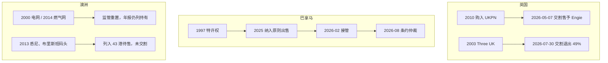
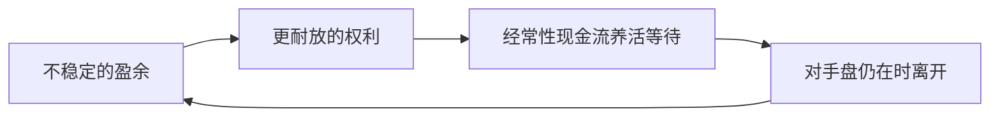
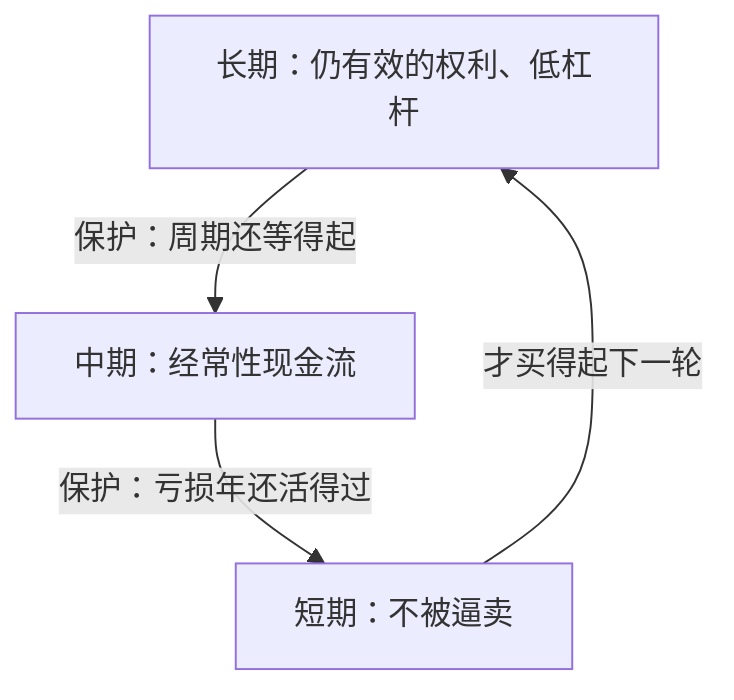

# 李嘉诚资本配置：形态转换、特许权与购买力

> 可带走的不是某一窗口里的港口或电网，而是三次转换：把不稳定的盈余换成更耐放的权利；用经常性现金流养活下一次等待；在对手盘仍在、权利不再耐放时离开。结构上是期限嵌套：**长期权利保护中期等待，中期现金流保护短期生存。** 事后看起来准的转换，当时桌上多已有卖方与相对价格；并非每一次都按计划完成。窗口写在当时的制度里，不能复制；可随身带的是三问——这是什么权利、代价是否留下余地、规则改了之后是否还有购买力。
>
> 年份、对价与持股以公司公告、年报与当代报道为准。截至 2026 年 8 月 24 日，全球港口出售与巴拿马仲裁仍为进行中事项。

## 摘要

李嘉诚（1928 年生）及后部长和系的主要交易，可按资本形态排列：1950 年代产业利润，1958 年起地产库存与 1972 年上市，1979 年取得和记黄埔控制权，1980–1990 年代增加电力、港口、能源，2000 年后零售与海外基建扩大，2013 年起物业减持，2015 年重组、2018 年交班，2025–2026 年英国电网与电讯交割、巴拿马港口争议与全球港口原则出售。

2025–2026 年三条地理线结果不同。英国：UK Power Networks（UKPN）于 2026 年 5 月 7 日交割售予 Engie，VodafoneThree 的 49% 于 2026 年 7 月 30 日交割。巴拿马：Balboa、Cristobal 于 2026 年 2 月被接管，长江和记实业（长和）于 2026 年 8 月 20 日提起投资条约仲裁。澳洲：SA Power Networks 等监管资产仍由长江基建持有；悉尼与布里斯班码头列入 2025 年 43 港待售范围，交易未交割。2026 年 7 月，彭博引述知情人士称，电讯、港口与零售出售或分拆完成后，部分元老高管预计退休；长和当时未予置评。港口交易与零售分拆仍为未决，不宜写成已经「清仓完成」。

公开材料并不支持「每一次转型都踩准」的写法。能核对的是：1979 年汇丰要出手问题洋行、1985 年置地要现金、2010 年英国出售监管电网、2013 年当事人已把地价说成不健康——当时桌上已有卖方与相对价格。中大范博宏等把 2013 年西移读成接班安排，而不只是抄顶抄底。巴拿马特许权终止说明权利可以被改写。

**关键词：** 资本配置；期限嵌套；购买力；特许权；卖方动机；相对价格

---

## 目录

- [摘要](#摘要)
1. [从产业利润到上市平台：1950–1978](#1-从产业利润到上市平台19501978)
2. [入主和记黄埔：1979–1981](#2-入主和记黄埔19791981)
3. [电力、港口与能源：1985–1999](#3-电力港口与能源19851999)
4. [零售扩张、海外基建与集团分拆：2000–2015](#4-零售扩张海外基建与集团分拆20002015)
5. [再平衡：2013–2026](#5-再平衡20132026)
6. [重大转型为何看起来准](#6-重大转型为何看起来准)
7. [公开表述与可核对交易](#7-公开表述与可核对交易)
8. [身份与资本形态年表](#8-身份与资本形态年表)
9. [启示：权利、代价与购买力](#9-启示权利代价与购买力)
10. [结语](#10-结语)
11. [参考文献](#11-参考文献)

---

## 1. 从产业利润到上市平台：1950–1978

### 1.1 长江塑胶厂

1950 年，22 岁的李嘉诚以约 5 万港元积蓄（含借款）创办长江塑胶厂，生产玩具与日用品。其时香港制造业扩张，欧美订单较多。

1957 年赴意大利考察后，在香港量产塑胶花，年销售额进入千万港元量级，当时报道称为「塑胶花大王」。其后收缩塑胶花，资金转向房地产。传记与基金业回顾多将此举写成对产能过剩或工业萧条的预判；本文只记业务收缩与资金去向，当时可见条件见第 6 节。[31]

### 1.2 地产扩张与长江实业上市

1958 年进入地产，在北角、元朗等地购入地皮，兴建工业大厦。

1967 年香港社会动荡，地产与股市下跌。传记口径常称地价较年初跌逾六成，部分外资与本地商家出售物业。1967–1970 年，在九龙、新界购入农地、荒地。

1972 年 11 月 1 日，长江实业（长实）在香港上市。发行价每股 3 港元，认购超额约 65 倍；当时披露的集资约三千余万港元，与后来流传的「募资 1.1 亿」不符。[15]

1977 年，长实中标中环、金钟地铁站上盖物业，对手包括置地。此后大型屋苑销售中使用低首付、分期付款。黄埔花园有时被记入本阶段：开发时间在入主和记黄埔、船坞换地之后，见第 3.2 节。

至 1978 年，公开记录中已有地产库存、上市地位，以及核心地段项目。1979 年和黄交易见下一节。

---

## 2. 入主和记黄埔：1979–1981

### 2.1 对价、折让与持股结构

和记黄埔（和黄）由和记企业与黄埔船坞于 1977 年合并。因经营问题，汇丰持有约 22% 股权。

1979 年 9 月 25 日，长江实业与汇丰达成协议：每股 7.1 港元，总值 **6.39 亿港元**，购入 9,000 万股，约占和黄 **22.4%**。须立即支付约 20%（约 1.2 亿港元），余款最长可延期两年。[4][5] 和黄当时市值约 60 亿港元；6.39 亿对应 22.4%，隐含整家公司约 28.5 亿，与按 60 亿市值收购全部股权不是同一笔账。媒体所称「蛇吞象」指控制权与资产规模的不对称，对价来自汇丰持股的折让与分期。

1980 年底，长实持有和黄约 41.7%。1981 年 1 月 1 日，李嘉诚出任和黄主席。[4] 此后港口、零售、电讯、能源、基建多经和黄或其后的长和报表披露。汇丰当时为什么卖、沈弼事后如何解释，见第 6.1 节。

### 2.2 屈臣氏：随控制权而来的零售资产

屈臣氏在入主前已是和黄体系内零售资产，不是 1981 年才从外部全资购入的小型药房。入主后被作为零售旗舰；跨国并购集中在 2000 年代，见第 4.1 节。

---

## 3. 电力、港口与能源：1985–1999

### 3.1 香港电灯

1985 年 1 月，和黄以约 **29.05 亿港元**现金，向置地购入港灯约 **34.6%** 股权（亦有 34.9% 的写法），成交价相对当时市价有折让，未触发全面收购。[4] 港灯供应港岛及南丫岛电力，收费受监管。其后相关权益经电能实业、长江基建持有。

### 3.2 黄埔花园

黄埔船坞为和黄资产。1984 年底与政府换地，1985 年船坞关闭，原址开发黄埔花园，1985–1991 年分期落成，88 座。传记口径称单项目获利超过 5 亿港元。时间上属于入主和黄之后，不属于 1970 年代上市前后。

### 3.3 赫斯基能源

1986 年油价下跌，WTI 一度在每桶十一美元上下。1986 年 12 月，和黄约 43%、李氏家族约 9%，合计约 52%，代价约 32 亿港元量级；其余由 Nova、加拿大帝国商业银行等持有。

持有初期赫斯基亏损。传记常称最高每日亏损约 500 万港元，并称油砂成本降至每桶 10 美元以下，两者均难以用单一年报钉死。1991 年再购 Nova 所持约 43%，代价约 2.17–3.25 亿加元，合计约 95%。[12] 2000 年在加拿大上市。2008 年油价一度超过每桶 140 美元；高油价年份营收可达二百余亿加元。媒体汇总称累计分红超过 80 亿美元，属长期持有口径，不是单笔买卖价差。

2021 年 1 月，赫斯基与 Cenovus **全股票合并**：股权价值约 38 亿加元，企业价值含债约 236 亿加元。合并后长和约 **15.7%**，李氏家族信托等合计约 **27%**。[11] 合并本身不是「套现约 135 亿人民币」的现金退出；其后减持 Cenovus 才形成现金。持股约 1986–2021 年。外界有「一生最重要的投资之一」的说法，出处为媒体或传记，不是年报科目。

### 3.4 内地港口与持有型物业

**盐田。** 1993 年 10 月，深圳东鹏实业与和记黄埔盐田港口投资成立盐田国际，合营五十年：深圳约 30%，和黄约 70%。注册资本 12 亿港元，工程总投资当时预计超过 50 亿元人民币。[6] 「斥资 60 亿入股」把工程投资与持股混写；公告口径是控股约七成、投资以数十亿元计。

**东方广场。** 1993 年前后东长安街 1 号地块，投资约 20 亿美元，总建筑面积约 80 万平方米。媒体报道 2003–2005 年在内地多个城市累计投入约 400 亿港元、购入超过 300 万平方米土地。2013 年后的出售见第 5.1 节。

### 3.5 巴拿马码头与港口网络

1997 年 1 月，巴拿马第 5 号法律批准 Panama Ports Company（PPC）经营太平洋侧 Balboa 与大西洋侧 Cristobal，首期 25 年，履约后可自动续约 25 年。和黄约 90%，巴拿马政府约 10%。2021 年 6 月，海事局确认续约至 2047 年。[16][22] 2025–2026 年进展见第 5.3 节。

其后网络包括内地、香港、英国、荷兰、比利时、巴拿马、巴哈马、澳洲等。英国 Felixstowe 为英国最大集装箱港之一；澳洲 Port Botany（悉尼）与布里斯班码头自 2013 年运营。

集团宣传曾称约占全球集装箱吞吐量一成。年报口径：约 **24 国、53 港**；2025 年吞吐量约 9,010 万标准箱。[2] 长和集团业务约 50 个国家或市场，与港口所在国数目不是同一口径。

---

## 4. 零售扩张、海外基建与集团分拆：2000–2015

### 4.1 屈臣氏的全球化与部分套现

2000 年英国 Savers，2002 年荷兰 Kruidvat，其后法国 Marionnaud 等；与 Rossmann 为合作或区域权益，公开材料不是「收购德国 Rossmann 全部」。1989 年北京开设内地屈臣氏；2011 年内地门店超过 1,000 家；内地健康美容门店高峰近 4,000 家。2024 年底 AS Watson 在 30 个市场约 16,951 家门店。[1]

2014 年 3 月，淡马锡认购 **24.95%**，约 **440 亿港元**，对应估值约 **1,770 亿港元**；和黄 75.05% 并保持控制权。[7] 2024 年长和零售收益 **1,901.93 亿港元**，占集团总收益 **4,766.82 亿港元的 40%**。[1] EBITDA 结构中，基建与电讯仍占独立柱。

### 4.2 英国公用事业与电讯

2010 年欧债危机后，英国出售部分受监管电、水、气、铁路资产。

**UKPN。** 2010 年 7 月 30 日不可撤销要约，**11 月 1 日交割**：长江基建 40%、香港电灯（后为电能实业）40%、李嘉诚基金会及海外基金会合计 20%，代价约 **57.75 亿英镑**，覆盖伦敦、英格兰东南及东部。[8][32] 约 830 万用户、约占英国电力分销四分之一，为后来口径。2026 年出售时披露的 20% 持有人为长实集团，与 2010 年基金会持股不是同一披露主体，中间调整以当时公告为准。2026 年 5 月 7 日交割售予 Engie，见第 5.2 节。

**水务与燃气。** 2011 年约 309 亿港元收购 Northumbrian Water。2012 年 Wales & West Utilities；另有 Northern Gas Networks。媒体「近 30% 天然气供应」为多项资产加总的宣传口径，单项公司达不到该比例。

**列车。** 2015 年 Eversholt Rail。英国客运列车租赁长期三家为主，Eversholt 约占其中约三成。

**电讯。** 和黄 2003 年在英国推出 Three UK。2015 年计划以 102.5 亿英镑收购 O2 英国，欧盟 2016 年否决；合并后份额将超过 40%。Three 单独用户份额长期约 10%–20%，不是 40%。2025 年 5 月 31 日与 Vodafone UK 合并为 VodafoneThree，长和 49%；该 49% 于 2026 年 7 月 30 日交割，见第 5.2 节。[13][20]

**Greene King。** 2019 年长实集团私有化，股本代价约 27 亿英镑（企业价值约 46 亿英镑，含承债），约 2,700 家网点，不是 2015 年交易。[14]

英国媒体「买下半个英国」为高峰期形容。可核对的分项包括：UKPN 约四分之一电力分销（至 2026 年 5 月交割）、燃气分销与供水、Felixstowe、以及后来并入 VodafoneThree 的移动网络。

**澳洲。** 2000 年南澳电网（今 SA Power Networks），2014 年 Australian Gas Networks；码头 2013 年进入悉尼与布里斯班。2025–2026 年见第 5.4 节。[21]

### 4.3 维港投资

维港投资（Horizons Ventures）由周凯旋等执掌，资金来自李嘉诚个人及基金会，不并入上市集团报表。2007 年投资 Facebook 时李嘉诚年近八旬。

**Facebook。** 2007–2008 年合计约 **1.2 亿美元**，按与微软同期约 **150 亿美元**估值，约 **0.8%**，与「估值 5 亿美元、持股 3%」不符。[9] 2012 年上市相对入股估值约六至七倍；其后高峰倍数视减持时点。「上市五倍、巅峰一百倍」混用了不同锚点。

**Zoom。** 2013 年维港领投 B 轮 650 万美元。[10] 媒体推算累计约 850 万美元、持股约 8.6%；2020 年市值一度超过 1,600 亿美元。倍数随稀释与退出变化。其他常被列举的项目包括 Siri（2010 年苹果收购）、DeepMind（2014 年谷歌收购）、Spotify、Skype 等。「未退出部分估值超 300 亿美元」为机构或媒体汇总，不是审计数字。

### 4.4 2015 年集团重组

重组前公告称，长实市值相对账面净资产折让约 23%，约 870 亿港元量级。[3] 2015 年 1 月 9 日宣布：长实与和黄合并为长江和记实业（长和），再分拆长江实业地产（后为长实集团）。长和非地产，长实集团地产。两家在开曼注册、香港上市，2015 年 3 月完成，宣布时前身合计市值超过 6,600 亿港元。李嘉诚当时否认「撤资」「变相迁册」，理由为重组、分派与法律安排；市场仍有争议。「释放超千亿股东价值」为愿景表述；公告可核对的是约两成折让、约八百余亿港元量级。

---

## 5. 再平衡：2013–2026

2013 年起内地与香港物业出售增多。当事人 2013 年 11 月已把香港与内地地价说成不健康；事后分析见第 6.2 节。2025–2026 年，英国部分项目已交割；巴拿马特许权终止后进入仲裁；澳洲监管网仍持有，码头在待售范围内。

下图对照英国、巴拿马、澳洲三条地理线。

*图 1　英国、巴拿马、澳洲三条地理线（截至 2026 年 8 月 24 日）。*

### 5.1 内地与香港物业减持

媒体常列：2013 年广州西城都荟、上海东方汇金，合计逾 120 亿港元；2014 年南京国际金融中心、北京盈科中心，合计逾 110 亿港元；2016 年上海陆家嘴世纪汇，约 230 亿港元；2018 年香港中环中心 75% 股权，约 402 亿港元。2013–2024 年加总，媒体常称超过 3,000 亿港元，不是单一公告数字。

### 5.2 英国电网与电讯交割

2026 年 2 月 25 日，长建 40%、电能实业 40%、长实集团 20% 协议将 UKPN 售予 Engie，**股本价值 105 亿英镑**，企业价值约 158 亿英镑。**2026 年 5 月 7 日交割**。[8][19] 2010 年购入约 57.75 亿英镑，持有约 15 年。买卖总价之比约 1.8 倍，与「六倍回报」不是同一口径（后者须另计杠杆与累计分红）。长建估计有效收益约 145 亿港元量级（含应占电能实业）。股东会上韩理生使用「cash is king」一语，见当时报道。[19]

VodafoneThree 于 2025 年 5 月 31 日成立，长和 49%。**2026 年 7 月 30 日交割**，现金 **43 亿英镑（约 454.7 亿港元）**。[13][20]

仍披露的英国资产包括 Northumbrian Water、Wales & West Utilities、Northern Gas Networks、Eversholt Rail、Greene King，以及列入港口待售范围的 Felixstowe 等。2024 年 8 月，长建牵头约 3.5 亿英镑购入 32 个陆上风电场、175 兆瓦。[14]

### 5.3 巴拿马特许权终止与港口待售

2025 年 3 月 4 日原则协议：[16]

- PPC 约 **90%**（Balboa、Cristobal）；
- 和记港口约 **80%** 有效权益，**43 港、199 泊位、23 国**，含 Felixstowe、悉尼、布里斯班等；
- **不含** 和记港口信托（香港、深圳及华南）及其他内地港口；
- 含巴拿马在内 100% 企业价值 **228 亿美元**；集团预期现金进账超过 **190 亿美元**。

公司称交易「纯属商业」。同期报道将交易置于美国对运河控制权的表态与中方反应之中；其后有中远海运参与谈判的报道。至 2026 年 8 月，整体交易未交割。

2026 年 1 月末，巴拿马最高法院裁定 1997 年特许及其 2021 年续约违宪；2 月下旬政府接管，Balboa 暂由马士基旗下 APM Terminals、Cristobal 暂由 MSC/TiL 运营。[17][18] PPC 合约仲裁索赔超过 20 亿美元。2026 年 8 月 20 日，长和提起投资条约仲裁，索赔超过 **15 亿美元（约 117 亿港元）**。[17] 两项合计，媒体约 **273 亿港元**，均为索赔额。法律程序通常以年计。有报道称买方寻求剔除巴拿马资产后完成其余港口交易，仍为未决。

### 5.4 澳洲监管网与码头

**监管能源网。** 1999 年 12 月，长建与港灯以约 32.5 亿澳元取得南澳 ETSA Utilities 最长 200 年经营管理权（后为 SA Power Networks）。[21] 2014 年约 141 亿港元（约 19.6 亿澳元）收购 Envestra，更名 Australian Gas Networks。Victoria Power Networks、United Energy 同组。2025–2026 年部分网络进入新监管周期，允许回报与资本开支上调；长建 2026 年中期仍将澳洲列为利润贡献并披露持有。[21]

**码头。** 2013 年起运营 Port Botany 与布里斯班，初期投资媒体报道逾 6 亿澳元量级；列入 2025 年 43 港待售范围，澳洲竞争监管机构表示关注，未交割。[16]

截至 2026 年 8 月：UKPN 已交割；澳洲电网仍持有；澳洲码头与 Felixstowe 在待售范围内；巴拿马码头待售未成，经营权已不在 PPC。

### 5.5 交班与高管换代

2018 年李嘉诚卸任长和、长实集团主席，李泽钜接任。重组在 2015 年。2025–2026 年港口原则出售、英国交割与巴拿马仲裁，由现任董事会与管理层披露。维港与基金会投资不并入上市集团合并报表。

长和 2025 年收益总额 **5,072.97 亿港元**，较 2024 年 4,766.82 亿港元增加 6%。[2] 零售、电讯、港口、基建仍是经常性收益的主要来源，不是「四大板块已经卖掉」后的空壳。

2026 年 7 月 16 日前后，彭博引述接近长和的投资人、银行家与商业伙伴称：在电讯、港口与零售的出售或分拆完成后，部分高级管理人员预计退休；由李泽钜挑选的新一代高管将负责监督出售所得的投放。若相关处置**全部完成**，交易总值可能至少 **410 亿美元**。长和当时未回应置评请求。[23]

同一报道可核对的分项如下，不宜把「预计」写成已经办理的退休手续：

| 人物 | 公开身份（报道时） | 彭博转述 |
|------|-------------------|----------|
| 霍建宁 | 74 岁；1979 年加入；2024 年卸任联席董事总经理，改任副主席兼电讯业务执行主席 | 预计在监督完成电讯剥离后退休 |
| 黎启明 | 72 岁；主管 AS Watson | 报道写明「仍在位」，不是已宣布与霍建宁一同退休 |
| 甘庆林 | 79 岁；李嘉诚姻兄，主管基建 | 同上，仍在位 |
| 董事会 | 多数任职逾三十年 | 彭博汇总：平均年龄约 69 岁，为恒指成分股中偏高者之一 |

霍建宁任内常被列举的电讯变现，除 2026 年 VodafoneThree 的 49% 外，还有 1999 年和黄出售英国 Orange——当代报道称代价约 200 亿英镑量级。[23] 2026 年 7 月 30 日电讯交割完成后，霍建宁以副主席兼电讯执行主席身份表示：交易变现了对 VodafoneThree 的投资，并向集团与股东返还价值，同时强化资产负债表、为下一步创造空间。[20] 退休本身截至 2026 年 8 月仍未见长和正式公告，正文按「彭博引述 + 公司未置评 + 电讯已交割」写。

410 亿美元是**条件加总**，不是已进账现金。已交割、可按公告核对的是：UKPN 股本价值 105 亿英镑（2026 年 5 月 7 日）、VodafoneThree 的 49% 现金 43 亿英镑（约 454.7 亿港元，2026 年 7 月 30 日）。彭博把英国电网写作约 140 亿美元，与 105 亿英镑股本、约 158 亿英镑企业价值不是同一口径。[8][19][20][23] 全球港口原则出售（预期现金进账逾 190 亿美元）与屈臣氏可能的上市（彭博称或筹资至少 20 亿美元）计入 410 亿美元时，二者在 2026 年 8 月均未完成。[16][23]

市场对下一步投放有猜测，包括向科技、生命健康或轻资产倾斜。可核对的既有布局是：维港投资为私人及基金会渠道；长江生命科技 2000 年成立、2002 年在港上市；和黄医药（后称 Hutchmed）2000 年由和黄创办，2019 年前后长和持股降至并表线以下。[10][24] 这与「2017 年注资 2 亿才成立生科平台」不符，也不能把某一消费单品的销售故事写成集团战略已经转向。下一步投向以日后公告为准。

### 5.6 公开评论与时机对照

若干节点在事后对照中，时间落在仍有对手盘或已经交割；港口与巴拿马说明并非每一笔都按计划完成。下面只并列 **2013 年后可核对结果** 与 **有名有姓的公开评论**。更早几次转型当时桌上有什么、事后如何被读，见第 6 节。不把评论写成「每一次转型都恰到好处」。

**表 1　2013 年后节点、结果与公开评论**

| 节点 | 可核对的结果 | 公开评论（出处） |
|------|--------------|------------------|
| 2013 年后内地与香港物业减持 | 多项出售发生在其后内地楼市进入调整之前；加总常为媒体口径，见第 5.1 节 | 当事人当时怎么说、范博宏与 Bloomberg 怎么读，见第 6.2 节；2015 年重组时李嘉诚否认撤资与变相迁册 [3] |
| UKPN 2010 购入、2026 交割 | 股本约 57.75 亿英镑 → 105 亿英镑，持有约 15 年并收取期间分红；买卖总价比约 1.8 倍 | 韩理生：集团起初无意出售，买方给出很有吸引力的报价；今日环境下 cash is king [19] |
| VodafoneThree 的 49% | 2026 年 7 月 30 日交割，现金 43 亿英镑 | 霍建宁：变现投资、返还股东价值、强化资产负债表 [20] |
| 全球港口原则出售 | 至 2026 年 8 月未交割；巴拿马码头已被接管并进入仲裁 | 彭博：交易因美中对战略资产的张力而搁置，完成仍需时间 [23] |
| 2026 年资产出售加总 | 已交割的是电网与英国电讯股权；410 亿美元含未完成项目 | Port Shelter Investment Management 创办人 Richard Harris：若业务卖掉，账上将有巨额现金，关键是如何动员、投向哪些行业；职责会随继任者是否到位而逐步移交 [23] |
| 高管换代 | 主席 2018 年已交李泽钜；霍建宁退休为彭博引述 | 威林资产 Vincent Lam：下一任可能更需要资本配置与股东回报能力，而不只是把经营规模做大；Natixis 吴卓殷：技术视野、地缘敏捷与风险敏感，在不确定环境中更关键 [23] |

已完成的英国两笔，时间落在买方仍在、对价可核验；2013 年后的物业减持，方向是大中华区物业占比下降，单项是否卖在最高点，年报无法逐笔证明。未完成的港口交易与巴拿马仲裁，不能写进「清仓成功」或「转型已经完成」。公开评论解释的是市场如何读这些节点，不是对「李嘉诚每一次都对」的裁决。

---

## 6. 重大转型为何看起来准

事后把塑胶花收缩、1967 年买地、1979 年和黄、1985 年港灯、2010 年英国电网、2013 年减持物业连在一起，容易读成「每一次都踩准」。公告、当代报道与有名有姓的分析给出的解释更窄：看起来准的转换，当时桌上多已有**愿意卖的对手**、**可以对照的相对价格**，以及自己**还没有被逼成卖方**。预言式的「看穿下一个十年」在年报里找不到。巴拿马特许权被接管，说明同一套权利在规则改写后可以失效。

### 6.1 当时桌上已经有卖方

**1979 年和黄。** *Time* 2005 年长文写明：汇丰因救助经营困难的和黄而持股约 22%；时任主席沈弼要把银行从殖民旧秩序，挪向能对接北京开放政策的华资。卖给李嘉诚，不是英资洋行之间的内部过户。[5] 沈弼事后的说法是：他选李嘉诚，是因为相信对方会成为香港最有钱的人；对价低于市价，且汇丰提供融资。[25] 买方看见的是折让与分期（约 20% 即付、余款最长两年）；卖方看见的是中国关系与出手问题资产。两边都不是在猜地产周期的下一个高点。

**1985 年港灯。** 置地当时需要现金，和黄以相对市价有折让、未触发全面收购的条件购入约 34.6%。[4] 可核对的主表资产是受监管电力股权，其后经电能实业、长江基建持有。原址换地、开发住宅是后续地产安排；基金业回顾常把收费权与换地开发写进同一条「远见」，本文分开记。[31]

**2010 年购入、2026 年售出 UKPN。** 2010 年 EDF 出售其英国配电资产（当时报道称用以减债），长建与港灯接盘。[32] 2026 年股东会上，长建韩理生称：集团起初无意出售，是买方给出很有吸引力的报价；今日环境下 cash is king。[19] 买入时有卖方，卖出时也有买方。两次都不是「先预言年份再成交」。

### 6.2 相对价格，不是绝对顶底

**2013 年减持。** 李嘉诚 2013 年 11 月接受南方报业专访时说：香港地价高、已看到不健康趋势，内地地价飞涨，投地不成功；高卖低买是正常商业行为。他同时用集团数字反驳「撤资」。[26] Bloomberg 当时把香港出售读成高峰信号，并指向欧洲——此前三年已花约 145 亿美元收购。[27] 《纽约时报》转述 *Week in China*：按相对价值，香港显得贵，欧盟资产因经济低迷而便宜。[28]

香港中文大学范博宏、钱梦吟 2013 年给出另一条读法：宏观高卖低买只是表面；更深的是接班——李嘉诚的政商人脉难以原样传给下一代，故把重心迁到法制较稳、职业经理人可运营的发达市场。他们对 2003 年 11 月至 2013 年 10 月和黄 65 笔重大资本运作做事件研究（披露日前后约 15 日）：除香港外的发达市场平均累计异常回报约 +2%，中国内地约 −1.5%；2010 年购入英国电网，长实与和黄超额收益均超过 2.8%；2013 年沪穗出售则实现了高抛（财务口径）。[29] 这是学术读法，不是李嘉诚本人的表述；与「撤资」政治叙事并列，不互相取消。

**2015 年重组。** 富昌证券连敬涵当时指出：长建、电能股价走势理想，地产业务拖累长实估值；分拆后估值更容易。[30] 公司口径是消除控股折让、现代化架构；李嘉诚否认撤资与变相迁册。[3]

### 6.3 自己当时不是卖方

1967 年社会动荡、1986 年油价下跌、2010 年欧债，记录里都有大额购入。能完成交易的前提是：当时自己手里有现金，负债没有把自己逼到必须卖的一侧。传记里的「人弃我取」，抽掉这一条，就只剩口号。2013 年减持时对手盘仍厚，与 1967 年买入时对面是卖方，是同一条纪律的两面：有购买力时才买得成；有对手盘时才卖得成。

### 6.4 并非每一次都准

全球港口原则出售至 2026 年 8 月未交割；巴拿马码头已被接管并进入仲裁。[16][17][23] 彭博把搁置归因于美中对战略资产的张力。已交割的是英国电网与电讯股权，不是「清仓完成」。把成功案例挑出来写成「每次都准」，是事后挑选。

**表 2　重大转型：当时可见的条件与事后读法**

| 转换 | 当时可看见的条件 | 有名有姓的读法 | 后来可核对的结果 |
|------|------------------|----------------|------------------|
| 塑胶花 → 地产 | 订单与产能；香港制造业周期 | 传记与基金业回顾常写成「赶在工业萧条前退出」；本文只记收缩与资金去向 [31] | 1958 年起地产库存；1972 年上市 |
| 1967–1970 买地 | 社会动荡，部分外资与本地商家出售 | 传记：「人弃我取」 | 其后地价回升；具体倍数随口径变化 |
| 1979 年和黄 | 汇丰持问题资产，要对接中国 | *Time*：沈弼的中国策略；沈弼：相信李会成为首富 [5][25] | 1981 年出任主席；港口、零售、电讯平台 |
| 1985 年港灯 | 置地要现金；折让；未全面收购 | 收费权与原址开发常被混写；本文分开记 [4][31] | 受监管电力长期持有；原址后续开发 |
| 1986 年赫斯基 | 油价下跌，卖方在 | 长期持有口径，不是单笔价差 | 约 34 年后换股并入 Cenovus |
| 2010 年 UKPN | 欧债后英国卖监管资产；EDF 减债 | 范博宏：发达市场事件回报为正 [29] | 2026 年交割，股本约 57.75 → 105 亿英镑 |
| 2013 年物业减持 | 地价已被说成不健康；欧洲资产相对便宜；接班在即 | 南都专访；Bloomberg 高峰信号；范博宏：传承与比较优势 [26][27][29] | 2013–2024 年媒体加总常称超过 3,000 亿港元，非单一公告 |
| 2015 年重组 | 控股折让约 23% | 连敬涵：估值更容易 [30] | 长和／长实分拆；迁册争议与公司否认并存 |
| 2025–2026 年港口 | 原则协议企业价值 228 亿美元 | 公司：纯属商业；彭博：地缘搁置 [16][23] | 至 2026 年 8 月未交割；巴拿马已被接管 |

读这张表，用三列分开：**当时能看见什么**、**后来谁怎么读**、**结果是否按计划完成**。把第二列写进第一列，就会把分析误当成当时的预言。

---

## 7. 公开表述与可核对交易

引语若无逐字出处，标为「常被归于」。资产负债率「恒低于 20%」「永远手握千亿」未见作为经审计的恒定承诺。下表是引语与交易的对照，不是对引语是否「正确」的裁决。

**表 3　公开表述与可核对交易**

| | 表述 | 可核对的记录 |
|--|------|----------------|
| 1 | 「先想风险，再想收益」（常被归于李嘉诚） | 1967、1986、2010 年仍能完成购入；集团长期强调现金与偏低负债 |
| 2 | 市场下跌时买入 | 1967–1970 年地产、1986 年赫斯基、2010 年 UKPN；卖方动机见当时报道 |
| 3 | 公用事业与零售压舱 | 电、水、气、港、屈臣氏为经常性收益；2024 年零售占长和收益 40%，EBITDA 另有基建与电讯柱 [1] |
| 4 | 「不赚最后一个铜板」（常被归于李嘉诚） | 塑胶花收缩、2013 年后物业出售、2026 年 UKPN 与 VodafoneThree 交割 |
| 5 | 多地布局 | 年报称业务约 50 个国家或市场；2026 年巴拿马特许权因判决与接管而中止，二者并列，前者不能自动抵销后者 |
| 6 | 长期持有 | 赫斯基约 34 年，港灯相关权益超过 40 年，UKPN 约 15 年；结束方式分别为换股合并、持续持有、协议出售 |
| 7 | 维港与上市集团分开 | 早期科技仓在私人及基金会渠道；上市集团主表仍为港口、零售、基建、电讯 |

---

## 8. 身份与资本形态年表

李嘉诚 1928 年生于潮州，少年赴港。下表只记公开身份与当时主要资本形态。

**表 4　身份与资本形态**

| 大约年岁 | 年份 | 公开身份 | 资本形态 |
|----------|------|----------|----------|
| 22 | 1950 | 长江塑胶厂创办人 | 产业利润 |
| 29–30 | 1957–1958 | 塑胶花业务后转向地产 | 土地库存 |
| 44 | 1972 | 长江实业上市 | 公众股本 |
| 51 | 1979 | 入主和黄 | 控股平台 |
| 57 | 1985 | 港灯大股东之一 | 受监管电力 |
| 69 | 1997 | PPC 特许权 | 运河两端码头 |
| 79 | 2007 | 维港相关投资人 | 未上市早期股权 |
| 86–87 | 2015–2018 | 重组；卸任主席 | 长和／长实地产分拆 |
| 96–97 | 2025–2026 | 非执行层面的家族控股背景 | 英国交割、巴拿马仲裁、港口待售 |

2025–2026 年英、美、中、巴拿马媒体将运河码头、电网与电讯放在地缘或监管语境中报道；1950 年代工厂与一般住宅开发较少出现在同一类报道里。

---

## 9. 启示：权利、代价与购买力

普通人买不起运河码头，也不必买。可带走的不是 1979 年的洋行、1997 年的特许或 2010 年的电网，而是记录里反复出现的转换方式。第 6 节说明：看起来准的转换，当时多已有卖方、相对价格与购买力；窗口属于他的时代。对照自己的收入、住房、职业与杠杆，只问三件事。

下图为三次转换的循环。

*图 2　三次转换：盈余 → 权利 → 等待 → 离场（读法，非操作建议）。*

### 9.1 先看见卖方，且自己不是卖方

1979 年汇丰要出手问题洋行，1985 年置地要现金，2010 年 EDF 要卖英国配电资产：买入侧当时已经有卖方。[5][4][32] 2013 年地价已被当事人说成不健康，2026 年 UKPN 是买方找上门：卖出侧当时已经有对手盘。[26][19] 1967、1986、2010 年能买成，前提是自己手里还有现金，没有被债务逼到必须卖的一侧。

两条合在一起，才是记录里反复出现的条件。抽掉「对面为什么卖」和「自己会不会被迫卖」，「人弃我取」就只剩口号。借满杠杆去模仿逆周期的人，周期真来时往往自己先成为卖方——买的权利还在别人的表上，自己已经出局。

### 9.2 长期层必须仍有效

记录里没有「长期保护中期」这句原话。能核对的是同一套报表上同时站着三种期限的东西，并且短的一层总是靠更长的一层才没有被平仓。

**长期**是还有效的权利：低杠杆留下的购买力、受监管的收费权、控股平台。它保护的不是收益率，而是**中期还能等**——赫斯基可以拿三十四年，UKPN 可以拿十五年，因为主表不会在底部被抽干。**中期**是经常性现金流：电、水、气、港、健康美容零售。它保护的是**短期还能活**——亏损年份不必卖出周期资产去补窟窿。**短期**是不被逼成卖方：现金、对手盘仍在时的可出售头寸。它保护的是下一次再配置。

方向不能反着叠。用当月工资去托一套押上全部积蓄的住房，是短期去托中期；再把住房押成杠杆去买更长的故事，是中期去赌长期。记录里的顺序相反。维港的早期仓是短期期权，放在私人小表上，正是因为上市集团的长期层与中期层已经先立住。

长期层也有失效的时候。巴拿马特许权被裁定违宪后，名义上的「长期」保护不了中期港口收益，更保护不了短期的交割预期。同一类特许权，2025–2026 年走出三条路：英国电网协议出售并交割；澳洲监管网在独立监管框架下继续持有；巴拿马码头被接管、转入仲裁。分散地理降低的是单一市场的经营周期，降低不了「这处位置是否被写进大国竞争」这一条。嵌套成立的前提是权利仍然有效；规则改了，三层一起失守。价格能等，规则不能赌。

下图为三层如何互相托住。箭头是保护关系，不是买卖顺序。

*图 3　期限嵌套：长期权利保护中期等待，中期现金流保护短期生存。*

### 9.3 对手盘仍在时离开；出门只带三问

塑胶花在同行涌入时收缩；2013 年后内地与香港物业在对手盘仍厚时卖出；UKPN 与 VodafoneThree 的 49% 在 2026 年交割。这些时点的共同点是：买方还在。一段行情最后两成最难赚，也最容易把已经实现的利润吐回去。记录给出的对照是：卖出时会觉得「早了」；觉得晚了的时候，往往已经没有对手盘。

1979 年汇丰折价让出洋行、1997 年立法授予运河特许、2010 年欧债后出售电网，都不会按原样重来。把这些窗口当成菜单，是读错了记录。读对了的人，出门只带三问。

**表 5　随身三问**

| 问 | 针对 | 落地 |
|----|------|------|
| 这是什么权利？ | 买的是产能、土地、收费权、资格，还是别人的情绪 | 先说清自己拿的是工资、房产、股权还是牌照，再说收益率 |
| 代价是否留下余地？ | 对价与杠杆是否让最坏情况仍能活过 | 下跌 30%–50% 之后，是否仍不必卖、仍能吃饭 |
| 规则改了还有没有购买力？ | 特许权可被主权或监管收回 | 城市政策、平台规则、行业牌照变了，生活是否只剩一条路 |

纪律可以从记录里辨认。窗口属于他的时代。读他，是为了在下一次等待来临前，看清自己拿的是哪一种权利，以及还买不买得起。

---

## 10. 结语

全文可收成四层。第一层是交易：时间、对价、持股、交割状态，以公告与年报为准，传记与媒体加总只作方向证据。第二层是当时的条件：卖方动机、相对价格、自己是否仍有购买力；范博宏、连敬涵、韩理生、Harris 等人的读法属于事后分析，不写成当时的预言。第三层是结构：下跌时买入、经常性收益与周期腿并存、对手盘仍在时离场、同一类特许权在不同法域走出不同结局。第四层是读法：三次转换、期限嵌套与随身三问。长期权利保护中期等待，中期现金流保护短期生存；方向不能反着叠，长期层失效则三层一起失守。并非每一次转型都按计划完成。

索赔额不等于已获赔偿；原则协议不等于已交割。彭博所称 410 亿美元与霍建宁等退休，在公司正式公告前只作「引述」，不写成已完成。2025–2026 年英国、巴拿马、澳洲三条线及高管安排，应继续按后续公告更新。

> **可核对的是记录。可对照的是结构。可带走的是嵌套与三问。**

---

## 11. 参考文献

正文编号对应下列文献。数字优先年报与交易所公告，其次通讯社与政府公报，再次传记与媒体加总。

1. CK Hutchison Holdings. *Annual Report 2024*. 零售收益 1,901.93 亿港元、集团总收益 4,766.82 亿港元、零售占比 40%. <https://www.ckh.com.hk/>
2. CK Hutchison Holdings. *Annual Report 2025*. 收益总额 5,072.97 亿港元（2024 年 4,766.82 亿）；Ports and Related Services：53 港、24 国；2025 年吞吐量 9,010 万 TEU. <https://www.ckh.com.hk/>
3. 长江实业、和记黄埔联合公告（2015-01-09）. 重组；控股折让约 23%.
4. 中文维基「和记黄埔」「李嘉诚」所引大事记. 1979 年和黄 22.4%、6.39 亿港元；1985 年港灯约 34.6%、约 29.05 亿港元.
5. *Time*（2005-08-06）, “The Other Handover”. 汇丰出售和黄约 22%、6.39 亿港元；沈弼要把银行对接北京开放政策与华资. <https://time.com/archive/6674252/the-other-handover/>
6. 广东省人民政府公报（1993 年第 9 期）. 盐田国际：注册资本 12 亿港元，工程投资预计超过 50 亿元人民币.
7. Cheung Kong / Hutchison 公告（2014-03-21）. 淡马锡 24.95%，约 440 亿港元，估值约 1,770 亿港元.
8. HKEX 公告（2026-02-26）；Engie 新闻稿（2026-02-25）. UKPN 2026 年股本价值 105 亿英镑、企业价值约 158 亿英镑；2010 年购入代价见 [32].
9. Reuters / Forbes. 2007 年 Facebook：约 1.2 亿美元、约 0.8%、估值约 150 亿美元.
10. Zoom Video Communications 新闻稿（2013-09-24）. 维港领投 B 轮 650 万美元.
11. Reuters, GlobeNewswire, Bloomberg（2020-10）. Husky–Cenovus 全股票合并；长和约 15.7%，李氏及相关合计约 27%.
12. *New York Times* / IHT（1991-10-24）. 再购 Husky 约 43% 至约 95%.
13. CK Hutchison / Vodafone（2025-06-02）. VodafoneThree 成立，51 / 49.
14. SCMP（2019-08-20；2024-08-14）. Greene King；英国 32 个陆上风电场、3.5 亿英镑、175 MW.
15. 中新网等. 长实 1972 年上市超额认购约 65 倍，集资约三千余万港元.
16. CK Hutchison 与 BlackRock-TiL 原则协议（2025-03-04）. PPC 90%；43 港之 80%；企业价值 228 亿美元；预期进账逾 190 亿美元.
17. SCMP（2026-08-20）；长和声明. 投资条约仲裁索赔逾 15 亿美元（约 117 亿港元）.
18. Reuters（2026-02；2026-03）. 巴拿马接管；PPC 合约仲裁索赔逾 20 亿美元.
19. Engie 新闻稿（2026-05-07）；London Power Networks PLC RNS；*The Standard*（2026-04-27）. UKPN 于 2026 年 5 月 7 日完成交割；股东会上韩理生称集团起初无意出售、买方报价有吸引力，并称今日环境下 cash is king. <https://www.thestandard.com.hk/finance/article/330421/CKI-led-consortiums-disposal-of-UK-Power-Networks-for-168b-approved-by-shareholders>
20. CK Hutchison 新闻稿（2026-07-30）. VodafoneThree 之 49% 交割，现金 43 亿英镑（约 454.7 亿港元）.
21. 长建公告（1999-12-14；2015-02-25）；2026 年中期业绩. SA Power Networks；2014 年 Envestra / AGN；监管重置.
22. 巴拿马第 5 号法律（1997）；Seatrade / 巴拿马海事局（2021-06）. 25 年 + 续约至 2047 年；政府持股 10%.
23. Bloomberg（2026-07-16），转载于 *The Star* / 香港 01 / 信报. 电讯、港口、零售出售或分拆完成后部分高管预计退休；霍建宁预计在电讯剥离完成后退休；黎启明、甘庆林报道时仍在位；董事会平均年龄约 69 岁；若处置全部完成交易总值或至少 410 亿美元；长和未置评；Richard Harris、Vincent Lam、Gary Ng 评论；屈臣氏或考虑上市筹资至少 20 亿美元. <https://www.thestar.com.my/business/business-news/2026/07/16/li-ka-shings-cash-out-plan-sets-stage-for-leadership-shift>
24. Hutchmed / CK Life Sciences 公开披露. 和黄医药 2000 年由和记黄埔创办；长江生命科技 2000 年成立、2002 年在港上市.
25. Ben Kwok, *Asia Times*（2017-07-11）. 沈弼选李嘉诚因相信其将成为香港首富；对价低于市价，汇丰提供融资. <https://asiatimes.com/2017/07/lord-sandberg-faithful-friend-real-estate-tycoons/>
26. 《南方都市报》（2013-11-28），新浪转载. 【谈楼市】香港地价高、已看到不健康的趋势，内地地价飞涨，无法成功投得土地；【谈撤资】高卖低买本来就是正常的商业行为. <http://finance.sina.com.cn/leadership/crz/20131128/052017459752.shtml>
27. Bloomberg（2013-10-23）, “Li’s Hong Kong Sales Signal Peak as European Growth Beckons”. 香港出售被读成高峰信号；此前三年欧洲收购约 145 亿美元；零售与港灯拆分或筹资至多约 180 亿美元.
28. *New York Times* Sinosphere（2013-10-22）. 转述 *Week in China*：按相对价值香港显得贵，欧盟资产因经济低迷而便宜. <https://archive.nytimes.com/sinosphere.blogs.nytimes.com/2013/10/22/sales-spur-talk-of-hong-kongs-superman-turning-sights-to-europe/>
29. 范博宏、钱梦吟. 「李嘉诚资产腾挪背后的传承逻辑」. *新财富* 2013 年 12 月. 香港中文大学经济及金融研究所. 2003–2013 年和黄 65 笔重大资本运作事件研究；发达市场平均累计异常回报约 +2%，内地等发展中市场为负；读法为接班与比较优势，而不只是宏观抄顶抄底. <https://cuhk.edu.hk/ief/josephfan/doc/new_fortune/2013.12.pdf>
30. 富昌证券连敬涵，转引自中央人民政府驻澳门特别行政区联络办公室（2015-01-12）. 长建、电能走势理想，地产业务拖累长实；分拆后估值更容易. <https://www.zlb.gov.cn/2015-01/12/c_127377999.htm>
31. 华夏基金「恒指故事」回顾（约 2012）. 塑胶转地产常被写成赶在工业萧条前退出；港灯收购与鸭脷洲等原址屋苑开发常被并写（该文「海逸半岛」为通行名「海怡半岛」之误植）. <https://www.chinaamc.com/portal/cn/hxxc/2012/hzzt/list_3_1.html>
32. 长江基建、香港电灯新闻稿（2010-11-01）. 2010 年 7 月 30 日不可撤销要约，11 月 1 日完成购入 EDF 英国配电资产，代价 57.75 亿英镑；长建 40%、港灯 40%、李嘉诚基金会及海外基金会合计 20%. <https://cki.com.hk/english/whatsNew/2010/20101101_1.htm>
