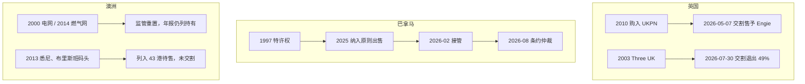
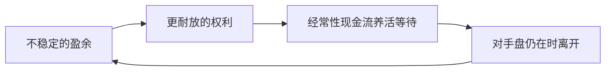
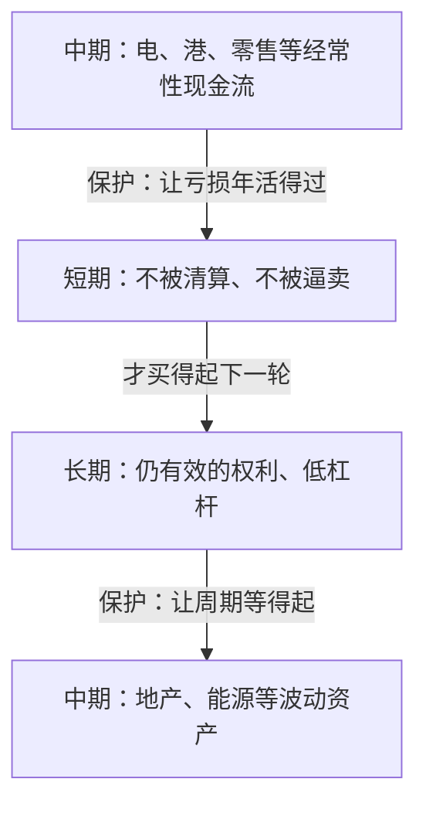

# 李嘉诚资本配置：形态转换、特许权与购买力

> 可带走的不是某一窗口里的港口或电网，而是三次转换：把不稳定的盈余换成更耐放的权利；用经常性现金流养活下一次等待；在对手盘仍在、权利不再耐放时离开。结构上是期限嵌套：**长期权利保护中期等待，中期现金流保护短期生存。** 窗口写在当时的制度里，不能复制；可随身带的是三问——这是什么权利、代价是否留下余地、规则改了之后是否还有购买力。
>
> 年份、对价与持股以公司公告、年报与当代报道为准。截至 2026 年 8 月 21 日，全球港口出售与巴拿马仲裁仍为进行中事项。

## 摘要

李嘉诚（1928 年生）及后部长和系的主要交易，可按资本形态排列：1950 年代产业利润，1958 年起地产库存与 1972 年上市，1979 年取得和记黄埔控制权，1980–1990 年代增加电力、港口、能源，2000 年后零售与海外基建扩大，2013 年起物业减持，2015 年重组、2018 年交班，2025–2026 年英国电网与电讯交割、巴拿马港口争议与全球港口原则出售。

2025–2026 年三条地理线结果不同。英国：UK Power Networks（UKPN）于 2026 年 5 月 7 日交割售予 Engie，VodafoneThree 的 49% 于 2026 年 7 月 30 日交割。巴拿马：Balboa、Cristobal 于 2026 年 2 月被接管，长江和记实业（长和）于 2026 年 8 月 20 日提起投资条约仲裁。澳洲：SA Power Networks 等监管资产仍由长江基建持有；悉尼与布里斯班码头列入 2025 年 43 港待售范围，交易未交割。

**关键词：** 资本配置；期限嵌套；购买力；特许权；巴拿马港口；UK Power Networks

---

## 目录

- [摘要](#摘要)
1. [从产业利润到上市平台：1950–1978](#1-从产业利润到上市平台19501978)
2. [入主和记黄埔：1979–1981](#2-入主和记黄埔19791981)
3. [电力、港口与能源：1985–1999](#3-电力港口与能源19851999)
4. [零售扩张、海外基建与集团分拆：2000–2015](#4-零售扩张海外基建与集团分拆20002015)
5. [再平衡：2013–2026](#5-再平衡20132026)
6. [公开表述与可核对交易](#6-公开表述与可核对交易)
7. [身份与资本形态年表](#7-身份与资本形态年表)
8. [启示：权利、代价与购买力](#8-启示权利代价与购买力)
9. [结语](#9-结语)
10. [参考文献](#10-参考文献)

---

## 1. 从产业利润到上市平台：1950–1978

### 1.1 长江塑胶厂

1950 年，22 岁的李嘉诚以约 5 万港元积蓄（含借款）创办长江塑胶厂，生产玩具与日用品。其时香港制造业扩张，欧美订单较多。

1957 年赴意大利考察后，在香港量产塑胶花，年销售额进入千万港元量级，当时报道称为「塑胶花大王」。其后收缩塑胶花，资金转向房地产。传记多将此举写成对产能过剩的预判；本文只记业务收缩与资金去向。

### 1.2 地产扩张与长江实业上市

1958 年进入地产，在北角、元朗等地购入地皮，兴建工业大厦。

1967 年香港社会动荡，地产与股市下跌。传记口径常称地价较年初跌逾六成，部分外资与本地商家出售物业。1967–1970 年，在九龙、新界购入农地、荒地。

1972 年 11 月 1 日，长江实业（长实）在香港上市。发行价每股 3 港元，认购超额约 65 倍；当时披露的集资约三千余万港元，与后来流传的「募资 1.1 亿」不符。[15]

1977 年，长实中标中环、金钟地铁站上盖物业，对手包括置地。此后大型屋苑销售中使用低首付、分期付款。黄埔花园有时被记入本阶段：开发时间在入主和记黄埔、船坞换地之后，见第 3.2 节。

至 1978 年，公开记录中已有地产库存、上市地位，以及核心地段项目。1979 年和黄交易见下一节。

---

## 2. 入主和记黄埔：1979–1981

### 2.1 对价、折让与持股结构

和记黄埔（和黄）由和记企业与黄埔船坞于 1977 年合并。因经营问题，汇丰持有约 22% 股权。

1979 年 9 月 25 日，长江实业与汇丰达成协议：每股 7.1 港元，总值 **6.39 亿港元**，购入 9,000 万股，约占和黄 **22.4%**。须立即支付约 20%（约 1.2 亿港元），余款最长可延期两年。[4][5] 和黄当时市值约 60 亿港元；6.39 亿对应 22.4%，隐含整家公司约 28.5 亿，与按 60 亿市值收购全部股权不是同一笔账。媒体所称「蛇吞象」指控制权与资产规模的不对称，对价来自汇丰持股的折让与分期。

1980 年底，长实持有和黄约 41.7%。1981 年 1 月 1 日，李嘉诚出任和黄主席。[4] 此后港口、零售、电讯、能源、基建多经和黄或其后的长和报表披露。

### 2.2 屈臣氏：随控制权而来的零售资产

屈臣氏在入主前已是和黄体系内零售资产，不是 1981 年才从外部全资购入的小型药房。入主后被作为零售旗舰；跨国并购集中在 2000 年代，见第 4.1 节。

---

## 3. 电力、港口与能源：1985–1999

### 3.1 香港电灯

1985 年 1 月，和黄以约 **29.05 亿港元**现金，向置地购入港灯约 **34.6%** 股权（亦有 34.9% 的写法），成交价相对当时市价有折让，未触发全面收购。[4] 港灯供应港岛及南丫岛电力，收费受监管。其后相关权益经电能实业、长江基建持有。

### 3.2 黄埔花园

黄埔船坞为和黄资产。1984 年底与政府换地，1985 年船坞关闭，原址开发黄埔花园，1985–1991 年分期落成，88 座。传记口径称单项目获利超过 5 亿港元。时间上属于入主和黄之后，不属于 1970 年代上市前后。

### 3.3 赫斯基能源

1986 年油价下跌，WTI 一度在每桶十一美元上下。1986 年 12 月，和黄约 43%、李氏家族约 9%，合计约 52%，代价约 32 亿港元量级；其余由 Nova、加拿大帝国商业银行等持有。

持有初期赫斯基亏损。传记常称最高每日亏损约 500 万港元，并称油砂成本降至每桶 10 美元以下，两者均难以用单一年报钉死。1991 年再购 Nova 所持约 43%，代价约 2.17–3.25 亿加元，合计约 95%。[12] 2000 年在加拿大上市。2008 年油价一度超过每桶 140 美元；高油价年份营收可达二百余亿加元。媒体汇总称累计分红超过 80 亿美元，属长期持有口径，不是单笔买卖价差。

2021 年 1 月，赫斯基与 Cenovus **全股票合并**：股权价值约 38 亿加元，企业价值含债约 236 亿加元。合并后长和约 **15.7%**，李氏家族信托等合计约 **27%**。[11] 合并本身不是「套现约 135 亿人民币」的现金退出；其后减持 Cenovus 才形成现金。持股约 1986–2021 年。外界有「一生最重要的投资之一」的说法，出处为媒体或传记，不是年报科目。

### 3.4 内地港口与持有型物业

**盐田。** 1993 年 10 月，深圳东鹏实业与和记黄埔盐田港口投资成立盐田国际，合营五十年：深圳约 30%，和黄约 70%。注册资本 12 亿港元，工程总投资当时预计超过 50 亿元人民币。[6] 「斥资 60 亿入股」把工程投资与持股混写；公告口径是控股约七成、投资以数十亿元计。

**东方广场。** 1993 年前后东长安街 1 号地块，投资约 20 亿美元，总建筑面积约 80 万平方米。媒体报道 2003–2005 年在内地多个城市累计投入约 400 亿港元、购入超过 300 万平方米土地。2013 年后的出售见第 5.1 节。

### 3.5 巴拿马码头与港口网络

1997 年 1 月，巴拿马第 5 号法律批准 Panama Ports Company（PPC）经营太平洋侧 Balboa 与大西洋侧 Cristobal，首期 25 年，履约后可自动续约 25 年。和黄约 90%，巴拿马政府约 10%。2021 年 6 月，海事局确认续约至 2047 年。[16][22] 2025–2026 年进展见第 5.3 节。

其后网络包括内地、香港、英国、荷兰、比利时、巴拿马、巴哈马、澳洲等。英国 Felixstowe 为英国最大集装箱港之一；澳洲 Port Botany（悉尼）与布里斯班码头自 2013 年运营。

集团宣传曾称约占全球集装箱吞吐量一成。年报口径：约 **24 国、53 港**；2025 年吞吐量约 9,010 万标准箱。[2] 长和集团业务约 50 个国家或市场，与港口所在国数目不是同一口径。

---

## 4. 零售扩张、海外基建与集团分拆：2000–2015

### 4.1 屈臣氏的全球化与部分套现

2000 年英国 Savers，2002 年荷兰 Kruidvat，其后法国 Marionnaud 等；与 Rossmann 为合作或区域权益，公开材料不是「收购德国 Rossmann 全部」。1989 年北京开设内地屈臣氏；2011 年内地门店超过 1,000 家；内地健康美容门店高峰近 4,000 家。2024 年底 AS Watson 在 30 个市场约 16,951 家门店。[1]

2014 年 3 月，淡马锡认购 **24.95%**，约 **440 亿港元**，对应估值约 **1,770 亿港元**；和黄 75.05% 并保持控制权。[7] 2024 年长和零售收益 **1,901.93 亿港元**，占集团总收益 **4,766.82 亿港元的 40%**。[1] EBITDA 结构中，基建与电讯仍占独立柱。

### 4.2 英国公用事业与电讯

2010 年欧债危机后，英国出售部分受监管电、水、气、铁路资产。

**UKPN。** 2010 年，长江基建、电能实业、长实以约 **57.7 亿英镑**购入全部股权，覆盖伦敦、英格兰东南及东部，约 830 万用户，约占英国电力分销四分之一。[8] 2026 年 5 月 7 日交割售予 Engie，见第 5.2 节。

**水务与燃气。** 2011 年约 309 亿港元收购 Northumbrian Water。2012 年 Wales & West Utilities；另有 Northern Gas Networks。媒体「近 30% 天然气供应」为多项资产加总的宣传口径，单项公司达不到该比例。

**列车。** 2015 年 Eversholt Rail。英国客运列车租赁长期三家为主，Eversholt 约占其中约三成。

**电讯。** 和黄 2003 年在英国推出 Three UK。2015 年计划以 102.5 亿英镑收购 O2 英国，欧盟 2016 年否决；合并后份额将超过 40%。Three 单独用户份额长期约 10%–20%，不是 40%。2025 年 5 月 31 日与 Vodafone UK 合并为 VodafoneThree，长和 49%；该 49% 于 2026 年 7 月 30 日交割，见第 5.2 节。[13][20]

**Greene King。** 2019 年长实集团私有化，股本代价约 27 亿英镑（企业价值约 46 亿英镑，含承债），约 2,700 家网点，不是 2015 年交易。[14]

英国媒体「买下半个英国」为高峰期形容。可核对的分项包括：UKPN 约四分之一电力分销（至 2026 年 5 月交割）、燃气分销与供水、Felixstowe、以及后来并入 VodafoneThree 的移动网络。

**澳洲。** 2000 年南澳电网（今 SA Power Networks），2014 年 Australian Gas Networks；码头 2013 年进入悉尼与布里斯班。2025–2026 年见第 5.4 节。[21]

### 4.3 维港投资

维港投资（Horizons Ventures）由周凯旋等执掌，资金来自李嘉诚个人及基金会，不并入上市集团报表。2007 年投资 Facebook 时李嘉诚年近八旬。

**Facebook。** 2007–2008 年合计约 **1.2 亿美元**，按与微软同期约 **150 亿美元**估值，约 **0.8%**，与「估值 5 亿美元、持股 3%」不符。[9] 2012 年上市相对入股估值约六至七倍；其后高峰倍数视减持时点。「上市五倍、巅峰一百倍」混用了不同锚点。

**Zoom。** 2013 年维港领投 B 轮 650 万美元。[10] 媒体推算累计约 850 万美元、持股约 8.6%；2020 年市值一度超过 1,600 亿美元。倍数随稀释与退出变化。其他常被列举的项目包括 Siri（2010 年苹果收购）、DeepMind（2014 年谷歌收购）、Spotify、Skype 等。「未退出部分估值超 300 亿美元」为机构或媒体汇总，不是审计数字。

### 4.4 2015 年集团重组

重组前公告称，长实市值相对账面净资产折让约 23%，约 870 亿港元量级。[3] 2015 年 1 月 9 日宣布：长实与和黄合并为长江和记实业（长和），再分拆长江实业地产（后为长实集团）。长和非地产，长实集团地产。两家在开曼注册、香港上市，2015 年 3 月完成，宣布时前身合计市值超过 6,600 亿港元。李嘉诚当时否认「撤资」「变相迁册」，理由为重组、分派与法律安排；市场仍有争议。「释放超千亿股东价值」为愿景表述；公告可核对的是约两成折让、约八百余亿港元量级。

---

## 5. 再平衡：2013–2026

2013 年起内地与香港物业出售增多。2025–2026 年，英国部分项目已交割；巴拿马特许权终止后进入仲裁；澳洲监管网仍持有，码头在待售范围内。

下图对照英国、巴拿马、澳洲三条地理线。

*图 1　英国、巴拿马、澳洲三条地理线（截至 2026 年 8 月 21 日）。*

### 5.1 内地与香港物业减持

媒体常列：2013 年广州西城都荟、上海东方汇金，合计逾 120 亿港元；2014 年南京国际金融中心、北京盈科中心，合计逾 110 亿港元；2016 年上海陆家嘴世纪汇，约 230 亿港元；2018 年香港中环中心 75% 股权，约 402 亿港元。2013–2024 年加总，媒体常称超过 3,000 亿港元，不是单一公告数字。

### 5.2 英国电网与电讯交割

2026 年 2 月 25 日，长建 40%、电能实业 40%、长实集团 20% 协议将 UKPN 售予 Engie，**股本价值 105 亿英镑**，企业价值约 158 亿英镑。**2026 年 5 月 7 日交割**。[8][19] 2010 年购入约 57.7 亿英镑，持有约 15 年。买卖总价之比约 1.8 倍，与「六倍回报」不是同一口径（后者须另计杠杆与累计分红）。长建估计有效收益约 145 亿港元量级（含应占电能实业）。股东会上韩理生使用「cash is king」一语，见当时报道。

VodafoneThree 于 2025 年 5 月 31 日成立，长和 49%。**2026 年 7 月 30 日交割**，现金 **43 亿英镑（约 454.7 亿港元）**。[13][20]

仍披露的英国资产包括 Northumbrian Water、Wales & West Utilities、Northern Gas Networks、Eversholt Rail、Greene King，以及列入港口待售范围的 Felixstowe 等。2024 年 8 月，长建牵头约 3.5 亿英镑购入 32 个陆上风电场、175 兆瓦。[14]

### 5.3 巴拿马特许权终止与港口待售

2025 年 3 月 4 日原则协议：[16]

- PPC 约 **90%**（Balboa、Cristobal）；
- 和记港口约 **80%** 有效权益，**43 港、199 泊位、23 国**，含 Felixstowe、悉尼、布里斯班等；
- **不含** 和记港口信托（香港、深圳及华南）及其他内地港口；
- 含巴拿马在内 100% 企业价值 **228 亿美元**；集团预期现金进账超过 **190 亿美元**。

公司称交易「纯属商业」。同期报道将交易置于美国对运河控制权的表态与中方反应之中；其后有中远海运参与谈判的报道。至 2026 年 8 月，整体交易未交割。

2026 年 1 月末，巴拿马最高法院裁定 1997 年特许及其 2021 年续约违宪；2 月下旬政府接管，Balboa 暂由马士基旗下 APM Terminals、Cristobal 暂由 MSC/TiL 运营。[17][18] PPC 合约仲裁索赔超过 20 亿美元。2026 年 8 月 20 日，长和提起投资条约仲裁，索赔超过 **15 亿美元（约 117 亿港元）**。[17] 两项合计，媒体约 **273 亿港元**，均为索赔额。法律程序通常以年计。有报道称买方寻求剔除巴拿马资产后完成其余港口交易，仍为未决。

### 5.4 澳洲监管网与码头

**监管能源网。** 1999 年 12 月，长建与港灯以约 32.5 亿澳元取得南澳 ETSA Utilities 最长 200 年经营管理权（后为 SA Power Networks）。[21] 2014 年约 141 亿港元（约 19.6 亿澳元）收购 Envestra，更名 Australian Gas Networks。Victoria Power Networks、United Energy 同组。2025–2026 年部分网络进入新监管周期，允许回报与资本开支上调；长建 2026 年中期仍将澳洲列为利润贡献并披露持有。[21]

**码头。** 2013 年起运营 Port Botany 与布里斯班，初期投资媒体报道逾 6 亿澳元量级；列入 2025 年 43 港待售范围，澳洲竞争监管机构表示关注，未交割。[16]

截至 2026 年 8 月：UKPN 已交割；澳洲电网仍持有；澳洲码头与 Felixstowe 在待售范围内；巴拿马码头待售未成，经营权已不在 PPC。

### 5.5 交班与信息披露主体

2018 年李嘉诚卸任长和、长实集团主席，李泽钜接任。重组在 2015 年。2025–2026 年港口原则出售、英国交割与巴拿马仲裁，由现任董事会与管理层披露。维港与基金会投资不在上市集团合并报表内。

---

## 6. 公开表述与可核对交易

引语若无逐字出处，标为「常被归于」。资产负债率「恒低于 20%」「永远手握千亿」未见作为经审计的恒定承诺。下表是引语与交易的对照，不是对引语是否「正确」的裁决。

**表 1　公开表述与可核对交易**

| | 表述 | 可核对的记录 |
|--|------|----------------|
| 1 | 「先想风险，再想收益」（常被归于李嘉诚） | 1967、1986、2010 年仍能完成购入；集团长期强调现金与偏低负债 |
| 2 | 市场下跌时买入 | 1967–1970 年地产、1986 年赫斯基、2010 年 UKPN；卖方动机见当时报道 |
| 3 | 公用事业与零售压舱 | 电、水、气、港、屈臣氏为经常性收益；2024 年零售占长和收益 40%，EBITDA 另有基建与电讯柱 [1] |
| 4 | 「不赚最后一个铜板」（常被归于李嘉诚） | 塑胶花收缩、2013 年后物业出售、2026 年 UKPN 与 VodafoneThree 交割 |
| 5 | 多地布局 | 年报称业务约 50 个国家或市场；2026 年巴拿马特许权因判决与接管而中止，二者并列，前者不能自动抵销后者 |
| 6 | 长期持有 | 赫斯基约 34 年，港灯相关权益超过 40 年，UKPN 约 15 年；结束方式分别为换股合并、持续持有、协议出售 |
| 7 | 维港与上市集团分开 | 早期科技仓在私人及基金会渠道；上市集团主表仍为港口、零售、基建、电讯 |

---

## 7. 身份与资本形态年表

李嘉诚 1928 年生于潮州，少年赴港。下表只记公开身份与当时主要资本形态。

**表 2　身份与资本形态**

| 大约年岁 | 年份 | 公开身份 | 资本形态 |
|----------|------|----------|----------|
| 22 | 1950 | 长江塑胶厂创办人 | 产业利润 |
| 29–30 | 1957–1958 | 塑胶花业务后转向地产 | 土地库存 |
| 44 | 1972 | 长江实业上市 | 公众股本 |
| 51 | 1979 | 入主和黄 | 控股平台 |
| 57 | 1985 | 港灯大股东之一 | 受监管电力 |
| 69 | 1997 | PPC 特许权 | 运河两端码头 |
| 79 | 2007 | 维港相关投资人 | 未上市早期股权 |
| 86–87 | 2015–2018 | 重组；卸任主席 | 长和／长实地产分拆 |
| 96–97 | 2025–2026 | 非执行层面的家族控股背景 | 英国交割、巴拿马仲裁、港口待售 |

2025–2026 年英、美、中、巴拿马媒体将运河码头、电网与电讯放在地缘或监管语境中报道；1950 年代工厂与一般住宅开发较少出现在同一类报道里。

---

## 8. 启示：权利、代价与购买力

普通人买不起运河码头，也不必买。可带走的不是 1979 年的洋行、1997 年的特许或 2010 年的电网，而是记录里反复出现的转换方式。窗口写在当时的制度与卖方里；转换方式可以对照自己的收入、住房、职业与杠杆。它不告诉下一笔该买什么，只问：你手里拿的是利润、库存，还是一条可能被改写的规则。

下图为三次转换的循环。

*图 2　三次转换：盈余 → 权利 → 等待 → 离场（读法，非操作建议）。*

### 8.1 盈余向权利的转换

塑胶花利润换成土地，土地换成上市平台，平台换成洋行控制权，控制权再换成电、港、油与零售收费。每一步看起来像「转行成功」，账上做的是同一件事：把容易过时的经营利润，迁成下一阶段更不容易一夜消失的索取权。对个人，对应物不是去买港口，而是问：工资与技能溢价，有没有迁成可以部分独立于当前雇主、当前城市、当前平台的东西——技能本身、可出租的权益、可分散的股权、制度内的公积金与指数化资产。迁得越晚，下一次等待越被动。消费可以把盈余花光；单一房价可以把盈余冻在一个城市的一条规则上。两者都完成了「转换」，只是耐放程度不同。

### 8.2 期限嵌套：长期保护中期，中期保护短期

记录里没有「长期保护中期」这句原话。能核对的是同一套报表上同时站着三种期限的东西，并且短的一层总是靠更长的一层才没有被平仓。

**长期**是还有效的权利：低杠杆留下的购买力、受监管的收费权、控股平台。它保护的不是收益率，而是**中期还能等**——赫斯基可以拿三十四年，UKPN 可以拿十五年，因为主表不会在底部被抽干。**中期**是经常性现金流：电、水、气、港、健康美容零售。它保护的是**短期还能活**——亏损年份不必卖出周期资产去补窟窿。**短期**是不被逼成卖方：现金、对手盘仍在时的可出售头寸。它保护的是下一次再配置——1967、1986、2010 年能买，是因为当时自己不是卖方。

方向不能反着叠。用当月工资去「保护」一套押上全部积蓄的周期资产，是短期去托中期；再把中期住房押成杠杆去买更长的故事，是中期去赌长期。记录里的顺序相反：先有长期层还在，中期才等得起；先有中期现金进账，短期才亏得起。维港的早期仓是短期期权，放在私人小表上，正是因为上市集团的长期层与中期层已经先立住。

长期层也有失效的时候。巴拿马特许权被裁定违宪后，名义上的「长期」保护不了中期港口收益，更保护不了短期的交割预期。嵌套成立的前提是权利仍然有效；规则改了，三层一起失守。所以长期必须是规则仍可能成立的权利，不是把持有年限写得很长就算长期。

下图为三层如何互相托住。箭头是保护关系，不是买卖顺序。

*图 3　期限嵌套：长期保护中期等待，中期现金流保护短期生存。*

对个人，三层可以对账，而不必去买码头。长期层是低杠杆、可迁移的技能与分散的索取权；中期层是经常性收入与能够覆盖数年等待的储备；短期层是当月开支与三年内必须动用的钱不进周期仓。缺长期层，中期一套住房就会变成生存底线；缺中期层，短期风口会把应急金吃光；缺短期层，再好的长期权利也会在杠杆催缴时交出去。

### 8.3 购买力先于收益率

1967、1986、2010 年记录里都有大额购入。这些年份能完成交易，前提是当时没有被债务逼成卖方。传记里的「别人恐惧时贪婪」，若抽掉杠杆条件，就只剩一句口号。对个人，先成立的是应急储备与低杠杆，然后才谈不谈「抄周期」。借钱去模仿逆周期的人，周期真来时，往往自己先平仓——买的权利还在别人的表上，自己已经出局。购买力是等待的利息；收益率是等待结束以后才出现的数字。它属于期限嵌套里的长期层：没有这一层，中期窗口来了也接不住。

### 8.4 经常性收益与周期资产

长和系报表里同时有电、水、气、港、健康美容零售，也有地产与能源。前一类给等待付现金流；后一类提供弹性，也提供回撤。普通人常把两本账合成一本：全部积蓄压在单一住房、单一公司期权、单一赛道风口上，等于把周期腿当成生存底线。赫斯基可以拿三十四年，是因为主表上还有别的现金进账，底部不至于被清算。若三年内必须用这笔钱吃饭、还贷或结婚，它就不是你的周期资产，无论故事多么像 1986 年的油。电、港、零售给等待付现金流，正是中期层在保护短期层。

### 8.5 对手盘仍在时离场

塑胶花在同行涌入时收缩；2013 年后内地与香港物业在对手盘仍厚时卖出；UKPN 与 VodafoneThree 的 49% 在 2026 年交割。这些时点的共同点是：买方还在。一段行情最后两成最难赚，也最容易把已经实现的利润吐回去。普通人的习惯相反——趋势被充分确认才进场，无人接盘才承认该走。记录给出的对照是：卖出时会觉得「早了」；觉得晚了的时候，往往已经没有对手盘。

### 8.6 规则风险与价格波动

同一类特许权，2025–2026 年走出三条路：英国电网协议出售并交割；澳洲监管网在独立监管框架下继续持有；巴拿马运河两端码头被法院认定违宪、政府接管，转入仲裁。分散地理降低的是单一市场的经营周期，降低不了「这处位置是否被写进大国竞争」这一条。对个人，战略咽喉的对应物不必是运河：单一城市房产、单一平台账号、单一职业资格、单一雇主内部的职级，都是某种特许。规则改了，权利可能打折或清零。分散不是买很多同质的东西——三套同一城市的房子，仍是一条市政与限贷规则。分散的检验是：任何一条规则改变，是否抽得干全部生活。价格能等，规则不能赌。

### 8.7 核心仓位与期权仓位

维港投 Facebook、Zoom，资金来自个人与基金会，不并入上市集团报表。主表仍是港口、零售、基建。小仓位可以亏光而不动摇大表；大仓位若拿去押下一轮技术，集团会在尚未等到下一轮时先失去这一轮。对个人：用可承受本金的一小部分学习新技能、试新行业、买高波动资产；用大部分守住吃饭、还贷与等待的能力。把全部储蓄押在「下一次一定是风口」上，是把维港做成了自己的资产负债表，也是把短期期权叠到了本该承重的长期层上。

### 8.8 制度窗口与三问

1979 年汇丰折价让出洋行、1997 年立法授予运河特许、2010 年欧债后出售电网，都不会按原样重来。把这些窗口当成菜单，是读错了记录。读对了的人，出门只带三问。

**表 3　随身三问**

| 问 | 针对 | 普通人怎么落地 |
|----|------|----------------|
| 这是什么权利？ | 买的到底是产能、土地、收费权、平台账号，还是别人的情绪 | 先说清自己持有的是工资、房产、股权还是资格，再说收益率 |
| 代价是否留下余地？ | 对价、杠杆、持有年限是否让最坏情况仍能活过 | 下跌 30%–50% 之后，是否仍不必卖、仍能吃饭 |
| 规则改了还有没有购买力？ | 特许权可被主权或监管收回 | 城市政策、平台规则、行业牌照变了，生活是否只剩一条路 |

纪律可以从记录里辨认。窗口属于他的时代。读他，是为了在下一次等待来临前，看清自己拿的是哪一种权利，以及还买不买得起。

---

## 9. 结语

全文可收成三层。第一层是交易：时间、对价、持股、交割状态，以公告与年报为准，传记与媒体加总只作方向证据。第二层是结构：下跌时买入、经常性收益与周期腿并存、对手盘仍在时离场、同一类特许权在不同法域走出不同结局。第三层是读法：三次转换、期限嵌套与随身三问。长期权利保护中期等待，中期现金流保护短期生存；方向不能反着叠，长期层失效则三层一起失守。

索赔额不等于已获赔偿；原则协议不等于已交割。2025–2026 年英国、巴拿马、澳洲三条线，应继续按后续公告更新，而不把未决事项写成定局。

> **可核对的是记录。可对照的是结构。可带走的是嵌套与三问。**

---

## 10. 参考文献

正文编号对应下列文献。数字优先年报与交易所公告，其次通讯社与政府公报，再次传记与媒体加总。

1. CK Hutchison Holdings. *Annual Report 2024*. 零售收益 1,901.93 亿港元、集团总收益 4,766.82 亿港元、零售占比 40%. <https://www.ckh.com.hk/>
2. CK Hutchison Holdings. *Annual Report 2025*, Ports and Related Services. 53 港、24 国；2025 年吞吐量 9,010 万 TEU.
3. 长江实业、和记黄埔联合公告（2015-01-09）. 重组；控股折让约 23%.
4. 中文维基「和记黄埔」「李嘉诚」所引大事记. 1979 年和黄 22.4%、6.39 亿港元；1985 年港灯约 34.6%、约 29.05 亿港元.
5. *Time*, “The Other Handover”. 汇丰出售和黄约 22%、6.39 亿港元.
6. 广东省人民政府公报（1993 年第 9 期）. 盐田国际：注册资本 12 亿港元，工程投资预计超过 50 亿元人民币.
7. Cheung Kong / Hutchison 公告（2014-03-21）. 淡马锡 24.95%，约 440 亿港元，估值约 1,770 亿港元.
8. HKEX 公告（2026-02-26）；Engie 新闻稿（2026-02-25）. UKPN 2010 年约 57.7 亿英镑；2026 年股本价值 105 亿英镑、企业价值约 158 亿英镑.
9. Reuters / Forbes. 2007 年 Facebook：约 1.2 亿美元、约 0.8%、估值约 150 亿美元.
10. Zoom Video Communications 新闻稿（2013-09-24）. 维港领投 B 轮 650 万美元.
11. Reuters, GlobeNewswire, Bloomberg（2020-10）. Husky–Cenovus 全股票合并；长和约 15.7%，李氏及相关合计约 27%.
12. *New York Times* / IHT（1991-10-24）. 再购 Husky 约 43% 至约 95%.
13. CK Hutchison / Vodafone（2025-06-02）. VodafoneThree 成立，51 / 49.
14. SCMP（2019-08-20；2024-08-14）. Greene King；英国 32 个陆上风电场、3.5 亿英镑、175 MW.
15. 中新网等. 长实 1972 年上市超额认购约 65 倍，集资约三千余万港元.
16. CK Hutchison 与 BlackRock-TiL 原则协议（2025-03-04）. PPC 90%；43 港之 80%；企业价值 228 亿美元；预期进账逾 190 亿美元.
17. SCMP（2026-08-20）；长和声明. 投资条约仲裁索赔逾 15 亿美元（约 117 亿港元）.
18. Reuters（2026-02；2026-03）. 巴拿马接管；PPC 合约仲裁索赔逾 20 亿美元.
19. Engie 新闻稿（2026-05-07）；London Power Networks PLC RNS. UKPN 于 2026 年 5 月 7 日完成交割.
20. CK Hutchison 新闻稿（2026-07-30）. VodafoneThree 之 49% 交割，现金 43 亿英镑（约 454.7 亿港元）.
21. 长建公告（1999-12-14；2015-02-25）；2026 年中期业绩. SA Power Networks；2014 年 Envestra / AGN；监管重置.
22. 巴拿马第 5 号法律（1997）；Seatrade / 巴拿马海事局（2021-06）. 25 年 + 续约至 2047 年；政府持股 10%.
