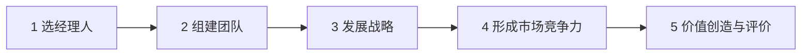

# 宁高宁选人三则：拼搏进取、坚韧、勇敢担当

> 一定要找个激情似火的人。拼搏进取，坚韧、勇敢担当。没有提学历，没提资历，没提行业资源，甚至没提能力两个字——宁高宁用几十年、四家世界 500 强筛出来的，就这三条。
>
> 三条看着土；合起来验，是把人丢进烂摊子里看他接不接、熬不熬、扛不扛。履历与决策说明他本人也按这三条走过：再造华润、重塑中粮、推动科学至上与两化重组——临门一脚自己踢。

## 摘要

宁高宁（1958 年生）先后执掌华润、中粮、中化与中国化工，2021 年出任联合重组后的中国中化首任董事长，2022 年 8 月卸任。[1][2][3] 选人上，他强调激情似火——拼搏进取、坚韧、勇敢担当：内核分别是「不知劳累」与主动改现状、受委屈仍往前走、出事往前站并敢用强人；实战上用亏损难啃的项目一次验三条。本文补入可核对履历与重大决策（6S、「有限相关多元化」、全产业链、先正达交割、两化重组、「科学至上」），并据《三生万物》及公开分享概括其管理哲学：企业是生命体；「三生万物」即环境与矛盾平衡催生成长；五步组合论以选人为首；科学至上把研发置于投资与并购之前。选人三则与哲学、履历同一条线——人做对了，后面的事才做得动。

**关键词：** 宁高宁；选人；拼搏进取；坚韧；勇敢担当；五步组合论；6S；科学至上；三生万物；两化重组

---

## 目录

- [摘要](#摘要)
1. [履历与时代坐标](#1-履历与时代坐标)
2. [重大事件与决策](#2-重大事件与决策)
3. [《三生万物》：思想主线](#3-三生万物思想主线)
4. [开篇：三条土词，几十年筛出来](#4-开篇三条土词几十年筛出来)
5. [拼搏进取：不是能干活，是停不下来](#5-拼搏进取不是能干活是停不下来)
6. [坚韧：挨了骂、亏了钱、被人质疑，还能不能往前走](#6-坚韧挨了骂亏了钱被人质疑还能不能往前走)
7. [勇敢担当：出了事，他是往前站还是往后缩](#7-勇敢担当出了事他是往前站还是往后缩)
8. [三条怎么同时验：丢到一个烂摊子里看](#8-三条怎么同时验丢到一个烂摊子里看)
9. [结语：履历、哲学与选人是同一条线](#9-结语履历哲学与选人是同一条线)
10. [参考文献](#10-参考文献)

---

## 1. 履历与时代坐标

### 1.1 早年与教育

宁高宁，1958 年 11 月 9 日生，山东滨州（高青）人。早年下乡、参军；后入山东大学，1983 年获经济学学士；1987 年获美国匹兹堡大学工商管理硕士（主修财务）。[1][4]

同年进入华润（集团）有限公司，从企划等岗位起步，此后三十余年先后掌舵华润、中粮、中化与中国化工四家世界 500 强央企，外界亦称「红色摩根」「中国韦尔奇」等——本人更常把自己说成「放牛娃」：职责是把国企这头牛养好。[1][5]

### 1.2 任职年表（可核对节点）

| 时间 | 职务 / 节点 | 说明 |
|------|-------------|------|
| 1987 | 进入华润（集团） | 自美返港入职 [1] |
| 1990-03 | 华润创业董事兼董事总经理 | 资本市场与实业并进的起点 [1] |
| 1992 | 华润创业总经理 | — [1] |
| 1996 | 华润集团董事、副总经理 | — [1] |
| 1999 | 华润集团副董事长、总经理；中国华润总公司总经理 | 「再造华润」阶段 [1] |
| 2004-12-28 | 中粮集团董事长 | 接替周明臣 [1] |
| 约 2009–2011 | 中粮入股并深度参与蒙牛治理 | 2011-06 宁高宁任蒙牛乳业董事会主席（牛根生辞任）[4] |
| 2016-01-05 | 中化集团董事长、党组书记 | 接替刘德树 [1][2] |
| 2018-06-30 | 兼任中国化工党委书记、董事长 | 接替任建新；「两化」人事合一 [1][6] |
| 2021-03-31 | 国务院批准两化联合重组 | 新设中国中化控股；两家整体划入 [3] |
| 2021-05-08 | 中国中化正式揭牌；任董事长、党组书记 | 首任掌门 [3][7] |
| 2022-08-26 | 不再担任中国中化董事长、党组书记 | 退休卸任 [1][8] |

任职边界以官方与权威通稿为准：中粮至 2016 年 1 月；中化自 2016 年 1 月；中国化工兼任自 2018 年 6 月；中国中化自 2021 年 5 月至 2022 年 8 月。[1][2][3][8]

### 1.3 一条线读履历

四段主业看似跳跃——外贸与多元实业、粮油食品、化工与农化——内里是同一套打法：**把「可有可无的中间商」做成有骨骼的产业主体**；用系统管理（6S、五步组合）托住多元；用人在前、战略在后；后期明确把科技与研发抬到投资决策之前。选人三则不是事后鸡汤，而是这条履历上反复用过的筛子。

---

## 2. 重大事件与决策

以下按阶段写可核对决策与公开自述；媒体加总（资产「从 600 亿到万亿」等）只作方向性描述，精确数字以年报与交易所披露为准。

### 2.1 华润：再造、6S 与「大猫非猫」

**再造华润。** 1999 年前后执掌华润集团后，推动「再造华润」：从偏外贸、香港中心，转向内地实业与资本市场；强调集团多元化、利润中心专业化，参与过的行业「要么前三，要么退出」。[9][10]

**6S 管理体系。** 为管住多元业务，华润形成 6S（后在中粮、中化继续推广）：[10][11]

1. **战略单元管理**——业务拆成可独立思考战略的单元（BU / 事业部）；  
2. **全面预算**——预算绑定业务与市场，而非财务部单独造数；  
3. **管理报告**——剔除历史会计噪音，评价当期主业竞争力；  
4. **内部审计**；  
5. **业绩评价**——以标杆、市场、历史为主，预算讨价还价只占小权重；  
6. **经理人评价**——看团队、创新与潜力，不把短期赚钱简单等同于好经理。

公开表述里，华润曾按战略编码拆成上百个战略单元，各配预算、报告、审计、评价与经理人考核——这是「给一块业务就自己琢磨做大」的制度前提。[9]

**啤酒整合与「二十六只猫打造成一只虎」。** 华润啤酒多厂并购后，有过「南厂北厂分开管」的主张；宁高宁用寓言反对碎片化：二十六只猫仍会被狼吃掉，要变成一只虎。公开分享中称，华润啤酒自早期投资起步，长期未增资本金而做到全球销量前列量级——具体市值与销量以公司披露为准。[9][10]

### 2.2 中粮：有限相关多元化、全产业链与国际化

2004 年底空降中粮后，公开叙事中的主线是：从较散的多元化投资，转向**有限相关多元化**，沿产业链上下游整合；强调**全产业链**与**国际化**——「在国际上没有地位，在国内也没有地位」。[4][9][12]

阶段内重大动作（媒体与企业史常见列举，细节宜对公告）：重组新疆屯河、中土畜、中谷等，收购深宝恒，控股丰原生化，接盘五谷道场，入股蒙牛等。[5] 2011 年 6 月，蒙牛乳业公告牛根生辞任董事会主席、委任宁高宁为新主席。[4]

中粮口号「**高境界做人，专业化做事**」在其公开分享中被反复提起，与后文选人中的境界、担当同一谱系。[9]

### 2.3 中化与中国化工：科学至上、先正达、两化合一

**科学至上。** 约 2017–2018 年起，中化明确「科学至上」：没有技术创新不投资；没有技术不推新产品；没有创新不并购、不扩规模；开会先讲技术与研发进展，研究所坐中间、发言优先。[12][13] 宁高宁事后亦称：中粮本可更早做强品牌与消费品，中化本可更早、更大力做科技——属反思，不是改写当时决策记录。[14]

**先正达。** 中国化工于 2016 年与先正达签署收购协议，2017 年 6 月 8 日完成交割，对价约 **430 亿美元**，为当时中资最大规模海外并购之一；交割时持有约 94.7% 股份。[15][16] 宁高宁自述：中粮时期已接触先正达；到中化后参与融资与整合逻辑——并购优质技术资产，服务中国农业升级；并称「并购先正达、两化合并、先正达重新上市」是接连几步，前两步已走完，上市仍在准备中（以其公开表述时点为准）。[12][14] 2020 年前后，两化农化资产注入「先正达集团」平台，农业板块先行整合。[16]

**两化联合重组。** 2018 年 6 月宁高宁兼任中国化工一把手后，合并预期坐实。2021 年 3 月 31 日国务院批准联合重组，新设中国中化控股；2021 年 5 月 8 日揭牌，宁高宁任董事长、党组书记。[3][7] 目标表述为打造世界一流、综合性、技术领先的化工企业集团。[7]

### 2.4 决策与选人的对照

| 决策场 | 拼搏进取 | 坚韧 | 勇敢担当 |
|--------|----------|------|----------|
| 再造华润 / 6S | 把外贸壳做成内地实业网络 | 多元整合周期长、争议多 | 拆利润中心、押年轻经理人操盘 |
| 中粮全产业链 | 不满足于政策性贸易中间商 | 并购整合吃紧仍继续重塑 | 国际化定位与蒙牛等重仓治理 |
| 科学至上 / 两化 | 手痒要改资产组合与会议秩序 | 转型得罪人、短期难看仍推 | 临门一脚：并购融资、兼任、揭牌 |

履历证明：三条不是面试话术，而是他本人反复站上的位置。

---

## 3. 《三生万物》：思想主线

《三生万物》由中信出版集团出版，是宁高宁对几十年经营与哲学对照的结集。下列归纳主要依据书中公开摘录及其 2024 年前后公开分享；**非全书逐章复述**，引用以已刊载文本为准。[5][12][13]

### 3.1 书名：环境生万物

老子「道生一，一生二，二生三，三生万物」——在其解说里：「一」近于道 / 自然，「二」为阴阳，「三」为阴阳协调、矛盾平衡中变化无尽的世界；万物因环境而生。[5][13]

落到企业：大环境往往不可控，但公司内部可以造**小环境**——有了适宜环境，创新与成长才是多点的、茂盛的。巴塞尔从印染到生物制药的产业繁衍，被他用作「企业产品与企业本身都可升级迭代」的旁证。[5]

> 「三生万物」说的是阴阳协调生万物，矛盾平衡生万物，运动变化生万物，也就是万物皆因环境生。[5]

### 3.2 企业是生命体；哲学进入经营

企业经营不是短期促销与处罚堆出来的技巧，而需要注入超出技巧的思想与文化。精神与物质、变与不变、表象与本质、量变与质变——都在日常经营里「闪闪发光」。[5]

- **变与不变：** 激动于数字与 AI 时，仍要守学习型组织、核心竞争力战略、现金流、持续技术创新、客户价值等「不变」。黑天鹅难预测，根本能力强才能应对变化。[5]  
- **量变与质变：** 爆雷不是一天发生的——五年前战略、三年前产品、两年前渠道、一年前净现金流，先兆往往早就有。[5]  
- **公司即大学：** 预算会、战略研讨会、年会应同时是学习与决策；「与大学不同的是我们有个即时的实验场」。[5]

### 3.3 五步组合论：系统思维，选人第一

在华润时期成型、后贯穿中粮与中化的**五步组合论**：[9]

核心判断：**没有系统思维的公司注定一事无成**；五步是小循环套大循环，不是五张孤立清单。[9]

- **选经理人：** 「在真正的管理学里，人就是全部」；「人在上」；要有**人感**；把人做对了，后面企业自己会做对。[9]  
- **组建团队：** 信仰与价值观一致、目标清晰、能力互补、信任沟通；文化是「团队散会之后讨论的事情」；中粮「高境界做人、专业化做事」。[9]  
- **发展战略：** 战略起点是价值观与信仰；领导人必须指明方向；四循环（世界经济、国家市场、行业产业、企业自身）同时起作用——市场好时企业也会因自身循环垮掉。[9][13]  
- **市场竞争力：** 未来越来越取决于科学技术；要有**战略性好产品**；中化「创新三角」（主体、文化、方式 / 路径）与门径管理。[9][17]  
- **价值创造与评价：** 价值管理四要素以人为本——诚信合规与社会责任在业务盈利之前，再及客户、股东、员工。[9]

选人十标准的第一条即「喜欢追求激情……不知劳累」；另有「选人 134 问」（《你行吗？》）——后文三则直接从这里抽出实战内核。[9][13]

### 3.4 科学至上与周期应对

面对周期，他强调：宏观刺激与产业创新升级是走出危机的常见路径；对企业而言，要把战略主驱从「极度关注市场 / 销售」转到「极度关注技术 / 创新」。[13] 「七道分水岭」（中粮时期提出）把及格线（行业、竞争、运营系统）与伟大公司线（价值观与团队、创新、整体文化、与社会关系）串成递进。[13]

临门一脚的表述与选人第三条同构：

> 作为企业的一把手，你必须提出企业发展的方向，做出重大战略性投资，促成重大交易，临门一脚你就要自己踢，别人无法代替你做。[12]

### 3.5 可带走的几句

| 命题 | 含义 |
|------|------|
| 三生万物 | 造对小环境，万物才长得出来 |
| 人就是全部 | 选人独立成步，高于一般管理工具 |
| 五步组合 | 人 → 团队 → 战略 → 竞争力 → 价值，系统咬合 |
| 科学至上 | 技术评估先于投资、产品与并购 |
| 四循环 | 世界 / 国家 / 行业 / 企业自身，别把自身败绩全怪给海盗 |
| 临门一脚 | 方向、重大投资与交易，一把手自己踢 |

---

## 4. 开篇：三条土词，几十年筛出来

宁老师说过一句话，很直白：

> 我选人的经验是一定要找个激情似火的人。拼搏进取，坚韧，勇敢担当。

没有提学历，没提资历，没提行业资源，甚至没提能力两个字。就三个词：**拼搏进取，坚韧，勇敢担当。**

这三个词看着特别土，像是哪个乡镇企业家挂在办公室墙上的标语。但宁高宁管过华润、中粮、中化、中国化工四家世界 500 强，手过的经理人几千号，他用了几十年筛出来的就这三条。

为什么是这三条？它们到底在说什么？又怎么在实战中判断？

---

## 5. 拼搏进取：不是能干活，是停不下来

先说拼搏进取。

宁老师在十个选人标准里，第一条原文是：喜欢追求激情，非常想进步，非常有活力，**不知劳累**。然后列了一串词——积极、乐观、拼搏、自驱、好胜、坚韧、勇敢、担当、理想、三观正。[9]

你注意「不知劳累」这四个字。他不是说能加班、能吃苦，是不知劳累。这俩有本质区别。

| | 能吃苦 | 不知劳累 |
|---|---|---|
| 外在 | 咬着牙也能扛 | 停不下来 |
| 内心 | 心里是累的，是在熬 | 根本不觉得这是苦 |
| 原因 | 任务压着 | 在干自己想干的事 |
| 停下来 | 松一口气 | 反而难受 |

这种人在日常工作里是什么状态？宁老师在 134 条识人清单里写了一个问题：

> 你总觉得眼前的一切不够好，你想改变它吗？

这就是拼搏进取的内核——不是老板让你干什么你才干什么，是你自己看着眼前的业务就觉得还能更好，手痒痒想动。分配的任务他干完了，不会坐在那里等下一个指令，他会自己找问题、找活干。

宁老师讲过怎么识别这种人：别光听他面试怎么说，把他放到真实业务里看。给他一个项目，观察他是给什么做什么、做完就交差，还是做着做着自己开始琢磨怎么优化、怎么延伸、怎么搞出更大的东西。

- **后者**就是拼搏进取型。
- **前者**再听话、再靠谱，也只是个执行者，不是宁老师要找的激情似火的人。

他在华润推 6S 体系，把多元业务拆成独立利润中心，让年轻经理人直接操盘。他挑的那些人，没有一个是等着安排的。给一块业务，他们自己就开始想怎么扩张、怎么并购、怎么把小盘子做大。宁老师要做的，就是别挡路。

---

## 6. 坚韧：挨了骂、亏了钱、被人质疑，还能不能往前走

第二条，坚韧。

这个词比「能抗压」深多了。宁老师自己解释过，坚韧是受了委屈也能保持积极状态，能忍辱负重，面对挫折不服输。

注意「受了委屈」这四个字。不是遇到困难，是受了委屈——你明明做对了，但被骂了；你明明在扛事，但有人说风凉话；你明明方向没错，但短期数据就是不好看，所有人都在质疑你。

这种时候你还能不能保持状态？

宁老师有个特别朴素的判断方法，他说：

> 如果一个人你骂完他，他不闹情绪不跑路，转头就主动去解决问题，这就是可用的激情型人才。

就这么简单一条，但筛掉的人不是一个两个。

- 有的人能力很强，但你说他两句他就冷了，回去磨洋工；
- 有的人表面上接受，心里已经开始投简历；
- 还有的人当场跟你拍桌子，对错先不论，情绪先崩了。

这些人都不是坚韧型。

坚韧的人是什么样？他被你骂完，可能心里也不舒服，但他转头就去想：你说的问题有没有道理？我怎么改？他不是没有情绪，是那团火比情绪大。他在意的是事能不能成，不是自己面不面子。

宁老师在中化的时候说过一句话：

> 给奋斗中的经理人多一点时间，不要急着换人。

这话是说给上级听的，但反过来也是选人的标准——你把一个人放到亏损项目里，放到攻坚战场上，头半年大概率看不到结果，甚至可能越搞越糟。这时候你观察他：

- 他是开始找借口、甩锅、抱怨资源不够，
- 还是闷着头继续干、不断调整打法？

后者就是坚韧。前者，趁早别用。

134 问里也有同构的一句：你受了委屈也能笑脸相迎吗？——难，但提醒的方向一致。[13]

---

## 7. 勇敢担当：出了事，他是往前站还是往后缩

第三条，勇敢担当。

宁老师在 134 条清单里直接问：

> 你敢承担责任吗？

这五个字看着简单，但企业里真到了事上，大部分人的本能反应是往后缩。

项目搞砸了，第一反应是：这个需求不是我提的、当时某某部门没有配合好、市场环境变了。决策做对了，功劳都是自己的；决策出错了，责任都是别人的。

宁老师要的勇敢担当，不是喊口号「我负责」，而是三个具体表现：

**第一，出问题不找借口。** 不管什么原因，先认下来，先解决问题，复盘的时候再说责任。他不会在事情还没收拾完的时候就开始撇清自己。

**第二，关键时刻敢拍板。** 信息不完整、时间紧迫、谁都拿不准的时候，他敢做决定，并且愿意为这个决定的后果负责。而不是什么事都往上交、等领导拍板，自己只当传声筒。公开分享里他强调：决策关键时刻，程序长短并不等于决策质量；除了真正承担风险的人，很少有人在夜深人静把问题想透。[13]

**第三，敢用比自己强的人。** 宁高宁选人标准里有一条：你敢大胆启用有能力有潜力的人吗？很多管理者不敢用强人，怕被取代，怕管不住。有担当的人不怕，他要的是把事做成，不是证明自己最厉害。

宁老师自己就是这样的人。他在中化提出「科学至上」转型，把研发抬到投资与并购之前，等于逼着组织从贸易 / 传统经营惯性转向科技公司逻辑，得罪人、冒风险，他自己拍的板，自己扛的压力。[12][13]

《三生万物》与公开表述中的临门一脚，就是勇敢担当的自画像：方向、重大投资、重大交易——别人无法代替你做。[12]

---

## 8. 三条怎么同时验：丢到一个烂摊子里看

分开讲是三条，但实战中宁老师不是一条一条对着打勾的。他有个办法，能一次把三条全验了——**把人放到一个亏损的、难啃的、没人愿意接的项目里。**

为什么？因为一个烂摊子能同时逼出三种反应：

| 筛子 | 逼出的问题 | 过关信号 |
|------|------------|----------|
| 拼搏进取 | 这个项目又穷又破又没资源，你接不接？ | 接了——有劲，不怕事 |
| 坚韧 | 接了之后头半年肯定没起色，到处碰壁，内部有人看笑话，你怎么办？ | 熬得住、继续干 |
| 勇敢担当 | 干的过程中必然要做决策、要担风险，出了岔子谁兜？ | 你往前站 |

一个烂摊子，三道筛子，一遍过完。

这与 6S 第六条同调：战略性投资要长时期培育，渡过困难阶段「最没人想干」，却最该让最好的管理者去做；赚钱的不一定是好经理，不赚钱的也不一定是坏经理。[10][11]

宁老师在中化推行 **70% 内部提拔 + 30% 外部引进**。内部的人怎么提？不是看资历、看年限，是看过往有没有扛过烂摊子、有没有在亏损项目里证明过自己。那些哪里亏损就被派去哪里、去了就能扭亏的人，提拔得最快。

他还强调**好人选好人**——让已经被验证过的、具备这三条特质的骨干去推荐同类型的人。因为真正拼搏进取、坚韧、敢担当的人，他们识别同类的眼光，比任何 HR 评估体系都准。

宁老师不迷信标准化的面试打分表。他更相信**人感**——在日常接触中、在实战场景中、在压力和挫折面前，一个人的本性会自然暴露出来。装得了一时，装不了三年。[9][13]

---

## 9. 结语：履历、哲学与选人是同一条线

拼搏进取、坚韧、勇敢担当，这三个词没有一个是硬技能。

你没法用考试衡量，没法用证书证明，也没法靠三个月培训速成。但宁老师用三十五年、四家世界 500 强的经验告诉你：这三条过不了关的人，学历再亮、经验再丰富、业绩再好看，到了关键时候也顶不住。

履历侧：再造华润、重塑中粮、科学至上与两化重组，是他把自己和团队一次次丢进难啃局里。哲学侧：《三生万物》说环境生万物、人就是全部、临门一脚自己踢——选人三则是同一套世界观的用人面。

反过来想，你身边有没有这样的人——

- 不用催、不用盯，给他一件事他就玩命干；
- 挨了骂、摔了跤，爬起来接着跑；
- 真出了问题，他第一个站出来说「我来处理」？

如果有，别犹豫，这种人就是宁老师说的激情似火的人。你现在的团队里，找得出几个？

> **拼搏进取看他停不停得下来；坚韧看他受了委屈还往不往前走；勇敢担当看出了事他往前站还是往后缩。三条合验，丢进烂摊子里看。履历可核对，思想可读《三生万物》，选人终究落在人感与实战。**

---

## 10. 参考文献

正文编号对应下列来源。任职与重组日期优先百科互证、国资委 / 企业官网与通讯社；管理思想优先宁高宁本人公开摘录与分享，其次课堂笔记转述（后者可能有口述压缩，不写成已刊书籍的逐字稿）。

1. 中文维基「宁高宁」。生年与教育；1987 年入华润及 1990–1999 华润任职；2004-12-28 任中粮董事长；2016-01-05 任中化董事长；2018-06-30 兼任中国化工董事长；2022-08-26 卸任中国中化。 <https://zh.wikipedia.org/wiki/%E5%AE%81%E9%AB%98%E5%AE%81>
2. 中国经济网（2016-01-05）. 宁高宁接替刘德树出任中化集团董事长. <http://district.ce.cn/newarea/sddy/201601/05/t20160105_8073709.shtml>
3. 中国中化官网「历史沿革」. 2021-03-31 国务院批准两化联合重组，新设中国中化控股；2021-05-08 正式揭牌. <https://www.sinochem.com/sinochem/guwm/qygk/ls/A031002001002Gone1.html>
4. 北大国发院 / 公开人物介绍转述履历；蒙牛乳业 2011-06-11 港交所相关公告口径（牛根生辞任主席、委任宁高宁）. 教育与华润早期职衔与维基一致处互证.
5. 宁高宁. 《三生万物》. 中信出版集团. 公开摘录见腾讯新闻「曾掌舵 4 家世界 500 强！宁高宁：我的 6 点心得」（2024-10-02）等. 哲学与经营、「三生万物」释义、内刊与会议、市场与市值、企业生命体等. <https://news.qq.com/rain/a/20241002A03TMM00>
6. 财经网（2018-06-30）. 宁高宁兼任中国化工董事长. <http://yuanchuang.caijing.com.cn/2018/0630/4478878.shtml>
7. 中国中化成立相关报道（2021-05-08）. 揭牌；宁高宁任董事长、党组书记；世界一流综合性技术领先化工集团等定位表述. 参见新浪财经等通稿.
8. 界面新闻（2022-08）. 宁高宁不再担任中国中化董事长、党组书记. <https://www.jiemian.com/article/7977202.html>
9. 混沌学园整理：宁高宁「没有系统思维的公司，注定一事无成」（五步组合论、人在上、选人十标准、134 问、大猫非猫、科学至上与中化转型等课堂笔记）. 口述转写，细节以本人著作与企业披露为准. <https://www.hundun.cn/articles/a433ae1944690c6d.html>
10. 澎湃新闻转载政务号等：「巨无霸」企业与 6S、再造华润、「集团多元化，利润中心专业化」等公开叙述. <https://www.thepaper.cn/newsDetail_forward_27656410>
11. 宁高宁谈 6S 六项要点的公开文稿 / 转载（管理报告、标杆评价、经理人潜力等）. 参见腾讯新闻「管理方法不是写出来的……」及长江商学院等转载.
12. 宁高宁. 「我亲历的几次并购」等公开文章（先正达逻辑、两化与上市步骤、科学至上、临门一脚等）. <https://news.qq.com/rain/a/20241019A064VH00>
13. 经纬创投「亿万笔记」：宁高宁《三生万物》主题分享整理（2024-11-26）. 书名哲学、四循环、七道分水岭、科学至上会议秩序、人感与 134 问、决策勇气等. 约为原分享节选. <https://news.qq.com/rain/a/20241126A03V6Y00>
14. 宁高宁访谈：先正达融资与整合、反思中粮品牌与中化科技起步早晚等. <https://news.qq.com/rain/a/20250704A00L3W00>
15. 人民网转《经济参考报》（2017-06-09）. 中国化工约 430 亿美元完成先正达交割；持股约 94.7%. <http://finance.people.com.cn/n1/2017/0609/c1004-29328308.html>
16. 先正达交割与两化农化资产整合时间线：2017-06 交割；2020 年先正达集团平台重组等. 参见中国中化相关报道与财经通稿.
17. 宁高宁. 「新质生产力与企业战略」等公开文稿. 科学至上下的战略 / 运营 / 考核 / 价值观转变；创新三角. <https://news.qq.com/rain/a/20240629A063VX00>
