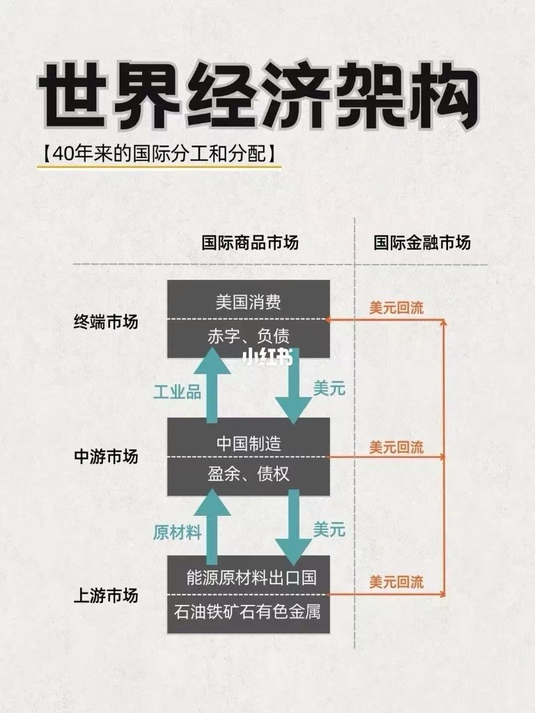
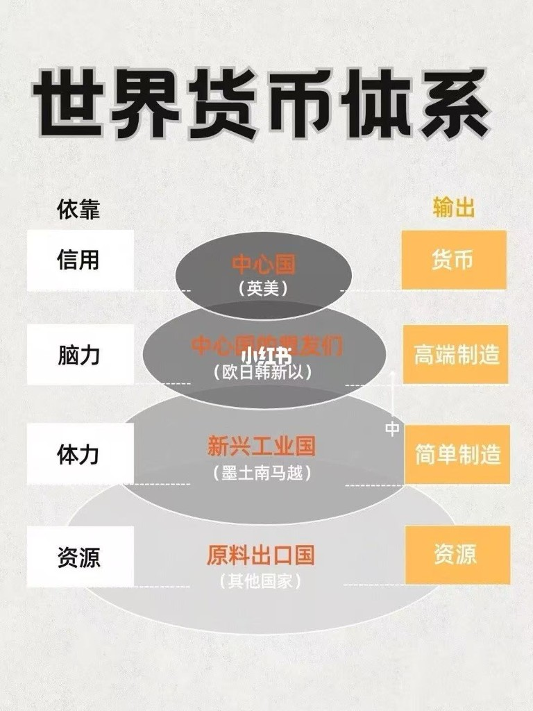

# 美元体系下的世界分工：三层环流与利润金字塔

> 很多人看不懂美元涨跌、大宗商品震荡，背后往往不是某一条新闻，而是近四十年来成型的一套全球分工与美元环流。实物从资源国经制造国流向消费端；美元反向流出，再经美债、美股等资产回流美国。位置越高，利润与规则话语权通常越强——所谓产业升级，多半是在这座金字塔里向上挪一层。
>
> 本文是教学用结构图，不是法庭判决。三层环流与四层金字塔是简化透镜；中国同时处在「中游制造」与「向上跃迁」的叠合位置；当代中心货币网络以美元为主，不宜把英美写成对称双核。冲突时以 IMF COFER、美国财政部 TIC、世界银行 / 联合国工业统计、海关与产业统计为准。可与本库 [13](../10-chronicle/13-world-hegemony-transfer-chronicle.md)（美元—公共品霸权）、[55](./55-global-manufacturing-migration-chronicle.md)（工厂地理与 China+1）对照：一篇看货币环流与利润层，一篇看秩序与公共品，一篇看产能节点如何搬家。

先给一个直接答案：

> **近四十年来的美元分工体系，可先看成两条叠合的图。一条是三层商品—美元环流：上游资源国换美元，中游制造国（以中国为枢纽）加工出口赚顺差，终端消费以美国赤字与负债吸收全球工业品——实物向消费端，美元向下流出，再经金融市场回流美国。另一条是四层利润金字塔：信用→货币（中心国），脑力→高端制造（盟友经济体），体力→简单制造（新兴工业国），资源→原料出口；产业升级，本质是在金字塔里向上跃迁。两图咬合处在于：环流解释「货与钱怎么转」，金字塔解释「利润与规则落在哪一层」。体系正在松动——美债压力、供应链区域化、本币结算——但美元在官方储备与计价中的网络效应仍深；新旧交替阶段波动加大，流动性松紧仍是大类资产的重要锚点。**

**50-strategy 系列位置：** [55](./55-global-manufacturing-migration-chronicle.md) 写工厂迁到哪里；[53](./53-li-ka-shing-capital-allocation-treatise.md) 写资本如何换形态；本文写**美元环流如何把分工钉成利润层**。[13](../10-chronicle/13-world-hegemony-transfer-chronicle.md) 是公共品与霸权长河。术语先看第 1.1 节。

## 摘要

本文把「美元体系下的世界分工」收成两张可对照的结构图：三层环流（资源—制造—消费）与四层利润金字塔（信用 / 脑力 / 体力 / 资源），并写清二者如何咬合。正文补可核验数量级：美元在官方外汇储备已分配份额约五成半至六成；海外持有美债以日本、中国大陆等为前排；中国制造业增加值约占全球近三成、货物顺差近年近万亿至过万亿美元量级，支撑「中游枢纽」叙事；China+1 / 近岸则说明组装外移往往快于增加值脱钩。边界写清：图是教学透镜；「实物流向东方」易误读；中国不是纯「简单制造」；中心国以美元网络为主。松动迹象与「金融间歇期」同读：去美元缓慢，替代未成型。配置段只给结构提醒，不作投资建议。

**关键词：** 美元环流；国际分工；经常账户；美债回流；储备货币；利润金字塔；产业升级；China+1；本币结算；石油美元

---

## 目录

- [摘要](#摘要)
1. [先把尺子钉住](#1-先把尺子钉住)
    - [1.1 术语对照](#11-术语对照)
    - [1.2 两图如何咬合](#12-两图如何咬合)
    - [1.3 边界：图能说明什么、不能说明什么](#13-边界图能说明什么不能说明什么)
2. [三层环流：商品向上，美元向下再回流](#2-三层环流商品向上美元向下再回流)
    - [2.1 上游：资源换美元](#21-上游资源换美元)
    - [2.2 中游：制造顺差与债权](#22-中游制造顺差与债权)
    - [2.3 终端：赤字消费输出美元](#23-终端赤字消费输出美元)
    - [2.4 金融侧：美元回流](#24-金融侧美元回流)
3. [四层金字塔：利润与话语权的位置](#3-四层金字塔利润与话语权的位置)
    - [3.1 顶层：信用输出货币](#31-顶层信用输出货币)
    - [3.2 第二层：脑力与高端制造](#32-第二层脑力与高端制造)
    - [3.3 第三层：体力与简单制造](#33-第三层体力与简单制造)
    - [3.4 底层：资源出口](#34-底层资源出口)
    - [3.5 中国的叠合位置](#35-中国的叠合位置)
4. [行业坐标：数字能钉住什么](#4-行业坐标数字能钉住什么)
5. [正在松动的环节](#5-正在松动的环节)
6. [对配置的结构提醒](#6-对配置的结构提醒)
7. [本章要点](#7-本章要点)
8. [参考文献](#8-参考文献)

---

## 1. 先把尺子钉住

看美元指数、油价、铜价、美债收益率，若只盯单条新闻，容易把结果当原因。更稳的读法是先问三句：**实物在哪一层被加工？美元从哪一层被支付出去、又从哪条管道回来？利润与规则话语权落在金字塔的哪一层？** 第 2–3 节展开两张结构图；第 4 节补行业数量级；第 5–6 节写松动与配置边界。

### 1.1 术语对照

| 术语 | 一句话 |
| ---- | ------ |
| **储备货币** | 央行与机构愿意大量持有、用于计价、结算与干预的货币。美元仍是主币种；官方份额见 IMF **COFER**（Currency Composition of Official Foreign Exchange Reserves）。 |
| **贸易差额 vs 经常账户** | **货物贸易顺差 / 逆差**只计商品进出口。**经常账户**还含服务、初次收入（利息、利润、工资等）与二次收入。中游常年货物顺差，不等于经常账户一切皆顺；美国常年货物逆差，也不等于「只消费不生产」。 |
| **财政赤字 / 双赤字** | 政府支出大于收入为财政赤字。财政赤字与经常账户赤字同时出现，教学上称**双赤字**。美国终端角色的财政—外部镜像是简化说法，私人储蓄与投资也会改恒等式拆解。 |
| **美元回流** | 贸易与投资赚到的美元，经购买美债、美股、机构债、存款等回到美国金融体系，为美方赤字与资产供给提供对手盘的一面。回流≠每一美元都买国债。 |
| **石油美元（petrodollar）** | 石油等大宗长期以美元计价结算，使资源国收入天然进入美元资产池。是上游阀门之一，不是环流的唯一阀门（铁矿、铜、制造顺差同样生成美元债权）。 |
| **铸币税 / 网络特权** | 中心货币发行者因他国持币、持债、用本币计价而获得的融资便利与定价权。是特权，**不是**「永远不用平衡财政」的定律。见 [13](../10-chronicle/13-world-hegemony-transfer-chronicle.md)。 |
| **特里芬难题（Triffin dilemma）** | 教学提示：全球若依赖一国货币提供流动性，该国往往需对外净输出货币（常表现为经常账户逆差或对外负债扩张），长期可能侵蚀信用。用于理解「终端逆差是环流发动机」的张力，不是精确预测公式。 |
| **美元指数（DXY）** | 美元相对一篮子主要货币的汇率指数。涨跌反映相对松紧与避险，**不等于**国内金融条件的完整度量。 |
| **金融条件** | 利率、信用利差、汇率、资产价格等共同决定的融资松紧。收紧时常伴随美元走强与风险资产承压，但时滞与例外很多。 |
| **产业升级（本文口径）** | 从资源 / 简单加工，挪向更高增加值制造，以及标准、品牌、装备与金融—规则话语权。出口额上升 ≠ 自动升级。 |
| **毛贸易 vs 增加值贸易** | 毛贸易看报关金额；增加值贸易看各国实际创造了多少价值。China+1 下，第三国出口仍可嵌大量中国中间品——双边「去中国化」可快于增加值脱钩。见 [55](./55-global-manufacturing-migration-chronicle.md)。 |
| **China+1 / 近岸 / 友岸** | 在中国之外再加基地；迁近消费市场（近岸）；迁至安全伙伴（友岸）。改的是组装地理，不等于供应链本地化完成。 |
| **本币结算** | 跨境贸易用本币而非美元清算（常配合货币互换与本地清算安排）。降低美元依赖的努力；深度、夜间流动性与制裁韧性仍远小于美元网络。 |
| **SWIFT** | 跨境报文系统，不是货币本身。美元在 SWIFT 计价报文中占比高，常被当作网络惯性的旁证；具体份额随统计口径变，正文不作精确法庭数。 |

### 1.2 两图如何咬合

先立读法，再进第 2–3 节看原图。**图 1** 管流量，**图 2** 管分层。

| | **图 1 · 三层环流** | **图 2 · 四层金字塔** |
| -- | ------------------ | -------------------- |
| **主问** | 货怎么走、钱怎么转 | 利润与话语权落在哪 |
| **横轴** | 商品市场 ↔ 金融市场 | 依靠什么 → 输出什么 |
| **纵轴** | 上游 / 中游 / 终端 | 信用 / 脑力 / 体力 / 资源 |
| **中国** | 中游枢纽（顺差、债权） | 「中」在体力层与脑力层之间上移 |
| **美国** | 终端赤字消费 + 回流终点 | 顶层信用—货币网络的核心 |

读法纪律：**先用环流看流量，再用金字塔看分层。** 只看环流，会误以为「谁出口多谁就赢」；只看金字塔，会看不见订单与美元从哪一层灌进来。每张图下方另有图例表，与截图对照读。

### 1.3 边界：图能说明什么、不能说明什么

1. **「近 40 年」是教学窗口，不是精密开机日。** **1971** 尼克松冲击后，信用美元与石油美元计价已铺垫；中国深度嵌入中游枢纽，更集中在 **1990 年代—2010 年代**全球化高潮（入世 2001 是加速器）。图说的是**成熟形态**。  
2. **三层环流把「美国消费 / 中国制造 / 资源国」写成主轴，省略了欧盟、日本等巨大消费与高端制造节点，也省略南南贸易。** 当作**主循环示意**，不是全球贸易全图。  
3. **四层金字塔是利润与话语权的示意，不是国家排名表。** 「英美」不宜写成对称双核：当代全球储备与贸易计价以**美元**为中心；伦敦金融城与英镑、法律与资管网络仍重要，量级不同。德国、日本等同时站在第二层与部分终端消费上。  
4. **「实物流向东方」易误导。** 与结构图一致的说法是：**实物向消费端（以美国等终端市场为主）流动，美元资本回流美国**；制造产能重心在东亚，不等于商品与利润最终停在东方。  
5. **中国不是金字塔第三层的固定住户。** 图中「中」的上箭头，承认叠合：简单组装外溢与中高端制造扩张可以并行。详见第 3.5 节。  
6. **回流不是阴谋论闭环。** 债权国买美债，是深度市场、储备管理与汇率政策的结果；美国得到融资便利，也承担对外净负债与政治—财政约束。两边都有代价。

---

## 2. 三层环流：商品向上，美元向下再回流

  

**图 1　世界经济架构：三层环流（商品市场 × 金融市场）**

| 层 | 主体（示意） | 商品市场（左） | 美元（左） | 金融市场（右） |
| -- | ------------ | -------------- | ---------- | -------------- |
| **终端** | 美国消费 | 吸收工业品 | 向下支付美元 | 赤字、负债；回流终点 |
| **中游** | 中国制造 | 原材料→工业品 | 收终端美元、付上游美元 | 盈余、债权 → 回流 |
| **上游** | 能源原材料出口国 | 输出石油、铁矿、有色等 | 收中游美元 | 资源收入 → 回流 |

> **读图：** 实物沿左栏上行（原材料→工业品→消费）；美元沿左栏下行；各层美元债权再经右栏「美元回流」回到美国金融体系。教学示意，非国际收支恒等式的逐步证明。边界见第 1.3 节。

全球市场在这套叙事里分成三层。左栏是商品与贸易美元；右栏是回流到美国的金融资产配置。

### 2.1 上游：资源换美元

**上游市场**是能源与原材料出口国：石油、铁矿石、有色金属等。它们输出原材料，换取**美元外汇**。大宗商品长期以美元计价，使资源收入天然进入美元体系——石油美元传统的当代延伸，不限于石油。

上游的议价能力随供需、地缘、库存与替代技术波动：油价高时上游现金流厚；油价崩时中游成本松、上游承压。因此「看大宗」，往往同时在看**美元流动性、实际利率与终端需求**，而不是只看某一座矿山或某一份减产声明。

### 2.2 中游：制造顺差与债权

**中游市场**以中国制造为枢纽示意：进口原材料与关键中间品，加工成工业品出口，积累**盈余与债权**。中游赚的是加工、规模与产业链组织租金；在全球化高峰期，它把上游资源与终端订单接成一条可规模化的流水线。

与 [55](./55-global-manufacturing-migration-chronicle.md) 合读：中游位置本身是四次制造业迁移的结果——世界工厂接到东亚之后，环流图才长成「资源→中国→美国」的醒目主轴。当代 **China+1** 把部分组装挪到越南、墨西哥、印度等，改变的是中游**地理分布**，不一定立刻改掉「东亚仍供应关键中间品」的增加值结构。毛出口看板可以「去中国化」，增加值账单往往慢半拍。

### 2.3 终端：赤字消费输出美元

**终端市场**以美国消费示意：靠**赤字与负债**吸收全球工业品，并把美元支付到世界。经常账户逆差意味着：相对世界，该国在账面上是实物与服务的净需求方，同时向外提供净金融资产——对环流而言，这是**发动机的一面**，不是简单的「浪费」。特里芬式张力也在这里：全球若需要美元流动性，美国对外净供给货币与资产的压力长期存在。

财政赤字与外部逆差常年并存时，教学上称双赤字；精确分解（私人储蓄、投资、财政）因年份而异，正文不写成恒定公式。要点是：终端若突然紧缩进口，或金融条件骤紧（利率上行、信用收缩、美元流动性短缺），中游订单与上游价格会一起抖。

### 2.4 金融侧：美元回流

各国贸易赚到的美元，若大量以现金闲置，既不利于保值，也缺少深度市场。实践中常见路径是：配置**美债、美股、机构债、美元存款与其他美元资产**，使资本回到美国——图 1 右侧的「美元回流」。官方外汇储备、主权财富基金、商业银行与企业金库，都是不同管道；TIC 美债表只是其中最显眼、可月度核对的一条。

回流的功能是双向的：债权国获得相对安全、流动性好的储备资产；美国为赤字与资产供给找到买家。**2008** 年全球金融危机中，各方抢美元流动性，说明这一网络在压力下仍可能**强化**而非自动瓦解——与 [13](../10-chronicle/13-world-hegemony-transfer-chronicle.md)「危机中美元需求强韧」同读。

**一句话收束：** 实物向消费端走，美元向下流出，再经金融市场回流美国。产能在东方组装，不等于商品与利润最终停在东方。

---

## 3. 四层金字塔：利润与话语权的位置

  

**图 2　世界货币体系：四层利润金字塔**

| 层 | 示意主体 | 依靠 | 输出 | 读法 |
| -- | -------- | ---- | ---- | ---- |
| **顶层** | 中心国（美为主；英为金融节点） | 信用 | 货币 | 储备、计价、清算与规则 |
| **第二层** | 盟友经济体（欧、日、韩、新、以等） | 脑力 | 高端制造 | 技术、标准与品牌溢价 |
| **第三层** | 新兴工业国（墨、土、南、马、越等） | 体力 | 简单制造 | 加工费；China+1 多发生在此 |
| **底层** | 原料出口国 | 资源 | 资源 | 议价弱时利润最薄 |
| **「中」↑** | 中国（叠合） | — | — | 自体力层向脑力 / 高端制造上移；非已交棒 |

> **读图：** 层越高，平均利润与话语权通常越强；同一国家可同时站在多层。图中「中」的上箭头是跃迁示意，不是完成证明。边界见第 1.3、3.5 节。

世界货币与分工体系在这套叙事里是四层金字塔：位置越高，平均利润与规则话语权通常越强。层与层之间有摩擦，也有渗透——同一国家可以同时站在多层。

### 3.1 顶层：信用输出货币

**中心国**依靠**信用**，输出**货币**。示意常写英美；更精确的当代读法是：**美元网络**居中——国债市场深度、支付与清算、制裁执行力、安全同盟与法律可预期性，共同支撑「他国愿意持有」。英国金融城与法律、保险、资管网络仍是重要节点，但全球官方储备与贸易计价的主轴是美元。

顶层利润不只来自「印钞」，而来自：他国愿意持有本币资产、用本币计价、在危机中仍兑换本币流动性——铸币税与网络特权。失去信用纪律时，特权会折价；这与「永远不用平衡财政」不是同一句话。

### 3.2 第二层：脑力与高端制造

**中心国盟友**示意：欧、日、韩、新、以等。依靠**脑力**（研发、设计、标准、复杂系统集成、关键设备与材料），输出**高端制造**与高附加值环节，拿技术与品牌溢价。

这一层与顶层常咬合：安全同盟、出口管制清单、技术标准、资本市场与供应链资质，使「脑力」可变现为持续租金。迁出劳动密集环节后仍保留高附加值制造，正是 [55](./55-global-manufacturing-migration-chronicle.md) 迁出国路径的常见写法——美国、日本、德国都在不同程度上演示过「比重下降、关键节点仍在」。

### 3.3 第三层：体力与简单制造

**新兴工业国**示意：墨、土、南、马、越等。依靠**体力**、可扩张产线与关税—运距条件，输出**简单制造**与组装，主要赚取加工费。订单随工资、关税、运距与地缘政治在各国之间搬家——China+1 / 近岸的故事，大多发生在这一层的**份额再分配**上。

注意：简单制造不等于低技能的全部；电子组装可以很复杂，但若本地不掌握关键中间品与设计，利润仍薄。

### 3.4 底层：资源出口

**原料出口国**依靠**资源**，再输出资源。议价弱时，利润薄、波动大，且易陷入「资源诅咒」式路径依赖。上游在三层环流里必不可少，在金字塔里却常落在利润最薄的一层——除非形成稀缺、卡特尔、国有议价联盟，或向下游冶炼、化工、材料一体化延伸。

### 3.5 中国的叠合位置

图 2 在第二层与第三层之间标「中」并向上指，是全文最重要的提醒之一：

| 透镜 | 中国常见位置 | 不可简化成 |
| ---- | ------------ | ---------- |
| **三层环流** | 中游制造与顺差枢纽 | 「只赚加工费、无债权」 |
| **四层金字塔** | 体力层外溢 + 脑力层追赶并行 | 「永远停在简单制造」 |
| **当代再配置** | 组装外移与中间品留存并存 | 「工厂搬走=增加值清零」 |

产业升级，本质就是在这座金字塔里努力向上跃迁——从加工费，走向设计、品牌、装备、材料、标准与规则。跃迁是否成功，要看**增加值、全要素生产率、关键进口替代与外部技术约束**，不能只看出口额或某一两个「世界第一」品类。新能源、部分装备与消费电子链的升级事实，与劳动密集订单外溢、高端设备 / 材料短板，可以同时成立——见 [55](./55-global-manufacturing-migration-chronicle.md) 第 3.5–5 节。

---

## 4. 行业坐标：数字能钉住什么

下列数量级用于给结构图钉钉子；年份一变就会改，冲突以原始统计为准。

| 坐标 | 数量级（教学用） | 读法 |
| ---- | ---------------- | ---- |
| **美元在官方外汇储备中的份额** | IMF COFER：已分配储备中美元约 **56%–58%**（2024Q4–2025Q2 公开切片；汇率变动会扰动份额）。人民币约 **2%** 量级。 | 「去美元」有讨论，储备端仍是美元主轴；人民币不可与美元并写。宜同时看汇率调整口径。[^cofer] |
| **海外持有美债（TIC）** | 日本约 **1.1 万亿美元**；中国大陆约 **0.75–0.78 万亿**（2024 末–2025 上半年切片）；外国持有合计约 **8–9 万亿**。 | 回流的可观察管道之一；**托管地 ≠ 最终受益人**，勿写成「中国持债=全部债权」。比利时、英国、开曼等托管中心会扭曲国别表。[^tic] |
| **中国制造在全球的位置** | 制造业增加值约占全球 **近三成**（公开汇编约 **27%–29%** 一带，口径年与年不同）；货物贸易顺差近年约 **0.8–1.2 万亿美元**量级（2024 近万亿、其后年份可过万亿）。 | 支撑「中游枢纽」；也解释保护主义与外溢组装压力。增加值份额 ≠ 毛出口份额。[^china-mva] |
| **毛贸易 vs 增加值** | 美对华直接进口份额下降可显著快于中国增加值占美进口增加值份额的下降（PIIE 等：约 2017–2024，前者降幅约 **7** 个百分点量级，后者约 **2.3** 个百分点量级）。 | China+1 改地理快于改账单；经越南、墨西哥等转口仍可嵌中国中间品。[^china-plus-one] |
| **供应链再配置分工** | 越南偏出口组装与电子；墨西哥偏对美近岸（汽车 / 电子）；印度偏规模与国内市场加激励。 | 第三层份额再分配；难出现单一「下一个中国」。见 [55](./55-global-manufacturing-migration-chronicle.md) §4。 |
| **美元计价惯性** | 石油等大宗、跨境贷款、SWIFT 美元报文占比仍高（具体份额随统计口径变）。 | 本币结算可降摩擦，难在短时间替代网络深度、夜盘流动性与危机兑换承诺。 |

行业含义可以收成四句：

1. **中游顺差 + 海外持债（及更广的美元资产）**，是「盈余、债权」在金融账本上的影子。  
2. **终端逆差 + 美债与美元资产深度**，是「赤字、负债」能持续运转的金融条件之一。  
3. **组装外移**改变三层环流的地理；**高端设备 / 材料 / 标准**才决定金字塔上的层。  
4. **看脱钩，先问口径：** 毛进口、增加值、中间品、最终组装，四张表讲的不是同一句话。

---

## 5. 正在松动的环节

旧体系并未一夜拆除，但以下压力同时存在：

1. **美国债务与政治周期。** 联邦债务规模抬升、党争与关税工具化，使「无限吸收世界过剩产能 + 稳定提供公共品」的意愿与能力出现缝隙——[13](../10-chronicle/13-world-hegemony-transfer-chronicle.md) 所称**反向金德尔伯格**与**金融间歇期**风险：网络仍在，供给意愿波动，替代者未成型。[^hegemony-dollar]  
2. **供应链区域化。** 关税、出口管制、友岸 / 近岸，把单一中游枢纽拆成多节点；波动上升，库存、运价与资本开支行为改变。环流还在转，摩擦系数变大。  
3. **本币结算与储备多元化。** 双边本币、货币互换、黄金与非美资产配置增加，是对冲行为；COFER 显示美元份额缓降或受汇率扰动，**尚未**出现对称替代货币。间歇期的典型像：碎片化支付增加，干净交棒未至。  
4. **中国向上跃迁与外溢并行。** 新能源、部分装备与电子链升级，与劳动密集订单外移同时发生——金字塔箭头与三层环流改道，是同一过程的两面，不是互相否定。

松动 ≠ 交棒完成。更稳妥的判断是：**环流仍在，摩擦变大；利润层仍在，跃迁竞赛加剧。**

---

## 6. 对配置的结构提醒

以下不是投资建议，只是把结构翻译成观察清单。

1. **美元流动性仍是大类资产的重要锚点。** 金融条件收紧、美元回流强化时，风险资产与新兴市场常先承压；流动性宽松外溢时，全球风险偏好更容易抬升。因果链有时滞，且与增长、通胀预期缠在一起——DXY 单独不能代替完整金融条件。  
2. **大宗商品同时听三层的话。** 上游供给冲击、中游补库 / 去库、终端需求与实际利率，都会进价格；只背「美元涨则商品跌」不够。  
3. **新旧交替阶段，波动率本身是特征。** 区域化与政策冲击提高尾部事件频率；配置上需平衡防御资产与结构性机会（与自身负债币种、久期、收入货币敞口匹配），而不是在「美元必崩 / 美元永固」两极押注。  
4. **看中国资产与供应链主题时，分清层。** 外溢组装是第三层再分配；自主可控与高端制造是第二层争夺——叙事不同，政策敏感度与赔率结构也不同。毛贸易新闻与增加值现实，常差半拍。

---

## 7. 本章要点

1. **两图咬合：** 环流管流量（货与钱怎么转），金字塔管分层（利润与规则落在哪）。  
2. **三层环流：** 上游资源换美元 → 中游制造顺差 → 终端赤字消费输出美元；实物向消费端，美元回流美国。  
3. **四层金字塔：** 信用→货币；脑力→高端制造；体力→简单制造；资源→原料。升级=向上跃迁。  
4. **中国叠合：** 既是中游枢纽，也在简单制造与高端制造之间移动；组装外移 ≠ 增加值清零。  
5. **数字钉钉子：** 美元储备份额仍过半；美债海外持有可观察但托管扭曲；制造业增加值近三成、货物顺差近万亿至过万亿量级。  
6. **松动与间歇：** 债务、区域化、本币结算在加压；替代网络未成型，波动加大。  
7. **配置：** 流动性是锚，不是神谕；先分清层与口径，再定价。

---

## 8. 参考文献

[^cofer]: IMF, Currency Composition of Official Foreign Exchange Reserves (COFER). 公开 Data Brief：2024Q4 已分配储备中美元约 57.8%；2025Q1 约 57.7%；2025Q2 约 56.3%（汇率变动影响大，宜同时看汇率调整口径）。人民币约 2% 量级。https://data.imf.org/

[^tic]: U.S. Department of the Treasury, Major Foreign Holders of Treasury Securities (TIC). 例如 2025-05：Japan ≈ $1,135 bn；China, Mainland ≈ $756 bn；Foreign total ≈ $9.0 tn 量级。托管统计，不等于最终受益所有权。https://ticdata.treasury.gov/

[^china-mva]: 中国制造业增加值总量与全球份额：世界银行 `NV.IND.MANF.CD` 等序列显示中国 2024 年制造业增加值约 **4.7** 万亿美元量级；联合国 / 公开汇编 2023 年全球份额常见约 **29%** 一带，另有约 **27%** 口径——正文取「近三成」。货物贸易顺差：近年约 **0.8–1.2** 万亿美元量级（2024 近万亿；其后年份可过万亿），以海关总署 / 正式国际收支为准复核当年值。

[^china-plus-one]: 论证与边界见本库 [55](./55-global-manufacturing-migration-chronicle.md) 第 4 节及文内 PIIE 等引用：双边进口份额下降与增加值依赖下降可以不同步（约 2017–2024：毛份额降约 7 个百分点量级，增加值份额降约 2.3 个百分点量级）。

[^hegemony-dollar]: 美元体系、布雷顿森林、尼克松冲击、铸币税边界、危机中美元需求与金融间歇期，见本库 [13](../10-chronicle/13-world-hegemony-transfer-chronicle.md) 第 7、9 节。

**声明：** 正文为结构教学整理；图 1、图 2 为通识示意图。数量级用于钉结构，不作交易信号。若叙述与 IMF、财政部、世界银行、海关或产业原始统计冲突，以原始统计为准。
