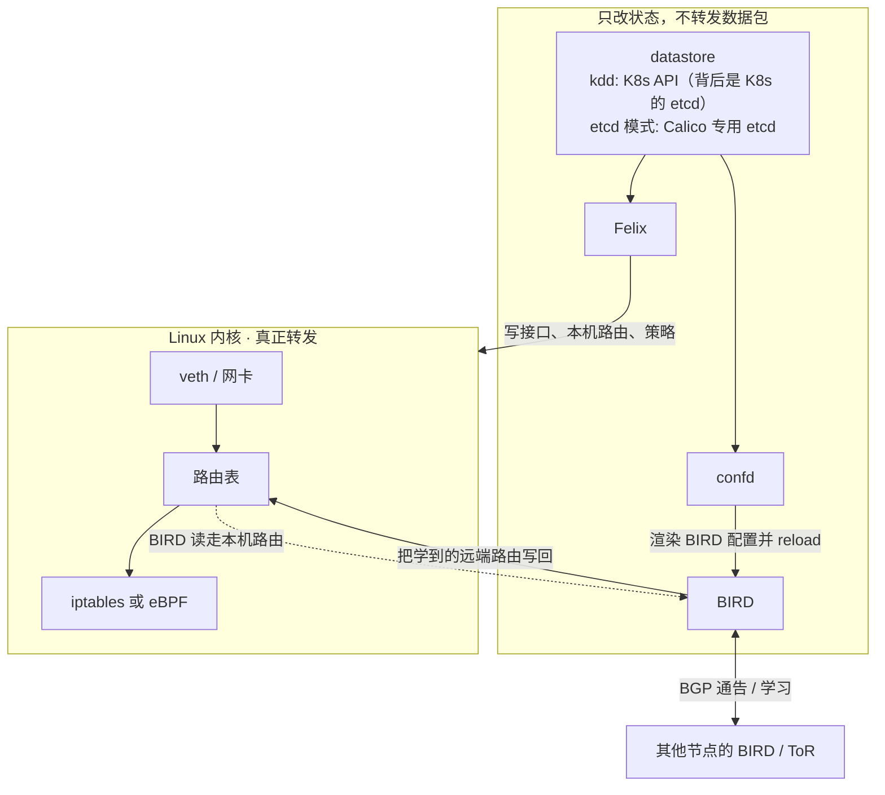
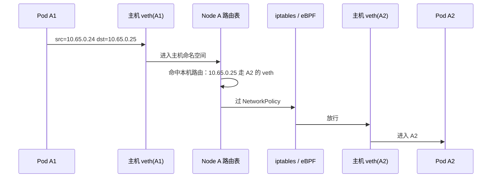
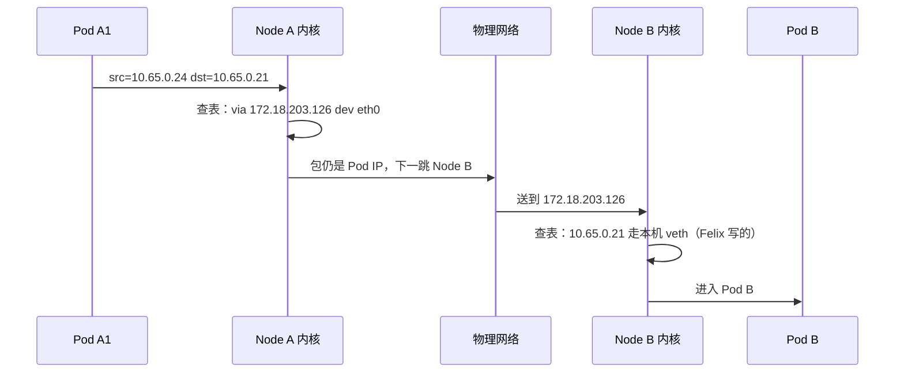
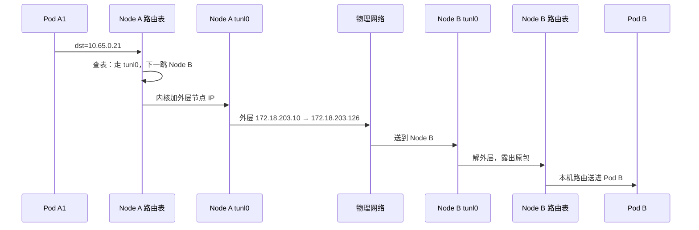

# Calico 网络：从「节点即路由器」到包怎么走

> 依据 Calico Open Source **3.32**。Calico 的核心赌注只有一句：**把每台节点当成一台路由器**。真正转发数据包的是 Linux 内核；Felix、BIRD、confd 只负责把内核的状态写对、把路由告诉别的机器。[1][2][11]

可与本库 [《Kubernetes 控制面原则》](./20-architecture/23-kubernetes-control-plane-doctrine.md) 对照：那边讲控制面如何收敛；这里讲同一个集群里，包在节点上究竟怎么走。

全文用同一组例子，避免数字跳来跳去：

| | 节点 IP | 上面的 Pod |
|--|---------|------------|
| **Node A** | `172.18.203.10` | Pod A1 `10.65.0.24`、Pod A2 `10.65.0.25` |
| **Node B** | `172.18.203.126` | Pod B `10.65.0.21` |

---

## 目录

1. [问题与 Calico 的取舍](#1-问题与-calico-的取舍)
2. [节点上跑什么：三个进程 + CNI](#2-节点上跑什么三个进程--cni)
3. [包的实际路径：只是 Linux 路由](#3-包的实际路径只是-linux-路由)
4. [路由怎么出现在每台机器上](#4-路由怎么出现在每台机器上)
5. [地址分配与封装开关](#5-地址分配与封装开关)
6. [选型与排查](#6-选型与排查)
7. [参考文献](#7-参考文献)

---

## 1. 问题与 Calico 的取舍

Kubernetes 对网络的要求很简洁：每个 Pod 一个 IP，任意两个 Pod 能直接互访，中间不做 NAT。[3]

要满足它，常见有两条路：

| 思路 | 做法 | 代价 |
|------|------|------|
| **Overlay** | 底层只认识节点 IP，把 Pod 包再套一层节点 IP 转发 | 每个包多一层头；Pod IP 出不了集群 |
| **纯路由** | 让底层网络也认识 Pod IP，按三层路由转发 | 底层必须肯转发「不属于节点子网」的地址 |

Calico 默认押注第二条：**每台节点就是一台 vRouter**，转发交给 Linux 内核，「这个 Pod IP 在哪台机器上」用 BGP 在节点之间分发。[11] 只有当底层做不到（公有云跨子网、动不了交换机）时，才退回去用 IPIP / VXLAN 套一层。[6]

由此推出两件事必须分开看：

- **能不能到**：路由表说了算。本机 Pod 的路由由 Felix 写；到其他节点 Pod 的路由官方叫 cluster routes。[1][2]
- **到了允不允许过**：NetworkPolicy 说了算，由 Felix 编译成内核规则。[1]

一句话记住整体形状：**控制面写表，数据面查表。** 三个守护进程都不在包的路径上。

---

## 2. 节点上跑什么：三个进程 + CNI

每个节点上有一个 `calico-node` Pod（镜像 `calico/node`），里面是三个常驻进程。另外 kubelet 在创建/删除 Pod 时会调用 **CNI 插件**——它不是这三个常驻进程之一，负责要 IP、建 veth；Felix 再把内核状态补齐。[1][3]



三个进程的边界，按「和内核、和别的节点」两条线切：

| | **Felix** | **BIRD** | **confd** |
|--|-----------|----------|-----------|
| 干什么 | 把本机 endpoint 需要的路由和策略写进内核 [1] | 用 BGP 把本机路由分发出去，把学到的远端路由写回来 [1][2] | 监视集群配置，生成 BIRD 配置并让 BIRD 加载 [1] |
| 和内核 | **写**：接口属性、本机 Pod 路由、防火墙规则 | **读**本机路由，**写**远端路由 | **不碰内核** |
| 和别的节点 | 不建立 BGP | 和其他节点 / 交换机建 BGP | 不建会话 |
| 不干什么 | 不建 veth，不跑 BGP | 不建 veth，不写 NetworkPolicy | 不转发，不写 iptables |

### datastore：先把它说清楚，别和 etcd 画等号

文档里反复出现的 **datastore** 是一个抽象，不是某个具体组件。Calico 把所有配置（`IPPool`、`BGPPeer`、`FelixConfiguration`、NetworkPolicy、endpoint 状态……）都放进 datastore，Felix / confd / kube-controllers 都从它读。它有两种实现，**默认在 Kubernetes 集群里并不是直接用 etcd**：[1][13]

| datastore | 实际存哪 | Calico 怎么访问 | 什么时候用 |
|-----------|---------|----------------|-----------|
| **Kubernetes API datastore（kdd）** | Kubernetes API server 背后的 etcd（**就是 K8s 自己那个 etcd**），但以 `projectcalico.org/v3` CRD 形式存 | 走 Kubernetes API（kube-apiserver），和 `kubectl` 同一条路 | **K8s 集群的默认**；管理简单、可复用 RBAC / audit log |
| **etcd** | 一个**专给 Calico 用的 etcd**（可以独立于 K8s 的 etcd，也可共享） | Calico 组件直连 etcd gRPC | 非 K8s 平台、多 K8s 集群共用一份 Calico、或想把 Calico 与 K8s 数据存储独立扩容 |

容易混的两个点：

- **kdd 模式下，物理存储仍然是 etcd** —— 因为 Kubernetes 自己就用 etcd 当后端。区别只在 Calico **不直接连 etcd**，而是通过 kube-apiserver 读写 CRD。所以「datastore = etcd」这句话在 kdd 下**对一半**：物理上对，访问路径上不对。
- **etcd 模式下，那个 etcd 是 Calico 自己的**，和 K8s 控制面的 etcd 通常是两套，可以独立扩容、独立备份。这才是「datastore 指 etcd」最准确的语境。

为什么这个区别重要：

- **扩容方向不同**：kdd 的瓶颈在 kube-apiserver（上 Typha 缓解）；etcd 模式的瓶颈在那个专用 etcd（按 etcd 规模调参）。
- **故障域不同**：kdd 里 K8s apiserver 挂了 Calico 也读不到配置；etcd 模式下两套存储互不影响。
- **运维边界不同**：kdd 用 `kubectl` 一套工具、一套 RBAC、一套 audit；etcd 模式要单独维护 etcd 的备份、证书、压缩。

一句话：**「datastore」是 Calico 的配置存储抽象；在 K8s 默认安装里它是 kube-apiserver 背后的那套 etcd，但 Calico 只通过 Kubernetes API 访问它；只有显式选 etcd 模式时，才是 Calico 直连一个专用 etcd。**

### Felix：本机执行者

官方列的四件事，全部发生在**这台机器**上：[1]

| 职责 | 写到哪 | 效果 |
|------|--------|------|
| 接口 | 网卡参数、ARP、转发开关 | 主机用**自己的 MAC** 回答 Pod 的 ARP；打开 IP 转发 [1][2] |
| 本机路由 | 路由表 | 「去本机这个 Pod IP，从对应那根 veth 出去」 |
| 策略 | iptables 或 eBPF | 只放行 NetworkPolicy 允许的流量，且 Pod 不能绕过 |
| 报状态 | 写回集群 | 本机配置失败时能被看到 |

Felix 不和其他节点交换路由。

### BIRD：BGP 客户端

Felix 把本机路由插入内核之后，BIRD 把这些路由用 BGP 分发出去；对端告诉它的路由，它再写进本机路由表。[1][2] 它不建网卡，也不解释 NetworkPolicy。

### confd：BIRD 的配置生成器

它盯着 datastore（kdd 下就是 kube-apiserver 里的 CRD，etcd 模式下是专用 etcd）中和 BGP 相关的配置（AS 号、对等体、IPAM 等）。配置一变，重写 BIRD 配置文件，触发 BIRD 重新加载。[1] 改 BGP 对等体的链路是：

```text
改 BGPPeer / BGPConfiguration
   → 写入 datastore（kubectl apply CRD，或写 etcd）
   → confd 监到变化，生成新 BIRD 配置
   → BIRD reload
   → 会话按新配置建立
```

Felix 写策略 **不经过** confd。

只做策略、不分发节点间路由时（部分托管云），设 `CALICO_NETWORKING_BACKEND=none`：只留 Felix，不跑 BIRD 和 confd。[1]

---

## 3. 包的实际路径：只是 Linux 路由

官方把数据面收成三件事：**主机 MAC 答 ARP、按路由表转发、用 iptables 或 eBPF 做防火墙。**[2] 没有黑盒，没有用户态转发。

### 3.0 先说清 veth：Pod 和主机之间那根虚拟网线

三种场景的第一步都写着「包从 Pod 出来，经 veth 进主机」。这里把 veth 一次性讲透，后面就不再展开。

**veth 是 Linux 内核的一种虚拟网卡，永远成对出现**：两块接口像一根虚拟网线连起来，从一端塞进去的包会从另一端出来。两端可以放在不同的 network namespace 里，于是 veth 就成了「把两个网络命名空间接在一起」的标准手段。[3]

Calico 在 K8s 里用它的方式（Pod 创建时由 **CNI 插件**完成，不是 Felix）：[3]

```mermaid
flowchart LR
  subgraph PodNS["Pod 的 network namespace"]
    Eth0["eth0<br/>Pod IP: 10.65.0.24<br/>默认路由 via 169.254.1.1"]
  end
  subgraph HostNS["主机 network namespace"]
    Cali["caliXXXXXXXXX<br/>MAC: EE:EE:EE:EE:EE:EE<br/>Felix 在这端编程"]
    RT["路由表 / iptables / eBPF"]
  end
  Eth0 ==|"veth pair<br/>内核虚拟网线"| Cali
  Cali --> RT
```

具体几件事，按谁干的分开记：[1][3]

| 对象 | 谁来建/写 | 作用 |
|------|----------|------|
| **veth 这对网卡** | **CNI 插件**（kubelet 调 CNI 时建） | 一端放 Pod ns，一端留主机 ns；包进出 Pod 的物理通道 |
| Pod 端接口名 | CNI 按 CNI args 的 `IfName`，通常是 `eth0` | Pod 里看到的网卡 |
| 主机端接口名 | CNI 命名为 `cali` + 容器 ID 前 11 位（老版本）或 `cali` + `sha1(namespace.pod)[:11]`（新版本），前缀 `cali` 是 Felix 的 `InterfacePrefix` 默认值 | Felix 据此识别「这是 workload 接口」 |
| 主机端 MAC | CNI 设成 `EE:EE:EE:EE:EE:EE` | 固定值，省得内核再生成持久 MAC；也方便 Felix 统一处理 |
| Pod 端路由 | CNI 配：默认网关指向 `169.254.1.1`（link-local），走 `eth0` | Pod 把所有流量都发给 eth0，不关心真实下一跳 |
| 主机端属性 | **Felix**：开 IP 转发、让主机用自己的 MAC 回答 ARP、把 `10.65.0.24` 路由指向这根 `cali…` | 包一进主机就能被正确转发/过滤 |
| WorkloadEndpoint | CNI 创建后写入 datastore；记录 `interfaceName: cali…`、Pod IP、MAC、node 等 | Felix 据此知道「这个接口归我管」并编程 |

所以「**包从 Pod 出来，经 veth 进主机**」拆开就是：

1. Pod 把包发给自己的默认网关 `169.254.1.1`，从 `eth0` 出去；
2. `eth0` 是 veth 的一端，包穿过内核虚拟网线，**出现在主机 ns 里的另一端 `cali…` 上**——这一步就是「进主机」；
3. 主机内核接管：查路由表、过 iptables/eBPF、决定从哪块网卡再发出去。

关键点：**veth 只是通道，不转发也不路由**。真正决定包去哪的是主机路由表；Felix 的工作就是保证这张表和接口属性是对的。Pod 那一侧几乎「无脑」——它只知道「把包丢给 eth0」。

下面三种场景，前两步都一样：包从 Pod 出来，经 veth 进主机，主机用自己的 MAC 回答了 ARP。区别只在主机查表之后从哪出去。

### 3.1 同一台机器：A1 → A2

Node A 上 `10.65.0.24 → 10.65.0.25`。这条路径不进物理网卡、不进隧道、这次转发也用不到 BGP。



| 步 | 发生什么 | 谁事先写好的 |
|----|----------|--------------|
| 1 | A1 把包发给默认网关（veth 对端） | CNI 配的 Pod 内路由 |
| 2 | 主机用自己的 MAC 回答 ARP，包进主机 | Felix 的接口/ARP 设置 [2] |
| 3 | 路由表：`10.65.0.25` 直连，出口是 A2 的 veth | Felix 写的本机路由 [2] |
| 4 | 策略链决定放行还是丢 | Felix 写的 iptables / eBPF |
| 5 | 包从 A2 的 veth 进 A2 | — |

Node A 路由表里这两条都是 Felix 写的：

```text
10.65.0.24   dev cali…A1    # 本机 Pod
10.65.0.25   dev cali…A2    # 本机 Pod
```

### 3.2 跨节点、不封装：A1 → B

底层认识 Pod IP 时（节点同二层，或中间路由器已学会这些地址），包以 Pod IP 原样上路。[6]



| 位置 | 路由表示意 | 谁写的 |
|------|------------|--------|
| Node A | `10.65.0.21 via 172.18.203.126 dev eth0` | 默认 BIRD（学来的远端路由）[2] |
| Node B | `10.65.0.21 dev cali…B` | Felix（本机路由）[2] |

链路上源/目的 IP 始终是 `10.65.0.24 → 10.65.0.21`。交换机必须肯转发「目的地址不属于节点子网」的包。

### 3.3 跨节点、IPIP：A1 → B

底层不认识 Pod IP 时，再套一层节点 IP（IP-in-IP，IPv4 协议号 **4**）。隧道口一般是 `tunl0`。[6][8]

```text
内层（原包）   10.65.0.24   →  10.65.0.21
外层（套的头） 172.18.203.10 →  172.18.203.126   proto = 4
```



| 位置 | 路由表示意 | 谁写的 |
|------|------------|--------|
| Node A | `10.65.0.0/26 via 172.18.203.126 dev tunl0` | 默认 BIRD；常见带 `proto bird` |
| Node B | `10.65.0.21 dev cali…B` | Felix |

IPIP **只支持 IPv4**。Azure 会丢弃这种包，应改 VXLAN。[5][6]

BGP 在 IPIP 开启时 **默认仍在工作**：它负责「下一跳是 Node B」；`tunl0` 负责「路上套一层节点 IP」。二者不是二选一。[6]

### 3.4 三条路径对照

| | 同机 A1→A2 | 跨机不封装 A1→B | 跨机 IPIP A1→B |
|--|------------|-----------------|---------------|
| 出源 Pod | veth → 主机 | 同左 | 同左 |
| Node A 查表 | 直连 A2 的 veth | `via Node B`，出物理网卡 | `via Node B`，出 `tunl0` |
| 物理链路上的 IP | 包不离开这台机器 | 仍是 Pod IP | 外层是节点 IP |
| 到对端 | 不经过 Node B | Felix 的本机路由进 Pod B | 先解封装，再走本机路由 |
| 这次转发用不用 BGP | 不用 | 不用（路由应已事先学好） | 不用 |
| BGP 的用处 | 让别的节点知道 A1/A2 在这 | 事先把「B 在 Node B」写入 A 的表 | 同左 |

最后一行是关键：BGP 发生在**控制面、事先**；每个数据包只查内核。

两端的 iptables / eBPF 在同机和跨机时都会检查，与是否封装无关。[2]

---

## 4. 路由怎么出现在每台机器上

第 3 节里跨机转发能成立，前提是 Node A 的路由表里**事先**已经有「去 `10.65.0.21` 下一跳是 Node B」。这一节讲这些路由怎么来的。

### 4.1 内核里和 Calico 相关的三块

| 内核对象 | 谁来写（默认） | 转发时谁来用 |
|----------|----------------|--------------|
| veth 这对虚拟网线 | **CNI** 创建；Felix 再写 ARP、转发等属性 [1][3] | 包进出 Pod |
| 路由表 | **本机 Pod**：Felix；**其他节点上的 Pod**：默认 BIRD（VXLAN 池则是 Felix）[2][6] | 决定下一跳和出口网卡 |
| iptables / eBPF | Felix | 决定放行还是丢掉 |

### 4.2 创建一个新 Pod 之后发生什么

```text
1. kubelet 调 CNI：分配 IP，建 veth
2. Felix 写本机：
      接口（主机 MAC 答 ARP、打开转发）
      路由表里加上「10.65.0.24 → 这根 veth」
      策略规则
3. BIRD 从路由表里看到这条本机路由
4. BIRD 用 BGP 告诉 Node B：「去 10.65.0.24，下一跳是 172.18.203.10」
5. Node B 上的 BIRD 把对端路由写入 Node B 的路由表
```

第 3～5 步只发生一次（或随 Pod 增删变化）。之后 **A1 访问 B 的每一个包，都只查内核，不再问 Felix 或 BIRD**。[2]

### 4.3 cluster routes 由谁写

到其他节点的那些路由，官方叫 cluster routes。默认分工：[6]

- IPIP 池、以及不封装的池：由 BGP（BIRD）分发；
- VXLAN 池：由 Felix 直接写入。

也可以改成全部由 Felix 写（`FelixConfiguration.programClusterRoutes=Enabled`，Operator 里是 `clusterRoutingMode: Felix`）。那时集群内部可以不跑 BGP；若还要把地址告诉机房交换机，BGP 仍要开。[6]

### 4.4 BGP 拓扑

默认是节点间 **iBGP 全连接**（每台和每台建会话）。官方量级是大约 **100 台及以下**；再多用路由反射器。默认 AS 是 **64512**。[5]

| 怎么连 | 含义 | 什么时候用 |
|--------|------|------------|
| 节点全连接 | 默认打开 | 中小集群 |
| 路由反射器 | 普通节点连少数几台反射器（常用两台做备份）。反射器**只传路由，业务包不经过它** [1][5] | 节点多了，全连接会话太多 |
| 和机柜交换机对接 | 关掉节点互连，改和 ToR 建 BGP | 机房里希望集群外也能直接访问 Pod IP [3][5] |

查看 BGP 是否建好，用 `calicoctl node status`，且必须在**那台节点上**执行，因为它问的是本机进程。[5] BGP 走 TCP **179**。

---

## 5. 地址分配与封装开关

### 5.1 地址怎么分

Calico IPAM 按块分给节点，IPv4 默认 **/26**（64 个地址）。块大小只在创建 IP 池时能定。[7]

内核里你仍可能看到到某个 Pod 的 /32，那是 Felix 写的本机转发条目；BGP 通告时则尽量用整块，少传一些路由。[2][7]

一块用完了会再要一块。实在没有空块时，可能从其他节点已占用的块里**借用**地址，这时会为借用地址下发更细的路由，表会变大。官方建议：池子里的块数不要少于节点数。[7]

`disableBGPExport: true` 可以禁止把该池的地址通过 BGP 发出去（v3.21 起）。[7]

### 5.2 要不要套头

容易混的一点：**IPIP 和 BGP 不是二选一。**

- BGP 回答的是：去那个 Pod，下一跳是哪台机器。
- IPIP / VXLAN 回答的是：两台机器之间，要不要把原包再套一层。

所以开了 IPIP 时，BGP 默认**仍在工作**：它通告「去这段地址，下一跳是对端节点」，本机转发时出口走 `tunl0`。[6]

| | 不封装 | IPIP | VXLAN |
|--|--------|------|-------|
| 链路上你看到的 | Pod IP | 外面是节点 IP，里面是原包 | 用 UDP 再包一层，头比 IPIP 大 |
| 隧道口 | 没有 | `tunl0` | `vxlan.calico` |
| 限制 | 底层必须能转发 Pod IP | 仅 IPv4；Azure 不可用 [5][6] | 如果集群里只有 VXLAN 池，内部可以不跑 BGP [6] |
| 多出来的头 | 0 | IPv4 约 20 字节 | IPv4 约 50 字节，IPv6 约 70 字节 [12] |

同一个 IP 池不能同时开 IPIP 和 VXLAN。[7] 换封装模式可能打断已经建立的连接，要放在维护窗口。[6]

`ipipMode` / `vxlanMode` 三个取值：[7]

| 取值 | 实际含义（按官方） |
|------|--------------------|
| **Always** | 从启用了 Calico 的主机，访问该池里的容器/虚拟机时，都走这种封装 |
| **CrossSubnet** | 仅当**目的节点的 IP 和本节点不在同一子网**时才封装。节点属于哪个子网，记在 Node 对象上，一般由 `calico/node` 自己探测 |
| **Never** | 不用这种封装 |

能用 CrossSubnet 时，官方更建议用它：同一子网里不封装，跨子网再封装。适合 AWS 多可用区、Azure VNet，以及「一组机器在二层、组与组之间过路由」的网络。[3][6]  
Google 云是纯三层网络，**没有** CrossSubnet 这一档，要封装就整网封装。[3]

安装时还有两套「默认」，不要混：

- 用 Operator 装，IP 池的 `encapsulation` **默认是 IPIP**（相当于 `ipipMode: Always`）；[10]
- 自己建一个 `IPPool` 对象，字段默认值是 **Never**。[7]

开了 IPIP 或 VXLAN，官方建议同时打开 `natOutgoing`。否则 Pod 和主机之间的来回路径可能不对称，被反向路径检查丢掉。[7]

---

## 6. 选型与排查

### 6.1 选型（官方建议的压缩版）

先问一句：底层认不认 Pod IP？认，就不封装；不认，再封装。Azure 不要用 IPIP。[3][5][6]

| 环境 | 更稳妥的做法 |
|------|----------------|
| 机房，能和交换机做 BGP | 不封装，和 ToR 交换路由；集群外也可以直接访问 Pod |
| 机房，节点都在同一二层 | 节点之间 BGP、不封装；集群外仍然到不了这些 Pod IP |
| 机房，动不了底层 | VXLAN CrossSubnet（或 IPIP CrossSubnet） |
| AWS，希望用 VPC 里的 IP | Amazon VPC CNI 做网络，Calico 做策略 |
| AWS / Azure，VPC 地址不够 | Calico 自己组网 + VXLAN CrossSubnet |
| Azure，希望用 VNet 里的 IP | Azure CNI + Calico 策略（不要 IPIP） |
| GCP，希望用 VPC 里的 IP | 云厂商路由 + host-local IPAM，Calico 做策略 |
| GCP 上自己做 Overlay | VXLAN（或 IPIP）Always，没有 CrossSubnet |
| 还不想和底层较劲，先跑起来 | VXLAN CrossSubnet |

大约一百台以上：BGP 不要再用全连接，改反射器或和交换机对接，并打开 **Typha**——它在 datastore（kdd 下即 kube-apiserver）和 Felix / confd 之间做一层缓存与去重，把「N 个节点各自 watch apiserver」收敛成「少数几个 Typha watch，再 fan-out 给几百个 Felix」，否则 apiserver 会被 watch 打爆。[1][5]

MTU 默认会按当前封装自动算。改 MTU **只对之后新建的 Pod 生效**。[12] 常见 1500 的网：不封装用 1500，IPIP 用 1480，VXLAN 用 1450，IPv4 WireGuard 用 1440。[12]  
AKS 网卡上常显示 1500，底层实际更接近 1400；开了 WireGuard 时要按 1400 再减 60，否则容易丢包。[12]

### 6.2 查什么

按这个顺序即可：**BGP 有没有建上 → 路由下一跳对不对 → 是否和封装设置一致 → Pod 能不能通 → 是不是被策略丢掉。**

```yaml
apiVersion: projectcalico.org/v3
kind: IPPool
metadata:
  name: default-ipv4-ippool
spec:
  cidr: 192.168.0.0/16
  blockSize: 26
  ipipMode: CrossSubnet    # Always | CrossSubnet | Never
  vxlanMode: Never
  natOutgoing: true
```

```bash
calicoctl node status              # 必须在该节点上跑
kubectl get ippool -o yaml
ip route get 10.65.0.21            # 从 Node A 上看去 Pod B
ip route get 10.65.0.25           # 从 Node A 上看去本机 A2
```

| `ip route get` 出口 | 通常表示 |
|---------------------|----------|
| 出口是本机 `cali…` / veth | 同机，或已经到了目的节点本机 |
| `dev eth0` 且下一跳是对端节点 | 跨机、未封装 |
| `dev tunl0` | 跨机、IPIP |
| `dev vxlan.calico` | 跨机、VXLAN |
| 没有到对端 Pod 的路由 | 远端路由还没装上：查 BIRD / BGP / IP 池 |

再核对：安全组是否放行 TCP 179、IP 协议 4（IPIP）、UDP 4789（VXLAN）。日志看 `calico-node` 容器，安装方式不同，命名空间也不一样。

---

## 7. 参考文献

以 Calico Open Source **3.32** 为准。

| 编号 | 文档 | 核对什么 |
|------|------|----------|
| [1] | [Component architecture](https://docs.tigera.io/calico/latest/reference/architecture/overview) | Felix / BIRD / confd 职责 |
| [2] | [The Calico data path](https://docs.tigera.io/calico/latest/reference/architecture/data-path) | ARP、本机路由、跨节点路由 |
| [3] | [Determine best networking option](https://docs.tigera.io/calico/latest/networking/determine-best-networking) | veth、选型 |
| [5] | [Configure BGP peering](https://docs.tigera.io/calico/latest/networking/configuring/bgp) | BGP、Azure 与 IPIP |
| [6] | [Overlay networking](https://docs.tigera.io/calico/latest/networking/configuring/vxlan-ipip) | 封装；cluster routes 由谁写 |
| [7] | [IP pool](https://docs.tigera.io/calico/latest/reference/resources/ippool) | ipipMode、blockSize |
| [8] | [RFC 2003](https://www.rfc-editor.org/rfc/rfc2003) | IP-in-IP |
| [9] | [Configuring calico/node](https://docs.tigera.io/calico/latest/reference/configure-calico-node) | 三个常驻进程 |
| [10] | [Installation API](https://docs.tigera.io/calico/latest/reference/installation/api) | Operator 默认封装 |
| [11] | [Calico over IP fabrics](https://docs.tigera.io/calico/latest/reference/architecture/design/l3-interconnect-fabric) | 节点当路由器 |
| [12] | [Configure MTU](https://docs.tigera.io/calico/latest/networking/configuring/mtu) | 封装开销 |
| [13] | [The Calico datastore](https://docs.tigera.io/calico/latest/getting-started/kubernetes/hardway/the-calico-datastore) | kdd vs etcd 两种 datastore |
