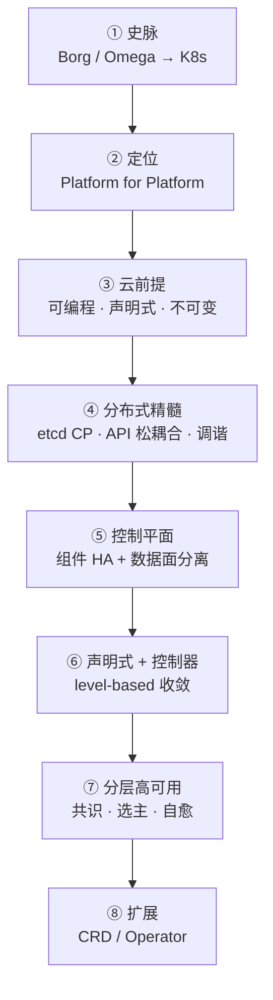
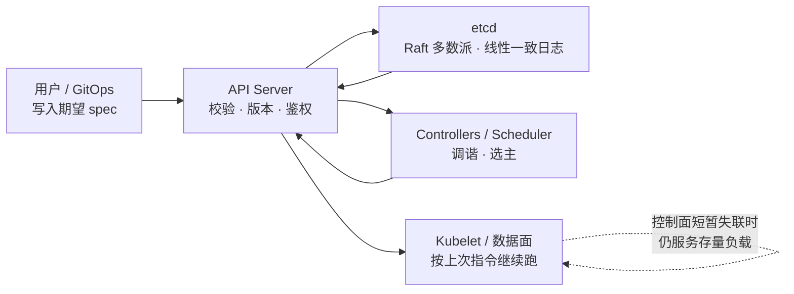
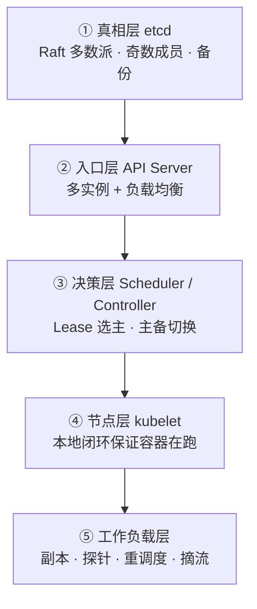

# Kubernetes 设计哲学：声明式 API、控制循环与分层高可用

> Kubernetes 的名字源于希腊语，意为「舵手 / 飞行员」。Google 于 2014 年开源该项目，把十余年大规模生产负载经验与社区最佳实践结合成一套可对外使用的容器编排平台。[1]
>
> 本文焦点不在命令与 YAML 细节，而在其**本体设计**：它如何把**分布式系统的取舍**写进架构，又如何用**分层高可用**在故障常态下仍可治理——并非「少出错」，而是声明式期望、共识存储、多控制器调谐与控制面/数据面分离协同作用的结果。

全文按一条暗线展开：**史脉与定位 → 云前提 → 分布式精髓 → 控制平面与 API → 声明式调谐 → 分层高可用 → 扩展与愿景。** 关键史实与设计论断尽量对齐一手文献与官方文档；涉及 CAP / Raft 等通用理论，可对照本库 [《分布式系统理论》](./distributed-systems-theory.md)。文末附参考文献。

先记住总纲：

> **Kubernetes 不是一次性编排脚本，而是一台「分布式控制计算机」：以 etcd 的强一致共享状态为真相源，以声明式 API 为唯一协调语言，以可失败的控制循环持续把世界推向期望态——并在控制面短暂失联时，尽量让数据面按「上次指令」继续服务。**[1][12][18]

---

## 目录

**上篇 · 从何而来、是什么**

1. [一条主线：问题如何层层展开](#1-一条主线问题如何层层展开)
2. [发展脉络：Borg → Omega → Kubernetes](#2-发展脉络borg--omega--kubernetes)
3. [Kubernetes 是什么（与不是什么）](#3-kubernetes-是什么与不是什么)
4. [核心理念：Platform for Platform](#4-核心理念platform-for-platform)

**中篇 · 分布式精髓如何立身**

5. [云基础设施的三个前提](#5-云基础设施的三个前提)
6. [分布式精髓：共享真相、松耦合与持续收敛](#6-分布式精髓共享真相松耦合与持续收敛)
7. [控制平面：组件、控制论与数据面分离](#7-控制平面组件控制论与数据面分离)
8. [一切皆在 API 中](#8-一切皆在-api-中)
9. [声明式 API 与控制器模式](#9-声明式-api-与控制器模式)
10. [设计原则精要](#10-设计原则精要)

**下篇 · 高可用、扩展与愿景**

11. [分层高可用：从 etcd 多数派到工作负载自愈](#11-分层高可用从-etcd-多数派到工作负载自愈)
12. [可扩展性：CRD 与 Operator](#12-可扩展性crd-与-operator)
13. [愿景：软件的通用控制平面](#13-愿景软件的通用控制平面)
14. [总结](#14-总结)
15. [参考文献](#15-参考文献)



---

## 1. 一条主线：问题如何层层展开

读本文时，请按「提问顺序」理解，而不是名词堆砌：

| 步骤 | 提问 | 本文对应 |
|------|------|----------|
| 1 | 为何需要这类系统？经验从哪来？ | 第 2 节史脉 |
| 2 | 它到底管什么、不管什么？ | 第 3–4 节定位 |
| 3 | 云时代基础设施先要满足什么？ | 第 5 节三前提 |
| 4 | **分布式精髓是什么？状态如何跨节点协调？** | **第 6 节** |
| 5 | 控制平面如何组成？与数据面如何分工？ | 第 7–9 节 |
| 6 | 官方原则如何约束实现？ | 第 10 节 |
| 7 | **高可用如何分层落地？边界在哪？** | **第 11 节** |
| 8 | 同一套机制如何扩展到任意领域？ | 第 12–13 节 |

---

## 2. 发展脉络：Borg → Omega → Kubernetes

### 2.1 三代系统

Google 内部先后出现三代容器管理系统，Burns / Grant / Oppenheimer 在 *Borg, Omega, and Kubernetes* 中作了清晰区分：[2]

| 系统 | 大致时期 | 定位 |
|------|----------|------|
| **Borg** | 约 2003–2004 年起 | Google 内部大规模集群管理；在数千应用、数十万作业、多集群与数万台机器规模上运行。[3] |
| **Omega** | 约 2013 年前后相关工作发表 | Borg 的后继实验：更一致的架构，共享持久状态存储 + 乐观并发，便于把控制面拆成对等组件。[2][4] |
| **Kubernetes** | 2014 开源，2015 达 1.0 | 面向外部开发者与公有云生态的开源系统；吸收前两代经验，但**不是 Borg 源码的直接开源**。[2] |

业界更严谨的表述是：Kubernetes **吸收了 Borg / Omega 的设计经验与理念**。Brian Grant（Borg 技术负责人之一、Omega 创始人、Kubernetes 设计负责人）指出：若眯眼看去，Omega 的许多属性都能在 Kubernetes 中看到；他有时称 Kubernetes「更像开源的 Omega，而非开源的 Borg」。Scheduling Unit 等概念随后演进为 Pod。[5]

从分布式视角看，三代演进的关键遗产是：

- **共享集群状态**作为协调枢纽（Omega / Kubernetes 尤甚）；
- **异步控制器**监视状态变化并写回观测结果；
- Kubernetes 相对 Omega 的关键升级：状态**不直接暴露存储**，而必须经 **REST API** 施加版本、校验与策略——以便服务更多样、更不可信的客户端。[2]

### 2.2 关键节点（可核验）

| 时间 | 事件 |
|------|------|
| 2014-06 | 仓库首批提交；Eric Brewer 在 DockerCon 宣布项目。[6] |
| 2014 | Microsoft、Red Hat、IBM、Docker 等陆续加入社区。Google 选择间接开源 Kubernetes 而非 Borg：内部系统过于复杂、无法直接外用，但设计思想可以产品化。 |
| 2015-07-21 | Kubernetes **1.0** 发布；Google 将其捐赠给新成立的 **CNCF**（Linux Foundation 旗下）。[6][7] |
| 2016–2018 | 生态快速主流化：监控（Prometheus）、服务网格（如 Istio，2017）、云厂商托管服务（如 EKS 等）相继成熟；KubeCon 成为全球云原生主会场。 |

CNCF 旨在围绕高质量开源项目建立可持续的云原生生态；Kubernetes 是其种子项目之一，其后还包括 Prometheus、gRPC、CoreDNS 等。[7]

---

## 3. Kubernetes 是什么（与不是什么）

### 3.1 一句话定义

Kubernetes 是一个可移植、可扩展的**开源平台**，用于管理容器化工作负载与服务，并同时支持**声明式配置**与**自动化**。[1]

生产集群通常由**控制平面**与多台**工作节点**组成：控制平面做全局决策并响应集群事件；节点托管工作负载 Pod。生产环境中控制平面与节点都会横向复制，以提供容错与高可用。[18]

### 3.2 它提供什么

官方文档列出的核心能力包括（节选）：[1]

| 能力 | 含义 |
|------|------|
| 服务发现与负载均衡 | DNS / VIP；流量升高时可分散负载 |
| 存储编排 | 自动挂载所选存储系统 |
| 自动发布与回滚 | 按期望状态受控地推进实际状态 |
| 自动装箱 | 按 CPU / 内存请求把容器摆上节点 |
| 自愈 | 重启失败容器、替换、按健康检查摘流 |
| 密钥与配置管理 | 不重建镜像即可更新 Secret / Config |
| 水平扩展 | 命令、UI 或基于指标自动扩缩 |
| 可扩展设计 | 不必改上游源码即可扩展集群能力 |

### 3.3 它不是什么

Kubernetes **不是**传统意义上大而全的 PaaS。它提供构建开发者平台的积木，但刻意保留用户选择权。[1]

更关键的一点：它也**不是**传统意义上的「编排器」。编排通常指固定工作流「先 A 再 B 再 C」；Kubernetes 则是一组独立、可组合的控制过程，持续把当前状态推向期望状态——**如何从 A 到 C 往往并不重要**，也未必需要中心化指挥。[1]

> 这正是分布式精髓的一句话版本：**用持续收敛替代中心化剧本。**

### 3.4 生态依赖（平台边界）

| 类别 | 典型组件 | 说明 |
|------|----------|------|
| 镜像分发 | 各类 Registry / OCI 仓库 | 制品供给 |
| 网络 | CNI 插件（如 Calico、Cilium、Flannel）、CoreDNS | Pod 网络与集群 DNS |
| 入口 / LB | Ingress Controller、云厂商 LB、MetalLB 等 | 对外流量 |
| 可观测 | Prometheus、OpenTelemetry 等 | 指标 / 追踪 / 日志 |
| 安全 | RBAC、网络策略、策略引擎、身份集成 | 认证授权与隔离 |
| 服务网格 | Istio、Linkerd 等 | 流量治理、mTLS（非遥测本身） |

**Kubernetes 管「如何声明与收敛」；周边生态管「具体实现插件」。**

---

## 4. 核心理念：Platform for Platform

Kubernetes 的核心定位是做 **Platform for Platform**：用来帮助使用者构建分布式系统的分布式系统。首要用户是分布式应用的开发者——可以是稍具规模的网站，也可以是 TiDB 一类复杂的数据系统。

这一「平台之平台」的定位，催生并放大了整个云原生生态：上层可以继续声明式地扩展（CRD / Operator / 各类控制器），而不必每次重造控制平面。官方架构表述与此一致：系统应可扩展、可自动化；声明式是自愈与自主行为的关键。[8]

---

## 5. 云基础设施的三个前提

Kubernetes 能成立，建立在云计算把基础设施「产品化」之后的三个前提之上。

### 5.1 基础设施是可编程的

云提供商从一开始就把计算、存储、网络建成 **API 驱动**的弹性自助服务。一旦核心能力以 API 暴露，就可以复用并堆叠更高抽象。**可编程**使云与传统托管拉开差距。

### 5.2 基础设施具有声明性

规模化交付时，不能依赖「逐步命令式运维」去手工处理工作流中的每一种故障。**声明式 API** 让用户描述想要的结果，而把如何到达结果留给平台——这正是分布式环境下降低协调复杂度的关键路径。

### 5.3 基础设施可以是不可变的

**不可变基础设施**强调：以版本化制品**替换**运行单元，避免就地变更造成配置漂移。容器镜像的不可更改性，使发布与回滚成为「换一批已知良好的制品」。[1]

与之相关但不可混为一谈的还有：

- **无侵入性**：应用通常无需为适配 Kubernetes 改写业务代码。[8]
- **可移植性与有状态支持**：用 PV / PVC 屏蔽存储差异，让有状态负载也可迁移恢复。[9]

---

## 6. 分布式精髓：共享真相、松耦合与持续收敛

若只用「容器编排」理解 Kubernetes，会错过它真正难且真正强的部分。它首先是一台**分布式控制系统**，其精髓可以收成四条。

### 6.1 一条共享真相源（CP 存储）

所有集群对象最终落在 **etcd**：一个**强一致、高可用**的分布式键值存储，作为 Kubernetes 的 backing store。[18][19]

etcd 用 **Raft** 做共识：写请求须经多数派（quorum，\(\lfloor n/2\rfloor + 1\)）确认后才提交；从而在成员失败时仍保持**单一、有序**的状态历史，并从根本上避免脑裂。[20][21]

在 CAP 语言下（详见 [《分布式系统理论》](./distributed-systems-theory.md)）：etcd / 控制面状态存储偏向 **CP**——分区导致多数派不可达时，**宁可停止写入，也不交出两份互相矛盾的集群真相**。[19][20]

> **分布式协调的第一纪律：关于「集群应该是什么样」的真相，只能有一份。**

### 6.2 唯一协调语言（API 松耦合）

Omega 曾让受信控制面组件直接访问共享存储；Kubernetes 改为：**只有 API Server 访问 etcd**，其余组件一律经 API 协作。[2][12]

效果是：

- Scheduler、Controller、Kubelet、外部 Operator **彼此不直连**，只通过对象的 `spec` / `status` 对话；
- 任意组件可独立升级、失败、重启，只要最终能读到一致的期望态并写回观测态；
- 扩展点天然存在：新控制器只要理解 API，就能加入同一协调网络。

这是分布式系统里经典的 **shared-nothing control logic + shared consistent state** 模式：逻辑松耦合，状态强一致。

### 6.3 持续收敛，而非一次成功的剧本

编排器按步骤执行；Kubernetes 按偏差调谐。官方明确：集群可能**长期达不到完全稳态**；只要控制器仍在有效纠偏，是否「稳定」并不关键。[11]

配套机制是 **level-based（电平触发）**：正确性只依赖「当前观测」与「期望」，不依赖是否收到过每一个中间事件；边沿触发只是性能优化。[12]

因此，网络丢事件、进程重启、短暂分区，都被设计成「下一轮循环再对齐」——这是分布式环境下对抗不可靠通信的默认姿势。

### 6.4 静态稳定（Static Stability）

官方设计原则要求：组件在缺少新指令时（网络分区或控制面中断），应**继续执行上次被告知的行为**。[12]

Marc Brooker 对控制面/数据面的划分与此同向：数据面位于请求路径，控制面可短时中断而不必然中断业务。[10]

> **高可用的分布式含义不是「控制面永不挂」，而是「控制面挂了，正在服务的世界尽量不塌」。**



---

## 7. 控制平面：组件、控制论与数据面分离

### 7.1 控制平面组件

官方架构将控制平面职责概括为：做全局决策（如调度），并检测与响应集群事件（如副本不足时创建 Pod）。主要组件如下：[18]

| 组件 | 角色 | 高可用形态（概要） |
|------|------|-------------------|
| **kube-apiserver** | 控制面前端；唯一对外/对内的集群 API | **无状态可水平扩展**，前端挂负载均衡。[18] |
| **etcd** | 全部集群数据的一致存储 | **奇数成员 + Raft 多数派**（生产常建议 3 或 5）。[19][20] |
| **kube-scheduler** | 为未绑定节点的 Pod 选节点 | 多实例 + **Lease 选主**，同时仅一个活跃。[22] |
| **kube-controller-manager** | 运行各类内置控制器 | 同上，多实例选主。[22] |
| **cloud-controller-manager** | 对接云厂商 API 的控制器 | 可水平扩展以容忍失败。[18] |

节点侧则有 **kubelet**（保证 Pod 规约落地）、可选的 **kube-proxy**（Service 网络规则）与容器运行时。[18]

### 7.2 控制论视角

数据面 / 控制面分离常见于 SDN；Marc Brooker 从运维与扩展属性作了实用概括：[10]

1. **数据平面**：直接位于请求路径；须随请求量扩展。
2. **控制平面**：资源管理、容错、部署；可短时中断而不必然中断每个请求。

在 Kubernetes 中，**Controller** 就是持续运行的控制循环：观察集群状态，并在需要时发起变更，使当前状态不断逼近期望状态。[11]

设计信条是：**多个简单控制器各管一块状态**，而非单体交叉控制环——因为控制器也会失败，系统必须能容忍单控制器失效，并由控制平面其他部分接管工作。[11]

因此，**通用控制平面首先取决于 API 与一致性存储的设计，其次才是「会跑容器」。**

---

## 8. 一切皆在 API 中

实践约束很严格：

- 资源数据结构遵循统一惯例（`apiVersion` / `kind` / `metadata` / `spec` / `status`）；
- 对资源的动作映射到一致的 API 动词；
- 工具与库因此可以跨资源类型复用。

因为结构一致，横切控制器可以忽略资源语义差异。官方原则还要求：**控制平面应透明——没有隐藏的内部 API**；只有 API Server 应与 etcd 通信。[12]

---

## 9. 声明式 API 与控制器模式

### 9.1 声明式 vs 命令式

| | 声明式 | 命令式 |
|--|--------|--------|
| 关注点 | 要什么结果 | 一步步怎么做 |
| 类比 | SQL 描述「想要的数据」 | 多数通用语言逐步改状态 |
| 分布式含义 | 把「如何克服故障」交给平台循环 | 调用方自己编排失败与重试 |

Kubernetes 围绕 etcd 构建「面向终态」的编排体系：用户提交对象的 `spec`（期望），系统负责让实际运行逼近该期望。对每个持久化对象，对应控制器以无限循环进行监视与调谐。[11]

```text
for {
    actual  := 获取对象 X 的实际状态
    desired := 获取对象 X 的期望状态

    if actual == desired {
        // 无操作
    } else {
        // 执行编排动作，把 actual 推向 desired
    }
}
```

控制器通常通过 Informer / Workqueue 消费 API 变化（底层依赖 Watch）。实现上，Informer 先 `LIST` 再 `WATCH`，在本地缓存上做调谐，以避免对 API Server 的轮询风暴——**缓存是运行模型，不只是性能优化**。[23]

调谐必须**幂等**：不假设「刚写完立刻读到自己的写入」；下一轮循环会再次对齐。[23]

### 9.2 与健壮性的衔接

官方把集群视为**持续变化**的系统。容错靠的是**持续收敛**，而非一次性排障剧本。[11]

---

## 10. 设计原则精要

以下摘自 Kubernetes 设计原则文档中与分布式 / 高可用最相关的条目：[12]

| 类别 | 原则 | 含义 |
|------|------|------|
| API | 全部 API 应声明式 | 字段表达期望状态，而不是「去执行某动作」 |
| API | 对象应可组合 | 互补原语，而非不透明大包 |
| API | 无隐藏内部 API | 控制面透明 |
| API | `status` 可仅凭观察重建 | 历史只是优化，不是正确性前提 |
| 控制逻辑 | **Level-based（电平触发）** | 只凭期望态与观测态即可正确运行 |
| 控制逻辑 | 开放世界假设 | 容忍外部角色；例如用户杀掉被管理的 Pod，控制器再补 |
| 控制逻辑 | 组件自愈、优雅降级 | 缓存需周期性刷新；过载时优先保核心动作 |
| 架构 | 仅 API Server 访问 etcd | 其他组件经 API 协作 |
| 架构 | 分区时继续执行上次指令 | **静态稳定** |
| 架构 | 优先 Watch 而非轮询 | 事件驱动收敛 |
| 架构 | 单节点失陷不应毁掉整个集群 | 故障域隔离 |

---

## 11. 分层高可用：从 etcd 多数派到工作负载自愈

**一句话**：Kubernetes 的高可用，不是某一层「多副本」的口号，而是**按故障域分层**：真相源用共识保正确，API 层水平扩展保入口，控制器用选主保「单一活跃调谐者」，节点与负载用自愈保业务 Continuity，再靠控制面/数据面分离换取静态稳定。



### 11.1 真相层：etcd 多数派

官方要求：生产环境以多节点 etcd 运行并定期备份；并指出生产上常推荐五成员集群等运维实践。[19] etcd FAQ 阐明：集群规模宜为奇数；对 \(n\) 成员，quorum = \(\lfloor n/2\rfloor + 1\)；向奇数集群盲目加一个节点，**容错能力未必提升**。[20]

关键运维事实：

- 心跳与磁盘 I/O 饥饿会导致选主抖动；无主时集群**无法推进状态变更**（例如无法调度新 Pod）。[19]
- 扩容 etcd 换的是可用性权衡，**不自动提高吞吐**；官方强烈建议避免对 etcd 做自动伸缩。[19]
- 丢失全部控制面节点时，etcd 快照是灾难恢复的关键资产。[19]

HA 拓扑上，kubeadm 支持两种典型形态：[24]

| 拓扑 | 做法 | 取舍 |
|------|------|------|
| **Stacked** | etcd 与控制面组件同机 | 简单；一节点故障同时损失 etcd 成员与控制面实例 |
| **External etcd** | etcd 独立主机 | 故障域解耦更好；主机数量约翻倍（至少 3+3） |

### 11.2 入口层：API Server 水平扩展

`kube-apiserver` 被设计为可水平扩展：部署多个实例并在前面做负载均衡。[18] 它本身不保存权威状态（权威在 etcd），因此属于「无状态接入层」——这是控制面 HA 里最干净的一层。

### 11.3 决策层：Lease 选主

Scheduler 与 Controller Manager 若多副本同时积极调谐，会互相打架。Kubernetes 用 `coordination.k8s.io` 的 **Lease** 做分布式锁式选主：同一时刻仅领导者执行主循环，其余热备；领导者须在租约期内续约，否则他者接管。[22]

这是分布式系统里标准的 **active/passive** 模式：用短租约换快速故障转移，用「单一写者」避免脑裂式双重控制。

### 11.4 节点与工作负载层：分层自愈

官方自愈画像：[13]

| 层级 | 机制 | 作用 |
|------|------|------|
| 容器 | 按 `restartPolicy` 重启失败容器 | 进程级故障快速回收 |
| 工作负载 | Deployment / ReplicaSet / StatefulSet / DaemonSet 维持副本；节点不可用时重新调度 | 实例丢失后补齐期望副本 |
| 存储 | 节点故障后，可将卷再挂到新节点上的 Pod | 有状态负载可迁移恢复 |
| 流量 | Pod 不健康时从 Service Endpoints 摘除 | 避免流量打到坏实例 |
| 节点侧代理 | kubelet 保证容器在跑，并对失败容器重启 | 每节点闭环 |

探针进一步切开故障域：[14]

- **Liveness**：卡住时可重启换可用性  
- **Readiness**：未就绪则摘流量，不强制杀进程  
- **Startup**：给慢启动留出发时间，避免误杀  

### 11.5 五条「为何抗造」的设计理由

1. **声明期望，而非编排步骤** —— 失败后再次调谐即可。[11][13]  
2. **控制循环永不停止** —— 恒温器式缩小 current 与 desired 差距。[11]  
3. **多控制器、职责拆分、可失败** —— 单环挂掉不致全局失控。[11]  
4. **探测驱动的故障域隔离** —— 重启、摘流、慢启动各司其职。[14]  
5. **数据面与控制面分离 + 静态稳定** —— 控制面短中断时存量负载仍可服务。[10][12]

### 11.6 与 Borg 经验的对应（血统，非源码）

Borg 论文描述了大规模下调度、隔离与运维实践。[3] Kubernetes 继承的是**「规模下故障是常态」的工程假设**，并把它产品化为：共识存储、声明式 API、可失败控制器与分层自愈。[2]

### 11.7 边界（避免神话化）

必须同时看清三件事：

| 层次 | 能保证什么 | 不能保证什么 |
|------|------------|--------------|
| etcd / 控制面 | 在 quorum 内状态不脑裂 | quorum 丢失后写入停摆；不替代备份 |
| 工作负载自愈 | 替换失败实例、维持期望副本 | 修不好错误配置、业务 bug、容量不足。[13] |
| 静态稳定 | 控制面短暂失联时尽量维持存量服务 | 不能在无控制面时无限期完成扩缩、调度、发布 |

> **高可用 ≈ 正确的一致性边界 × 分层冗余 × 正确的期望声明 × 合理的容量与探针。**

---

## 12. 可扩展性：CRD 与 Operator

若止于内置资源，Kubernetes 只是「容器调度器」；真正使其成为 Platform for Platform 的，是**同一套分布式控制循环可以被用户扩展**。

- **CRD**：把领域对象登记进 API Server，使它们拥有与内置资源一致的声明式外表。
- **Controller / Operator**：把运维知识编码为持续调谐逻辑。

CNCF Operator 白皮书指出：Operator 用声明式状态承载领域知识，减少手工命令式运维；技术上 Controller 是实现，Operator 常指「带运维知识的控制器 + CRD」。[15]

这闭合了全文逻辑：

> **史脉给出规模假设 → 共享真相与 API 给出分布式协调语言 → 多控制器给出可失败收敛 → 分层 HA 给出故障域策略 → CRD/Operator 把同一套精髓交给每个领域。**

---

## 13. 愿景：软件的通用控制平面

从长远看，社区愿景往往不止于容器：而以 **Kubernetes API 作为更广泛的软件控制平面**——虚拟机、物理设备、外部 SaaS 都可通过同样的声明式与调谐模式纳入。

> **先统一「如何描述、如何达成共识、如何在故障下收敛」，再让各领域填写「收敛什么」。**

---

## 14. 总结

| 命题 | 要点 |
|------|------|
| 血统 | 经验来自 Borg / Omega，产品是第三代开源系统，不是 Borg 开源版。[2] |
| 本质 | 独立可组合的控制过程，而非固定工作流编排器。[1] |
| 分布式精髓 | 一份强一致真相（etcd/Raft）+ API 松耦合 + level-based 持续收敛 + 静态稳定。[12][19] |
| 语言 | 声明式 API + 标准化资源模型。[12] |
| 引擎 | 多控制器调谐；Scheduler/Controller 选主；API Server 水平扩展。[11][18][22] |
| 高可用 | 分层：共识 → 入口 → 选主 → 节点闭环 → 负载自愈；有明确边界。[13][19][24] |
| 前途 | 同一套控制平面经 CRD/Operator 向外生长。[15] |

若只用一句收束：

> **Kubernetes 设计哲学的核心，是用分布式系统的纪律（一份真相、可失败的组件、电平触发的收敛）去驾驭故障，再用分层高可用把「控制面正确」与「数据面继续服务」同时保住。**

---

## 15. 参考文献

| 编号 | 文献 / 文档 | 说明 |
|------|-------------|------|
| [1] | Kubernetes Documentation, *Overview*. https://kubernetes.io/docs/concepts/overview/ | 定义、能力清单、「不是编排器」的表述 |
| [2] | Brendan Burns, Brian Grant, David Oppenheimer, *Borg, Omega, and Kubernetes*, ACM Queue 2016. https://queue.acm.org/detail.cfm?id=2898444 · [Google Research](https://research.google/pubs/borg-omega-and-kubernetes/) | 三代系统；共享状态与 API 门面 |
| [3] | Abhishek Verma et al., *Large-scale cluster management at Google with Borg*, EuroSys 2015. https://research.google/pubs/pub43438/ | Borg 规模与实践 |
| [4] | Malte Schwarzkopf et al., *Omega: flexible, scalable schedulers for large compute clusters*, EuroSys 2013. | Omega 共享状态与多调度器 |
| [5] | Kubernetes Podcast from Google, *Episode 43 — Borg, Omega, Kubernetes and Beyond, with Brian Grant*. https://kubernetespodcast.com/episode/043-borg-omega-kubernetes-beyond/ | 「更像开源 Omega」口述 |
| [6] | Kubernetes Blog, *10 Years of Kubernetes* (2024-06-06). https://kubernetes.io/blog/2024/06/06/10-years-of-kubernetes/ | 2014 宣布、2015-07-21 达 1.0 |
| [7] | CNCF / Linux Foundation, CNCF 成立公告 (2015-07-21). https://www.cncf.io/announcements/2015/06/21/new-cloud-native-computing-foundation-to-drive-alignment-among-container-technologies/ | CNCF 与种子技术 |
| [8] | Kubernetes Design Proposals Archive, *Architecture*. https://github.com/kubernetes/design-proposals-archive/blob/main/architecture/architecture.md | 可扩展、声明式与自愈 |
| [9] | Kubernetes Documentation, *Persistent Volumes*. https://kubernetes.io/docs/concepts/storage/persistent-volumes/ | PV / PVC |
| [10] | Marc Brooker, *Control Planes vs Data Planes* (2019-03-17). https://brooker.co.za/blog/2019/03/17/control | 控制面 / 数据面扩展与故障属性 |
| [11] | Kubernetes Documentation, *Controllers*. https://kubernetes.io/docs/concepts/architecture/controller/ | 控制循环、多控制器、持续变化观 |
| [12] | Kubernetes Design Proposals Archive, *Design Principles*. https://github.com/kubernetes/design-proposals-archive/blob/main/architecture/principles.md | level-based、静态稳定、仅 API Server↔etcd |
| [13] | Kubernetes Documentation, *Kubernetes Self-Healing*. https://kubernetes.io/docs/concepts/architecture/self-healing/ | 分层自愈与边界 |
| [14] | Kubernetes Documentation, *Configure Liveness, Readiness and Startup Probes*. https://kubernetes.io/docs/tasks/configure-pod-container/configure-liveness-readiness-startup-probes/ | 探针语义 |
| [15] | CNCF TAG App Delivery, *Operator White Paper*. https://tag-app-delivery.cncf.io/whitepapers/operator/ | Operator 模式 |
| [16] | Kubernetes Documentation, *Pod Lifecycle*. https://kubernetes.io/docs/concepts/workloads/pods/pod-lifecycle/ | Pod 生命周期 |
| [17] | Kubernetes Community, *API Conventions*. https://github.com/kubernetes/community/blob/main/contributors/devel/sig-architecture/api-conventions.md | 资源惯例 |
| [18] | Kubernetes Documentation, *Cluster Architecture*. https://kubernetes.io/docs/concepts/architecture/ | 控制面/节点组件与 HA 部署概述 |
| [19] | Kubernetes Documentation, *Operating etcd clusters for Kubernetes*. https://kubernetes.io/docs/tasks/administer-cluster/configure-upgrade-etcd/ | etcd HA、心跳、备份、五成员建议 |
| [20] | etcd Documentation, *FAQ*（quorum 与奇数成员）. https://etcd.io/docs/v3.5/faq/ | 多数派计算与脑裂规避 |
| [21] | Diego Ongaro, John Ousterhout, *In Search of an Understandable Consensus Algorithm (Raft)*, USENIX ATC 2014. https://raft.github.io/raft.pdf | Raft 共识（etcd 基础） |
| [22] | Kubernetes Documentation, *Leases*. https://kubernetes.io/docs/concepts/architecture/leases/ | Lease 与控制面选主 |
| [23] | Kubernetes Blog, *How the controller-runtime Cache Actually Works* (2026-07-29). https://kubernetes.io/blog/2026/07/29/controller-runtime-cache-explained/ | Informer 缓存、Watch、幂等调谐 |
| [24] | Kubernetes Documentation, *Options for Highly Available Topology*. https://kubernetes.io/docs/setup/production-environment/tools/kubeadm/ha-topology/ | Stacked vs External etcd |
