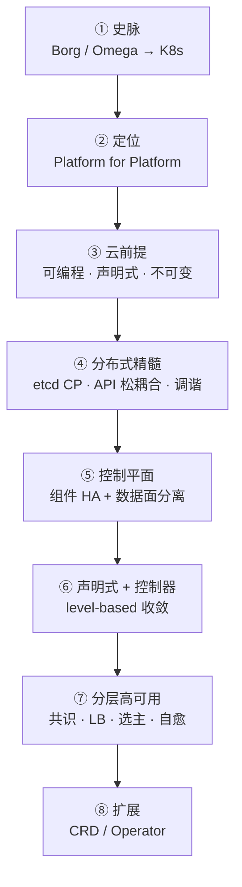
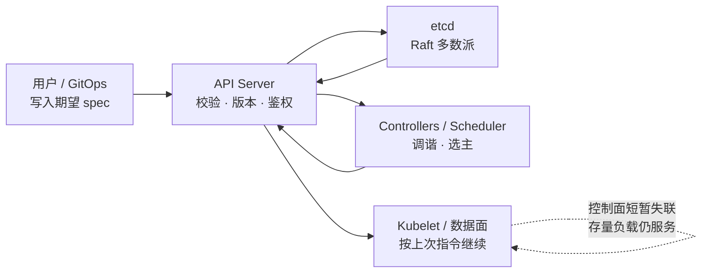
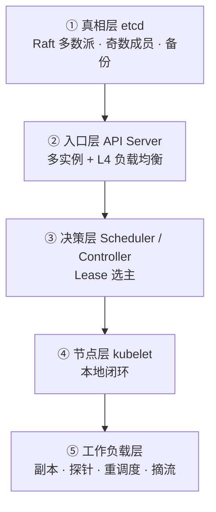

# Kubernetes 设计哲学：声明式 API、控制循环与分层高可用

> Kubernetes 之名源于希腊语，意为「舵手 / 飞行员」。Google 于 2014 年开源该项目，将十余年大规模生产负载经验与社区最佳实践，凝练为一套可对外使用的容器编排平台。[1]
>
> 本文不谈命令与 YAML 细节，而谈其**本体设计**：分布式取舍如何写进架构，分层高可用如何在故障常态下仍可治理——关键不在「少出错」，而在声明式期望、共识存储、多控制器调谐，以及控制面与数据面的分离。

全文暗线：**史脉与定位 → 云前提 → 分布式精髓 → 控制平面与 API → 声明式调谐 → 分层高可用 → 扩展与愿景。** 史实与论断尽量对齐一手文献；CAP / Raft 等通用理论可对照本库 [《分布式系统理论》](./distributed-systems-theory.md)。

先记住总纲：

> **Kubernetes 不是一次性编排脚本，而是一台「分布式控制计算机」：**
>
> 1. 以 etcd 的强一致共享状态为**真相源**；
> 2. 以声明式 API 为**唯一协调语言**；
> 3. 以可失败的控制循环**持续逼近期望态**；
> 4. 控制面短暂失联时，数据面尽量按**上次指令**继续服务。[1][12][18]

---

## 目录

**上篇 · 从何而来、是什么**

1. [一条主线：问题如何层层展开](#1-一条主线问题如何层层展开)
2. [发展脉络：Borg → Omega → Kubernetes](#2-发展脉络borg--omega--kubernetes)
3. [Kubernetes 是什么（与不是什么）](#3-kubernetes-是什么与不是什么)
4. [核心理念：Platform for Platform](#4-核心理念platform-for-platform)

**中篇 · 分布式精髓如何立身**

5. [云基础设施的三个前提](#5-云基础设施的三个前提)
6. [分布式精髓：共享真相、松耦合与持续收敛](#6-分布式精髓共享真相松耦合与持续收敛)
7. [控制平面：组件、控制论与数据面分离](#7-控制平面组件控制论与数据面分离)
8. [一切皆在 API 中](#8-一切皆在-api-中)
9. [声明式 API 与控制器模式](#9-声明式-api-与控制器模式)
10. [设计原则精要](#10-设计原则精要)

**下篇 · 高可用、扩展与愿景**

11. [分层高可用：从 etcd 多数派到工作负载自愈](#11-分层高可用从-etcd-多数派到工作负载自愈)
12. [可扩展性：CRD 与 Operator](#12-可扩展性crd-与-operator)
13. [愿景：软件的通用控制平面](#13-愿景软件的通用控制平面)
14. [总结](#14-总结)
15. [参考文献](#15-参考文献)



---

## 1. 一条主线：问题如何层层展开

请按「提问顺序」阅读，而非名词堆砌：

| 步骤 | 核心问题 | 对应章节 |
|:----:|----------|----------|
| **①** | 为何需要这类系统？经验从何而来？ | §2 史脉 |
| **②** | 它管什么、不管什么？ | §3–§4 定位 |
| **③** | 云时代基础设施须先满足什么？ | §5 三前提 |
| **④** | **分布式精髓是什么？状态如何跨节点协调？** | **§6** |
| **⑤** | 控制平面如何组成？与数据面如何分工？ | §7–§9 |
| **⑥** | 官方原则如何约束实现？ | §10 |
| **⑦** | **高可用如何分层落地？边界在哪？** | **§11** |
| **⑧** | 同一套机制如何扩展到任意领域？ | §12–§13 |

---

## 2. 发展脉络：Borg → Omega → Kubernetes

### 2.1 三代系统

Burns / Grant / Oppenheimer 在 *Borg, Omega, and Kubernetes* 中区分了 Google 内部三代容器管理系统：[2]

| 系统 | 时期 | 定位 |
|------|------|------|
| **Borg** | 约 2003–2004 起 | 内部大规模集群管理：数千应用、数十万作业、多集群、数万台机器。[3] |
| **Omega** | 约 2013 前后 | Borg 后继实验：共享持久状态 + 乐观并发，控制面拆为对等组件。[2][4] |
| **Kubernetes** | 2014 开源，2015 达 1.0 | 面向外部开发者与公有云；吸收前两代经验，**并非 Borg 源码开源**。[2] |

更严谨的表述是：Kubernetes **吸收 Borg / Omega 的设计理念**。Brian Grant（Borg 技术负责人之一、Omega 创始人、Kubernetes 设计负责人）指出：Omega 的许多属性都能在 Kubernetes 中看到；他有时称其「更像开源的 Omega，而非开源的 Borg」。Scheduling Unit 等概念随后演进为 Pod。[5]

从分布式视角，三代演进留下三条遗产：

1. **共享集群状态**作为协调枢纽（Omega / Kubernetes 尤甚）；
2. **异步控制器**监视状态变化并写回观测结果；
3. Kubernetes 相对 Omega 的关键升级：状态**不直接暴露存储**，而必须经 **REST API** 完成版本控制、校验与策略——以服务更多样、更不可信的客户端。[2]

### 2.2 关键节点（可核验）

| 时间 | 事件 |
|------|------|
| **2014-06** | 仓库首批提交；Eric Brewer 在 DockerCon 宣布项目。[6] |
| **2014** | Microsoft、Red Hat、IBM、Docker 等加入社区。间接开源 Kubernetes 而非 Borg：内部系统过重，但设计思想可产品化。 |
| **2015-07-21** | Kubernetes **1.0** 发布；捐赠给新成立的 **CNCF**。[6][7] |
| **2016–2018** | 生态主流化：Prometheus、Istio（2017）、托管服务（如 EKS）等成熟；KubeCon 成为主会场。 |

CNCF 旨在建立可持续的云原生生态；Kubernetes 是其种子项目，其后还包括 Prometheus、gRPC、CoreDNS 等。[7]

---

## 3. Kubernetes 是什么（与不是什么）

### 3.1 定义

Kubernetes 是可移植、可扩展的**开源平台**，用于管理容器化工作负载与服务，同时支持**声明式配置**与**自动化**。[1]

生产集群由**控制平面**与多台**工作节点**组成：前者做全局决策并响应事件；后者托管 Pod。生产环境中二者均横向复制，以提供容错与高可用。[18]

### 3.2 核心能力（节选）

| 能力 | 含义 |
|------|------|
| 服务发现与负载均衡 | DNS / VIP；流量升高时可分散负载 |
| 存储编排 | 自动挂载所选存储系统 |
| 自动发布与回滚 | 按期望状态受控推进实际状态 |
| 自动装箱 | 按 CPU / 内存请求摆放容器 |
| 自愈 | 重启、替换失败容器；按健康检查摘流 |
| 密钥与配置管理 | 不重建镜像即可更新 Secret / Config |
| 水平扩展 | 命令、UI 或基于指标自动扩缩 |
| 可扩展设计 | 不必改上游源码即可扩展集群 |

### 3.3 明确边界：它不是什么

1. **不是**大而全的 PaaS——提供构建开发者平台的积木，刻意保留用户选择权。[1]
2. **不是**传统「编排器」——编排指固定工作流「先 A 再 B 再 C」；Kubernetes 是一组独立、可组合的控制过程，持续把当前状态推向期望状态。[1]

> **要点**：用**持续收敛**替代中心化剧本——这是分布式精髓的最短表述。

### 3.4 平台边界

| 类别 | 典型组件 | 说明 |
|------|----------|------|
| 镜像分发 | Registry / OCI 仓库 | 制品供给 |
| 网络 | Calico、Cilium、Flannel、CoreDNS | Pod 网络与集群 DNS |
| 入口 / LB | Ingress、云厂商 LB、MetalLB | 工作负载对外流量 |
| 可观测 | Prometheus、OpenTelemetry | 指标 / 追踪 / 日志 |
| 安全 | RBAC、网络策略、策略引擎 | 认证授权与隔离 |
| 服务网格 | Istio、Linkerd | 流量治理、mTLS |

> **要点**：Kubernetes 负责「如何声明与收敛」；周边生态负责「具体实现插件」。

---

## 4. 核心理念：Platform for Platform

Kubernetes 的定位是 **Platform for Platform**——用来构建分布式系统的分布式系统。首要用户是分布式应用开发者（从中等规模网站到 TiDB 一类复杂数据系统）。

「平台之平台」催生云原生生态：上层可经 CRD / Operator 声明式扩展，而不必每次重造控制平面。官方架构要求与此一致：可扩展、可自动化；声明式是自愈的关键。[8]

---

## 5. 云基础设施的三个前提

Kubernetes 建立在云计算将基础设施「产品化」之后的三个前提之上。

| 序号 | 前提 | 含义 |
|:----:|------|------|
| **①** | **可编程** | 计算 / 存储 / 网络以 API 驱动；可复用并堆叠更高抽象。 |
| **②** | **声明式** | 用户描述结果，平台负责到达路径——降低分布式环境下的协调复杂度。 |
| **③** | **不可变** | 以版本化制品**替换**运行单元，避免就地变更导致配置漂移。[1] |

与 ③ 相关、但不可混为一谈：

1. **无侵入性**：应用通常无需为适配 Kubernetes 改写业务代码。[8]
2. **可移植性与有状态支持**：PV / PVC 屏蔽存储差异，有状态负载亦可迁移恢复。[9]

---

## 6. 分布式精髓：共享真相、松耦合与持续收敛

若仅用「容器编排」理解 Kubernetes，会错过真正难点。它首先是一台**分布式控制系统**，精髓可收为四条。

### 6.1 ① 一份共享真相源（CP 存储）

全部集群对象落在 **etcd**：强一致、高可用的分布式键值存储，即 Kubernetes 的 backing store。[18][19]

- 共识算法：**Raft**；
- 写入条件：多数派确认（quorum = \(\lfloor n/2\rfloor + 1\)）；
- 效果：成员失败时仍保持**单一、有序**的状态历史，从根本上避免脑裂。[20][21]

在 CAP 语言下（见 [《分布式系统理论》](./distributed-systems-theory.md)）：etcd 偏向 **CP**——多数派不可达时，**宁可停止写入，也不交出两份互相矛盾的集群真相**。[19][20]

> **纪律一**：关于「集群应该是什么样」的真相，只能有一份。

### 6.2 ② 唯一协调语言（API 松耦合）

Omega 曾让受信组件直连共享存储；Kubernetes 改为：**仅 API Server 访问 etcd**，其余一律经 API 协作。[2][12]

由此得到：

1. Scheduler、Controller、Kubelet、Operator **互不直连**，只通过 `spec` / `status` 对话；
2. 组件可独立升级、失败、重启，只要最终读到一致期望态并写回观测态；
3. 新控制器只要理解 API，即可加入同一协调网络。

模式本质：**控制逻辑松耦合 + 状态强一致共享**。

### 6.3 ③ 持续收敛，而非一次成功的剧本

| 对比项 | 传统编排器 | Kubernetes |
|--------|------------|------------|
| 执行模型 | 按步骤推进 | 按偏差调谐 |
| 成功标准 | 走完剧本 | 持续逼近期望 |
| 稳态假设 | 可达到静止稳态 | 可能长期达不到完全稳态[11] |

配套机制是 **level-based（电平触发）**：正确性只依赖「当前观测」与「期望」，不依赖是否收到每一个中间事件；边沿触发仅为性能优化。[12]

网络丢事件、进程重启、短暂分区，都被设计成「下一轮再对齐」——这是对抗不可靠通信的默认姿势。

### 6.4 ④ 静态稳定（Static Stability）

官方原则：缺少新指令时（分区或控制面中断），组件应**继续执行上次被告知的行为**。[12]

与 Marc Brooker 的控制面 / 数据面划分同向：数据面在请求路径上；控制面可短时中断，而不必然中断业务。[10]

> **纪律二**：高可用的分布式含义不是「控制面永不挂」，而是「控制面挂了，正在服务的世界尽量不塌」。



---

## 7. 控制平面：组件、控制论与数据面分离

### 7.1 组件一览

控制平面职责：全局决策（如调度），以及检测并响应集群事件（如副本不足时创建 Pod）。[18]

| 组件 | 角色 | 高可用形态 |
|------|------|------------|
| **kube-apiserver** | 控制面前端；集群唯一 API | 无状态水平扩展 + 前置 **L4 LB**（稳定 `controlPlaneEndpoint`）[18][25] |
| **etcd** | 全部集群数据的一致存储 | 奇数成员 + Raft 多数派（生产常见 3 或 5）[19][20] |
| **kube-scheduler** | 为未绑定 Pod 选节点 | 多实例 + **Lease 选主**（同时仅一活跃）[22] |
| **kube-controller-manager** | 运行内置控制器 | 同上，多实例选主[22] |
| **cloud-controller-manager** | 对接云厂商 API | 可水平扩展以容忍失败[18] |

节点侧：**kubelet**（落实 Pod 规约）、可选 **kube-proxy**（Service 网络规则）、容器运行时。[18]

### 7.2 控制论视角

| 平面 | 定义 | 故障含义 |
|------|------|----------|
| **数据平面** | 位于请求路径；随请求量扩展 | 必须尽量保持可用 |
| **控制平面** | 资源管理、容错、部署 | 可短时中断，不必然中断每个请求[10] |

在 Kubernetes 中，**Controller** = 持续运行的控制循环：观察状态，发起变更，使当前态逼近期望态。[11]

设计信条：**多个简单控制器各管一块状态**，而非单体交叉控制环——控制器也会失败，系统须容忍单环失效并由其他部分接管。[11]

> **要点**：通用控制平面首先取决于 **API + 一致性存储**，其次才是「会跑容器」。

---

## 8. 一切皆在 API 中

三条硬约束：

1. 资源结构统一：`apiVersion` / `kind` / `metadata` / `spec` / `status`；
2. 资源动作映射为一致的 API 动词；
3. 工具与库可跨资源类型复用，无需为每种对象定制协议。

结构一致使横切控制器可忽略资源语义差异。官方原则进一步要求：**控制平面透明——无隐藏内部 API**；仅 API Server 与 etcd 通信。[12]

---

## 9. 声明式 API 与控制器模式

### 9.1 声明式 vs 命令式

| | 声明式 | 命令式 |
|--|--------|--------|
| 关注点 | 要什么结果 | 一步步怎么做 |
| 类比 | SQL 描述「想要的数据」 | 多数通用语言逐步改状态 |
| 分布式含义 | 「如何克服故障」交给平台循环 | 调用方自行编排失败与重试 |

用户提交 `spec`（期望），系统负责使实际运行逼近该期望；对应控制器以无限循环监视与调谐。[11]

```text
for {
    actual  := 获取对象 X 的实际状态
    desired := 获取对象 X 的期望状态
    if actual != desired {
        // 执行编排动作，把 actual 推向 desired
    }
}
```

实现要点：

1. Informer 先 `LIST` 再 `WATCH`，在本地缓存上调谐——**缓存是运行模型，不只是性能优化**；[23]
2. 调谐必须**幂等**：不假设「刚写完立刻读到自己的写入」；下一轮会再次对齐。[23]

### 9.2 与健壮性的衔接

官方将集群视为**持续变化**的系统。容错靠**持续收敛**，而非一次性排障剧本。[11]

---

## 10. 设计原则精要

摘自官方设计原则中与分布式 / 高可用最相关的条目：[12]

| 类别 | 原则 | 含义 |
|------|------|------|
| API | 全部 API 应声明式 | 字段表达期望态，而非「去执行某动作」 |
| API | 对象应可组合 | 互补原语，而非不透明大包 |
| API | 无隐藏内部 API | 控制面透明 |
| API | `status` 可仅凭观察重建 | 历史只是优化，非正确性前提 |
| 控制逻辑 | **Level-based（电平触发）** | 只凭期望态与观测态即可正确运行 |
| 控制逻辑 | 开放世界假设 | 容忍外部角色；被管理的 Pod 被删后，控制器再补 |
| 控制逻辑 | 组件自愈、优雅降级 | 缓存周期性刷新；过载时优先保核心动作 |
| 架构 | 仅 API Server 访问 etcd | 其他组件经 API 协作 |
| 架构 | 分区时继续执行上次指令 | **静态稳定** |
| 架构 | 优先 Watch 而非轮询 | 事件驱动收敛 |
| 架构 | 单节点失陷不应毁掉集群 | 故障域隔离 |

---

## 11. 分层高可用：从 etcd 多数派到工作负载自愈

> **总判**：Kubernetes 的高可用，不是某一层「多副本」的口号，而是**按故障域分层**：

| 层 | 手段 | 目标 |
|:--:|------|------|
| **①** | 共识（etcd / Raft） | 真相正确 |
| **②** | 水平扩展 + L4 LB | 入口可达 |
| **③** | Lease 选主 | 单一活跃调谐者 |
| **④⑤** | 节点闭环 + 负载自愈 | 业务连续性 |
| **—** | 控制面 / 数据面分离 | 静态稳定 |



### 11.1 ① 真相层：etcd 多数派

| 要求 | 说明 |
|------|------|
| 多成员运行 | 生产以多节点 etcd 运行，并定期备份；常见建议为五成员等。[19] |
| 奇数规模 | quorum = \(\lfloor n/2\rfloor + 1\)；向奇数集群盲目加节点，**容错未必提升**。[20] |
| 忌自动伸缩 | 扩容换可用性权衡，**不自动提高吞吐**；避免对 etcd 做自动伸缩。[19] |
| 备份关键 | 丢失全部控制面时，etcd 快照是灾难恢复资产。[19] |

运维警示：心跳与磁盘 I/O 饥饿会导致选主抖动；**无主则无法推进状态变更**（例如无法调度新 Pod）。[19]

| 拓扑 | 做法 | 取舍 |
|------|------|------|
| **Stacked** | etcd 与控制面同机 | 简单；一节点故障同时损失 etcd 成员与控制面实例 |
| **External etcd** | etcd 独立主机 | 故障域解耦更好；主机约翻倍（至少 3+3）[24] |

### 11.2 ② 入口层：API Server 水平扩展与负载均衡

`kube-apiserver` 无状态、可水平扩展；权威状态在 etcd——因此是控制面 HA 中最干净的一层。[18]

多实例**不足以**构成入口高可用：kubectl、kubelet、控制器与集群内组件必须认**同一个稳定入口**。kubeadm HA 要求：

1. 先建 apiserver 负载均衡；
2. 将其地址设为 `controlPlaneEndpoint`；
3. 使用 **TCP 转发型** LB；
4. 对 `:6443` 做 TCP 健康检查；
5. LB 地址与 `ControlPlaneEndpoint` 始终一致。[25]

#### 11.2.1 六条硬性原则

| # | 原则 | 做法 | 原因 |
|:-:|------|------|------|
| 1 | **只用 L4** | HAProxy `mode tcp` / Nginx `stream` / 云 NLB | apiserver 自行终结 mTLS；L7 终结打断证书链 |
| 2 | **单一稳定入口** | DNS → VIP / NLB → 多台 `:6443` | 客户端只配置一个 endpoint |
| 3 | **主动摘流** | TCP `:6443`，或 HTTPS `/readyz` | 不健康实例不得进流量 |
| 4 | **LB 自身也要 HA** | 双机 Keepalived / VRRP，或云托管 NLB | 单 LB 主机 = 新的单点故障 |
| 5 | **证书覆盖入口名** | DNS / VIP 写入证书 SAN | 否则 TLS 名称校验失败 |
| 6 | **避免鸡生蛋** | 控制面 LB 不依赖 MetalLB / `Service type=LoadBalancer` | 后者本身依赖可用的 apiserver |

#### 11.2.2 按环境选型

| 环境 | 推荐做法 |
|------|----------|
| **公有云** | AWS NLB / GCP TCP LB / Azure LB；`controlPlaneEndpoint` 用 **DNS 名**；托管 K8s 通常已内置 |
| **自建 / 裸机** | **Keepalived（VIP）+ HAProxy（TCP）**（成熟组合）；或 **kube-vip**；或 Nginx `stream` + Keepalived[26] |
| **实验 / POC** | 单机 HAProxy 可演示；**生产勿用**（LB 本身是 SPOF） |

VIP 协商通常要求主机处于**同一二层 / 同子网**；跨子网可改用 BGP 等 L3 方案。kube-vip 可选 ARP（L2）或 BGP（L3）。[26]

#### 11.2.3 配置示意与注意点

```haproxy
defaults
  mode tcp
  timeout client  300s   # Watch / exec / port-forward 等长连接
  timeout server  300s
  timeout connect 10s

frontend k8s-api
  bind *:6443
  default_backend apiservers

backend apiservers
  balance roundrobin     # 或 leastconn；通常无需 sticky
  option tcp-check
  server cp1 10.0.0.11:6443 check fall 3 rise 2 inter 5s
  server cp2 10.0.0.12:6443 check fall 3 rise 2 inter 5s
  server cp3 10.0.0.13:6443 check fall 3 rise 2 inter 5s
```

1. **不必会话粘滞**：任意健康实例均可服务；
2. **超时放宽**：Watch / exec / port-forward 为长连接；
3. Keepalived 用 `vrrp_script` 检查 HAProxy / `:6443`，进程挂则漂 VIP；
4. 初始化前用 `nc` 验证：连接拒绝（服务未起）可接受，**超时**说明网络未打通。[25]

#### 11.2.4 落地检查清单

1. `controlPlaneEndpoint = api.example.com:6443`（DNS → VIP / NLB）
2. 证书 SAN 覆盖该 DNS / VIP
3. LB 到全部控制面 `:6443` 互通；对外只暴露 LB 端口
4. 健康检查失败能摘除节点；摘除后 kubectl / kubelet 仍可用
5. LB 双活或云托管，避免单机代理
6. 控制面与 LB 尽量跨故障域（机架 / 可用区）
7. 监控后端 up/down、连接数与延迟（apiserver 延迟常受 etcd 牵动）

> **要点**：云上 = 托管 NLB + DNS；裸机 = Keepalived + HAProxy（TCP）或 kube-vip；一律 **L4 passthrough**，禁止在 LB 上终结 apiserver TLS。[25][26]

### 11.3 ③ 决策层：Lease 选主

Scheduler 与 Controller Manager 若多副本同时积极调谐，会互相冲突。Kubernetes 用 `coordination.k8s.io` **Lease** 做选主：

1. 同一时刻仅领导者执行主循环，其余热备；
2. 领导者须在租约期内续约，否则他者接管。[22]

模式：**active / passive**——短租约换快速故障转移，「单一写者」避免双重控制。

### 11.4 ④⑤ 节点与工作负载层：分层自愈

| 层级 | 机制 | 作用 |
|------|------|------|
| 容器 | `restartPolicy` 重启失败容器 | 进程级快速回收 |
| 工作负载 | Deployment 等维持副本；节点不可用时重调度 | 补齐期望副本 |
| 存储 | 节点故障后卷再挂到新 Pod | 有状态可迁移 |
| 流量 | 不健康 Pod 从 Endpoints 摘除 | 避免打到坏实例 |
| 节点 | kubelet 保证容器在跑 | 每节点闭环[13] |

探针切开故障域：[14]

| 探针 | 行为 |
|------|------|
| **Liveness** | 卡住时可重启，以重启换可用性 |
| **Readiness** | 未就绪则摘流量，**不强制杀进程** |
| **Startup** | 给慢启动留出发时间，避免误杀 |

### 11.5 五条「为何抗造」

| # | 理由 | 含义 |
|:-:|------|------|
| 1 | 声明期望，而非编排步骤 | 失败后再次调谐即可[11][13] |
| 2 | 控制循环永不停止 | 持续缩小 current 与 desired 差距[11] |
| 3 | 多控制器、职责拆分、可失败 | 单环挂掉不致全局失控[11] |
| 4 | 探测驱动的故障域隔离 | 重启、摘流、慢启动各司其职[14] |
| 5 | 控制面 / 数据面分离 + 静态稳定 | 控制面短中断时存量负载仍可服务[10][12] |

### 11.6 与 Borg 的对应（血统，非源码）

Borg 描述了大规模下调度、隔离与运维实践。[3] Kubernetes 继承的是**「规模下故障是常态」**这一工程假设，并产品化为：共识存储、声明式 API、可失败控制器与分层自愈。[2]

### 11.7 能力边界（避免神话化）

| 层次 | 能保证 | 不能保证 |
|------|--------|----------|
| etcd / 控制面 | quorum 内状态不脑裂；经 L4 LB 暴露稳定 API 入口 | quorum 丢失后写入停摆；不替代备份；LB 单点仍拖垮入口 |
| 工作负载自愈 | 替换失败实例、维持期望副本 | 修不好错误配置、业务 bug、容量不足[13] |
| 静态稳定 | 控制面短暂失联时尽量维持存量服务 | 不能在无控制面时无限期完成扩缩、调度、发布 |

> **公式**：高可用 ≈ 正确的一致性边界 × 分层冗余 × 正确的期望声明 × 合理的容量与探针。

---

## 12. 可扩展性：CRD 与 Operator

若止于内置资源，Kubernetes 只是「容器调度器」。真正使其成为 Platform for Platform 的，是**同一套分布式控制循环可被用户扩展**：

| 机制 | 作用 |
|------|------|
| **CRD** | 把领域对象登记进 API Server，获得与内置资源一致的声明式外表 |
| **Controller / Operator** | 把运维知识编码为持续调谐逻辑 |

CNCF 白皮书：Operator = 声明式状态承载领域知识；技术上 Controller 是实现，Operator 常指「带运维知识的控制器 + CRD」。[15]

> **闭环**：史脉给出规模假设 → 共享真相与 API 给出协调语言 → 多控制器给出可失败收敛 → 分层 HA 给出故障域策略 → CRD / Operator 把同一精髓交给每个领域。

---

## 13. 愿景：软件的通用控制平面

长远愿景不止于容器：以 **Kubernetes API 作为更广泛的软件控制平面**——虚拟机、物理设备、外部 SaaS 均可纳入同一声明式与调谐模式。

> **要点**：先统一「如何描述、如何达成共识、如何在故障下收敛」，再让各领域填写「收敛什么」。

---

## 14. 总结

| # | 命题 | 要点 |
|:-:|------|------|
| 1 | 血统 | 经验来自 Borg / Omega；产品是第三代开源系统，不是 Borg 开源版[2] |
| 2 | 本质 | 独立可组合的控制过程，而非固定工作流编排器[1] |
| 3 | 分布式精髓 | 一份强一致真相 + API 松耦合 + level-based 收敛 + 静态稳定[12][19] |
| 4 | 语言 | 声明式 API + 标准化资源模型[12] |
| 5 | 引擎 | 多控制器调谐；Lease 选主；API Server + L4 LB[11][18][22][25] |
| 6 | 高可用 | 共识 → 入口 → 选主 → 节点闭环 → 负载自愈；边界清晰[13][19][24][25] |
| 7 | 前途 | 经 CRD / Operator 向外生长[15] |

> **收束**：用分布式纪律（一份真相、可失败组件、电平触发收敛）驾驭故障；用分层高可用同时保住「控制面正确」与「数据面继续服务」。

---

## 15. 参考文献

| 编号 | 文献 / 文档 | 说明 |
|------|-------------|------|
| [1] | Kubernetes Documentation, *Overview*. https://kubernetes.io/docs/concepts/overview/ | 定义、能力、「不是编排器」 |
| [2] | Burns, Grant, Oppenheimer, *Borg, Omega, and Kubernetes*, ACM Queue 2016. https://queue.acm.org/detail.cfm?id=2898444 | 三代系统；共享状态与 API 门面 |
| [3] | Verma et al., *Large-scale cluster management at Google with Borg*, EuroSys 2015. https://research.google/pubs/pub43438/ | Borg 规模与实践 |
| [4] | Schwarzkopf et al., *Omega*, EuroSys 2013. | Omega 共享状态与多调度器 |
| [5] | Kubernetes Podcast, *Ep. 43 — Brian Grant*. https://kubernetespodcast.com/episode/043-borg-omega-kubernetes-beyond/ | 「更像开源 Omega」口述 |
| [6] | Kubernetes Blog, *10 Years of Kubernetes* (2024). https://kubernetes.io/blog/2024/06/06/10-years-of-kubernetes/ | 2014 宣布、2015-07-21 达 1.0 |
| [7] | CNCF 成立公告 (2015-07-21). https://www.cncf.io/announcements/2015/06/21/new-cloud-native-computing-foundation-to-drive-alignment-among-container-technologies/ | CNCF 与种子技术 |
| [8] | Design Proposals Archive, *Architecture*. https://github.com/kubernetes/design-proposals-archive/blob/main/architecture/architecture.md | 可扩展、声明式与自愈 |
| [9] | Kubernetes Documentation, *Persistent Volumes*. https://kubernetes.io/docs/concepts/storage/persistent-volumes/ | PV / PVC |
| [10] | Marc Brooker, *Control Planes vs Data Planes* (2019). https://brooker.co.za/blog/2019/03/17/control | 控制面 / 数据面 |
| [11] | Kubernetes Documentation, *Controllers*. https://kubernetes.io/docs/concepts/architecture/controller/ | 控制循环、多控制器 |
| [12] | Design Proposals Archive, *Design Principles*. https://github.com/kubernetes/design-proposals-archive/blob/main/architecture/principles.md | level-based、静态稳定 |
| [13] | Kubernetes Documentation, *Self-Healing*. https://kubernetes.io/docs/concepts/architecture/self-healing/ | 分层自愈与边界 |
| [14] | Kubernetes Documentation, *Configure Probes*. https://kubernetes.io/docs/tasks/configure-pod-container/configure-liveness-readiness-startup-probes/ | 探针语义 |
| [15] | CNCF, *Operator White Paper*. https://tag-app-delivery.cncf.io/whitepapers/operator/ | Operator 模式 |
| [16] | Kubernetes Documentation, *Pod Lifecycle*. https://kubernetes.io/docs/concepts/workloads/pods/pod-lifecycle/ | Pod 生命周期 |
| [17] | Kubernetes Community, *API Conventions*. https://github.com/kubernetes/community/blob/main/contributors/devel/sig-architecture/api-conventions.md | 资源惯例 |
| [18] | Kubernetes Documentation, *Cluster Architecture*. https://kubernetes.io/docs/concepts/architecture/ | 控制面 / 节点组件 |
| [19] | Kubernetes Documentation, *Operating etcd clusters*. https://kubernetes.io/docs/tasks/administer-cluster/configure-upgrade-etcd/ | etcd HA、备份 |
| [20] | etcd Documentation, *FAQ*. https://etcd.io/docs/v3.5/faq/ | quorum 与奇数成员 |
| [21] | Ongaro & Ousterhout, *Raft*, USENIX ATC 2014. https://raft.github.io/raft.pdf | Raft 共识 |
| [22] | Kubernetes Documentation, *Leases*. https://kubernetes.io/docs/concepts/architecture/leases/ | Lease 与选主 |
| [23] | Kubernetes Blog, *controller-runtime Cache* (2026). https://kubernetes.io/blog/2026/07/29/controller-runtime-cache-explained/ | Informer、幂等调谐 |
| [24] | Kubernetes Documentation, *HA Topology*. https://kubernetes.io/docs/setup/production-environment/tools/kubeadm/ha-topology/ | Stacked vs External etcd |
| [25] | Kubernetes Documentation, *HA with kubeadm*. https://kubernetes.io/docs/setup/production-environment/tools/kubeadm/high-availability/ | TCP LB、`:6443`、`controlPlaneEndpoint` |
| [26] | kubeadm, *HA considerations*. https://github.com/kubernetes/kubeadm/blob/main/docs/ha-considerations.md | Keepalived + HAProxy、kube-vip |
