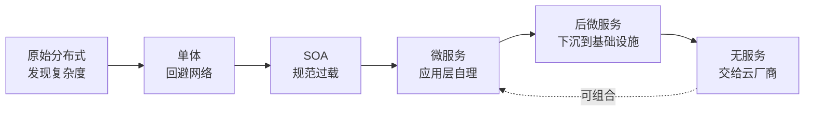

# 服务架构演进史：复杂度的转移

> 后端工程师的架构知识，往往是在工作中一点一点捡起来的：数据一致性踩坑了，才体会事务的重要；服务改用 Kubernetes 部署，才感受到声明式 API 对运维的便利；性能遇到瓶颈，才加上缓存。每块都懂一点，但这些知识之间是什么关系、为什么要这么设计，却很难形成体系。
>
> 本文是对周志明《凤凰架构》第一章「架构的演进」的读后整理，并补充可核验的一手材料与时间线。全文按原始分布式、单体、SOA、微服务、后微服务、无服务的代际脉络展开，贯穿始终的暗线是：**复杂度不会消失，只会转移。**

每一代架构风格的诞生，都是因为上一代遇到了它解决不了的具体问题。理解这条暗线，比记住任何一张架构图都更有用。

先给一个直接答案：

> **好的架构演进，不是消灭复杂度，而是把当前最痛的那种复杂度，从开发者的日常视野中移走——有时下沉到基础设施，有时交给云厂商。**

---

## 目录

1. [原始分布式时代](#1-原始分布式时代)
2. [单体系统时代](#2-单体系统时代)
3. [SOA 时代](#3-soa-时代)
4. [微服务时代](#4-微服务时代)
5. [后微服务时代](#5-后微服务时代)
6. [无服务时代](#6-无服务时代)
7. [总结：复杂度如何转移](#7-总结复杂度如何转移)
8. [附录 A：大型网站架构的实践演进路径](#附录-a大型网站架构的实践演进路径)
9. [附录 B：关键技术谱系简表](#附录-b关键技术谱系简表)
10. [参考文献](#参考文献)

---

## 1. 原始分布式时代

通常我们会认为：服务架构从单体开始，为了逃离「大泥球」才搞分布式。历史上恰恰相反——对分布式的探索在 20 世纪 70 年代就已开始。

那时单机算力极其有限：16 位处理器、主频往往不到 5 MHz，单机直接卡住了软件能做到的规模上限。人们不得不寻找多台计算机协作支撑同一套软件的方案。这一阶段的中间成果影响深远，例如：

- 惠普 / Apollo 的 **NCA**（Network Computing Architecture）可视作远程服务调用的早期雏形；
- 卡内基·梅隆大学的 **AFS**（Andrew File System）是分布式文件系统的重要早期实践；
- MIT 的 **Kerberos** 为分布式认证与访问控制奠定了基础，至今仍影响 Windows、macOS 等系统的登录与认证。

### 1.1 「透明调用」的理想

受 UNIX 设计风格影响，当时有一个重要预设：**分布式环境中的服务调用、资源访问应尽可能透明**，开发者不必关心目标在本地还是远程。

> 保持接口与实现的简单性，比系统的任何其他属性——包括准确性、一致性和完整性——都来得更加重要。  
> —— Richard P. Gabriel 所概括的「Worse is Better」取向（与 UNIX / Lisp 共同体对「简单优先」的讨论相关）[^gabriel]

理想很美，但一旦触碰到「远程」，网络的不确定性立刻摊开一整张问题清单：

| 问题域 | 典型关注点 |
| -------- | ------------ |
| 定位与调度 | 服务发现、负载均衡 |
| 故障与韧性 | 超时、分区、熔断、隔离、降级 |
| 表示与传输 | 序列化、传输协议 |
| 安全与权限 | 认证、授权、传输加密 |
| 正确性 | 分布式一致性 |

这些探索催生了 **RPC**、**DFS** 等概念。1984 年，Xerox PARC 的 Andrew Birrell 与 Bruce Nelson 发表经典论文 *Implementing Remote Procedure Calls*[^birrell-rpc]；同期 Sun 围绕 NFS 推动了 pragmatic 的 ONC RPC / XDR 实现[^sun-rpc]。人们也得到一条价值千金的教训：

> **某个功能能够进行分布式，并不意味着它就应该进行分布式。** 强行追求透明的分布式操作，只会自寻苦果。

同一教训后来被 L. Peter Deutsch 等人总结为「分布式计算的八大谬误」：网络可靠、延迟为零、带宽无限……这些默认假设在长期运行中几乎全部不成立[^fallacies]。

### 1.2 这一代面对的复杂度

原始分布式时代的故事，是一次**发现复杂度**的过程：探索者试图用「透明调用」把分布式复杂度屏蔽掉，让开发者像写本地程序一样写分布式程序。现实证明，网络不确定性无法假装不存在。这次失败的意义不在于产出了多少可用系统，而在于让行业认清了分布式复杂度的真实面貌。

于是当硬件性能随摩尔定律起飞后，人们做了一个务实的选择：**既然分布式的复杂度屏蔽不了，那就先别分布式了。**

---

## 2. 单体系统时代

软件退回到单体——所有代码跑在同一个进程里，不用想网络，不用想跨机一致性。

大型单体经常是微服务书籍批判的对象，但要注意定语——**「大型的」**。小型单体不仅易于开发、测试、部署，且模块间是进程内调用，没有 IPC 开销，运行效率很高。三个人的团队、一台机器撑得住的系统，上微服务往往是给自己找麻烦。

### 2.1 缺陷：缺乏自治与隔离

进程内调用简单高效，但故障也难以隔离：某个模块的 bug 能导致整个系统崩溃。大型系统意味着多人协作与频繁变更——一个模块的内存泄漏能拖垮整个进程；一次局部升级需要整体停机重启。

> **观念的转变**  
> 单体的设计哲学是「让每一部分尽量不出错」，靠高质量保证高可靠。但系统越大，出错越是必然。从「追求不出错」到正视「出错是必然」，才是微服务得以挑战大型单体的底气所在。

### 2.2 这一代面对的复杂度

单体时代面对的不是分布式复杂度——它根本没有分布式。它面对的是**规模带来的复杂度**：

- **可维护性**：局部改动牵动整体发布；
- **团队协作**：多人改同一代码库，互相踩脚；
- **可靠性**：单点故障拖垮全局。

系统小的时候这些问题都不尖锐；规模一旦上去，它们会同时爆发，且在单体架构下难以根治——因为缺乏隔离与自治。为了获得这种能力，人们再次走向分布式。

---

## 3. SOA 时代

在微服务之前，业界走过一段雄心勃勃的弯路——**SOA**（Service-Oriented Architecture）。

Gartner 分析师 W. Roy Schulte 与 Yefim V. Natis 在 **1996 年** 的研究报告中提出「service-oriented architecture」这一表述[^gartner-soa]。其后 SOAP / WSDL / UDDI 与一长串 WS-\* 规范，在 IBM、Oracle、SAP 等厂商推动下成为企业集成的主流叙事；2006 年前后，OSOA 等产业协作进一步推进 SCA、SDO 等规范[^osoa]。

### 3.1 野心与过载

SOA 不仅要解决技术问题，还想建立一套自上而下的软件研发方法论：如何挖掘需求、如何分解业务、如何编排服务，一揽子全包。它有巨头撑腰，有 SOAP 协议族做底座，有企业服务总线（ESB）做通信管道——从技术可行性上看，确实系统性地回应了分布式服务的主要问题。

但问题恰恰出在「太完美」上。过于精密的规范带来过度的复杂性：SOAP 之上层层叠加 ESB、BPM、SCA、SDO，整个技术栈变成只有少数专业人员才能驾驭的奢侈品。你可能只想让两个服务通个信，却要先搞懂 WSDL、UDDI、SOAP Envelope 这一整套仪式。

> SOA 与 EJB 的失败如出一辙：一旦脱离人民群众，终究会淹没在群众的海洋之中。  
> ——《凤凰架构》

### 3.2 这一代面对的复杂度

SOA 面对的问题与原始分布式类似——分布式环境下的服务通信、发现、编排。不同的是，它试图用一套大一统方案把所有问题一揽子解决。**解决方案本身成了新的复杂度来源**：协议过重，对开发者强加了大量不需要的东西。技术上可行，实践中过载。

回过头看，从原始分布式到 SOA 这漫长数十年，应用受架构复杂度的牵绊越来越大，距离当年「透明调用」的初心也越来越远。微服务带着对这段历史的自省而来。

---

## 4. 微服务时代

2014 年，James Lewis 与 Martin Fowler 给出了影响广泛的微服务定义：将单一应用构建为一组小型服务，各自运行在独立进程中，通过轻量机制（常为 HTTP 资源 API）通信，围绕业务能力组织，并可独立部署[^fowler-ms]。

其中的关键词是 **smart endpoints and dumb pipes（强终端、弱管道）**——智能留在端点，管道保持简单。服务更像经典 UNIX 过滤器：接收请求、施加逻辑、产生响应；编排依赖简单的 REST 式协议或轻量消息总线，而不是 WS-Choreography、BPEL 或中心化 ESB[^fowler-ms]。

### 4.1 容错设计与「凤凰」含义

微服务还强调容错性设计——这是「凤凰」特性的关键。不再幻想服务永远稳定，而是接受出错的现实，用熔断、隔离、降级来应对。**可靠系统完全可以由会出错的服务组成**；每个部分都能死掉并重生，系统整体却尽量保持在线。

### 4.2 自由的代价

微服务丢掉了 SOA 沉重的包袱，但分布式环境下的复杂度并没有消失。SOA 试图用统一规范解决的那些问题——服务发现、负载均衡、通信协议、容错——一下子全回来了，而且因为「自由选择」，每个问题都有一长串备选方案：

| 问题 | 常见选项（示例） |
| ------ | ------------------ |
| 远程调用 | Dubbo、gRPC、Thrift、Finagle…… |
| 服务发现 | Eureka、Consul、Nacos、ZooKeeper、etcd…… |
| 配置 / 熔断等 | Spring Cloud 生态、自研或厂商方案 |

这时面对的是**分布式基础设施的选型与集成复杂度**。Spring Cloud 等全家桶帮普通开发者屏蔽了大部分细节，但把选型决策集中到了架构师桌上。自由是双刃剑：一刃指向 SOA 的复杂规范，夺回了选择权；另一刃朝向自己——选择太多本身就是负担。

如果有下一个时代，能不能既有微服务的自由，又不必在应用层自行解决这些基础设施问题？

---

## 5. 后微服务时代

换一个问题：服务发现、负载均衡、传输安全等，**一定要在应用代码里解决吗**？硬件与基础设施侧早就有对应物：负载均衡器、DNS、TLS。之所以微服务选择在应用层用库解决，往往是因为当时基础设施跟不上软件的灵活性。

容器与编排改变了这一点。当 Kubernetes 成为主流编排平面后，虚拟化的基础设施终于能像软件一样灵活调度——容器技术不仅解决分发部署，也开始承接分布式系统的部分难题。

### 5.1 Kubernetes 与「下沉」

2016 年 Kubernetes 成为 CNCF 首个托管项目；到 **2017 年末**，Docker 宣布支持 Kubernetes、AWS 推出 EKS，行业叙事上常把这一时期视为编排战争实质落幕、K8s 成为事实标准的转折[^k8s-2017][^cncf-k8s]。

以前在 Spring Cloud 里用代码实现的服务发现、配置、负载均衡，可以部分下沉到基础设施：CoreDNS、ConfigMap / Secret、Service / Ingress 等。作者因此更愿称之为「后微服务时代」——目标与微服务相近，但手段变为**应用与基础设施合力**；媒体则常冠以「云原生」[^post-ms]。

### 5.2 Service Mesh：更细的治理粒度

Kubernetes 也不完美。基础设施多以**容器 / Pod** 为粒度，对「单个远程接口」的精细管控力不足。例如：服务 A 调用 B 的两个接口，B1 正常而 B2 持续 500——切不切网络？切了影响 B1，不切继续被 B2 拖垮。

**服务网格（Service Mesh）** 应运而生：通过 Sidecar 代理，在应用几乎无感知的情况下接管通信，实现熔断、认证、可观测等能力，完成业务代码与技术关注点的分离。Buoyant 的 Linkerd 推动了该术语的流行；2017 年 Google / IBM / Lyft 发布的 Istio（数据面常基于 Envoy）则大幅加速了行业采用[^service-mesh]。

### 5.3 这一代面对的复杂度

后微服务把分布式基础设施复杂度从应用代码中剥离，下沉到平台层。架构师头疼的选型问题，越来越多由基础设施统一提供。复杂度搬到了控制平面与声明式配置里，由专职平台团队操持。原始分布式时代追求的「透明的分布式调用」，在三十多年后以另一种形态重新变得可能——这一次，透明度来自**平台而非假装网络不存在**。

---

## 6. 无服务时代

如果说微服务是「分布式这条路」的极致推进，那无服务（Serverless）更像另一条路的起点：**尽量不让开发者感知服务器与集群**。

### 6.1 愿景

开发者主要写业务逻辑（**FaaS**），后端能力直接取用托管服务（**BaaS**），部署、算力、运维交给云。UC Berkeley 2019 年技术报告 *Cloud Programming Simplified* 将其类比为从汇编到高级语言的跨越——不用关心寄存器，只关心业务表达[^berkeley-serverless]。

### 6.2 局限与复杂度形态

局限也很明显：按使用量计费与弹性伸缩往往意味着函数不会常驻，**冷启动延迟**难以完全消除；无状态特性也更契合短任务、事件驱动类负载。业务逻辑复杂、需要长连接或精细状态机的系统，仍需仔细评估。

无服务面对的复杂度和前面几个时代都不太一样。它不再纠结于「服务怎么发现、通信怎么做」——在开发者视角里这些问题被云厂商吞掉了。它面对的是**运维与资源管理的外包**：部署、扩缩容、容量规划、部分监控交给云。代价是交出控制权——冷启动、底层运行时、成本模型往往只能接受厂商给定边界。

微服务与无服务**并非简单替代关系**，而可组合：无服务可作为技术层能力，微服务可作为应用层边界划分方式。

---

## 7. 总结：复杂度如何转移

| 时代 | 核心问题 | 应对方式 | 复杂度去向 |
| ------ | ---------- | ---------- | ------------ |
| 原始分布式 | 网络不确定性被「透明化」掩盖 | RPC / DFS 等探索 | 暴露出来，行业认清代价 |
| 单体 | 规模下的维护、协作、可靠性 | 退回单进程 | 无分布式，但隔离能力缺失 |
| SOA | 分布式通信与治理 | 统一规范 + ESB | 转移到过重的协议与组织流程 |
| 微服务 | 同上，但拒斥重规范 | 轻协议 + 应用内治理库 | 转移到选型与集成 |
| 后微服务 | 应用层治理负担过重 | K8s + Mesh 下沉 | 转移到平台 / YAML / SRE |
| 无服务 | 运维与资源管理 | FaaS + BaaS | 转移到云厂商与成本模型 |

> **一句话**：每一代架构都在做同一件事：把当前最痛的那种复杂度，从开发者的日常视野中移走——有时下沉到基础设施，有时交给云厂商。复杂度没有被消灭，只是不断地转移。

---

## 附录 A：大型网站架构的实践演进路径

上面主线是「架构风格」的思想史。工程现场还有另一条常见叙事：一个网站如何随流量与数据增长，**一步步**拆开单体。以下整理自业界广泛流传的大型网站演进步骤（与《大型网站技术架构》等材料同构），可作为容量驱动视角的补充。

1. **初始单体**  
   应用、数据库、文件同机部署。简单，但很快撞上单机性能与资源上限。

2. **应用与数据分离**  
   应用服务器、数据库服务器、文件服务器分机；按 CPU / 磁盘 / 容量各自选型。

3. **缓存**  
   热点数据进内存（本地缓存或分布式缓存），缓解数据库读压力（常见「二八」访问分布）。

4. **应用服务器集群**  
   横向扩展应用层，配合负载均衡提升并发吞吐。

5. **数据库读写分离**  
   主从复制：写主读从，分担读流量。

6. **反向代理与 CDN**  
   靠近用户缓存静态资源，降低跨地域延迟与源站压力。

7. **分布式文件与分布式数据库**  
   存储与数据量继续膨胀时再引入；业务库拆分（分库）通常优先于过早上分布式数据库。

8. **NoSQL 与搜索引擎**  
   补齐特定查询、检索与扩展场景。

9. **业务拆分**  
   按产品线 / 领域拆成多系统，降低协作与发布耦合。

10. **分布式服务化**  
    将通用能力抽成共享服务，供各业务应用调用——与主文中的 SOA / 微服务叙事汇合。

这条路径强调的是：**瓶颈出现在哪一层，就拆哪一层**；它与「风格演进」并不矛盾，而是同一复杂度转移在容量维度上的展开。

---

## 附录 B：关键技术谱系简表

便于把名词钉在时间线上（仅列与本文相关的锚点，非完整编年史）：

| 时间 | 事件 | 与本文的关系 |
| ------ | ------ | -------------- |
| 1969–1970s | UNIX 在贝尔实验室诞生并传播 | 「简单组合」的工程美学影响后续分布式愿景 |
| 1984 | Birrell & Nelson RPC 论文；Sun NFS / ONC RPC | 远程调用成为一等公民 |
| 1989–1990s | OMG CORBA；其后 Java EE / 中间件繁荣 | 应用层互联互通的标准化尝试 |
| 1994–1997 | 分布式计算八大谬误 | 对「透明远程」幻觉的系统批判 |
| 1996 | Gartner 提出 SOA 表述 | SOA 时代概念起点 |
| 1999–2000s | SOAP / WSDL 等 Web 服务栈 | SOA 工程化底座 |
| 2014 | Lewis & Fowler《Microservices》 | 微服务现代定义 |
| 2016–2017 | K8s 入驻 CNCF；编排格局明朗；Mesh 术语走红 | 后微服务 / 云原生拐点 |
| 2019 | Berkeley Serverless 技术报告 | 无服务作为「云编程模型」的学术表述 |

关于厂商叙事（CORBA → EJB → SOA → Spring / Cloud Foundry → CNCF / K8s → Serverless）确有商业竞争与标准话语权的成分，但**「云原生」本身并非某一家的私有商标**：CNCF 将其界定为在现代动态环境（如公有云、私有云、混合云）中构建和运行可弹性扩展应用的方法，并强调容器、服务网格、微服务、不可变基础设施与声明式 API 等技术集合[^cncf-definition]。理解演进时，宜区分「工程问题」与「厂商叙事」。

---

## 参考文献

[^gabriel]: Richard P. Gabriel, *Lisp: Good News, Bad News, How to Win Big*（含对 “Worse is Better” 的经典讨论）。相关整理亦见于《凤凰架构》对 UNIX 设计哲学的引用说明。  
[^birrell-rpc]: Andrew D. Birrell, Bruce Jay Nelson, “Implementing Remote Procedure Calls,” *ACM Transactions on Computer Systems*, 1984. <https://doi.org/10.1145/2080.357392>  
[^sun-rpc]: Sun Microsystems, NFS / ONC RPC 与 XDR 相关规范与实现（约 1984–1985）；行业史回顾可参考后续 NFS 技术史材料。  
[^fallacies]: L. Peter Deutsch et al., “The Eight Fallacies of Distributed Computing,” Sun Microsystems（Deutsch 1994 年提出前七条，James Gosling 约 1997 年补充第八条）。概述见 <https://en.wikipedia.org/wiki/Fallacies_of_distributed_computing>  
[^gartner-soa]: W. Roy Schulte, Yefim V. Natis, Gartner research note on “Service Oriented” Architectures, 12 April 1996.  
[^osoa]: Open SOA Collaboration（OSOA）关于 SCA / SDO 等规范的产业协作（约 2005–2007），其后相关工作进入 OASIS 等标准化路径。  
[^fowler-ms]: James Lewis, Martin Fowler, “Microservices,” 25 March 2014. <https://martinfowler.com/articles/microservices.html>  
[^k8s-2017]: 2017 年 Docker 宣布产品支持 Kubernetes；AWS 于 2017 年 11 月宣布 Amazon EKS——常被用作编排格局明朗化的行业节点。  
[^cncf-k8s]: Cloud Native Computing Foundation, Kubernetes project page（2016 年接受为托管项目，2018 年 Graduated）. <https://www.cncf.io/projects/kubernetes/>  
[^post-ms]: 周志明，《凤凰架构：构建可靠的大型分布式系统》「后微服务时代」：<https://icyfenix.cn/architecture/architect-history/post-microservices.html>  
[^service-mesh]: William Morgan / Buoyant 对 Service Mesh 的定义与 Linkerd 实践；Istio 项目（2017）与 Envoy 数据面。综述见 Phil Calçado, “Pattern: Service Mesh,” 2017. <https://philcalcado.com/2017/08/03/pattern_service_mesh.html>  
[^berkeley-serverless]: Eric Jonas et al., “Cloud Programming Simplified: A Berkeley View on Serverless Computing,” EECS-2019-3, UC Berkeley, 2019. <https://www2.eecs.berkeley.edu/Pubs/TechRpts/2019/EECS-2019-3.html>  
[^cncf-definition]: CNCF, “Cloud Native Definition.” <https://github.com/cncf/toc/blob/main/DEFINITION.md>  
[^fenix]: 周志明，《凤凰架构：构建可靠的大型分布式系统》，在线版：<https://icyfenix.cn/>（架构演进各章：原始分布式 / 单体 / SOA / 微服务 / 后微服务 / 无服务）。

### 延伸阅读

- 原始分布式：<https://icyfenix.cn/architecture/architect-history/primitive-distribution.html>  
- 微服务：<https://icyfenix.cn/architecture/architect-history/microservices.html>  
- 李智慧，《大型网站技术架构：核心原理与案例分析》（附录 A 路径的常见出处之一）

---
